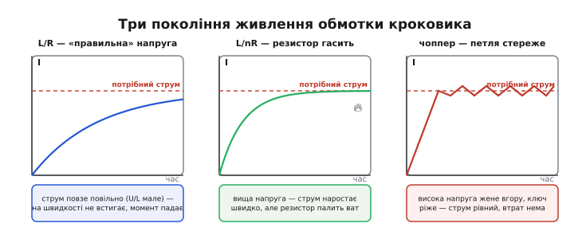

# 📜 Як народилося чопперне керування кроковим

Сьогодні точний кроковий привід коштує копійки: одна мікросхема, два резистори-давачі, два піни GPIO — і каретка 3D-принтера рухається плавно й тихо. Але так було не завжди. Ще на зламі 1970-х і 1980-х «правильно» нагодувати кроковий мотор струмом було окремим інженерним ремеслом: хто наважувався на високу напругу — палив дроти на резисторах, хто боявся — мирився з квелим мотором, що зривається на швидкості. Ця зноска — про те, як від грубого живлення напругою прийшли до **чоппера**, який тримає струм рівним, і хто саме оформив цю ідею в дешевий кремній, від якого й пішов увесь сучасний кроковий привід.

Історія тут повчальна не датами (хоча й ними), а тим, як **проста фізична незручність** — індуктивність обмотки — десятиліттями змушувала інженерів шукати обхідні шляхи, доки хтось не поставив питання руба: а чому ми взагалі керуємо напругою, коли моторові потрібен **струм**?

## Незручність, з якої все почалося

Щоб зрозуміти, чому знадобився чоппер, треба пережити ту саму досаду, що й перші схемотехніки кроковиків. Мотор простий: котушка притягує зуб ротора, і що більший струм у котушці — то сильніше поле й міцніше тримається ротор. Здавалося б, подай на котушку її «паспортну» напругу — і матимеш паспортний струм за законом Ома. Для лампочки чи резистора так і є. Для котушки — ні.

Котушка — це **індуктивність**, а струм в індуктивності не вміє стрибати. Він наростає поступово, і швидкість наростання диктує напруга:

```
U = L · (ΔI / Δt)     →     ΔI / Δt = U / L
```

Ось звідки вся біда. Кроковик робить крок за кроком, і на кожен крок відведено рівно стільки часу, скільки триває пауза між імпульсами. На малих швидкостях паузи довгі — струм устигає доповзти до номіналу, поле повне, момент є. Але щойно кроки частішають, час на крок коротшає, а струм при фіксованій напрузі повзе однаково повільно (U/L мале) — і **не встигає** набратися до кінця кроку. Поле недобирає, момент тане, і на якійсь швидкості ротор зривається й губить кроки. А втрачений крок для кроковика — катастрофа: він рахує кроки, а не міряє положення, тож один загублений крок з'їдає всю точність до кінця руху.

> 🔧 **Навіщо це.** Уся драма крокового привода — це боротьба зі швидкістю наростання струму. Скільки б ви не додавали «розуму» в керування, фізика U = L·(ΔI/Δt) лишається: щоб струм ліз угору швидше, потрібна **більша напруга** на обмотці. Усі три покоління схем, про які далі, — це три різні відповіді на одне питання: як дати обмотці високу напругу для наростання, але не дати струмові перевищити безпечну межу.

## Перше покоління: живити «правильною» напругою (L/R)

Найперший, найочевидніший підхід звали **L/R-драйвом** — або, точніше, **керуванням постійною напругою** (англ. *constant-voltage drive*). Береш блок живлення рівно на «напругу мотора» з наліпки (скажімо, ті самі 3 В) і через ключ подаєш його на обмотку. Струм установлюється сам: I = U/R, де R — опір обмотки. Просто, дешево, і на малих швидкостях працює.

Проблему ви вже знаєте. За низької напруги 3 В струм наростає мляво, і на швидкості обмотка не добирає поля. Мотор виходить кволий: паспортний момент він видає хіба що на повзучих обертах, а спробуй розігнати — зривається. Класична документація виробників так і подавала цей режим: constant-voltage drive дає найгіршу характеристику момент-швидкість із усіх, бо швидкість наростання струму жорстко прив'язана до низької напруги живлення.


*Одна й та сама обмотка, той самий цільовий струм (штрихова лінія) — три способи його досягти. **L/R** (ліворуч): «правильна» низька напруга, струм повзе експонентою й на швидкості не встигає. **L/nR** (посередині): вища напруга женеться струм швидко, зайве гасить послідовний резистор — але той резистор перетворює половину потужності на тепло. **Чоппер** (праворуч): висока напруга кидає струм угору круто, а електронна петля «ріже» живлення, тримаючи струм рівним, — і майже без втрат. Уся історія крокового привода — це рух зліва направо цим малюнком.*

## Друге покоління: висока напруга плюс резистор-гальмо (L/nR)

Раз низька напруга наростає повільно — візьмімо високу. Але тоді струм пролетить крізь номінал і спалить обмотку. Ранній компроміс: поставити **послідовно з обмоткою зовнішній резистор** і живити все це підвищеною напругою. Тоді струм обмежує вже сума опорів (обмотка плюс резистор), а вища напруга розганяє його наростання. Цей режим звали **L/nR-драйвом**: якщо додати резистор такий, що загальний опір стає, скажімо, у п'ять разів більший за опір обмотки, а напругу підняти в ті ж п'ять разів — струм у сталому режимі той самий, а **швидкість наростання** вп'ятеро вища. Документація SGS так і креслила криві: L/R, L/5R і чопперний струм для того самого мотора — і L/5R помітно обганяв простий L/R на швидкості.

Ставало краще — і водночас гидко. Той зовнішній резистор працює гальмом: він мусить постійно спалювати різницю між високою напругою живлення й тим, що «залишає» обмотці. Якщо ви підняли напругу вп'ятеро, то приблизно **чотири п'ятих** усієї потужності осідає на резисторі чистим теплом. Мотор нарешті крутиться бадьоро, але блок живлення гріє повітря, резистори розжарюються, ККД жалюгідний. Для дискового накопичувача чи принтера — марнотратство, яке в масовому виробі терпіти не хочеться.

> 🔧 **Навіщо це.** L/nR — це не «дурний» підхід, а чесний інженерний компроміс своєї доби: пасивний, без жодної електроніки керування, працює завжди. Саме тому він так довго жив. Але він оголив головну істину: щоб швидко наростити струм, обмотці **справді** потрібна висока напруга — питання лише в тому, як прибрати надлишок **без** спалювання його на резисторі. Відповідь напрошувалася: не гасити надлишок теплом, а **вимикати** живлення, щойно струм дійшов до потрібного. Це і є чоппер.

## Стрибок думки: керувати струмом, а не напругою

Ключова зміна в голові була майже філософська. Усі попередні схеми **задавали напругу** й дивилися, який вийде струм. А моторові байдуже до напруги — йому потрібен **струм** заданої величини, бо саме струм робить поле й момент. То чому б не поставити струм у центр і не керувати **ним** напряму?

Механізм виходить напрочуд простий, коли на нього наважишся. У розрив обмотки ставлять маленький **резистор-давач** (англ. *sense resistor*) на частки ома; струм тече крізь нього, і на ньому падає напруга, прямо пропорційна струмові (U = I·R). Цю напругу [компаратор](topic:electronics/comparator) весь час звіряє з опорною — тією, що відповідає бажаному струмові. Живлення при цьому беруть **високе** — щоб струм наростав круто. Щойно струм дорос до заданого (U_давач ≥ U_опорна), компаратор **вимикає** ключ. Струмові нема куди зникнути миттєво (котушка!), тож він замикається кільцем крізь міст і повільно спадає. За коротку паузу ключ знову вмикається — струм знову лізе вгору — і так тисячі разів за секунду. Струм не «який вийде», а **рівно заданий**, з дрібними пилчастими коливаннями коло цільового рівня.

Оце і є **чоппер** (англ. *chopper*, «різак»; *to chop* — рубати) і **керування постійним струмом** (англ. *constant-current drive*). Висока напруга женеться струм угору швидко; петля стереже стелю й вимикає живлення на межі; резистор-давач майже нічого не палить (спад напруги на ньому — частки вольта). Ви отримали найкраще з двох світів: швидке наростання, як у високовольтного L/nR, і мізерні втрати, бо надлишок не гаситься теплом, а **вимикається**.

Аналогія — круїз-контроль в авто, і вона тут точна. L/R — це «тисни на газ рівно наполовину й молися»: на рівному поїдеш, на гору заглухнеш. L/nR — «тисни в підлогу, але волочи за собою причіп-якір, щоб не розігнатися»: їдеш бадьоро, але паливо ллється в нікуди. Чоппер — це справжній круїз-контроль: **тисни в підлогу, але щойно спідометр торкнувся заданого — відпусти газ; упало — знову дай**. Ти тримаєш швидкість рівною, не воюючи з нею постійним тертям. Де аналогія ламається: у чоппера немає «палива, що ллється» на регулюванні — вимкнений ключ втрат майже не має, тоді як реальний двигун і на круїзі палить бензин. Тому чоппер виграє в кроковика не лише рівність струму, а й ККД.

## Хто оформив це в кремній: італійський SGS і зв'язка L297+L298

Ідея керувати струмом через давач і компаратор носилася в повітрі — її втілювали на розсипу транзисторів, операційних підсилювачів і логіки хто як умів. Але зібрати **весь** кроковий інтелект — і генератор послідовності фаз, і подвійний чопперний регулятор струму — в одну недорогу мікросхему, доступну кожному, судилося європейцям.

Це зробив **італійський SGS** — *Società Generale Semiconduttori* («Загальне товариство напівпровідників») з містечка Аграте-Бріанца під Міланом. Компанія мала глибоке коріння: 1972 року SGS злився з іншим італійським виробником — **ATES** (*Aquila Tubi e Semiconduttori*, з міста Л'Аквіла) — у SGS-ATES, згодом SGS Microelettronica. Саме ця італійська фірма на початку 1980-х випустила пару мікросхем, що визначила кроковий привід на десятиліття вперед:

- **L298** — силовий **подвійний H-міст** (англ. *dual full-bridge driver*) у характерному корпусі Multiwatt на 15 виводів: два повні мости, здатні гнати до 2 А на канал (варіант L298N), з усіма потрібними зсувниками рівнів і логікою. Це «м'язи» — ключі, крізь які тече струм обмоток.
- **L297** — **транслятор** (генератор послідовності фаз) плюс **подвійний PWM-чоппер**: він і перекладає команди STEP/DIR у порядок перемикання ключів, і несе на борту дві петлі керування струмом — по одному компаратору й давачевому входу на фазу. Це «мозок»: два піни зовні, а всередині — уся розкладка й регулювання струму.

Разом L297 + L298 давали те, чого доти не існувало як дешевого стандартного вузла: **повний інтерфейс від мікропроцесора до біполярного кроковика з керуванням постійним струмом** — кільком зовнішнім деталям на додачу. Виробничники підхопили це миттєво, бо саме тоді, наприкінці 1970-х і в 1980-х, кроковики полізли в масову техніку — дискові накопичувачі, принтери, плотери, — і всім був потрібен точний, але дешевий спосіб керувати струмом обмоток.

> 🔧 **Навіщо це.** Розподіл «розум окремо, м'язи окремо» (L297 — керування, L298 — силовий міст) виявився настільки вдалим, що дожив донині: сучасні монолітні драйвери класу A4988/DRV8825 — це фактично **обидві мікросхеми в одному корпусі**, транслятор і подвійний чоппер разом із силовими ключами. Коли ви крутите гвинтик «струм фази» на драйвері 3D-принтера, ви задаєте ту саму опорну напругу компаратора, що й у L297 сорок років тому. Ідея не змінилася — змінився лише ступінь інтеграції.

### Про атрибуцію: італійський, потім італійсько-французький — не «американський» і не «російський»

Тут важливо не помилитися з «хто». Мікросхеми L297 і L298 народилися в **італійському** SGS на початку 1980-х і спершу продавалися під маркою SGS. Пізніше — **1987 року** — SGS Microelettronica злився з французькою державною **Thomson Semiconducteurs** у нову компанію **SGS-Thomson Microelectronics** (штаб-квартира в Женеві, перший генеральний директор — італієць Паскуале Пісторіо). Саме тому пізніші даташити L297/L298 несуть логотип «SGS-Thomson»: це **ретроспективний** бренд на вже наявних деталях. А 1998 року компанію перейменували на **STMicroelectronics** — абревіатуру з обох половин.

Отже, коректно так: L297/L298 — розробка **італійського SGS** (згодом італійсько-французька SGS-Thomson, нині STMicroelectronics). Це **не** американська й **не** російська історія — це південноєвропейська напівпровідникова школа, що виросла з італійської та французької державної електроніки й свідомо створювалася, щоб конкурувати з домінуванням американських виробників. Плутати тут національність легко, бо бренд на папірці мінявся тричі, а сам кремній лишався той самий.

*Статус доказовості.* Те, що L297 містив транслятор і подвійний PWM-чоппер, а L298 був подвійним H-мостом на ~2 А, — **тверда, документована технічна фактура** з фірмових даташитів і аплікаційних нот SGS-Thomson. Формування SGS-Thomson 1987 року зі злиття SGS Microelettronica й Thomson Semiconducteurs, керівництво Пісторіо, перейменування на STMicroelectronics 1998-го — **добре засвідчені факти** (Wikipedia та корпоративні історії STMicroelectronics збігаються). А от **точний рік** першого випуску L297/L298 у відкритих джерелах чітко не зафіксований: доступні даташити — це пізніші ревізії (з датами 1990-х–2000-х), а не оригінальні першодруки. Тому обережне «початок 1980-х, під маркою SGS, до злиття 1987 року» — **обґрунтована реконструкція**, а не документально підтверджена дата до року; конкретні «1985/1988», що часом трапляються в мережі, найпевніше є датами ревізій даташитів, а не дебютом деталі.

## Люди й тексти, що це закріпили

За мікросхемами стоять інженери, які не лише спроєктували кремній, а й **навчили** ним користуватися ціле покоління схемотехніків — через аплікаційні ноти, що десятиліттями лишалися підручником крокового привода.

**Герберт Закс** (нім./англ. *Herbert Sax*), інженер застосувань SGS-Thomson, написав аплікаційну ноту **AN235 «Stepper Motor Driving»** — стислий, але вичерпний виклад того, чому кроковикові потрібне саме керування струмом і як його роблять чоппером. Її фірмовий код **AN235/0788** за прийнятою в SGS системою означає **липень 1988 року** (0788 = 07-й місяць 88-го). Ця нота роками була першим, що читав інженер, беручись за кроковик, — і саме вона акуратно розкладала три покоління (L/R, L/nR, чопперний constant-current) із кривими момент-швидкість.

Поруч стоїть окрема нота **AN468 «Constant-Current Chopper Drive Ups Stepper-Motor Performance»** — уже самою назвою («…підносить характеристику кроковика») вона декларує головну тезу: чопперне керування постійним струмом дає найкращий момент на швидкості. І **Томас Гопкінс** (англ. *Thomas Hopkins*), теж інженер SGS-Thomson, автор ноти **AN469** про струмове керування кроковиками через мікросхему L6506 та доповіді на конференції Motor-Con 89 (Лонг-Біч, жовтень 1989) — розвивав ту саму лінію на новіших контролерах струму.

А поза стінами SGS канонічним джерелом був **Альберт Ленгаутс** (нідерл. *Albert C. Leenhouts*) із його книжкою **«The Art and Practice of Step Motor Control»** (Intertec Communications, Вентура, Каліфорнія, **1987**) — фірмові ноти самі посилалися на неї як на теоретичну основу. Тобто чоппер не був самотнім винаходом однієї компанії: це був **консенсус галузі** кінця 1980-х, який SGS оформив у найдоступніший кремній і найзрозуміліші тексти.

> 🔧 **Навіщо це.** Ці аплікаційні ноти — не музейний артефакт. Формула, що пов'язує опір резистора-давача, опорну напругу й струм фази, кочує з даташита в даташит майже незмінно від часів AN235; коли ви добираєте R_sense для сучасного драйвера, ви користуєтеся тією самою логікою, що Закс виклав 1988 року. Читати старі ноти SGS-Thomson корисно й досі: вони пояснюють **чому** так, а не лише **як**, — рідкісна чеснота технічної документації.

*Статус доказовості.* Авторство Герберта Закса (AN235), Томаса Гопкінса (AN469) і книжка Ленгаутса 1987 року **прямо засвідчені** — імена й вихідні дані наведені в самих фірмових збірниках аплікаційних нот SGS-Thomson (зокрема в «SGS Designers Guide to Power Products», де перелічено джерела: Sax, Herbert «Stepper Motor Driving» (AN235); «Constant Current Chopper Drive Ups Stepper-Motor Performance» (AN468); Hopkins, Thomas «Using the L6506…» (AN469); Leenhouts, Albert «The Art and Practice of Step Motor Control», Intertec Communications, 1987). Датування AN235 липнем 1988 року спирається на фірмовий код-суфікс /0788 — це **надійна, але непряма** ознака (за усталеною в SGS схемою «місяць-рік»), а не окремо надрукований рядок «July 1988».

## Що з цього виросло: синус-косинусний мікрокрок

Найкрасивіший наслідок чоппера з'явився не одразу, але прямо з нього. Раз драйвер уміє тримати в обмотці **будь-який** заданий струм — не лише «повний» чи «нуль», а рівно стільки, скільки скажеш опорною напругою, — то нащо обмежуватися двома значеннями? Можна задавати **проміжні** рівні. А коли задаєш проміжні рівні одразу в **двох** фазах — з'являється мікрокрок.

Логіка така. Ротор кроковика завмирає там, куди дивиться **сумарне** магнітне поле обох обмоток. Рівний струм в обох — поле дивиться точно між їхніми полюсами, ротор стоїть посередині. Більше струму у фазі A, менше в B — поле хилиться до A, ротор довертається ближче до неї. Плавно міняючи **співвідношення** струмів, ведеш напрямок поля, а з ним і ротор, **усередині** одного повного кроку. Щоб рух виходив рівномірним, струми двох фаз ведуть за синусом і косинусом: коли I_A йде як sin кута, а I_B як cos, їхній вектор-сума має сталу довжину й обертається рівномірно. Кожен дискретний набір рівнів (I_A, I_B) — це один **мікрокрок**.

Ось де замикається коло цієї історії. **Мікрокрок неможливий без точного керування струмом** — а точне керування струмом дав саме чоппер. Доки драйвери «задавали напругу», ні про який синус-косинус не йшлося: ти не міг наказати обмотці мати «0.38 від повного струму», бо не керував струмом узагалі. Щойно з'явився чоппер із його опорною напругою, стало можна виставляти струмові скільки завгодно проміжних рівнів — і синус-косинусний мікрокрок став лише питанням таблиці цих рівнів у пам'яті драйвера. Те, що сьогодні робить 3D-принтер тихим на мікрокроці 1/16 чи 1/32, — прямий нащадок компаратора й давача, які італійський SGS запакував у L297 на початку 1980-х.

> 🔧 **Навіщо це.** Коли наступного разу почуєте, що кроковий драйвер «уміє мікрокрок», згадайте: це не окрема магія, а **безкоштовний бонус** керування струмом. Драйвер, що вміє тримати струм на заданому рівні, автоматично вміє тримати його на будь-якому проміжному — а отже, вміє й мікрокрок. Тому в даташитах мікрокрок і чоппер завжди йдуть поряд: одне без одного не буває.

## Що лишилося від цієї історії

Оглянемося на пройдений шлях — не заради ностальгії, а щоб побачити, чому сучасний драйвер влаштований саме так. Спочатку кроковик живили «правильною» напругою (L/R) — і він був кволий на швидкості, бо індуктивність не пускала струм наростати швидко. Тоді підняли напругу й погасили надлишок резистором (L/nR) — стало бадьоро, але марнотратно й гаряче. І аж коли інженери переставили питання зі «скільки дати напруги» на «скільки має бути струму», народився чоппер: висока напруга для швидкого наростання плюс електронна петля, що вимикає живлення на межі струму — рівно, точно й майже без втрат.

Італійський SGS (згодом SGS-Thomson, нині STMicroelectronics) оформив цю ідею в дешевий стандартний кремній — зв'язку L297 (транслятор плюс подвійний чоппер) і L298 (подвійний силовий міст) — і тим зробив точний кроковий привід масовим: не привілеєм лабораторій, а копійчаним вузлом для принтерів, дисків і верстатів. А оскільки чоппер за визначенням керує **рівнем** струму, з нього природно виріс синус-косинусний мікрокрок — і привід став не лише сильним на швидкості, а й плавним та тихим.

Через сорок років інтеграція зросла (усе в одній мікросхемі), напруги й струми побільшали, додалися розумні режими спаду струму й захисти — але **серце лишилося те саме**: резистор-давач, компаратор, вимикання ключа на межі струму. Кожен сучасний кроковий драйвер, від найдешевшого модуля до промислового, — це прямий спадкоємець тієї думки кінця 1970-х–1980-х, що моторові треба давати не напругу, а струм. І тримати його рівним.
