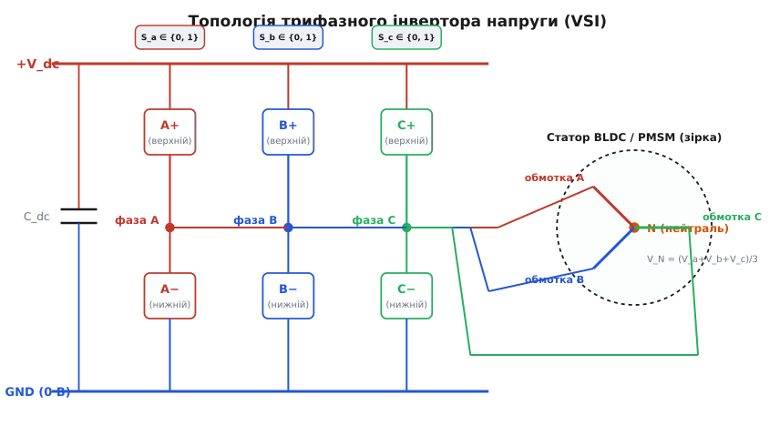
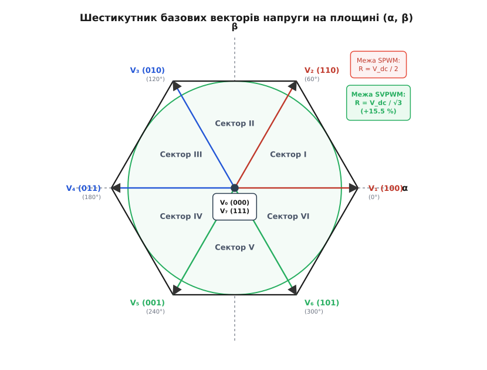
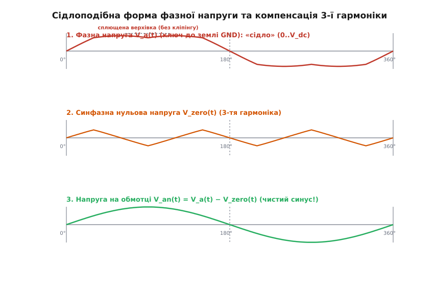
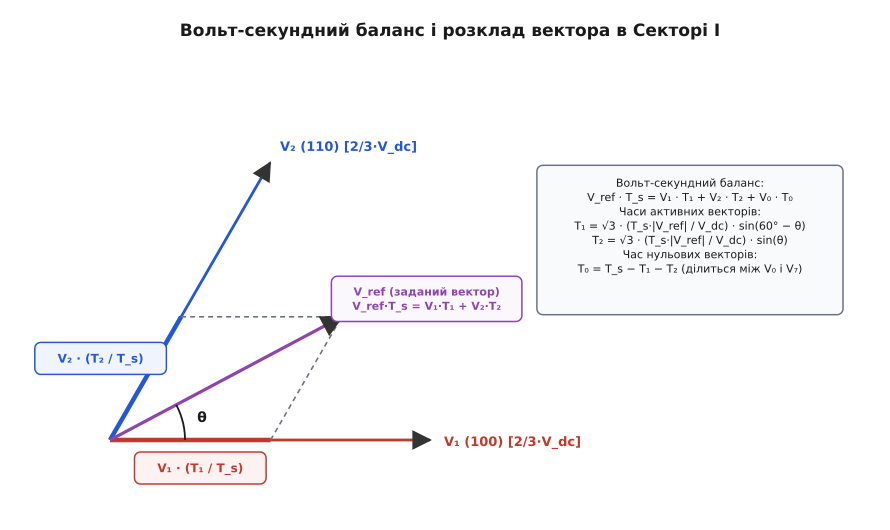
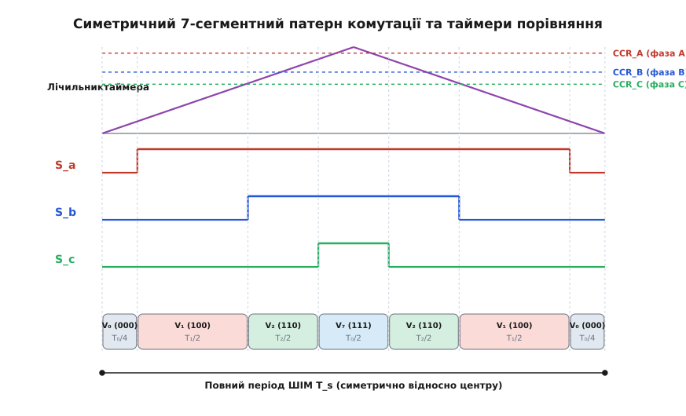

# Просторово-векторна ШІМ (SVPWM)

<preknowlist>
- [H-міст](book:electronics/h-bridge) — силова топологія комутації навантаження між шинами живлення та землею.
- [Стратегії комутації BLDC-мотора](book:electronics/bldc-commutation) — формування обертового магнітного поля статора трифазними напругами.
- [Мертвий час у напівмості](book:electronics/dead-time) — захисний інтервал між вимиканням одного ключа стійки й увімкненням іншого.
- [BLDC-мотор](book:electronics/bldc-motor) — трифазна синхронна машина з постійними магнітами та обмотками зіркою або трикутником.
</preknowlist>

Якщо підключити трифазний синхронний двигун з постійними магнітами до інвертора напруги з живленням від акумуляторної батареї напругою `48 В` і генерувати три фазні напруги за допомогою класичної синусоїдальної широтно-імпульсної модуляції (SPWM), максимальна амплітуда фазної напруги відносно штучної середньої точки живлення не перевищить `24 В` (половини напруги шини постійного струму). При цьому максимальна діюча міжфазна напруга складе лише `29.4 В`, залишаючи понад `15.47 %` енергетичного потенціалу батареї повністю невикористаними. Двигун не зможе розвинути свою номінальну швидкість і граничний крутний момент, а силові транзистори розсіюватимуть зайве тепло через неоптимальний розподіл комутацій. Причина полягає в тому, що класична синусоїдальна ШІМ розглядає три стійки інвертора як три незалежні однофазні перетворювачі, повністю ігноруючи топологічний факт: обмотки трифазного двигуна з'єднані в зірку з ізольованою нейтраллю, і напруга кожної фази прикладена не відносно землі, а відносно плаваючої спільної точки.

Просторово-векторна широтно-імпульсна модуляція (англ. *Space Vector Pulse-Width Modulation*, SVPWM) усуває це фундаментальне обмеження. Замість синтезу трьох окремих скалярних синусоїд вона розглядає стан усіх шести ключів інвертора як єдиний просторовий вектор напруги на комплексній площині статора. Це дозволяє збільшити амплітуду вихідної лінійної напруги на `15.47 %` аж до повної величини напруги живлення `V_dc / √3` без виходу в режим спотворень, скоротити динамічні втрати на перемикання транзисторів на третину та зменшити високочастотні пульсації магнітного потоку.

## Анатомія трифазного інвертора та простір дискретних станів

Силова частина трифазного інвертора напруги (*Voltage Source Inverter*, VSI) складається з трьох паралельних напівмостових стійок, позначених як фази A, B та C. Кожна стійка містить два комплементарні силові ключі — верхній і нижній транзистори (MOSFET або IGBT), шунтовані зворотними діодами.


*Трифазний інвертор напруги: три напівмостові стійки A, B, C комутують виводи обмоток двигуна між шинами живлення +V_dc та GND, формуючи плаваючий потенціал нейтралі N.*

Щоб уникнути короткого замикання шини живлення, ключі в кожній стійці перемикаються у протифазі: коли верхній транзистор замкнений, нижній розімкнений, і навпаки. Стан кожної стійки однозначно описується булевою змінною:

- `S_a = 1`: верхній ключ фази A замкнений, фазний вивід з'єднаний з шиною `+V_dc`;
- `S_a = 0`: нижній ключ фази A замкнений, фазний вивід з'єднаний з мінусовою шиною `GND` (`0 В`).

Оскільки інвертор має три незалежні стійки, загальна кількість можливих дискретних станів комутації дорівнює:

```
2³ = 8 дискретних станів (від (0, 0, 0) до (1, 1, 1))
```

Обмотки статора електродвигуна з'єднані за схемою «зірка» з нейтральною точкою `N`. Оскільки ця нейтраль електрично ізольована і не підключена до джерела живлення, її потенціал відносно землі `V_N` не є фіксованим. За першим законом Кірхгофа сума струмів, що втікають у нейтраль, дорівнює нулю (`i_a + i_b + i_c = 0`). Для симетричного навантаження це означає, що потенціал нейтралі в кожен момент часу є точним середнім арифметичним потенціалів трьох вихідних клем інвертора:

```
V_N = (V_a + V_b + V_c) / 3
```

Напруги, що безпосередньо діють на обмотки двигуна (фазно-нейтральні напруги), дорівнюють різниці між потенціалом виводу фази та потенціалом плаваючої нейтралі:

```
V_an = V_a - V_N
V_bn = V_b - V_N
V_cn = V_c - V_N
```

Коли інвертор перебуває, наприклад, у стані `(1, 0, 0)` (верхній ключ фази A замкнений, а фази B і C підключені до землі), на клемах виникають напруги `V_a = V_dc`, `V_b = 0`, `V_c = 0`. Потенціал нейтралі становить `V_N = (V_dc + 0 + 0) / 3 = (1/3) · V_dc`. Тоді напруги на обмотках двигуна розподіляються асиметрично:

```
V_an = V_dc - (1/3) · V_dc = +(2/3) · V_dc
V_bn = 0 - (1/3) · V_dc     = -(1/3) · V_dc
V_cn = 0 - (1/3) · V_dc     = -(1/3) · V_dc
```

По фазі A струм втікає в двигун під дією напруги `+(2/3) · V_dc`, а крізь обмотки B і C він порівну витікає назад у землю під напругою `-(1/3) · V_dc`. Якщо ж замкнути два верхні ключі, наприклад у стані `(1, 1, 0)`, потенціал нейтралі підніметься до `V_N = (V_dc + V_dc + 0) / 3 = (2/3) · V_dc`. Тоді фазні напруги набудуть протилежної конфігурації: `V_an = +(1/3) · V_dc`, `V_bn = +(1/3) · V_dc`, `V_cn = -(2/3) · V_dc`.

У нульових станах `(0, 0, 0)` та `(1, 1, 1)` усі три фази підключені до одного й того самого потенціалу (землі або шини живлення відповідно). Потенціал нейтралі стає рівним напрузі шини (`V_N = 0` або `V_N = V_dc`), а всі фазно-нейтральні напруги спадають до нуля: `V_an = V_bn = V_cn = 0`.

У кожному з восьми дискретних станів інвертора обмотки статора зазнають дії суворо визначеного просторового розподілу напруг, який формує фіксований вектор магнітного поля у повітряному зазорі машини.

## Перетворення Кларк і народження векторного гексагона

Для спрощення математичного аналізу трифазних машин американська вчена-інженерка Едіт Кларк (*Edith Clarke*) у 1938 році запропонувала координатне перетворення, що трансформує трифазну систему `(a, b, c)`, чиї просторові осі обмоток рознесені на кут `120°`, у двовимірну прямокутну систему координат `(α, β)`.

Амплітудно-інваріантне перетворення Кларк визначає результуючий просторовий вектор напруги `V_s` як геометричну суму трьох фазних напруг уздовж їхніх просторових осей:

```
V_s = (2/3) · (V_an + V_bn · e^(j·2π/3) + V_cn · e^(j·4π/3))
```

Множник `2/3` забезпечує рівність модуля вектора `|V_s|` амплітуді фазної синусоїди. Проекції просторового вектора на нерухомі декартові осі статора (де вісь `α` орієнтована вздовж обмотки фази A, а вісь `β` випереджає її на `90°`) виражаються формулами:

```
V_α = (2/3) · (V_an - 0.5 · V_bn - 0.5 · V_cn)
V_β = (1/√3) · (V_bn - V_cn)
```

Якщо послідовно підставити значення фазно-нейтральних напруг для всіх восьми дискретних станів інвертора у формули Кларк, отримаємо положення восьми базових просторових векторів напруги на площині `(α, β)`:

1. **Шість активних векторів (`V₁..V₆`):** Кожен активний вектор відповідає стану, коли принаймні одна фаза підключена до `+V_dc`, а принаймні одна — до `GND`. Усі шість векторів мають однакову абсолютну довжину `(2/3) · V_dc` і розвернуті у просторі статора з кутовим інтервалом `60°` (`π/3` рад):
   - `V₁ (1, 0, 0)`: довжина `(2/3)·V_dc`, кут `0°` (спрямований точно вздовж осі `α`);
   - `V₂ (1, 1, 0)`: довжина `(2/3)·V_dc`, кут `60°`;
   - `V₃ (0, 1, 0)`: довжина `(2/3)·V_dc`, кут `120°`;
   - `V₄ (0, 1, 1)`: довжина `(2/3)·V_dc`, кут `180°`;
   - `V₅ (0, 0, 1)`: довжина `(2/3)·V_dc`, кут `240°`;
   - `V₆ (1, 0, 1)`: довжина `(2/3)·V_dc`, кут `300°`.

2. **Два нульових вектори (`V₀` та `V₇`):**
   - `V₀ (0, 0, 0)`: усі три фази замкнені на землю `GND`;
   - `V₇ (1, 1, 1)`: усі три фази підключені до шини живлення `+V_dc`.
   У цих двох станах міжфазні напруги дорівнюють нулю (`V_ab = V_bc = V_ca = 0`), струм не створює крутного моменту, а довжина вектора на комплексній площині тотожно дорівнює нулю: `|V₀| = |V₇| = 0`. Обидва нульові вектори розташовані в початку координат `(0, 0)`.


*Гексагон напруг на площині (α, β): 6 активних векторів довжиною (2/3)·V_dc розбивають простір на 6 секторів. Вписане коло (SVPWM) більше за коло SPWM на 15.5 %.*

Шість активних векторів утворюють правильний шестикутник (гексагон), вершини якого розташовані на колі радіуса `(2/3) · V_dc`. Цей шестикутник ділить комплексну площину статора на шість рівних секторів (Сектори I..VI) по `60°` кожен. Будь-яка напруга, яку інвертор здатен створити в статорі, є геометричною точкою всередині цього гексагона.

## Геометрія обмеження та фізика виграшу в 15.5 %

Чому класична синусоїдальна ШІМ втрачає частину напруги, а просторово-векторна ШІМ видає максимум?

У класичній SPWM кожна фазна напруга модулюється окремим синусоїдальним опорним сигналом відносно середньої точки живлення: `V_a(t) = (V_dc / 2) · m · sin(ωt)`. Щоб коефіцієнт заповнення ШІМ не вийшов за допустимі межі `[0, 1]` (зона без кліпінгу та зрізання верхівок), амплітуда фазної напруги не може перевищувати половини напруги живлення:

```
V_phase_max_SPWM = V_dc / 2 = 0.500 · V_dc
```

На площині `(α, β)` траєкторія результуючого вектора для SPWM є колом з радіусом `R_SPWM = V_dc / 2`.

У просторово-векторній модуляції вектор напруги `V_ref` може займати будь-яке положення всередині всього шестикутника. Щоб сформувати ідеально гладке, кругове обертове магнітне поле статора сталої амплітуди без пульсацій моменту, кінець вектора повинен рухатися по колу. Найбільше коло, яке можна повністю розмістити всередині шестикутника без виходу за його межі, — це **вписане коло гексагона**.

Радіус вписаного кола дорівнює довжині перпендикуляра від центру координат до будь-якої зі сторін шестикутника (апофемі гексагона):

```
R_SVPWM = ((2/3) · V_dc) · cos(30°) = ((2/3) · V_dc) · (√3 / 2) = V_dc / √3 ≈ 0.57735 · V_dc
```

Порівняємо максимальні амплітуди фазної напруги двох методів:

```
R_SVPWM / R_SPWM = (V_dc / √3) / (V_dc / 2) = 2 / √3 ≈ 1.15470
```

Відношення становить рівно `2 / √3`, що дає **+15.47 %** (в інженерній практиці — 15.5 %) збільшення вихідної фазної та лінійної напруги за тієї самої напруги акумулятора!

Міжфазна (лінійна) амплітуда напруги на обмотках двигуна при цьому досягає:

```
V_line_max = √3 · R_SVPWM = √3 · (V_dc / √3) = 1.000 · V_dc
```

Це означає, що при максимальній модуляції SVPWM амплітуда лінійної синусоїди між виводами двигуна точно дорівнює повній напрузі батареї `V_dc`, тоді як у SPWM вона була обмежена рівнем `0.866 · V_dc`. Двигун отримує на 15.5 % вищу швидкість обертання до настання режиму ослаблення поля і має значно більший динамічний запас за крутним моментом.

Детальне аналітичне доведення геометричного ліміту напруги та розрахунок граничних інтегралів наведено в окремій [🧮 математичній вставці](book:electronics/svpwm/math-svpwm-times.md).

## Синфазна напруга та еквівалентність підмішуванню 3-ї гармоніки

Як інвертор фізично видає напругу `V_dc / √3`, якщо його напівпровідникові ключі все одно комутують між тими самими двома потенціалами `0` та `V_dc`?

Секрет криється у формі напруги, яка прикладається до кожної окремої стійки відносно землі `GND`. У синусоїдальній ШІМ фазний сигнал — це чистий синус. У просторово-векторній ШІМ до фазних синусоїд автоматично додається синфазна напруга нульової послідовності (*Common-Mode Voltage*, `V_zero(t)`):

```
V_zero(t) = 0.5 · (V_dc - max(V_a, V_b, V_c) - min(V_a, V_b, V_c))
```

Ця синфазна добавка має трикутноподібну форму з частотою, яка втричі перевищує основну вихідну частоту інвертора (`3·f`). Її розклад у ряд Фур'є містить виключно третю гармоніку та її непарні кратні (3-тю, 9-ту, 15-ту...).


*Сідлоподібна фазна напруга інвертора: підмішування 3-ї гармоніки сплющує вершину на 15.5 %, а в міжфазній напрузі V_ab та напрузі на обмотці V_an третя гармоніка повністю взаємознищується.*

Додавання третьої гармоніки амплітудою `1/6` від основної призводить до сплющення верхівок фазних сигналів, перетворюючи звичайну синусоїду на характерну двогорбу **«сідлоподібну» хвилю** (*saddle waveform*). Оскільки верхівка хвилі тепер притиснута на `13.4 %` вниз, з'являється вільний запас до шин живлення `0` і `V_dc`. Це дозволяє збільшити амплітуду основної частоти рівно на `15.47 %` до моменту, коли два бічні горби сідла торкнуться меж живлення.

Найважливіше фізичне явище полягає в тому, що ця третя гармоніка діє строго **синфазно** на всі три фази одночасно. В ізольованій трифазній системі обмоток зіркою нейтральна точка `N` починає коливатися разом із синфазною напругою `V_zero(t)`. Згідно з першим законом Кірхгофа, синфазний струм третьої гармоніки не має зворотного провідника і взагалі не може виникнути:

```
i_3rd(t) + i_3rd(t) + i_3rd(t) = 3 · i_3rd(t) = 0  ⇒  i_3rd(t) = 0
```

У різниці напруг між фазами (лінійній напрузі `V_ab = V_a - V_b`) синфазна складова віднімається сама від себе:

```
V_ab(t) = (V_a_fund + V_zero) - (V_b_fund + V_zero) = V_a_fund - V_b_fund
```

Третя гармоніка повністю зникає з міжфазної напруги та магнітного поля статора. На клемах ключів діє сідлоподібна напруга, а через обмотки двигуна тече бездоганний, чистий гармонійний синусоїдальний струм без жодних додаткових спотворень.

Проте інженерам слід пам'ятати про електромагнітну сумісність (EMC): хоча синфазна напруга не створює корисного чи шкідливого струму в обмотках, її високочастотні перепади `dV/dt` пробивають паразитні ємності між обмотками статора і корпусом ротора. Це породжує високочастотні струми підшипників (*Bearing Currents*), що можуть викликати передчасний знос підшипникових вузлів за відсутності струмознімальних кілець або керамічних кульок.

## Синтез вектора за законом вольт-секундного балансу

У будь-який момент часу вектор керування `V_ref = |V_ref| · e^(j·θ)` знаходиться всередині одного з шести секторів гексагона. Розглянемо перший сектор, обмежений активними векторами `V₁ (100)` під кутом `0°` та `V₂ (110)` під кутом `60°`.

Оскільки інвертор може генерувати лише дискретні базові вектори, довільний вектор `V_ref` формується за принципом **вольт-секундного балансу** (усереднення напруги за час). За період ШІМ `T_s` інтеграл від вектора `V_ref` має дорівнювати сумі інтегралів від базових векторів:

```
V_ref · T_s = V₁ · T₁ + V₂ · T₂ + V₀ · T₀
```

де `T₁` — час активності вектора `V₁`, `T₂` — час активності вектора `V₂`, а `T₀ = T_s - T₁ - T₂` — тривалість нульового стану.


*Вольт-секундний баланс у Секторі I: заданий вектор V_ref розкладається на компоненти базових векторів V₁ і V₂ за правилом паралелограма.*

Це векторне рівняння розв'язується геометрично за правилом паралелограма (або законом важеля Архімеда у часовому просторі). Проектуючи вектор на осі `α` та `β`, отримуємо точні вирази для тривалостей активних векторів:

```
T₁ = √3 · (T_s · |V_ref| / V_dc) · sin(60° - θ)
T₂ = √3 · (T_s · |V_ref| / V_dc) · sin(θ)
T₀ = T_s - T₁ - T₂
```

де `θ` — поточний кут вектора `V_ref` відносно початку Сектора 1 (`0° ≤ θ ≤ 60°`).

Фізична інтерпретація цих формул є наочною:
- Якщо вектор `V_ref` спрямований точно вздовж осі вектора `V₁` (`θ = 0°`), час `T₂ = 0`, а `T₁` максимальний.
- Якщо вектор лежить рівно посередині сектора (`θ = 30°`), тривалості двох активних векторів стають строго рівними: `T₁ = T₂`.
- Якщо вектор наближається до кінця сектора (`θ = 60°`), час `T₁` падає до нуля, а `T₂` сягає максимуму.
- Залишковий час `T₀` заповнюється нульовими векторами, під час яких обмотки двигуна замкнені накоротко і струм вільно спадає по нульовому контуру.

Якщо модуль вектора перевищує радіус вписаного кола, сума `T₁ + T₂` стає більшою за період `T_s`. У цьому разі модулятор виконує нормалізацію, пропорційно масштабуючи обидва часи так, щоб їхня сума дорівнювала `T_s`, залишаючи кут вектора незмінним.

## Симетричний 7-сегментний патерн комутації

Обчислити тривалості `T₁`, `T₂`, `T₀` — це лише половина задачі. Друга половина — правильно розташувати ці часові інтервали всередині періоду ШІМ `T_s`.

У сучасних контролерах застосовують **симетричний 7-сегментний патерн комутації** (*Center-Aligned Space Vector Pattern*). Загальний нульовий час `T₀` розбивається на дві рівні частини між двома нульовими векторами: `V₀ (000)` та `V₇ (111)`. Потім кожен інтервал ділиться навпіл і розташовується дзеркально відносно середини періоду.

Для Сектора 1 послідовність увімкнення векторів має вигляд:

```
V₀ (000) → V₁ (100) → V₂ (110) → V₇ (111) → V₂ (110) → V₁ (100) → V₀ (000)
```

Тривалості кожного з семи сегментів складають:

```
[T₀/4]  →  [T₁/2]  →  [T₂/2]  →  [T₀/2]  →  [T₂/2]  →  [T₁/2]  →  [T₀/4]
```


*Симетричний 7-сегментний цикл ШІМ: трикутний лічильник таймера генерує імпульси фаз A, B, C; при кожному переході між сегментами стан змінює лише один транзистор.*

Ця послідовність має три вирішальні інженерні переваги:

1. **Мінімізація частоти перемикання силових транзисторів:**
   При переході між сусідніми сегментами змінюється стан **лише однієї стійки інвертора** (відбувається зміна рівно одного біта в двійковому коді вектора):
   - `(000) → (100)`: перемикається лише фаза A (0→1);
   - `(100) → (110)`: перемикається лише фаза B (0→1);
   - `(110) → (111)`: перемикається лише фаза C (0→1);
   - `(111) → (110)`: вимикається фаза C (1→0);
   - `(110) → (100)`: вимикається фаза B (1→0);
   - `(100) → (000)`: вимикається фаза A (1→0).
   Жодна фаза не перемикається двічі на одному півперіоді. За весь період `T_s` кожна стійка здійснює рівно одне відкриття та одне закриття (загалом 6 перемикань на три фази). Це знижує динамічні втрати в силових ключах на `33 %` порівняно з несиметричними алгоритмами.

2. **Подвоєння ефективної частоти пульсацій струму:**
   Завдяки дзеркальній симетрії відносно центру періоду всі парні гармоніки комутації повністю взаємно знищуються. Основний спектр пульсацій струму зосереджується не на частоті перемикання ключів `f_sw`, а на **подвоєній частоті** `2·f_sw`. Це вдвічі зменшує амплітуду високочастотних пульсацій струму статора та відчутно знижує паразитичний акустичний шум і нагрів магнітопроводу двигуна.

3. **Ідеальна синхронізація вимірювань АЦП:**
   На початку та наприкінці періоду ШІМ діє нульовий стан `V₀ (000)`, коли всі три нижні транзистори повністю відкриті і з'єднують обмотки з землею. Це ідеальний момент для запуску аналого-цифрового перетворювача (АЦП) і вимірювання фазних струмів на нижніх шунтах без впливу комутаційного брязкоту ключів.

У додатках із надвисокими вимогами до ККД (наприклад, у тягових інверторах електробусів) застосовують також **5-сегментні дисконтинуальні патерни** (*DPWM*). У них у кожному секторі нульовий інтервал віддається виключно одному нульовому вектору (`V₀` або `V₇`). Це дозволяє взагалі не перемикати одну з фаз протягом 60 градусів, що знижує кількість перемикань до 4 за період і скорочує комутаційні втрати ще на 33.3 % (ціною помірного зростання пульсацій на малих швидкостях).

## Швидкий алгоритм реалізації для мікроконтролерів

У цифрових контролерах реального часу прямий розрахунок тригонометричних функцій `sin()`, `cos()` та кутів `θ` у кожному перериванні ШІМ є неприпустимо повільним. Тому застосовують оптимізований матричний алгоритм, що працює безпосередньо з декартовими проекціями `V_α` та `V_β`.

Алгоритм складається з трьох послідовних кроків:

**Крок 1. Ідентифікація сектора за три операції порівняння:**
Обчислюють три допоміжні змінні проекцій:

```
U_1 = V_β
U_2 = (√3 / 2) · V_α - 0.5 · V_β
U_3 = -(√3 / 2) · V_α - 0.5 · V_β
```

Формують 3-бітний індекс: `код = (U_1 > 0 ? 1 : 0) + (U_2 > 0 ? 2 : 0) + (U_3 > 0 ? 4 : 0)`. За цим індексом через статичний масив розміром 8 елементів миттєво зчитують номер сектора від 1 до 6.

**Крок 2. Розрахунок базисних інтервалів:**
Визначають три базові часові складові через період лічильника таймера `ARR` та напругу живлення `V_dc`:

```
X = √3 · (ARR / V_dc) · V_β
Y = (ARR / V_dc) · (1.5 · V_α + (√3 / 2) · V_β)
Z = (ARR / V_dc) · (-1.5 · V_α + (√3 / 2) · V_β)
```

Тривалості активних векторів `T_1` і `T_2` для поточного сектора вибираються простим присвоєнням з трійки `(X, Y, Z)` без жодних тригонометричних операцій.

**Крок 3. Розрахунок регістрів захоплення/порівняння таймера:**
Знаходять базові точки перемикання лічильника вгору-вниз:

```
t_a = (ARR - T_1 - T_2) / 4
t_b = t_a + T_1 / 2
t_c = t_b + T_2 / 2
```

Залежно від сектора ці три пороги завантажуються у відповідні регістри таймера `CCR_A`, `CCR_B`, `CCR_C`.

Повний вихідний код високопродуктивного C та C++ модулятора з підтримкою чисел з плаваючою та фіксованою комою Q15 детально розібрано в окремій [⚙️ проектній вставці](book:electronics/svpwm/proj-svpwm-generator.md).

## Динаміка струму в обмотках та фільтрація індуктивністю статора

Синтезована інвертором напруга є кусково-постійною послідовністю прямокутних імпульсів, тоді як для створення сталого обертового моменту потрібен неперервний синусоїдальний струм. Перетворення імпульсної напруги на плавний струм виконує сама внутрішня фізика електричної машини: кожна фазна обмотка статора володіє власною індуктивністю `L_s` та активним омичним опором міді `R_s`.

Динаміка струму в кожній фазі описується диференціальним рівнянням першого порядку:

```
L_s · (di_a / dt) + R_s · i_a = V_an(t) - e_a(t)
```

де `e_a(t)` — внутрішня зворотна електрорушійна сила (ЕРС), наведена магнітним полем обертового ротора в провідниках статора.

Оскільки частота комутації інвертора `f_sw` (типово 10–50 кГц) на кілька порядків перевищує власну частоту зрізу електричного RL-ланцюжка статора `f_rl = R_s / (2π · L_s)` (зазвичай 100–500 Гц), обмотка статора працює як ідеальний низькочастотний інтегрувальний фільтр. Індуктивність чинить значний реактивний опір `X_L = 2π · f_sw · L_s` високочастотним гармонікам напруги ШІМ, пропускаючи безперешкодно лише корисну низькочастотну гармоніку основної частоти обертання поля.

Миттєве відхилення струму від синусоїдної траєкторії (високочастотні пульсації струму `Δi(t)`) визначається інтегралом від різниці між миттєвою дискретною напругою базового вектора та середньою референсною напругою `V_ref`:

```
Δi(t) = (1 / L_s) · ∫ [ V_k - V_ref ] dt
```

Максимальний розмах пульсацій струму від піку до піку для симетричного 7-сегментного патерну SVPWM досягає максимуму всередині сектора при `θ = 30°` і визначається співвідношенням:

```
ΔI_pp_max = (V_dc / (8 · L_s · f_sw)) · (1 - m / √3)
```

де `m` — коефіцієнт глибини модуляції. Порівняно з класичною синусоїдальною ШІМ, де розмах пульсацій становить `ΔI_pp_SPWM = V_dc / (4 · L_s · f_sw)`, просторово-векторна модуляція знижує амплітуду струмових пульсацій у `1.4–1.6` раза. Це прямо зменшує високочастотні втрати на перемагнічування та вихрові струми у листовій електротехнічній сталі статора.

## Сімейство дисконтинуальних модуляцій (DPWM)

У високовольтних тягових приводах електромобілів та промислових інверторах потужністю в десятки й сотні кіловат головним фактором, що обмежує вихідну потужність, є тепловий перегрів силових транзисторних модулів (IGBT або SiC MOSFET) через динамічні комутаційні втрати `P_sw = f_sw · (E_on + E_off)`.

Для максимального зниження нагріву ключів на основі SVPWM було розроблено сімейство **дисконтинуальних просторово-векторних модуляцій** (*Discontinuous PWM*, DPWM). Їхній базовий принцип полягає у відмові від симетричного поділу нульового часу `T₀` навпіл. У кожному секторі весь нульовий інтервал віддається лише одному з нульових векторів:

1. **Патерн DPWM0:** Використовується виключно нульовий вектор `V₀ (000)`. Послідовність перемикання стає 5-сегментною: `V₀ → V_1 → V_2 → V_1 → V₀`. Стан `V₇ (111)` не вмикається взагалі.
2. **Патерн DPWM1:** Використовується виключно вектор `V₇ (111)`. Послідовність має вигляд: `V₇ → V_2 → V_1 → V_2 → V₇`.
3. **Патерн DPWM_MAX / DPWM_MIN:** Залежно від положення вектора обирається той нульовий стан, який утримує відкритим верхній або нижній ключ фази з **найбільшим миттєвим струмом**.

## Інтеграція у FOC та інженерні обмеження

У повному контурі векторного керування (Field-Oriented Control, FOC) просторово-векторна ШІМ є фінальним виконавчим органом, який безпосередньо взаємодіє з апаратними регістрами таймера мікроконтролера:

```
[Вимірювання струмів ia, ib] → [Кларк: i_α, i_β] → [Парк: i_d, i_q]
                             ↓
[PI-регулятори струму: V_d, V_q] → [Зворотний Парк: V_α, V_β]
                             ↓
[SVPWM-модулятор] → [Таймер: CCR1, CCR2, CCR3] → [Затвори силових MOSFET/IGBT]
```

При практичній розробці реального привода інженер обов'язково стикається з чотирма критичними фізичними обмеженнями:

1. **Спотворення мертвого часу та температурний дрейф (*Dead-Time and Thermal Drift*):**
   Затримка вмикання ключів напівмоста `t_dead` (типово 200–1000 нс) захищає стійку від наскрізного пробою, але спотворює прикладену напругу: фактичний вихід відстає від заданого на `ΔV = (t_dead / T_s) · V_dc`. При зміні напрямку фазного струму знак цієї помилки стрибкоподібно змінюється, що породжує виражені 5-ту та 7-му гармоніки струму й викликає низькочастотні пульсації моменту. Окрім мертвого часу, на низьких швидкостях суттєвий вплив мають пряме падіння напруги на відкритих діодах `V_f ≈ 0.7–1.2 В` та опір каналу `R_ds(on)`, який зростає майже вдвічі при нагріві транзисторів від 25 °C до 125 °C. Сучасні алгоритми FOC застосовують адаптивну фазову компенсацію мертвого часу з урахуванням температури радіатора силового модуля, додаючи коригувальний вектор напруги відповідно до миттєвого знаку струму в кожній фазі.

2. **Квантування таймера та фазовий шум (*Timer Resolution & Quantization Noise*):**
   Кінцева тактова частота таймера `f_clk` обмежує кількість дискретних рівнів тривалості імпульсу: `N_levels = f_clk / (2 · f_sw)`. Наприклад, при тактовій частоті 48 МГц і частоті ШІМ 20 кГц таймер має лише 1200 дискретних кроків, що еквівалентно роздільній здатності близько 10.2 біта. Квантування за часом породжує високочастотний фазовий шум у контурі струму та може викликати паразитні мікроколивання швидкості ротора при дуже повільному русі. Застосування сучасних мікроконтролерів із високошвидкісними таймерами (наприклад, HRTIM у STM32G4 з роздільною здатністю до 184 пікосекунд або HRPWM у TI C2000) повністю усуває шум квантування та забезпечує ідеально гладке векторне позиціювання ротора.

3. **Мінімальне вікно вибірки струму (*Minimum Current Sampling Window*):**
   Для коректного оцифрування струмів на нижніх шунтах нижні силові транзистори повинні залишатися відкритими щонайменше протягом інтервалу `t_sample = t_settling + t_adc_conversion` (зазвичай 1.5–2.5 мкс). На максимальній амплітуді напруги або на стиках секторів час дії одного з нульових станів спадає нижче `t_sample`. У таких режимах застосовують реконструкцію третього струму за сумою двох інших (`i_c = -i_a - i_b`) або алгоритм динамічного фазового зсуву імпульсів ШІМ (*PWM Phase Shifting*).

4. **Режими перемодуляції (*Overmodulation*):**
   Коли від електропривода вимагається розвиток максимальної граничної швидкості (наприклад, при різкому прискоренні електромобіля), вектор напруги виводять за межі вписаного кола (`|V_ref| > V_dc / √3`). Модулятор переходить у зону перемодуляції:
   - *Режим перемодуляції I:* вектор зрізається контуром шестикутника і ковзає вздовж його ребер.
   - *Режим перемодуляції II:* при подальшому зростанні вектор залипає у вершинах гексагона на певний кутовий час.
   - *Шестикроковий режим (Six-Step):* вектор утримується у вершинах протягом усіх 60 градусів. Вихідна напруга сягає абсолютної теоретичної межі `(2/π) · V_dc ≈ 0.637 · V_dc` (+27.3 % відносно SPWM), забезпечуючи максимальну потужність двигуна ціною вищих гармонік струму.

## Наскрізний числовий розрахунок робочої точки

Щоб простежити перетворення абстрактних математичних рівнянь у фізичні значення керувальних регістрів, розглянемо повний розрахунок одного такту модулятора для реального привода:

**Вхідні параметри системи:**
- Напруга акумуляторної батареї: `V_dc = 48.0 В`;
- Частота ШІМ: `f_sw = 20 кГц` (період комутації `T_s = 50.0 мкс`);
- Тактова частота таймера: `f_clk = 168 МГц`;
- Період лічильника таймера для симетричного підрахунку: `ARR = 168 000 000 / (2 · 20 000) = 4200` тактів;
- Бажані напруги статора від регуляторів FOC: `V_α = 20.0 В`, `V_β = 12.0 В`.

**Крок 1. Ідентифікація сектора:**
Обчислюємо три розділові проекції:

```
U_1 = V_β = 12.0 В  ( > 0  ⇒  біт b₀ = 1 )
U_2 = (√3 / 2) · 20.0 - 0.5 · 12.0 = 17.3205 - 6.0 = +11.3205 В  ( > 0  ⇒  біт b₁ = 1 )
U_3 = -(√3 / 2) · 20.0 - 0.5 · 12.0 = -17.3205 - 6.0 = -23.3205 В  ( < 0  ⇒  біт b₂ = 0 )
```

Двійковий код: `код = 1·1 + 2·1 + 4·0 = 3`. За таблицею `SECTOR_MAP[3]` отримуємо **Сектор I**.

**Крок 2. Розрахунок базисних часових інтервалів:**
Коефіцієнт масштабу: `scale = ARR / V_dc = 4200 / 48.0 = 87.5` тактів/В.

```
X = √3 · scale · V_β = 1.73205 · 87.5 · 12.0 = 1818.6 тактів
Y = scale · (1.5 · V_α + (√3 / 2) · V_β) = 87.5 · (30.0 + 10.3923) = 3534.3 тактів
Z = scale · (-1.5 · V_α + (√3 / 2) · V_β) = 87.5 · (-30.0 + 10.3923) = -1715.7 тактів
```

**Крок 3. Визначення тривалостей активних і нульових векторів:**
Для Сектора I:

```
T_1 = -Z = 1715.7 тактів  (20.42 мкс)
T_2 =  X = 1818.6 тактів  (21.65 мкс)
```

Сума активних часів: `T_sum = 1715.7 + 1818.6 = 3534.3` тактів `< 4200` (робота в лінійній зоні без перемодуляції). Залишковий нульовий час:

```
T_0 = ARR - T_sum = 4200 - 3534.3 = 665.7 тактів  (7.93 мкс)
```

**Крок 4. Розрахунок симетричних порогів перемикання:**

```
t_a = T_0 / 4 = 665.7 / 4 = 166.4 ≈ 166 тактів
t_b = t_a + T_1 / 2 = 166.4 + 857.8 = 1024.2 ≈ 1024 такти
t_c = t_b + T_2 / 2 = 1024.2 + 909.3 = 1933.5 ≈ 1934 такти
```

**Крок 5. Завантаження у регістри порівняння таймера:**
Для Сектора I розподіл по фазах має прямий порядок `(t_a, t_b, t_c)`:

```
CCR1 (Фаза A) = 166  тактів  (коефіцієнт заповнення верхнього ключа 92.1 %)
CCR2 (Фаза B) = 1024 такти   (коефіцієнт заповнення верхнього ключа 51.2 %)
CCR3 (Фаза C) = 1934 такти   (коефіцієнт заповнення верхнього ключа 7.9 %)
```

Апаратний таймер мікроконтролера в режимі підрахунку вгору-вниз генерує ідеально збалансовану 7-сегментну ШІМ, прикладаючи до обмоток двигуна вектор напруги `V_ref = 23.32 В` під точним просторовим кутом `θ = 30.96°`.

> 🔧 **Навіщо це.**
> Просторово-векторна ШІМ є непохитним промисловим стандартом у сервоприводах верстатів ЧПК, тягових інверторах електромобілів (зокрема в силових приводах Tesla, Nissan Leaf), безколекторних регуляторах швидкості (ESC) квадрокоптерів та робототехніці. Вона забезпечує вичерпне використання напруги батареї без паразитного кліпінгу, на третину знижує нагрів силових транзисторів і дозволяє мікроконтролеру розраховувати параметри комутації десятками тисяч разів на секунду за допомогою простих цілочисельних операцій.

## Підсумок

Просторово-векторна ШІМ перетворює дискретну природу шести транзисторних ключів на неперервне, плавно обертове магнітне поле. Об'єднання всіх трьох фаз у єдиний вектор на комплексній площині, використання плаваючої нейтралі для компенсації третьої гармоніки та закон вольт-секундного балансу в симетричному 7-сегментному циклі забезпечують фундаментальний компроміс силової електроніки: максимальну амплітуду вихідної напруги за мінімальних комутаційних втрат і нульових гармонійних викривленнях струму навантаження.
