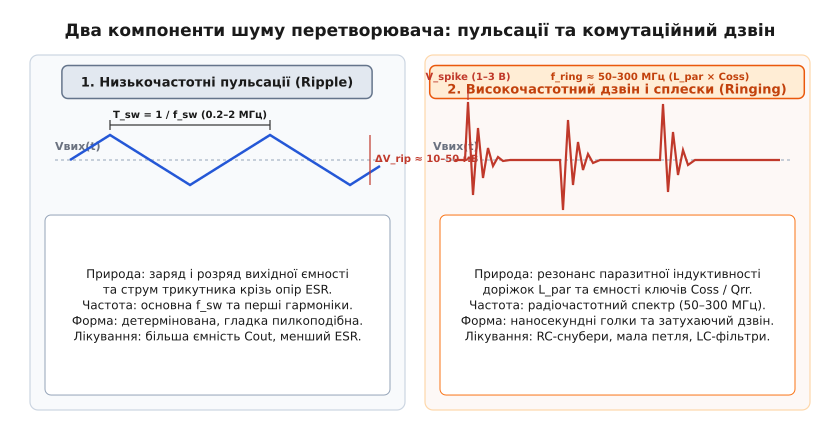
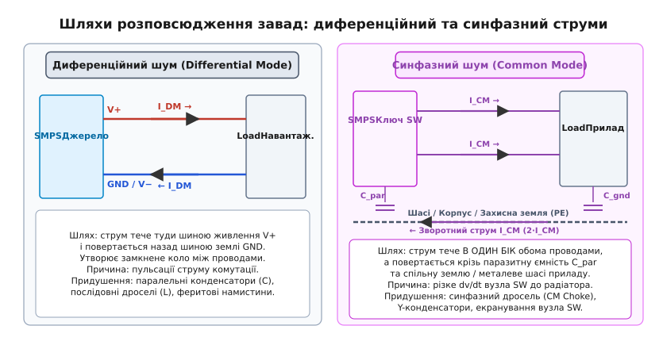
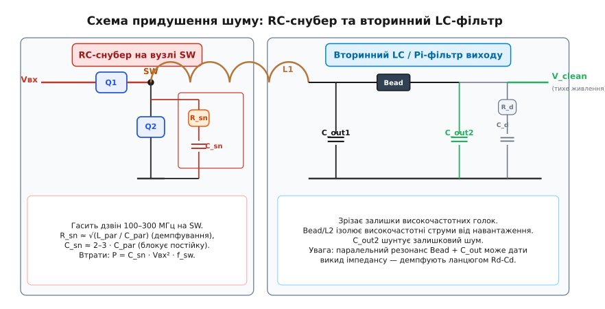
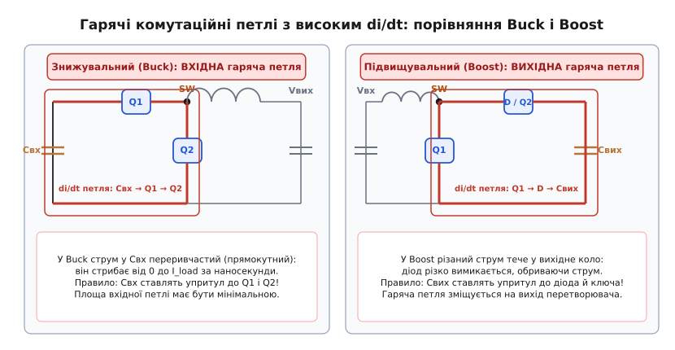

# Шум імпульсного перетворювача

<preknowlist>
- [Знижувальний перетворювач (buck)](book:electronics/buck) — комутація ключів, накопичення енергії в котушці та згладжування вихідною ємністю.
- [Конденсатори перетворювача](book:electronics/converter-caps) — еквівалентний послідовний опір (ESR) та еквівалентна послідовна індуктивність (ESL).
- [Індуктивність](book:electronics/inductance) — виникнення ЕРС самоіндукції V = L · di/dt при швидкій зміні струму.
- [Розведення перетворювача](book:electronics/converter-layout) — поняття гарячої комутаційної петлі та випромінювання магнітного поля.
- [LC-фільтри](book:electronics/lc-rlc-filters) — частота зрізу та згладжування гармонік другого порядку.
- [Синфазна і диференціальна завади](book:electronics/common-mode-noise) — топологія розповсюдження струмів у прямому й зворотному провідниках та крізь землю.
</preknowlist>

Коли прецизійну аналогову схему — 24-бітний сигнально-дельта аналого-цифровий перетворювач (АЦП), радіоприймальний тракт або малошумний підсилювач біопотенціалів — живлять від імпульсного стабілізатора напруги, інженер часто стикається з катастрофічною втратою точності. Цифровий мультиметр показує бездоганні 3.300 В, але ефективна розрядна здатність АЦП падає з 18 до 11 бітів, а вхідний каскад приймача забивається паразитними бічними смугами. Якщо підключити до шини живлення високочастотний осцилограф, з'ясовується, що «шум» імпульсного стабілізатора — це не суцільне випадкове шипіння, а сукупність двох фізично різних явищ, що діють на різних часових масштабах: плавні низькочастотні пульсації на робочій частоті комутації та гострі радіочастотні сплески з дзвоном на частотах у сотні мегагерців.

Ці два типи збурень мають принципово різне походження, протікають різними контурами на друкованій платі й вимагають цілком відмінних методів придушення. Спроба прибрати високочастотний дзвін простим збільшенням вихідної ємності нічого не дає через паразити власної індуктивності компонентів, а неправильний монтаж демпфера може перегріти плату чи звести нанівець енергоефективність вузла. Розберімо природу кожного складника шуму від фізичних першопричин комутації до інженерних рішень у кремнії, міді та пасивних компонентах.

---

### Анатомія збурень: низькочастотні пульсації проти комутаційного дзвіну

Усталена робота будь-якого імпульсного перетворювача базується на періодичному перемиканні напівпровідникових ключів із частотою комутації `f_sw` (англ. *switching frequency*; зазвичай від 200 кГц до 3 МГц). Комутація розриває неперервний потік енергії на дискретні порції, породжуючи два класи електричних завад.


*Два фундаментально різні компоненти шуму на виході перетворювача. Ліворуч — детерміновані пульсації на робочій частоті f_sw (заряд ємності та струм крізь ESR). Праворуч — наносекундні комутаційні голки та радіочастотний дзвін (50–300 МГц), породжені резонансом паразитної індуктивності монтажу L_par і вихідної ємності ключів Coss.*

#### 1. Низькочастотні пульсації вихідної напруги (Output Voltage Ripple)

Низькочастотні пульсації — це детермінована (лат. *determinare* — «визначати», передбачувана) періодична зміна вихідної напруги з фундаментальною частотою `f_sw`. У [знижувальному перетворювачі](book:electronics/buck) струм крізь накопичувальний дросель є трикутним: він лінійно наростає під час відкритого стану верхнього транзистора і лінійно спадає, коли струм підхоплює нижній діод або синхронний ключ.

Цей трикутний струм має змінний розмах від піку до піку `ΔI_L`. Постійна складова струму живить навантаження, а змінна складова змушена текти у [вихідний конденсатор](book:electronics/converter-caps). Змінна напруга пульсацій `ΔV_rip` формується двома механізмами:

1. **Інтегрування заряду на ємності (`ΔV_C`).** Коли струм котушки перевищує середній струм споживання, надлишок струму заряджає ідеальну ємність `C_out`; коли струм падає нижче середнього — ємність віддає накопичений заряд. Оскільки інтеграл від лінійної функції є параболою, ця складова має форму гладких параболічних хвиль із розмахом:

```text
ΔV_C = ΔI_L / (8 · f_sw · C_out)
```

2. **Омічний спад напруги на активному опорі втрат (`ΔV_ESR`).** Реальний конденсатор має власний активний опір металізації та виводів (англ. *Equivalent Series Resistance*, ESR). Змінний струм трикутника `ΔI_L`, протікаючи крізь `ESR`, створює за законом Ома синфазний спад напруги форми чистого трикутника:

```text
ΔV_ESR = ΔI_L · ESR
```

Якщо використовують електролітичні конденсатори, де `ESR` становить десятки або сотні міліомів, складова `ΔV_ESR` повністю домінує над `ΔV_C`, і пульсації виглядають як трикутні зубці амплітудою 30–100 мВ. У сучасних схемах на багатошаровій кераміці (MLCC), де `ESR` становить лише 2–5 мОм, частка `ΔV_ESR` падає до кількох мілівольтів, а основний розмах визначається величиною ємності `C_out` і становить типово 5–20 мВ.

Повне математичне виведення фазового зсуву та геометричного додавання цих двох складових наведено у [розрахунку демпфера та пульсацій](book:electronics/switching-noise/math-snubber-calc.md).

#### 2. Високочастотні сплески та дзвін (High-Frequency Spikes & Ringing)

Зовсім іншу фізичну природу мають вузькі піки (голки) та затухаючий високочастотний дзвін, що виникають точно в моменти перемикання ключів. Їхня власна частота коливань лежить у радіодіапазоні — від 50 до 300 МГц, а тривалість становить десятки наносекунд.

Цей процес спричинений взаємодією паразитної індуктивності струмопровідних доріжок друкованої плати `L_par` (англ. *parasitic inductance*; типово 2–15 нГн) та власної вихідної ємності напівпровідникових транзисторів `C_oss` (англ. *output capacitance* польового MOSFET; типово 100–500 пФ).

Розгляньмо процес вимикання нижнього MOSFET у синхронному Buck:
1. Поки нижній транзистор відкритий, крізь нього тече повний струм дроселя.
2. Верхній транзистор починає відкриватися з колосальною швидкістю: час наростання напруги `t_r` становить 2–8 нс. Швидкість зміни струму в контурі досягає `di / dt = 1..5 А/нс` (тобто `10⁹..5·10⁹ А/с`).
3. Струм у нижньому ключі обривається, і його вихідна ємність `C_oss` починає миттєво заряджатися до повної вхідної напруги `V_in`.
4. Струм такої швидкості, проходячи крізь паразитну індуктивність доріжок між вхідним конденсатором і ключами, породжує ЕРС самоіндукції за законом Фарадея:

```text
V_spike = L_par · (di / dt)
```

При паразитної індуктивності всього `L_par = 6 нГн` та швидкості зміни струму `di / dt = 2 А/нс`, викид напруги становить `6 · 2 = 12 В` понад напругу живлення! 

5. Накопичена в магнітному полі індуктивності `L_par` енергія `E_L = (1/2) · L_par · I²` починає коливально перекачуватися в електричне поле ємності `C_oss` і назад. Утворюється класичний незгасаючий `LC`-контур із власною частотою Томсона:

```text
f_ring = 1 / (2 · π · √(L_par · C_oss))
```

Оскільки активний опір міді на платі малий (добротність контуру `Q` досягає 20–50), виникає радіочастотний дзвін амплітудою в кілька вольтів. Цей сигнал перетворює доріжку комутаційного вузла на передавальну антену, створюючи електромагнітні завади (англ. *Electromagnetic Interference*, EMI) у радіоефірі та пробиваючи тонкі оксидні підзатворні діелектрики транзисторів.

Додатковим потужним збудником сплесків є **зворотне відновлення діода** (англ. *Reverse Recovery*, `Q_rr`). Якщо в ролі нижнього ключа працює звичайний діод Шотткі або паразитний внутрішній діод MOSFET (body diode), під час зміни полярності напруги він не закривається миттєво. Накопичені в p-n переході неосновні носії заряду формують короткий імпульс зворотного струму тривалістю 10–30 нс. Коли носії вичерпуються, діод різко «обриває» струм (англ. *hard snap-off*). Цей майже миттєвий обрив створює колосальне від'ємне `di/dt`, що викликає найжорсткіші високовольтні голки на осцилограмі.

> 🔧 **Навіщо це.** Розрізняти пульсації та дзвін критично важливо для правильного лікування. Пульсації 500 кГц прибирають вибором якісного дроселя та додаванням кераміки `C_out`. Але високочастотний дзвін 150 МГц не відчуває великої банки `C_out`, оскільки на такій частоті через власну індуктивність виводів конденсатор уже сам перетворюється на індуктивність. Дзвін лікують виключно мінімізацією площі монтажу, снуберами та феритами.

---

### Шляхи розповсюдження: противазний (диференційний) та синфазний струми

За просторовою топологією протікання в електричних колах шум поділяють на два принципово різні види: диференційний (противазний) та синфазний.


*Розподіл завад за топологією струмів. Диференційний шум (ліворуч) циркулює між прямим та зворотним провідниками живлення. Синфазний шум (праворуч) створюється різким перепадом напруги dv/dt на вузлі SW і витікає через паразитну ємність C_par до металевого корпусу або заземлення, повертаючись через спільний контур приладу.*

#### Диференційний шум (Differential Mode Noise, DM)

Диференційний шум — це напруга та струм завади, які діють **між двома провідниками живлення** (наприклад, між шиною `+3.3 В` та шиною `GND`). 

Струм диференційної завади `I_DM` витікає з перетворювача плюсовим провідником, проходить крізь навантаження й повертається назад земляним провідником у протилежному напрямку. Сума струмів у прямому й зворотному проводах дорівнює нулю: `I_plus + I_minus = 0`. 

Джерелом диференційного шуму є функціональні пульсації перетворювача: зарядний струм вихідного конденсатора, спади напруги на `ESR` та переривчастий вхідний струм. Оскільки струм тече замкненою петлею між проводами, він випромінює магнітне поле, пропорційне площі цієї петлі.

**Придушення:** Диференційний шум фільтрують класичними елементами, увімкненими між шинами живлення та в розрив силових ліній:
- шунтувальні конденсатори паралельно навантаженню;
- послідовні дроселі та феритові намистини на прямій шині;
- П-подібні (Pi) та Г-подібні LC-фільтри.

#### Синфазний шум (Common Mode Noise, CM)

Синфазний шум — це напруга завади, яка виникає **одночасно й однаково на обох провідниках живлення відносно спільної «тихої» землі, корпусу приладу (шасі) або захисного заземлення (PE)**.

Струм синфазної завади `I_CM` тече в одному й тому самому напрямку і шиною `V+`, і шиною `GND`. Обидва провідники живлення діють як єдина антена. Як же цей струм замикається назад у джерело? Через **паразитні ємності монтажу до оточення**.

Головне джерело синфазного шуму — це комутаційний вузол `SW` (мідний майданчик між ключами та дроселем). Потенціал цього вузла стрибає на повну напругу живлення `V_in` за лічені наносекунди: швидкість наростання напруги сягає `dv / dt = 5..20 В/нс` (від лат. *velocitas* — швидкість). 

Між металевим фланцем транзистора на вузлі `SW` і радіатором охолодження, або між мідними полігонами плати та металевим корпусом пристрою існує паразитна ємність монтажу `C_par` величиною 10–100 пФ. Згідно із законом ємнісного струму:

```text
i_CM = C_par · (dv / dt)
```

При швидкості `dv / dt = 10 В/нс` (тобто `10¹⁰ В/с`) та ємності `C_par = 50 пФ` у спільне заземлення крізь радіатор щотактно впорскується імпульсний струм:

```text
i_CM = 50·10⁻¹² · 10¹⁰ = 0.5 А
```

Пів ампера високочастотного струму стікає на металевий корпус, протікає крізь кабелі заземлення та довгі проводи підключення й повертається до джерела живлення. Це перетворює всі підключені дроти на дипольні антени, що глушать радіозв'язок і призводять до провалу тестів на електромагнітну сумісність (англ. *EMC/EMI compliance* за стандартами CISPR 25, FCC Part 15).

**Придушення:** Диференційні фільтри безсилі проти синфазного шуму, оскільки обидва проводи несуть однаковий потенціал. Для придушення CM-завад застосовують:
- [синфазні дроселі](book:electronics/common-mode-noise) (англ. *Common Mode Chokes*), де обидва силові проводи намотані на одне феритове кільце зустрічно: для диференційного робочого струму їхні магнітні поля компенсуються (індуктивність нульова), а для синфазного струму — додаються, створюючи високий опір;
- Y-конденсатори між лініями живлення та металевим шасі;
- екранування комутаційного вузла внутрішніми земляними шарами плати;
- електричне з'єднання тепловідвідного радіатора не з захисною землею, а з внутрішньою силовою шиною `V_in` або `PGND` (щоб ємнісний струм замикався локально, не виходячи на корпус).

---

### Приборкання дзвіну: демпферні RC та RCD снубери

Найпростіший спосіб зменшити `dv/dt` та `di/dt` — навмисно сповільнити відкривання ключів, збільшивши опір затворного резистора `R_gate` у драйвері транзистора. Але сповільнення фронтів перемикання різко збільшує динамічні комутаційні втрати: транзистор довше перебуває в лінійному режимі, де на ньому одночасно присутні висока напруга і великий струм. ККД перетворювача падає, а транзистори перегріваються.

Інженерний компроміс полягає в тому, щоб залишити ключі максимально швидкими, а паразитному контуру надати додаткове штучне демпфування (англ. *damping*, від нім. *dämpfen* — приглушувати). Для цього на комутаційний вузол встановлюють **снубер** (англ. *snubber* — глушник, демпфер).


*Комплексна схема придушення комутаційного шуму. RC-снубер на вузлі SW поглинає енергію радіочастотного резонансу ключів, а вторинний Pi-фільтр із феритовою намистиною та керамічним конденсатором Cout2 затримує залишковий шум перед чутливим навантаженням. Демпфуючий ланцюг Rd-Cd запобігає виникненню резонансного піка.*

#### Принцип роботи RC-демпфера

Послідовний `RC`-ланцюг із резистора `R_snub` та конденсатора `C_snub` підключають паралельно ключу, що дзвенить (найчастіше між вузлом `SW` та землею `PGND`).

Фізика його роботи розділена за частотою:
1. **На низькій робочій частоті `f_sw` (сотні кГц):** реактивний опір конденсатора `X_C = 1 / (2 · π · f_sw · C_snub)` дуже великий. Конденсатор блокує постійний струм і не дає резистору марно грітися від статичної напруги живлення.
2. **На частоті радіочастотного дзвіну `f_ring` (100–300 МГц):** реактивний опір `C_snub` падає майже до нуля. Конденсатор стає еквівалентним короткому замиканню для ВЧ-сигналу, підключаючи демпферний резистор `R_snub` паралельно паразитному коливальному контуру `L_par − C_oss`.

Резистор `R_snub` обирають рівним хвильовому опору контуру:

```text
R_snub ≈ Z_0 = √(L_par / C_par)
```

Введення активного опору такої величини знижує добротність контуру від `Q = 20..50` до критичного демпфування `Q ≈ 0.7`. Енергія перехідного процесу за один такт необоротно розсіюється на резисторі у вигляді тепла, а коливальний процес на вузлі `SW` перетворюється на гладкий аперіодичний спад без високовольтних викидів.

#### Ціна демпфування: розсіювана потужність

За кожен такт комутації конденсатор снубера двічі перезаряджається: спочатку заряджається до `V_in`, потім розряджається до 0. Незалежно від опору резистора, енергія, яка щотактно перетворюється на тепло, становить `E = C_snub · V_in²`.

Повна теплова потужність, яка виділяється на резисторі снубера:

```text
P_snub = C_snub · V_in² · f_sw
```

Звідси випливає фундаментальне обмеження: ємність `C_snub` не можна брати завеликою. Якщо обрати `C_snub = 1 нФ` при напрузі `V_in = 24 В` та частоті `f_sw = 500 кГц`, потужність втрат становитиме `1·10⁻⁹ · 576 · 500·10³ = 0.288 Вт`. Для мініатюрного SMD-резистора це значне нагрівання, а для перетворювача потужністю 5 Вт — втрата майже 6% ККД.

Оптимальним компромісом вважають вибір `C_snub = 2..3 · C_par`, що знижує добротність у рази при мінімальних втратах енергії. Практичну методику експериментального підбору та лабораторного розрахунку наведено у вставці [лабораторне вимірювання та налаштування демпфера](book:electronics/switching-noise/proj-snubber-tuning.md).

#### RCD-снубери для однотактних топологій

У топологіях із трансформаторною розв'язкою або високовольтними індуктивними викидами (Flyback, Boost) застосовують **RCD-снубер** (діод, резистор і конденсатор). 

Діод вмикається так, щоб пропускати викид напруги вище живлення в накопичувальний конденсатор великої ємності, фіксуючи (англ. *clamping*) пік на безпечному рівні. Потім накопичена енергія повільно стікає крізь високоомний паралельний резистор. Це захищає силовий транзистор від пробою, не споживаючи енергії під час звичайного прямого ходу перетворювача.

---

### Вторинні фільтри: феритові намистини та LC-ланки

Навіть після оптимізації топології та встановлення снубера на вихідній шині залишаються залишкові високочастотні голки амплітудою 20–50 мВ. Чому їх не зрізає основний вихідний конденсатор ємністю 47 або 100 мкФ?

Причина полягає у **власній резонансній частоті конденсаторів** (англ. *Self-Resonant Frequency*, SRF). Будь-який конденсатор має внутрішню паразитну індуктивність виводів та пластин `ESL` (0.3–1.5 нГн). На частотах вище власного резонансу:

```text
f_SRF = 1 / (2 · π · √(C · ESL))
```

імпеданс конденсатора перестає бути ємнісним і починає **лінійно зростати з частотою як у звичайної котушки індуктивності** (`Z ≈ 2 · π · f · ESL`). Для керамічного конденсатора 10 мкФ у корпусі 0805 резонанс `f_SRF` настає вже на частоті 2–4 МГц. На частоті 150 МГц цей конденсатор має імпеданс близько 1 Ом і фізично не здатний закоротити високочастотну голку на землю.

Щоб ізолювати чутливе навантаження, застосовують **вторинний LC-фільтр** (англ. *post-filter* або *Pi-filter*).

#### Феритові намистини (Ferrite Beads)

Найкомпактнішим послідовним елементом вторинного фільтра є **феритова намистина** (англ. *ferrite bead*). На відміну від звичайної котушки індуктивності, феритова намистина спроєктована так, щоб мати різні властивості на різних частотах:

1. **На постійному струмі та низьких частотах (до 1–5 МГц):** намистина поводиться як майже ідеальний провідник із малим активним опором постійному струму `DCR` (десятки міліомів) та невеликою індуктивністю (0.5–2 мкГн). Вона вільно пропускає струм живлення без падіння напруги.
2. **На високих частотах (30–500 МГц):** магнітні втрати у феритовому осерді різко зростають. Індуктивний опір падає, а резистивний опір втрат `R_loss` стає домінантним (100–600 Ом). 

> ⚠️ **Головна відмінність:** звичайна котушка індуктивності не поглинає шум, а відбиває його назад у коло, створюючи ризик нових резонансів; **феритова намистина поглинає високочастотну енергію та перетворює її на мікроскопічне тепло всередині свого феритового матеріалу**.

#### Пастка постійного струму у феритах (DC Bias Saturation)

Головний підводний камінь під час вибору феритової намистини — насичення осердя постійним струмом навантаження. Паспортний імпеданс фериту (наприклад, «600 Ом на 100 МГц») виробники вказують для нульового струму підмагнічування. 

Коли крізь намистину протікає постійний струм навантаження величиною 1–2 А, домени фериту насичуються. Його ефективна магнітна проникність падає, а високочастотний опір **обвалюється на 70–90%** (від 600 Ом залишається 50 Ом!). Завжди перевіряйте графік залежності імпедансу від постійного струму зміщення (англ. *Impedance vs DC Bias Current*) і обирайте намистини з номінальним струмом `I_max`, що в 2–3 рази перевищує струм споживання навантаження.

#### Небезпека паралельного резонансу вторинного фільтра

Вторинна індуктивність `L_post` разом із вихідними конденсаторами `C_out1` та `C_out2` утворює коливальний контур. На частоті зрізу `f_c = 1 / (2 · π · √(L_post · C_out2))` виникає різкий пік вихідного імпедансу: замість фільтрації схема на цій частоті **підсилює шум у 5–10 разів** і може призвести до розгойдування петлі зворотного зв'язку самого імпульсного стабілізатора.

Щоб запобігти цьому, вторинний фільтр обов'язково демпфують:
- паралельно кераміці `C_out2` встановлюють «брудний» конденсатор великої ємності з помірним власним `ESR` (танталовий чи алюмінієвий електроліт);
- або додають паралельний демпферний ланцюг `R_d − C_d`, де `C_d ≈ 3..4 · C_out2`, а `R_d ≈ √(L_post / C_out2)` (критерій Мідлбрука).

---

### Вибір кераміки: класи діелектриків та ефект зміщення постійною напругою (DC-Bias)

Усі розрахунки фільтрів базуються на номінальній ємності конденсаторів. Проте в реальних схемах сирої кераміки номінал, надрукований на котушці компонентів, може не мати нічого спільного з фактичною ємністю на платі.

#### Класи керамічних діелектриків

Керамічні конденсатори поділяють на три класи за типом застосованого діелектрика:

| Клас діелектрика | Типові матеріали | Температурний дрейф | П'єзоефект (акустичний писк) | Ефект постійного зміщення (DC-Bias) | Сфера застосування |
| :--- | :--- | :--- | :--- | :--- | :--- |
| **Клас 1 (Ultra-stable)** | **C0G (NP0)** | ±30 ppm/°C (−55…+125°C) | **Відсутній** | **0% (ємність незмінна)** | Снубери, резонансні кола, радіофільтри |
| **Клас 2 (High-K)** | **X7R, X5R** | ±15% (−55…+125°C) | Присутній | **Втрата 30–80% ємності** | Основні фільтри живлення, блокування |
| **Клас 3 (General)** | **Y5V, Z5U** | +22% / −82% | Сильний | **Втрата до 90% ємності** | **Заборонені в силовій електроніці** |

#### Ефект падіння ємності від постійної напруги (DC-Bias Effect)

Діелектрик класу X7R/X5R виготовляють на основі титанату барію (`BaTiO₃`) — сегнетоелектрика з високою діелектричною проникністю (`k ≈ 1500..3000`). Під дією зовнішнього постійного електричного поля внутрішні електричні домени матеріалу орієнтуються вздовж поля і переходять у стан насичення. 

Що вища напруженість електричного поля (напруга між обкладками, поділена на товщину шару кераміки), то менше вільних доменів залишається для реагування на змінний сигнал. Як наслідок, **фактична ємність конденсатора стрімко падає зі зростанням прикладеної постійної напруги**.

Візьмімо реальний конденсатор ємністю 10 мкФ на номінальну напругу 10 В у компактному корпусі SMD 0603:
- при робочій напрузі 0 В: фактична ємність = **10.0 мкФ**;
- при робочій напрузі 3.3 В: фактична ємність = **6.2 мкФ** (втрата 38%);
- при робочій напрузі 5.0 В: фактична ємність = **3.5 мкФ** (втрата 65%);
- при робочій напрузі 9.0 В: фактична ємність = **1.2 мкФ** (втрата 88%!).

Якщо інженер розрахував стабільність петлі зворотного зв'язку перетворювача під ємність 40 мкФ і встановив чотири конденсатори по 10 мкФ у корпусі 0603 на шину 5 В, сумарна ємність на платі виявиться лише `4 · 3.5 = 14 мкФ`. Пульсації зростуть майже втричі, а перетворювач може втратити стійкість і почати хаотично збуджуватися.

> 🔧 **Інженерні правила вибору кераміки:**
> 1. **Завжди перевіряйте графік DC-Bias у паспорті деталі.** Не довіряйте номіналу на корпусі.
> 2. **Обирайте більший типорозмір для тієї ж ємності.** Конденсатор 10 мкФ / 16 В у корпусі 1206 має набагато товстіші шари діелектрика, ніж у корпусі 0402, тому під напругою 5 В корпус 1206 збереже 8.5 мкФ, тоді як 0402 втратить майже все.
> 3. **Обирайте номінальну напругу з запасом 2×–3×.** Конденсатор на 25 В або 50 В, що працює при 5 В, втратить набагато менший відсоток ємності, ніж конденсатор на 6.3 В.
> 4. **Для снуберів та ВЧ-фільтрів — лише C0G/NP0.** Вони не втрачають ємність від напруги, не гріються на радіочастотах і не створюють акустичного свисту через зворотний п'єзоелектричний ефект під час циклічного навантаження.

---

### Топологія друкованої плати: гарячі контури струму (Hot Loops)

Жодна ідеальна принципова схема та жоден найдорожчий фільтр не здатні врятувати пристрій, якщо на друкованій платі допущено помилки в топології. В імпульсній електроніці **геометрія мідних доріжок є повноправною частиною електричної схеми**.

Центральне поняття трасування будь-якого імпульсного джерела — **гарячий контур** (англ. *Hot Loop* або *di/dt loop*). Це замкнене коло на платі, крізь яке протікає **переривчастий (різаний) високочастотний струм** із фронтами наносекундної тривалості.


*Геометрія гарячих контурів струму (Hot Loops). У Buck-перетворювачі комутаційний струм рветься на вході, тому вхідний конденсатор Свх має стояти впритул до ключів. У Boost струм рветься на виході, тому критичною є вихідна петля Q1 → D → Свих. Мінімізація площі цих контурів — головний спосіб зменшити паразитну індуктивність і випромінювання.*

#### Де живе гаряча петля в різних топологіях?

Щоб знайти гарячу петлю, простежте, у якій саме гілці струм стрибає від нуля до повного значення за час перемикання транзистора:

1. **У знижувальному перетворювачі (Buck):** 
   - Струм дроселя на виході є безперервним (він плавно коливається трикутником). Вихідний контур `L → C_out → Load` є **холодним**.
   - На вході струм тече крізь верхній транзистор `Q1` імпульсно: він дорівнює струму дроселя, коли `Q1` відкритий, і падає до строгого нуля, коли `Q1` закритий.
   - **Гаряча петля Buck:** `C_in → Q1 (верхній) → Q2 (нижній) → C_in`. Саме в цьому колі струм рветься з шаленим `di/dt`.

2. **У підвищувальному перетворювачі (Boost):**
   - Струм дроселя на вході безперервний (котушка стоїть першою від джерела). Вхідний контур `V_in → L → Q1` є **холодним**.
   - На виході струм тече крізь випрямляльний діод або синхронний верхній транзистор `Q2` переривчастими імпульсами.
   - **Гаряча петля Boost:** `Q1 (нижній) → D / Q2 (верхній) → C_out → GND → Q1`.

#### Чому площа петлі вирішує все?

Згідно з законами електродинаміки:
1. **Паразитна індуктивність контуру `L_loop` прямо пропорційна площі `A`, яку він охоплює.** Що менша площа кільця — то менша паразитна індуктивність `L_par`, а отже, менший амплітудний викид напруги `V = L · (di/dt)` і слабший дзвін на ключах.
2. **Потужність випромінюваного електромагнітного поля антени магнітного диполя** в дальній зоні пропорційна квадрату площі та квадрату частоти:

```text
P_rad ∝ I² · A² · f⁴
```

Зменшення площі гарячої петлі всього вдвічі знижує випромінювану потужність завад у 4 рази (на 6 дБ)!

#### Золоті правила трасування імпульсного вузла

1. **Вхідний конденсатор Buck (або вихідний Boost) ставлять упритул до виводів транзисторів.** Відстань між виводами керамічного конденсатора `C_in` та стоком верхнього / витоком нижнього MOSFET має становити лічені міліметри на тому самому шарі плати. Заборонено підключати цей конденсатор через довгі доріжки чи перехідні отвори (кожен перехідний отвір додає 0.5–1.2 нГн паразитної індуктивності).
2. **Суцільний полігон землі (Solid Ground Plane) на сусідньому шарі (Layer 2).** Прямо під гарячою петлею на глибині 0.1–0.2 мм діелектрика має лежати суцільний мідний шар землі без розрізів і сигнальних доріжок. Зворотний високочастотний струм у землі за законом найменшого імпедансу потече точно під провідником прямого струму, утворюючи протилежний магнітний потік. Поля прямого та зворотного струмів взаємно компенсуються, стискаючи площу петлі майже до товщини діелектрика плати.
3. **Компактний комутаційний вузол SW.** Вузол `SW` є джерелом високого `dv/dt`. Його площу роблять рівно такою, яка необхідна для пропускання номінального струму та відведення тепла від кристала, але не більше. Розлитий по великій площі полігон `SW` перетворюється на електричну антену, яка інжектує синфазний шум у всі сусідні кола.
4. **Розділення силової та сигнальної землі.** Силові імпульсні струми гарячої петлі повертаються через полігон `PGND` (Power Ground). Чутливі аналогові ланцюги керування контролера, опорні джерела та резистивний дільник зворотного зв'язку мають підключатися до тихої сигнальної землі `AGND` (Analog Ground). Обидві землі з'єднують в **одній точці** (Star Ground), зазвичай під тепловим майданчиком мікросхеми стабілізатора, щоб струми гарячої петлі не протікали крізь чутливі сигнальні провідники.
5. **Трасування лінії зворотного зв'язку (Feedback, FB) за схемою Кельвіна.** Сигнальну доріжку `FB` ведуть тонким провідником на внутрішньому або нижньому шарі якомога далі від шумного вузла `SW` та силового дроселя, екрануючи її шарами землі. Точку зняття сигналу беруть безпосередньо з контактних майданчиків вихідного конденсатора `C_out` за навантаженням, щоб виключити омічне падіння напруги на силових доріжках.

---

### Пастки лабораторних вимірювань: як не міряти шум щупом-антеною

У понад 80% випадків, коли розробник скаржиться на «величезні комутаційні викиди 3 В на виході стабілізатора», проблема криється не в платі, а в способі підключення щупа осцилографа.

#### Анатомія помилки

Стандартний пасивний щуп має чорний дріт заземлення з затискачем-«крокодилом» завдовжки 12–15 см. Коли розробник чіпляє цей крокодил за найближчий зручний земляний контакт на краю плати, утворюється виткова рамка площею 10–20 см².

Імпульсний перетворювач під час роботи випромінює змінне магнітне поле `dB/dt`. За законом електромагнітної індукції Фарадея:

```text
V_err = − ∮ E · dl = − d / dt ∬ B · dA
```

Змінний магнітний потік пронизує контур між щупом і землею, наводячи в кабелі напругу амплітудою в кілька вольтів. Осцилограф підсумовує цю наведену напругу з корисним сигналом і відображає страшну картину дзвону. Якщо піднести такий щуп із замкненим на крокодил наконечником просто у повітря над працюючим перетворювачем (навіть не торкаючись плати!), на екрані з'являться ті самі «викиди напруги».

#### Правильний спосіб зняття осцилограми

Щоб виміряти справжні шуми перетворювача, застосовують такі прийоми:

1. **Коаксіальна пружинка заземлення (Ground Spring).** Зніміть із щупа пластиковий гачок і викиньте довгий провід із крокодилом. Надіньте на земляну гільзу наконечника коротку пружинку. Доторкніться голкою щупа безпосередньо до плюсового виводу керамічного вихідного конденсатора `C_out`, а пружинкою — до його мінусового виводу. Довжина петлі складе менше 2–3 мм, а паразитна індуктивність впаде нижче 1 нГн.
2. **Розпайка коаксіального кабелю 50 Ом.** Для найточніших вимірювань припаяйте шматочок 50-омного кабелю прямо на виводи конденсатора `C_out` і підключіть до входу осцилографа з термінацією 50 Ом (або через зовнішній прохідний атенюатор).
3. **Роздільне вимірювання режимів.** 
   - Щоб оцінити **низькочастотні пульсації (Ripple)**, увімкніть апаратне обмеження смуги пропускання 20 МГц (BW Limit 20 MHz) та закритий вхід (AC Coupling). Це відсіче шум ефіру та покаже точний трикутник пульсацій.
   - Щоб оцінити **високочастотний дзвін (Ringing)**, відкрийте повну смугу осцилографа (від 200 МГц до 1 ГГц) і використовуйте пружинний контакт або пряму коаксіальну лінію.

Детальний покроковий алгоритм лабораторних вимірювань та код обчислювальної утиліти для розрахунку компонентів снубера наведено у вставці [лабораторне вимірювання та налаштування демпфера](book:electronics/switching-noise/proj-snubber-tuning.md).

---

### Підсумок: стратегія чистого живлення

Боротьба з шумом імпульсного перетворювача — це багаторівнева інженерна дисципліна, де кожен засіб вирішує строго своє завдання:

1. **На рівні топології плати:** Зробити гарячу петлю струму (`C_in → Q1 → Q2` у Buck) крихітною за площею над суцільним полігоном землі. Це усуває першопричину випромінювання та зменшує амплітуду викидів у зародку.
2. **На рівні комутаційного вузла:** Встановити компактний RC-снубер на вузлі `SW` для демпфування радіочастотного дзвону 100–300 МГц із контролем розсіюваної теплової потужності `P = C_sn · V_in² · f_sw`.
3. **На рівні вихідної ємності:** Обрати якісні керамічні конденсатори MLCC класу X7R достатнього типорозміру з запасом за робочою напругою (з урахуванням 40–70% втрати ємності від ефекту постійного зміщення DC-Bias) для придушення низькочастотних пульсацій на робочій частоті `f_sw`.
4. **На рівні чутливого навантаження:** Встановити вторинний LC-фільтр або феритову намистину з демпфуванням паралельного резонансу, що зрізає залишкові наносекундні голки та забезпечує спокійне живлення прецизійних АЦП і радіотрактів.
