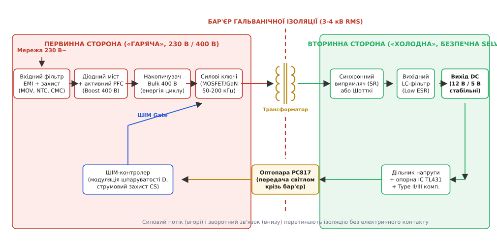
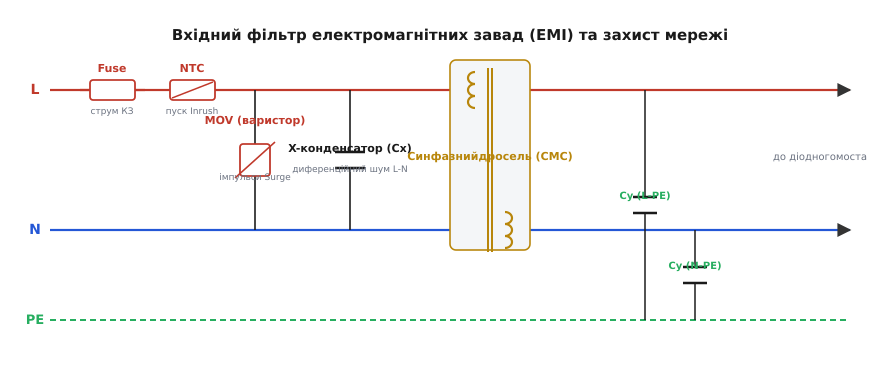
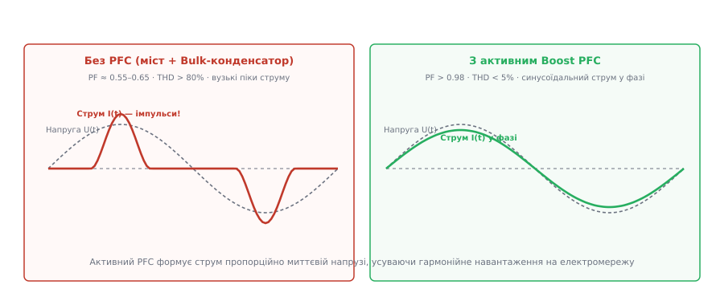
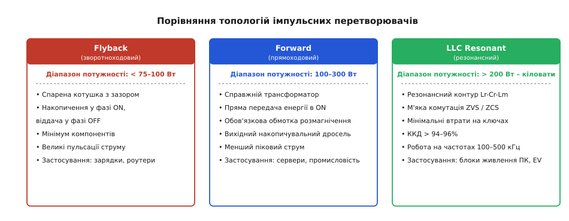
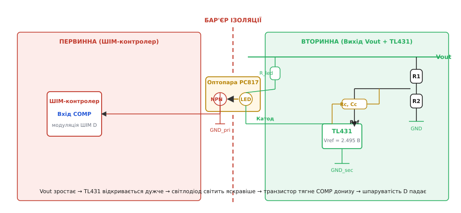
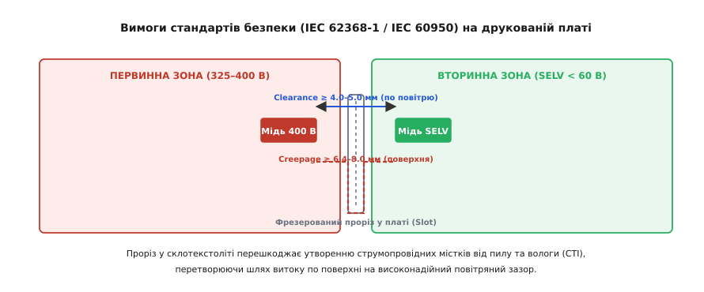

# Імпульсний блок живлення

<preknowlist>
- [Випрямлення](book:electronics/rectification) — перетворення змінного струму на постійний діодним мостом.
- [Діодний міст](book:electronics/bridge-rectifier) — чотиридіодна мостова схема двопівперіодного випрямлення.
- [Flyback-перетворювач](book:electronics/flyback-isolated) — зворотноходовий перетворювач із магнітним накопиченням у спареній котушці.
- [Boost-перетворювач](book:electronics/boost) — підвищувальна топологія з накопичувальним дроселем.
- [TL431](book:electronics/tl431) — регульоване трививідне джерело опорної напруги для контурів стабілізації.
- [Оптопара](book:electronics/optocoupler) — передача аналогового та дискретного сигналу крізь діелектричний бар'єр світловим променем.
- [Синхронний випрямляч](book:electronics/sync-rectifier) — заміна діода активним польовим транзистором для зменшення падіння напруги.
- [Безпека з мережею](book:electronics/mains-safety) — правила гальванічного розриву, шляхи струмів ураження та захисне заземлення.
</preknowlist>

Лінійне джерело живлення потужністю 100 Вт потребує масивного трансформатора з трансформаторної сталі вагою понад 2 кг. Причина криється у низькій частоті побутової електромережі: за частоти 50 Гц закон електромагнітної індукції Фарадея вимагає величезного перерізу осердя й тисяч витків мідного дроту, щоб магнітний потік не насичував залізо. Після випрямлення лінійний стабілізатор гасить зайву різницю напруг на регулювальному транзисторі. Якщо на вході стабілізатора діє випрямлена напруга 12 В, а навантаженню потрібні стабільні 5 В за струму 20 А (вихідна потужність 100 Вт), на транзисторі безперервно спадає 7 В, що перетворюється на 140 Вт суцільного тепла. Коефіцієнт корисної дії такої системи не перевищує 41%, а для розсіювання тепла потрібен громіздкий ребристий радіатор і шумний вентилятор.

**Імпульсний блок живлення** (англ. *Switched-Mode Power Supply*, SMPS) розв'язує цю суперечність одночасним переходом до двох інженерних принципів: **високочастотного перетворення** (комутація на частотах 50–200 кГц замість 50 Гц) та **ключового режиму роботи** силових напівпровідників. Оскільки необхідний об'єм феритового осердя трансформатора обернено пропорційний робочій частоті, підвищення частоти комутації в тисячі разів зменшує габарити трансформатора від важкої двокілограмової цеглини до мініатюрного компонента вагою 50 грамів. Водночас силові транзистори працюють виключно як перемикачі: у замкненому стані падіння напруги на них близьке до нуля, а в розімкненому — струм через них не тече взагалі. Статичні втрати потужності стають мізерними, а загальний ККД мережевого джерела сягає 88–96%. Як [еволюція імпульсного живлення](book:electronics/switching-psu/hist-rod-holt-apple2.md) змінила обчислювальну техніку, показав комп'ютер Apple II у 1977 році, де відмова від трансформатора на 50 Гц уперше зробила персональний комп'ютер компактним і безшумним.


*Повна архітектура мережевого ізольованого імпульсного джерела: енергія рухається зліва направо від мережі крізь фільтри, активний PFC, перетворювач та вихідний випрямляч, а контур стабілізації на базі TL431 передає сигнал керування у зворотний бік крізь бар'єр ізоляції за допомогою світлового променя оптопари.*

---

### Шлях енергії та сигналу: глобальна структура

Мережевий блок живлення містить дві фізично розділені функціональні частини:
1. **Первинна («гаряча») сторона** — підключена безпосередньо до електромережі 230 В AC і високовольтної шини постійного струму 325–400 В DC. Будь-який електричний контакт людини з цією зоною смертельно небезпечний.
2. **Вторинна («холодна») сторона** — формує стабілізовані вихідні напруги безпечного наднизького рівня (англ. *Safety Extra Low Voltage*, SELV, наприклад +12 В, +5 В, +3.3 В), з якими користувач може безпечно контактувати через роз'єми живлення чи корпус приладу.

Між цими зонами пролягає нерозривний **бар'єр гальванічної ізоляції** (від прізвища Луїджі Гальвані, *galvanic isolation*), який енергія перетинає виключно у вигляді високочастотного змінного магнітного поля крізь осердя імпульсного трансформатора, а інформаційний сигнал регулювання — у вигляді світлового потоку крізь оптопару.

---

### Вхідні кола захисту та фільтрації електромагнітних завад (EMI)

Електромережа 230 В не є ідеальним синусоїдним джерелом. Вона постійно містить високовольтні імпульсні перенапруги від комутації індуктивних навантажень, розрядів блискавок та промислового обладнання. З іншого боку, сам імпульсний блок живлення є потужним генератором завад: перемикання сотень вольтів за десятки наносекунд породжує швидкість наростання напруги `dV/dt > 10⁹ В/с` і струму `dI/dt > 10⁸ А/с`. Без вхідного фільтра ці високочастотні гармоніки підуть назад у мережеві дроти, перетворюючи їх на передавальні антени радіозавад.

Вхідна захисна ланка встановлюється на самому вході живлення перед будь-якими напівпровідниками.


*Схема вхідного фільтра та захисту мережі: послідовний плавкий запобіжник і термістор NTC захищають від коротких замикань і пускового струму, варистор MOV зрізає високовольтні перенапруги, X-конденсатор гасить диференційний шум між лініями, а синфазний дросель і Y-конденсатори відводять синфазний шум на заземлення.*

#### 1. Плавкий запобіжник (Fuse) та варисторний захист від перенапруг (MOV)

У фазну лінію `L` послідовно вмикається керамічний або скляний запобіжник (*Fuse*), розрахований на розрив кола у випадку внутрішнього пробою діодного моста чи силових транзисторів.

Паралельно лініям фази `L` та нейтралі `N` встановлюється **варистор** (від англ. *variable resistor* — змінний резистор, зазвичай оксидно-цинковий *Metal-Oxide Varistor*, MOV). За номінальної напруги 230 В опір варистора перевищує десятки мегаомів, і струм крізь нього не тече. Коли в мережі виникає високовольтний мікросекундний сплеск напруги амплітудою в кілька кіловольт (грозовий розряд або комутаційний сплеск *Surge*), внутрішня полікристалічна структура оксиду цинку лавинно відкривається. Опір варистора миттєво падає до часток ома, закорочуючи сплеск напруги на рівні 385–420 В і поглинаючи енергію імпульсу (до сотень джоулів), захищаючи розташовані далі компоненти.

#### 2. Термістор обмеження пускового струму (NTC Inrush Protection)

У момент увімкнення блоку живлення в розетку високовольтний електролітичний конденсатор шини DC є повністю розрядженим. Його еквівалентний послідовний опір становить менше 0.5 Ом. Якби мережа підключилася в момент піку синусоїди (325 В), вхідний струм заряду досяг би 100–200 А, що спричинило б зварювання контактів мережевого вимикача, вибивання автоматів у щитку та деградацію діодного моста.

Для обмеження цього струму послідовно з фазою встановлюють **термістор NTC** (від грец. *therme* — тепло та англ. *negative temperature coefficient* — негативний температурний коефіцієнт опору). У холодному стані при кімнатній температурі 25 °C термістор має помітний опір (5–10 Ом), що надійно обмежує стартовий кидок струму на рівні `I_inrush = 325 В / 10 Ом = 32.5 А`. Під час протікання робочого струму джоулеве тепло нагріває термістор до 80–120 °C, внаслідок чого його опір падає до часток ома (0.1–0.3 Ом), не спричиняючи значних втрат під час нормальної роботи. У потужних блоках живлення (понад 300–500 Вт) гарячий NTC після завершення пуску додатково шунтують контактами електромагнітного реле, повністю усуваючи втрати потужності на ньому.

#### 3. Фільтрація диференційного та синфазного шуму (X- та Y-конденсатори, синфазний дросель)

Завади від імпульсного перемикача поділяються на два фізичні типи:
* **Диференційний шум** (англ. *Differential-Mode Noise*) — струм завади протікає по дроту фази `L` в один бік і повертається по нейтралі `N` у протилежний. Для його пригнічення між провідниками `L` та `N` встановлюють **X-конденсатори** (металізовані поліпропіленові плівкові конденсатори класу X1 або X2 ємністю 0.1–0.47 мкФ). Вони мають властивість самовідновлення діелектрика при мікропробоях і витримують пікові випробувальні імпульси до 2.5–4 кВ без короткого замикання.
* **Синфазний шум** (англ. *Common-Mode Noise*) — високочастотний струм витоку крізь паразитні ємності між радіаторами, ключами, обмотками трансформатора й корпусом приладу протікає одночасно по дротах `L` і `N` в одному напрямку, повертаючись крізь дріт захисного заземлення `PE` (англ. *Protective Earth*).

Для боротьби з синфазним шумом застосовують зв'язку з **синфазного дроселя** (англ. *Common-Mode Choke*, CMC) та **Y-конденсаторів**:
* Синфазний дросель має дві однакові зустрічно намотані обмотки на спільному високопроникному феритовому тороїдальному осерді. Робочий струм мережі 50 Гц тече крізь обмотки у протилежних напрямках, створюючи магнітні потоки, які повністю компенсують один одного (`Φ_total = 0`). Осердя не насичується, а диференційна індуктивність дроселя близька до нуля. Для синфазного ж шуму струми в обох обмотках течуть в один бік, магнітні потоки додаються, створюючи для завади величезний індуктивний опір (індуктивність 5–30 мГн).
* **Y-конденсатори** (класу Y1 або Y2, ємністю 1–4.7 нФ) підключаються між кожною лінією живлення (`L` та `N`) і захисним заземленням `PE`. Вони замикають високочастотний струм синфазної завади на локальний контур заземлення до того, як він розповсюдиться по зовнішній електромережі. До Y-конденсаторів висувають найжорсткіші вимоги безпеки: за стандартом IEC 60384-14 вони ніколи не повинні виходити з ладу в режимі короткого замикання, оскільки це подало б смертельну напругу мережі 230 В безпосередньо на металевий корпус приладу.

---

### Діодний міст, шина постійного струму та необхідність PFC

Після фільтра змінна синусоїдна напруга 230 В випрямляється діодним мостом і заряджає високовольтний електролітичний конденсатор шини DC (*Bulk capacitor*).

Амплітудне значення напруги на конденсаторі без навантаження:

```
V_bulk_pk = V_rms · √2 = 230 В · 1.4142 ≈ 325 В
```

#### Проблема пасивного випрямляча з конденсатором

У найпростішій схемі конденсатор великої ємності заряджається від мережі лише в ті короткі проміжки часу `Δt` навколо вершини синусоїди, коли миттєва напруга мережі перевищує поточну напругу на конденсаторі (`|v_ac(t)| > V_bulk`). У результаті діодний міст споживає струм не синусоїдно, а у вигляді коротких, вузьких і високих піків з амплітудою 10–25 А за середнього струму споживання лише 1–2 А.


*Порівняння форми струму мережі: ліворуч — без PFC струм споживається короткими гострими імпульсами на піках напруги (PF ≈ 0.60, THD > 80%); праворуч — активний Boost PFC витягує чисту синусоїду струму у фазі з напругою (PF > 0.98, THD < 5%).*

Така імпульсна форма споживання призводить до тяжких наслідків:
1. **Низький коефіцієнт потужності** (*Power Factor*, `PF = P / S = cos(φ) · K_dist`). Навіть якщо зсув фази між напругою та струмом нульовий (`cos(φ) ≈ 1`), коефіцієнт гармонічного спотворення струму `K_dist` падає до 0.55–0.65.
2. **Перевантаження нейтральних провідників.** Несинусоїдний струм містить потужні непарні гармоніки (3-тю, 9-ту, 15-ту частотою 150, 450, 750 Гц). У трифазних мережах офісних будівель струми третьої гармоніки в нейтральному проводі не віднімаються, а алгебраїчно додаються, спричиняючи перегрів і відгоряння нульового проводу.
3. **Обмеження стандарту IEC 61000-3-2.** Міжнародні нормативи забороняють використання пасивного живлення для джерел потужністю понад 75 Вт без спеціальних заходів пригнічення гармонік.

#### Активний коректор коефіцієнта потужності (Active Boost PFC)

Для виправлення форми струму між діодним мостом і основним накопичувальним конденсатором встановлюють **активний коректор коефіцієнта потужності** (англ. *Power Factor Correction*, PFC). Це імпульсний підвищувальний перетворювач (*Boost*), контролер якого синхронізується з формою вхідної напруги.

Спеціальний вимірювальний дільник подає на контролер форму випрямленої напівсинусоїди `|v_in(t)|`. Контролер керує силовим транзистором MOSFET так, щоб середній струм через дросель у кожен мікросекундний момент часу був строго пропорційний миттєвій напрузі мережі:

```
i_in(t) = k · v_in(t)
```

Завдяки цьому вхідний струм, усереднений на комутаційній частоті (65–100 кГц), стає ідеальною синусоїдою, що точно збігається за фазою з напругою мережі.

Переваги активного Boost PFC:
* Коефіцієнт потужності зростає до `PF = 0.98–0.99`, а сумарний коефіцієнт гармонік падає нижче `THD < 5%`.
* Накопичувальний конденсатор заряджається до фіксованої підвищеної напруги **`V_bulk = 390–400 В DC`**, яка залишається абсолютно стабільною навіть за сильних коливань мережі в діапазоні від 85 В до 265 В AC (універсальний вхід *Universal Mains*).
* Детальний розрахунок ємності накопичувача за часом утримання та вибір індуктивності дроселя винесено в [розрахунок накопичувача й PFC-дроселя](book:electronics/switching-psu/math-pfc-boost.md).

---

### Топології перетворювальної секції: вибір для різних потужностей

Після формування стабільної шини 400 В DC енергію необхідно перетворити на низьку вихідну напругу з обов'язковою гальванічною розв'язкою. Залежно від вихідної потужності та вимог до ККД застосовують три класичні топології.


*Порівняння перетворювальних топологій SMPS: Flyback для компактних зарядок і адаптерів до 100 Вт; Forward для серверних джерел 100–300 Вт; резонансний LLC для високоефективних блоків живлення ПК та інверторів від 200 Вт до кіловатів.*

#### 1. Зворотноходовий перетворювач (Flyback, потужність < 75–100 Вт)

Flyback є найдешевшою та найпростішою топологією, яка містить лише один силовий ключ і спільну спарену котушку з немагнітним повітряним зазором в осерді.
* **Фаза накопичення (ON):** транзистор замкнено, до первинної обмотки прикладено 400 В, струм лінійно зростає, осердя запасає енергію в магнітному полі зазору. Вторинний діод у цей час закритий зустрічним увімкненням обмоток (за конвенцією точок).
* **Фаза передачі (OFF):** транзистор розмикається, напруга на обмотках миттєво змінює полярність, вторинний діод відкривається, і вся накопичена в зазорі магнітна енергія «відлітає» у вихідний конденсатор.

Головна перевага Flyback — відсутність окремого вихідного накопичувального дроселя. Недолік — високі пульсації струму через вихідний конденсатор і підвищене напруження на первинному ключі, через що його рідко застосовують на потужностях понад 100 Вт.

#### 2. Прямоходовий перетворювач (Forward, потужність 100–300 Вт)

На відміну від Flyback, у Forward-перетворювачі використовується справжній трансформатор, який не запасає енергію у своєму осерді, а передає її безпосередньо у вторинне коло в той самий момент, коли первинний транзистор відкритий.
* **Фаза прямого ходу (ON):** ключ замкнено, напруга первинної обмотки трансформується у вторинну, відкриваючи випрямний діод. Струм вливається у вихідний LC-фільтр, накопичуючи енергію у вихідному дроселі.
* **Фаза розмагнічення (OFF):** під час розмикання ключа трансформатор мусить повністю скинути намагніченість осердя до нуля перед початком наступного циклу, інакше через накопичення залишкової індукції осердя насититься за кілька комутацій. Для цього застосовують додаткову третю обмотку розмагнічення з діодом або схему активного демпфування (*Active Clamp*). Струм у навантаження в цей час підтримується розрядом вихідного дроселя крізь замикальний діод (*Freewheeling diode*).

Forward має значно менші пульсації струму на виході, ніж Flyback, завдяки наявності вихідного дроселя.

#### 3. Резонансний напівмостовий перетворювач (LLC Resonant, потужність > 200 Вт – кіловати)

Сучасні блоки живлення персональних комп'ютерів стандарту 80 PLUS Gold/Platinum/Titanium, зарядні станції електромобілів та сервери базуються на резонансній топології LLC (від лат. *resono* — відгукуюсь, звучу у відповідь).

Схема складається з напівмоста з двох MOSFET-транзисторів і послідовного резонансного контуру, утвореного трьома елементами: резонансною індуктивністю `L_r`, індуктивністю намагнічування трансформатора `L_m` та резонансним конденсатором `C_r`.

Ключова перевага LLC — **м'яка комутація** (англ. *Zero-Voltage Switching*, ZVS). Завдяки резонансу струму напруга на стоку кожного транзистора встигає впасти до чистого нуля ще до того, як драйвер подасть відмикальний сигнал на затвор. Оскільки напруга в момент відкривання дорівнює нулю, динамічні втрати комутації повністю зникають (`P_sw = 0.5 · V · I · t_sw = 0`). Це дає змогу підняти частоту комутації до 150–500 кГц, радикально зменшити розміри трансформатора та досягти ККД перетворювача понад 95–97%.

---

### Високочастотний імпульсний трансформатор: матеріали та конструкція

Імпульсний трансформатор є серцем SMPS, що поєднує функцію масштабування напруги з бар'єром гальванічної ізоляції.

#### 1. Феритові осердя (MnZn-матеріали)

На частотах 50–200 кГц традиційна електротехнічна сталь не працює: через високу провідність заліза вихрові струми Фуко миттєво розігріли б сталеве осердя до червоного розжарення. Тому в імпульсних джерелах застосовують магнітодіелектрики — силові ферити на основі оксидів марганцю та цинку (MnZn). Вони мають питомий електричний опір у мільйони разів вищий, ніж метал, що зводить втрати на вихрові струми до мінімуму за збереження високої магнітної проникності (`μ_r = 2000–3000`).

#### 2. Скін-ефект та ефект близькості (Litz Wire)

На високих частотах змінний струм витісняється до зовнішньої поверхні провідника внаслідок **скін-ефекту** (англ. *skin effect*). Глибина проникнення струму в мідь визначається формулою:

```
δ = √(ρ / (π · f · μ))
```

Для міді за робочої температури 70 °C на частоті 100 кГц товщина скін-шару становить лише `δ ≈ 0.23 мм`. Якщо намотати обмотку товстим дротом діаметром 1.5 мм, його внутрішня серцевина не проводитиме струм, а еквівалентний опір зросте в рази.

Щоб подолати скін-ефект та взаємне витіснення струмів сусідніми витками (*Proximity effect*), обмотки виконують **літцендратом** (нім. *Litzendraht* — плетений дріт, джгут із десятків або сотень ізольованих лаком тонких провідників діаметром 0.07–0.1 мм) або тонкими мідними стрічками-фольгами на всю ширину каркаса.

#### 3. Індуктивність розсіювання та RCD-снабер

Жоден реальний трансформатор не здатний зчепити 100% магнітного потоку між обмотками: частина ліній замикається крізь повітря, утворюючи паразитну **індуктивність розсіювання** (англ. *Leakage Inductance*, `L_leak`, зазвичай 1–3% від індуктивності первинної обмотки).

Коли силовий транзистор розмикається, струм первинної обмотки різко обривається. Енергія, запасена в індуктивності розсіювання `E_leak = (1/2) · L_leak · I_pk²`, не може миттєво передатися у вторинне коло. Згідно із законом самоіндукції `v(t) = -L · (di/dt)`, цей обрив струму створює на стоку транзистора гострий сплеск напруги в сотні вольтів, здатний миттєво пробити кристал MOSFET.

Для приборкання цього викиду паралельно первинній обмотці підключають **демпферний RCD-снабер** (швидкодіючий діод `D_snubber`, конденсатор `C_snubber` та паралельний резистор `R_snubber`). У момент розмикання ключа діод снабера відкривається і скидає енергію витоку в конденсатор, де вона плавно розсіюється на резисторі, обмежуючи пікову напругу стоку на безпечному рівні (наприклад, 550 В для транзистора з напругою пробою 650 В).

---

### Вихідне випрямлення: діоди Шотткі проти синхронного випрямлення

На вторинному боці змінна високочастотна напруга з обмотки випрямляється і фільтрується. На низьковольтних шинах (наприклад, +5 В або +12 В за великих вихідних струмів 20–50 А) втрати на прямому падінні напруги випрямляча стають вирішальним чинником ККД.

#### 1. Діоди Шотткі

Звичайні кремнієві діоди мають пряме падіння `V_f = 0.9–1.1 В`, що на шині 5 В дає пряму втрату понад 20% всієї виробленої енергії. Діоди Шотткі (бар'єр метал-напівпровідник) мають значно менше падіння напруги `V_f = 0.45–0.55 В` та практично нульовий час зворотного відновлення. Проте навіть за падіння 0.5 В на струмі 30 А діод виділяє:

```
P_loss = V_f · I_out = 0.5 В · 30 А = 15 Вт тепла!
```

Ці 15 Вт вимагають встановлення масивного алюмінієвого радіатора.

#### 2. Синхронне випрямлення (Synchronous Rectification, SR)

У високоефективних блоках живлення діоди замінюють польовими N-канальними MOSFET-транзисторами з ультранизьким опором відкритого каналу (від грец. *synchronos* — одночасний).

Сучасні низьковольтні MOSFET мають опір `R_ds_on = 1.0–2.5 мОм`. Під час протікання струму 30 А падіння напруги та втрати на транзисторі становлять:

```
V_drop = I_out · R_ds_on = 30 А · 0.0015 Ом = 0.045 В (45 мВ замість 500 мВ!)
P_loss = I_out² · R_ds_on = 30² · 0.0015 = 900 · 0.0015 = 1.35 Вт (замість 15 Вт!)
```

Втрати зменшуються більш ніж у 10 разів, що усуває необхідність у великих радіаторах і піднімає ККД на кілька відсотків.

Керує транзистором спеціалізована мікросхема — **контролер синхронного випрямлення** (SR Controller). Вона безперервно відстежує падіння напруги на виводах стік-витік `V_ds` транзистора. Щойно внутрішній паразитний діод транзистора починає проводити прямий струм (`V_ds < 0`), контролер негайно відкриває затвор MOSFET, пускаючи струм крізь низькоомний канал. Щойно вторинний струм спадає майже до нуля перед завершенням такту, контролер миттєво закриває затвор, перешкоджаючи зворотному розряду вихідних конденсаторів у трансформатор.

#### 3. Вихідний фільтр: Low ESR конденсатори

Пульсації вихідної напруги імпульсного джерела на частоті комутації визначаються не стільки ємністю конденсатора, скільки його **еквівалентним послідовним опором** (англ. *Equivalent Series Resistance*, ESR):

```
ΔV_ripple ≈ ΔI_L · ESR
```

Звичайні алюмінієві електролітичні конденсатори мають високий ESR (0.1–0.5 Ом), через що вихідна напруга містила б неприпустимі пульсації в сотні мілівольтів. Тому на виході застосовують твердотільні полімерні електролітичні конденсатори (*Solid Polymer*, `ESR = 5–15 мОм`) у парі з багатошаровими керамічними конденсаторами (MLCC), які доповнюються вторинним LC-фільтром (*Pi-filter*) для пригнічення високочастотних комутаційних голок.

---

### Контур зворотного зв'язку крізь бар'єр ізоляції

Стабільність вихідної напруги за стрибків вхідної напруги мережі та струму навантаження забезпечується замкненим контуром регулювання. Складність полягає в тому, що напругу вимірюють на вторинному («безпечному») боці, а керувати тривалістю імпульсів ШІМ-контролера потрібно на первинному («небезпечному») боці, не порушуючи гальванічної розв'язки.


*Контур ізольованого зворотного зв'язку: опорне джерело TL431 порівнює напругу з дільника з внутрішнім опорним рівнем 2.495 В і керує струмом світлодіода оптопари PC817; фототранзистор на первинному боці модулює вхід COMP ШІМ-контролера, підлаштовуючи шпаруватість D без металевого контакту між сторонами.*

#### 1. Джерело опорної напруги TL431

На вторинному боці встановлюють прецизійну мікросхему регульованого паралельного стабілізатора **TL431**. Вона містить термокомпенсоване джерело опорної напруги на ширині забороненої зони кремнію (*Bandgap reference*, `V_ref = 2.495 В`) та інтегральний операційний підсилювач похибки.

Резистивний дільник `R1 / R2` масштабує вихідну напругу `V_out` так, щоб за номінального рівня на керувальному виводі `Ref` було рівно 2.495 В:

```
V_out = V_ref · (1 + R1 / R2)
```

Якщо вихідна напруга `V_out` зростає (наприклад, через зменшення струму навантаження), напруга на вході `Ref` перевищує 2.495 В. Внутрішній підсилювач відкриває вихідний транзистор TL431, збільшуючи струм, що протікає від шини `V_out` крізь світлодіод оптопари.

#### 2. Оптопара (Optocoupler PC817)

Світлодіод оптопари випромінює інфрачервоний промінь крізь прозорий кремнійорганічний діелектрик усередині корпусу на базу кремнієвого фототранзистора. Фототранзистор розташований на первинному боці перетворювача.

Коли струм світлодіода зростає, фототранзистор відкривається дужче й підтягує вхід `COMP` (вхід компаратора струму) первинного ШІМ-контролера ближче до первинної землі. ШІМ-контролер реагує на зниження напруги на вході `COMP` негайним зменшенням шпаруватості комутації `D` силового транзистора. Енергія, що накачується в трансформатор щоциклу, падає, і вихідна напруга повертається до свого точного номінального рівня. Детальний внутрішній устрій первинної мікросхеми керування розглянуто в [архітектурі ШІМ-контролера імпульсного джерела](book:electronics/switching-psu/comp-smps-controller.md).

#### 3. Частотна компенсація контуру (Type II / Type III Compensation)

Система перетворювача містить полюси та нулі передавальної функції, утворені вихідним LC-фільтром, ємністю та ESR конденсаторів, а також паразитним полюсом самої оптопари (ємність переходу фототранзистора уповільнює передачу на частотах понад 10–30 кГц).

Без частотної корекції затримка сигналу в контурі зворотного зв'язку на високих частотах досягне фазового зсуву 180°, перетворюючи негативний зворотний зв'язок на позитивний. Система збудиться, перетворювач увійде в режим автоколивань на низькій частоті, а вихідна напруга покриється пилкоподібними пульсаціями.

Щоб запобігти цьому, між катодом і входом `Ref` мікросхеми TL431 встановлюють ланцюг компенсації (RC-ланцюг типу **Type II** для перетворювачів струмового режиму або **Type III** для перетворювачів напругового режиму). Цей ланцюг формує низькочастотний інтегрувальний полюс для забезпечення нульової статичної похибки та нуль для компенсації фазового запізнення. Параметри підбирають так, щоб частота одиничного підсилення контуру (*Crossover frequency*, `f_c`) становила 1/10–1/5 від частоти комутації, а запас за фазою становив не менше `φ_m ≥ 45°–60°`. Це гарантує швидкий і стійкий аперіодичний відгук на будь-який стрибок струму навантаження без перерегулювання та коливань.

---

### Стандарти безпеки, шляхи витоку, зазори та класи ізоляції

Оскільки мережевий блок живлення безпосередньо з'єднує небезпечну мережу 230 В із доступними людині низьковольтними колами, його проєктування жорстко регламентується міжнародними стандартами безпеки (IEC 62368-1 для аудіо/відео та IT-обладнання, IEC 60601-1 для медичної техніки).


*Вимоги електробезпеки на друкованій платі: найкоротша відстань через повітря називається Clearance (≥ 4–5 мм); відстань по поверхні текстоліту — Creepage (≥ 6.4–8 мм). Фрезерований наскрізний проріз (Slot) усуває поверхневий шлях витоку, значно підвищуючи електричну міцність бар'єра.*

#### 1. Повітряний зазор (Clearance) та шлях витоку по поверхні (Creepage)

* **Повітряний зазор** (англ. *Clearance* — чистий проміжок) — найкоротша пряма відстань між двома струмопровідними елементами крізь повітря. Ця відстань визначає стійкість до електричного пробою повітряного проміжку під час високовольтних атмосферних перенапруг. Для підсиленої ізоляції (*Reinforced Insulation*) за робочої напруги 250 В AC зазор має становити не менше **4.0–5.0 мм**.
* **Шлях витоку** (англ. *Creepage* — повільне проповзання) — найкоротша відстань між провідниками вздовж твердої поверхні діелектрика друкованої плати. З часом на поверхні плати осідають пил, волога та солі, що утворюють мікроскопічні струмопровідні доріжки (явище трекінгу). Для запобігання поверхневому пробою стандарт вимагає відстань витоку не менше **6.4–8.0 мм**.

Якщо габарити плати не дають змоги витримати 8 мм між виводами первинної та вторинної сторін (наприклад, під корпусом оптопари або трансформатора), на платі роблять **наскрізний фрезерований проріз** (англ. *Milling Slot*) завширшки 1.5–2 мм. Повітряний розріз розриває поверхню склотекстоліту, перетворюючи довгий шлях витоку по поверхні на високонадійний повітряний зазор.

#### 2. Випробування електричної міцності ізоляції (Hi-Pot Test)

Кожен виготовлений блок живлення проходить обов'язковий тест на високовольтну міцність ізоляції (*High Potential Test*): між замкненими накоротко вхідними клемами (`L`+`N`) та вихідними клемами прикладають випробувальну напругу **3000 В змінного струму (RMS)** або **4242 В постійного струму** протягом 60 секунд. Протягом цього часу струм витоку крізь ізоляцію трансформатора й оптопари не повинен перевищувати 1–5 мА без виникнення іскрових розрядів чи пробою діелектрика.

#### 3. Класи захисту обладнання

* **Клас I (Class I)** — прилад має робочу ізоляцію та обов'язковий третій контакт захисного заземлення `PE` на вилці живлення. Усі металеві частини корпусу надійно з'єднані з землею `PE`. У разі внутрішнього пробою фази на корпус струм миттєво стікає в землю, викликаючи спрацьовування автоматичного вимикача чи ПЗВ (пристрою захисного вимкнення).
* **Клас II (Class II, подвійна ізоляція)** — прилад має двополюсну вилку без заземлення (маркується піктограмою двох вкладених квадратів ⧈, типовий приклад — адаптери для смартфонів і ноутбуків). Усі ізоляційні бар'єри (трансформатор, оптопара, пластиковий корпус) виконані з подвійним або підсиленим запасом міцності, що гарантує абсолютну безпеку людини навіть без наявності захисного заземлення в розетці.

---

### Аварійні режими та захисна автоматика

Сучасний імпульсний блок живлення містить багаторівневу систему автоматичного самозахисту, інтегровану в аналогову логіку контролерів:

1. **Поциклове обмеження струму та переривчастий режим (Hiccup Mode).** Під час короткого замикання на виході первинний струмовий датчик обмежує піковий струм кожного імпульсу на безпечному рівні. Оскільки вихідна напруга падає до нуля, допоміжна обмотка трансформатора перестає живити мікросхему ШІМ. Контролер вимикається за порогом UVLO, чекає, поки пусковий резистор знову повільно зарядить конденсатор живлення (0.5–1 секунда), намагається запуститися знову, фіксує коротке замикання і знову засинає. У такому переривчастому режимі «гикавки» (*Hiccup*) блок живлення може перебувати під повним коротким замиканням тижнями, споживаючи від розетки менше 1 Вт і не нагріваючись. Щойно коротке замикання усувають, блок автоматично повертається в нормальний робочий режим.
2. **Захист від перенапруги на виході (Overvoltage Protection, OVP).** Якщо контур зворотного зв'язку обривається (наприклад, пошкоджено оптопару), перетворювач починає видавати максимальну шпаруватість, і вихідна напруга неконтрольовано зростає. Окремий компаратор OVP або захисний супресор фіксує перенапругу й апаратно блокує генерацію імпульсів засувкою (*Latch-off*), вимагаючи повного знеструмлення мережі для повторного скидання.
3. **Тепловий захист (Overtemperature Protection, OTP).** Вбудований у силіконовий кристал контролера термодавач вимикає генерацію, якщо температура кристала перевищує безпечний поріг (140–150 °C), запобігаючи тепловому саморуйнуванню блоку за зупинки вентилятора охолодження чи екстремальної температури довкілля.
4. **Енергоощадний черговий режим (Burst Mode / Green Mode).** За відсутності навантаження на виході частота комутації різко знижується, або контролер переходить у пачковий режим (*Burst Mode*), видаючи серію з кількох імпульсів раз на 50–100 мс і засинаючи між ними. Це зменшує власне споживання блоку в режимі очікування до лічених міліватів (< 75 мВт), задовольняючи найсуворіші міжнародні екологічні стандарти Energy Star та EU Ecodesign.
