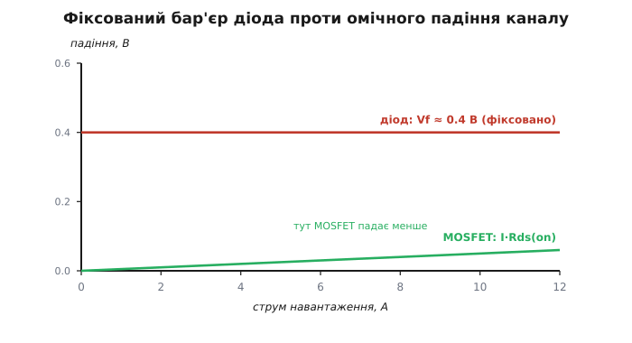
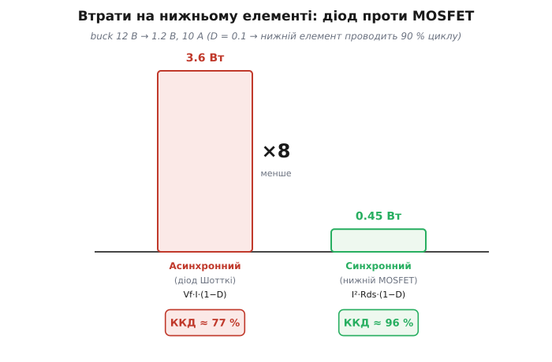
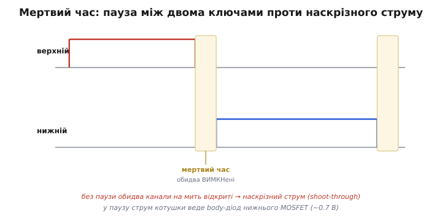

# Синхронний випрямляч

Випрямити струм — означає пропускати його лише в один бік. Найпростіший однонапрямний елемент — діод, але він робить це дорого: поки тече струм, на ньому падає напруга, і ця напруга стає теплом. **Синхронний випрямляч** (*synchronous* — від грец. *syn-* «разом» + *chronos* «час», тобто ключ, що відкривається й закривається **в такт** із фазами схеми) замінює пасивний діод керованим транзистором: контролер сам відкриває його саме тоді, коли діод відкрився б, і закриває, коли діод закрився б. Результат той самий — струм тече в один бік, — але падіння напруги, а отже й втрати, у рази менші.

Найяскравіше це видно в [понижувальному buck-перетворювачі](topic:electronics/buck), тож на ньому й розберемо, де живе «синхронність», скільки вона економить і чим за це доводиться платити.

## Навіщо взагалі потрібен «нижній» елемент

Buck працює двома фазами. Верхній ключ під'єднує котушку до входу й жене в неї струм — котушка запасає енергію в магнітному полі. Коли верхній ключ розмикається, струм у котушці не може обірватися миттєво: індуктивність — це інерція для струму, і він мусить текти далі. Без шляху для нього напруга на котушці злетіла б до сотень вольтів (L·dI/dt при різкому обриві) і щось би пробила. Тому у фазі ВИМК струмові котушки потрібен зворотний шлях — «черговий» (*freewheel*) елемент, що замикає його на землю.

Цей freewheel-елемент роблять двома способами:

- **Асинхронний** (*asynchronous*, тобто «не в такт»): верхній MOSFET, а знизу — **[діод Шотткі](root:embedded/zener-schottky)** (*Schottky diode*). Коли верхній ключ закривається, напруга у вузлі котушки сама проштовхується нижче землі, діод відкривається й пропускає струм. Простіше, дешевше, менше виводів керування: контролер керує одним ключем, а діод відкривається й закривається «сам» від напруги вузла.
- **Синхронний** (*synchronous*): верхній MOSFET, а знизу — **нижній MOSFET** замість діода. Драйвер активно перемикає обидва ключі по черзі, з короткою паузою між ними. Часто обидва ключі та драйвер уже зібрані в один корпус — **power-stage** (DrMOS-клас).

Фізично обидва дають струмові котушки той самий зворотний шлях. Різниця — у тому, *скільки напруги падає* на цьому шляху, поки тече струм. Це падіння помножене на струм і є потужність, що згорить у теплі замість того, щоб піти в навантаження.

## Чому діод падає саме стільки

Звичайний кремнієвий діод — це p-n-перехід: межа між областю з надлишком дірок (p) і надлишком електронів (n). На цій межі носії дифундують назустріч і рекомбінують, утворюючи збіднену зону без вільних зарядів — потенціальний бар'єр. Щоб струм потік, зовнішня напруга має «зрівняти» цей вбудований дифузійний потенціал, а для кремнію він становить ~0.6–0.7 В. Тому звичайний діод падає ~0.7 В — це не «опір», а висота бар'єра, яку треба сплатити, перш ніж відкриється провідність.

Діод Шотткі (названий на честь німецького фізика Вальтера Шоттки, *Walter Schottky*, що описав бар'єр на контакті метал—напівпровідник) усуває саме цей бар'єр. Замість двох легованих напівпровідників він має контакт **метал — напівпровідник**. Метал не накопичує дірковий заряд, тож класичного p-n-дифузійного переходу з його високим потенціалом тут немає — лишається тільки контактна різниця робіт виходу, бар'єр Шотткі ~0.3–0.4 В. Звідси «Шотткі падає ~0.4 В замість ~0.7 В». Той самий фізичний факт дає другу перевагу: у Шотткі провідність несуть лише основні носії (електрони), накопиченого неосновного (діркового) заряду немає, тож при закриванні немає **зворотного відновлення** (*reverse recovery*) — діоду не треба «висмоктувати» накопичений заряд, він закривається майже миттєво й не дає сплеску втрат на кожному перемиканні. Для buck, що комутує сотні тисяч разів на секунду, це критично.

> 🔧 **Навіщо це.** У даташиті freewheel-діода ви побачите Vf на робочому струмі й заряд Qrr. Шотткі вибирають не «бо так заведено»: його ~0.4 В і відсутність Qrr напряму економлять вати тепла на кожному циклі. Поставите туди звичайний випрямний діод — отримаєте і вище падіння, і сплески reverse-recovery, що перегріють і діод, і верхній ключ.

MOSFET поводиться інакше. Коли він відкритий, це не бар'єр, а **опір** [Rds(on)](topic:electronics/rds-on). Падіння на ньому — I·Rds(on), і воно *пропорційне струму*, а не фіксоване. На малому струмі MOSFET падає мілівольти, тоді як діод уперто тримає свої 0.4 В навіть при крихітному струмі.


*Діод тримає майже сталі ~0.4 В при будь-якому струмі — горизонтальна лінія. Канал MOSFET падає I·Rds(on) — пряма з нуля. Поки I·Rds(on) менше за Vf, MOSFET програє лише на дуже великому струмі, а до того скрізь падає менше: при Rds у кілька міліом точка перетину лежить далеко за робочим діапазоном.*

## Скільки це економить

Уся різниця — у падінні на нижньому елементі, поки він проводить. А проводить він частку (1−D) циклу, бо решту D циклу струм веде верхній ключ. Діод тримає майже фіксоване Vf ≈ 0.4 В незалежно від струму; MOSFET — I·Rds(on), що зростає зі струмом лінійно. Звідси середня потужність втрат — добуток падіння на струм, усереднений по частці (1−D):

```
P(діод)   = Vf · I · (1−D)
P(MOSFET) = I² · Rds(on) · (1−D)
```

Асиметрія тут ключова: у діода втрати ростуть **лінійно** зі струмом (Vf фіксоване), а в MOSFET — **квадратично** (бо й падіння I·R, і сам струм ростуть зі струмом). Тому MOSFET виграє на великому струмі (поки I·Rds(on) < Vf) і лише теоретично міг би програти на дуже великому, якби Rds(on) був завеликий. На практиці Rds(on) сучасних ключів — одиниці міліом, точка перетину лежить далеко, і синхронний майже завжди попереду там, де струм відчутний.

Найгірший для діода випадок — **низький Vвих і великий струм**: тоді D мала (D ≈ Vвих/Vвх), нижній елемент працює майже весь цикл ((1−D) близьке до 1). Порахуймо buck 12 В → 1.2 В за 10 А (D = 0.1, тобто 90 % циклу — на нижньому елементі).

**Втрати на нижньому елементі: діод (Vf = 0.4 В) проти MOSFET (Rds(on) = 5 мОм), при I = 10 А, (1−D) = 0.9.**

```c
// Прошивка живиться сама й телеметрує ККД своїх шин.
// Той самий розрахунок, що вирішує, який нижній елемент ставити.
float Vf       = 0.40f;   // падіння Шотткі, В
float Rds      = 0.005f;  // Rds(on) нижнього MOSFET, Ом
float I        = 10.0f;   // струм навантаження, А
float oneMinusD = 0.9f;   // частка циклу на нижньому елементі (D = Vout/Vin = 0.1)
float Pout     = 1.2f * I; // корисна потужність = 12 Вт

float P_diode = Vf * I * oneMinusD;          // 0.40 * 10 * 0.9 = 3.6 Вт
float P_mos   = I * I * Rds * oneMinusD;      // 100 * 0.005 * 0.9 = 0.45 Вт

float eff_async = Pout / (Pout + P_diode);    // 12 / 15.6  ≈ 0.77
float eff_sync  = Pout / (Pout + P_mos);      // 12 / 12.45 ≈ 0.96
```

Майже двадцять відсотків ККД і три вати тепла — ось чому при низькому Vвих і помітному струмі синхронний випрямляч не розкіш, а необхідність. Ці 3.6 Вт треба ще й **відвести**: діод у корпусі SMA з тепловим опором ~50 °C/Вт нагрівся б на 180 °C над платою, тобто згорів би. Звідси й правило «під 3.3 В чи 1.2 В на амперах — тільки синхронний».


*На низькому Vвих і великому струмі діод палить 3.6 Вт — майже чверть корисної потужності, — тоді як нижній MOSFET із Rds(on) кілька міліом губить у вісім разів менше. Звідси ~77 % проти ~96 % ККД.*

> 🔧 **Навіщо це.** Коли ви живите ядро ESP32 чи FPGA (1.0–1.2 В, кілька ампер) від 5 чи 12 В, D виходить крихітна, і freewheel-елемент працює майже весь час. Тут діод перетворив би чверть вашої потужності на тепло й вимагав би радіатора більшого за саму мікросхему. Тому всі сучасні point-of-load перетворювачі на низьку напругу — синхронні.

## Коли асинхронний усе ж доречний

Діод не завжди гірший, і та сама формула показує, *коли* саме. За **високого Vвих і малого струму** (велика D, малий I) добуток Vf·I·(1−D) стає крихітним: і (1−D) мале (діод проводить недовго), і сам струм малий. Діод майже не гріється, а виграє в ціні, простоті й кількості виводів керування.

На **легкому навантаженні** проявляється ще одна фізична перевага діода: він **однонапрямний**. Коли струм котушки в паузі впав до нуля, діод просто закривається й не пускає струм назад — схема природно йде в DCM (*discontinuous conduction mode*, режим переривчастого струму), уникаючи марної циркуляції енергії туди-сюди.

Синхронний MOSFET цього «сам» не вміє: канал проводить в обидва боки, тож на легкому навантаженні струм потік би у *зворотний* бік — з виходу назад крізь нижній ключ у землю, — марно ганяючи енергію по колу й гріючи ключі. Щоб цього уникнути, синхронну схему *спеціально* перемикають у режим емуляції діода (DCM/DEM) або PFM, де контролер сам ловить момент нуля струму й вимикає нижній ключ. Це додаткова складність, якої в діода немає. Тож для дешевого вузла на 0.1–0.3 А з невеликим перепадом діод Шотткі — розумний вибір.

## Типові граблі

- **Синхронний — мертвий час (dead time).** Тут є небезпека, якої в діода фізично немає. Якщо верхній і нижній MOSFET увімкнені одночасно — це коротке замикання входу на землю просто крізь обидва відкриті канали, **наскрізний струм** (*shoot-through*). MOSFET не вимикається миттєво: затвор має [ємність Cgs](topic:electronics/gate-capacitance), і драйверу треба час, щоб її розрядити нижче порога Vth. Якщо нижній почав відкриватися раніше, ніж верхній устиг закритися, на якісь наносекунди обидва провідні — і крізь них летять десятки ампер, що перегрівають кристали й садять ККД. Тому драйвер вставляє **мертвий час** — паузу, коли *обидва* ключі вимкнені, щоб один гарантовано закрився до того, як відкриється другий. У цю паузу струм котушки тимчасово веде паразитний body-діод нижнього MOSFET — тому в синхронних ключах він важливий. Замало мертвого часу — наскрізний струм; забагато — зайвий час на body-діоді з його ~0.7 В, тобто втрати. Це тонкий баланс, який і налаштовує драйвер.


*Затвори перемикаються не миттєво, тож фази ВКЛ верхнього й нижнього ключів навмисно рознесені паузою. У мертвий час обидва канали закриті, а струм котушки веде body-діод нижнього MOSFET (~0.7 В). Перекрити фази — отримати наскрізний струм; розтягнути паузу — втратити на body-діоді.*

- **Синхронний — bootstrap.** Верхній MOSFET — n-канальний, і щоб його відкрити, на затвор треба напругу *вищу за вхід*: коли він відкритий, його витік «плаває» біля Vвх — типова проблема [верхнього ключа](topic:electronics/high-side-switch). Цю підвищену напругу дає **bootstrap**-конденсатор, що підзаряджається через нижній ключ у кожному циклі. Наслідок: верхній ключ не можна тримати відкритим нескінченно (100 % D) — bootstrap «висохне», бо не встигне перезарядитися.
- **Синхронний — легке навантаження.** Без режиму емуляції діода чи PFM струм циркулює в мінус, і на холостому ході перетворювач гріється дужче, ніж під навантаженням. Контрінтуїтивно, але це прямий наслідок двонапрямності каналу.
- **Асинхронний — діод гріється.** Рахуйте його тепловий режим за P = Vf·I·(1−D) і θ корпусу; беріть саме **Шотткі** (мале Vf і відсутнє зворотне відновлення), а не звичайний діод. На великому струмі він стає головним джерелом втрат — і це межа застосовності класу.

## Звідки взялася «синхронність»

Сама ідея активного випрямлення — замінити пасивний клапан на керований ключ, що замикається *в такт* зі струмом, — старша за MOSFET.

> Випрямлення керованим ключем починалося з механічних вібраторів і моторних комутаторів задовго до напівпровідників; саме MOSFET зробив його дешевим і швидким. Як механічна «синхронність» дозріла до DrMOS — у вставці.

[Історія синхронного випрямлення](topic:electronics/sync-rectifier/hist-synchronous-rectification.md)

## Варіації класу

Синхронний роблять або **контролером із зовнішніми MOSFET** (гнучко, під будь-яку потужність: ключі вибирають під свій струм), або готовим **power-stage** (DrMOS-клас: два ключі плюс драйвер в одному корпусі — компактно й швидко, з коротким контуром затвора, що зменшує дзвін і наскрізні втрати). Асинхронний — зазвичай простий **інтегрований** перетворювач з одним ключем усередині й зовнішнім діодом Шотткі. Обираючи модуль, дивіться на струм і Vвих: за формулою втрат вони майже однозначно підказують, синхронний вам потрібен чи вистачить діода. Низький Vвих або відчутний струм тягнуть до синхронного; високий Vвих із мікроамперами лишають простір діоду.
