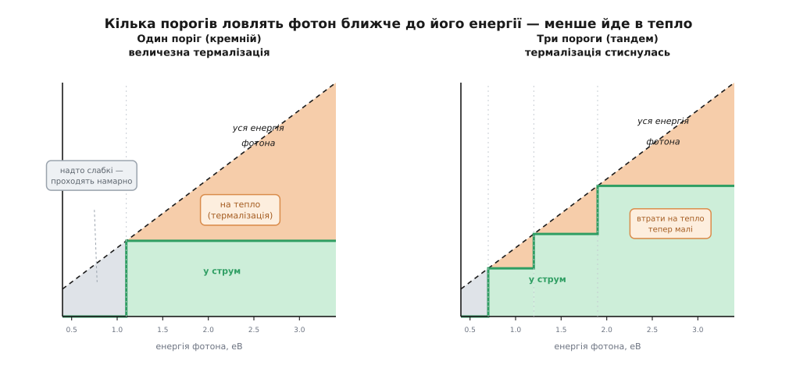
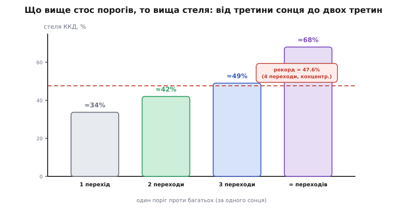
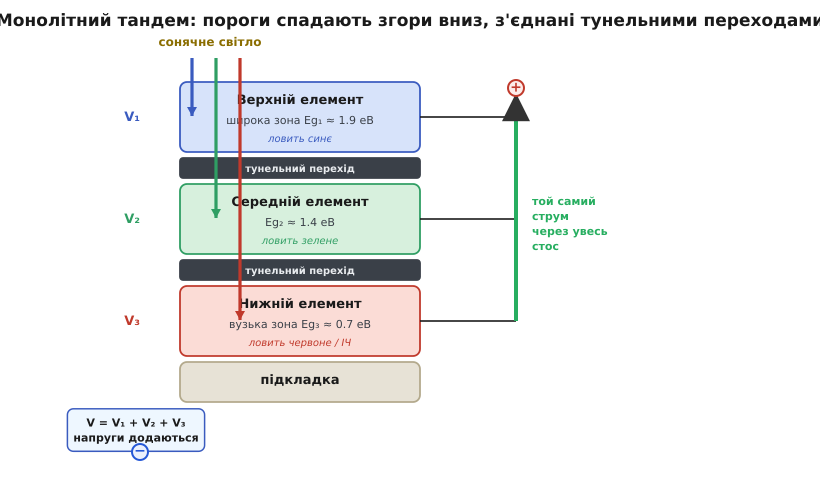
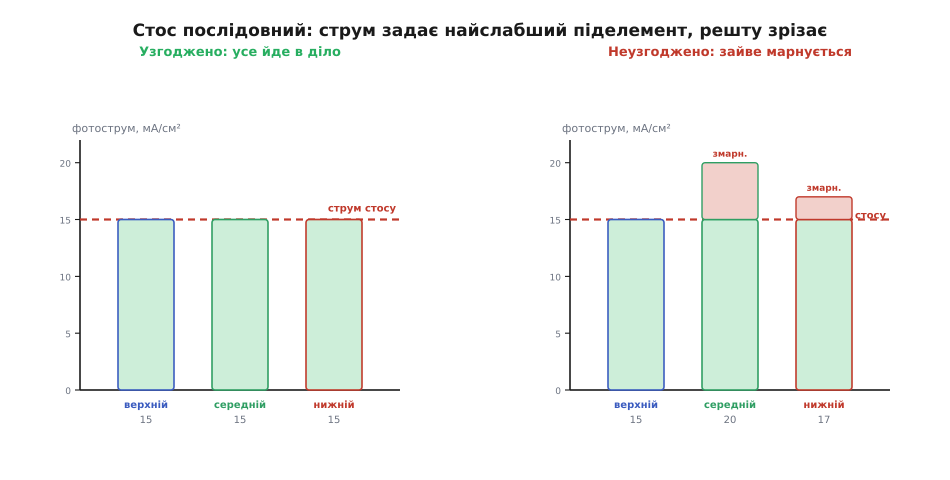

# Багатоперехідні елементи та тандемна структура

<preknowlist>
- [Фотоелемент](topic:electronics/photovoltaic-cell) — як один p-n перехід перетворює світло на струм, що таке поріг поглинання (заборонена зона) і чому елемент дає ~0.5 В.
- [Напівпровідник](topic:physics/semiconductor) — заборонена зона (bandgap) як поріг енергії, нижче якого матеріал світла не поглинає, а вище — поглинає з надлишком.
- [Крива панелі й точка максимальної потужності](topic:electronics/panel-iv-mpp) — ВАХ елемента, струм короткого замикання (фотострум), напруга холостого ходу, як послідовне з'єднання додає напруги.
</preknowlist>

Один кремнієвий перехід віддає в електрику щонайбільше близько третини сонячного світла — і це не недоробка технологів, а стеля самої фізики. Причина проста й прикра: сонце приходить сумішшю фотонів дуже різної енергії, а один поріг поглинання обслуговує цю суміш погано. Половину світла він проґавлює, від другої половини бере лише «дрібку зверху», а решту одразу перетворює на тепло. Питання напрошується само собою: якщо один поріг — це компроміс, який усім не догодить, то що, якби порогів було **кілька**, кожен під свою частину спектру? Саме на цій думці стоять багатоперехідні (тандемні) елементи — найефективніші перетворювачі сонця, які людство вміє робити.

## Чому одного порога замало

Щоб побачити виграш тандема, треба спершу ясно назвати, на чому втрачає одинак. [Фотоелемент](topic:electronics/photovoltaic-cell) поглинає фотон лише тоді, коли той енергійніший за **поріг** матеріалу — заборонену зону Eg. І тут-таки з'являються дві принципові, нікуди не дінешся, втрати.

Перша — **пропускання**. Фотон, слабший за поріг (для кремнію це все далеке інфрачервоне), крізь елемент просто проходить, наче крізь скло, не народивши жодного заряду. Його енергія втрачена цілком.

Друга — **термалізація** (від гр. *thérmē* — тепло): фотон, значно **сильніший** за поріг, пару таки народжує, але в струм іде тільки «порогова» порція його енергії — рівно Eg. Увесь надлишок над порогом за мільярдні частки секунди осідає в кристалі теплом. Що енергійніший фотон і що нижчий поріг, то більший цей надлишок.

**Скільки марнує один поріг.** Фіолетовий фотон (≈3.1 еВ) влучає в кремній (поріг 1.1 еВ):

```
енергія фотона:      3.1 еВ
поріг (у напругу):   1.1 еВ
надлишок у тепло:    3.1 − 1.1 = 2.0 еВ   →  марнується ≈65%
```

Той самий фотон, але в широкозонному матеріалі з порогом 1.9 еВ:

```
поріг (у напругу):   1.9 еВ
надлишок у тепло:    3.1 − 1.9 = 1.2 еВ   →  марнується ≈39%
```

Ось воно, зерно всієї ідеї. Високий поріг **краще** дає раду енергійним фотонам — бере з них більше, гріє менше. Але той самий високий поріг **не бачить** червоного й інфрачервоного взагалі — для нього це «підпорогове» світло, яке пройде намарно. Низький поріг, навпаки, ловить майже все, зате з кожного синього фотона витягує ганебно мало. Один поріг мусить бути або таким, або таким — обидва світи одночасно він не обслужить. Складіть обидві втрати для найкращого можливого одинарного порога — і вийде та сама фундаментальна стеля близько 33.7% (це [межа Шоклі–Квайссера](topic:electronics/shockley-queisser-limit): гранична частка сонця, яку взагалі здатен віддати один ідеальний перехід).

> 🔧 **Навіщо це.** Розуміння двох втрат одразу відповідає, чому «диво-панель на 60% ККД» — завжди ознака шахрайства, якщо йдеться про один перехід: фізика такого не дозволяє. І воно ж каже, де взагалі варто ускладнювати конструкцію: там, де кожен відсоток ККД коштує дорожче за складність, — на супутнику, у концентраторі, на крилі БПЛА.

## Ідея: поділити спектр між кількома порогами

Якщо один поріг усім не догодить, зробімо їх **кілька** й поставмо один за одним — так, щоб кожен фотон зустрів поріг, найближчий до його енергії знизу. Тоді надлишок над порогом (термалізація) буде малим для кожного фотона, а не величезним для синіх.

Порядок диктує сама фізика. Зверху, назустріч світлу, ставлять елемент із **найширшою** зоною. Він ловить сині й ультрафіолетові фотони — і робить це на **високій напрузі**, бо напруга елемента прив'язана до його порога: широка зона — велика напруга. Для нього ці сині фотони «якраз», термалізація дрібна. А для червоних і зелених він **прозорий**: їхньої енергії не вистачає, щоб він їх поглинув, тож вони безперешкодно проходять углиб. Там на них чекає наступний елемент — із **середнім** порогом, який ловить зелене. Що прослизнуло й крізь нього — дістається **нижньому** елементові з найвужчою зоною, який підбирає червоне й інфрачервоне, яке кремнієвий одинак просто пропустив би.


*По горизонталі — енергія фотона; пунктир «уся енергія фотона» показує, скільки той несе, а зелена сходинка — скільки з цього піде в струм (це поріг, який його впіймав). Проміжок між ними — надлишок, що йде в тепло. Ліворуч, з одним порогом, цей теплий клин величезний; праворуч, із трьома, сходинка тулиться до пунктиру — кожен фотон ловиться близько до своєї енергії, і термалізація стискається.*

Точна аналогія — **каскад водоспадів** із млиновими колесами на різній висоті. Одне колесо внизу підхоплює воду, що вже пролетіла всю висоту, і б'ється лише слабким її залишком, змарнувавши весь напір падіння. Три колеса, розставлені по висоті, знімають енергію потроху на кожному рівні — і разом беруть куди більше. Аналогія добра, але має межу: воду можна пустити через колеса послідовно скільки завгодно, а фотон нерозрізаний — його або ловить один поріг цілком, або він летить далі неторканим. Стос порогів не «відкушує» від фотона по шматочку; він лише **сортує** фотони, щоб кожен потрапив на найдоречніший поріг. Саме тому виграш дає не будь-яка кількість шарів, а правильно дібрані пороги під форму сонячного спектра.

## Наскільки це піднімає стелю

Кожен доданий поріг зрізає частину термалізації — і стеля ефективності росте. Порахована за тією самою фізикою детального балансу, що дає 33.7% для одного переходу, вона піднімається так:


*Гранична ефективність за одного сонця: один перехід — ≈34%, два — ≈42%, три — ≈49%, а нескінченний стос — ≈68%. Пунктир — реальний рекорд ≈47.6% (чотири переходи під концентрованим світлом). Перші переходи дають найбільший стрибок, далі віддача спадає.*

Два переходи піднімають стелю до ≈42%, три — до ≈49%. Гіпотетичний нескінченний стос за одного сонця вперся б у ≈68%, а якщо ще й сфокусувати світло лінзою (концентрація), межа сягає ≈86%. Видно й головне практичне: перші один-два додані переходи дають найбільший приріст, а далі кожен наступний окуповується дедалі важче. Тому в реального заліза їх зазвичай два, три, зрідка чотири-шість — більше рідко варте ускладнення. Звідки саме беруться ці числа й як обрати оптимальні пороги під даний спектр — розбирає [виведення стелі через детальний баланс](topic:electronics/tandem-multijunction/math-detailed-balance.md).

І це не лише теорія. Одинарний кремній у лабораторії давно вперся десь у 26–27%, упритул до своєї стелі. А багатоперехідні елементи її **пробили**: чотириперехідний III-V-елемент під концентрацією тримає світовий рекорд ≈47.6%, а земні тандеми «перовскіт на кремнії» вже перескочили за 34% — там, де самотній кремній фізично не міг би. Стеля, яку один поріг зробив непереборною, для стоса порогів виявилася просто нижчою сходинкою.

## Як стос складають: монолітний тандем і тунельний перехід

Найпоширеніший спосіб — виростити всі елементи **одним кристалом**, шар за шаром: це монолітний, або двовивідний, тандем. Світло входить згори, струм виходить двома клемами, як у звичайної панелі. Проста ззовні, ця конструкція ховає одну хитрість, без якої вона б не працювала.


*Зверху — широкозонний елемент (ловить синє), під ним — середній, унизу — вузькозонний (червоне й ІЧ); пороги спадають згори вниз. Різні кольори гаснуть на різній глибині. Елементи з'єднані послідовно тунельними переходами, тож через увесь стос тече ОДИН струм, а їхні напруги ДОДАЮТЬСЯ.*

Придивімося до стику двох сусідніх елементів. Нижній бік верхнього елемента — це його p-область, а верхній бік середнього — його n-область. Постав їх упритул — і між ними виникає **зайвий p-n перехід, повернутий назустріч робочому струму**: діод, який дивиться не туди. Він блокував би струм між елементами, і стос став би непрохідним. Розв'язок елегантний: між елементами вставляють **тунельний перехід** — надтонкий шар, скажено легований з обох боків. Легування таке щільне, що збіднена зона стискається до кількох нанометрів, і крізь неї заряди проходять квантовим **тунелюванням** — просочуються крізь бар'єр, який класично був би непереборним. Виходить майже ідеальний контакт: майже без опору, майже без втрат напруги і, що важливо, оптично прозорий — світло крізь нього йде до нижніх елементів. Це той самий фізичний прийом, що й у [тунельного (Есакі) діода](topic:electronics/tunnel-diode), тільки застосований не як окремий прилад, а як внутрішня «зшивка» стоса.

> 🔧 **Навіщо це.** Тунельний перехід — типовий приклад того, як одна фізична перешкода (паразитний зустрічний діод) знімається іншим фізичним ефектом (тунелюванням), а не обхідним дротом. Пам'ятати про нього варто, коли читаєш паспорт багатоперехідного елемента: частина його внутрішнього опору й обмеження на струм — саме від цих зшивок, і саме вони обмежують, скільки переходів реально має сенс складати.

## Плата за виграш: узгодження струмів

За монолітну простоту доводиться платити, і плата ця — головний клопіт тандема. Оскільки елементи виростили одним стосом і з'єднали послідовно, через них **тече один і той самий струм** (закон Кірхгофа: послідовне коло — спільний струм). А фотострум кожного елемента задає його власна пайка спектра. Що з цього випливає?


*Ліворуч усі три піделементи дають однаковий фотострум — увесь він іде в діло. Праворуч середній і верхній «сильніші», але послідовне коло пропускає лише струм найслабшого (нижнього): надлишок сильніших зрізається й гине теплом. Струм стосу = найменший з піделементів; напруги ж, навпаки, додаються.*

Струм стосу дорівнює струмові **найслабшого** піделемента — точно як ланцюг рветься по найтоншій ланці. Якщо верхній елемент наробив 15 мА/см², а нижній лише 13.8 — крізь стос піде 13.8, а «зайві» 1.2 мА верхнього просто ніде подітися, вони обертаються теплом. Виходить парадокс: посилити один елемент, не чіпаючи інших, — марно, а часом і шкідливо. Тому пороги добирають так, щоб під розрахунковим сонцем усі піделементи давали **однаковий** фотострум. Це й зветься **узгодженням струмів** (current matching), і саме воно, а не гонитва за максимальним ККД кожного шару окремо, визначає реальну конструкцію.

**Струм задає найслабший, напруга — сума.** Тривперехідний стос під розрахунковим спектром:

```
фотоструми піделементів:
   верхній   14.0 мА/см²
   середній  14.2 мА/см²
   нижній    13.8 мА/см²   ← найменший

струм стосу = min = 13.8 мА/см²
надлишок (0.2 і 0.4 мА) — зрізано, у тепло

а напруги додаються:
   V = 1.35 + 0.68 + 0.30 ≈ 2.33 В   (проти ~0.7 В в одного переходу)
```

Ось вона, друга половина оборудки. Струм узгодженням **зрівнюється** по найслабшому, зате [напруги піделементів **додаються**](topic:electronics/panel-iv-mpp) — і тандем віддає ту саму потужність за високої напруги й малого струму. Це навіть зручно: менший струм — тонші дроти, менші втрати в контактах.

Але узгодження має підступ. Пороги дібрали під один конкретний спектр — а сонце не стале. Надвечір, коли світло червоніє, у нижнього елемента фотонів прибуває, а у верхнього меншає; під хмарою баланс зсувається інакше. Щойно піделементи розбалансувалися, найслабший тягне вниз увесь стос, і реальна віддача просідає сильніше, ніж просіла б у простого кремнію. Тому тандем найкраще почувається там, де спектр передбачуваний і стабільний — у космосі понад атмосферою або під лінзою концентратора, — а не на мінливому земному небі. Як під заданий спектр порахувати фотострум кожного шару й дібрати пороги під узгодження — показує [код-модель узгодження струмів](topic:electronics/tandem-multijunction/proj-current-matching.md).

> 🔧 **Навіщо це.** Узгодження струмів — причина, чому багатоперехідні панелі так чутливі до спектра, а їхній паспортний ККД завжди прив'язаний до конкретних умов (AM0 для космосу, AM1.5 для землі). Проєктуючи систему на таких елементах, дивляться не лише на пікову цифру, а й на те, наскільки просяде віддача, коли спектр відійде від розрахункового.

## З чого роблять і де вони працюють

Пороги під стос беруть не звідки завгодно — потрібні матеріали з **потрібною** шириною зони, та ще й сумісні за кристалічною ґраткою, щоб рости один на одному без дефектів. Класика — трійка напівпровідників групи III–V: **GaInP** (≈1.9 еВ, верхній), **GaAs** (≈1.4 еВ, середній) і **Ge** (≈0.67 еВ, нижній, він-таки підкладка). Ці матеріали ще й **прямозонні** — [поглинають світло в тонесенькому шарі](topic:physics/direct-indirect-bandgap), тож увесь стос виходить лічені мікрони завтовшки. (Ширший огляд, з чого й для чого роблять фотоелементи, — у темі [типи фотоелементів](topic:electronics/pv-cell-types).)

Розплата за таку красу — ціна. Ростуть ці стоси повільним епітаксіальним осадженням на дорогій германієвій пластині, і квадратний сантиметр коштує в рази більше за кремній. Тому III–V-тандеми йдуть туди, де важить не ціна за площу, а **потужність із кожного грама й сантиметра**:

- **Космос.** Майже кожен сучасний супутник живиться саме трипереходними GaInP/GaAs/Ge-елементами: місця на панелях обмаль, кожен кілограм на орбіту золотий, а III–V ще й стійкі до радіації краще за кремній. Це прямий приклад «формування живлення апаратури» в найжорсткіших умовах.
- **Концентратори (CPV).** Дешева лінза чи дзеркало фокусує сонце в сотні разів на крихітний дорогий елемент. Кремнію багато не треба — світло збирає велика оптика, а перетворює його мікроскопічний, зате надефективний тандем. Так і поставлено рекорд ≈47.6%.

А от на **звичайні дахи** III–V надто дорогі. Там уже інша, молодша лінія: тандем **«перовскіт на кремнії»**. Знизу — звичайний дешевий кремнієвий елемент (нижній, вузькозонний), згори — тонка плівка перовскіту з ширшою зоною, що забирає синє, доки воно не змарнувалося на кремнії. Такий тандем зроблено з дешевих матеріалів, лишається сумісним із кремнієвим виробництвом — і вже впевнено перескочив стелю самотнього кремнію, за 34% у лабораторії. Саме на цю технологію нині ставлять як на наступний масовий крок земної сонячної енергетики. [Як народилася й розвивалася сама ідея багатоперехідного елемента](topic:electronics/tandem-multijunction/hist-multijunction.md) — від космічної гонитви за радіаційно стійкими матеріалами до сьогоднішніх перовскітних тандемів — окрема, доволі драматична історія.

## Підсумок

Один поріг поглинання обслуговує широкий сонячний спектр погано: слабкі фотони проходять намарно (**пропускання**), а надлишок сильних над порогом гине теплом (**термалізація**) — звідси стеля близько третини сонця для будь-якого одинарного переходу. Багатоперехідний, або **тандемний**, елемент розв'язує це, ставлячи **кілька порогів один за одним**: широкозонний верхній ловить синє на високій напрузі й пропускає решту вглиб, вузькозонний нижній підбирає червоне й інфрачервоне. Кожен фотон зустрічає поріг, близький до його енергії, — і термалізація стискається, а стеля ККД росте (≈42% за два переходи, ≈49% за три, до ≈68% за нескінченного стоса). У монолітному виконанні елементи вирощують одним кристалом і зшивають **тунельними переходами**, що квантовим тунелюванням знімають паразитний зустрічний діод між шарами. Плата за послідовний стос — **узгодження струмів**: струм задає найслабший піделемент (напруги ж додаються), тож пороги добирають під рівний фотострум, а віддача чутлива до спектра. Тому тандеми правлять там, де важить потужність із грама й сантиметра за стабільного спектра — на супутниках і в концентраторах (дорогі III–V GaInP/GaAs/Ge), а «перовскіт на кремнії» вже несе ту саму ідею на земні дахи, пробиваючи стелю, яку один кремнієвий поріг зробив був непереборною.
