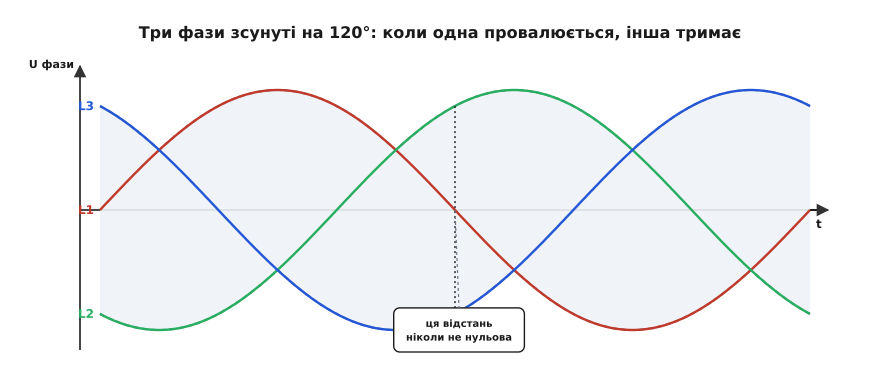
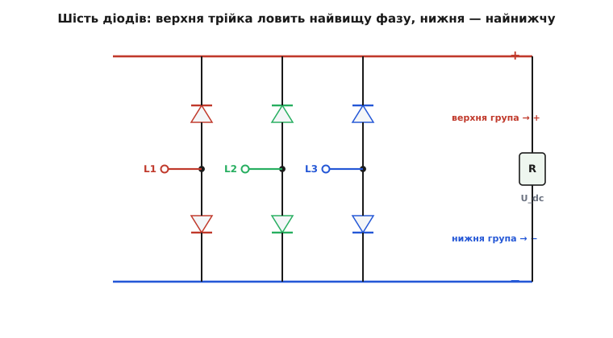
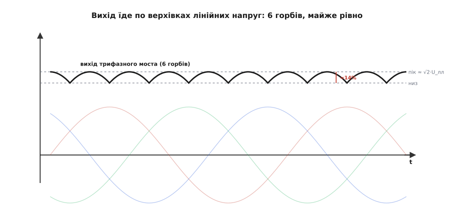
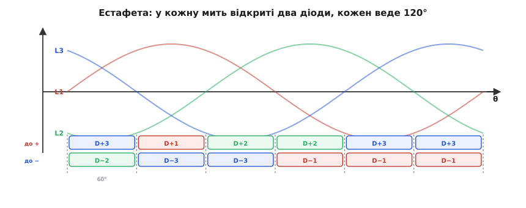

# Три-фазний міст: майже рівний постійний струм із шести діодів

Однофазний [мостовий випрямляч](topic:electronics/rectification) робить із розетки постійний струм, але виходить він горбатим: чотири діоди «перевертають» негативну півхвилю вгору, і на виході йде низка горбів, що падають **до самого нуля** й знову підіймаються до піка сто разів на секунду. Щоб згладити ці глибокі провали, доводиться вішати величезний конденсатор — тисячі мікрофарад, які на кожному піку хапають потужний кидок струму. Коли потужність невелика, з цим миряться. Але спробуйте випрямити десятки кіловат для мотора верстата чи зарядки електромобіля — і однофазний міст перетворюється на джерело нещадних пульсацій, від яких гуде залізо й гріється все підряд.

Вихід підказує сама мережа. Велику потужність до заводів і зарядних станцій ведуть не одним проводом, а [**трьома фазами**](topic:physics/three-phase-ac) — трьома синусоїдами однакової амплітуди, зсунутими одна від одної на третину періоду, тобто на 120°. І варто випрямити всі три разом, як головна вада однофазного випрямляча зникає майже безслідно.

> 🔧 **Навіщо це.** Три-фазний міст (його стандартна назва **B6**, або **шестипульсний випрямляч**) — це те, що ви знайдете на вході майже будь-якого промислового привода, зварювального апарата, серверного блока живлення й швидкої зарядки для авто. Він дає постійну напругу, таку рівну, що часто взагалі не потребує великого згладжувального конденсатора — і саме тому переганяє кіловати з набагато меншими втратами й меншим залізом, ніж однофазна схема.

### Чому три синусоїди не провалюються разом

Уся суть — в одному спостереженні. Синусоїда однієї фази справді сто разів на секунду проходить через нуль. Але три фази зсунуті на 120°, тож коли одна з них провалюється до нуля, дві інші саме **далеко від нуля** — одна вгорі, одна внизу. Три горби ніколи не сходяться в один момент; поки один падає, наступний уже підіймається йому на зміну.


*Три фази L1, L2, L3 зсунуті на третину періоду. Пунктирні лінії — верхня (найвища з трьох у цю мить) і нижня (найнижча) обвідні. Відстань між ними — миттєва напруга, доступна випрямлячу, — **ніколи не спадає до нуля**: щойно одна фаза йде вниз, її підхоплює сусідня.*

Ось де захована вся перевага. Якщо в кожну мить брати **найвищу** з трьох фаз і віднімати від неї **найнижчу**, отримана різниця гуляє не від нуля до піка, а лише в вузькій верхній смужці — між піком і трохи нижче. Постійна напруга майже готова сама собою, ще до жодного конденсатора. Лишається побудувати схему, яка автоматично, у реальному часі, вибирає найвищу фазу для плюсового виходу й найнижчу — для мінусового. І тут виявляється, що для цього досить тих самих діодів — просто шести замість чотирьох.

### Шість діодів: дві трійки, що самі вибирають фазу

Кожен діод — це однобічний клапан, що пропускає струм лише в один бік. Складімо з шести діодів дві групи по три.

**Верхня група** — три діоди, з'єднані так, що всі їхні катоди («вихідні» кінці) сходяться в одну точку, яка стане плюсовим виходом. Анод кожного під'єднаний до своєї фази. Що станеться? Струм піде через той діод, чия фаза в цю мить **найвища** — бо саме він відкритий уперед, а решта двох діодів опиняються під зворотною напругою й замикаються. Група працює як автоматичний перемикач «хто зараз найвищий»: плюсовий вихід завжди сидить на найвищій із трьох фаз.

**Нижня група** — дзеркальна: три діоди, у яких сходяться **аноди**, і ця спільна точка стає мінусовим виходом. Тут відкритим виявляється діод тієї фази, що зараз **найнижча** (найглибше в мінусі), — і мінусовий вихід чіпляється за найнижчу фазу.


*Три фази L1, L2, L3 заходять у три середні точки. Верхні три діоди спільними катодами дають **+** (виходить на найвищу фазу), нижні три спільними анодами дають **−** (сідає на найнижчу). Навантаження R живиться сталою напругою U_dc між шинами.*

Разом ці дві трійки роблять саме те, що нам треба: між плюсом і мінусом завжди стоїть різниця «найвища фаза мінус найнижча» — тобто найбільша з можливих **лінійних** напруг (напруг між двома фазами) у цю мить. А ця різниця, як показують три зсунуті синусоїди, майже не провалюється. Схема сама, без жодного керування, безперервно комутує струм на ту пару фаз, що дає найбільшу напругу.

> 🔧 **Навіщо це.** Ці шість діодів продають однією **збіркою** в спільному корпусі — з трьома виводами під фази й двома під плюс-мінус, точно як [однофазний міст](topic:electronics/bridge-rectifier), лише з трьома «хвильками» замість двох. У приводі верстата чи в зарядці саме така цеглина сидить одразу за трифазним вводом; вам лишається під'єднати три фази й зняти постійну напругу. Діоди тут беруть на повний струм навантаження й на зворотну напругу, вищу за пік лінійної, — з тим самим запасом на сплески, що й у мережевому мості.

### Шість горбів замість двох, і майже рівна лінія

Простежмо, що виходить на виході в часі. Кожна пара фаз дає свою лінійну напругу, і випрямляч у кожну мить їде по **найвищій** із них. За один період мережі найвища лінійна напруга змінюється **шість разів** — звідси й назва «шестипульсний». Замість двох горбів однофазного моста маємо шість, і кожен горб — це лише коротка верхівка синусоїди завширшки 60°, зрізана згори там, де її переймає наступна пара.


*Тонкі криві — три фази. Товста лінія — вихід моста: він щомиті бере найбільшу різницю між фазами, тож іде верхівками лінійних напруг. Шість горбів на період, і кожен опускається лише до перетину з наступним — провал крихітний, близько 14% висоти.*

Порахуймо, наскільки крихітний. Кожен горб — це шматок синусоїди від −30° до +30° від свого піку. У найгіршій точці, на стику двох горбів (±30°), напруга дорівнює піку, помноженому на cos 30° ≈ 0.866. Отже вихід гуляє між піком лінійної напруги й 86.6% від нього — усього лишень:

```
U_макс = U_пік(лінійна)
U_мін  = U_пік(лінійна) · cos 30° = 0.866 · U_пік
пульсація (розмах) = U_пік − U_мін ≈ 0.134 · U_пік
```

Тринадцять-чотирнадцять відсотків розмаху проти **ста** у однофазного моста, що провалюється до нуля. А діюче значення тієї «брижі» поверх постійної складової — узагалі близько 4.2%. Ось чому трифазний вихід називають майже готовим постійним струмом: у багатьох приводах його подають на навантаження **без** великого електроліта зовсім, обходячись малим конденсатором на швидкі викиди. Позбутися величезної «бочки» ємності — це і дешевше, і надійніше (електроліти сохнуть і є найслабшою ланкою блока живлення), і легше.

Є і другий подарунок від шести горбів: частота пульсації вшестеро вища за мережу. Для наших 50 Гц це **300 Гц**, а не 100. Що вища частота брижі, то легше її додавити крихітним фільтром — той самий [фільтр низьких частот](topic:electronics/rc-low-pass) душить 300 Гц набагато ефективніше, ніж 100. (У авіації, де мережа працює на 400 Гц саме заради легкості, шестипульсний випрямляч дає брижу аж 2400 Гц — її згладжує майже ніщо.)

**Скільки постійної напруги дає 400-вольтова трифаза.** До моста підведено стандартну промислову мережу: 230 В на фазу, тобто 400 В між фазами (діюче значення лінійної напруги). Яку постійну напругу знімемо з виходу й якою буде пульсація?

```c
// Дано: діюче значення лінійної напруги
float Ull = 400.0f;                 // В (rms, між двома фазами)

// Пік лінійної напруги (синусоїда: пік = √2 · діюче):
float Upk = 1.4142f * Ull;          // ≈ 566 В

// Середня постійна напруга шестипульсного моста.
// Усереднення верхівки cos у секторі ±30° дає множник 3√2/π ≈ 1.35:
float Udc = 1.3505f * Ull;          // ≈ 540 В

// Нижня точка виходу (стик горбів):
float Umin = Upk * 0.8660f;         // ≈ 490 В

// Розмах пульсації:
float Uripple = Upk - Umin;         // ≈ 76 В (близько 14% від Udc)
```

Тобто з «400-вольтової» трифази виходить приблизно **540 В** постійних, що гуляють між 490 і 566 В. Саме тому промислові кола постійного струму — так звана DC-шина частотних приводів — стоять на характерних ~540 В: це прямий наслідок випрямлення 400-вольтової мережі шістьма діодами. Знати це число корисно вже на етапі вибору конденсаторів і транзисторів шини: усе, що висить на цій шині, має витримувати щонайменше пікові 566 В із запасом на мережеві сплески.

### Естафета: кожен діод веде третину періоду

Придивімося, як діоди передають струм один одному. У будь-яку мить відкриті рівно **два** діоди: один із верхньої групи (найвища фаза) і один із нижньої (найнижча). Струм заходить у міст із найвищої фази, тече крізь навантаження й виходить у найнижчу. Щойно порядок фаз змінюється — скажімо, фаза, що була найвищою, починає спадати й її переганяє сусідня, — струм у верхній групі **перестрибує** на діод нової найвищої фази. Старий діод замикається, новий відкривається; навантаження цього навіть не помічає.


*Смужки під віссю: угорі — який діод верхньої групи веде струм до плюса, унизу — який діод нижньої групи до мінуса. Порядок змінюється щоразу на стику горбів (кожні 60°), і кожен окремий діод у сумі проводить **120°** за період — рівно третину.*

Цю передачу струму з діода на діод звуть **комутацією** (від лат. *commutare* — міняти, перемикати). У найпростішій картині вона миттєва. Насправді ж струм не може стрибнути з однієї обмотки в іншу вмить, бо в кожної фази є [індуктивність](topic:electronics/inductive-reactance) — і на короткий проміжок обидва діоди, старий і новий, ведуть разом, а вихідна напруга злегка «підсідає». Цей короткий провал зветься **комутаційним западанням**, і його механізм разом із виведенням точних формул середньої напруги — окрема глибша тема; тут досить знати, що естафета не зовсім безшовна, і саме звідти беруться характерні зубчики на осцилограмі трифазного випрямляча.

З того, що кожен діод проводить лише третину періоду, випливає й практичний висновок: середній струм крізь окремий діод — це лише третина струму навантаження, тож діоди в збірці працюють у легшому тепловому режимі, ніж якби кожен тягнув усе. А от **амплітуду** струму вони бачать повну — тож паспортний імпульсний струм у них має бути з запасом.

### Коли треба керувати: тиристорний міст

Досі міст був **некерований** — діоди вмикаються самі, за законом «хто найвищий», і напруга виходу жорстко прив'язана до мережі: 540 В, і крапка. Але часто хочеться цю напругу **регулювати** — плавно розганяти мотор, тримати заданий струм зарядки, задавати потужність печі. Тоді шість діодів заміняють шістьма [**тиристорами**](topic:electronics/thyristor-scr) — керованими «діодами», що починають проводити не одразу, як стають відкритими, а лише після короткого імпульсу на затвор.

Ідея тонка й гарна. Тиристор у мережі відкривається імпульсом, а гасне сам, коли струм крізь нього спадає до нуля наприкінці його інтервалу — це [природна мережева комутація](topic:electronics/thyristor-scr). Значить, ми можемо **затримати** момент запуску кожного тиристора в межах його 120°-вікна. Затримали на кут α — і тиристор веде не всю свою частку, а лише хвіст, тож середня напруга виходу падає. Кут запуску α стає ручкою гучності: α = 0 дає повні 540 В (як у діодного моста), більший α плавно зменшує напругу аж до нуля. Це та сама логіка, що й у [фазовому керуванні димера](topic:electronics/phase-control-dimmer), лише розгорнута на три фази й шість ключів. Такий **керований шестипульсний випрямляч** десятиліттями був серцем регульованих приводів постійного струму, поки його не потіснили частотники на транзисторах.

> 🔧 **Навіщо це.** Вибираючи між діодним і тиристорним трифазним мостом, питайте: чи треба **регулювати** вихід? Якщо ні — стала DC-шина приводу, зарядка з окремим наступним перетворювачем — беріть простий і дешевий діодний B6. Якщо напругу чи струм треба задавати прямо на випрямлячі (керований заряд великих батарей, гальваніка, старі DC-приводи) — тоді тиристорний, ціною складнішої схеми запуску шести затворів у правильні моменти.

### Де він живе

Три-фазний міст стоїть скрізь, де потужність велика й доступні три фази. Він — вхідний каскад **частотного перетворювача**: спочатку випрямляє мережу в ~540 В сталих, а далі [транзисторний інвертор](topic:electronics/igbt) рубає цю шину назад у трифазу потрібної частоти, щоб керувати швидкістю мотора. У **зварювальному апараті** й **гальванічній ванні** він дає великий і рівний струм. У **швидкій зарядці електромобіля** трифаза випрямляється й живить перетворювач, що доливає струм у тягову батарею. У **серверних і телекомних блоках** трифазний вхід дає ту саму рівну шину під дальші DC-DC. Навіть у літаку генератор віддає трифазу, яку бортовий міст перетворює на постійний струм для авіоніки.

Звідки він узявся? Три-фазний струм — винахід колективний і не однієї країни: наприкінці 1880-х над ним незалежно працювали серб-американець Нікола Тесла, італієць Галілео Феррарис, американець Чарлз Бредлі й інженер компанії AEG Михайло Доліво-Добровольський (з польсько-російської шляхетської родини, народжений у Гатчині під Петербургом), який 1891 року зібрав першу практичну систему трифазної передачі — знамениту лінію Лауффен–Франкфурт на 176 км. А сам шестипульсний міст — це природне розширення однофазної [схеми Поллака–Греца](topic:electronics/bridge-rectifier) на три фази; окремого «винахідника B6» історія не знає — конфігурація виринула сама, щойно трифаза стала звичною, а перші потужні трифазні випрямлячі будували ще на ртутних дугових колбах, задовго до кремнієвих діодів. *(Статус: усталено — колективне авторство трифази; конфігурація B6 — типове інженерне узагальнення без єдиного автора.)*

Підсумуймо суть у одному реченні: коли фаз три, їхні горби ніколи не провалюються разом, тож шість діодів, що безперервно чіпляються за найвищу й найнижчу фазу, віддають майже готовий постійний струм — з крихітною брижею на шестикратній частоті й без потреби в громіздкому конденсаторі. У цьому вся причина, чому велику електроенергію випрямляють саме так.
