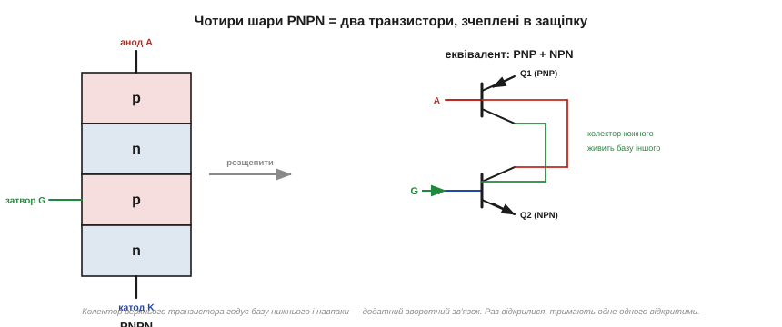
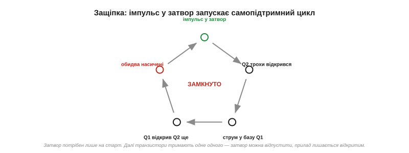
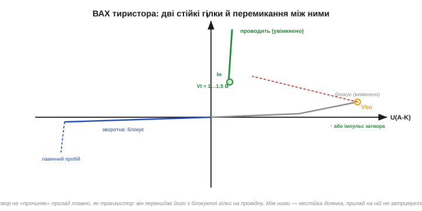

# Тиристор (SCR): защіпка, що вмикається імпульсом

Для комутації потужного навантаження в мережі [потрібен особливий ключ](book:electronics/ac-switch-need). Перший такий прилад — **тиристор**, він же **SCR** *(silicon controlled rectifier — кремнієвий керований випрямляч)*. Назва натякає на головне: це **випрямляч** (тобто діод, що проводить в один бік), але **керований** — він починає проводити не сам по собі, а лише після команди. І поводиться тиристор не як кран, який можна прочинити наполовину, а як **защіпка дверей**: або зачинено намертво, або відчинено навстіж, а перемикає між цими станами короткий поштовх.

### Чотири шари = два транзистори навхрест

Зсередини тиристор — це **чотири шари** напівпровідника поспіль: p–n–p–n. У нього три виводи: **анод** *(anode, A)* — від крайнього p-шару, **катод** *(cathode, K)* — від крайнього n-шару, і **затвор** *(gate, G)* — від внутрішнього p-шару (його ще звуть керівним електродом).

Сама собою структура p–n–p–n виглядає загадково, але є чудовий прийом, щоб її зрозуміти: подумки **розрізати її по діагоналі** на два транзистори, що перекриваються середніми шарами. Тоді верхні три шари p–n–p утворюють **PNP-транзистор**, а нижні n–p–n — **NPN-транзистор**. Причому вони з'єднані хитро: **колектор кожного живить базу іншого**.


*Рис. Ліворуч — чотири шари p–n–p–n із виводами анод, затвор, катод. Праворуч — той самий прилад як пара транзисторів: PNP і NPN, де колектор одного годує базу другого. Це перехресне з'єднання й створює защіпку.*

Це перехресне з'єднання — класичний **додатний зворотний зв'язок**. У транзисторі [струм бази керує більшим струмом колектора](book:electronics/bjt-operation). Тепер простежмо за колом: колектор NPN-транзистора живить базу PNP, отже відмикає PNP; а колектор PNP живить базу NPN, отже відмикає NPN. Кожен підтримує другого. Це **самопідсилювана** петля: варто їй розкрутитися — і вона себе тримає.

Тут варто на мить спинитися, бо це протилежність тому, як працює зворотний зв'язок у підсилювачах. [Від'ємний зворотний зв'язок](book:electronics/negative-feedback) стабілізує, утримує систему в рівновазі, гасить відхилення. **Додатний** зворотний зв'язок робить навпаки: будь-яке мале відхилення він **підсилює**, і система зривається в один із крайніх станів — або повністю відкрита, або повністю закрита, без спокою посередині. Саме тому тиристор — не підсилювач і не регулятор, а **тригер**, защіпка: проміжного стану в нього фізично нема, бо петля його туди не пускає. Та сама математика додатного зв'язку, до речі, керує й [тригером Шмітта](book:electronics/schmitt-trigger) — лише там вона робить чіткий поріг, а тут — необоротну защіпку.

### Як спрацьовує защіпка

У спокої обидва транзистори закриті: бази не отримують струму, колекторного струму нема, годувати один одного нема чим. Тиристор блокує — між анодом і катодом висока напруга, а струму майже нема (одиниці мікроампер витоку). Це стан **«вимкнено»**.

Тепер подамо короткий **імпульс струму в затвор** — тобто в базу NPN-транзистора. Він трохи відкривається, його колектор починає тягти струм, цей струм іде в базу PNP, той теж відкривається, його колектор додає струму в базу NPN — і петля **лавиноподібно** розкручується. За якісь мікросекунди обидва транзистори входять у [**насичення**](book:electronics/bjt-regions), тиристор повністю відкритий, від анода до катода тече великий струм, а спад на приладі падає до ~1…1.5 В.


*Рис. Імпульс у затвор трохи відкриває NPN; його струм відмикає PNP; той підсилює NPN — і петля замикається в насичення. Розкрутившись, цикл тримає себе сам.*

І ось ключове: **щойно защіпка замкнулася, затвор більше не потрібен**. Транзистори годують одне одного власними колекторними струмами, без жодної допомоги ззовні. Можна прибрати сигнал із затвора — тиристор лишиться відкритим. Саме тому керування **імпульсне**: не треба тримати сигнал, досить короткого поштовху. Це різко відрізняє тиристор від транзистора, якому базу чи затвор треба тримати під дією весь час, поки він відкритий.

> 🔧 **Навіщо це.** Імпульсне керування — велика практична зручність. Щоб увімкнути потужне навантаження, мікроконтролеру досить видати **коротку голку** струму в затвор (через розв'язку), а не тримати лінію активною весь час. Це економить енергію керування й спрощує схему. Але є й зворотний бік: якщо защіпка вже замкнулася, **звичайним сигналом її не розімкнути** — затвор уміє лише вмикати, не вимикати. Вимкнути тиристор можна тільки одним способом — збити струм крізь нього, і саме цей механізм визначає, де прилад зручний, а де ні.

### Утримуючий струм: як тиристор гасне

Якщо затвор не вміє вимикати, то що вимикає тиристор? Уся защіпка тримається на одному: крізь неї тече **достатній струм**, аби транзистори годували одне одного. А що, як цей струм **зменшити**? У якийсь момент колекторних струмів стане замало, щоб підтримувати бази відкритими, петля **розірветься**, і прилад закриється сам.

Той мінімальний струм, нижче якого защіпка вже не тримається, називають **утримуючим струмом** *(holding current, Iн)*. Правило просте:

```
I через тиристор > Iн   →  лишається відкритим (защіпка тримається)
I через тиристор < Iн   →  закривається сам    (защіпка зривається)
```

Утримуючий струм зазвичай невеликий — одиниці чи десятки міліампер. Щоб вимкнути тиристор, треба тимчасово **знизити струм крізь нього нижче Iн** — наприклад, перервати коло чи дочекатися, поки джерело саме перестане давати струм.

З утримуючим струмом тісно пов'язаний ще один параметр — **струм відмикання** *(latching current, Iл)*: мінімальний струм, який має встигнути потекти **в момент запуску**, щоб защіпка надійно замкнулася й трималася далі вже сама. Iл завжди трохи більший за утримуючий Iн. Практична різниця між ними така: Iл важливий **на старті** (короткий імпульс затвора має «розкрутити» струм хоча б до Iл), а Iн важливий **потім** (поки струм вище Iн, прилад тримається). Якщо навантаження дуже мале або вмикається повільно (індуктивне), струм може не встигнути дійти до Iл за час імпульсу — і тиристор «не схопиться», згасне одразу по знятті імпульсу. Це типова причина, чому потужний ключ іноді відмовляється вмикати мале навантаження від короткої голки керування.


*Рис. Вольт-амперна характеристика. На прямій напрузі тиристор спершу блокує (струму майже нема), а імпульс затвора (або перевищення напруги Vbo) перекидає його на круту провідну гілку зі спадом ~1…1.5 В. Між гілками — нестійка ділянка, де прилад не затримується. Зворотну напругу тиристор блокує до лавинного пробою.*

ВАХ добре показує «двостанність» приладу: є гілка «блокує» і гілка «проводить», а між ними прилад не може спокійно стояти — він стрибає з одної на другу. Це й робить тиристор **ключем**, а не регулятором: проміжного, напіввідкритого стану в нього практично нема.

Зверніть увагу на ще одну точку на ВАХ — **напругу перемикання** *(breakover voltage, Vbo)*. Це та пряма напруга анод–катод, за якої тиристор **вмикається сам**, навіть без імпульсу затвора. Фізично це означає, що петля додатного зв'язку розкручується не від затвора, а від того, що сама прикладена напруга стала такою великою, що внутрішні переходи почали пропускати достатній струм. У звичайному режимі це **небажано** — тиристор має вмикатися лише за командою, а не від випадкового сплеску напруги в мережі. Тому Vbo беруть із запасом вище піка мережі. Але в одному класі приладів самовмикання від напруги — це **корисна функція**: саме так навмисно вмикається на заданому порозі [**DIAC**](book:electronics/triac) — двобічний прилад, у якого керування **тільки** через Vbo, без окремого затвора.

### Чому саме в мережі тиристор такий зручний

Тут сходяться дві речі: тиристор гасне, коли струм падає нижче Iн, — а в мережі [струм синусоїдний](book:physics/ac-power-grid) і **сам щопівперіоду проходить через нуль**. Це означає, що наприкінці кожної півхвилі струм природно сходить до нуля, отже неминуче падає нижче утримуючого, — і тиристор **закривається сам**, без жодних зусиль із нашого боку. Це явище звуть **природною (мережевою) комутацією** *(natural / line commutation)*.


*Рис. Струм крізь тиристор протягом півхвилі. Імпульс затвора на початку відмикає прилад; струм наростає й спадає за синусоїдою; щойно він опускається нижче утримуючого Iн — наприкінці півхвилі — защіпка зривається, і тиристор закривається сам аж до наступного імпульсу.*

Ось чому тиристор так природно ліг у мережеву техніку. Не треба вигадувати схему вимикання — мережа гасить прилад **сама**, сто разів на секунду. Наша робота зводиться до одного: вирішувати, **коли в межах кожної півхвилі** дати імпульс на запуск. Дамо рано — тиристор проведе майже всю півхвилю; дамо пізно — лише її хвостик. Саме на цьому побудоване [фазове керування потужністю](book:electronics/phase-control-dimmer).

А якби тиристор стояв не в мережі, а в колі **постійного** струму? Тоді все було б значно гірше. Постійний струм не проходить через нуль самостійно, тож раз увімкнений тиристор так і лишався б відкритим **назавжди** — звичайним зняттям сигналу його не вимкнути. Щоб погасити тиристор на постійному струмі, доводиться застосовувати спеціальні хитрощі — **примусову комутацію** *(forced commutation)*: наприклад, заздалегідь заряджений конденсатор на мить підкидає зустрічну напругу, що збиває струм нижче утримуючого. Це громіздко й незручно — і саме тому тиристор розквітнув передусім у техніці **змінного** струму, де мережа гасить його задарма. На постійному струмі його давно витіснили транзистори, яким вимикання дається легко.


*Рис. Найпростіше коло: тиристор послідовно з навантаженням у мережі. Поки нема імпульсу — він закритий, навантаження знеструмлене. Імпульс у затвор вмикає тиристор, і той проводить до кінця додатної півхвилі, після чого гасне сам. Від'ємні півхвилі тиристор блокує.*

**Приклад (мережеве реле на тиристорі).** Тиристор тримає в мережі 230 В навантаження 2 А. Затвор потребує імпульсу 15 мА протягом 10 мкс, утримуючий струм Iн = 30 мА. Оцінимо потужність керування проти безперервного утримання.

```
Енергія одного імпульсу запуску (грубо):
Vg ≈ 1 В, Ig = 15 мА, t = 10 мкс
Wзапуск = Vg · Ig · t = 1 × 0.015 × 10·10⁻⁶ = 1.5·10⁻⁷ Дж = 0.15 мкДж

За секунду (50 Гц, тобто 50 запусків — лише додатні півхвилі):
Pкер = Wзапуск × 50 = 0.15 мкДж × 50 ≈ 7.5 мкВт

Для порівняння — якби довелось ТРИМАТИ струм керування весь час,
як у транзисторі (умовно 15 мА · 1 В): Pтрим ≈ 15 мВт.
```

Імпульсне керування дешевше за безперервне у **тисячі разів** (мікровати проти міліватів). А вимикається тиристор задарма — мережа гасить його сама в кінці кожної півхвилі, щойно струм 2 А спадає нижче Iн = 30 мА.

### Однобокість тиристора

Тиристор — це «защіпка»: вмикається імпульсом, тримається сам, гасне, коли струм падає нижче утримуючого, а в мережі це стається природно щопівперіоду. Але він однобокий — проводить лише одну полярність, тобто половину синусоїди марнується. Цю ваду усуває [**симістор**](book:electronics/triac), що вміє проводити **обидві** півхвилі одним затвором.
