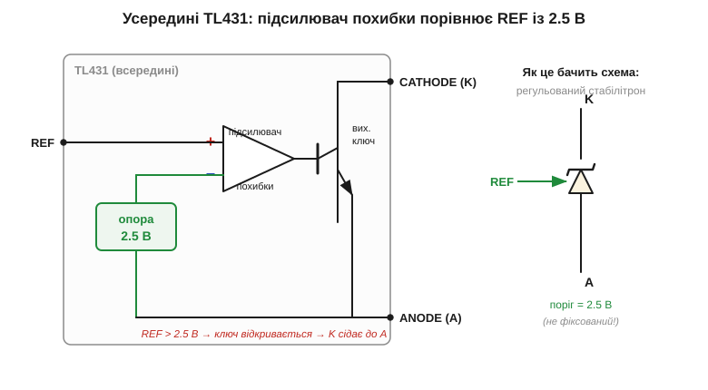
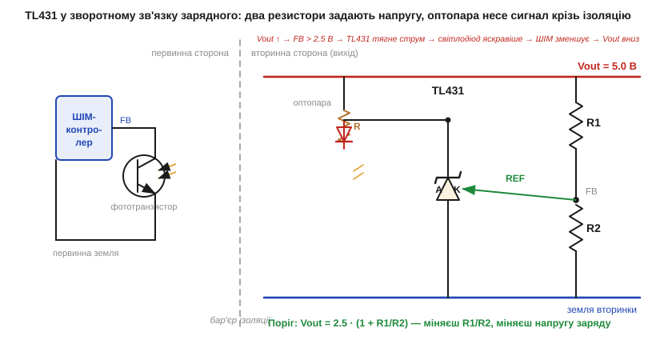

# 🔌 TL431-клас: «програмований стабілітрон», що сидить майже в кожному зарядному

Звичайний [стабілітрон](book:electronics/zener-schottky) (*Zener*) «пливе» з температурою, бо тримається на лавинному пробої; стабільне [джерело опорної напруги](book:electronics/voltage-reference), збудоване на фізиці переходу, — ні. TL431 — це крихітна тринога мікросхема, яка з такої точної опори зроблена і яку розробники звуть «програмованим стабілітроном». Розріж майже будь-яку зарядку чи блок живлення — цей чип неодмінно знайдеться на платі, тримаючи вихідну напругу. Розберемо, що в ньому всередині, як трьома виводами задати потрібну напругу і чому без двох дрібниць він не працює.

### Що це за клас пристроїв

Звичайний [стабілітрон](book:electronics/zener-schottky) пробивається завжди при одній, наперед закладеній напрузі: 3.3 В, 5.1 В, 12 В — яку купив, така й є. **TL431** — це той самий «обмежувач напруги», тільки **поріг задаєш ти сам** двома резисторами, у широких межах від 2.5 В аж до ~36 В. Звідси й прізвисько — «програмований» (точніше — регульований) стабілітрон, *adjustable precision shunt regulator*. До того ж поріг тримається куди стабільніше за температурою, ніж у дешевого стабілітрона, бо всередині — не лавинний пробій, а точна опора.

Канонічні представники класу: **TL431** від Texas Instruments і його клони **LM431**, **KA431**, **AS431**. Є й молодший родич **TLV431** з нижчим порогом ~1.24 В — для схем на 1.8…3.3 В, де 2.5 В завелика.

### Що всередині

Усередині — три блоки, усі знайомі з Модуля 2:


*Рис. Будова TL431: стабільна опора 2.5 В, підсилювач похибки (фактично [компаратор](book:electronics/comparator-2)) і вихідний транзистор між катодом і анодом. Підсилювач порівнює напругу на ніжці REF із внутрішніми 2.5 В: щойно REF перевищує поріг — ключ відкривається і «садить» катод до анода. Для схеми це виглядає як стабілітрон, поріг якого ти задаєш сам.*

Логіка проста: поки на виводі **REF** менше за 2.5 В — вихідний ключ закритий, струм майже не тече. Тільки-то REF дотягується до 2.5 В — підсилювач відмикає транзистор, і той пропускає струм з катода в анод, не даючи напрузі рости далі. Це і є «пробій», але керований опорою, а не випадковою фізикою [лавини](book:electronics/zener-schottky).

### Розпіновка й підключення

Усі три блоки виведені назовні лише трьома ніжками — і саме за них схема й чіпляється. Виводів **три**: **REF** (опорний вхід), **ANODE (A)** — «мінус», **CATHODE (K)** — «плюс», той бік, що тягне струм. У звичних корпусах SOT-23 та TO-92 розкладка ніжок різна, тож її завжди звіряють із даташитом — переплутати A і K легко, а наслідок фатальний.

Найтиповіше включення: катод через резистор підтягнутий до напруги, яку стабілізуємо, анод — на землю, а REF знімає частину вихідної напруги з **дільника** з двох резисторів. Дільник і задає поріг:

```
V_KA = 2.5 · (1 + R1/R2)
```

де R1 — верхнє плече (від виходу до REF), R2 — нижнє (від REF до анода). Хочеш на виході 5 В — береш R1 = R2 (бо 2.5·(1+1) = 5 В); хочеш 3.3 В — добираєш відношення під 3.3/2.5. По суті це той самий принцип, що й у [зворотному зв'язку](book:electronics/negative-feedback): схема підкручує вихід, доки REF не зрівняється з опорою.

### Де він у зарядному: «перший байт»

Коду тут не пишуть — TL431 чисто аналоговий, його «перший байт» — це правильно поставлені два резистори. Найчастіше він закриває петлю зворотного зв'язку в ізольованому імпульсному блоці живлення, тобто майже в кожній зарядці:


*Рис. TL431 у зворотному зв'язку зарядного: чип сидить на вторинному боці (там, де вихід), стежить за напругою через дільник і керує світлодіодом [оптопари](book:electronics/optocoupler-2). Світло переносить сигнал через бар'єр ізоляції до ШІМ-контролера на первинному боці. Вихід піднявся — TL431 яскравіше світить — контролер пригальмовує — напруга вертається. Так дві мікросхеми тримають точний вихід, не маючи спільної землі.*

Завдяки цьому дуету зарядка видає рівно потрібну напругу без прямого дроту через небезпечний бар'єр мережі. Поза блоками живлення TL431 так само служить опорою на 2.5 В, точним компаратором порогу чи сторожем над- і недонапруги.

### Типові граблі

Підключити TL431 нескладно, та саме на цих трьох виводах схема найчастіше й спотикається. Ось чотири пастки, які зводять нанівець правильну на папері схему.

**Мінімальний струм катода.** Щоб опора працювала, через катод має текти хоча б ~1 мА (*minimum cathode current*, I_K(min)). Поставив завеликий підтягувальний резистор — струму бракує, і напруга «попливе». Це найчастіша причина, чому схема з TL431 поводиться дивно.

**Стійкість петлі.** TL431 — це підсилювач у [зворотному зв'язку](book:electronics/negative-feedback), а отже, його петля може «розгойдатися» й задзвеніти. Він вибагливий до ємності на катоді: певні діапазони навантажувального конденсатора заганяють його в автоколивання. Лікують це підбором конденсатора за даташитом (там малюють зону стійкості).

**Поріг не нижче 2.5 В.** Менше за свою опору TL431 не видасть — фізично. Треба 1.8 В? Бери TLV431 з порогом 1.24 В.

**Сорти точності.** Літера в назві — це клас опори: TL431 — ±2 %, TL431**A** — ±1 %, TL431**B** — ±0.5 %. Для точного джерела чи прецизійного зарядного беруть «B».

> 🔧 **Навіщо це.** TL431 — це регульований стабілітрон у трьох ногах: поріг задаєш дільником за формулою V_KA = 2.5·(1 + R1/R2), від 2.5 до ~36 В. Він закриває зворотний зв'язок майже в кожному імпульсному блоці живлення (часто в парі з оптопарою через ізоляцію), а ще служить опорою на 2.5 В і точним компаратором. Не забудь дати катоду мінімальний струм (~1 мА), перевір стійкість із вихідним конденсатором за даташитом і не цілься на поріг нижче 2.5 В — для меншого є TLV431 (1.24 В). Літера B/A — точніша опора, коли вона потрібна.
