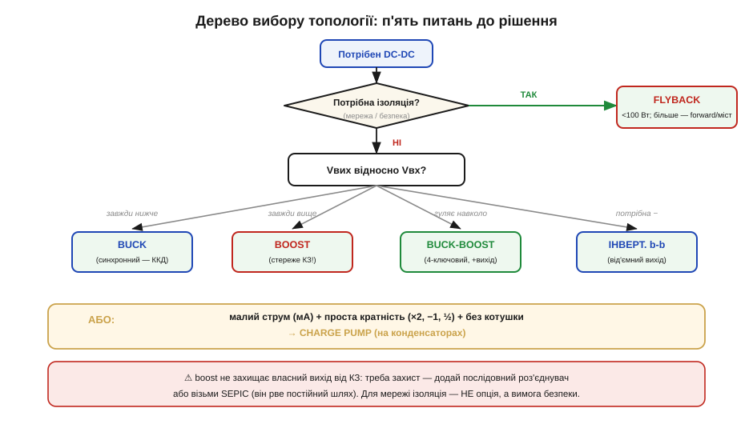
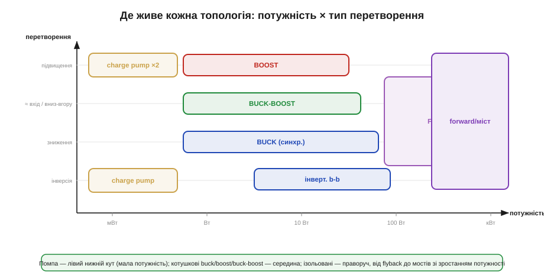
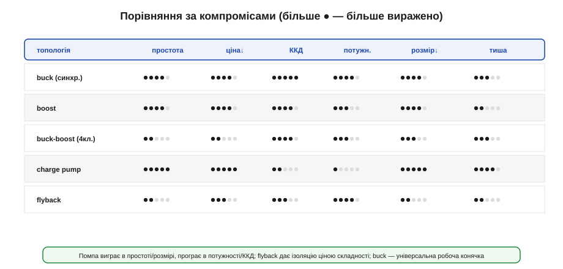

# Карта вибору топології

Способів перетворювати постійну напругу є кілька: [buck](book:electronics/buck), [boost](book:electronics/boost), інвертувальний і 4-ключовий [buck-boost](book:electronics/buck-boost), [зарядна помпа](book:electronics/charge-pump-conv) й [flyback](book:electronics/flyback-isolated). Але в реальній роботі питання не «як працює buck», а інше: **дано конкретне ТЗ — яку топологію брати?** І відповідь має приходити за секунди, упевнено, а не методом спроб. Ця тема — саме про вибір: дерево питань, карта, таблиця випадків і перелік пасток. Це окремий **навик** — швидко перетворювати вимоги на рішення.

Зразу про те, що **не** рахуватимемо. Точне проєктування вузла — номінали котушки й конденсаторів, контролер, компенсація — окрема велика робота. Тут ми вчимося лише **обрати клас** перетворювача; це перше й найважливіше рішення, бо помилка тут робить усі подальші розрахунки марними.

### П'ять питань, що ведуть до рішення

Вибір зводиться до короткого ланцюжка питань, які варто ставити **саме в цьому порядку** — від найжорсткіших обмежень до тонших.


*Рис. Дерево рішення. Спершу — ізоляція (для мережі це не вибір, а вимога безпеки). Тоді — напрямок: вихід завжди нижче, завжди вище чи гуляє навколо входу. Окрема гілка — зарядна помпа для малих струмів без котушки. Унизу — нагадування про захист: boost власний вихід не стереже.*

- **Питання 1 — ізоляція.** Чи потрібно електрично розв'язати вхід і вихід? Для всього, що живиться **від мережі** й до чого торкається людина, відповідь — так, і це **не обговорюється**: беремо flyback (до ~100 Вт) чи його старших родичів (forward, міст) для більшої потужності. Якщо ізоляція не потрібна — йдемо далі.
- **Питання 2 — напрямок.** Як вихід стоїть відносно входу? **Завжди нижче** — buck. **Завжди вище** — boost. **Гуляє навколо** (вхід то вищий, то нижчий за ціль — класична банка LiPo) — buck-boost; для додатного виходу 4-ключовий, для від'ємного — інвертувальний.
- **Питання 3 — малий струм без котушки.** Окрема гілка: якщо струм малий (міліампери), кратність проста (×2, −1, ½), а котушку ставити не хочеться — зарядна помпа.
- **Питання 4 — захист виходу.** Якщо обрали boost, згадайте: він **прозорий для КЗ**. Потрібен захист виходу чи можливість його знеструмити — додайте послідовний роз'єднувач або візьміть SEPIC.
- **Питання 5 — полярність і дрібниці.** Потрібен від'ємний вихід — інвертувальна гілка; потрібна гранична простота при дрібному струмі — помпа.

Порядок питань не випадковий: спершу йдуть **жорсткі** обмеження, які взагалі викреслюють цілі сім'ї. Ізоляція стоїть першою, бо це питання **безпеки**, а не оптимізації: якщо пристрій від мережі, жодні переваги buck по ККД не зроблять його придатним — він просто небезпечний. Лише прибравши жорсткі обмеження, переходять до тонших — напрямку, струму, ціни.

### Приклад вибору: від ТЗ до рішення

Покажемо метод у дії на двох реальних ТЗ — саме так його застосовують щодня.

**Приклад 1 (дрон на 4S).** Дрон живиться від чотирибаночного LiPo (12.0–16.8 В), і треба дві шини: **5 В / 3 А** для логіки та **12 В / 0.5 А** для підвісу камери.

```
шина 5 В:
  1) ізоляція?  ні (одна батарея, спільна земля)
  2) напрямок?  вхід 12–16.8 В завжди ВИЩЕ 5 В → завжди зниження → BUCK
  3) струм 3 А — помітний → синхронний buck (ККД, менше тепла)
  → рішення: синхронний buck, forced-PWM (поряд радіо — чисті завади)

шина 12 В:
  1) ізоляція?  ні
  2) напрямок?  вхід гуляє НАВКОЛО 12 В (повна 16.8 — вище, сіла 12.0 — рівно/нижче)
                → перетинає ціль → BUCK-BOOST (4-ключовий, додатний вихід)
  → рішення: 4-ключовий buck-boost (або buck, якщо змиритися з провалом 12 В на сівшій батареї)
```

Зверніть увагу на тонкість другої шини: «12 В з 4S» виглядає як просте зниження, та коли батарея сідає до 12 В, вхід падає **до самої цілі** — і чистий buck уже не втримає 12 В. Дерево це ловить на питанні 2: вхід **гуляє навколо** виходу, отже потрібен buck-boost. Помилка тут коштувала б мерехтіння підвісу під кінець польоту.

**Приклад 2 (давач від монетної батарейки).** Бездротовий давач живиться від CR2032 (≈3.0 В, із розрядом сповзає до 2.6 В), а радіо хоче 3.3 В короткими сплесками по кілька міліампер. Тонкість тут у тому, що монетна батарея має [великий внутрішній опір](book:electronics/battery-aging), тож на коротких сплесках струму її напруга помітно просідає.

```
  1) ізоляція?  ні
  2) напрямок?  вхід 2.6–3.0 В нижчий за 3.3 В → підвищення → BOOST
  3) струм малий, але СПЛЕСКАМИ — монетна батарея має великий внутрішній опір
  → рішення: boost із добрим вхідним конденсатором, що тримає сплески радіо,
     щоб батарея не просідала; помпа тут не годиться — радіо просить мА пачками
```

Два ТЗ — і за п'ять питань кожне дало рішення без жодного перебору варіантів. Саме так дерево й економить час: воно не лишає простору вгадувати.

### Карта: де живе кожна топологія

Ті самі рішення зручно покласти на дві осі — **потужність** і **тип перетворення**.


*Рис. Кожна топологія має свою область. Зарядна помпа сидить у лівому нижньому куті (мала потужність, фіксовані кратності). Котушкові buck, boost і buck-boost займають широку середину. Ізольовані тягнуться праворуч: flyback на малій-середній потужності, а forward і мости — на великій. Підбираючи топологію, ви фактично шукаєте, у чию область потрапляє ваша точка (потужність; відношення Vвих/Vвх).*

Карта корисна тим, що відразу показує **межі**: помпу не потягнеш у праву частину (велика потужність), boost сам по собі не зайде в зону ізоляції, а flyback не вартий заходу в ліву нижню область, де вистачить копійчаної помпи. Спробуйте знайти на ній наші типові шини: «5 В / 3 А з бортової мережі» сідає в зону buck посередині; «−5 В кілька мА» падає в лівий нижній кут помпи; «5 В із розетки» стрибає далеко праворуч, у смугу ізоляції до flyback. Що далі точка праворуч (більша потужність) і що ближче до смуги ізоляції — то дорожчим і складнішим стає рішення. Тому добрий інженер ще на етапі ТЗ намагається **не заганяти** себе в правий верхній кут без потреби: чим скромніша вимога, тим простіший і дешевший перетворювач.

### Таблиця типових embedded-випадків

Найшвидший шлях — упізнати своє ТЗ серед типових. Ось карта найчастіших випадків:

| Випадок | Vвх | Vвих | Брати | Чому |
|---|---|---|---|---|
| Логіка з шини 5 В | 5 В | 3.3 В | синхронний **buck** | малий перепад, помітний струм, ККД |
| 1 банка LiPo → логіка | 3.0–4.2 В | 3.3 В | 4-ключ. **buck-boost** | вхід перетинає ціль |
| 1 банка → USB | 3.0–4.2 В | 5 В | **boost** | завжди підвищення |
| Від'ємна шина для ОП (мА) | 3.3/5 В | −5 В | **charge pump** (інвертор) | малий струм, без котушки |
| Бортова мережа → сильний 5 В | 9–16 В | 5 В | синхронний **buck** | потужність, ККД, тепло |
| Мережа → 5 В (зарядка) | 230 В ~ | 5 В | **flyback** | ізоляція + велике зниження |
| Світлодіодна гірлянда | 5–12 В | десятки В | **boost** (LED-драйвер) | підвищення, керування струмом |
| Широкий вхід, +вихід, захист КЗ | 5–15 В | 12 В | **SEPIC** | вгору/вниз + захист |
| Напруга програмування flash | 3.3 В | ~12 В (мА) | **charge pump** (Dickson) | малий струм, без котушки |

Більшість реальних задач — це варіації цих дев'яти рядків. Якщо ваше ТЗ схоже на котрийсь — починайте з тієї рекомендації, а тоді уточнюйте дрібниці.

### Порівняння за компромісами

Коли кілька топологій підходять за функцією, вибір вирішує **зв'язне обмеження** — те, чого у вас найменше: місце, гроші, ват-години чи тиша.


*Рис. Грубе порівняння: помпа виграє в простоті й розмірі, але програє в потужності та ККД; flyback дає ізоляцію ціною складності; buck — універсальна робоча конячка з добрим балансом. Дивіться на свою найвужчу вісь: якщо тисне розмір — це одне рішення, якщо ват-години — інше.*

Користуватися матрицею просто: знайдіть свою **найвужчу** вісь і рухайтеся вздовж неї. Робите носимий пристрій — тиснуть розмір і ват-години, отже важать стовпці «розмір» і «ККД», і дрібний синхронний buck чи помпа виходять наперед. Робите дешеву масову іграшку — головне ціна й простота, тут асинхронний buck або boost поза конкуренцією. Промислова шина від мережі — байдуже до розміру, головне надійна розв'язка, отже flyback попри всю складність. Матриця не каже «оце найкраще взагалі» — вона каже «оце найкраще під **ваше** обмеження». Тому перший крок завжди той самий: чесно назвати, чого у вас найменше — місця, грошей, заряду чи тиші, — і вже тоді читати таблицю.

> 🧮 **Каскади з'їдають ККД — у вставці.** Коли перетворювачі стоять ланцюгом (buck → LDO, кілька шин одна з одної), їхні ККД **множаться**, а не додаються: 0.92 × 0.66 = 61 %, і один добрий перетворювач легко б'є два посередні. Як рахувати ланцюг і де зникають відсотки — у математичній вставці [🧮 ККД ланцюга перетворень](math-efficiency-chain.md).

### Сім'ю обрано — лишаються вторинні осі

Вибір класу — лише перше рішення. Усередині кожної сім'ї лишаються **вторинні** осі, кожна зі своїм компромісом:


*Рис. Після вибору класу: випрямляч — діод (дешево) чи MOSFET (синхронний, ККД); легке навантаження — forced-PWM (чисті завади) чи авто-PFM (автономність); реалізація — дискрет (гнучко, дешевше) чи інтегрований модуль (просто, швидко); частота — нижча (менші втрати) чи вища (менші котушка й конденсатори).*

> 🔧 **Навіщо це.** Ці вторинні рішення часто важать не менше за вибір класу. Той самий buck можна зробити дешевим асинхронним для іграшки або синхронним із PFM для пристрою, що місяцями живе на батарейці. Тож, обравши «buck», не зупиняйтеся — пройдіть і ці осі під своє ТЗ.

### Упізнати топологію на чужій платі

Зворотний навик не менш корисний: подивитися на готову плату й **прочитати**, що за перетворювач там стоїть.


*Рис. Прикмети: котушка з одним діодом Шотткі — асинхронний buck/boost; котушка з двома MOSFET (чи інтегрованим power-stage) — синхронний; дві котушки з конденсатором між ними — SEPIC; трансформатор з оптопарою — ізольований flyback (мережа, безпека); лише два-три однакові конденсатори без котушки — зарядна помпа.*

> 🔧 **Навіщо це.** Цей навик економить години при ремонті, рев'ю чужої плати чи виборі готового модуля. Велика котушка біля контролера зі щільними конденсаторами — головна силова шина; трансформатор з оптопарою — небезпечна первинна сторона, до якої не лізуть під напругою. Прочитавши топологію, ви вже знаєте і її сильні місця, і слабкі. Приклад: бачите на платі дросель, поруч мікросхему й діод Шотткі, а на виході давач «гуляє» — це асинхронний buck, і діод Шотткі підказує, де шукати втрати й тепло; помітили дві котушки з конденсатором між ними — це SEPIC, отже хтось навмисно хотів і вгору-вниз, і захист виходу. Топологія — як підпис інженера: вона розповідає, чого він боявся і що оптимізував.

### Типові пастки

Наостанок — помилки вибору, що повторюються найчастіше. Варто побачити їхній **спільний корінь**: усі вони народжуються зі ставлення до перетворювача як до чорної скриньки, що «просто робить напругу». Щойно ви пам'ятаєте, **як** він її робить — boost має наскрізний діод до виходу, помпа возить заряд пакетами, flyback рве струм у витоку, котушка boost несе більший вхідний струм, — кожна пастка стає очевидною ще до того, як ви припаяли першу деталь. Тому ці шість помилок не дрібні недогляди, а наслідок пропущеного розуміння механізму — і саме розуміння механізму, **як** воно працює, відмежовує впевнений вибір від угадування.


*Рис. Шість найчастіших пасток: покладатися на boost у захисті виходу (він прозорий для КЗ); тягнути помпою реальний струм (це міліампери); живити пристрій від мережі без ізоляції (смертельно); рахувати котушку boost під вихідний струм замість більшого вхідного; ставити flyback без снабера (ключ згорить); гнати помпу на проміжну напругу (палить, як лінійний).*

### Підсумок

Вибір топології — це не вгадування, а короткий ланцюжок питань: спершу **ізоляція** (для мережі — обов'язкова, тоді flyback), тоді **напрямок** (вниз — buck, вгору — boost, гуляє — buck-boost), тоді особливі випадки (малий струм без котушки — помпа; потрібен захист виходу — роз'єднувач чи SEPIC). Карта «потужність × перетворення» показує область кожної топології, таблиця типових випадків дає готову відправну точку, а компроміси (ціна, розмір, ККД, тиша) і вторинні осі (синхронність, PFM, інтеграція, частота) уточнюють рішення. І не менш корисно — упізнавати топологію на платі за її прикметами та обходити шість типових пасток. У підсумку маєш не лише картину того, **як** працює кожен перетворювач, а й чіткий метод, **який** брати під конкретну задачу. Наступний крок після вибору класу — довести обраний вузол до робочого стану: спроєктувати його під ТЗ і виміряти, що він справді тримає напругу, ККД і пульсації.
