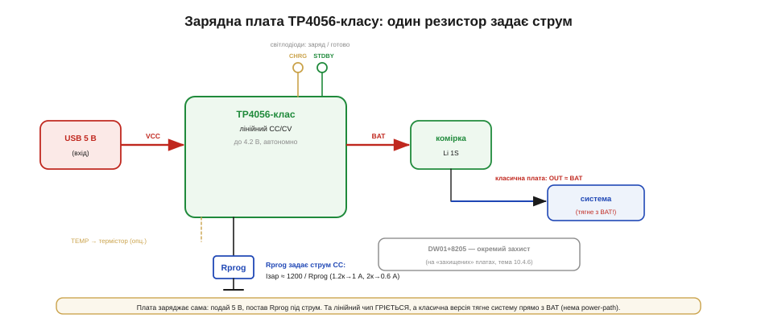

# 🔌 Зарядник TP4056-класу: обв'язка, струм, термістор

Найпоширеніший спосіб [зарядити одну літієву комірку](book:electronics/li-ion-charger) — крихітна червона платка з мікро-USB; розберемо її зблизька.

### Клас пристрою

**TP4056-клас** — це однокристальний **лінійний** зарядник (linear charger) однієї літієвої комірки, що сам веде весь [алгоритм CC/CV](book:electronics/li-ion-charger) до 4.2 В. Його обожнюють за простоту: подав 5 В, поставив один резистор — і комірка заряджається, а два світлодіоди показують стан. Саме на ньому зроблені ті всюдисущі дешеві зарядні модулі.

Чому «лінійний» — і чому це слово відразу попереджає про тепло? Усередині чипа між входом VCC і виводом BAT стоїть прохідний транзистор (pass transistor), що працює як **керований резистор**. Зарядник не перемикає його «увімк/вимк» з високою частотою, як імпульсний (switching) перетворювач, а плавно прочиняє так, щоб у комірку йшов рівно заданий струм. Уся різниця напруг між входом і коміркою падає на цьому транзисторі — і, оскільки через нього тече той самий зарядний струм, на ньому виділяється потужність P = (V_вх − V_комірки)·I. Ось чому лінійний зарядник на великому струмі **відчутно гріється**: він не «економить» зайву напругу, а перетворює її на тепло.

### Блок-схема плати


*Рис. Вхід 5 В (VCC) → чип TP4056 → комірка (BAT). Резистор Rprog на виводі PROG задає струм фази CC. Світлодіоди CHRG/STDBY показують «заряджається/готово», вивід TEMP — для термістора комірки. На «класичній» платі вихід до системи з'єднано прямо з BAT (нема power-path), а захист (DW01+8205) — окремий вузол на «захищених» версіях.*

### Типова розпіновка

```
VCC      вхід 5 В (USB)
BAT      комірка (заряд і вихід)
PROG     резистор Rprog на землю → задає струм CC
TEMP     термістор комірки (на дешевих платах часто «вимкнено»)
CHRG     світлодіод «заряджається» (open-drain, низький при заряді)
STDBY    світлодіод «готово» (open-drain, низький по завершенні)
CE       дозвіл (chip enable)
GND      нуль
```

### Підключення

VCC — на USB-вхід (5 В). BAT — на комірку. Струм фази CC задається **одним резистором** Rprog від PROG до землі за простим правилом:

```
Iзар ≈ 1200 / Rprog       (Iзар у амперах, Rprog в омах)
   1.2 кОм → ~1 А     2 кОм → ~0.6 А     4 кОм → ~0.3 А
```

Звідки взялася магічна «1200» і чому це не випадкове число? Усередині чип тримає на виводі PROG **стабільну опорну напругу 1.000 В** (V_PROG) — це його внутрішній еталон, який не залежить ні від входу, ні від комірки. Резистор Rprog ввімкнено між цим виводом і землею, тож через нього за законом Ома тече точний опорний струм:

```
I_prog = V_PROG / Rprog = 1.000 В / Rprog
```

Цей крихітний струм чип **не подає в комірку** — він використовує його як **зразок** і дзеркалить (струмове дзеркало, current mirror) у комірку, помноживши рівно в 1000 разів. Звідси повна формула:

```
Iзар = 1000 · I_prog = 1000 · (1.000 / Rprog) = 1000 / Rprog
```

«Чому ж тоді 1200, а не 1000?» Бо коефіцієнт дзеркала в TP4056 закладено ≈1200, а не 1000 — конструктор чипа просто обрав таке передавальне число. Інтуїція ж залишається тією самою: **PROG — це не «резистор, що обмежує струм»**, а вивід, де чип вимірює зразковий струм через відоме опорне 1 В і збільшує його у фіксовану кількість разів. Тому Rprog ставлять у кіломи (через нього тече ~міліампер), а в комірку йде ампер. Подвоїте Rprog — удвічі менший зразковий струм — удвічі менший заряд.

> 🔧 **Навіщо це.** Коли ви проєктуєте носимий пристрій на ESP32 з однією LiPo, цей резистор — ваш єдиний орган керування струмом. Хочете щадний заряд маленької комірки (0.5C) — рахуєте Rprog під потрібні міліампери і впаюєте; жодного коду, жодного регістра. Розуміння «1 В на PROG × дзеркало» рятує, коли треба швидко прикинути, який резистор уже стоїть на дешевій платі: зміряли Rprog — поділили 1200 на нього — знаєте струм, не вірячи написам на корпусі.

TEMP заводять на термістор, приклеєний до комірки, щоб [заряд блокувався поза температурним вікном](book:electronics/li-ion-charger); на дешевих платах цей вивід часто «знешкоджують» дільником, тож температурного захисту там немає. CHRG і STDBY — це **open-drain** виходи, що притягують світлодіоди до землі: один світиться під час заряду, другий — по завершенні.

### Дві фази заряду: чому CC, а потім CV

Той самий Rprog задає струм лише в **першій** фазі — і варто зрозуміти, чому фаз дві й що змушує чип перемкнутися. Корінь — у хімії літієвої комірки. Поки вона напівпорожня, її власна напруга помітно нижча за цільові 4.2 В, тож «місця» для струму вдосталь: іони літію легко входять у графітовий анод, і комірка спокійно ковтає весь заданий струм. На цьому етапі чип тримає **сталий струм** (constant current, CC) — рівно той Iзар, що ви задали резистором, — а напруга на комірці сама повільно повзе вгору, від ~3.0 до 4.2 В.

Що станеться, якщо й далі гнати повний струм після 4.2 В? Напруга на комірці перескочила б цей поріг — а це вже **перезаряд**, який літієву хімію руйнує: на аноді осідає металевий літій (плейтинг), електроліт окислюється, комірка деградує і в межі здувається. Тому щойно напруга сягає 4.2 В, чип перемикає логіку: він **фіксує напругу** на 4.2 В (constant voltage, CV) і тепер уже відпускає струм, дозволяючи йому **падати самому**. Падає він тому, що комірка майже повна — її внутрішня «протинапруга» наблизилась до 4.2 В, різниця, що жене струм, майже зникла, тож приймати заряд вона може лише все повільніше. Це фізика дифузії: останні іони мусять заповнити найглибші, найповільніші місця у структурі електрода.

```
CC  (комірка напівпорожня):  струм = const (заданий Rprog), напруга росте до 4.2 В
CV  (досягли 4.2 В):         напруга = const 4.2 В,          струм сам спадає
СТОП (струм впав до Iзар/10): заряд завершено, горить STDBY
```

Коли в CV-фазі струм спадає приблизно до **1/10 заданого** (для 1-амперної настройки — до ~100 мА), чип вважає комірку повною і **зупиняє заряд**. Цей поріг не випадковий: тягнути комірку до «абсолютного» нуля струму означало б тримати її під 4.2 В годинами заради останніх відсотків ємності — а саме тривале перебування під максимальною напругою найсильніше старить літій. Тому виробники свідомо зупиняються на 1/10: майже повна комірка ціною мінімального зносу.

> 🔧 **Навіщо це.** Саме тому не можна живити навантаження прямо з BAT під час заряду (див. «граблі» нижче): постійне споживання струму додається до зарядного, чип ніколи не побачить чистого спаду до Iзар/10 — і термінація або не настане, або спрацює фальшиво. Якщо в embedded-пристрої треба й заряджатися, і працювати водночас — це вже не задача для TP4056, а привід шукати чип [із power-path](book:electronics/powerbank-source).

### «Перший байт»

Його немає — чип **аналоговий і автономний**. Уся «конфігурація» — це номінал Rprog, обраний раз під потрібний струм. Подаєте 5 В — і заряд іде сам, без жодного коду й мікроконтролера. Хіба що вивід CE можна притягнути, щоб увімкнути чи вимкнути заряд логічним сигналом.

### Скільки тепла насправді: worked-приклад

Формула P = (V_вх − V_комірки)·I показує, чому крихітна платка стає гарячою. Розгляньмо найгірший для тепла момент: комірка ще розряджена (≈3.0 В), а ви задали повний 1 А.

**Умова.** Вхід USB V_вх = 5.0 В, струм CC Iзар = 1.0 А (Rprog ≈ 1.2 кОм), напруга розрядженої комірки V_комірки ≈ 3.0 В. Скільки тепла розсіює чип і до чого це призводить?

```
P_тепло = (V_вх − V_комірки) · Iзар
        = (5.0 − 3.0) · 1.0
        = 2.0 Вт

Для порівняння, в комірку йде корисної потужності:
P_корисна = V_комірки · Iзар = 3.0 · 1.0 = 3.0 Вт
ККД у цей момент = 3.0 / (3.0 + 2.0) = 60 %
```

Два вати на чипі завбільшки з нігтик у корпусі SOP-8 — це багато. Тепловий опір такого корпусу до повітря — десятки градусів на ват (для SOP-8 на маленькій платі орієнтовно 40–60 °C/Вт), тож кристал нагрівся б на 2 Вт · ~50 °C/Вт ≈ **+100 °C над оточенням**. Реально до такого не доходить, бо в чип вбудовано **теплову регуляцію** (thermal regulation): коли кристал сягає ~120 °C, чип **сам зменшує струм**, щоб утримати температуру. Тому ваша «1-амперна» платка в теплому закритому корпусі видасть не 1 А, а стільки, скільки дозволить тепловідвід — інколи помітно менше.

```
Висновок: лінійний заряд великим струмом «з'їдає» зайву напругу теплом.
Хочете повний струм — або робіть тепловідвід (мідний полігон під чипом),
або зменшіть Rprog-струм, або підніміть напругу комірки (вона теплішає
лише на старті, далі V_комірки росте і P_тепло падає).
```

> 🔧 **Навіщо це.** У реальному корпусі носимого пристрою TP4056 затиснутий між платою й батареєю, обдуву немає. Якщо ви наосліп поставите Rprog на 1 А, теплова регуляція зріже струм, заряд затягнеться, а сусідні компоненти (і сама комірка) грітимуться. Часто розумніше навмисно задати 0.5 А: тепла вдвічі-втричі менше, комірка живе довше, а кілька зайвих хвилин заряду нікому не заважають.

### Типові граблі

- **Тепло.** Лінійний чип на 1 А з 5 В у комірку 3 В розсіює ~2 Вт; вбудована теплова регуляція тоді **сама зрізає струм**, тож «1-амперна» платка в гарячому корпусі дає менше. Не ставте максимальний Rprog-струм на крихітну плату без тепловідводу.
- **Нема power-path.** Класична плата з'єднує вихід до системи прямо з **BAT**, тож пристрій живиться з батареї **під час заряду** — споживаний струм додається до зарядного, чип не бачить чистого спаду до Iзар/10 і термінація збивається; до того ж нема «миттєвого старту» з мертвою коміркою, як у справжнього [power-path](book:electronics/powerbank-source).
- **TEMP знешкоджено.** Якщо потрібен температурний захист — заведіть термістор самі; не покладайтесь на дешеву плату, де TEMP часто прибито дільником.
- **Зарядник ≠ захист.** TP4056 — це лише **зарядник**; «захищені» плати додають [окремий вузол захисту](book:electronics/bms) DW01+8205. Дві різні функції на одній платі — не плутати.
- **Вхід — не від батареї.** Чипу потрібні ~5 В на вході; живити його з тієї ж комірки, яку він заряджає, не можна — без різниці (V_вх − V_комірки) прохідному транзистору нічим керувати, заряду не буде.

### Варіації класу

Базовий TP4056 буває **з вбудованим захистом** (ті самі плати, де поряд стоять DW01+8205) і без нього. Є версії з **USB-C** входом замість мікро-USB. А коли потрібен **power-path** (живити систему й заряджати водночас, працювати з мертвою батареєю), більший струм чи імпульсний (холодний) заряд — беруть складніші [зарядні чипи](book:electronics/li-ion-charger), бо лінійний TP4056 цих можливостей не має.
