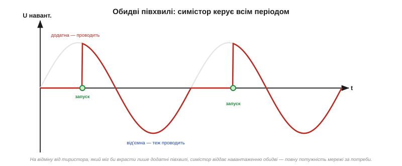
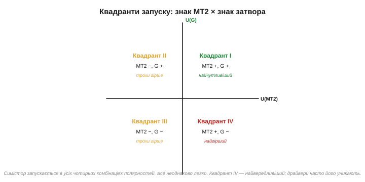

# Симістор (TRIAC): ключ для обох півхвиль

[Тиристор](book:electronics/thyristor-scr) має одну прикру ваду: він **однобокий**. Проводить лише одну полярність — додатну півхвилю, — а від'ємну блокує. Для випрямляча це чудово, але якщо ми хочемо віддати навантаженню **повну** потужність мережі, половина енергії (від'ємні півхвилі) пропадає даремно. Можна, звісно, поставити **два тиристори назустріч** один одному — і тоді один оброблятиме додатні півхвилі, другий від'ємні. Саме з цієї ідеї й виріс **симістор**.

### Два тиристори в одному кристалі

**Симістор** *(triac, від TRIode for Alternating Current — тріод для змінного струму)* — це, по суті, **два тиристори, з'єднані антипаралельно** (назустріч), але виконані в **одному** кристалі й керовані **одним** затвором. Завдяки цьому він проводить струм в **обидва** боки: коли «верхній» вивід додатний — працює одна половина структури, коли від'ємний — друга.

Виводи в симістора звуться інакше, ніж у тиристора, і це невипадково. Замість «анода» й «катода» — **MT1** і **MT2** *(main terminal 1 і 2 — головні виводи)*. Слово «анод/катод» означало б, що в приладу є «правильний» напрямок струму; а в симістора напрямок будь-який, тож обидва силові виводи **рівноправні**. Третій вивід — той самий **затвор (G)**.

Слово «антипаралельно» варто розшифрувати, бо воно описує сам спосіб з'єднання. Якщо два діоди (чи тиристори) увімкнути **паралельно**, але «головами» в різні боки — анод одного до катода іншого, — то для струму однієї полярності працює перший, для протилежної — другий. Разом така пара пропускає струм **в обидва боки**, тоді як кожен поодинці — лише в один. Це загальний прийом: антипаралельна пара діодів — звична основа двонапрямних обмежувачів і [захисту входів](book:electronics/flyback-protection). Симістор — це та сама ідея, доведена до кінця: не два окремі прилади, а **один** кристал, де обидва «напрямки» виконані разом і керуються спільним затвором. Тому симістор компактніший і дешевший за пару тиристорів та ще й потребує лише одного кола керування замість двох.


*Рис. Ліворуч — два тиристори назустріч: разом вони охоплюють обидві полярності. Праворуч — символ симістора: два зустрічні трикутники й один затвор. Виводи MT1 і MT2 рівноправні — «правильного» напрямку струму немає.*

Результат на навантаженні очевидний: симістор може віддавати **повну синусоїду**, обидві півхвилі. Якщо вмикати його одразу на початку кожної півхвилі — навантаження отримає всю потужність мережі; якщо із затримкою — частину (це знову буде [фазове керування](book:electronics/phase-control-dimmer)). Головне — на відміну від одиночного тиристора, жодна півхвиля не пропадає **обов'язково**.

Працює симістор за тією самою [логікою защіпки, що й тиристор](book:electronics/thyristor-scr): імпульс у затвор вмикає його, далі він тримається сам, а гасне, коли струм падає нижче утримуючого — тобто в кінці кожної півхвилі, у переході струму через нуль. Різниця лише в тому, що тепер це повторюється **двічі** за період: на додатній півхвилі працює одна половина структури, гасне в нулі; на від'ємній вмикається друга половина, гасне в наступному нулі. Тож мікроконтролеру треба давати імпульс запуску **на кожну** півхвилю окремо — а не один раз на період.


*Рис. Напруга на навантаженні з симістором: відкривається й на додатній, і на від'ємній півхвилі (тут — із невеликою затримкою на кожній). На відміну від тиристора, який віддав би лише додатні півхвилі, симістор охоплює весь період.*

> 🔧 **Навіщо це.** Симістор — робоча конячка побутової силової електроніки саме тому, що він **двобічний і керується одним затвором**. Один дешевий прилад замість двох тиристорів зі складною обв'язкою — ось чому всередині димерів, регуляторів швидкості вентиляторів, паяльних станцій і твердотільних реле стоїть саме симістор. Він робить «повне» керування потужністю простим і компактним.

### Квадранти запуску: чотири комбінації полярностей

Тут з'являється тонкість, якої не було в тиристора. У тиристора все однозначно: анод додатний, імпульс у затвор додатний — запуск. А в симістора **обидва** силові виводи бувають то плюсом, то мінусом, та й затвор можна штовхати струмом як у плюс, так і в мінус. Виходить **чотири** комбінації полярностей — їх називають **квадрантами запуску** *(triggering quadrants)*.

Квадрант визначають за двома знаками: полярність MT2 (відносно MT1) і полярність затвора (відносно MT1). Позначають їх римськими цифрами I, II, III, IV.


*Рис. Квадранти за знаками MT2 і затвора. Симістор запускається в усіх чотирьох, але неоднаково легко: квадрант I (обидва «+») — найчутливіший, а квадрант IV («+» на MT2, «−» на затворі) — найвередливіший і потребує найбільшого струму запуску.*

Чому це важливо на практиці? Бо симістор запускається в усіх чотирьох квадрантах, **але по-різному легко**. У квадранті I потрібен найменший струм затвора, у квадранті IV — найбільший, і там запуск найненадійніший. Тому розробники драйверів часто **уникають** найгіршого квадранта, влаштовуючи керування так, щоб працювати лише в найкращих. Це одна з причин, чому деякі симістори (особливо чутливі, «logic-level» та «snubberless») мають у даташиті позначку про **робочі квадранти** — і чому буває, що схема працює надійно в трьох квадрантах із чотирьох.

Звідки взагалі береться нерівноправність квадрантів, якщо симістор «симетричний»? Бо симетричний він **електрично** (проводить обидві полярності), але **геометрично** його кристал несиметричний: затвор фізично розташований ближче до однієї половини структури, ніж до іншої. Тому в одних комбінаціях полярностей імпульс затвора діє «напряму» й запускає легко (мала чутливість потрібна), а в інших — мусить запускати «в обхід», через додатковий внутрішній перехід, і потребує більшого струму. Квадрант IV — саме той незручний випадок «в обхід». Практичний наслідок: якщо схема має працювати від драйвера, який дає лише один знак затворного струму, її свідомо проєктують так, щоб обидві півхвилі потрапляли в зручні квадранти (наприклад, I і III), а не в I і IV.

Симістори різняться й за **загальною чутливістю затвора**. «Звичайні» симістори потребують десятків міліампер запуску — їх ганяють потужним драйвером. **Чутливі** *(sensitive-gate)* запускаються від одиниць міліампер — такий можна штовхнути майже напряму з логіки, але він і вразливіший до хибних запусків від наводок та [dv/dt](book:electronics/snubbers-dvdt). Це звичний компроміс: що чутливіший вхід, то легше керувати, але то більший ризик зреагувати на завади. Вибір симістора за чутливістю — це вибір між простотою керування й завадостійкістю.

### DIAC у колі керування: поріг для чіткого запуску

Залишається питання: як саме сформувати імпульс у затвор симістора, та ще й однаковий для обох полярностей? Найпростіше — узяти прилад, який сам по собі **мовчить, доки напруга на ньому не перевищить поріг**, а тоді різко «прострілює». Такий прилад є — це **DIAC** *(diode for alternating current — діод для змінного струму)*.

DIAC — це, грубо кажучи, **симістор без затвора**: двобічний прилад, який блокує напругу обох полярностей, доки вона не сягне напруги перемикання (зазвичай ~30…35 В). Як тільки поріг перевищено — DIAC лавиноподібно відмикається й пропускає різкий сплеск струму. Оскільки він симетричний, поводиться так само в обидва боки.


*Рис. Класична схема керування: фаза заряджає конденсатор C через резистор (потенціометр) R. Поки напруга на C мала — DIAC закритий, у затвор нічого не йде. Коли напруга дійшла до порогу Vbo — DIAC «прострілює» й розряджає C різким імпульсом у затвор симістора. R задає момент запуску, DIAC робить фронт різким і однаковим для обох півхвиль.*

Класична схема димера складається саме з цих трьох елементів: **R, C і DIAC**. На початку кожної півхвилі конденсатор C заряджається від мережі через резистор R; швидкість заряду залежить від R (це регулятор — потенціометр). Коли напруга на C дійде до порогу DIAC, той відмикається й розряджає C коротким імпульсом прямо в затвор симістора — той вмикається. Чим більший опір R, тим **повільніше** заряджається C, тим **пізніше** в межах півхвилі настане запуск — і тим менша потужність дістанеться навантаженню.

Цей крихітний RC-вузол — гарний приклад того, як [експонента заряду конденсатора](book:electronics/rc-time-constant) виконує цілком конкретну роботу: вона **перетворює** положення ручки потенціометра на затримку в часі. Поки C доповзає до порогу DIAC, минає час, пропорційний сталій τ = R·C, — і саме цей час стає кутом відсікання. Один резистор, один конденсатор і один пороговий прилад дають повноцінний фазовий регулятор без жодної мікросхеми й живлення — тому така схема десятиліттями стоїть у найдешевших димерах і регуляторах обертів.

А коли керувати симістором хоче не людина з ручкою, а **мікроконтролер**, RC-DIAC замінюють на **оптодрайвер симістора** *(optotriac)* — оптопару, в якої на виході вже стоїть маленький світлочутливий симістор. Логічний сигнал засвічує світлодіод драйвера, той відмикає вихідний симісторик, а він уже дає імпульс у затвор силового симістора — і все це **через [гальванічну розв'язку](book:electronics/ac-switch-need)**. Так мікроконтролер отримує контроль над квадрантами запуску й моментом вмикання, лишаючись відрізаним від мережі.

> 🔧 **Навіщо це.** DIAC розв'язує одразу дві проблеми. По-перше, він дає **чіткий, різкий фронт** запуску — без нього симістор відмикався б мляво, з нагрівом і нестабільністю. По-друге, оскільки DIAC **симетричний**, він автоматично формує однакові імпульси для додатної й від'ємної півхвиль, тож обидві півхвилі відсікаються однаково й навантаження не отримує постійної складової. Простіше кажучи, RC задає «скільки», а DIAC гарантує «чисто й однаково в обидва боки».

**Приклад (оцінка моменту запуску RC-DIAC).** У димері R — потенціометр, C = 100 нФ, поріг DIAC Vbo = 32 В. Прикинемо, на якому куті півхвилі спрацює запуск при R = 100 кОм.

```
Стала часу: τ = R · C = 100·10³ × 100·10⁻⁹ = 0.01 с = 10 мс

Тривалість півперіоду мережі 50 Гц:
Tпів = 1 / (2 · 50) = 0.01 с = 10 мс

Конденсатор заряджається до Vbo, коли вже минула помітна частина
півперіоду (τ співмірне з Tпів) → запуск ближче до середини
півхвилі → приблизно половина потужності.

Зменшимо R (відкрутимо потенціометр) → τ менша →
C заряджається швидше → запуск раніше → більша потужність.
```

Підбираючи R у межах від кількох кОм до сотень кОм, ми зсуваємо момент запуску майже від початку півхвилі до її кінця — і так плавно регулюємо потужність від майже повної до майже нуля. Точну залежність потужності від кута дає [фазове керування потужністю](book:electronics/phase-control-dimmer).
