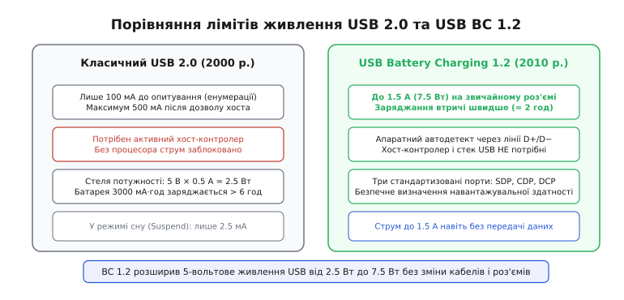
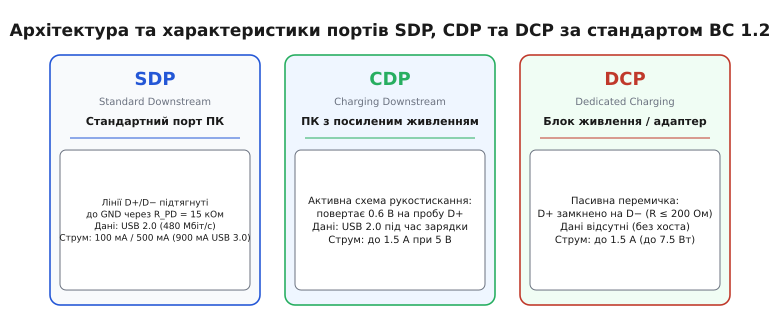
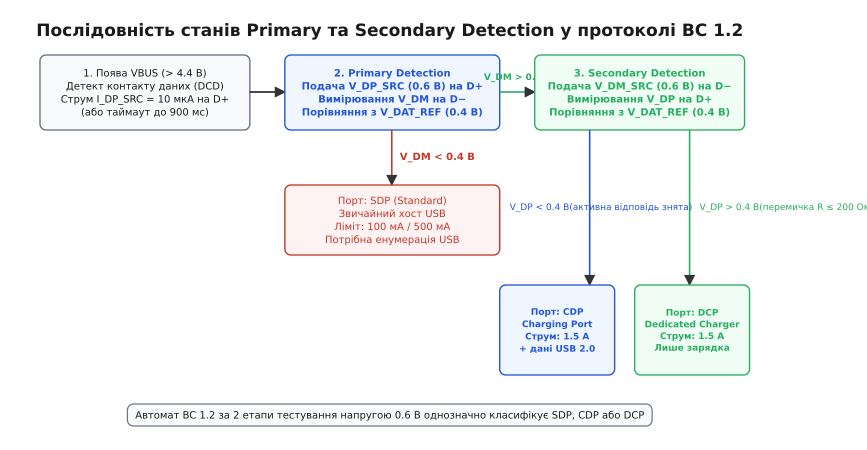
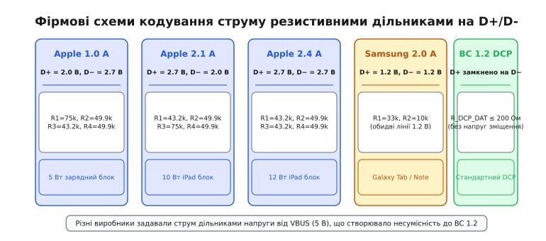
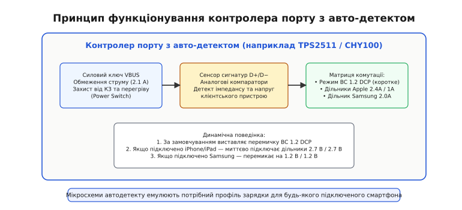

# USB Battery Charging (BC 1.2): зарядні порти та детект типу

<preknowlist>
- [Диференціальне передавання сигналів](book:electronics/differential-signaling) — симетричне передавання цифрових даних парою протифазних провідників D+ та D−.
- [Резистивний дільник напруги](book:electronics/voltage-divider) — формування стабільних проміжних потенціалів від шини живлення 5 В.
- [Аналоговий компаратор](book:electronics/comparator) — фіксація переходу вимірюваної напруги через фіксований опорний поріг.
- [Керування трактом живлення (Power Path)](book:electronics/power-path) — динамічне обмеження вхідного струму та розподіл енергії між системним навантаженням і акумулятором.
</preknowlist>

Коли розряджений смартфон з акумулятором ємністю 3000 мА·год підключають до мережевого зарядного адаптера через стандартний чотирижильний кабель USB, внутрішній контролер живлення телефона опиняється перед фундаментальною невизначеністю: скільки саме струму дозволено відібрати від шини живлення VBUS? Напруга на силових контактах становить звичні 5 В, проте кабель з однаковим успіхом може бути встромлений як у потужний настінний зарядний блок на 2 А, так і в слабкий роз'єм старого офісного ноутбука або пасивний розгалужувач, де спроба відібрати понад 500 мА призведе до аварійного відключення порту, просадки напруги та перезавантаження комп'ютера.

Базова специфікація USB 2.0 (прийнята 2000 року) створювалася виключно як інтерфейс передавання даних для комп'ютерної периферії (мишей, клавіатур, сканерів), де питання живлення було строго підпорядковане цифровому обміну. За правилами USB 2.0 будь-який щойно підключений неконфігурований пристрій має право споживати не більше 100 мА (одна одиниця навантаження, *Unit Load*). Щоб споживати максимальні 500 мА (або 900 мА для стандарту USB 3.0), пристрій зобов'язаний виконати повноцінну цифрову енумерацію (*enumeration*): зв'язатися з центральним процесором комп'ютера через диференціальну пару ліній даних D+ та D−, передати дескриптори конфігурації із запитом струму та отримати від операційної системи явний дозвіл на перехід у робочий стан. Якщо ж комп'ютер переходить у сплячий режим (стан призупинення шини, *Suspend Mode*), споживання клієнта має бути негайно знижене до мізерних 2.5 мА.

Для автономного зарядного блока («вилки в розетку») цифрова енумерація неможлива фізично: це звичайний аналоговий імпульсний перетворювач 230 В → 5 В, у якому немає мікроконтролера, немає тактового генератора і немає програмного стека USB. Якщо портативний пристрій суворо дотримується вимог USB 2.0, він не може отримати цифровий дозвіл і змушений обмежуватися струмом 100 мА. За такого струму заряджання сучасної батареї триватиме понад 30 годин. Якщо ж пристрій навмання почне відбирати 1.5 А, він ризикує перевантажити слабкий комп'ютерний порт або дешевий адаптер, викликавши спрацьовування захисних полімерних запобіжників (Polyfuse) чи критичний перегрів.

Щоб подолати цей глухий кут без здорожчання зарядних пристроїв цифровими процесорами, консорціум USB-IF у грудні 2010 року затвердив єдиний глобальний стандарт — **USB Battery Charging Specification Revision 1.2 (BC 1.2)**. Його суть полягає у створенні швидкого аналогового рукостискання: пристрій за десятки мілісекунд зондує сигнальні лінії D+ та D− малими випробувальними напругами й однозначно визначає навантажувальну здатність джерела аж до 1.5 А (7.5 Вт) за станом електричного зв'язку між цими провідниками.


*Зліва — консервативні ліміти USB 2.0 (100/500 мА), що вимагають обов'язкової цифрової енумерації процесором хоста. Справа — специфікація BC 1.2, яка за допомогою аналогового зондування D+/D− дозволяє безпечно відбирати до 1.5 А (7.5 Вт) від мережевих адаптерів без участі цифрового стека протоколів.*

Детальна передісторія виникнення специфікації, протистояння виробників мобільних телефонів та інженерів ПК розкриті в окремому нарисі про [історію появи стандарту BC 1.2](book:electronics/power-electronics/usb-bc/hist-usb-charging.md).

### Класифікація зарядних портів BC 1.2: SDP, CDP, DCP та адаптери ACA

Стандарт BC 1.2 строго розділяє всі можливі джерела живлення на три фундаментальні класи залежно від їхньої електричної схеми та здатності передавати дані.


*Архітектура трьох типів портів: SDP підтягує лінії D+/D− до землі резисторами 15 кОм; CDP містить активну аналогову схему відповіді на пробу 0.6 В і дозволяє одночасну зарядку 1.5 А та дані USB 2.0; DCP має пасивну перемичку між D+ та D− (опір ≤ 200 Ом).*

**1. Стандартний низхідний порт (Standard Downstream Port, SDP)**
Це класичний USB-порт персонального комп'ютера або пасивного концентратора. За стандартом USB 2.0 на боці хоста лінії D+ та D− підтягнуті до загального проводу (GND) через індивідуальні резистори стягування `R_PD = 15 кОм`. Електричного зв'язку між лініями D+ та D− всередині порту немає. Порт SDP підтримує повноцінний цифровий обмін даними USB 2.0 (1.5 Мбіт/с Low-Speed, 12 Мбіт/с Full-Speed або 480 Мбіт/с High-Speed). Струмовий ліміт становить 100 мА до проходження енумерації та 500 мА (900 мА для портів USB 3.0) після отримання дозволу хоста. У стані Suspend порт вимагає зниження споживання до 2.5 мА.

**2. Зарядний низхідний порт (Charging Downstream Port, CDP)**
Це спеціалізований високопотужний порт комп'ютера, робочої станції або активного USB-хаба. Порт CDP поєднує високошвидкісну передачу даних USB 2.0 (480 Мбіт/с) із можливістю відбору зарядного струму до 1.5 А одночасно. Схемотехнічно CDP містить внутрішній аналоговий компаратор та джерело напруги 0.6 В. Коли клієнтський пристрій виконує первинне зондування лінії D+, внутрішня схема CDP фіксує тестовий сигнал і активною подачею напруги 0.6 В на лінію D− підтверджує свій статус зарядного порту. Після завершення рукостискання активні генератори відключаються, лінії повертаються до стандартних диференціальних термінаторів 45 Ом, і запускається стандартний цифровий обмін даними при безперервному відборі 1.5 А від лінії VBUS.

**3. Виділений зарядний порт (Dedicated Charging Port, DCP)**
Це класичний мережевий блок живлення, автомобільний адаптер у прикурювач або портативний акумулятор (повербанк). Порт DCP взагалі не підключений до контролерів даних: контакти D+ та D− всередині роз'єму фізично замкнені між собою наскрізь через низькоомний опір `R_DCP_DAT <= 200 Ом` (типово пряма мідна доріжка з опором менше 5 Ом). Порт забезпечує струм до 1.5 А за номінальної напруги 5 В. Якщо навантаження намагається відібрати струм, що перевищує можливості адаптера, специфікація BC 1.2 дозволяє вихідній напрузі DCP знижуватися аж до 2.0 В (режим стабілізації струму, *Constant Current Collapse*).

**4. Адаптери живлення аксесуарів (Accessory Charger Adapter, ACA)**
Для портативних пристроїв з підтримкою специфікації USB On-The-Go (OTG), які використовують 5-контактні роз'єми Micro-AB, стандарт BC 1.2 вводить спеціальний клас док-станцій — ACA. Завдяки вимірюванню опору на п'ятому контакті роз'єму (`ID-pin`) мобільний пристрій визначає, чи може він одночасно працювати як USB-хост для зовнішньої периферії (флешки, миші) і заряджатися від зовнішнього джерела живлення струмом до 1.5 А.

Повна зведена таблиця порогів, таймінгів та опорів контакту ID наведена у довідковій вставці: [електричні параметри та таблиці станів BC 1.2](book:electronics/power-electronics/usb-bc/api-bc12-protocol.md).

### Трьохетапний протокол узгодження з боку пристрою

Процедура розпізнавання зарядного порту виконується апаратним кінцевим автоматом (FSM) у складі мікросхеми фізичного рівня USB або контролера зарядки мобільного пристрою відразу після фізичного з'єднання кабелю. Вся послідовність триває від 50 до 150 мс і складається з трьох послідовних кроків.


*Алгоритм детекції BC 1.2: після фіксації VBUS та перевірки контакту ліній даних (DCD) пристрій виконує Primary Detection (подача 0.6 В на D+). Якщо на D− менше 0.4 В — це порт SDP; якщо більше 0.4 В — запускається Secondary Detection (подача 0.6 В на D−). Якщо на D+ напруга перевищує 0.4 В — це пасивний DCP; якщо менше 0.4 В — це активний CDP.*

#### Крок 0: Фіксація напруги шини (VBUS Detect)
При підключенні штекера внутрішній компаратор пристрою відстежує наростання напруги на силовому контакті VBUS. Коли потенціал перевищує поріг дійсного сеансу `V_BVALID` (діапазон 4.40–4.75 В), контролер живлення фіксує наявність джерела. На цьому етапі вхідний ключ зарядного каскаду залишається заблокованим, а сумарний струм споживання пристрою від лінії VBUS строго обмежується значенням не більше 2.5 мА для запобігання просадці невідомого джерела.

#### Крок 1: Детектування фізичного контакту ліній даних (Data Contact Detect, DCD)
У роз'ємах USB-A, Mini-USB та Micro-USB контактні пластини шини живлення VBUS та землі GND мають більшу довжину, ніж сигнальні контакти D+ та D−. Під час плавного або нерівного вставляння кабелю живлення з'являється на кілька мілісекунд раніше, ніж замикаються лінії передавання даних. Якщо запустити зондування негайно, пристрій побачить розімкнені сигнальні лінії й помилково сприйме потужний зарядний блок як звичайний комп'ютерний порт SDP, назавжди заблокувавши струм на позначці 100 мА.

Щоб уникнути цього збою, пристрій вмикає стабілізоване джерело струму `I_DP_SRC = 10 мкА` (допустимий діапазон 7–13 мкА) на лінію D+ та підключає внутрішній стягувальний опір на лінію D−. Поки сигнальні контакти роз'єму не торкнулися гнізда, лінія D+ залишається розімкненою, і струм 10 мкА швидко заряджає її паразитну ємність до напруги логічної одиниці (> 2.0 В). 

Щойно контакти D+/D− надійно замикаються в роз'ємі:
- Якщо порт є комп'ютерним (SDP або CDP), хостовий резистор `R_PD = 15 кОм` стягує лінію D+ до землі:
  
```
V_DP = I_DP_SRC · R_PD = 10·10⁻⁶ А · 15·10³ Ом = 0.15 В
```
  
- Якщо порт є зарядним блоком (DCP), струм 10 мкА через перемичку `R_DCP_DAT` стікає на внутрішній резистор лінії D− мобільного пристрою, і напруга також падає нижче 0.3 В.

Компаратор фіксує падіння напруги на D+ нижче логічного порогу `V_DAT_LGC` (0.8 В). Після витримки антибрязкотового інтервалу `T_DCD_DBNC = 10 мс` автомат станів підтверджує надійний контакт ліній даних і переходить до наступного кроку.

Якщо підключено нестандартний кабель або старий адаптер без підтримки DCD, спрацьовує апаратний таймер безпеки `T_DCD_TIMEOUT` (інтервал 300–900 мс). Після вичерпання таймауту 900 мс автомат примусово переходить до тестування, гарантуючи, що пристрій не зависне у стані очікування.

#### Крок 2: Первинне виявлення (Primary Detection) — «Чи це зарядний порт?»
Мета цього етапу — розділити звичайний комп'ютерний порт SDP (де струм обмежено 100/500 мА) та високопотужні зарядні порти (CDP або DCP, здатні надати 1.5 А).

Пристрій підключає до лінії D+ внутрішнє джерело тестової напруги `V_DP_SRC = 0.60 В` (допустимий діапазон 0.50–0.70 В). Одночасно на лінію D− підключається калібрований струмовий стік `I_DM_SINK = 50–100 мкА` (або резистор витоку `R_DAT_LKG`). Внутрішній аналоговий компаратор вимірює напругу `V_DM` на лінії D− відносно опорного порогу `V_DAT_REF = 0.40 В` (діапазон 0.25–0.40 В).

```
   [Пристрій]                                [Порт джерела]
     D+ ─── (V_DP_SRC = 0.6 В) ─────────────── D+
                                                 │
                                           [Зв'язок D+/D− ?]
                                                 │
     D− ─── (Компаратор V_DAT_REF = 0.4 В) ─── D−
        ─── (I_DM_SINK = 100 мкА)
```

1. **Якщо підключено порт SDP**: лінії D+ та D− електрично ізольовані одна від одної. Лінія D− залишається стягнутою до землі через хостовий резистор 15 кОм та внутрішній стік `I_DM_SINK`. Напруга `V_DM` становить менше 0.05 В. Оскільки `V_DM < V_DAT_REF` (0.05 В < 0.40 В), компаратор фіксує логічний нуль.
   *Висновок*: підключено стандартний порт SDP. Пристрій негайно відключає джерело напруги 0.6 В, встановлює вхідний ліміт споживання 100 мА та ініціює стандартну цифрову енумерацію USB 2.0.
2. **Якщо підключено порт CDP або DCP**: 
   - У випадку DCP напруга 0.6 В з лінії D+ через фізичну перемичку потрапляє на лінію D−.
   - У випадку CDP активний хостовий компаратор фіксує 0.6 В на D+ і у відповідь подає напругу 0.6 В на D−.
   В обох випадках напруга `V_DM` піднімається до 0.55–0.60 В, що перевищує поріг `V_DAT_REF = 0.40 В`. Компаратор спрацьовує.
   *Висновок*: виявлено зарядний порт (Charging Port). Пристрій переходить до вторинного виявлення, щоб з'ясувати, чи дозволено передавання даних.

#### Крок 3: Вторинне виявлення (Secondary Detection) — «DCP чи CDP?»
Мета цього етапу — відрізнити автономний зарядний блок DCP (де ліній даних немає) від активного порту комп'ютера CDP (де паралельно із зарядкою 1.5 А необхідно запустити обмін даними USB 2.0).

Пристрій знімає напругу 0.6 В з лінії D+ і тепер подає випробувальну напругу `V_DM_SRC = 0.60 В` на лінію D−. Одночасно на лінію D+ вмикається струмовий стік `I_DP_SINK`, а вхідний компаратор вимірює напругу `V_DP` на лінії D+ відносно опорного порогу `V_DAT_REF = 0.40 В`.

```
   [Пристрій]                                [Порт джерела]
     D− ─── (V_DM_SRC = 0.6 В) ─────────────── D−
                                                 │
                                           [Зв'язок D−/D+ ?]
                                                 │
     D+ ─── (Компаратор V_DAT_REF = 0.4 В) ─── D+
        ─── (I_DP_SINK = 100 мкА)
```

1. **Якщо підключено виділений зарядний блок DCP**: фізична перемичка `R_DCP_DAT` всередині адаптера є пасивною та симетричною. Тестова напруга 0.6 В безперешкодно проходить з лінії D− назад на лінію D+. Напруга `V_DP` становить близько 0.58 В. Оскільки `V_DP >= V_DAT_REF` (0.58 В ≥ 0.40 В), компаратор фіксує наявність наскрізної перемички.
   *Висновок*: перед нами виділений зарядний блок **DCP**. Пристрій повністю вимикає всі випробувальні аналогові джерела, налаштовує вхідний силовий ключ на відбір повного струму **1.5 А** і не витрачає ресурси процесора на запуск USB-стека.
2. **Якщо підключено зарядний порт комп'ютера CDP**: за алгоритмом BC 1.2 порт CDP під час вторинного зондування зобов'язаний вимкнути своє активне джерело відповіді на D−. Оскільки всередині CDP лінії D+ та D− не замкнені між собою, лінія D+ залишається підтягнутою до землі через хостовий резистор 15 кОм. Напруга `V_DP` падає практично до 0 В. Оскільки `V_DP < V_DAT_REF` (0 В < 0.40 В), компаратор фіксує розімкнений стан.
   *Висновок*: перед нами посилений хост-порт **CDP**. Пристрій встановлює зарядний струм **1.5 А** і негайно розпочинає процедуру стандартної Full-Speed / High-Speed енумерації для повноцінного обміну даними з комп'ютером.

Схемотехнічні тонкощі побудови компараторів та аналогових ключів описані у вставці: [апаратна архітектура детектора зарядного порту](book:electronics/power-electronics/usb-bc/comp-bc12-detector.md).

> 🔧 **Навіщо це.** Якщо мобільний пристрій або налагоджувальна плата заряджається від мережевого адаптера занадто повільно (споживаючи рівно 450–500 мА замість 1.5 А), у 95% випадків причина криється в пошкодженні ліній D+/D− у дешевому зарядному кабелі або відсутності перемички всередині гнізда. Якщо лінії даних обірвані, первинне тестування фіксує нульову напругу на D−, автомат детекції робить висновок «це порт SDP» і з міркувань безпеки намертво блокує вхідний струм на рівні 500 мА.

### Фірмові пропрієтарні схеми резистивних дільників до BC 1.2

До появи та широкого впровадження стандарту BC 1.2 ринок мобільних пристроїв перебував у стані так званих «зарядних воєн» (*Charger Wars*). Провідні виробники не бажали обмежуватися струмом 500 мА, тому розробляли власні пропрієтарні методи кодування струму через фіксовані рівні постійної напруги на лініях D+ та D−.


*Пропрієтарні сигнатури резистивних дільників: компанія Apple задавала струми 1.0 А, 2.1 А та 2.4 А комбінаціями напруг 2.0 В та 2.7 В від шини 5 В; Samsung використовував потенціал 1.2 В на обох лініях; BC 1.2 уніфікував підхід через низькоомну перемичку DCP.*

#### Сигнатури компанії Apple (1.0 A, 2.1 A, 2.4 A)
Компанія Apple застосовувала резистивні дільники напруги від силової шини VBUS (5.0 В) для фіксації постійних потенціалів на лініях D+ та D−:
1. **Apple 1.0 A (блок живлення 5 Вт для iPhone)**: на лінію D+ подається напруга 2.0 В, на лінію D− — 2.7 В (у ранніх ревізіях навпаки: D+ = 2.8 В, D− = 2.0 В).
2. **Apple 2.1 A (блок живлення 10 Вт для iPad)**: на лінію D+ подається 2.7 В, на лінію D− — 2.0 В.
3. **Apple 2.4 A (блок живлення 12 Вт для iPad Air/Pro)**: на обидві лінії D+ та D− подається напруга 2.7 В.

Для формування напруги 2.7 В від шини 5.0 В використовується дільник з опорами `R_UP = 43.2 кОм` та `R_DOWN = 49.9 кОм`:

```
V_DIV = VBUS · [ R_DOWN / (R_UP + R_DOWN) ]
V_DIV = 5.00 В · [ 49.9 кОм / (43.2 кОм + 49.9 кОм) ]
V_DIV = 5.00 В · [ 49.9 / 93.1 ] = 5.00 В · 0.536 = 2.68 В ≈ 2.70 В
```

Для формування напруги 2.0 В використовується дільник з опорами `R_UP = 75.0 кОм` та `R_DOWN = 49.9 кОм`:

```
V_DIV = 5.00 В · [ 49.9 кОм / (75.0 кОм + 49.9 кОм) ]
V_DIV = 5.00 В · [ 49.9 / 124.9 ] = 5.00 В · 0.3995 = 2.00 В
```

#### Сигнатура компанії Samsung (2.0 A)
Компанія Samsung для перших поколінь планшетів Galaxy Tab та смартфонів Galaxy Note використовувала опорний рівень 1.2 В одночасно на лініях D+ та D−. Дільник формувався резисторами `R_UP = 33 кОм` та `R_DOWN = 10 кОм`:

```
V_DIV = 5.00 В · [ 10 кОм / (33 кОм + 10 кОм) ]
V_DIV = 5.00 В · [ 10 / 43 ] = 5.00 В · 0.2325 = 1.16 В ≈ 1.20 В
```

#### Причина взаємної несумісності
Якщо старий iPhone підключали до стандартного зарядного пристрою BC 1.2 DCP (де лінії D+/D− замкнені перемичкою без зовнішніх дільників), контролер смартфона бачив напругу 0 В на обох сигнальних лініях. Оскільки фірмової комбінації напруг (2.0 В / 2.7 В) не було, телефон відмовлявся визнавати адаптер або з міркувань безпеки скидав струм зарядки до мінімальних 500 мА. Аналогічно, якщо планшет на Android підключали до фірмового блока Apple 12 Вт, його контролер BC 1.2 подавав тестові 0.6 В на D+, але через наявність жорсткого зовнішнього потенціалу 2.7 В вторинне тестування давало збій, і пристрій знову відкочувався до 500 мА.

### Автоматичні зарядні контролери (Charger Detection IC / Power Switch)

Щоб подолати несумісність між різними пропрієтарними протоколами та стандартом BC 1.2, виробники напівпровідникових компонентів створили спеціальний клас мікросхем — інтелектуальні контролери зарядних портів з автоматичним визначенням типу пристрою (*Auto-Detect Dedicated Charging Port Controllers*, наприклад Texas Instruments TPS2511, TPS2513, Power Integrations CHY100, Maxim MAX14578).


*Внутрішня структура контролера порту з авто-детектом (наприклад TPS2511): схема моніторингу аналізує сигнатури навантаження на D+/D− і за допомогою внутрішніх ключів автоматично підключає або перемичку BC 1.2 DCP, або резистивні дільники Apple 2.4A чи Samsung 2.0A.*

Контролер встановлюється всередині мережевого зарядного адаптера або автомобільного прикурювача між джерелом живлення 5 В та вихідним гніздом USB-A.

**Алгоритм динамічної емуляції:**
1. **Початковий стан (режим BC 1.2 за замовчуванням)**: після ввімкнення мікросхема активує внутрішній низькоомний аналоговий ключ, закорочуючи лінії D+ та D− між собою. Якщо підключається смартфон з підтримкою BC 1.2, він негайно виявляє перемичку DCP і починає споживати 1.5 А.
2. **Аналіз сигнатури струму та імпедансу**: контролер безперервно відстежує рівень вихідного струму через вбудований датчик струму силового ключа. Якщо підключено пристрій Apple, він не починає заряджання великим струмом від перемички BC 1.2 і виставляє на лініях власні струми витоку.
3. **Автоматичне перемикання матриці дільників**: зафіксувавши відсутність струму понад 500 мА протягом 50–100 мс, контролер розмикає перемичку між D+ та D− і замикає ключі внутрішньої прецизійної матриці дільників, формуючи напруги 2.7 В на D+ та 2.7 В на D− (профіль Apple 2.4A).
4. **Захоплення профілю**: смартфон Apple бачить рідну сигнатуру 12 Вт і піднімає струм до 2.4 А. Якщо ж підключено планшет Samsung, контролер фіксує відповідні витоки й перемикає матрицю на потенціали 1.2 В / 1.2 В.

Крім автоемуляції, такі мікросхеми містять інтегрований силовий ключ на базі P-канального або N-канального MOSFET із вбудованим регульованим обмеженням струму (типово 2.1–2.5 А), захистом від короткого замикання з характеристикою згортання (Foldback Current Limit), плавним пуском (Soft-Start) та схемою теплового відключення при досягненні температури кристала 145 °C.

### Розрахунковий приклад: порівняння часу заряду та аналіз падіння напруги

Розглянемо практичний інженерний розрахунок заряджання літій-іонного акумулятора смартфона номінальною ємністю 3000 мА·год (енергія `E_BAT = 3.0 А·год · 3.8 В = 11.4 Вт·год`) через імпульсний зарядний перетворювач з ККД η = 90% при підключенні до трьох різних портів.

```
Енергія акумулятора:
E_BAT = 3.0 А·год · 3.8 В = 11.4 Вт·год

Потрібна енергія від порту USB (з урахуванням ККД 90%):
E_IN = E_BAT / η = 11.4 Вт·год / 0.90 = 12.67 Вт·год
```

**1. Стандартний комп'ютерний порт USB 2.0 SDP (5 В, 500 мА):**
```
Вхідна потужність:
P_SDP = 5.0 В · 0.50 А = 2.50 Вт

Час заряду фази постійного струму (CC-фаза):
t_SDP ≈ E_IN / P_SDP = 12.67 Вт·год / 2.50 Вт = 5.07 год ≈ 5 год 05 хв
(з урахуванням фінальної фази стабілізації напруги CV повний час становить > 6 годин).
```

**2. Виділений зарядний блок USB BC 1.2 DCP (5 В, 1.50 А):**
```
Вхідна потужність:
P_DCP = 5.0 В · 1.50 А = 7.50 Вт

Час заряду фази постійного струму:
t_DCP ≈ E_IN / P_DCP = 12.67 Вт·год / 7.50 Вт = 1.69 год ≈ 1 год 41 хв
(повний час з урахуванням CV-фази становить близько 2 год 15 хв).
```

**3. Фірмовий адаптер Apple 12W / автодетект (5 В, 2.40 А):**
```
Вхідна потужність:
P_APPLE = 5.0 В · 2.40 А = 12.00 Вт

Час заряду фази постійного струму:
t_APPLE ≈ E_IN / P_APPLE = 12.67 Вт·год / 12.00 Вт = 1.06 год ≈ 1 год 04 хв
(повний час з урахуванням CV-фази становить близько 1 год 35 хв).
```

Перехід від класичного стандарту USB 2.0 до стандарту BC 1.2 скоротив тривалість перебування пристрою на зарядці майже втричі, а використання дільників 2.4 А — майже в чотири рази, не вимагаючи зміни стандартної геометрії роз'ємів USB Type-A та Micro-USB.

### Практичні рекомендації для розробника апаратури

При проектуванні вузлів живлення та зарядних портів в електронній апаратурі необхідно дотримуватися таких інженерних правил:

1. **Трасування ліній D+ та D−**: диференціальна пара ліній даних повинна мати симетричне трасування з хвильовим диференціальним імпедансом `Z_DIFF = 90 Ом ± 10%` та поодиноким імпедансом `Z_SE = 45 Ом`. Неприпустимо розміщувати перемички DCP або комутатори детектора на довгих відводах (stubs) від основної високошвидкісної траси.
2. **Захист від електростатики (ESD)**: на виводи D+, D− та VBUS зовнішнього роз'єму обов'язково встановлюються супресорні діодні збірки (TVS). Для збереження форми сигналів USB 2.0 High-Speed власна ємність TVS-діодів не повинна перевищувати `C_ESD < 1.0 пФ` (рекомендовано 0.3–0.5 пФ).
3. **Обмеження вхідної ємності лінії VBUS**: за стандартом USB ємність конденсаторів, підключених безпосередньо до лінії VBUS клієнтського пристрою без схем плавного пуску, не повинна перевищувати `C_IN <= 10 мкФ`. Підключення занадто великої ємності без обмеження струму викликає небезпечний пусковий струм (*Inrush Current*) у момент торкання контактів, що призводить до іскріння, просадки напруги хоста та перезавантаження комп'ютера. Якщо для фільтрації потрібна більша ємність (наприклад, 47–100 мкФ), вона повинна підключатися через інтелектуальний силовий ключ з керованим часом наростання (Soft-Start).
4. **Вибір мікросхем зарядки для споживачів (Sink)**: при розробці портативних пристроїв з акумулятором варто обирати контролери заряду (наприклад, BQ24195, BQ25895, MAX8903) з вбудованим апаратним автодетектом BC 1.2 та автоматичним керуванням вхідним струмом (Dynamic Power Path Management). Це гарантує, що пристрій автоматично візьме 1.5 А від блока DCP/CDP, 500 мА від комп'ютера та плавно знизить струм, якщо напруга на довгому тонкому кабелі почне просідати нижче 4.5 В.
5. **Еволюція до стандартів нового покоління**: специфікація BC 1.2 вичерпала свій потенціал на рівні потужності 7.5 Вт (обмеження струму 1.5 А при 5 В зумовлене нагріванням тонких контактів роз'єму Micro-USB). На зміну їй прийшли стандарти сучасного симетричного роз'єму Type-C: базове аналогове кодування струму через [резистори конфігураційних каналів CC](book:electronics/type-c-cc) (до 3.0 А при 5 В, тобто 15 Вт) та повноцінний цифровий протокол пакетного обміну [USB Power Delivery](book:electronics/usb-pd), здатний підвищувати напругу до 48 В та передавати потужність аж до 240 Вт (Extended Power Range, EPR).
