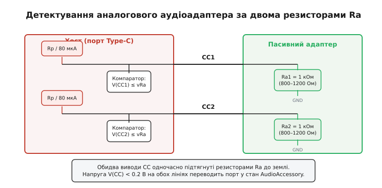
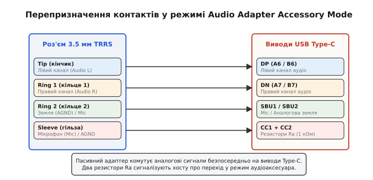
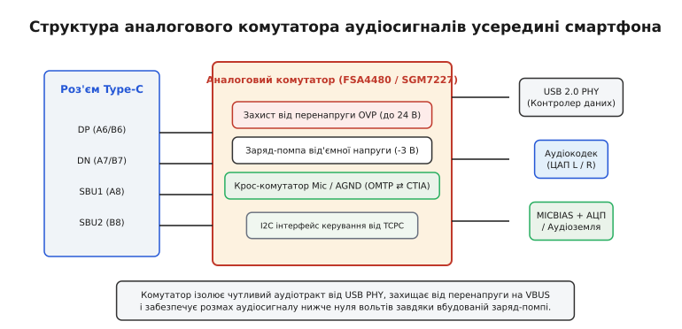
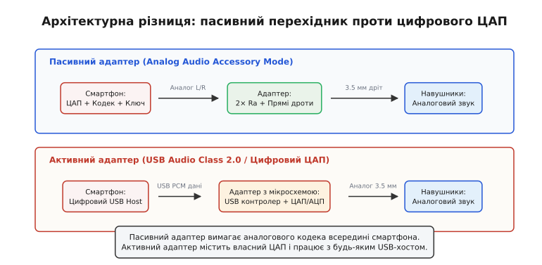
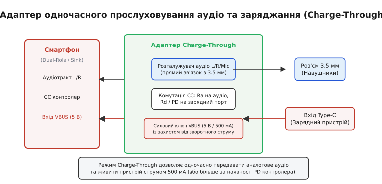

# USB-C аудіоадаптер: резистор Ra і режим аналогового звуку

<preknowlist>
- [Дільник напруги](topic:electronics/voltage-divider) — джерело з підтяжкою та навантаження утворюють дільник, напруга якого однозначно кодує стан підключення.
- [Type-C без PD](topic:electronics/type-c-cc) — лінії конфігурації CC1 і CC2, підтяжки Rp і Rd, визначення присутності пристрою та орієнтації штекера.
- [Компаратор](topic:electronics/comparator) — аналогове порівняння вхідної напруги з опорними порогами для генерації цифрових прапорців стану.
- [Аналоговий мультиплексор](topic:electronics/analog-mux) — електронна комутація аналогових сигналів напівпровідниковими ключами без спотворення форми хвилі.
</preknowlist>

Коли виробники мобільної техніки вирішили прибрати виділений 3.5-міліметровий роз'єм для навушників, інженери зіткнулися з жорстким схемотехнічним викликом: як дозволити користувачеві встромити в єдиний порт USB Type-C звичайні дротові навушники через копійчаний пасивний шнурок без процесора, тактового генератора чи батарейки, і водночас гарантувати, що чутливий внутрішній підсилювач звуку не спалить себе, якщо замість навушників у гніздо раптом увімкнуть швидку зарядку на 20 вольтів або швидкісний накопичувач?

Відповіддю став спеціальний апаратний режим специфікації USB Type-C — *Audio Adapter Accessory Mode* (додатковий режим аудіоаксесуара, від лат. *accessorius* — додатковий). Увесь механізм розпізнавання перехідника спирається на елегантну фізику резистивного узгодження, де два копійчані пасивні резистори змушують складний цифровий порт миттєво знеструмити силові лінії та перетворити контакти високошвидкісних даних на виходи звичайного стереопідсилювача.

### Канал конфігурації CC і роль резистора Ra

Універсальний роз'єм USB Type-C містить два спеціальні виводи конфігурації каналу — **CC1** (контакт A5) та **CC2** (контакт B5). Усі базові сценарії підключення визначаються тим, що саме порт «бачить» на цих двох виводах:

1. Якщо до порту нічого не під'єднано, обидві лінії CC перебувають у розімкненому стані (*Open*), і внутрішні підтяжки хоста утримують на них високий потенціал опорної напруги (3.3 В або 5.0 В).
2. Коли під'єднується звичайний цифровий споживач енергії (флешка, зовнішній модуль, телефон на зарядку), він тягне до землі **лише одну** лінію CC через стандартний резистор **Rd = 5.1 кОм**, тоді як друга лінія лишається розімкненою через особливості внутрішньої розводки кабелю.
3. Коли під'єднується активний швидкісний кабель, на активній сигнальній лінії CC залишається резистор Rd (5.1 кОм), а на другій лінії з'являється допоміжний опір **Ra** (номіналом 1.0 кОм), який сигналізує хосту: «подай на цю лінію живлення VCONN 5 В для живлення вбудованого в кабель чипа електронного маркера».

Режим аналогового аудіоаксесуара створює принципово іншу, унікальну сигнатуру, яку не може випадково сформувати жоден цифровий пристрій чи кабель: **пасивний перехідник підтягує до землі резисторами Ra обидві лінії CC1 і CC2 одночасно**.


*Хост підтягує обидві лінії CC струмом 80 мкА (або резисторами Rp); пасивний адаптер замикає обидві лінії на землю через резистори Ra = 1 кОм. Напруга на обох лініях падає нижче порогу vRa (< 0.2 В), і контролер переводить роз'єм у режим AudioAccessory.*

Номінальний опір резистора Ra становить **1.0 кОм (1000 Ом)**, а специфікація допускає технологічний розкид у межах від **800 Ом до 1200 Ом**. Чому обрано саме 1 кОм, а не 5.1 кОм (Rd)? Якщо пристрій підтягне обидві лінії опором 5.1 кОм (комбінація Rd/Rd), хост інтерпретує це як режим апаратного налагодження (*Debug Accessory Mode*). Якщо одна лінія матиме Rd, а друга Ra — це активний кабель. І лише комбінація **Ra / Ra** (обидві лінії менше 1200 Ом) однозначно й безапеляційно вказує: до гнізда під'єднано пасивний аналоговий аудіоперехідник.

### Логіка детектування та вікна напруг компаратора

Розгляньмо, як саме контролер порту хоста (чіп TCPC — *Type-C Port Controller*) розпізнає цей стан на фізичному рівні. Хост постійно живить виводи CC1 і CC2 через калібровані внутрішні джерела струму або підтягувальні резистори Rp до шини 3.3 В чи 5.0 В.

У стандартному базовому режимі струм підтяжки джерела становить `I_rp = 80 мкА` (що еквівалентно резистору Rp = 56 кОм до напруги 5.0 В). Коли штекер перехідника потрапляє в розетку, струм хоста починає стікати крізь резистори Ra (1.0 кОм) на землю адаптера. Напруга на кожному з виводів CC фіксується за [законом Ома](topic:electronics/ohms-law):

```
V(CC1) = I_rp · Ra1
       = 80 мкА · 1000 Ом   [підстановка базового струму та номіналу Ra]
       = 0.080 В            [80 мВ]

V(CC2) = I_rp · Ra2
       = 80 мкА · 1000 Ом   [симетрична лінія CC2]
       = 0.080 В            [80 мВ]
```

Якщо ж у розетку вставити стандартний цифровий пристрій з резистором Rd = 5.1 кОм, напруга на активному контакті становитиме зовсім іншу величину:

```
V(CC_Rd) = I_rp · Rd
         = 80 мкА · 5100 Ом  [підстановка опору Rd 5.1 кОм]
         = 0.408 В           [408 мВ]
```

Для чіткого розрізнення цих режимів контролер порту містить вбудовані віконні [компаратори](topic:electronics/comparator) (від лат. *comparare* — порівнювати), опорні пороги яких задані стандартом:

1. **Поріг vRa (0 В ... 0.15 В при 80 мкА):** напруга нижче 150 мВ означає наявність резистора Ra.
2. **Поріг vRd (0.25 В ... 2.04 В):** напруга в цьому інтервалі свідчить про наявність резистора пристрою Rd.
3. **Поріг vOpen (понад 1.65 В при 3.3 В або понад 2.75 В при 5.0 В):** напруга свідчить про відсутність підключення на даному контакті.

Специфікація кінцевого автомата контролера вимагає проходження суворої послідовності станів:
- **`Unattached.SRC` (Очікування):** обидва контакти CC1 і CC2 мають напругу вище vOpen. Силова шина VBUS повністю знеструмлена (0 В), високошвидкісні ключі розімкнені.
- **`AttachWait.SRC` (Фільтрація брязкоту):** компаратори фіксують спад напруги на обох контактах CC1 і CC2 нижче порогу vRa (< 150 мВ). Контролер запускає апаратний таймер захисту від механічного брязкоту контактів `tCCDebounce` тривалістю від 100 до 200 мс.
- **`AudioAccessory` (Режим аудіо):** якщо протягом усього інтервалу `tCCDebounce` напруги на обох контактах неперервно лишалися в межах вікна vRa, автомат остаточно переходить у стан аудіоаксесуара.

Повний звід електричних параметрів, часових інтервалів і допустимих похибок вимірювання наведено у довіднику [📋 Специфікація та електричні параметри Audio Adapter Accessory Mode](topic:electronics/usb-c-audio-adapter/api-audio-accessory.md).

Щойно стан підтверджено, контролер порту дає внутрішню апаратну команду: негайно заборонити вмикання напруги живлення VBUS, переконатися, що лінія живлення кабелю VCONN гарантовано вимкнена, і надіслати цифровий сигнал на комутатор аудіосигналів.

### Перепризначення виводів: як контакти даних стають звуком

Після переходу в стан `AudioAccessory` стандартні цифрові функції контактів роз'єму USB Type-C повністю скасовуються. Відбувається апаратне перепризначення виводів:


*Контакти DP і DN стають лівим і правим каналами стереозвуку, лінії SBU1 і SBU2 беруть на себе мікрофон і аналогову землю, а лінії CC1 і CC2 несуть резистори Ra для детектування.*

1. **Диференційна пара USB 2.0:** контакт **DP** (D+, контакти A6 і B6) стає виходом лівого каналу звуку (**Audio_L**), а контакт **DN** (D−, контакти A7 і B7) — виходом правого каналу звуку (**Audio_R**).
2. **Допоміжні лінії SBU:** контакти **SBU1** (A8) та **SBU2** (B8) перетворюються на лінії передавання сигналу мікрофона (**MIC**) та повернення струму навушників — аналогову землю (**AGND**).
3. **Лінії конфігурації CC:** контакти **CC1** (A5) та **CC2** (B5) утримують з'єднання з резисторами Ra всередині адаптера, дозволяючи хосту безперервно контролювати факт наявності штекера в гнізді.
4. **Високошвидкісні пари SuperSpeed (TX/RX):** перемикаються у високімпедансний стан (*High-Z*) і електрично ізолюються від схеми.

Усередині простого пасивного перехідника немає жодної мікросхеми. Це лише шматок гнучкого кабелю, в якому мідні жили з'єднують контакти розетки 3.5 мм TRRS (*Tip-Ring-Ring-Sleeve*) із відповідними виводами вилки Type-C:
- Кінчик штекера 3.5 мм (**Tip**) запаяний на контакт DP (лівий динамік).
- Перше кільце (**Ring 1**) запаяне на контакт DN (правий динамік).
- Друге кільце (**Ring 2**) з'єднане з лінією SBU1.
- Гільза (**Sleeve**) з'єднана з лінією SBU2.
- Між лінією CC1 і загальною землею запаяно резистор Ra1 = 1.0 кОм; між лінією CC2 і землею — резистор Ra2 = 1.0 кОм.

Собівартість такого адаптера становить лічені центи, оскільки весь тягар цифро-аналогового перетворення звуку, підсилення потужності та фільтрації покладається на внутрішні вузли самого смартфона.

### Проблема реверсивного штекера: OMTP, CTIA та автокрос-комутація

На шляху простого з'єднання постає неочевидна геометрична й стандартизаційна дилема.

По-перше, роз'єм USB Type-C є симетричним і реверсивним: користувач може встромити штекер прямим або перевернутим боком. Якщо контакти DP/DN дублюються симетрично на обох сторонах розетки (A6 з'єднано з B6, A7 з B7), то допоміжні лінії SBU розташовані асиметрично: контакт SBU1 розміщений на стороні A (A8), а SBU2 — на стороні B (B8). Перевертання штекера на 180 градусів міняє контакти SBU1 і SBU2 місцями.

По-друге, у світі аналогових гарнітур 3.5 мм TRRS історично існують два взаємно несумісні стандарти розташування землі та мікрофона:
- **CTIA (AHJ):** Ring 2 — це аналогова земля (AGND), а Sleeve — мікрофон (MIC).
- **OMTP:** Ring 2 — це мікрофон (MIC), а Sleeve — аналогова земля (AGND).

Якщо з'єднати ці контакти жорстко, у трьох із чотирьох можливих комбінацій (перевернутий штекер або гарнітура іншого стандарту) сигнал мікрофона опиниться на шині землі, а земля навушників — на вході мікрофонного підсилювача. У результаті звук у навушниках стане глухим і протифазним, а мікрофон повністю замовкне.

Щоб вирішити цю проблему без участі користувача, виробники інтегрують у смартфон спеціалізований [аналоговий мультиплексор](topic:electronics/analog-mux) з функцією автоматичного перехресного перемикання (*auto cross-switch*).

Принцип автовизначення базується на вимірюванні імпедансу:
1. Після фіксації стану `AudioAccessory` контролер подає на лінії SBU1 і SBU2 короткий тестовий струм зміщення величиною близько 100 мкА.
2. Контакт, підключений до аналогової землі навушників, з'єднаний із землею через низький активний опір звукових котушок динаміків (16–32 Ом). Спад напруги на ньому становить лише кілька мілівольтів:

```
V_gnd_test = I_test · R_coil
           = 100 мкА · 32 Ом    [розрахунок спаду напруги на котушці навушника]
           = 3.2 мВ
```

3. Контакт, підключений до електретного мікрофона капсуля гарнітури, містить внутрішній польовий транзистор із типовим опором 1.0–2.2 кОм. Спад напруги на ньому досягає значно вищої величини:

```
V_mic_test = I_test · R_mic
           = 100 мкА · 1500 Ом  [розрахунок спаду напруги на мікрофонному капсулі]
           = 150 мВ
```

Вбудований компаратор миттєво фіксує різницю: вивід із напругою 3.2 мВ комутується наднизькоомним ключем на чисту внутрішню аналогову землю AGND, а вивід із напругою 150 мВ підключається до шини живлення мікрофона (MICBIAS 2.8 В) та передпідсилювача АЦП. Уся процедура триває менше 15 мілісекунд і відбувається абсолютно непомітно для слухача.

Детальний аналіз напівпровідникової структури таких комутаторів винесено в окремий матеріал [🔌 Аналогові крос-комутатори USB-C](topic:electronics/usb-c-audio-adapter/comp-audio-switch.md).

### Детектування кнопок гарнітури на лінії мікрофона

Окрім передавання голосового сигналу, лінія мікрофона (MIC) виконує функцію каналу керування відтворенням за допомогою резистивного дільника (*resistor ladder*).

Усередині гарнітури встановлено кілька паралельних кнопок, кожна з яких послідовно з'єднана з резистором певного каліброваного номіналу:
- **Кнопка «Play / Pause / Відповідь на дзвінок»** закорочує лінію мікрофона безпосередньо на аналогову землю (опір менше 70 Ом, типово 0 Ом).
- **Кнопка «Volume Up (+)»** замикає лінію через резистор номіналом 240 Ом (допустиме вікно 150–350 Ом).
- **Кнопка «Volume Down (−)»** замикає лінію через резистор номіналом 470 Ом (допустиме вікно 400–650 Ом).
- У стані спокою (кнопки не натиснуті) опір лінії визначається капсулем електретного мікрофона і становить 1.0–2.5 кОм.

Внутрішнє джерело струму MICBIAS живить лінію через підтягувальний резистор 2.2 кОм до напруги 2.8 В. Вбудований в аудіокодек АЦП безперервно контролює напругу на лінії. Коли користувач натискає кнопку, напруга падає у відповідне вікно компаратора: 0 В відповідає паузі, 0.25 В — збільшенню гучності, а 0.50 В — зменшенню гучності. Апаратний таймер придушення брязкоту (20–40 мс) фільтрує механічні сплески контактів кнопки, генеруючи процесору системне переривання.

### Внутрішня схемотехніка: від'ємний розмах сигналу та заряд-помпи

Комутація аналогового звуку через спільні контакти цифрового порту висуває надзвичайно жорсткі вимоги до напівпровідникових ключів.

Звуковий сигнал є змінним коливанням (AC). Щоб уникнути використання громіздких розв'язувальних електролітичних конденсаторів ємністю сотні мікрофарад, вихідний каскад сучасного підсилювача навушників живиться від двополярної напруги і видає сигнал, центрований точно навколо нуля вольтів. Це означає, що в позитивні півперіоди напруга на контактах DP і DN підіймається до +1.0 В ... +1.5 В, а у від'ємні півперіоди опускається нижче потенціалу землі до −1.0 В ... −1.5 В.


*Внутрішній комутатор смартфона поєднує захист від перенапруги OVP до 24 В, інвертувальну заряд-помпу для підтримки від'ємного розмаху аудіосигналу та матрицю перемикання SBU для гарнітур CTIA та OMTP.*

Якщо пропустити такий сигнал через класичний КМОН-ключ (*CMOS switch*), підкладка n-канального МОН-транзистора якого з'єднана зі звичайною землею (GND = 0 В), виникає фізична аварія: щойно напруга звуку впаде нижче −0.3 В ... −0.6 В, внутрішній p-n перехід між стоком транзистора та кремнієвою підкладкою відкриється у прямому напрямку. Струм аудіосигналу почне неконтрольовано стікати в підкладку, що викличе жорстке зрізання нижньої половини синусоїди звуку (*clipping*) та катастрофічні нелінійні спотворення (THD+N зросте до 10–20%).

Щоб ключі могли комутувати сигнал з амплітудою нижче нуля при однополярному живленні пристрою (наприклад, від Li-ion акумулятора 3.8 В), спеціалізовані аудіокомутатори (наприклад, FSA4480, SGM7227) містять інтегровану інвертувальну [заряд-помпу](topic:electronics/charge-pump). Вона генерує внутрішню від'ємну шину живлення з напругою близько −3.0 В. Підкладки сигнальних транзисторів зміщуються цим від'ємним потенціалом, завдяки чому комутатор без жодних спотворень пропускає звукові сигнали з повним розмахом від −2.0 В до +2.0 В відносно землі.

Другий критичний параметр — опір увімкненого ключа (**Ron**) та його нелінійність (**ΔRon**).

Опір обмотки динаміків портативних навушників становить лише 16 або 32 Ом. Якщо ключ матиме відчутний опір, виникнуть дві серйозні проблеми:
1. **Втрата потужності та спотворення АЧХ:** на ключі розсіюватиметься частина вихідної потужності підсилювача, а коефіцієнт демпфування (*damping factor*, від нім. *dämpfen* — глушити) різко погіршиться, що призведе до розмитого звучання низьких частот. Якщо ж опір ключа змінюється залежно від миттєвої напруги сигналу (явище нелінійності ΔRon), ключ сам по собі генерує вищі гармоніки.
2. **Перехресні завади (кростолк):** якщо ключ аналогової землі матиме помітний опір R_gnd, спільний зворотний струм лівого динаміка створюватиме спад напруги на землі, який з'являтиметься на правому динаміку. Рівень перехресного проникнення виражається логарифмічним співвідношенням:

```
Xtalk [дБ] = 20 · lg( R_gnd / (R_load + R_gnd) )
```

Якщо опір ключа землі становить R_gnd = 0.5 Ом при навантаженні R_load = 32 Ом, розв'язка каналів погіршується до −36 дБ, що робить стереоефект практично непомітним. Якщо ж R_gnd знизити до 0.05 Ом, розв'язка покращується до −56 дБ.

Тому сучасні аналогові аудіокомутатори мають власний опір каналу `Ron < 0.3–0.5 Ом` для сигнальних ліній і `Ron_gnd < 0.05–0.1 Ом` для лінії землі при коефіцієнті спотворень `THD+N < 0.003%`.

### Небезпечне сусідство: захист від перенапруги 20 В (OVP)

Фізичні контакти всередині роз'єму USB Type-C розташовані з надзвичайно малим кроком — усього **0.5 мм** між сусідніми виводами.

Безпосередньо поруч із контактами DP (A6) та DN (A7) проходять силові виводи шини **VBUS** (контакти A4, A9, B4, B9). У протоколах швидкого заряджання [USB Power Delivery](topic:electronics/usb-pd) напруга на шині VBUS підіймається до 9 В, 15 В, 20 В, а за стандартом USB-PD EPR — аж до 48 В.

Якщо під час неакуратного вставляння кабелю, потрапляння в гніздо краплі води, поту або дрібної металевої пилинки відбудеться короткочасне замикання між контактом VBUS (20 В) і сусіднім сигнальним контактом DP чи DN, висока напруга миттєво піде у внутрішні ланцюги смартфона. Оскільки внутрішній аудіокодек виготовлено за мікроелектронним техпроцесом із гранично допустимою напругою 1.8–3.3 В, він вигорить за лічені частки мікросекунди.

Тому аналоговий комутатор виконує ще одну життєво важливу роль — бар'єра захисту від аварійної перенапруги (*Overvoltage Protection*, OVP):
- Вхідні польові транзистори комутатора, під'єднані до роз'єму, виготовляються за високовольтною технологією і витримують постійну напругу до **20–24 В** без електричного пробою.
- Всередині мікросхеми працює надшвидкий компаратор аварійної напруги. Якщо потенціал на виводах DP, DN, SBU1 чи SBU2 перевищує безпечний поріг (типово 4.5–4.8 В), схема OVP менш ніж за **50 наносекунд** розмикає послідовні силові ключі, надійно відсікаючи високу напругу від аудіокодека та контролера USB PHY.

### Електромагнітна сумісність та захист від радіоперешкод (EMI)

Довгий дріт навушників (довжиною 1.0–1.5 м) працює як високоефективна антена у діапазонах стільникового зв'язку GSM, LTE та 5G (від 700 МГц до 2.6 ГГц), а також Wi-Fi та Bluetooth (2.4 ГГц і 5 ГГц).

Коли телефон передає дані в мережу з потужністю передавача до 1–2 Вт, на контактах роз'єму Type-C наводиться високочастотна електрорушійна сила з амплітудою в кілька вольтів. Якщо ця напруга потрапить на p-n переходи комутатора або вихідного каскаду аудіопідсилювача, напівпровідникові структури спрацюють як амплітудний детектор (демодулятор). У результаті імпульси передавача стільникового зв'язку (наприклад, кадрова частота GSM 217 Гц) перетворяться на гучне чутне дзижчання та тріскотіння в навушниках.

Для придушення радіоперешкод безпосередньо за контактами роз'єму встановлюють комбіновані фільтри:
- На лініях DP, DN, SBU1, SBU2 послідовно вмикають феритові фільтри (*Ferrite Beads*) з імпедансом понад 600–1000 Ом на частоті 100 МГц і омічним опором постійному струму менше 0.1 Ом.
- Сигнальні провідники шунтують керамічними конденсаторами ємністю 22–47 пФ на землю. Разом з індуктивністю фериту вони утворюють низькочастотний LC-фільтр, який вільно пропускає звукові коливання до 40 кГц, але послаблює гігагерцові радіочастотні наводки більш ніж на 40–50 дБ.

### Пасивні перехідники проти активних цифрових ЦАП (UAC 2.0)

На ринку аксесуарів існують два зовні майже однакові перехідники з USB-C на 3.5 мм, які проте принципово відрізняються своєю внутрішньою інженерною архітектурою:


*Пасивний адаптер використовує ЦАП і підсилювач самого смартфона через аналогові ключі. Активний перехідник є повноцінною цифровою звуковою картою USB Audio Class 2.0 і працює з будь-яким портом.*

1. **Пасивний аналоговий перехідник (Audio Adapter Accessory Mode):**
   - Усередині містить лише два резистори Ra = 1.0 кОм і прямі мідні дроти.
   - Працює **виключно** з тими смартфонами та планшетами, які мають вбудований аналоговий аудіокодек, виведений на роз'єм Type-C через внутрішній комутатор.
   - Якщо встромити такий перехідник у пристрій без підтримки аналогового режиму (наприклад, у ноутбук, ПК, iPhone 15/16, Google Pixel або флагмани Samsung останніх поколінь), система або взагалі ніяк не зреагує, або покаже системне попередження «Підключений аудіоаксесуар не підтримується».

2. **Активний цифровий ЦАП (Digital DAC Adapter / USB Audio Class):**
   - Усередині штекера Type-C розміщена крихітна друкована плата з повноцінною мікросхемою цифрового аудіомоста (наприклад, Realtek ALC5686, Conexant CX31993, Cirrus Logic CS46L41).
   - Мікросхема містить апаратний контролер USB 2.0 Full-Speed або High-Speed, цифровий сигнальний процесор (DSP), стереофонічний цифро-аналоговий перетворювач ([ЦАП](topic:electronics/dac-weighted-resistors)), АЦП мікрофона та підсилювач навушників.
   - Такий перехідник підключається до хоста як стандартний цифровий периферійний пристрій класу *USB Audio Device Class 1.0 / 2.0 (UAC)*. По контактах DP/DN передаються виключно цифрові бітові пакети аудіопотоку PCM, а на лінії CC1 виставляється звичайний резистор Rd = 5.1 кОм.
   - Активний адаптер є універсальним і гарантовано працює на будь-якому пристрої з портом USB (Windows, Linux, macOS, Android, iOS).

Чому ж більшість провідних виробників флагманських смартфонів поступово повністю відмовилися від підтримки аналогового режиму Audio Accessory Mode на користь виключно цифрових ЦАП?

Причина полягає в оптимізації компонування плати та вартості компонентів (BOM):
- Підтримка аналогового звуку через Type-C змушує виробника ставити на системну плату високовольтний комутатор OVP, прокладати аналогові доріжки через усю плату поруч із високочастотними радіотрактами стільникового зв'язку (що створює ризик наведення шуму та фону), а також платити за місце на платі.
- Перенесення аудіотракту назовні в цифровий перехідник дозволило повністю прибрати з плати аналогові комутатори й підсилювачі, захистити тракт від внутрішніх електромагнітних завад процесора та перекласти завдання якісного перетворення звуку на виробників спеціалізованих аудіоаксесуарів.

### Режим одночасного заряджання: Charge-Through Audio

Багато користувачів використовують комбіновані розгалужувачі «2-в-1», які мають роз'єм 3.5 мм для навушників і додаткове гніздо Type-C для підключення зарядного пристрою:


*Режим Charge-Through поєднує пасивну підтяжку Ra для аналогового звуку та підтяжку Rd або контролер PD для одночасного прийому струму живлення через спільний роз'єм.*

Цей режим стандартизовано під назвою *Charge-Through Audio Adapter*:
- На стороні хоста адаптер виставляє асиметричну термінацію: одна лінія CC має резистор **Ra = 1.0 кОм** (для вмикання аналогового звуку), а друга лінія CC несе підтяжку **Rd = 5.1 кОм** (яка повідомляє хосту, що через цей роз'єм можна одночасно приймати струм живлення по шині VBUS).
- На зовнішньому гнізді для зарядного пристрою адаптер імітує стандартного споживача UFP.

У найпростіших пасивних розгалужувачах зарядний струм суворо обмежений величиною **500 мА при 5 В**. Причина такого жорсткого обмеження — паразитний спад напруги на загальному контакті повернення землі:

```
V_noise = I_charge · R_ground
        = 2.0 А · 0.1 Ом     [спад напруги при спробі зарядити струмом 2 А]
        = 0.2 В              [200 мВ пульсацій потрапляє у звук]
```

Якщо пустити через спільний земляний контакт перехідника струм швидкого заряджання 2–3 ампери, пульсації імпульсного перетворювача зарядки зі спадом 200 мВ створять нестерпне гудіння й тріскотіння в динаміках навушників. Тому потужні розгалужувачі з підтримкою [швидкого заряджання](topic:electronics/fast-charging) обов'язково містять окремий цифровий контролер [USB PD](topic:electronics/usb-pd) та ізольовані диференційні підсилювачі з високим коефіцієнтом придушення синфазного сигналу ([CMRR](topic:electronics/cmrr)).

### Практичний алгоритм детектування та ініціалізації порту

Погляньмо, як програмний драйвер контролера порту (TCPC) взаємодіє з аналоговим комутатором (наприклад, FSA4480) через шину I2C під час виявлення аналогового аудіоадаптера.

Нижче наведено практичний приклад процедури обробки переривання підключення аксесуара:

:::tabs
```c
#include <stdint.h>
#include <stdbool.h>

#define TCPC_REG_ROLE_CTRL   0x1A
#define TCPC_REG_CC_STATUS   0x1D
#define SW_REG_CONTROL       0x02

#define CC_STATUS_VRA        0x01
#define CC_STATUS_MASK       0x03

/* Приклад апаратного читання регістрів через I2C */
extern uint8_t tcpc_i2c_read(uint8_t reg);
extern void audio_switch_i2c_write(uint8_t reg, uint8_t val);
extern void audio_codec_enable_dac(bool enable);

/* Обробник переривання підключення від TCPC */
void handle_typec_attach_interrupt(void) {
    uint8_t cc_stat = tcpc_i2c_read(TCPC_REG_CC_STATUS);
    uint8_t cc1 = (cc_stat >> 0) & CC_STATUS_MASK;
    uint8_t cc2 = (cc_stat >> 2) & CC_STATUS_MASK;

    /* Перевіряємо умову AudioAccessory: CC1 == vRa І CC2 == vRa */
    if (cc1 == CC_STATUS_VRA && cc2 == CC_STATUS_VRA) {
        /* 1. Заборонити подачу живлення VBUS і VCONN */
        /* 2. Налаштувати комутатор: увімкнути заряд-помпу та перемкнути DP/DN на ЦАП */
        uint8_t sw_cfg = (1 << 7) |  /* SW_EN: увімкнути ключі */
                         (2 << 5) |  /* USB_AUDIO_SEL: режим аналогового звуку */
                         (1 << 0);   /* NEG_PUMP_EN: увімкнути генератор -3 В */
        audio_switch_i2c_write(SW_REG_CONTROL, sw_cfg);

        /* 3. Запустити вихідний стереокаскад аудіокодека */
        audio_codec_enable_dac(true);
    }
}
```
```cpp
#include <cstdint>
#include <span>

namespace usb_c {

enum class CcState : std::uint8_t {
    Open = 0x00,
    Ra   = 0x01,
    Rd   = 0x02
};

struct TcpciRegisters {
    static constexpr std::uint8_t RoleControl = 0x1A;
    static constexpr std::uint8_t CcStatus    = 0x1D;
};

struct AudioSwitchRegisters {
    static constexpr std::uint8_t Control     = 0x02;
    static constexpr std::uint8_t SwitchEn    = 1 << 7;
    static constexpr std::uint8_t ModeAudio   = 2 << 5;
    static constexpr std::uint8_t NegPumpEn   = 1 << 0;
};

class PortManager {
public:
    explicit PortManager(class II2cBus& bus) : bus_(bus) {}

    void handleAttachInterrupt() {
        const std::uint8_t status = readRegister(TcpciRegisters::CcStatus);
        const auto cc1 = static_cast<CcState>(status & 0x03);
        const auto cc2 = static_cast<CcState>((status >> 2) & 0x03);

        if (cc1 == CcState::Ra && cc2 == CcState::Ra) {
            configureAnalogAudioMode();
        }
    }

private:
    class II2cBus& bus_;

    std::uint8_t readRegister(std::uint8_t reg);
    void writeRegister(std::uint8_t devAddr, std::uint8_t reg, std::uint8_t val);

    void configureAnalogAudioMode() {
        constexpr std::uint8_t config = AudioSwitchRegisters::SwitchEn |
                                       AudioSwitchRegisters::ModeAudio |
                                       AudioSwitchRegisters::NegPumpEn;
        writeRegister(0x42, AudioSwitchRegisters::Control, config);
    }
};

} // namespace usb_c
```
:::

Коли обидва компаратори фіксують стан `vRa`, керівний процесор через шину I2C однією командою вмикає інвертувальну заряд-помпу комутатора, замикає контакти DP/DN на виходи внутрішнього аудіокодека і запускає програвання звуку.

> 🔧 **Навіщо це.** Якщо ви розробляєте вбудований пристрій або вимірювальний прилад з універсальним портом Type-C і хочете реалізувати низькобюджетний аналоговий аудіовихід (або вхід для зовнішнього датчика) без встановлення громіздкого USB-хост контролера, вам достатньо встановити на лінії CC1 і CC2 два пасивні резистори 1 кОм (Ra). Ваш прилад автоматично впізнаватиметься смартфонами та аудіоплеєрами з підтримкою аналогового режиму, не вимагаючи жодного рядка складного програмного USB-стеку чи виділеного джерела живлення.

### Підсумок

Режим *Audio Adapter Accessory Mode* у роз'ємі USB Type-C є зразком витонченого інженерного мінімалізму:
1. Виявлення аналогового аксесуара здійснюється суто пасивними засобами — наявністю двох симетричних підтягувальних резисторів **Ra = 1.0 кОм (800–1200 Ом)** на лініях CC1 і CC2 одночасно.
2. Контролер порту розпізнає стан спадом напруги нижче 150 мВ (поріг vRa), після чого знеструмлює силову шину VBUS і перемикає контакти DP та DN на лівий і правий канали аналогового звуку.
3. Проблема реверсивності та несумісності стандартів гарнітур CTIA/OMTP розв'язується внутрішнім аналоговим крос-комутатором, який вимірює спад напруги на лініях SBU і динамічно маршрутизує мікрофон та аналогову землю.
4. Для запобігання спотворенням змінного аудіосигналу напівпровідникові ключі використовують внутрішню заряд-помпу від'ємної напруги (−3 В), а для захисту від аварійного замикання на сусідні контакти VBUS — швидкодіючі високовольтні схеми OVP до 24 В.
