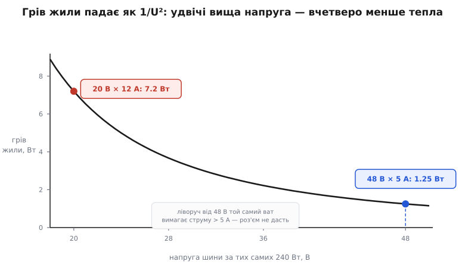
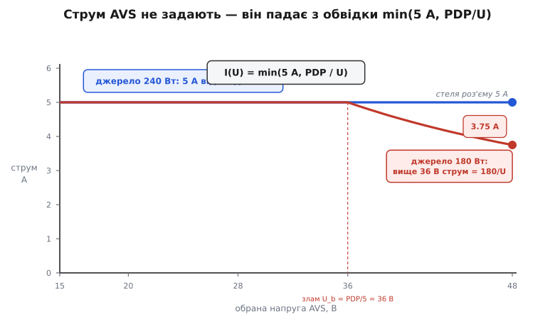
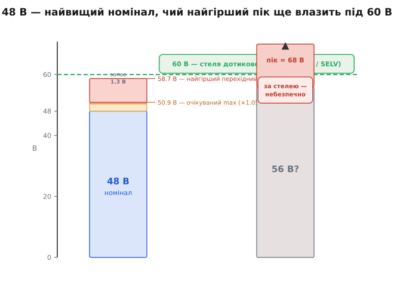

# 🧮 Математика EPR: джоулів грів, щаблі струму й запас до 60 В

Усю інженерію розширеного діапазону можна вивести з двох чисел. Знизу стоїть стіна **5 ампер** — стеля, яку витримують контакти роз'єму USB-C. Згори — стіна **60 вольтів**, вище якої напруга на шині перестає бути безпечною на дотик. Уся потужність, яку EPR узагалі здатен пропхати, живе в цьому вузькому коридорі між двома стінами, і кожне окреме число стандарту — щаблі 28/36/48 вольтів, струм у режимі AVS, сам вибір 48, а не 60 — це арифметика того, як витиснути максимум ват крізь той коридор, не зачепивши жодної стіни. Розберімо обидві стіни від першопричини й порахуймо, що саме кожна з них диктує.

## Чому втрати ростуть як квадрат струму

Почнімо зі стіни знизу — з того, чому взагалі не можна просто пустити більше струму. Причина — грів самої жили, і щоб побачити його форму, треба акуратно розділити дві різні напруги, які легко сплутати.

Мідна жила в кабелі має опір `R`. Коли крізь неї тече струм `I`, на ній за законом Ома падає своя, власна напруга `U_жили = I·R` — це не напруга шини, а лише та дещиця, що губиться на самому дроті. Потужність, яку розсіює будь-який елемент, — це добуток напруги на ньому на струм крізь нього: `P = U·I`. Підставмо сюди власне падіння жили:

```
P_втрат = U_жили · I = (I·R) · I = I²·R
```

Ось звідки квадрат. Напруга шини — 20 вона чи 48 — у цю формулу **не входить узагалі**. Жилу гріє тільки струм крізь неї та її власний опір; висока напруга шини лише «штовхає» ту саму корисну потужність меншим струмом, а сама по собі жоден градус не додає. Це і є [джоулів грів](book:physics/joule-heating) у чистому вигляді: тепло — квадратична функція струму й лінійна функція опору.

Тепер переведімо це у форму, яка прямо стосується вибору напруги. Навантаженню треба певна потужність `P` — скажімо, 240 ват для робочої станції. За напруги шини `U` воно тягне струм `I = P/U`. Підставмо цей струм у формулу гріву:

```
P_втрат = I²·R = (P/U)²·R = P²·R / U²
```

Це головна формула всього EPR. За **фіксованої корисної потужності** грів кабелю падає як **обернений квадрат напруги**. Подвоїти напругу — це вчетверо зменшити тепло в тому самому дроті, не додавши до кабелю ані міліметра міді. Ось чому напруга й струм тут аж ніяк не рівноцінні множники: обидва однаково множаться в `P = U·I`, але в грів кабелю один з них входить квадратом, а другий не входить зовсім.

**Той самий кабель (R = 0.05 Ом), ті самі 240 ват — різна напруга шини.**
```
Грів жили:  P_втрат = (240/U)² · 0.05

U = 20 В →  I = 240/20 = 12.0 А →  P_втрат = 12.0² · 0.05 = 7.20 Вт
U = 28 В →  I = 240/28 =  8.57 А →  P_втрат =  8.57² · 0.05 = 3.67 Вт
U = 36 В →  I = 240/36 =  6.67 А →  P_втрат =  6.67² · 0.05 = 2.22 Вт
U = 48 В →  I = 240/48 =  5.00 А →  P_втрат =  5.00² · 0.05 = 1.25 Вт

Від 20 до 48 В напруга зросла в 2.4 раза,
а грів упав у  7.20 / 1.25 = 5.76 раза  ( = 2.4² ).
```
**Висновок.** Падіння гріву — це рівно квадрат відношення напруг: підняли напругу в 2.4 раза, тепло зменшилося в 2.4² = 5.76 раза. Формула `1/U²` не абстракція, а точний закон, за яким живе кожен ват у кабелі.


*Грів жили за незмінних 240 Вт і R = 0.05 Ом. Крива — це `(240/U)²·0.05`: круте падіння оберненого квадрата. На 48 В (5 А) в кабелі гріється лише 1.25 Вт; щоб дати ті самі 240 Вт на 20 В, знадобилося б 12 А і 7.2 Вт гріву — та й це гіпотетика, бо роз'єм 12 А просто не пропустить.*

Варто на мить зробити ці вати відчутними. Тонка жила заряджального шнура має малу площу, і тепло з неї сходить погано; скільки саме градусів дадуть ті вати, вирішує [тепловий опір](book:physics/thermal-resistance) шляху «жила → повітря». Для типового тонкого кабелю кожен розсіяний ват піднімає температуру жили на десятки градусів, тож 7.2 Вт — це вже відчутно гарячий на дотик шнур і підстаркувата ізоляція, а 1.25 Вт — ледь тепла жила, яку рука навіть не помітить. Різниця між двома способами дати однакові 240 ват — це різниця між кабелем, що старіє від власного тепла, і кабелем, якому байдуже.

## Стеля 5 ампер: чому нижчий шлях не гарячий, а закритий

Формула `1/U²` каже, що низька напруга гріє дужче, але сама по собі ще не забороняє її. Забороняє друге, жорсткіше число: контакти й найтонші жили USB-C розраховані щонайбільше на **5 ампер**. Це не поріг, за яким «стає гаряче», — це поріг, за яким мідна пелюстка в роз'ємі просто перегрівається й пливе. П'ять ампер — тверда стеля.

З неї випливає стеля потужності на кожній напрузі. За струму, не більшого за 5 А, найбільша потужність, яку взагалі можна провести напругою `U`, — це

```
P_max(U) = 5 А · U

U = 20 В →  P_max = 100 Вт
U = 28 В →  P_max = 140 Вт
U = 36 В →  P_max = 180 Вт
U = 48 В →  P_max = 240 Вт
```

Погляньмо на це число з іншого боку. Щоб віддати задану потужність `P`, напруга мусить бути не нижчою за `P/5`:

```
U ≥ P / 5 А
240 Вт → U ≥ 48 В
```

Ось чому «дати 240 ват на 20 вольтах» — це не «поганий, гарячий варіант», а варіант, якого **не існує**. Він вимагав би 12 ампер, а роз'єм фізично не пропустить більш як п'ять. Низький шлях не гарячий — він закритий. І єдині відчинені двері до більшої потужності ведуть угору, до вищої напруги: не тому, що так елегантніше, а тому, що п'ятиамперна стеля не лишає іншого виходу. Уся драбина EPR — 28, 36, 48 вольтів — це просто `P_max(U) = 5·U`, прочитане щаблями.

> 🔧 **Навіщо це.** Проєктуючи вхід потужного вузла, спершу поділіть його потужність на 5 А — дістанете мінімальну напругу, під яку взагалі є сенс закладати роз'єм. Вузлу на 200 ват треба щонайменше 40 вольтів на вході; спроба живити його з 20-вольтового профілю впреться в 10 ампер, яких USB-C не дасть, і контракт просто не складеться.

## Струм у режимі AVS: потужність, поділена на напругу

Фіксовані щаблі — це три готові контракти, кожен рівно на 5 амперах: 28 В × 5 А = 140 Вт, 36 В × 5 А = 180 Вт, 48 В × 5 А = 240 Вт. Джерело виставляє щабель лише тоді, коли його паспортна потужність (у стандарті її звуть **PDP**, англ. *power delivery power*) цей щабель покриває: зарядка на 140 ват не запропонує 36- і 48-вольтових профілів, бо не витягне їхніх 180 і 240 ват. Сам вибір щабля лишається за пристроєм — точно як у звичайному [обміні профілями PDO](book:electronics/usb-pd).

Плавний режим **AVS** влаштований тонше, і саме тут струм поводиться найцікавіше. AVS — це один профіль, що накриває цілу смугу напруг від 15 вольтів до стелі джерела (28, 36 чи 48 — залежно від його PDP), кроком 100 мілівольтів. Але струм у ньому пристрій **не замовляє**. Стандарт прямо каже: у AVS орієнтуйся не на струм, а на потужність, бо струм — не задане число, а те, що лишається, коли поділити потужність на обрану напругу, і обрізати п'ятьма амперами:

```
I_доступ(U) = min( 5 А,  PDP / U )
```

Розберімо цю обвідку на дві ділянки. Є злам на напрузі `U_b = PDP/5` — там, де гілка `PDP/U` перетинає п'ятиамперну стелю:

- **Нижче зламу** (`U < U_b`): вираз `PDP/U` більший за 5, тож перемагає стеля — струм рівний і дорівнює 5 амперам. Тут пристрій упирається в роз'єм, а не в потужність джерела.
- **Вище зламу** (`U > U_b`): тепер `PDP/U` менший за 5, і струм іде вниз гіперболою — джерело вичерпало свою потужність раніше, ніж струм дійшов до п'яти ампер.

**Дві однакові AVS-смуги, різні джерела.**
```
Джерело 240 Вт:  U_b = 240/5 = 48 В = самій стелі смуги.
   Тож PDP/U ≥ 5 А по ВСІЙ смузі 15…48 В → струм рівні 5 А скрізь.
   I(15 В) = min(5, 16.0) = 5 А ;  I(48 В) = min(5, 5.0) = 5 А.

Джерело 180 Вт, що дотягує смугу до 48 В:  U_b = 180/5 = 36 В.
   I(30 В) = min(5, 6.00) = 5.00 А   ← ще стеля роз'єму
   I(36 В) = min(5, 5.00) = 5.00 А   ← точка зламу
   I(42 В) = min(5, 4.29) = 4.29 А   ← вже гіпербола потужності
   I(48 В) = min(5, 3.75) = 3.75 А
```
**Висновок.** У флагманського 240-ватного джерела злам сходиться рівно зі стелею смуги (48 = 48), тому струм по всій AVS-смузі — рівні 5 ампер: «обери будь-яку напругу, струм той самий». А щойно джерело дотягує напругу вище за власне `PDP/5`, струм там уже не тримається — він падає рівно настільки, наскільки потужності не стачає.


*Струм у AVS — це не замовлення, а обвідка `min(5 А, PDP/U)`. Джерело 240 Вт (синє) тримає 5 А від 15 до 48 В, бо його злам `U_b = PDP/5` збігається зі стелею смуги. Джерело 180 Вт (червоне) до 36 В теж дає 5 А, а вище ламається на гіперболу `180/U` й доходить до 48 В уже лише з 3.75 А.*

Тепер видно, чому AVS **не керує струмом** — на відміну від схожого на вигляд режиму [PPS](book:electronics/pps-charging). PPS домовляється про робочу межу струму як про окреме, задане число й активно її тримає: він уміє бути повноцінним джерелом сталого струму й сталої напруги, тобто напряму [заряджати літієву банку по кривій CC/CV](book:electronics/cc-cv-bms), самотужки обмежуючи струм на етапі CC. AVS так не вміє принципово: у його профілі струмової уставки просто **немає** — є лише межі напруги й та сама PDP. Струмова стеля тут не керована величина, а пасивний наслідок двох чисел, `min(5 А, PDP/U)`; джерело не обіцяє «тримати стільки-то ампер», воно обіцяє лише «не випустити пристрій за цю обвідку». Тому AVS — це плавна ручка **напруги** для великого, самодостатнього вузла, який сам дає собі раду зі струмом, а PPS — розумна ручка **струму** для малого, яким треба керувати ззовні. Одне число в профілі — уставка струму — і розводить два режими по різні боки призначення.

## Запас до 60 вольтів: чому саме 48, а не вище

Лишилася стіна згори. Є усталена межа електробезпеки: постійну напругу **до 60 вольтів** класифікують як безпечну на дотик — у стандарті IEC 62368-1 це клас енергоджерела **ES1**, спадкоємець давнішого поняття SELV. Сенс порогу фізіологічний: за нормальних умов така напруга не проб'є суху шкіру й не пожене крізь тіло небезпечного струму. USB-C — роз'єм, який мільярди людей стромляють пальцями, часом мокрими, тож тримати його напругу під цією межею — умова, без якої такий роз'єм узагалі не можна віддати пересічному користувачеві.

І тут криється тонкість, через яку стелею стало саме 48, а не 60. «Сорок вісім вольтів» — це номінал, а не те, що насправді стоїть на шині. Реальна напруга гуляє: стандарт дозволяє фіксованому профілю сталу похибку **±5 %** плюс короткий викид приблизно **0.5 вольта** на перехідних режимах. Порахуймо стелю, до якої це доходить:

```
Номінал:                       48.00 В
+5 % сталої похибки:  48 · 1.05 = 50.40 В
+0.5 В викиду:        50.40 + 0.5 = 50.90 В   ← очікуваний максимум на шині
```

П'ятдесят дев'ять десятих — це вже те, що стандарт закладає як звичайний верх. Але є ще найгірший перехідний пік — стрибок за різкого скидання навантаження, коли ще не встиг спрацювати захисний обмежувач. Для 48-вольтового профілю стандарт оцінює цей найгірший пік у **58.7 вольта**. Ось де опиняється весь запас:

```
Стеля дотикової безпеки:                 60.0 В
Очікуваний максимум на шині:             50.9 В  →  запас 9.1 В
Найгірший перехідний пік:                58.7 В  →  запас 1.3 В
```

За сталої роботи під стелею лишається дев'ять вольтів простору, а навіть найлютіший перехідний стрибок не доходить до 60 якихось 1.3 вольта. Запас з'їдено майже до нуля — і це не недбалість, а рівно те, чого й хотіли: витиснути якнайбільше напруги, ані на вольт не перескочивши межу.


*Бюджет напруги 48-вольтового профілю. Номінал розростається похибкою й викидом до очікуваних 50.9 В, а найгірший перехідний пік — до 58.7 В, лишаючи під стелею 60 В усього 1.3 В. Правий стовп показує, чому не взяли вище: у 56-вольтового номіналу той самий найгірший пік сягнув би близько 68 В — далеко за межею дотикової безпеки.*

Звідси й відповідь, чому не полізли вище. Найгірший пік стоїть до номіналу приблизно як 58.7 ⁄ 48 ≈ **1.22**. Щоб пік не перескочив 60, номінал мусить не перевищувати десь `60 / 1.22 ≈ 49` вольтів:

```
48 В → найгірший пік ≈ 48 · 1.22 ≈ 58.7 В   < 60  ✓
50 В → найгірший пік ≈ 50 · 1.22 ≈ 61.1 В   > 60  ✗
56 В → найгірший пік ≈ 56 · 1.22 ≈ 68.5 В   > 60  ✗
```

Сорок вісім — найвищий круглий номінал, чий навіть найгірший перехідний пік ще влазить під 60 вольтів. Уже 50 вольтів номіналу в найгіршому стрибку пробили б стелю, а 54 чи 56 винесли б USB-C з категорії «безпечно на дотик» остаточно — і тоді роз'єм довелося б обгороджувати зовсім іншими вимогами. Тож 48 — не кругле число з примхи, а верхній край, який лишає рівно стільки запасу, скільки треба, щоб гарантувати безпеку навіть у найгіршу мить.

## Коротко про арифметику

Уся кількісна суть EPR — це коридор між двома стінами. Знизу стоїть роз'єм: 5 ампер, звідки `P_max(U) = 5·U` і драбина щаблів 140 ⁄ 180 ⁄ 240 ват. Грів кабелю входить у гру квадратом струму, `P_втрат = P²R/U²`, тож за фіксованої потужності тепло падає як `1/U²` — подвоєна напруга дає вчетверо холодніший кабель, і саме тому потужність добувають напругою. У режимі AVS струм не задають зовсім: він — обвідка `min(5 А, PDP/U)`, рівна п'ятьом амперам до зламу `U_b = PDP/5` і спадна гіперболою вище, чим AVS і різниться від PPS, який струм тримає навмисно. А згори стоїть друга стіна — 60 вольтів дотикової безпеки: з похибкою +5 %, викидом 0.5 В і найгіршим піком 58.7 В саме 48-вольтовий номінал виявляється найвищим, що ще залишається під нею. Найдальший кут усього коридору — це буквально 48 В × 5 А = 240 ват.
