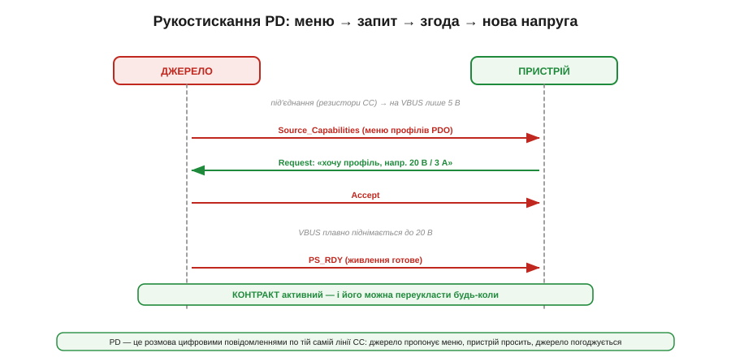
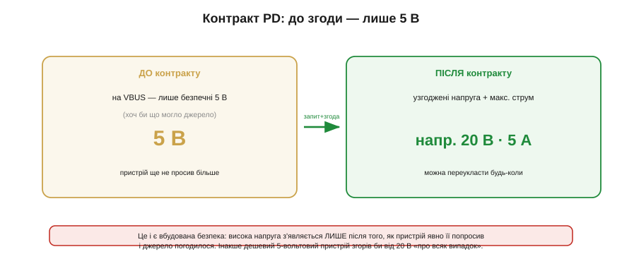
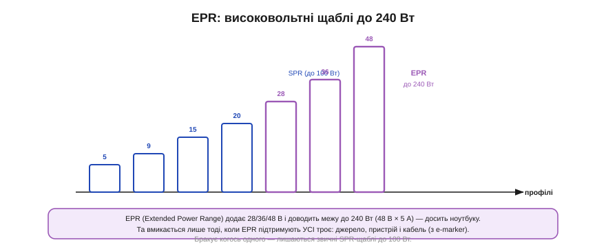
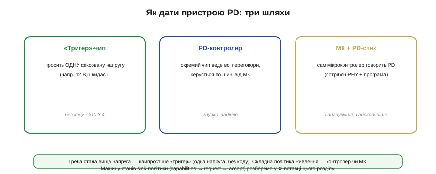

# USB Power Delivery: контракти, профілі, PPS

Резистори CC дають 5 вольтів і до 3 ампер — стелю в 15 ват. Коли цього замало (швидка зарядка телефона, живлення ноутбука), вступає **USB Power Delivery** (PD) — повноцінний **протокол** переговорів по тій самій лінії CC. Тут уже не статичні рівні, а справжня **розмова** цифровими повідомленнями: джерело пропонує меню напруг, пристрій вибирає й просить, джерело погоджується й піднімає VBUS. Розберімо цю розмову **якісно** — без бітів і пакетів, на рівні «хто кому що каже», бо саме ця логіка визначає, як спроєктувати пристрій, що бере з USB більше за базові 15 ват.

### Розмова замість резисторів: рукостискання

Серце PD — коротке **рукостискання** з кількох повідомлень, що йдуть по лінії CC одразу після під'єднання. І тут варто оцінити, як ощадливо влаштовано USB-C: та сама лінія **CC** робить **подвійну** роботу. Спершу на ній живуть статичні [резистори CC (Rp/Rd)](book:electronics/type-c-cc), що виявляють під'єднання й задають базовий струм; а далі, коли потрібні переговори, по тій самій лінії **поверх** цього йдуть цифрові пакети PD (закодовані спеціальним способом, щоб не заважати резисторам). Тобто не довелося додавати окремий дріт під протокол — стандарт «дописав» розмову на вже наявну сигнальну лінію. Тому навіть найскладніша PD-розмова не потребує жодного зайвого контакту в роз'ємі: усе вміщається на CC, яку ми вже знаємо.

*Рис. Після під'єднання (резистори CC) на VBUS — лише 5 В. Тоді джерело шле **Source_Capabilities** (меню профілів), пристрій відповідає **Request** («хочу профіль такий-то»), джерело каже **Accept**, плавно піднімає VBUS до запитаної напруги й завершує **PS_RDY** («готово»). Так укладається **контракт**, який можна переукласти будь-коли.*

Послідовність така. Спершу спрацьовують [резистори CC](book:electronics/type-c-cc): джерело бачить пристрій і подає безпечні **5 вольтів**. Далі джерело надсилає по CC повідомлення **Source_Capabilities** — своє «меню» того, що воно вміє дати. Пристрій вивчає меню й відповідає **Request** — просить конкретний профіль (скажімо, 20 В на 3 А). Джерело відповідає **Accept**, **плавно** піднімає напругу на VBUS до запитаної й завершує повідомленням **PS_RDY** — мовляв, нова напруга стоїть, бери. Від цієї миті діє **контракт** — узгоджена пара «напруга + максимальний струм». Уся ця розмова — це акуратне рукостискання: ніхто не подає високу напругу навмання, усе тільки за явною згодою обох.

Розмова до того ж **надійна за побудовою**. Кожне повідомлення PD підтверджується, а на кожен крок є **таймаут**: не дочекався відповіді — повтори, а зовсім не вийшло домовитися — тихо лишайся на 5 вольтах. Тому PD-пристрій і не-PD-зарядка чудово співіснують: якщо зарядка взагалі не вміє PD, вона просто не відповідає на Source_Capabilities, і пристрій без драми задовольняється базовими 5 В з [резисторів CC](book:electronics/type-c-cc). Жодного «зависання» чи небезпечного стану: протокол спроєктований так, що **відсутність** згоди завжди означає безпечний мінімум, а не хаос. Ця звичка «не домовився — впади в безпечне» проходить через увесь PD, і саме вона робить його придатним для масового вжитку, де поряд мільярди несумісних пристроїв.

### Меню джерела: профілі PDO

Ключове в цій розмові — те саме «меню», яке джерело пропонує. Кожен його рядок зветься **PDO** (*Power Data Object*) — один профіль живлення.

*Рис. Source_Capabilities — це список PDO: кожен каже одну напругу й до якого струму. Типово 5 В/3 А (обов'язковий, є завжди), 9 В/3 А, 15 В/3 А, 20 В/5 А (стеля SPR — 100 Вт). Окремий рядок APDO — це PPS (програмована напруга). Пристрій читає меню й вибирає ОДИН профіль під свою потребу.*

PDO — це просто рядок «така напруга, до такого струму». Джерело виставляє кілька: обов'язковий **5 В** (він є завжди — щоб усе хоч якось працювало), а далі — те, що вміє: 9, 15, 20 вольтів, кожен зі своїм лімітом струму. Пристрій читає це меню й **вибирає один** PDO, що найкраще лягає на його потребу: ноутбуку — 20 В, телефону — 9. Якщо точно потрібного профілю в меню нема, пристрій бере найближчий **нижчий** (краще менше, ніж згоріти) або лишається на 5 В. Тобто джерело не нав'язує напругу — воно **пропонує асортимент**, а вибирає завжди пристрій, бо лише він знає, що йому треба й що він витримає.

Важлива риса цієї моделі — переговори **веде пристрій** (sink), а не джерело. Джерело лише викладає вітрину; рішення «беру оце» завжди за тим, хто споживає. У своєму запиті пристрій каже не лише **який** профіль, а й скільки струму збирається брати (робочий струм у межах ліміту PDO), щоб джерело могло розподілити потужність — адже одна зарядка з кількома портами не безмежна. А ще меню **не висічене в камені**: якщо ситуація змінилася (інший порт зарядки забрав потужність, джерело перегрілося), воно може надіслати **нове** Source_Capabilities, і пристрій мусить перепогодити контракт під новий асортимент. Тому добрий sink не «домовився раз і забув», а готовий, що меню колись зміниться, і вміє ввічливо на це відреагувати.

### Фіксовані профілі проти PPS

Окрім звичайних фіксованих профілів є особливий, найрозумніший — **PPS** (*Programmable Power Supply*). Це не одна напруга, а цілий **діапазон**.

*Рис. Фіксовані профілі дають лише дискретні щаблі (5/9/15/20 В) — швидко, але грубо. PPS пропонує неперервний діапазон, який пристрій підкручує дрібним кроком (~20 мВ), плюс ліміт струму. Це ідеально, щоб заряджати батарею НАПРЯМУ: зарядка сама стає [CC/CV-джерелом](book:electronics/cc-cv-bms), і пристрою не треба великого перетворювача всередині.*

Фіксовані профілі — це грубі сходинки: дають рівно 9 чи 20 вольтів, і все. **PPS** натомість пропонує напругу **в діапазоні** (скажімо, 3.3–11 В) із дрібним кроком близько 20 мВ та керованим **лімітом струму**. Навіщо така точність? Заради **прямої зарядки батареї**. Літій заряджають за [профілем CC/CV](book:electronics/cc-cv-bms) — спершу сталим струмом, тоді сталою напругою. З PPS цим керує **сама зарядка**: пристрій просить у неї рівно ту напругу й струм, які потрібні батареї **просто зараз**, і зарядка їх видає. Тоді телефонові майже не треба власного потужного перетворювача — він з'єднує PPS-вихід майже напряму з батареєю, а всю роботу CC/CV робить зарядний блок. Менше тепла й втрат у тонкому телефоні, бо потужне перетворення винесене назовні. Це і є технічна суть «розумної швидкої зарядки».

Тонкість PPS у тому, що це режим **з обмеженням струму**: пристрій задає не лише напругу, а й стелю струму, і коли навантаження впирається в неї, джерело само **просідає** напругою, тримаючи струм, — тобто веде себе як справжнє CC/CV-джерело, а не просто «розетка на 9 В». Це й дозволяє перекласти зарядну логіку на блок живлення. Чому ж тоді не всі профілі — PPS? Бо фіксовані **простіші** й їх достатньо для більшості: ноутбуку байдуже до 20 мВ точності, йому потрібні стабільні 20 В, і фіксований профіль дає їх без зайвого клопоту. PPS — спеціалізований інструмент для прямої зарядки, а не заміна всьому; тому реальне джерело пропонує і кілька фіксованих, і (часто) один-два PPS-діапазони поряд.

### Контракт: до згоди — лише 5 В

Уся безпека PD тримається на одному простому правилі, яке варто закарбувати: **поки не укладено контракт, на VBUS лише 5 вольтів**.

*Рис. До контракту джерело тримає безпечні 5 В, хоч би що воно вміло дати. Лише після того, як пристрій явно попросив профіль і джерело погодилося, напруга піднімається до узгодженої (напр. 20 В × 5 А). Це й рятує: висока напруга з'являється тільки за згодою, інакше дешевий 5-вольтовий пристрій згорів би від 20 В.*

Джерело **ніколи** не подає 20 чи 48 вольтів «про всяк випадок». Спершу — завжди безпечні 5, і лише коли пристрій **явно** попросив вищий профіль, а джерело погодилося, напруга піднімається. Уявіть протилежне: ви втикаєте в потужну 100-ватну зарядку дешеву USB-лампочку, розраховану на 5 В, а та подає їй 20 — і лампочка згоряє за мить. Саме щоб цього не сталося, PD починає з 5 В і піднімає напругу **тільки за домовленістю** з тим, хто доведе, що її витримає. А ще контракт **не вічний**: пристрій може будь-коли переукласти його — попросити іншу напругу, коли змінилася потреба (батарея зарядилася, увімкнувся потужний режим). Тобто живлення по PD — це не «виставив і забув», а жива угода, яку сторони перепогоджують стільки разів, скільки треба.

А що, як **щось пішло не так** посеред контракту — збій, помилка зв'язку, дивна поведінка? На цей випадок PD має аварійний хід — **hard reset**: система рвучко скидає напругу назад до безпечних 5 В і починає переговори з нуля. Тобто будь-яка плутанина в розмові завжди має безпечний вихід — повернутися до того самого мінімуму, з якого все починалося. Це робить високовольтний PD не страшнішим за звичайні 5 В: у разі сумніву система не «застрягає» з 20 чи 48 вольтами на виході, а скидає їх. Така архітектура «при будь-якій біді — впади в безпечне» проходить через увесь стандарт і є головною причиною, чому йому довірили десятки ват у руках пересічного користувача.

### EPR: до 240 Вт

Класичний PD (його звуть **SPR** — Standard Power Range) сягає 100 ват (20 В × 5 А). Для ноутбуків цього інколи замало, тож новіша версія PD 3.1 додала **EPR** (*Extended Power Range*) — високовольтні щаблі.

*Рис. EPR додає профілі 28, 36 і 48 вольтів і доводить межу до 240 Вт (48 В × 5 А) — досить навіть потужному ноутбуку. Але вмикається лише тоді, коли EPR підтримують УСІ троє: джерело, пристрій і кабель (з e-marker). Бракує когось — лишаються звичні SPR-щаблі до 100 Вт.*

EPR піднімає напругу аж до **48 вольтів** і так доводить потужність до **240 ват** — рівня, на якому USB-C нарешті годує найненажерливіші ноутбуки (саме на цю межу орієнтуються й вимоги єдиного зарядного стандарту для ноутбуків). Та з вищою напругою зростають і вимоги до безпеки, тож EPR вмикається лише за збігу **трьох** умов: EPR має підтримувати **джерело**, **пристрій** і **кабель** (обов'язково з e-marker, бо 48 В на абикому дроті небезпечні). Бракує бодай однієї ланки — система чемно лишається на звичних SPR-профілях до 100 ват. Це знову та сама обережність PD: що вища напруга, то ретельніше система переконується, що **всі** учасники до неї готові.

Чому саме e-marker у кабелі тут **обов'язковий**, а не бажаний, як на 5 амперах? Бо 48 вольтів — це вже напруга, на якій ізоляція, контакти й розведення кабелю мають бути розраховані відповідно, а дешевий 5-вольтовий шнур до такого не призначений. Без чипа, що засвідчить «я витримаю EPR», система просто **не має права** ризикнути: вона не знає, що в кабелі. Тому EPR-кабель завжди «розумний» — він активно заявляє про свою спроможність, а не мовчить, як простий шнур. І ще нюанс: навіть на самих контактах роз'єму EPR вимагає трохи іншої перевірки перед підняттям напруги. Усе це — ціна за те, щоб 240 ват їхали тим самим тонким кабелем безпечно.

### Як дати пристрою PD

Нарешті — практика. Як зробити так, щоб **ваш** пристрій умів цю розмову?

*Рис. Три шляхи. «Тригер»-чип просить ОДНУ фіксовану напругу (напр. 12 В) і просто видає її — без жодного коду. PD-контролер — окремий чип, що веде всі переговори й керується по шині від МК. МК + PD-стек — мікроконтролер сам говорить PD (потрібні PHY і програма), найгнучкіше й найскладніше.*

Є три рівні складності. Найпростіший — **«тригер»** (*PD trigger*): мікросхема, що сама домовляється про **одну** наперед задану напругу (скажімо, 12 чи 20 В) і просто видає її на вихід, без жодного рядка коду з вашого боку. Для пристрою, якому треба стала вища напруга з USB-зарядки, це ідеал простоти, і саме на такому [sink-контролері-тригері](book:electronics/pd-sink-design) тримається більшість простих PD-пристроїв. Середній шлях — **PD-контролер**: окрема мікросхема веде всі переговори, а ваш мікроконтролер лише командує нею по шині (хочу те, дай це). Найскладніший і найгнучкіший — **МК із PD-стеком**: процесор сам говорить протокол PD, маючи відповідний інтерфейс (PHY) і програму. Вибір залежить від потреби: стала напруга — тригер; складна політика живлення (різні режими, перепогодження, роль джерела) — контролер чи МК.

Варто пам'ятати й те, що PD **двонапрямний**: ваш пристрій може бути не лише тим, хто бере, а й тим, хто **дає**. Власний павербанк, що заряджає телефон по USB-C, — це PD-**джерело**, і реалізують його тими ж засобами, лише з іншого боку розмови: пристрій виставляє меню профілів і відповідає на чужі запити. Для більшості ж проєктів роль скромніша — бути sink'ом, що ввічливо просить потрібну напругу. І тут діє те саме інженерне правило, що скрізь у розділі: **не ускладнюйте без потреби**. Якщо вам досить 5 В — [резистори CC](book:electronics/type-c-cc). Потрібна одна вища напруга — тригер. І лише коли логіка живлення справді складна, беріть контролер чи повний стек. Кожен зайвий рівень розуму — це ще щось, що може зламатися. А саму логіку sink-політики (як читати меню, що просити, як реагувати) зручно описати машиною станів — їй присвячено окрему ⚙️-вставку.

> ⚙️ **Машина станів у вставці.** Покрокова політика sink — capabilities → request → accept, із псевдокодом і реакцією на відмову — розібрана в алгоритмічній вставці про машину станів PD-sink.

### Підсумок теми

USB Power Delivery — це **цифрова розмова** по лінії CC, що піднімає живлення понад базові 15 ват. Рукостискання просте: джерело шле **меню профілів** (PDO), пристрій **вибирає й просить** один (Request), джерело **погоджується** (Accept) і піднімає VBUS (PS_RDY) — так укладається **контракт** «напруга + струм». Профілі бувають **фіксовані** (5/9/15/20 В — грубі сходинки) і **PPS** (програмований діапазон дрібним кроком — ідеал для прямої [CC/CV-зарядки батареї](book:electronics/cc-cv-bms)). Уся безпека тримається на правилі «**до контракту — лише 5 В**»: висока напруга з'являється тільки за явною згодою того, хто її витримає, а контракт можна переукладати будь-коли. **EPR** додає 28/36/48 В і 240 ват — але лише коли готові всі троє (джерело, пристрій, кабель). А реалізують PD трьома шляхами: «тригер» на одну напругу (без коду), PD-контролер чи МК зі стеком — і не ускладнюють без потреби, бо кожен зайвий рівень розуму додає того, що може зламатися. Уся розмова до того ж тулиться на ту саму лінію CC і за будь-якого збою падає в безпечні 5 В. Найпростіше втілення цієї розмови в залізі — [sink-контролер](book:electronics/pd-sink-design), що домовляється про потрібну напругу майже без участі процесора.
