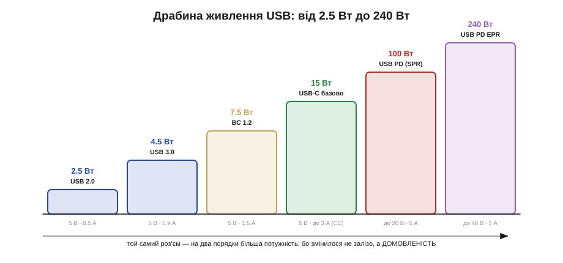
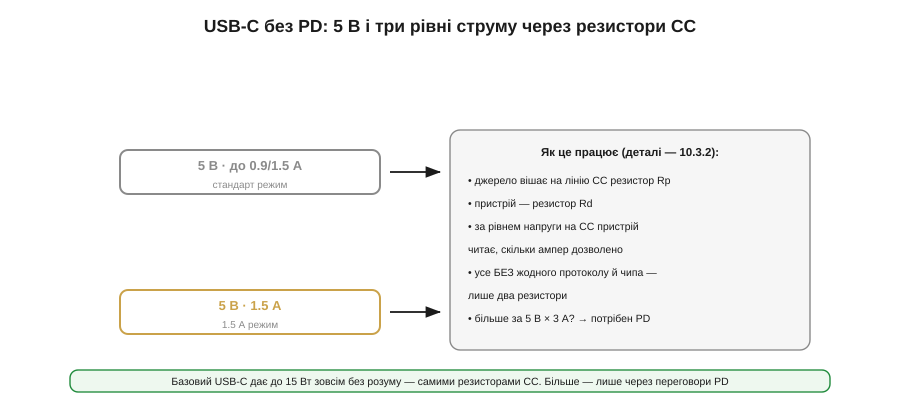
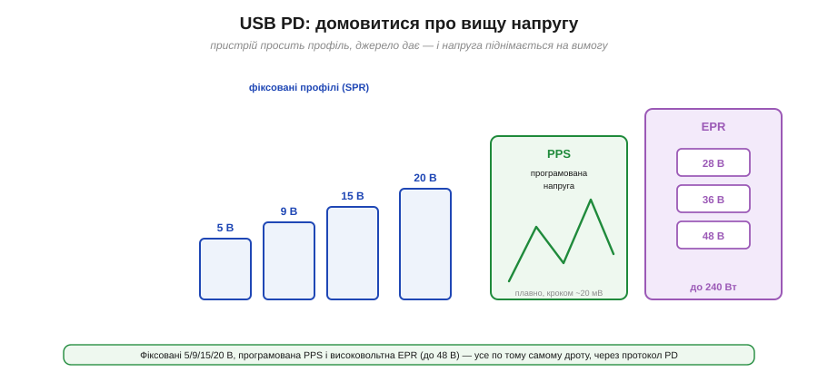

# Від 500 мА до 240 Вт: карта живлення через USB

USB давно знайомий як шина даних, що [заодно несе живлення](book:programming/usb-power) — звідти беруться 5 вольтів для пристрою. Та за останнє десятиліття USB з кволого «джерела для мишки» перетворився на серйозний інтерфейс живлення, здатний нагодувати ноутбук. І найдивовижніше: роз'єм фізично майже не змінився, а потужність зросла **на два порядки** — з 2.5 до 240 ват. Як? Бо змінилося не так залізо, як **домовленості** про те, скільки можна взяти. Ця тема — карта тих домовленостей: драбина потужності, покоління роз'ємів і три різні способи спитати джерело «скільки даси?».

Тут варто одразу перелаштувати мислення. Звична розетка чи батарея — **тупе** джерело: на ній завжди стоїть напруга, бери скільки хочеш (до межі). USB — інше: це **домовлене** джерело, де напруга й дозволений струм залежать від **розмови** між пристроєм і портом. Сам по собі USB-порт обережний — він тримає лише безпечні 5 вольтів і малий струм, доки пристрій не доведе, що має право на більше. Тому проєктувати живлення з USB означає не просто «під'єднати 5 В», а навчити пристрій вести цю розмову: спершу запитати, тоді взяти. Ця тема дає загальну карту цієї мови — драбину, роз'єми й способи запиту, — щоб конкретні механізми (резистори, контракти, профілі) лягали в зрозумілий каркас.

### Драбина потужності: від 2.5 до 240 Вт

Почнімо з масштабу. Живлення через USB пройшло цілу драбину, і кожен її щабель — це нова межа струму чи напруги.

*Рис. Той самий роз'єм — на два порядки більша потужність. USB 2.0 давав 2.5 Вт (5 В × 0.5 А), USB 3.0 — 4.5 Вт, Battery Charging — 7.5 Вт, базовий USB-C — 15 Вт, USB PD — 100 Вт, а новітній PD EPR — аж 240 Вт. Зросло не залізо, а домовленість про те, скільки можна взяти.*

Найнижчий щабель — **USB 2.0**: 5 вольтів і всього 500 міліампер, тобто **2.5 Вт**. Цього вистачало на мишку чи флешку, заради яких живлення й додали до шини даних. **USB 3.0** підняв ліміт до 900 мА (**4.5 Вт**). Спеціальна угода **Battery Charging** дозволила брати до 1.5 А (**7.5 Вт**) — уже щось для телефона. Далі прийшов **USB-C**, який і без жодного протоколу дає 5 В × до 3 А = **15 Вт**. А вже **USB Power Delivery** (PD) зніс стелю: спершу до 100 Вт (20 В × 5 А), а в новітній версії з розширеним діапазоном (EPR) — до **240 Вт** (48 В × 5 А), чого досить навіть потужному ноутбуку.

Ключове спостереження: уся ця драбина живе на **тому самому** фізичному кабелі. Між 2.5 і 240 ватами немає нового заліза — є дедалі розумніша **розмова** між пристроєм і джерелом про напругу й струм. Опанувати USB-живлення означає опанувати саме цю розмову.

Чому ж потужність нарощують переважно **напругою**, а не струмом? Бо струм у тонкому кабелі впирається в тепло. [Дріт гріється](book:physics/joule-heating) як I²·R, і подвоївши струм, учетверо збільшуєш втрати на ньому. Тонкий USB-кабель фізично не протягне 48 А — він би розплавився. А от **підняти напругу** дешево: щоб віддати 240 Вт, на 5 вольтах потрібні немислимі 48 А, а на 48 вольтах — лише 5 А, цілком підйомні для дроту. Тому вся драбина PD — це насамперед драбина **напруг**: більше ват беруть вищими вольтами при помірному струмі. Це та сама логіка, що гнала високовольтні лінії електропередач, тільки в мініатюрі роз'єму.

### Покоління роз'ємів і їхні межі

Перш ніж говорити про домовленості, варто впізнавати самі роз'єми — бо їхнє покоління одразу каже, на що здатне живлення.

*Рис. Type-A — класичний хост-роз'єм (ПК, зарядки), до 0.9 А. Type-B — для великих пристроїв. Mini- і micro-USB — телефони й камери 2000-х, до 1.5 А і вже застарілі. Type-C — сучасний реверсивний роз'єм, що тримає до 5 А й несе всі нові домовленості (CC, PD). Усі, крім Type-C, однобічні й обмежені за струмом.*

**Type-A** — той самий прямокутний штекер, що десятиліттями стирчав із ПК; він і досі живе як **хост**-роз'єм і як вихід зарядних блоків, але обмежений струмом і однобічний. **Type-B** (та його mini- й micro-варіанти) ішов на «пристрій» — принтери, телефони, камери; **micro-USB** був тим самим спільним зарядним 2009-го й доживає в дешевій техніці. А **Type-C** — сучасний роз'єм, що змінив усе: він **реверсивний** (втикається будь-яким боком), компактний, тримає до **5 А** і, головне, несе всередині лінії для нових домовленостей (CC, PD). Тому практичне правило: побачили Type-C — можливі і високий струм, і PD; побачили micro чи A — живлення скромне й за старими правилами.

Та роз'єм — лише половина історії: важить і сам **кабель**. Не кожен USB-C-шнур однаковий. Дешевий кабель розрахований на 3 А, і протягти крізь нього повні 5 А (100 Вт і вище) не можна — він перегріється. Тому кабелі на великий струм містять усередині крихітний чип — **e-marker**, що «доповідає» джерелу, скільки ампер витримує. Без нього система свідомо обмежить струм безпечним рівнем. Звідси буденна загадка «чому з цим кабелем заряджає повільно»: часто винен не пристрій і не зарядка, а кабель, що не вміє заявити про свою спроможність. Тонкощі того, [що саме сидить у кабелі](book:electronics/usb-cables-field), — окрема розмова; головне тут, що повну потужність несуть лише **відповідні** кабелі.

### USB-C без розуму: 5 В і резистори CC

Найприємніше в USB-C те, що базове живлення він дає **зовсім без протоколу** — самими резисторами. Це той випадок, коли «розумний» роз'єм працює тупо й надійно.

*Рис. Без жодного PD джерело вішає на лінію CC резистор Rp, пристрій — резистор Rd, і за напругою на CC пристрій читає, скільки ампер дозволено: стандартні ~0.9/1.5 А, або 1.5 А, або 3 А (15 Вт). Ніякого чипа й протоколу — лише два резистори. Більше за 15 Вт? Тоді потрібен PD.*

Працює це так. На роз'ємі Type-C є спеціальна лінія — **CC** (*Configuration Channel*). Джерело вішає на неї резистор **Rp**, пристрій — резистор **Rd**, і за рівнем напруги, що утворюється на їхньому дільнику, пристрій **зчитує**, скільки струму джерело готове дати: стандартний рівень, 1.5 А чи повні 3 А (тобто до **15 Вт** при 5 В). Жодного протоколу, жодного чипа — лише два резистори й трохи напруги. [Цей механізм резисторів CC](book:electronics/type-c-cc) має свою детальну механіку; тут досить запам'ятати, що базовий USB-C дає до 15 ват майже задарма, і для багатьох простих пристроїв цього цілком вистачає.

У цій простоті — справжня інженерна елегантність, і варто оцінити її логіку. Резистори CC роблять три речі задарма: визначають, що пристрій узагалі **під'єднано** (без них джерело тримає VBUS вимкненим — безпека), задають **орієнтацію** (який із двох симетричних боків устромлено), і кажуть **дозволений струм**. Усе це — пасивно, без живлення й коду, тому працює навіть у найдешевшому пристрої й навіть до того, як його процесор прокинувся. І ще тонкість безпеки: поки пристрій не прочитав CC, він **не має права** припускати більше за стандартні 5 В і малий струм — інакше перевантажить слабке джерело. Тверезий USB-C-пристрій спершу читає резистори, а вже тоді бере струм.

### USB Power Delivery: домовитися про більше

А коли 15 ват замало — телефон хоче швидкої зарядки, ноутбук просить 60 чи 100 Вт — вступає в дію **USB Power Delivery** (PD): повноцінний **протокол** переговорів по тій самій лінії CC.

*Рис. PD дає не лише 5 В: пристрій просить профіль, і джерело піднімає напругу. Фіксовані щаблі — 5/9/15/20 В (SPR, до 100 Вт). PPS — програмована напруга, що плавно міняється кроком ~20 мВ. EPR — високовольтні 28/36/48 В аж до 240 Вт. Усе по тому самому дроту, через цифрові повідомлення.*

Замість тупих резисторів PD веде справжню **розмову**: пристрій питає, які профілі живлення джерело пропонує, і просить потрібний. Профілі бувають **фіксовані** — 5, 9, 15, 20 вольтів (це класичний діапазон SPR, до 100 Вт при 20 В × 5 А). Є **PPS** (*Programmable Power Supply*) — режим, де напругу можна плавно підкручувати дрібним кроком (~20 мВ), що дуже зручно для розумної зарядки батареї прямо. А найновіший **EPR** (*Extended Power Range*) додає високовольтні щаблі — 28, 36, 48 вольтів — і доводить межу до **240 Вт**. Усе це — цифрові повідомлення по лінії CC, [сам протокол переговорів](book:electronics/usb-pd) має власний детальний устрій. Тут головне: PD — це спосіб **підняти напругу** на вимогу, бо віддати 100 ват на 5 вольтах означало б 20 ампер і розплавлений кабель, а на 20 вольтах — лише 5 ампер.

Тут критична деталь безпеки, на яку спирається весь PD: **до укладення контракту на лінії VBUS завжди лише 5 вольтів**. Джерело не подає 20 чи 48 В «про всяк випадок» — воно чекає, поки пристрій явно попросить, і лише тоді піднімає напругу. Інакше встромлений у потужну зарядку дешевий пристрій, розрахований на 5 В, миттєво згорів би від 20. Тому PD — це не просто «дай більше», а ретельний рукостискання з підстраховкою: спершу безпечні 5 В, тоді переговори, і тільки за згодою — висока напруга. [PD домовляється](book:electronics/usb-pd) навіть про те, **хто кого живить** (адже з USB-C і ноутбук, і телефон можуть бути джерелом) — але це вже тонкощі самого протоколу.

### Один роз'єм, різні ролі: живлення окремо від даних

Чому ж той самий роз'єм возить і 5 міліампер мишки, і 240 ват ноутбука, і відео на монітор — і нічого не плутається? Бо в USB-C **живлення й дані розв'язані**.

*Рис. У роз'ємі Type-C різні лінії роблять різне: CC1/CC2 ведуть переговори про живлення (резистори, PD); VBUS/GND несуть саму потужність (5–48 В); D+/D− — дані USB 2.0; швидкі пари TX/RX — високошвидкісні дані й відео. Живлення домовляється окремо від даних, тому вони не заважають одне одному.*

Це принципова ідея. Переговори про живлення йдуть по **окремій** лінії CC, сама потужність — по VBUS, а дані — по своїх лініях (D+/D− для USB 2.0, швидкі пари TX/RX для USB 3.x і відео). Тому пристрій може домовлятися про 100 ват, не чіпаючи передачу даних, а проста зарядка взагалі не використовує лінії даних. Один роз'єм грає багато ролей одночасно, бо кожна роль сидить на своїх контактах. Саме ця розв'язка й зробила USB-C універсальним: він не «зарядка з даними» чи «дані з зарядкою», а набір незалежних каналів в одному штекері.

Розв'язка сягає ще далі: по тих самих швидких парах USB-C уміє пускати **взагалі не USB**-протоколи — це звуть **альтернативними режимами** (*alt-mode*). Так по USB-C ходить **DisplayPort** (тому з одного роз'єму йде відео на монітор) чи **Thunderbolt**. Роз'єм наче «здає в оренду» свої високошвидкісні лінії іншому стандарту, домовившись про це по тій самій CC. Для нас, людей живлення, це нагадування: USB-C — не один протокол, а **контейнер** для багатьох, де живлення (наша тема) — лише одна зі співмешканок. Тому, проєктуючи живлення з USB-C, тримаються своєї смуги (CC, VBUS) і не плутають її з даними чи відео, що ділять той самий штекер.

### «Скільки можу взяти?»: карта рішення

Зведімо все в одне практичне питання, яке ставить будь-який пристрій, увіткнутий у USB: **скільки струму я можу безпечно взяти?** Бо взяти наосліп не можна — або недобереш (заряджатимешся годинами), або перевантажиш джерело (воно вимкнеться чи згорить).

*Рис. Три способи спитати джерело. Старий порт (A чи micro) — за угодою BC1.2 пристрій визначає тип порту по лініях даних (до 1.5 А). Type-C без PD — читає резистори CC (5 В, 1.5/3 А). Type-C із PD — веде переговори (9/15/20/48 В, до 240 Вт). Тут — лише карта, куди дивитись.*

Відповідь залежить від того, **який** порт. Якщо це старий **Type-A чи micro-USB**, пристрій користується угодою [**BC1.2**](book:electronics/legacy-charging): за тим, як з'єднані лінії даних D+/D−, він визначає тип порту (звичайний, зарядний, і скільки той дає — до 1.5 А). Якщо це **Type-C без PD**, пристрій читає [**резистори CC**](book:electronics/type-c-cc) і дізнається дозволений струм при 5 В. А якщо це **Type-C із PD**, пристрій [**домовляється** протоколом](book:electronics/usb-pd) і може підняти напругу аж до 48 В. Три порти — три різні способи спитати. Ця ж тема — лише карта, що показує, куди дивитися й чого очікувати.

Чому це не дрібниця? Бо ціна помилки реальна з обох боків. Візьмеш **більше**, ніж порт дозволяє, — слабке джерело просяде, піде в захист чи вимкнеться, і пристрій узагалі не запуститься (а в гіршому разі щось перегріється). Візьмеш **менше** — зарядка повзтиме годинами, хоч поруч стоїть потужна зарядка, готова дати вп'ятеро більше. Тому «розумна» зарядка — це не маркетинг, а необхідність: пристрій мусить спершу **дізнатися** межі, а вже тоді брати. На практиці цю розмову рідко пишуть руками: за неї відповідає окремий **контролер CC/PD** — спеціалізований чип (або блок усередині МК), що веде переговори й каже перетворювачу, на яку напругу налаштуватися. Як [спроєктувати такий пристрій-споживач](book:electronics/pd-sink-design) на готовому контролері — окрема практична тема. Головне ж тут — звичка: перш ніж брати струм із USB, спитай, скільки можна.

### Підсумок теми

USB-живлення — це драбина від 2.5 до 240 ват **на тому самому роз'ємі**, бо зростала не апаратура, а **домовленість** про напругу й струм. Покоління роз'ємів одразу підказують межі: Type-A й micro — скромне живлення за старими правилами, Type-C — до 5 А і всі нові механізми. Базовий USB-C дає до 15 Вт **самими резисторами CC**, без протоколу; коли треба більше, вступає **PD** — протокол, що піднімає напругу до фіксованих 5/9/15/20 В, програмованої PPS чи високовольтної EPR (до 240 Вт). А працює це все тому, що в USB-C **живлення розв'язане з даними**: переговори по CC, потужність по VBUS, дані окремо. Звідси й головне практичне питання пристрою — «скільки можу взяти?» — на яке є три відповіді залежно від порту: [BC1.2](book:electronics/legacy-charging) (старі), [резистори CC](book:electronics/type-c-cc) (Type-C базово) і [PD](book:electronics/usb-pd) (Type-C повноцінно). Кожен із цих механізмів задає роль і дозволений струм по-своєму — від двох пасивних резисторів до повноцінного цифрового рукостискання.

---
