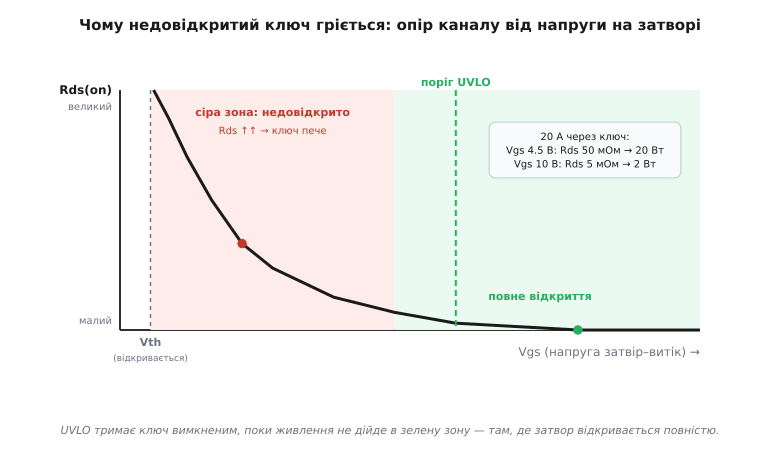
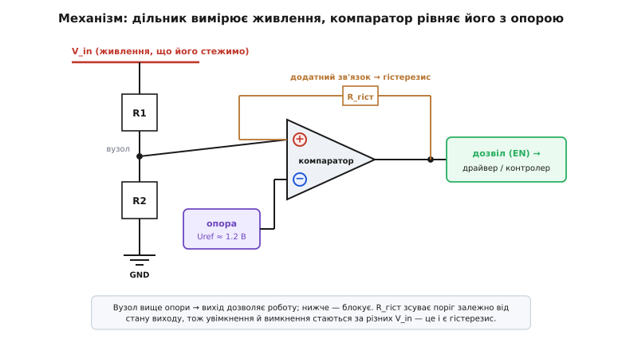
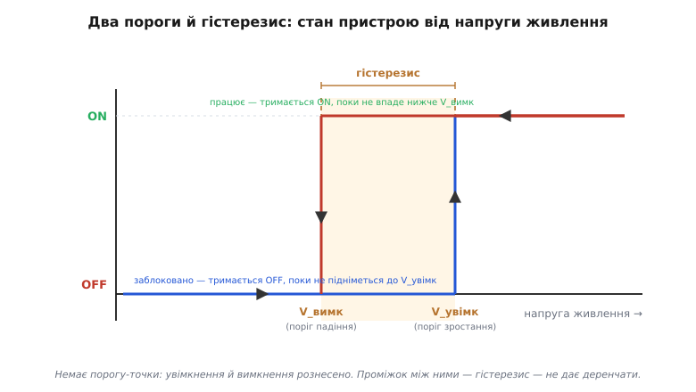

# Блокування за низькою напругою (UVLO)

<preknowlist>
- [Компаратор](book:electronics/comparator) — рівняє дві напруги й каже, яка з них більша; це серце UVLO.
- [Тригер Шмітта](book:electronics/schmitt-trigger) — два пороги замість одного й гістерезис між ними, щоб не деренчати біля межі.
- [Опорна напруга](book:electronics/voltage-reference) — стабільна «мірка вольта», з якою порівнюють живлення.
- [Силовий ключ](book:electronics/mosfet-power-switch) — Rds(on) і те, що недовідкритий MOSFET має великий опір і сильно гріється.
</preknowlist>

Живлення ніколи не стрибає з нуля до номіналу вмить. При ввімкненні воно **наростає** — конденсатори заряджаються, регулятор виходить на режим; при просіданні від сплеску навантаження воно **падає** й повертається. Тож у житті будь-якого пристрою є не два стани («вимкнено» і «працює»), а три: між ними лежить зона, де живлення **вже є, але замало**. Здорова інтуїція підказує: мала напруга — це мало енергії, отже безпечно. Насправді все навпаки — саме ця середня зона змушує схеми чинити найнебезпечніше. Блокування за низькою напругою (англ. undervoltage lockout — блокування за зниженої напруги) — це сторож, який тримає пристрій **твердо вимкненим**, поки живлення не підніметься до впевнено робочого рівня, і вимикає його знову, щойно напруга сповзає назад у небезпечну зону.

### Чому «недодано» гірше, ніж «нуль»

Найгостріше це видно на драйвері затвора. Його робота — **повністю** відкрити силовий MOSFET, і слово «повністю» тут вирішальне. Канал MOSFET доходить до свого малого опору Rds(on) лише коли напруга затвір–витік Vgs добре перевищує поріг: у типового силового ключа поріг Vgs(th) — 2–4 В, а повна провідність настає аж при 8–10 В. На половині цього затвор ледь прочинений — опір каналу в десятки й сотні разів більший за паспортний.


*Опір каналу від напруги на затворі. Праворуч, у зеленій зоні повного відкриття, Rds малий і ключ холодний. Ліворуч, у «сірій зоні» між порогом Vth і повним відкриттям, опір злітає — і той самий струм розсіює в десятки разів більше тепла. UVLO не дозволяє драйверу вмикати ключ, поки живлення не дійде в зелену зону.*

Тепер уявімо, що драйвер живиться від просілої шини й може підняти затвор лише до 4.5 В. Силовий ключ не вимкнений — він **недовідкритий**, і крізь нього тече повний струм навантаження на великому опорі. Потужність втрат — це струм у квадраті на опір, тож різниця між повним і частковим відкриттям катастрофічна:

```
повне відкриття:   Rds = 5 мОм,  I = 20 А
  P = I²·Rds = 20²·0.005 =   2 Вт      ← ключ ледь теплий

недовідкрито:      Rds = 50 мОм, I = 20 А
  P = I²·Rds = 20²·0.05  =  20 Вт      ← у 10 разів більше, ключ пече
```

А біля самого порога, де Rds — уже цілі оми, ті ж 20 А дали б **сотні ват** у крихітному кристалі — це секунди до теплового пробою. Ось чому «недодати» живлення драйверу гірше, ніж не дати зовсім: при нулі ключ чесно закритий і холодний, а в сірій зоні він відкритий рівно настільки, щоб убити себе власними втратами. Тому [драйвер затвора](book:electronics/gate-driver) не має права вмикати ключ, доки власне живлення не підніметься досить, щоб видати повний привід на затвор. Саме це й робить UVLO — тримає вихід закритим, поки Vdrive не дійде в безпечну зону.

> 🔧 **Навіщо це.** Обираючи поріг UVLO для драйвера, дивіться не на «мінімум, при якому мікросхема оживає», а на **Vgs повного відкриття вашого силового ключа**. Поріг мусить стояти вище — щоб у момент, коли драйвер уже дозволено вмикати, затвору гарантовано вистачало напруги на малий Rds(on). Драйвер під [logic-level MOSFET](book:electronics/logic-level-mosfet) (повне відкриття при ~4.5 В) і драйвер під звичайний ключ (10 В) потребують різних порогів UVLO — переплутаєте, і ключ грітиметься на старті.

Та сама пастка чигає не лише на драйвери. [Імпульсний перетворювач](book:electronics/switching-converter) при заниженому вході збивається з такту й хибно керує ключами, а [підвищувальний (boost)](book:electronics/boost) поводиться ще підступніше: він тримає вихідну потужність, тож при малому вході змушений тягнути **великий** вхідний струм (потужність зберігається: менша напруга — більший струм) — аж до перевантаження дроселя й ключа. Цифрова логіка й мікроконтролер при заниженій VDD читають сміття замість даних — це історія [brown-out](book:programming/brownout), і рятує від неї той самий принцип. А літієва комірка, розряджена нижче свого дна (близько 2.5–3.0 В), деградує **незворотно**, тож [захист батареї](book:electronics/battery-protection) вмикає своє UVLO — відрубує навантаження, коли напруга комірки падає надто низько. Скрізь причина одна: у зоні заниженого живлення пристрій робить те, чого не передбачав ніхто, і UVLO просто не пускає його туди.

### Як це влаштовано: порівняти з міркою

Зведімо задачу до суті. Усе, що треба знати сторожу, — одне: «чи достатньо високе живлення?» А це питання про **порівняння**. Отже, і схема мінімальна: [компаратор](book:electronics/comparator) рівняє живлення (точніше, його частку з дільника) зі сталою [опорною напругою](book:electronics/voltage-reference), і вихід каже «вище» або «нижче».


*Механізм у трьох деталях. Дільник R1/R2 знімає частку напруги живлення на вузол; компаратор рівняє цей вузол з опорою Uref (типово близько 1.2 В від вбудованого джерела); вихід дозволяє чи блокує роботу. Резистор R_гіст заводить трохи виходу назад на вхід — цей додатний зв'язок і створює гістерезис.*

Опору беруть від стабільного джерела — найчастіше це bandgap близько 1.2 В, який майже не пливе від температури; сама його природа розібрана в [опорній напрузі](book:electronics/voltage-reference). Дільник із двох резисторів переводить високу шину до масштабу опори. Поки вузол дільника вище за Uref, вихід дозволяє роботу; щойно нижче — блокує. Просто. Але рівно тут ховається пастка, через яку наївна схема з одним порогом не працює.

### Гістерезис: чому порогів мусить бути два

Уявімо на мить UVLO з єдиним порогом — однією точкою, де все перемикається. Біля цієї точки схема почне **деренчати**, і з двох причин. Перша дрібніша: живлення завжди має пульсацію й шум, тож напруга сновигатиме туди-сюди через поріг, клацаючи виходом. Друга — фатальна. У мить, коли UVLO дозволяє пристрою ввімкнутися, пристрій починає **споживати струм**. А будь-яке реальне джерело має внутрішній опір, тож ривок струму просаджує напругу — і вона падає назад нижче порога. UVLO чесно вимикає пристрій; споживання зникає; напруга відновлюється; UVLO знову вмикає — і так по колу, кілька разів на мілісекунду. Пристрій «завівся-заглух-завівся», як застуджений мотор, і цей цикл б'є струмовими сплесками по всьому, що поруч.

Ліки — рознести ввімкнення й вимкнення на **два різні пороги**. Поріг зростання (коли вмикаємось) ставлять вище за поріг падіння (коли вимикаємось). Проміжок між ними — гістерезис (гр. hystéresis — відставання, запізнення).


*Стан пристрою від напруги живлення. Коли напруга **росте**, пристрій тримається вимкненим аж до верхнього порога V_увімк — і лише там вмикається. Коли напруга **падає**, він тримається ввімкненим аж до нижнього порога V_вимк. Через це немає єдиної точки клацання: увімкнення й вимкнення стаються за різних напруг, а проміжок між ними — гістерезис — поглинає і пульсацію, і просідання від пуску.*

Тепер послідовність подій інша. Живлення наростає, доходить до V_увімк — пристрій вмикається й тягне струм. Напруга просідає від ривка, **але** гістерезис зробив нижній поріг V_вимк помітно нижчим, тож просідання його не досягає — пристрій лишається ввімкненим. Деренчання нема. Пристрій вимкнеться, лише якщо живлення впаде по-справжньому — аж нижче V_вимк. По суті UVLO — це [тригер Шмітта](book:electronics/schmitt-trigger), приставлений до шини живлення; уся математика двох порогів там та сама. Головне правило проєктування звідси одне: **гістерезис має бути ширшим за просідання від пуску плюс запас на пульсацію**.

**Скільки саме гістерезису.** Візьмімо джерело з внутрішнім опором (разом із проводкою) 0.5 Ом, а пристрій на старті додає стрибок струму 1 А. Просідання й потрібний гістерезис рахуються прямо:

```
просідання від пуску:
  ΔV = ΔI · R_дж = 1 · 0.5        = 0.5 В
запас на пульсацію живлення      ≈ 0.2 В
потрібен гістерезис > 0.5 + 0.2  = 0.7 В  → беремо 1.0 В

пороги:  V_увімк = 8.5 В,  V_вимк = 7.5 В
```

Тепер пуск не збиває сам себе: навіть повне просідання на 0.5 В від 8.5 В дає 8.0 В — вище за поріг вимкнення 7.5 В. Якби гістерезис був лише 0.2 В (V_вимк = 8.3 В), той самий пуск провалив би напругу нижче нього — і пристрій замотиляв би.

> 🔧 **Навіщо це.** Замало гістерезису — і пристрій «мотиляє» (англ. motorboating: заводиться-глухне, як човновий мотор) при старті в слабке джерело; занадто багато — і пристрій не вимкнеться, коли живлення вже небезпечно просіло, бо чекає падіння аж до дуже низького V_вимк. Ширину гістерезису рахують від реального просідання пуску на реальному опорі джерела, а не «на око».

### Як задати поріг: програмований UVLO

У більшості контролерів і драйверів поріг не зашитий намертво — його виставляють зовнішнім дільником на вивід дозволу (EN). Усередині сидить фіксована опора (скажімо, 1.2 В), і ви добираєте дільник так, щоб потрібна вхідна напруга дала на вузлі рівно цю опору. Поріг зростання виходить з простого співвідношення дільника:

```
V_увімк = Uref · (1 + R1/R2)
```

Припустімо, треба ввімкнення при 8.5 В, опора Uref = 1.2 В:

```
1 + R1/R2 = V_увімк / Uref = 8.5 / 1.2   = 7.08
R1/R2     = 6.08
беремо R2 = 10 кОм  →  R1 ≈ 61 кОм  (→ ≈ 8.5 В)
```

Нижній поріг (гістерезис) мікросхема робить сама — або внутрішнім струмом гістерезису, що втікає у вузол дільника й зсуває поріг, коли вихід уже ввімкнено, або зовнішнім резистором зворотного зв'язку. Повне виведення обох порогів через дільник, як внутрішній струм гістерезису задає V_вимк і як порахувати обидва резистори під задану пару порогів, — в окремій вставці [математика порогів UVLO](book:electronics/uvlo/math-uvlo-thresholds.md).

> 🔧 **Навіщо це.** Програмований UVLO — це ще й спосіб **упорядкувати** ввімкнення кількох живлень: виставивши різні пороги EN, ви змушуєте одні шини стартувати лише після інших. І це фільтр проти кволого джерела: якщо блок живлення не дотягує до V_увімк під навантаженням, пристрій просто не стартує — краще чесно не ввімкнутись, ніж напівввімкнутись і згоріти.

### Де ви це зустрінете й чого стерегтися

UVLO живе майже в кожній силовій мікросхемі, лише під різними іменами. У драйверах затвора воно вартує Vdrive; окремо стежте, щоб просідання бутстрепного живлення верхнього ключа не занурювало його під UVLO при великій шпаруватості (ця пастка розібрана в [драйвері затвора](book:electronics/gate-driver)). У контролерах перетворювачів UVLO на виводі EN відсіює слабкий вхід і задає черговість шин. У [лінійному регуляторі (LDO)](book:electronics/ldo) воно переплітається з поведінкою при малій різниці вхід-вихід. У [захисті батареї](book:electronics/battery-protection) і [системі керування батареєю (BMS)](book:electronics/bms) відсічка за низькою напругою береже комірки від глибокого розряду. А в мікроконтролері ту саму роль грає вбудований детектор просідання, що тримає чіп у скиданні, — сторона [brown-out](book:programming/brownout).

Кілька пасток, які варто тримати в голові:

**UVLO — не те саме, що скидання логіки.** Один принцип (не працювати на заниженому живленні) живе у двох різних домах. UVLO **вимикає силовий чи аналоговий вузол** — драйвер, перетворювач, вихід. Детектор brown-out **тримає цифровий чіп у скиданні**, щоб той не виконував код на ненадійній напрузі. Не чекайте, що одне зробить роботу іншого: UVLO драйвера не врятує ваш мікроконтролер, а brown-out контролера не завадить силовому ключу недовідкритися.

**Що робити після спрацювання — засувка чи повтор.** Коли UVLO вимкнуло пристрій, далі можливі дві поведінки: **автоповтор** (щойно напруга підніметься вище V_увімк, пристрій сам стартує знову) або **засувка** (пристрій лишається вимкненим, доки живлення не зняли й не подали наново). Автоповтор зручний для звичайних просідань, засувка безпечніша там, де повторний старт у несправність небажаний. Тонкощі цього вибору — тема детальнішого розбору.

**Вихід із UVLO мусить будити м'який старт, а не рвати навантаження.** Коли живлення нарешті дійшло до V_увімк, вмикати повну потужність ривком — значить самому створити той кидок струму, що просадить шину. Тому зняття UVLO зазвичай запускає [м'який старт](book:electronics/soft-start-circuits): потужність наростає плавно, а не стрибком.

**Дискретному UVLO треба працювати, поки його власне живлення ще росте.** Якщо ви будуєте UVLO на окремому компараторі, згадайте: у мить старту він сам живиться від тієї ж напруги, що ще не піднялась. Схему й опору треба вибрати так, щоб вона давала коректний «блокувати» вже при дуже малих вольтах, — інакше вузол-сторож сам засне саме тоді, коли потрібен найбільше.

Народилася сама ідея сторожа проти заниженої напруги не одразу: спершу інженери місяцями ловили загадкові збої мікропроцесорів на просілих шинах, тоді з'явилися окремі мікросхеми-супервізори (трипінові «сторожі скидання»), і вже потім блокування за низькою напругою вмонтували в кожен перетворювач і драйвер. Звідки взявся сам термін «brown-out» і як оборона від заниженої напруги стала окремим класом деталей — у вставці [народження недонапругової оборони](book:electronics/uvlo/hist-undervoltage-supervision.md).

> 🔧 **Навіщо це.** UVLO — дешева страховка від найдорожчих відмов: згорілого силового ключа, зіпсованої батареї, зависання на просілій шині. Проєктуючи будь-що з живленням, що наростає й може просідати, поставте собі три питання: який поріг **увімкнення** гарантує коректну роботу вузла (для драйвера — повне відкриття затвора); чи ширший **гістерезис** за просідання від пуску; і що має статися **після** спрацювання — плавний повторний старт чи безпечна засувка. Відповіді на них відрізняють пристрій, що чесно чекає доброго живлення, від того, що вбиває себе в сірій зоні.
