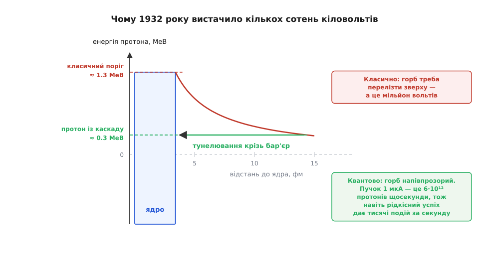

# 📜 Каскад Кокрофта–Волтона: драбина, зібрана, щоб розколоти ядро

Стовпчик діодів і конденсаторів звуть каскадом Кокрофта–Волтона, хоч ці двоє його не вигадували: схема була відома щонайменше за тринадцять років до них. Ім'я на ній стоїть за інше — за 14 квітня 1932 року, коли зібраний із такої драбини блок живлення розігнав протони й уперше в історії людська машина розбила атомне ядро. Далі — чому фізикам знадобилася саме драбина, чому трансформатор тут програвав не за ціною, а принципово, і чиє ім'я схема носить у німецькомовних книжках.

## Мільйон вольтів, якого ні в кого не було

1919 року Резерфорд уперше перетворив один елемент на інший: альфа-частки радію, влучаючи в ядра азоту, вибивали з них протони. Перемога була велика, знаряддя — жалюгідне. Радій світить сам собі: потік слабкий, летить на всі боки, а енергію частинок не покрутиш ручкою — вона така, яку дає розпад. Кавендішу потрібен був кран, який відкриваєш, а не ампула, біля якої сидиш і чекаєш.

Питання було в тому, скільки такий кран коштує у вольтах. Ядро заряджене позитивно, протон теж, і поки вони зближаються, [кулонівське відштовхування](book:physics/coulomb-law) росте як 1/r. Щоб протон таки дістався до ядра літію, він мусить видертися на весь цей горб — а висоту горба легко порахувати:

```
U = k·Z₁·Z₂·e² / r,   де k·e² = 1.44 МеВ·фм
Z(літій) = 3,  Z(протон) = 1
r ≈ R(літій) + R(протон) ≈ 2.3 + 1.1 ≈ 3.4 фм

U ≈ 1.44 · 3 / 3.4 ≈ 1.3 МеВ
```

Мільйон із гаком електронвольтів на частинку — тобто прискорювальна напруга понад мільйон вольтів. Наприкінці 1920-х такої постійної напруги не мав ніхто в світі, і найкращі уми ділилися на тих, хто вважав задачу справою десятиліть, і тих, хто вважав її безнадійною.

## Ґамов зрізає планку

1928 року в Ґьоттінґені 24-річний Джордж Ґамов (George Gamow, 1904–1968), уродженець Одеси й випускник Ленінградського університету, розв'язав задачу, яка з прискорювачами на позір ніяк не пов'язана: чому альфа-частка взагалі вилітає з ядра, якщо енергії на подолання того самого горба їй бракує. Відповідь була квантова: хвиля частинки не обривається об стінку, а згасає всередині неї експоненційно й виходить з іншого боку з малою, але не нульовою амплітудою. Стаття «Zur Quantentheorie des Atomkernes» вийшла в *Zeitschrift für Physik* того ж 1928 року; незалежно й майже одночасно те саме пояснення альфа-розпаду опублікували Роналд Ґерні (Ronald Gurney) та Едвард Кондон (Edward Condon), щоправда без Ґамових кількісних оцінок.

Ключове для нашої історії — симетрія. [Тунелювання](book:physics/quantum-tunnelling) працює в обидва боки: якщо частинка може вийти крізь бар'єр, то може й увійти. Отже, горб — не стіна, а туман: прозорість падає круто з висотою й товщиною перепони, але ніде не стає нулем.

Джон Кокрофт прочитав Ґамова й зробив із цього інженерний висновок, якого не зробив ніхто: якщо бар'єр напівпрозорий, то замість «перелізти» можна «протиснутися», а брак імовірності добрати кількістю спроб. 1928 року він подав Резерфордові розрахунок: протони з енергією близько 300 000 еВ уже пробиватимуть ядро бору. Триста кіловольтів — це вже не фантастика, це замовлення на обладнання.


*Класично протон мусить піднятися на всю висоту кулонівського горба — 1.3 МеВ для літію. Квантово горб напівпрозорий: протон із утричі меншою енергією проходить крізь його тіло. Імовірність мала, зате спроб багато.*

Арифметика спроб і була справжнім аргументом:

```
пучок 1 мкА:  N = I / e = 1·10⁻⁶ / 1.602·10⁻¹⁹ ≈ 6·10¹² протонів щосекунди
навіть один успіх на мільярд  →  ≈ 6·10³ подій щосекунди
для порівняння: 1 г радію — 3.7·10¹⁰ розпадів щосекунди, і то на всі боки
```

Проти ампули з радієм мікроамперний пучок дає і більше частинок, і всі в один бік, і з енергією, яку крутиш регулятором. Прискорювачеві не треба було перемагати бар'єр — йому треба було годувати ядро спробами.

## Чому не трансформатор

Триста, а краще сімсот кіловольтів постійної напруги — задача, у якої в 1930 році був лише один очевидний розв'язок і одна очевидна перепона. Обмотка, намотана на таку напругу, — це ізоляція між шарами, ізоляція на виводах, корона з кожного гострого краю; але навіть якби її змотали, лишався випрямляч. Лампі-кенотрону довелося б тримати всю напругу зворотно, самій, у своєму склі — а вентилів на сімсот кіловольтів просто не існувало.

Драбина знімає обидві проблеми одним рухом. У каскаді жоден конденсатор і жоден вентиль не бачить повної вихідної напруги: кожен елемент стоїть між сусідніми сходинками й тримає лише подвоєний пік. Верхівка може бути хоч восьмикратна — стрес на кожній деталі лишається тим самим. Тобто драбина не здешевлює високу напругу, вона розкладає одну нерозв'язну ізоляційну задачу на n звичайних, кожна з яких по зубах наявним деталям.

Побачити це міг саме інженер. Кокрофт (John Cockcroft, 1897–1967) прийшов у фізику з електротехніки: 1922 року закінчив Манчестерський технічний коледж, відбув учнівство в *Metropolitan-Vickers* — фірмі, для якої висока напруга була ремеслом, а не екзотикою, — і аж потім склав у Кембриджі математичні іспити й 1928-го захистився в Резерфорда. Він знав, що робить промисловість, коли їй бракує ізоляції.

## Схема була не їхня

Каскад придумав Гайнріх Ґрайнахер (Heinrich Greinacher, 1880–1974) — фізик, народжений у Санкт-Ґаллені, з 1894 року швейцарський громадянин, згодом професор експериментальної фізики Бернського університету (1924–1952). Причина була приземлена: 1914 року він будував іонометр — прилад для вимірювання випромінювання радію та рентгенівських трубок, — і йому знадобилася стала напруга на іонізаційну камеру там, де під рукою був лише змінний струм. Так з'явився подвоювач. 1919-го Ґрайнахер узагальнив ту саму комірку до каскаду.

Тобто на момент кавендішівського досліду схемі вже було тринадцять років, і пріоритет тут не є предметом суперечки: публікації Ґрайнахера випереджають Кокрофта й Волтона беззаперечно. Спірне інше — чи знали англійці про них. Стандартний виклад каже, що Кокрофт із Волтоном дійшли до каскаду самостійно; твердих доказів у той чи той бік небагато, і, чесно кажучи, це не надто важить: у 1930-х каскадне випрямляння вже було частиною інженерного фольклору, а нового в Кембриджі було не коло з двома вентилями, а те, під що його взяли. Слід у мові лишився: німецькомовна література досі каже «Greinacher-Kaskade», англомовна — «Cockcroft–Walton», і йдеться про ту саму схему.

## Двоє в Кавендіші

Пару Кокрофтові склав Ернест Волтон (Ernest Thomas Sinton Walton, 1903–1995) — ірландець із Дунґарвана в графстві Вотерфорд, випускник дублінського Триніті-коледжу (бакалавр 1926, магістр 1927), який приїхав до Кавендіша 1927 року зі стипендією Королівської комісії Всесвітньої виставки 1851 року і 1931-го захистився в Резерфорда. Розподіл вийшов природний: інженер, що вміє зробити напругу, і експериментатор, що вміє її застосувати.

Резерфорд вибив для них тисячу фунтів від університету — на трансформатор і решту обладнання. Далі було близько двох років роботи, яку сьогодні назвали б макетуванням: вакуумна прискорювальна трубка, самотужки зроблені вентилі, драбина конденсаторів, з якої машина витягала до сімисот кіловольтів. Гроші пішли не на фізику — на ізоляцію й скло.

## 14 квітня 1932

Того дня Волтон пустив протони в літієву мішень і побачив на екрані з сірчистого цинку спалахи, схожі на альфа-частки. Він покликав Кокрофта, потім Резерфорда — того, кажуть, довелося вмощувати в тісну спостережну будку. Підтвердили. Того ж дня написали листа в *Nature*: уперше ядро розпалося від удару частинки, розігнаної рукотворною машиною.

Реакція виявилася простою й дуже промовистою:

```
⁷Li + p → ⁴He + ⁴He

маси (а.о.м.):
  ⁷Li + ¹H  = 7.016004 + 1.007825 = 8.023829
  2 · ⁴He   = 2 · 4.002602        = 8.005204
  Δm                              = 0.018625

E = Δm·c² = 0.018625 · 931.5 МеВ ≈ 17.35 МеВ
виміряно: по ≈ 8.6 МеВ на кожну α  →  ≈ 17.2 МеВ разом
```

Збіг розрахунку з вимірюванням був першою кількісною перевіркою [зв'язку маси та енергії](book:physics/mass-energy-equivalence) у ядерній реакції — Ейнштейнове співвідношення з формули на папері стало показанням приладу.

Спокуса побачити тут дармову енергію (вклали 0.3 МеВ — дістали 17) велика й хибна: 17 МеВ приходять з балансу енергії зв'язку ядер, а не з прискорювача, і платить за них рахунок мішені, а не розетки. До того ж успішним є мізерний дріб протонів — решта гріє мішень. Сам Резерфорд наступного, 1933 року публічно назвав балачки про промислову енергію з атома пустопорожніми — і, як джерело живлення саме цієї машини, мав рацію.

## Гонитва, яку виграла найменша напруга

Кавендіш не був сам. Роберт Ван де Ґрааф (Robert Van de Graaff) ще 1929-го в Прінстоні зліпив із бляшанки, шовкової стрічки й моторчика генератор на 80 кіловольтів, а у вересні 1931-го його двосферна машина дала півтора мільйона вольтів — удвічі більше за будь-яке доти джерело постійної напруги. Ернест Лоуренс (Ernest Lawrence) у Берклі 2 січня 1931 року запустив перший робочий циклотрон — чотири з половиною дюйми, 80 кеВ протонів — і швидко нарощував енергію далі.

Тобто на початок 1932-го на світі були машини й з вищою напругою, і з більшою енергією частинок, ніж кавендішівська драбина. Виграли не вони. Ван де Ґраафова машина вже перевалила за класичний бар'єр, але її будували як джерело напруги, а не як експеримент; Берклі підтвердило літієвий розпад невдовзі після публікації в *Nature*, маючи для цього все, окрім наміру шукати саме там. Кокрофт із Волтоном знали, куди дивитися й за якої енергії має початися рахунок, — бо повірили Ґамову. Вирішальною деталлю виявилася не машина, а прочитана стаття.

## Що сталося з драбиною далі

1951 року Кокрофт і Волтон дістали Нобелівську премію з фізики «за піонерську працю з перетворення атомних ядер штучно прискореними частинками». Для Волтона це була перша — і досі єдина — ірландська Нобелівська премія в природничих науках.

Фізика пішла далі й лишила драбину позаду: енергії, які зараз мають значення, дають кільцеві машини й лінійні прискорювачі, а не стовпчик конденсаторів. Але каскад не викинули — його зсунули на початок ланцюга. У прискорювальних комплексах він десятиліттями служив передінжектором: у Фермілабі каскад на 750 кіловольтів давав перший поштовх протонам аж до 2012 року, вісімдесят років по кавендішівському досліду; така сама роль у КЕК в Японії.

А другим життям схема пішла в серію, і саме там її сьогодні найбільше: анодна напруга [кінескопів](book:electronics/crt-tube), живлення рентгенівських трубок і стоматологічних апаратів, іонізатори повітря, копіювальні машини. Комірка, придумана швейцарцем, щоб живити іонізаційну камеру, прославилася в Кембриджі як частина ядерного експерименту й розійшлася мільйонними тиражами як деталь телевізора.
