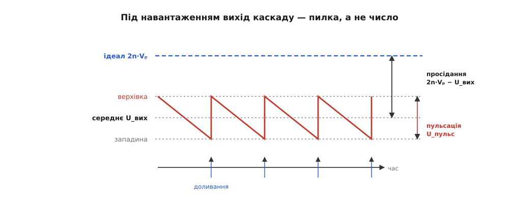
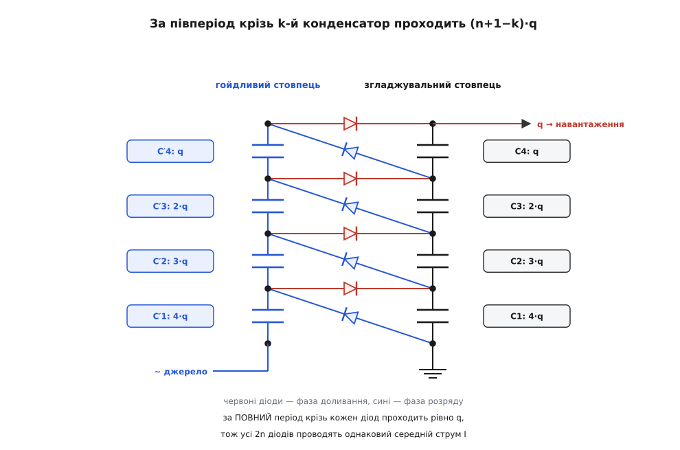
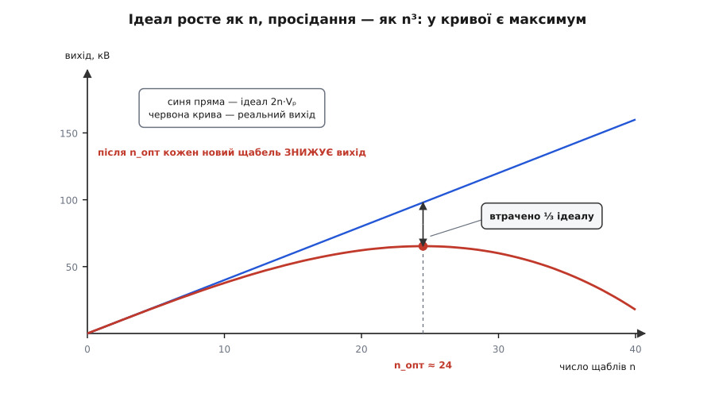

# 🧮 Просідання і пульсація каскаду: звідки беруться n² і n³

Каскад із n щаблів обіцяє 2n·Vₚ — і чесно тримає обіцянку, поки з нього нічого не беруть. Тут ми самим лише обліком заряду, без жодного диференційного рівняння, порахуємо, на скільки вольтів провалюється верхівка під струмом I, яка брижа на ній лишається, чому просідання росте як n³, а пульсація як n² — і знайдемо те число щаблів, після якого кожен доданий щабель уже **знижує** вихід.

### Що саме рахуємо

У каскаді два стовпці конденсаторів. **Гойдливий** висить на джерелі й ходить разом із ним угору-вниз; **згладжувальний** стоїть нерухомо, і саме з його вершини знімають напругу. Діоди зшивають стовпці навхрест: в одну півхвилю переливають заряд зі згладжувального стовпця в гойдливий, у другу — назад, але вже на щабель вище. Пронумеруймо щаблі знизу вгору, k = 1…n: конденсатори згладжувального стовпця — C₁…C_n, гойдливого — C′₁…C′_n, усі ємності однакові й дорівнюють C.

Без навантаження кожен конденсатор тримає 2·Vₚ, крім найнижчого гойдливого: той стоїть у серії з джерелом і набирає лише Vₚ. Вершина згладжувального стовпця — сума n однакових 2·Vₚ, тобто 2n·Vₚ. Це той ідеал, від якого ми віднімаємо.

Домовленості для розрахунку — класичні для цієї схеми:

- усі конденсатори однакові (C), діоди ідеальні — їхні прямі падіння дають сталу −2n·V_F, що не залежить від струму, тож на все подальше не впливає;
- заряд перекидається миттєво на піках, тобто двічі за період: фаза **доливання** (згладжувальний стовпець підживлюють) і фаза **розряду** (він відрізаний і живить навантаження сам);
- за фазу розряду навантаження забирає ввесь заряд періоду, q = I/f.

І єдине правило, з якого виводиться геть усе: [ємність](topic:electronics/capacitance) зв'язує заряд і напругу як ΔU = ΔQ/C. Іншої фізики в помножувачі немає — самі лише порції заряду, що переходять із конденсатора в конденсатор.

Ще одне варто з'ясувати наперед: вихід каскаду під навантаженням — не число, а пилка, тож і чисел буде три.


*Ідеал 2n·Vₚ лишається вгорі недосяжним. Під струмом вихід стає пилкою: щоразу після доливання він на верхівці, потім лінійно сповзає до западини. Просідання — це провал від ідеалу до пилки, пульсація — розмах самої пилки. Обидві величини ми зараз і порахуємо.*

### Скільки заряду проходить крізь кожен конденсатор

Почнімо з найпростішого запитання: скільки заряду за період проходить крізь кожен діод? Відповідь однакова для всіх: рівно q. Це видно з того, що в усталеному режимі заряд на кожній пластині за повний період повертається до попереднього значення — отже, у кожен вузол скільки заряду за період увійшло, стільки й вийшло. Нагорі з вузла виходить q у навантаження, тож стільки ж мусив принести верхній діод; у наступному вузлі та сама рівність, і так до самого низу.

> 🔧 **Навіщо це.** Усі 2n діодів каскаду проводять однаковий середній струм — рівно струм навантаження I, скільки б щаблів не було. Тому діоди в драбині ставлять однакові й вибирають їх за струмом навантаження, а не за номером щабля.

А от **усередині** періоду картина зовсім інша — і саме вона породжує всі втрати. Візьмімо фазу розряду: верхні діоди зачинені, згладжувальний стовпець відрізаний від підживлення. Що мусить зробити конденсатор C_k? По-перше, пропустити крізь себе заряд навантаження q — усі конденсатори стовпця стоять у серії, тож струм навантаження тече крізь кожен. По-друге, у цю ж фазу відкриті нижні діоди, і крізь них із вузлів згладжувального стовпця доливаються гойдливі конденсатори — кожен по q. І ті з них, що стоять **вище** за C_k, беруть свою порцію з вузлів над ним: гойдливий конденсатор наступного щабля, тоді ще наступного, і так до самого верху. Увесь цей заряд теж проходить крізь C_k — інакше йому нізвідки взятися, бо знизу стовпець упирається в землю.

```
крізь C_k за фазу розряду:  Q_k = q  +  (n − k)·q  =  (n + 1 − k)·q
                                 ↑        ↑
                            навантаження  підзарядка гойдливих
                                          конденсаторів вище k

розмах напруги на ньому:    ΔU_k = (n + 1 − k) · q / C
```

Найнижчий конденсатор (k = 1) пропускає n·q — увесь заряд, що його каскад узагалі перекачує; найвищий (k = n) лише q. Те саме, дзеркально, коїться з гойдливим стовпцем у фазу доливання: C′_k віддає нагору заряд для всіх щаблів від k і вище, тобто теж (n + 1 − k)·q, і просідає на ΔU′_k = (n + 1 − k)·q/C.


*За повний період крізь кожен діод проходить рівно q — струм навантаження. Але за півперіод крізь конденсатор k-го щабля проходить (n+1−k)·q: він мусить не лише пропустити заряд навантаження, а й наповнити всі конденсатори над собою. Низ драбини працює найважче.*

### Пульсація: сума перших n чисел

Пульсація на виході — це сума розмахів усіх конденсаторів згладжувального стовпця, бо вони стоять у серії, і їхні провали додаються:

```
U_пульс = ΔU₁ + ΔU₂ + … + ΔU_n
        = (q/C) · [n + (n−1) + … + 2 + 1]
        = (q/C) · n(n+1)/2
        = I · n(n+1) / (2·f·C)
```

Ось перша відповідь. Один-єдиний щабель (n = 1) дає U_пульс = I/(f·C) — рівно ту саму формулу, що й у [звичайного випрямляча з конденсатором](topic:electronics/rectification/math-ripple-calc.md), і це добрий знак: наша машинерія в найпростішому випадку зводиться до відомого. Але вже п'ять щаблів дають множник 15, а десять — 55. Пульсація росте як **квадрат** числа щаблів, тимчасом як корисна напруга — лише лінійно.

### Просідання: сума квадратів

Тепер найцікавіше. Знайдімо, до якої напруги взагалі дотягується кожен конденсатор, якщо він щоперіоду недобирає заряду.

Ідеальний діод, поки проводить, зрівнює свої вузли. Значить, наприкінці кожної фази (саме тоді діод востаннє проводив) ми маємо точну рівність потенціалів. Потенціал вузла гойдливого стовпця — це напруга джерела плюс сума напруг усіх гойдливих конденсаторів під ним; потенціал вузла згладжувального — просто сума напруг згладжувальних конденсаторів під ним. Позначмо стрілкою вниз значення наприкінці фази розряду, стрілкою вгору — наприкінці доливання:

```
кінець доливання (джерело на +Vₚ, верхній діод k-го щабля щойно проводив
                  і зрівняв вузол k гойдливого з вузлом k згладжувального):

    +Vₚ + Σ_{m≤k} U′_m↑ = Σ_{m≤k} U_m↑

кінець розряду (джерело на −Vₚ, нижній діод k-го щабля зрівняв
                вузол k гойдливого з вузлом k−1 згладжувального):

    −Vₚ + Σ_{m≤k} U′_m↓ = Σ_{m≤k−1} U_m↓
```

Лишилося пов'язати «верх» і «низ» кожного конденсатора вже відомими розмахами: U_m↑ = U_m↓ + ΔU_m (згладжувальний за фазу розряду просів і за доливання відіграв), U′_m↑ = U′_m↓ − ΔU′_m (гойдливий, навпаки, віддає в доливання). Підставмо друге рівняння в перше — суми потенціалів попарно скорочуються, лишається одна на диво проста річ:

```
U_k↓ = 2·Vₚ − Σ_{m≤k} (ΔU_m + ΔU′_m)
```

Прочитаймо це вголос, бо тут уся суть: **кожен конденсатор недобирає рівно стільки, скільки нагойдали всі конденсатори під ним, обидва стовпці разом**. Просідання не виникає на місці — воно **накопичується знизу вгору**. Той, хто стоїть на десятому щаблі, платить за розмах усіх дев'яти нижніх щаблів.

Звідси одразу видно, чому вилізе куб. Розмах ΔU_m сам по собі пропорційний (n+1−m), а в підсумкову напругу виходу він входить стільки разів, скільки конденсаторів стоїть над ним і на його рівні, тобто теж (n+1−m) разів. Добуток дає квадрат, а сума квадратів — куб:

```
U_вих↓ = Σ_k U_k↓
       = 2n·Vₚ − Σ_m (n+1−m)·(ΔU_m + ΔU′_m)
       = 2n·Vₚ − (2q/C) · Σ_m (n+1−m)²
       = 2n·Vₚ − (2q/C) · (1² + 2² + … + n²)
       = 2n·Vₚ − (q/C) · n(n+1)(2n+1)/3
```

Це западина пилки. Верхівка вища рівно на пульсацію, а середина — посередині:

```
верхівка:  U_вих↑  = 2n·Vₚ − (q/C) · n(n+1)(4n−1)/6
                   = 2n·Vₚ − (q/C) · (2n³/3 + n²/2 − n/6)

середнє:   U_вих ≈ 2n·Vₚ − (q/C) · n(n+1)(8n+1)/12
```

Другий рядок для верхівки — саме той вигляд, у якому просідання каскаду зазвичай виписують у підручниках високої напруги. Яку з трьох мірок брати — питання смаку й задачі: різняться вони лише дрібними членами, а головний, той, що вирішує все, в усіх однаковий — **(2/3)·n³·q/C**.

Тепер коефіцієнти можна просто виписати в стовпчик і подивитися, як швидко дорожчає драбина:

```
n     ідеал      пульсація ×(q/C)    просідання ×(q/C)
1     2·Vₚ              1                   1.5
2     4·Vₚ              3                   8.5
3     6·Vₚ              6                  25
5    10·Vₚ             15                 102.5
10   20·Vₚ             55                 742.5
```

Від одного щабля до десяти корисна напруга зросла вдесятеро — а просідання майже в п'ятсот разів.

### Каскад як джерело з внутрішнім опором

У кожній формулі струм I сидить лише в множнику q = I/f — і сидить у першому степені. Отже, просідання **строго пропорційне струмові**, а це вже закон Ома. Каскад поводиться як ідеальне джерело 2n·Vₚ із послідовним [внутрішнім опором](topic:electronics/internal-resistance):

```
R_вих = U_прос / I = n(n+1)(8n+1) / (12·f·C) ≈ (2/3)·n³ / (f·C)
```

Дивовижно, що в цьому опорі немає жодного резистора: він зроблений із частоти й ємності. Але потужність I²·R_вих на ньому — справжня, вона таки виділяється теплом: на діодах, на обмотці й на [ESR конденсаторів](topic:electronics/capacitor-parasitics), крізь які гострі імпульси перезаряду й протікають.

**Задача.** П'ятищабельний каскад іонізатора: усі десять конденсаторів по C = 1 нФ, живлення від феритового трансформатора з піком Vₚ = 2 кВ на частоті f = 30 кГц, навантаження бере I = 100 мкА.

```
q     = I/f = 100·10⁻⁶ / 30·10³ = 3.33·10⁻⁹ Кл = 3.33 нКл
q/C   = 3.33 нКл / 1 нФ = 3.33 В        ← ціна одного «кванта» втрат

ідеал      = 2·5·2000            = 20 000 В
пульсація  = 15 · 3.33 В         ≈ 50 В        (0.25 %)
просідання = 102.5 · 3.33 В      ≈ 342 В       (1.7 %)
вихід      ≈ 20 000 − 342        ≈ 19 660 В
R_вих      = 342 В / 100 мкА     ≈ 3.4 МОм
```

**Висновок.** На тридцяти кілогерцях каскад майже ідеальний: віддав менш як два відсотки напруги й ледве бринить. Тепер приберімо генератор і ввімкнімо ту саму драбину просто в мережу 50 Гц, не змінивши жодної деталі:

```
q     = 100·10⁻⁶ / 50 = 2·10⁻⁶ Кл = 2 мкКл
q/C   = 2 мкКл / 1 нФ = 2000 В          ← у 600 разів дорожчий «квант»
просідання = 102.5 · 2000 В = 205 000 В  ≫  20 000 В ідеалу
```

Формула видала просідання вдесятеро більше за всю напругу каскаду. Це не помилка, а спосіб, у який лінійна модель кричить: такого струму ця драбина на такій частоті не подужає взагалі — виходу практично не буде. Щоб повернути ті самі 19.7 кВ на 50 Гц, довелося б підняти всі ємності в 600 разів: замість 1 нФ — 600 нФ, і кожен на 4 кВ (конденсатор бачить 2·Vₚ). Десять таких — це вже не намистини, а бруски розміром із кулак. Ось точна ціна питання «а чому не просто від мережі».

### Скільки щаблів має сенс

Ідеал росте як n, а просідання — як n³. Два такі суперники неминуче десь перетинаються, і далі вигравати починає гірший. Лишімо в напрузі виходу тільки головні члени й пошукаймо максимум:

```
U_вих(n) ≈ 2n·Vₚ − (2/3)·n³·q/C

dU/dn    = 2·Vₚ − 2·n²·q/C = 0

⇒  n_опт = √(Vₚ·C/q) = √(Vₚ·f·C / I)
```

Для нашого каскаду на 30 кГц це √(2000·30000·10⁻⁹/10⁻⁴) = √600 ≈ 24 щаблі, а на 50 Гц — рівно один. Частота, отже, не просто зменшує втрати — вона визначає, **скільки поверхів взагалі можна збудувати**. Оскільки n_опт росте як √f, шістсоткратне підвищення частоти дозволяє драбину в ≈24 рази вищу.


*Ідеал росте прямою 2n·Vₚ, реальний вихід — від неї відняли (2/3)n³·q/C. Спершу лінійний доданок сильніший, потім кубічний його наздоганяє; у точці n_опт крива має максимум і далі йде вниз. Оптимум плаский — тому в реальних каскадах працюють помітно лівіше від нього.*

Біля самого максимуму виходить гарна річ, яка не залежить ані від деталей, ані від частоти. З умови n_опт² = Vₚ·C/q випливає, що просідання там дорівнює (2/3)·n·Vₚ, тобто третині ідеалу:

```
U_вих(n_опт) ≈ 2n·Vₚ − (2/3)·n·Vₚ = (4/3)·n·Vₚ = ⅔ · (2n·Vₚ)
```

Хоч як добирайте компоненти — на оптимумі ви віддаєте рівно третину. Саме тому реальні каскади так далеко не заганяють: працюють там, де втрати кілька відсотків, а до максимуму ще далеко.

### Куди тиснути

Тепер, коли всі три формули перед очима, важелі видно точно, а не на дотик.

**Частота** входить у знаменник кожної з них по одному разу, і більш нічого в них не міняє: подвоїли f — удвічі менші й пульсація, і просідання, і вихідний опір. Це єдиний важіль, який нічого не коштує за розміром і вагою, — тому високовольтні каскади й живлять від власного генератора на десятках кілогерц.

**Ємність** діє так само лінійно, але платити доводиться об'ємом та ізоляцією: конденсатор на 4 кВ дорожчає з ємністю значно швидше, ніж генератор — із частотою.

**Нерівні ємності.** Вираз для просідання каже, що конденсатор m-го щабля входить у втрати з вагою (n+1−m)² — квадратично більшою внизу. Для п'яти щаблів ваги виходять 25 : 16 : 9 : 4 : 1, тобто на найнижчу пару конденсаторів припадає майже половина всього просідання, а на найвищу — заледве два відсотки. Звідси класичний прийом високовольтників: ємності роблять не однаковими, а східчастими — унизу найбільші. Подвоївши лише два нижні конденсатори з десяти, ви прибираєте близько чверті всіх втрат.

**Двічі за період.** Кожне «q» у наших формулах — це заряд, який стовпець мусить віддати за один період між доливаннями. Схема, що доливає стовпець двічі за період (симетричний каскад із двома гойдливими стовпцями в протифазі), ділить це q навпіл — і водночас знімає зі згладжувального стовпця обов'язок годувати гойдливий, а саме звідти й узялися множники (n+1−k). Обидва механізми, що дали нам квадрат і куб, слабшають — тому саме симетричні каскади ставлять там, де треба не мікроампери, а міліампери. Коефіцієнти для тієї схеми виводяться тим самим обліком заряду: змінюється лише розкладка потоків, а правило ΔU = ΔQ/C лишається те саме.
