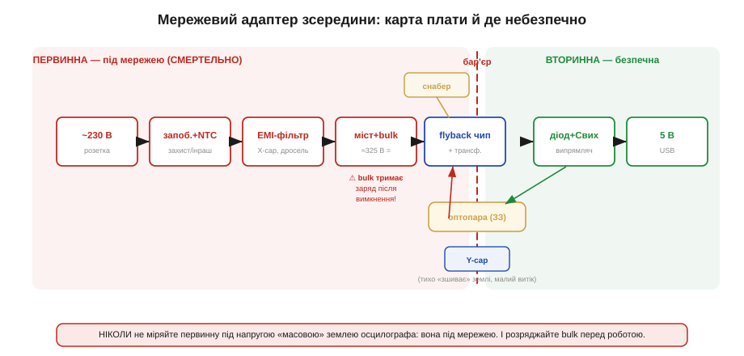

# 🔌 Мережевий адаптер зсередини: flyback на одному чипі

Що насправді стоїть у зарядному «кубику» — і чому до половини цієї плати **смертельно небезпечно** торкатися. Усередині працює [ізольований flyback](topic:electronics/flyback-isolated), і саме його властивості визначають усе, що ми побачимо на платі.

### Клас пристрою

Зарядний адаптер (USB-кубик, блок живлення роутера) — це **ізольований flyback** на одному-двох чипах. Він робить із мережі 230 В безпечні ізольовані 5 В (чи більше для PD). Первинна сторона живе **під мережею**, вторинна — за бар'єром, і саме тому її можна торкатися.

Чому взагалі flyback (зворотноходовий перетворювач, flyback), а не щось простіше? Бо адаптеру треба зробити одразу три речі, і flyback робить усі три одним трансформатором. По-перше, **понизити напругу** з сотень вольт до одиниць — це робить співвідношення витків. По-друге, **гальванічно розв'язати** вихід від мережі: між первинною і вторинною обмотками немає мідного контакту, лише магнітний зв'язок крізь осердя, тому вторинну можна торкатися навіть тоді, коли первинна під 325 В. По-третє, **стабілізувати** вихід під змінним навантаженням — це робить зворотний зв'язок, що міняє тривалість імпульсів. Лінійний трансформатор на 50 Гц теж розв'язав би й понизив би, але важив би сотні грамів і не стабілізував би нічого; flyback робить те саме мініатюрним високочастотним трансформатором, бо на 65 кГц осердю треба у тисячі разів менше заліза, ніж на 50 Гц.

### Блок-схема плати


*Шлях зліва направо: розетка → запобіжник і NTC (інраш) → EMI-фільтр → мостовий випрямляч і bulk-конденсатор (≈325 В) → flyback-чип із трансформатором (тут проходить бар'єр) → вторинний діод і конденсатор → 5 В. Оптопара несе зворотний зв'язок крізь бар'єр, Y-конденсатор тихо «зшиває» землі, снабер гасить викид витоку. Уся ліва зона — під мережею.*

Ланцюг по черзі: **запобіжник + NTC** (захист і обмеження пускового струму) → **EMI-фільтр** (X-конденсатор, синфазний дросель — щоб завади перемикання не йшли в мережу) → **мостовий випрямляч** + **bulk-конденсатор** (≈325 В постійних) → **flyback** (контролер і силовий ключ часто в одному чипі) з **трансформатором** → на вторинній [**діод Шотткі**](root:embedded/zener-schottky) + **вихідний конденсатор** → 5 В. Поряд — [**снабер**](topic:electronics/snubbers-dvdt) на первинній і [**оптопара**](topic:electronics/optocoupler) зворотного зв'язку.

> 🔧 **Навіщо це.** Цю карту корисно тримати в голові навіть тоді, коли ви не лагодите адаптер, а лише живите від нього свій ESP32. Вона пояснює, звідки беруться дві неприємності, які ви відчуєте на власному пристрої: пульсації 100 Гц на 5 В (це bulk-конденсатор не встигає дозарядитися між півхвилями мережі) і високочастотний «брязкіт» у радіоканалі (це той самий комутаційний шум, проти якого стоїть EMI-фільтр, якщо він стоїть якісно). Знаючи, який вузол за що відповідає, ви не шукаєте причину пульсацій у своїй прошивці.

### Чому на bulk саме ≈325 В, а не 230

[Мостовий випрямляч](topic:electronics/rectification) бере **діюче** ([RMS](topic:physics/rms-value)) значення мережі — 230 В — і випрямляє його. Але bulk-конденсатор заряджається не до діючого, а до **амплітудного** (пікового) значення синусоїди, бо в момент піка діоди моста відкриваються й конденсатор «запам'ятовує» найвищу точку хвилі, а потім тримає її, поки навантаження повільно її стягує. Амплітуда синусоїди більша за діюче рівно у √2 разів — це визначення діючого значення для синуса:

```
U_пік = U_RMS × √2 = 230 × 1.414 ≈ 325 В
```

Тому на bulk-конденсаторі стоїть ≈325 В постійних, а не 230. Звідси й вибір конденсатора: його робоча напруга має бути щонайменше 400 В з запасом на сплески в мережі. І звідси ж — головна причина небезпеки лівої зони: 325 В постійних небезпечніші за 230 В змінних, бо постійна напруга не має переходів через нуль і «тримає» руку міцніше.

### Як flyback запасає енергію: магічна пауза в зазорі

Тут — серце топології, і саме його найчастіше пояснюють неправильно. Звичайний трансформатор передає енергію **наскрізь**: струм у первинній миттєво наводить струм у вторинній, енергія не затримується в осерді. Flyback працює інакше — він **спершу запасає** енергію в магнітному полі трансформатора, а **потім віддає** її. Звідси й назва: «зворотний хід» — це фаза віддачі.

Розгляньмо один цикл. Коли силовий ключ (DRAIN) **відкритий**, струм тече первинною обмоткою й наростає лінійно, а вторинний діод у цей час **закритий** (обмотки намотані зустрічно — це й позначають крапки полярності). Жодного струму на вихід не йде; натомість у магнітному полі осердя накопичується енергія. Скільки саме — задає закон накопичення в індуктивності:

```
W = ½ · L_пер · I_пік²
```

Коли ключ **закривається**, поле не може зникнути миттєво — і воно «перекидає» полярність так, щоб тепер відкрився вторинний діод. Запасена енергія зливається у вторинну обмотку, заряджаючи вихідний конденсатор. Це і є flyback-фаза. Потім ключ знову відкривається — і цикл повторюється десятки тисяч разів на секунду.

А де тут **зазор**? У осерді flyback-трансформатора навмисне залишають крихітний **повітряний зазор** (air gap) — частку міліметра немагнітного проміжку в магнітному колі. Це здається безглуздям: навіщо псувати магнітне коло діркою? Але саме в цьому проміжку й «живе» запасена енергія. Феромагнітне осердя добре проводить магнітний потік, проте [насичується](topic:physics/saturation-hysteresis) — за певної напруженості поля воно більше не може вмістити енергію, потік перестає зростати, індуктивність падає, і струм у первинній злітає в коротке замикання. Зазор має величезний магнітний опір, тому переважна частина енергії поля зосереджується саме в ньому — а зазор насичуватися не вміє. Парадоксально, але **зазор підвищує здатність трансформатора запасати енергію**, відсуваючи насичення осердя: він знижує індуктивність, зате дозволяє пропустити набагато більший піковий струм, перш ніж осердя «здасться». Без зазору flyback на такому маленькому осерді просто не зміг би перекачати потрібну потужність — осердя насичувалося б на кожному циклі.

> 🔧 **Навіщо це.** Звідси випливає правило, яке рятує саморобні DC-DC: **flyback-трансформатор не можна замінити звичайним трансформатором тих самих витків**. Звичайний намотаний без зазору, він миттєво насититься в режимі накопичення. І звідси ж — чому flyback такий чутливий до перевантаження: якщо навантаження раптом виросте, контролер довше тримає ключ відкритим, піковий струм росте, і за межею насичення осердя захист має встигнути закрити ключ, інакше згорить силовий транзистор.

### Типова «розпіновка» інтегрованого flyback-чипа

```
DRAIN   стік вбудованого силового ключа (до первинної обмотки)
GND/SRC  спільний нуль ПЕРВИННОЇ (під мережею, не земля вторинної!)
VCC/BP   живлення чипа (від допоміжної обмотки чи bypass-конденсатора)
FB       вхід зворотного зв'язку (від оптопари або первинної регуляції)
```

### Підключення

DRAIN — до первинної обмотки трансформатора (інший її кінець на bulk +325 В). GND чипа — нуль **первинної** сторони. VCC живиться від допоміжної обмотки. FB ловить сигнал оптопари: фотоприймач оптопари на первинній, світлодіод — на вторинній разом з еталоном напруги. Снабер (RCD або TVS) стоїть на первинній обмотці, гасячи викид витоку.

Чому VCC живиться від **допоміжної** обмотки, а не прямо від bulk? Бо тягнути живлення чипа з 325 В через резистор означало б палити в ньому ват-два постійно — адаптер грівся б навіть без навантаження. Тому з bulk беруть струм лише на **старт** (через високоомний резистор, щоб тихо зарядити VCC до порога запуску), а далі чип живиться від третьої, **допоміжної** обмотки того самого трансформатора: вона повторює форму вторинної, тож «безплатно» дає чипу і живлення, і — у схемах без оптопари — інформацію про вихідну напругу.

### «Перший байт»: як заговорити

Коду тут немає — чип **самозбуджується** і працює аналогово. «Заговорити» з ним означає просто подати на вхід мережу: на виході зʼявляться стабільні 5 В, а рівень тримає петля оптопари. Якщо щось вимірювати — то напругу на FB (як оптопара «доповідає») і форму на DRAIN (там видно і відбиту напругу, і викид витоку зі снабером).

### Числовий приклад: скільки заліза качає ваш 5 Вт кубик

**Умова.** Маленький USB-кубик віддає 5 В × 1 А = 5 Вт, працює на частоті f = 65 кГц у режимі переривчастого струму (енергія повністю зливається кожного циклу), ККД ≈ 80 %. Первинна індуктивність L_пер = 2.0 мГн. Скільки енергії осердя запасає за цикл і який піковий струм тече первинною?

```
Енергія на вході за цикл (з урахуванням ККД):
  P_вх   = P_вих / η = 5 / 0.8         = 6.25 Вт
  W_цикл = P_вх / f  = 6.25 / 65 000   ≈ 96 мкДж  (мікроджоулі за один такт)

Піковий струм первинної з умови накопичення W = ½·L·I²:
  I_пік  = √(2·W_цикл / L_пер)
         = √(2 · 96·10⁻⁶ / 2.0·10⁻³)
         = √(0.096)                    ≈ 0.31 А

Перевірка наростання струму за on-time (на bulk 325 В),
  напруга на індуктивності: U = L · dI/dt  ⇒  t_on = L·I_пік / U_bulk
  t_on   = 2.0·10⁻³ · 0.31 / 325       ≈ 1.9 мкс
  при періоді T = 1/65000 ≈ 15.4 мкс це ~12 % такту — ключ
  відкритий коротко, решту часу осердя зливає енергію у вторинну.
```

**Висновок.** Крихітне осердя розміром з ніготь перекачує енергію порціями по ~96 мкДж 65 тисяч разів на секунду, і саме здатність зазору витримати ці 0.31 А піка без насичення визначає, скільки ват кубик віддасть. Подвоїте потужність — і або піковий струм зросте до межі насичення, або доведеться брати більше осердя.

### Типові граблі — насамперед БЕЗПЕКА

- **Первинна сторона під мережею.** Її «земля» — НЕ земля вашого стола. Підключите «масу» осцилографа до первинної — і буде коротке через прилад, іскри, біда. Первинну міряють лише з **ізоляцією** (розв'язувальний трансформатор, диференційний щуп).
- **Bulk тримає заряд** після вимкнення з розетки — сотні вольт ще довго, бо великий конденсатор без навантаження розряджається повільно (саме тому поруч часто стоїть розрядний резистор, але покладатися на нього не можна). **Розряджайте** його перед роботою.
- **Не лагодьте під напругою.** Жодних дотиків до лівої зони, поки ввімкнено.
- **Витік крізь Y-конденсатор** дає легке «пощипування» від корпуса незаземленого ноутбука — це штатний, нормований, але відчутний ефект: Y-конденсатор навмисне «зшиває» первинну й вторинну землі для придушення завад, і крізь нього на корпус просочується невеликий струм витоку.
- **Снабер гріється** — це нормально; він щоразу гасить викид від **індуктивності витоку** (тієї частки поля первинної обмотки, що не зчепилася з вторинною й тому не передалася на вихід). Цей викид може сягати багатьох сотень вольт і пробив би силовий ключ, тому снабер його зрізає, перетворюючи на тепло. Холодний снабер означає, що клапан викиду недопрацьований, і ризикує транзистор.

### Варіації класу

Буває **інтегрований switcher** (контролер + ключ в одному) або **контролер + зовнішній MOSFET** (на більшу потужність). Зворотний зв'язок — через **оптопару** (точніше) або **первинна регуляція** без оптопари (дешевше, менш точно, по допоміжній обмотці). Сучасні **PD/QC**-адаптери додають на вторинній окремий контролер, що домовляється про напругу й керує оптопарою, змінюючи завдання flyback.
