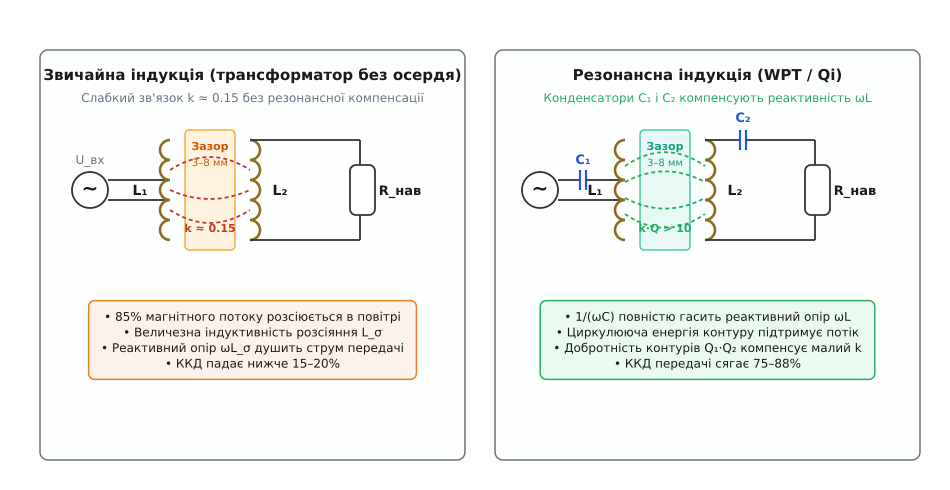
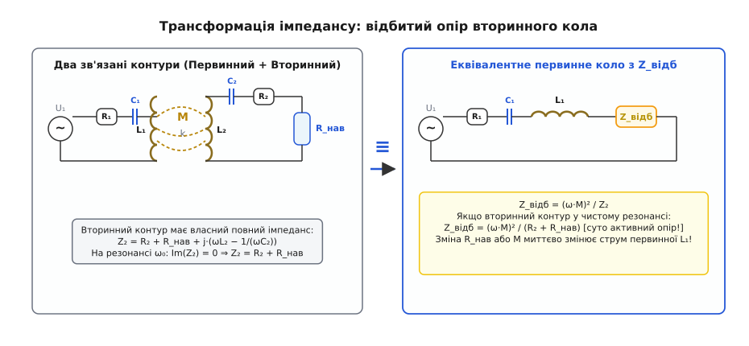
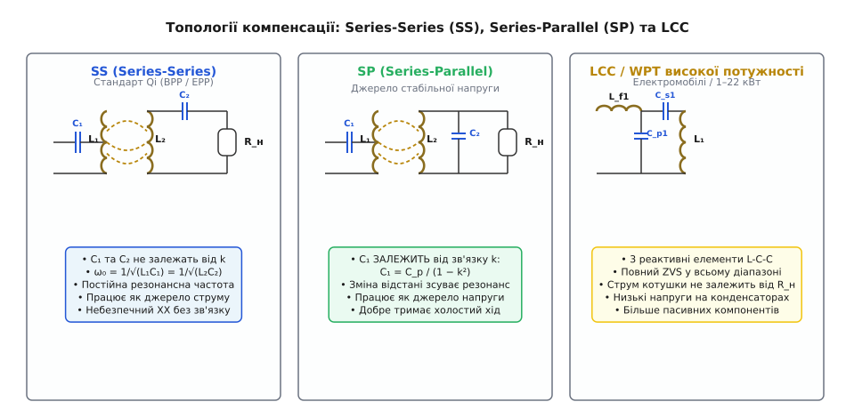
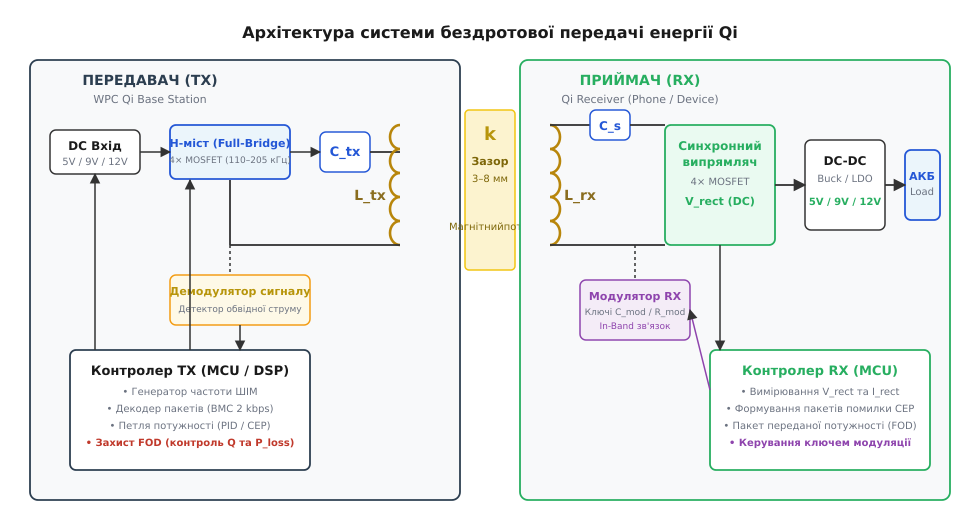
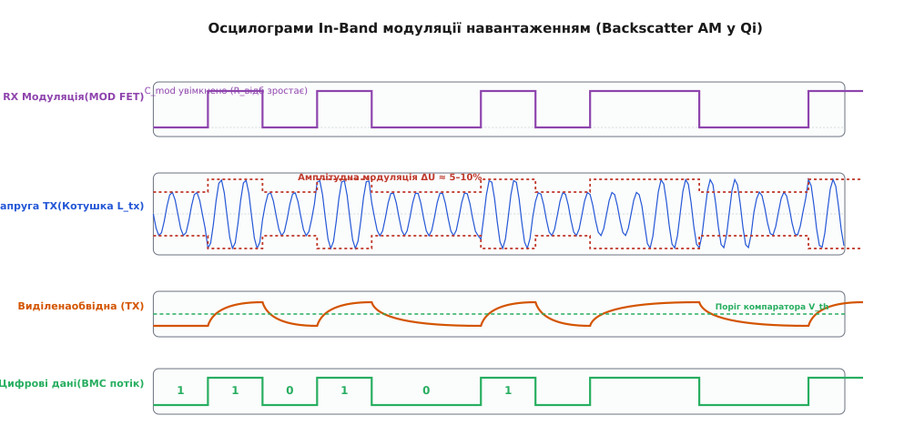
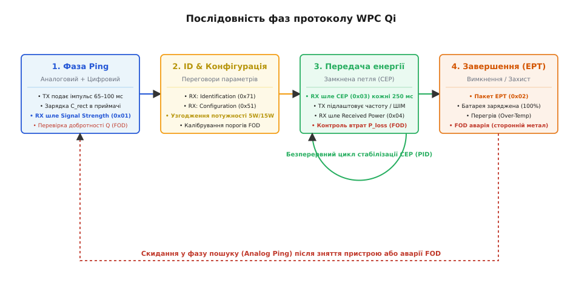

# Бездротова передача енергії: Qi і резонансна індукція

<preknowlist>
- [LC-резонанс](topic:electronics/lc-resonance) — коливальний контур, обмін енергією між полем котушки та конденсатора.
- [Добротність Q](topic:electronics/quality-factor) — відношення накопиченої енергії до втрат за період коливань.
- [H-міст](topic:electronics/h-bridge) — комутація полярності напруги на навантаженні чотирма ключами.
- [Синхронний випрямляч](topic:electronics/sync-rectifier) — заміна діодів на польові транзистори для усунення падіння напруги.
- [М'яке перемикання: ZVS і ZCS](topic:electronics/soft-switching-zvs-zcs) — усунення комутаційних втрат комутацією при нулі напруги чи струму.
- [Спарені котушки: взаємоіндукція](topic:electronics/coupled-inductor) — передача енергії крізь спільний магнітний потік.
</preknowlist>

Звичайний контактний роз'єм у герметичному смартфоні, медичному імплантаті чи промисловому підводному датчику з часом зношується: пружні ламелі втрачають пружність, у щілини набивається бруд, контакти окислюються, а волога спричиняє електрохімічну корозію під напругою. Але спроба позбутися металевих штирів і передати кілька десятків ват через стінку корпусу за принципом звичайного трансформатора призводить до несподіваного провалу: ККД падає з 95% до жалюгідних 10–15%, а сама передавальна станція розжарюється, не віддаючи корисного струму. Причина криється в повітряному зазорі товщиною всього у 3–8 мм. Якщо в класичному залізному осерді майже весь магнітний потік замкнений усередині магнітопроводу, то у відкритому просторі понад 80% ліній магнітного поля розсіюється вбік. Це розсіяння створює гігантський реактивний опір, який блокує проходження змінного струму.

Розв'язати цю суперечність вдалося завдяки поєднанню електромагнітної індукції з явищем електричного резонансу високої добротності. Додавши до котушок передавача та приймача спеціально розраховані конденсатори, інженери змусили реактивні опори індуктивності та ємності взаємно знищуватися. В результаті система починає поводитися як ідеально узгоджений високочастотний тракт, здатний передавати десятки й сотні ват через повітря з коефіцієнтом корисної дії понад 80–88%.

## Чому повітряний зазор руйнує звичайний трансформатор

Щоб зрозуміти фізику бездротової передачі енергії (WPT, *Wireless Power Transfer*), порівняємо звичайний трансформатор із парою рознесених у просторі котушок.

У трансформаторі з замкненим феритовим осердям магнітна проникність осердя `μ_r` досягає значень 2000–5000. Магнітний потік практично не виходить у повітря: коефіцієнт зв'язку між первинною та вторинною обмотками наближається до одиниці:

```
k = M / √(L₁ · L₂) ≈ 0.98–0.99
```

де `L₁` та `L₂` — повні власні індуктивності обмоток, а `M` — їхня взаємна індуктивність. Завдяки такому щільному зв'язку наведена у вторинній обмотці електрорушійна сила (ЕРС) майже точно повторює первинну напругу з урахуванням коефіцієнта трансформації, а індуктивність розсіяння становить менше 1–2% від повної індуктивності.


*Ліворуч — нерезонансна індукція: відсутність осердя та повітряний зазор 3–8 мм знижують зв'язок до k ≈ 0.15; понад 85% магнітного поля розсіюється, а реактивний опір розсіяння блокує передачу потужності (ККД < 20%). Праворуч — резонансна індукція (WPT): послідовні конденсатори C₁ і C₂ компенсують реактивність котушок ωL, формуючи високодобротні коливальні контури, де циркулююча енергія забезпечує ККД передачі 75–88%.*

Щойно ми прибираємо осердя і розносимо пласкі спіральні котушки на відстань `d = 5 мм`, магнітна проникність середовища стає рівною одиниці (`μ_r = 1`). Магнітний опір повітряного проміжку в тисячі разів перевищує опір фериту. Силові лінії магнітного поля, створені струмом первинної котушки `L₁`, замикаються найкоротшим шляхом довкола власних провідників, і лише невелика їхня частка долітає до витків вторинної котушки `L₂`. Коефіцієнт магнітного зв'язку обвалюється до значень:

```
k = 0.10–0.30
```

Повну індуктивність котушки передавача тепер можна представити як суму двох частин: корисної індуктивності намагнічування `L_m = k · L₁` та паразитної індуктивності розсіяння `L_σ = (1 − k) · L₁`. При `k = 0.2` частка індуктивності розсіяння становить 80%. На робочій частоті `f = 125 кГц` для типової котушки `L₁ = 10 мкГн` реактивний опір розсіяння становить:

```
X_σ = 2 · π · f · L_σ = 2 · 3.1416 · 125000 · (0.8 · 10·10⁻⁶) ≈ 6.28 Ом
```

Якщо до такої первинної котушки прикласти змінну напругу 12 В, цей реактивний опір обмежить струм первинного кола. Але найгірше те, що цей струм буде суто **реактивним** (зсунутим на 90° відносно напруги): він переганяє реактивну енергію туди й назад між джерелом і полем розсіяння, нагріваючи активний опір мідного дроту `R₁`, але майже не передаючи активної енергії у вторинне коло.

> 🔧 **Навіщо це.** Без компенсації реактивного опору розсіяння бездротова зарядка вимагала б прикладання сотень вольт вхідної напруги для отримання кількох ват на виході, перетворюючи зарядну підставку на малоефективний електричний обігрівач.

## Магнітний резонанс: добротність Q та добуток k·Q

Порятунком від реактивного опору розсіяння є включення послідовного конденсатора `C₁`, підібраного так, щоб на робочій частоті `ω = 2π·f` його ємнісний реактивний опір `1 / (ωC₁)` в точності дорівнював індуктивному опору котушки `ωL₁`. На цій [резонансній частоті](topic:electronics/lc-resonance):

```
ω₀ · L₁ − 1 / (ω₀ · C₁) = 0
```

Реактивні опори індуктивності та ємності протилежні за знаком і взаємно компенсуються. Для інвертора первинний контур стає майже суто активним навантаженням. 

Аналогічний конденсатор `C₂` встановлюють і у вторинному контурі приймача, налаштовуючи його на ту саму резонансну частоту `ω₀ = 1 / √(L₂C₂)`. Тепер навіть слабка ЕРС, наведена у вторинній котушці крізь слабкий магнітний зв'язок `k ≈ 0.2`, розгойдує у вторинному контурі великий резонансний струм. Енергія коливань накопичується в контурі, а її амплітуда обмежується лише добротністю котушок `Q` та корисним опором навантаження.

[Добротність коливального контуру](topic:electronics/quality-factor) `Q` (від англ. *Quality factor*) показує, у скільки разів накопичена в магнітному та електричному полях енергія перевищує втрати енергії на активному опорі провідників за один період коливань:

```
Q₁ = ω₀ · L₁ / R₁
Q₂ = ω₀ · L₂ / R₂
```

де `R₁` та `R₂` — внутрішні активні опори втрат мідного дроту котушок на робочій частоті (з урахуванням скін-ефекту та ефекту близькості).

Головним критерієм працездатності та максимального ККД будь-якої резонансної системи бездротової передачі енергії є безрозмірний **добуток коефіцієнта зв'язку на добротність**:

```
FOM = k · √(Q₁ · Q₂)
```

Аналітичне виведення енергетичного балансу показує, що максимально можливий теоретичний ККД магнітного каналу `η_max` однозначно визначається саме цим добутком:

```
η_max = (k² · Q₁ · Q₂) / (1 + √(1 + k² · Q₁ · Q₂))²
```

Повне математичне виведення цієї формули, розрахунок оптимального імпедансу навантаження та числовий приклад розрахунку наведено у вставці [Розрахунок ККД та відбитого імпедансу](topic:electronics/wireless-power-transfer/math-wpt-efficiency.md).

З цієї залежності випливає базове інженерне правило:
- Якщо `k · √(Q₁Q₂) < 1` (слабкий зв'язок або низька добротність), передача енергії неефективна: більша частина потужності втрачається у вигляді тепла на активних опорах самих котушок (`η < 17%`).
- Якщо `k · √(Q₁Q₂) ≥ 10`, система входить у режим сильного резонансного зв'язку (англ. *Strongly Coupled Magnetic Resonance*), де ККД передачі перевищує `80–85%`.

Саме тому в стандарті Qi навіть при відносно малому зв'язку `k ≈ 0.2–0.25` котушки виготовляють із багатожильного літцендрату з низьким опором, досягаючи високої добротності `Q₁ ≈ 60–80` та `Q₂ ≈ 40–50`, що дає добуток `k · √(Q₁Q₂) ≈ 0.25 · √3500 ≈ 14.8` і забезпечує високий ККД перетворення.

## Відбитий імпеданс: як передавач «відчуває» приймач

Між котушками передавача і приймача немає жодного гальванічного контакту, проте інвертор передавача миттєво реагує на будь-яку зміну струму в телефоні: чи то підключення швидкої зарядки, чи то завершення процесу заряду батареї. Цей зворотний вплив описується поняттям **відбитого імпедансу** (англ. *reflected impedance*).

Коли струм первинної котушки `I₁` створює змінне магнітне поле, воно наводить у вторинній котушці ЕРС взаємоіндукції `E₂ = −jωM · I₁`. Ця ЕРС викликає у вторинному контурі струм `I₂ = E₂ / Z₂`, де `Z₂` — повний власний імпеданс вторинного кола (включно з опором навантаження `R_нав`).

Своєю чергою, вторинний струм `I₂`, протікаючи крізь котушку `L₂`, створює власне зустрічне магнітне поле, яке наводить зворотну ЕРС у первинній котушці `E_зворотна = −jωM · I₂`. Підставивши значення струму `I₂`, отримуємо напругу, яку вторинне коло вносить у первинний контур:

```
U_відб = −E_зворотна = jωM · ((−jωM · I₁) / Z₂) = ((ωM)² / Z₂) · I₁
```


*Трансформація імпедансу крізь магнітне поле: наведені струми вторинного кола створюють зворотну ЕРС, яка еквівалентна появі додаткового послідовного імпедансу Z_відб = (ωM)² / Z₂ у первинному колі. На резонансі вторинного кола Z₂ стає суто активним, перетворюючи Z_відб на чистий опір.*

Таким чином, для первинного контуру наявність приймача еквівалентна включенню послідовного додаткового імпедансу:

```
Z_відб = (ωM)² / Z₂
```

Якщо вторинний контур налаштований у точний резонанс на робочій частоті, його реактивний опір зникає: `Z₂ = R₂ + R_нав`. Тоді відбитий імпеданс у первинне коло стає суто **активним опором**:

```
R_відб = (ωM)² / (R₂ + R_нав)
```

Зверніть увагу на знаменник: відбитий опір **обернено пропорційний** опору навантаження `R_нав`.
1. Коли телефон підключений і бере великий струм (малий опір `R_нав`), відбитий опір `R_відб` у передавачі **зростає**. Первинний контур бачить високий активний опір і споживає від джерела пропорційно велику потужність для передачі в навантаження.
2. Якщо навантаження раптово вимкнути (холостий хід, `R_нав → ∞`), відбитий опір падає майже до нуля (`R_відб → 0`). Первинний контур залишається сам на сам зі своїм власним малим опором дроту `R₁` (частки ома). Без швидкої реакції мікроконтролера передавача у первинному резонансному контурі виникне небезпечний струм короткого замикання, який може спалити транзистори H-моста.

## Топології резонансної компенсації: SS проти SP та LCC

Спосіб підключення компенсаційних конденсаторів визначає поведінку всієї системи при зміні навантаження та зміщенні котушок. Існує чотири базові двохелементні конфігурації, які позначаються двома літерами: перша вказує включення конденсатора в передавачі (Series/Parallel), друга — у приймачі:

1. **SS (Series-Series)**: конденсатор `C₁` увімкнений послідовно з первинною котушкою `L₁`, а конденсатор `C₂` — послідовно з вторинною `L₂`.
2. **SP (Series-Parallel)**: `C₁` послідовно в первинному колі, `C₂` паралельно до вторинної котушки `L₂`.
3. **PS (Parallel-Series)** та **PP (Parallel-Parallel)**: первинний конденсатор увімкнений паралельно до котушки передавача.


*Конфігурації компенсаційних контурів: топологія SS (стандарт Qi) має постійні резонансні частоти, незалежні від зв'язку k. Топологія SP забезпечує стабілізацію вихідної напруги, але значення C₁ залежить від k. Багатоелементна топологія LCC додає три реактивні елементи на кожному боці, гарантуючи надійний ZVS у діапазоні 0–100% потужності для кіловатних систем.*

### Переваги топології SS (вибір стандарту Qi)

У топології SS значення компенсаційних ємностей розраховуються за класичною формулою Томсона і **взагалі не залежать від коефіцієнта зв'язку `k`**:

```
C₁ = 1 / (ω₀² · L₁)
C₂ = 1 / (ω₀² · L₂)
```

Хоч би як користувач клав телефон на зарядну панель (ближче до краю чи по центру, змінюючи `k` від 0.1 до 0.35), власні резонансні частоти контурів залишаються суворо фіксованими. Крім того, на резонансній частоті топологія SS поводиться як джерело стабільного струму: вихідний струм приймача `I₂ = U₁ / (ω₀ · M)` прямо пропорційний первинній напрузі й не залежить від опору навантаження. Це ідеально підходить для початкової фази зарядки літій-іонних акумуляторів постійним струмом (режим CC, *Constant Current*).

### Обмеження топології SP

У топології SP паралельний вторинний конденсатор `C₂` вносить у первинне коло не лише активний опір, але й відбиту ємнісну реактивність. Внаслідок цього для збереження резонансу ємність первинного конденсатора повинна залежати від коефіцієнта зв'язку:

```
C₁ = 1 / (ω₀² · L₁ · (1 − k²))
```

Якщо відстань між котушками зміниться, первинний контур втрачає резонанс, напруга й струм розходяться за фазою, а ККД різко падає. Тому схему SP застосовують лише в пристроях із жорстко зафіксованим механічним гніздом, де відстань між котушками є абсолютно незмінною.

### Багатоелементна топологія LCC для високих потужностей

У високопотужних зарядних станціях (від 1 до 22 кВт для бездротової зарядки електромобілів) переважає топологія **LCC-LCC** (або **LCC-S**). Вона додає до кожної котушки додатковий індуктор `L_f` та паралельний конденсатор `C_p`. 

Головна перевага LCC полягає в тому, що струм котушки передавача `I₁ = U_вх / (ω₀ · L_f1)` залишається абсолютно стабільним незалежно від навантаження і відстані до приймача, а інвертор гарантовано зберігає режим м'якого перемикання при нулі напруги (ZVS) навіть на холостому ходу.

Детальне порівняння всіх п'яти топологій, матрицю передавальних функцій та критерії вибору конденсаторів наведено у вставці [Топології резонансної компенсації](topic:electronics/wireless-power-transfer/comp-wpt-topologies.md).

## Архітектура системи Qi: передавач (TX) та приймач (RX)

Стандарт Qi (розроблений консорціумом WPC — *Wireless Power Consortium*) стандартизував два основні профілі потужності:
- **BPP (Baseline Power Profile)**: передача потужності до 5 Вт на частотах 110–205 кГц (живлення від 5 В, напівмостовий або повний міст).
- **EPP (Extended Power Profile)**: передача потужності до 15 Вт (зі спеціальними розширеннями пропрієтарних протоколів до 50–100 Вт) при напругах живлення моста 9–20 В через протокол [USB-PD](topic:electronics/usb-pd).


*Архітектура системи Qi: передавач TX містить DC-вхід, H-міст на чотирьох MOSFET, резонансний бак L_tx + C_tx, датчик струму з демодулятором обвідної та мікроконтролер. Приймач RX складається з котушки L_rx, резонансних конденсаторів C_s/C_d, модулювальних ключів In-Band зв'язку, синхронного випрямляча, стабілізатора Buck/LDO та контролера.*

### Будова передавача (TX)

1. **Вхідний перетворювач живлення**: приймає напругу від адаптера живлення USB Type-C. Контролер TX через переговори [PD sink negotiation](topic:electronics/pd-sink-negotiation) запитує в джерела потрібний профіль напруги (9 В, 12 В або 15 В/20 В у режимі PPS).
2. **H-міст (Full-Bridge Inverter)**: чотири N-канальні польові транзистори з низьким опором відкритого каналу `R_DS(on) ≈ 10–30 мОм`. [H-міст](topic:electronics/h-bridge) комутує постійну напругу в двополярний прямокутний сигнал `±U_вх`, що збуджує резонансний LC-бак.
3. **Драйвери ключів**: інтегральні драйвери верхнього та нижнього плечей із вбудованими бутстрепними конденсаторами ([bootstrap capacitor](topic:electronics/bootstrap-capacitor)), які забезпечують швидке перезаряджання ємності затвора MOSFET за час менше 15–20 нс для мінімізації динамічних втрат.
4. **Контролер передавача (MCU / DSP)**: генерує ШІМ-сигнали керування ключами, реалізує замкнений цифровий контур стабілізації потужності, декодує цифрові пакети зворотного зв'язку від смартфона та виконує захисне виявлення сторонніх металевих предметів (FOD).

### Будова приймача (RX)

1. **Пласка прийомна котушка `L_rx`**: намотана тонким мідним літцендратом у вигляді пласкої еліптичної або круглої спіралі товщиною менше 0.3–0.5 мм. З тильного боку котушка обов'язково екранується пластиною з м'якого магнітного фериту товщиною 0.2–0.4 мм. Ферит виконує дві критичні функції: концентрує магнітний потік, збільшуючи коефіцієнт зв'язку `k`, і повністю екранує акумулятор та чутливі мікросхеми смартфона від проникнення змінного магнітного поля, яке інакше розігрівало б алюмінієвий корпус вихровими струмами.
2. **Резонансні конденсатори `C_s` та `C_d`**: конденсатор `C_s` (послідовний) налаштовує котушку на основну резонансну частоту передачі енергії `~100 кГц`. Паралельний конденсатор `C_d` використовується під час фази детектування та формує додатковий високочастотний резонанс на частоті `~1 МГц`.
3. **Синхронний випрямляч**: перетворює високочастотну змінну напругу з котушки на постійну напругу `V_rect`.

> 💡 **Чому в приймачі не ставлять діоди Шотткі.**
> Якщо у випрямлячі приймача на потужність 15 Вт (вихідний струм `I = 1.67 А` при напрузі 9 В) використати класичний мостовий випрямляч на [діодах Шотткі](topic:electronics/schottky-diode), на кожному з двох відкритих діодів падатиме щонайменше `0.45 В`. Сумарне падіння на мості складе `0.9 В`, а втрати потужності у вигляді тепла:
> ```
> P_втрат = 2 · U_F · I = 2 · 0.45 · 1.67 ≈ 1.50 Вт
> ```
> Виділення півтора вата тепла у герметичному корпусі смартфона спричинить його перегрів за кілька хвилин. Заміна діодів на [синхронний випрямляч](topic:electronics/sync-rectifier) на чотирьох польових транзисторах із `R_DS(on) = 25 мОм` знижує втрати до:
> ```
> P_втрат = 2 · I² · R_DS(on) = 2 · (1.67)² · 0.025 ≈ 0.14 Вт
> ```
> Тобто виділення тепла падає більш ніж у **10 разів**.

4. **Ключі модуляції навантаженням**: два невеликі допоміжні MOSFET, які підключають додаткові модуляційні конденсатори `C_mod` паралельно до котушки для передачі цифрових даних назад на базову станцію.
5. **Вихідний стабілізатор**: високоефективний понижувальний перетворювач [Buck](topic:electronics/buck) або лінійний [LDO](topic:electronics/ldo), який формує стабільну напругу 5 В або 9 В для живлення вбудованого контролера заряду акумулятора ([li-ion-charger](topic:electronics/li-ion-charger)).

## Протокол зв'язку Qi: In-Band Backscatter модуляція

Найбільш витонченою інженерною частиною стандарту Qi є відсутність окремого радіоканалу зв'язку. Усі команди, службові пакети та сигнали зворотного зв'язку передаються крізь той самий магнітний потік, що й силова енергія, за принципом **пасивного зворотного розсіяння** (*In-Band Backscatter Load Modulation*).

### Фізичний механізм модуляції

Як було доведено вище, опір вторинного кола `Z₂` відбивається у первинний контур як `Z_відб = (ωM)² / Z₂`. 

Коли контролеру смартфона потрібно передати біт інформації, він відкриває ключ модуляції на стороні приймача, підключаючи паралельно котушці `L_rx` додатковий невеликий конденсатор `C_mod ≈ 22–47 нФ` або резистор `R_mod ≈ 20–50 Ом`. Це миттєво змінює повний комплексний опір вторинного контуру `Z₂`.

Зміна вторинного імпедансу стрибком трансформується у зміну відбитого імпедансу `Z_відб`, який бачить первинна котушка передавача. Внаслідок цього амплітуда струму та пікова напруга на котушці передавача стрибкоподібно змінюються на `5–10%`.


*Форми сигналів зворотного розсіяння: ключ модуляції на стороні RX створює імпульси навантаження за кодом BMC (2 кбіт/с). Напруга на котушці TX отримує амплітудну обвідну (AM ΔU ≈ 5–10%), яку піковий детектор та компаратор перетворюють на відновлений цифровий потік даних для мікроконтролера передавача.*

### Демодуляція на стороні передавача

На платі передавача сигнал із котушки проходить через аналоговий тракт:
1. Високочастотна напруга (125 кГц) випрямляється піковим детектором обвідної.
2. Фільтр високих частот відтинає постійну складову напруги живлення.
3. Смуговий фільтр виділяє частоту маніпуляції 2 кГц.
4. Компаратор із гістерезисом відновлює прямокутний цифровий сигнал логічних рівнів, який надходить на вхід таймера мікроконтролера.

Дані кодуються методом Biphase Mark Code (BMC, диференційне манчестерське кодування) на швидкості 2000 біт/с. Повний алгоритм програмного розбору бітів, перевірки контрольних сум XOR та обробки пакетів наведено у вставці [Демодуляція та декодер пакетів Qi](topic:electronics/wireless-power-transfer/proj-qi-packet-parser.md).

## Фази протоколу Qi та замкнений контур регулювання

Процес взаємодії між зарядною станцією та гаджетом суворо регламентований скінченним автоматом станів стандарту Qi, який складається з чотирьох послідовних фаз.


*Фази протоколу WPC Qi: Ping (виявлення об'єкта та перевірка добротності Q) → Identification & Configuration (переговори потужності та калібрування FOD) → Power Transfer (безперервне замкнене регулювання частоти за пакетами CEP та контроль втрат P_loss) → End of Power Transfer (завершення заряду або захисне вимкнення).*

### 1. Фаза виявлення (Ping Phase)

У режимі очікування передавач знеструмлений, щоб не споживати енергію від мережі. Кожні 400–500 мс передавач генерує короткий **аналоговий пінг** (*Analog Ping*) — імпульс тривалістю 65–100 мс на частоті близько 140 кГц.
- Якщо на панелі нічого немає, струм котушки залишається мінімальним.
- Якщо на поверхню поклали телефон, котушка приймача вносить свій відбитий імпеданс, струм у контурі передавача змінюється, і контролер фіксує наявність об'єкта.

Зафіксувавши зміну струму, передавач вмикає безперервну генерацію (**цифровий пінг**, *Digital Ping*) на час до 500 мс. Цього часу достатньо, щоб наведена у вторинній котушці напруга зарядила вихідний конденсатор випрямляча смартфона `V_rect`, внутрішній стабілізатор видав живлення на мікроконтролер приймача, і той надіслав свій перший відповідний пакет — **Signal Strength Packet** (Header `0x01`). Якщо протягом 500 мс відповіді немає, передавач вимикає поле і повертається в режим очікування.

### 2. Фаза ідентифікації та конфігурації (ID & Config)

Отримавши рівень сигналу, передавач підтримує живлення, а приймач надсилає два послідовні цифрові пакети:
1. **Identification Packet** (Header `0x71`): містить унікальний код виробника (Manufacturer Code), версію стандарту Qi (наприклад, v1.2.4 або v1.3) та серійний номер пристрою.
2. **Configuration Packet** (Header `0x51`): передає клас потужності (Power Class), максимальну запитувану потужність (наприклад, 5 Вт або 15 Вт), бажану вихідну напругу випрямляча та калібрувальні коефіцієнти для алгоритму FOD.

На основі цих даних передавач перевіряє свої можливості, узгоджує контракт живлення і переходить до головного робочого режиму.

### 3. Фаза передачі енергії (Power Transfer)

У цій фазі працює замкнений цифровий контур регулювання потужності. Приймач постійно вимірює напругу на виході свого випрямляча `V_rect` і кожні `32–250 мс` відправляє передавачу пакет помилки регулювання — **Control Error Packet** (CEP, Header `0x03`).

Байт CEP містить знакове число від −128 до +127:
- `CEP > 0`: приймач фіксує просідання вихідної напруги під навантаженням і просить **збільшити** передавану потужність.
- `CEP < 0`: напруга завищена, приймач просить **зменшити** потужність.

Отримавши CEP, контролер передавача підлаштовує свій режим роботи. Оскільки резонансний контур передавача працює на спадній вітці кривої підсилення (праворуч від резонансної частоти `f₀ ≈ 100 кГц`), передавач керує потужністю двома шляхами:
1. **Частотне регулювання**: для збільшення потужності частоту інвертора **знижують** ближче до резонансу (з 150 кГц до 115 кГц); для зменшення потужності частоту **підвищують** (відводять від резонансу вгору до 205 кГц).
2. **Регулювання напруги живлення**: у профілі EPP (15 Вт) базова станція може змінювати напругу шини DC-DC перетворювача від 5 В до 12–19 В за командами від приймача.

### 4. Фаза завершення (End of Power Transfer)

Коли акумулятор телефону заряджається до 100%, виникає перегрів або спрацьовує будь-який внутрішній захист, приймач відправляє пакет **End Power Transfer** (EPT, Header `0x02`) із зазначенням причини (0x01: Charge Complete, 0x02: Internal Over-Temperature, 0x03: Over-Voltage, 0x04: Over-Current). Отримавши EPT, передавач негайно знеструмлює силовий H-міст і переходить в енергоощадний режим моніторингу.

## Виявлення сторонніх металевих предметів (FOD)

Найбільшу небезпеку в системах бездротової передачі енергії становлять сторонні металеві предмети (монети, ключі, скріпки, фольга від жувальної гумки), випадково залишені між передавальною панеллю та смартфоном.

Змінне високочастотне магнітне поле (125 кГц) пронизує метал стороннього предмета і наводить у ньому замкнені вихрові струми ([струми Фуко](topic:physics/eddy-currents)). Завдяки опору металу ці струми розсіюють електричну потужність у вигляді джоулевого тепла:

```
P_foucault = (π² · B² · f² · d² · V) / (6 · ρ)
```

де `B` — магнітна індукція, `f` — частота поля, `d` — товщина металевого предмета, `ρ` — питомий опір металу.

Звичайна металева монета номіналом 1 гривня або 25 центів, потрапивши в поле потужністю 15 Вт, здатна розігрітися до температури понад `100–130 °C` менш ніж за 60 секунд. Це неминуче призводить до розплавлення пластикового корпусу смартфона, займання літієвого акумулятора та ризику важких опіків для користувача.

Для запобігання пожежам стандарт Qi регламентує обов'язкову систему захисту **FOD** (*Foreign Object Detection*), яка працює у два незалежні етапи.

### 1. Пре-ініціалізаційний контроль добротності (Q-factor measurement)

Перед увімкненням силової передачі під час фази Ping передавач короткочасно збуджує вільні коливання у своєму первинному LC-контурі та вимірює швидкість їхнього згасання.
- Чистий феритовий екран смартфона майже не вносить втрат, добротність контуру залишається високою (`Q > 50–70`).
- Будь-який немагнітний або феромагнітний метал (алюміній, сталь, мідь) миттєво відбирає енергію коливань через вихрові струми, різко занижуючи виміряну добротність (`Q < 25–35`) і зсуваючи резонансну частоту.
Якщо добротність виявилася нижчою за поріг, прописаний у калібрувальних даних смартфона, передавач блокує подальшу роботу і сигналізує про помилку (червоний індикатор FOD).

### 2. Баланс потужності під час передачі (Power Loss Accounting)

Під час активної передачі енергії мікроконтролери передавача та приймача постійно звіряють енергетичний баланс:
1. Передавач точно вимірює свою повну споживану електричну потужність:
   ```
   P_tx = U_tx · I_tx − P_втрат_TX
   ```
   де `P_втрат_TX` — заздалегідь відкалібровані втрати на нагрів ключів моста, конденсатора `C_tx` та власного дроту котушки `R₁`.
2. Приймач у кожному циклі вимірює потужність, отриману на виході випрямляча, додає власні внутрішні втрати в котушці `R₂` та випрямлячі й надсилає передавачу пакет **Received Power Packet** (Header `0x04` або `0x31` у EPP).
3. Передавач обчислює невраховані втрати енергії в просторі між котушками:
   ```
   P_loss = P_tx − P_rx
   ```

Якщо значення `P_loss` перевищує граничний поріг безпеки (за стандартом Qi — понад `350–500 мВт`), контролер робить однозначний висновок: зайва енергія поглинається стороннім металевим предметом. Силова генерація негайно зупиняється з аварійним кодом помилки.

## Резонансна індукція A4WP (Rezence) проти індуктивного Qi

Паралельно з індуктивним стандартом Qi розвивався стандарт високочастотного магнітного резонансу **A4WP** (*Alliance for Wireless Power*, пізніше бренд *Rezence* / *AirFuel Alliance*).

Головна відмінність полягає у виборі робочої частоти: замість 110–205 кГц стандарт Rezence використовує промислову ISM-частоту **6.78 МГц** (у 50 разів вище за Qi).

Зростання частоти до 6.78 МГц докорінно змінює фізику системи:
1. **Робота при надзвичайно слабкому зв'язку**: оскільки індуктивний опір `ωL` пропорційний частоті, навіть при малому коефіцієнті зв'язку `k = 0.02–0.05` наведена ЕРС є достатньою для передачі енергії.
2. **Свобода просторового позиціювання**: пристрій не обов'язково класти строго по центру зарядного килимка; він може знаходитися на відстані до 30–50 мм над поверхнею під будь-яким кутом.
3. **Одночасна зарядка кількох пристроїв**: одна велика передавальна котушка Rezence може одночасно живити кілька смартфонів, навушників і планшетів із різними рівнями потужності.

Проте технологія на 6.78 МГц має суттєві недоліки, які завадили її масовому витісненню стандарту Qi:
- На частоті 6.78 МГц втрати на перемикання MOSFET зростають у десятки разів, що вимагає застосування дорогих транзисторів на нітриді галію ([gallium-nitride-switch](topic:electronics/gallium-nitride-switch)).
- Значно складніше забезпечити електромагнітну сумісність (EMC) та вкластися у жорсткі норми радіовипромінювання FCC / CE.
- Синхронне випрямлення на 6.78 МГц має вкрай низький ККД через паразитні ємності кристалів, що змушує використовувати діоди та миритися з нижчим загальним ККД системи (`65–75%` проти `80–88%` у Qi).

## Еволюція до Qi2: Magnetic Power Profile (MPP)

Головною вадою класичного індуктивного Qi завжди була чутливість до неточного розташування: якщо користувач поклав телефон зі зміщенням усього на 10 мм від центру, коефіцієнт зв'язку `k` падав удвічі, ККД знижувався, а котушки починали грітися сильніше через зростання реактивних струмів.

У 2023 році консорціум WPC представив стандарт **Qi2**, який інтегрував технологію **MPP** (*Magnetic Power Profile*, засновану на системі Apple MagSafe). Довкола передавальної та прийомної котушок встановлюється кільце з 16–18 неодимових мікромагнітів протилежної полярності. 

Магнітне кільце забезпечує автоматичне ідеальне центрування котушок із точністю до десятих часток міліметра. Завдяки гарантованому високому коефіцієнту зв'язку `k ≈ 0.60–0.70` вдалося:
- Підняти ККД передачі до `88–92%`.
- Зменшити паразитне розсіяння магнітного поля, знизивши нагрів корпусу на 4–6 °C.
- Збільшити безпечну потужність бездротової зарядки до 15–25 Вт без ризику перегріву батареї.

## Підсумок

Бездротова передача енергії — це не магія випромінювання хвиль у вільний простір, а точний баланс електричного та магнітного резонансів у ближньому полі (*near-field coupling*). Компенсація паразитної індуктивності розсіяння конденсаторами, підтримання високої добротності `k·Q > 10`, застосування синхронних випрямлячів на польових транзисторах та безперервний цифровий контроль втрат через In-Band зворотний зв'язок дозволили перетворити повітряний зазор на надійний і безпечний силовий трансформатор без єдиного рухомого чи відкритого контакту.
