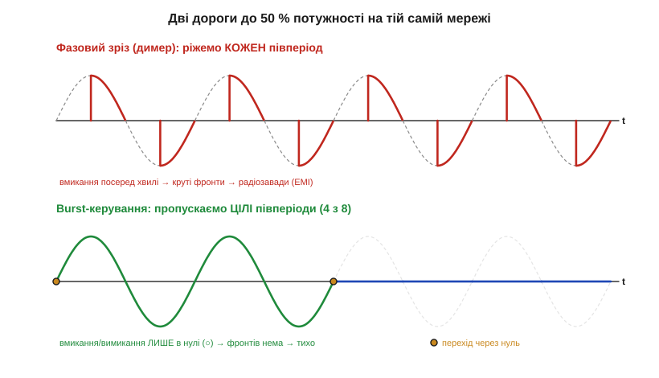
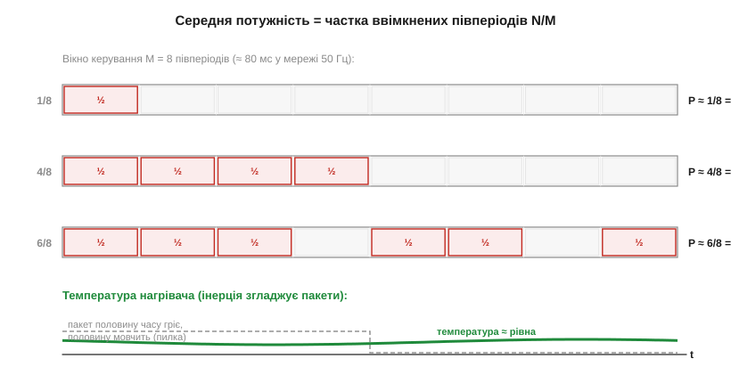

# ⚙️ Burst-керування нагрівачем: цілі півперіоди замість фазового зрізу

> Це алгоритмічна вставка про burst-керування нагрівачем. Спирається на детектор переходу синусоїди через нуль і на те, чим комутація в нулі краща за випадкову. Тут — повний алгоритм: керувати потужністю нагрівача, **відлічуючи цілі півперіоди** мережі, а не зрізаючи кожен по куту, як [фазовий димер](book:electronics/phase-control-dimmer). Менше радіозавад, простіший код — і теплова інерція сама згладжує пакети у рівну температуру.

### Задача

Треба плавно задавати потужність нагрівача (паяльник, екструдер 3D-принтера, бойлер) від мікроконтролера. Перша думка — фазове керування: щопівперіоду відмикати симістор із затримкою, як у димері. Але в нагрівача дві особливості, яких нема в лампи розжарення. По-перше, він **дуже інерційний**: спіраль не встигає охолонути за десятки мілісекунд, тож їй однаково, прийде енергія рівними ковтками чи рідкими пакетами — важлива лише **середня** потужність за секунду-дві. По-друге, фазовий зріз ріже синусоїду посеред хвилі, і цей крутий фронт щопівперіоду випромінює широкий спектр завад (*EMI*) — у мережу, в радіоефір, на сусідні входи АЦП. Для нагрівача платити завадами нема за що. Постає питання: чи можна віддати, скажімо, 50 % потужності, **жодного разу не вмикаючи симістор посеред хвилі**?

### Ідея: рахувати півперіоди, комутувати лише в нулі

Можна. Якщо вмикати й вимикати симістор **лише в момент переходу синусоїди через нуль**, струм у цю мить і так нульовий — стрибка немає, фронт пологий, завад майже нема. А керувати потужністю тоді доводиться по-іншому: не «скільки відрізати від кожної хвилі», а «скільки **цілих** півперіодів із кожних M пропустити». Хочемо половину потужності — пропускаємо 4 півперіоди з 8 і блокуємо решту 4. Чверть — 2 з 8. Це і є burst-керування (*burst fire control*, інакше *integral cycle control* — цілоперіодне керування).


*Рис. Зверху — димер: кожен півперіод рубаний по куту запуску, вмикання припадає на середину хвилі, тож щоразу — крутий фронт і викид завад. Знизу — burst: половину часу пропускаємо **цілі** півперіоди (зелені), половину блокуємо (синя лінія по нулю); перемикання стається лише в точках нуля (○), тому різких фронтів нема взагалі. Середня потужність в обох випадках та сама — 50 %, а спектр завад різний на порядки.*

Середня потужність виходить просто пропорційна частці ввімкнених півперіодів: **P ≈ (N / M) · P_макс**, де N — скільки півперіодів із вікна довжиною M ми пропустили. Жодних інтегралів синуса, як у фазовому керуванні, — лінійна шкала, бо кожен пропущений півперіод несе однакову порцію енергії.


*Рис. Вікно з M = 8 півперіодів (≈ 80 мс у мережі 50 Гц). Червоні комірки «½» — пропущені півперіоди, сірі — заблоковані; частка N/8 і задає потужність. Унизу: «миттєва» потужність стрибає пакетами (сіра пилка), а температура нагрівача (зелена) майже не коливається — теплова стала набагато довша за вікно, тож інерція згладжує ковтки енергії у рівний рівень.*

### Псевдокод

Алгоритм висить на одному перериванні — імпульсі детектора нуля, що приходить **щопівперіоду** (кожні 10 мс у мережі 50 Гц). Усередині — лічильник вікна й проста перевірка, чи цей такт «горить».

```
N_on  = 4              # скільки півперіодів із вікна пропустити (0..M) — задає потужність
M     = 8              # довжина вікна керування у півперіодах
i     = 0              # позиція в поточному вікні
acc   = 0              # накопичувач для рівномірного розподілу (Брезенхем)

# виклик на КОЖНОМУ переході через нуль (від детектора нуля):
on_zero_cross():
    # рівномірно «розмазати» N_on пропусків по M тактах, а не злити в купу:
    acc += N_on
    if acc >= M:
        acc -= M
        fire_triac_for_this_halfcycle()   # дати короткий імпульс на затвор
    # інакше — нічого не робимо, симістор сам згасне в наступному нулі

    i += 1
    if i >= M:
        i = 0          # нове вікно (N_on міг змінитися від регулятора)
```

Ключова деталь — рядок із `acc`: це той самий прийом, що в алгоритмі Брезенхема для прямої лінії. Він **розкидає** пропущені півперіоди рівномірно по вікну (горить-пусто-горить-пусто…), а не вмикає 4 поспіль і потім 4 паузи. Рівномірний візерунок дає менше мерехтіння й м'якший слід у мережі. N_on зазвичай задає зовнішній регулятор температури (наприклад, ПІД), що читає термодавач і підкручує потужність; сам burst — лише виконавчий механізм.

### Складність і пастки на МК

Сам алгоритм короткий, але за його простотою ховається кілька місць, де burst підводить недосвідченого. Пройдімося ними по черзі.

**Дискретність потужності.** Крок регулювання — 1/M. Вікно з 8 півперіодів дає лише 9 рівнів (0…8); для плавності беруть M = 100 і більше. Та чим довше вікно, тим повільніше реагує система — компроміс між плавністю й швидкістю.

**Усе тримається на детекторі нуля.** Якщо імпульс нуля прийшов із джитером або пропав, лічильник «попливе». Перевіряйте період між імпульсами; зник — негайно знімайте керування (нагрівач без нагляду небезпечний).

**Тільки інерційне навантаження.** Burst годиться нагрівачу, бо око й спіраль не помічають пакетів. **Лампу розжарення** так керувати не можна — на низькій потужності вона помітно мерехтить (пакети потрапляють у смугу 1–10 Гц, до якої чутливе око); для світла лишається [фазовий димер](book:electronics/phase-control-dimmer).

**Мерехтіння в мережі (flicker).** Великий нагрівач, що ввімкнувся пакетами, просаджує напругу — сусідські лампи можуть «дихати». Тому енергопостачання нормує flicker; рівномірний розкид (Брезенхем вище) і не надто довгі вікна допомагають.

**Затвор у нулі.** Імпульс на затвор подавайте коротким і прив'язаним до нуля, інакше повернетесь до фазового зрізу з його завадами. Зручно брати **zero-cross-версію [оптодрайвера симістора](book:electronics/triac)**, що сама чекає нуля.

> 🔧 **Навіщо це.** Burst — стандартний спосіб керувати ТЕНами, печами й термоплитами: майже нуль завад, копійчана елементна база й лінійна шкала потужності. Запам'ятайте правило вибору: **інерційне й невидиме навантаження (тепло) — burst у нулі; видиме чи швидке (світло, мотор) — фазове керування**. А спільний кістяк обох — детектор переходу через нуль як джерело такту.
