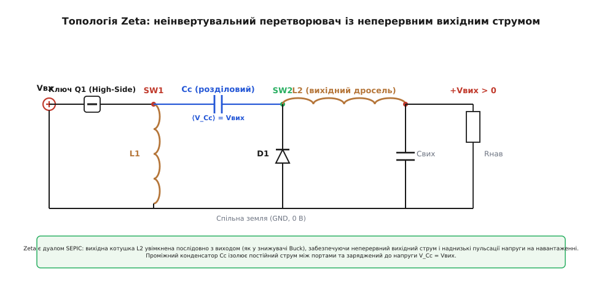
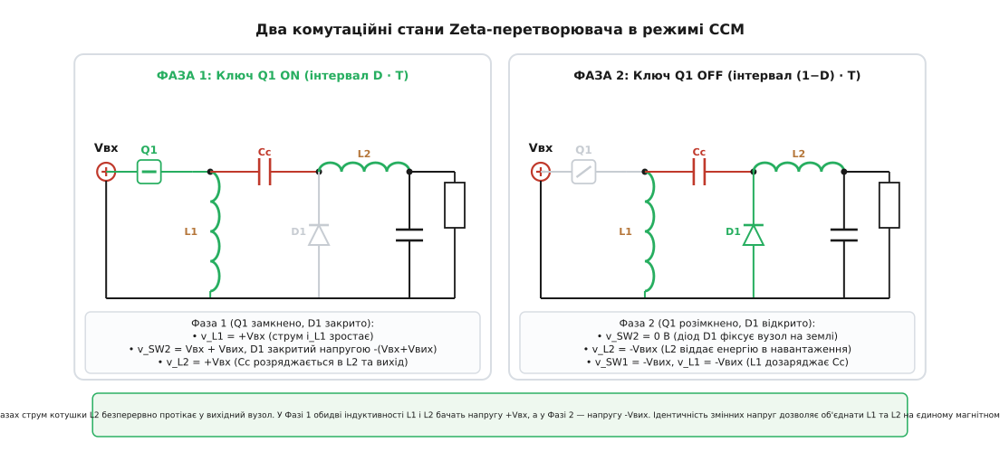
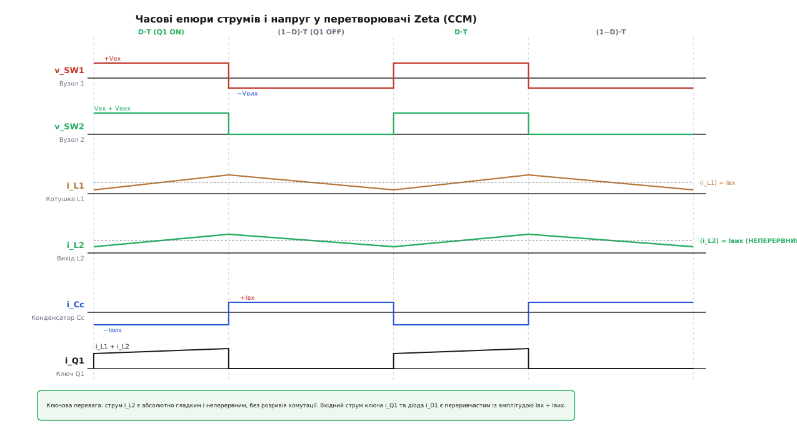
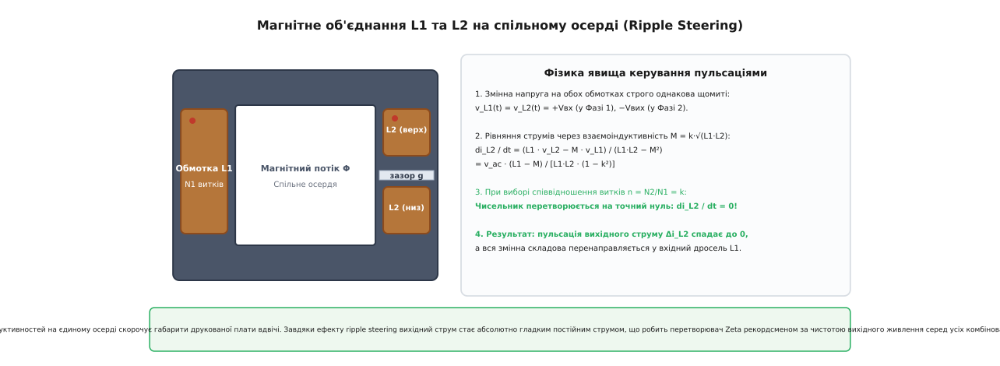
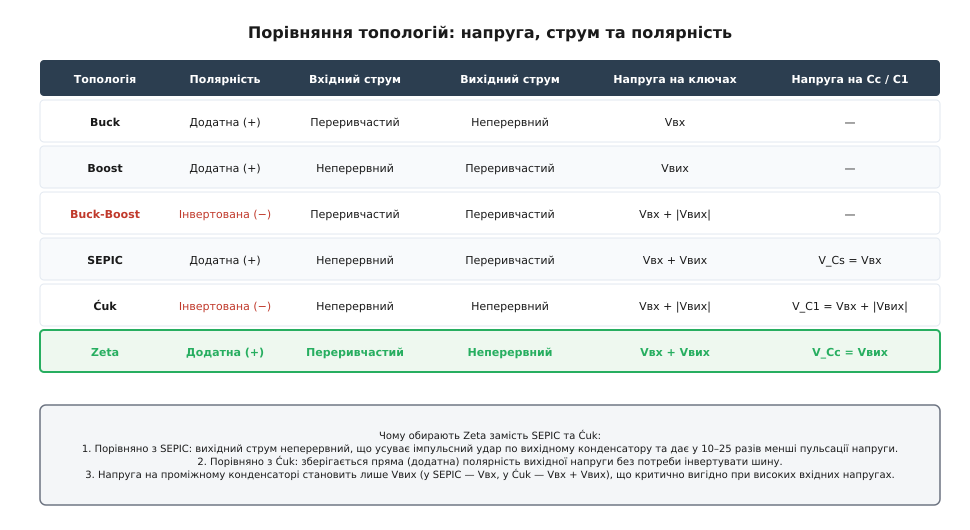

# Zeta-перетворювач: неінвертувальне регулювання напруги з неперервним вихідним струмом

<preknowlist>
- [Знижувальний перетворювач Buck](topic:electronics/buck) — широтно-імпульсне регулювання та неперервний струм вихідної котушки.
- [Підвищувальний перетворювач Boost](topic:electronics/boost) — накопичення енергії в індуктивності та вольт-секундний баланс.
- [Інвертувальний перетворювач Buck-Boost](topic:electronics/buck-boost) — регулювання вище та нижче вхідної напруги з інверсією знака.
- [SEPIC-перетворювач](topic:electronics/sepic) — пряма топологія з ємнісною розв'язкою та неперервним вхідним струмом.
- [Перетворювач Ćuk](topic:electronics/cuk-converter) — передача енергії через проміжний конденсатор та властивості зв'язаних індуктивностей.
- [Зв'язані індуктивності](topic:electronics/coupled-inductor) — дві обмотки на спільному магнітному осерді та керування пульсаціями.
- [Нуль у правій півплощині RHPZ](topic:electronics/rhp-zero) — фазове запізнення в перетворювачах із накопиченням енергії.
- [Динамічні та статичні втрати перемикання](topic:electronics/switching-losses) — опір відкритого каналу, перезаряд ємностей затвора та комутаційні процеси.
</preknowlist>

Коли напруга первинного джерела живлення — наприклад, літій-іонного акумулятора під час циклу розряду (4.2 В → 2.8 В) чи автомобільної бортмережі під час холодного пуску двигуна та скидання навантаження (9 В → 36 В) — дрейфує як вище, так і нижче потрібної стабілізованої шини +12 В або +3.3 В, розробник змушений обирати комбіновану топологію. Класичний [знижувальний перетворювач buck](topic:electronics/buck) здатний лише опускати напругу, [підвищувальний перетворювач boost](topic:electronics/boost) — лише піднімати, а простий [інвертувальний перетворювач buck-boost](topic:electronics/buck-boost) видає напругу від'ємної полярності відносно спільної землі, що неприйнятно для більшості стандартних цифрових та аналогових мікросхем.

Топологія [SEPIC-перетворювача](topic:electronics/sepic) вирішує проблему полярності, формуючи додатну напругу з широким діапазоном регулювання, проте її вихідний струм комутується діодом і є розривним: вихідний конденсатор щотакту приймає важкі прямокутні імпульси струму з крутими фронтами, генеруючи високі високочастотні пульсації напруги та скорочуючи ресурс фільтра. Топологія [перетворювача Ćuk](topic:electronics/cuk-converter) робить вихідний струм неперервним завдяки вихідній котушці, але інвертує знак вихідної напруги.

Поєднати збереження прямої (додатної) полярності виходу, універсальний діапазон зниження й підвищення напруги та гладкий, неперервний струм на вихідному порту дозволяє топологія Zeta (відома також як Inverse SEPIC — зворотний SEPIC). У цій схемі вихідний каскад побудований за принципом знижувального перетворювача з послідовним дроселем, що забезпечує мінімальний рівень пульсацій вихідної напруги без громіздких додаткових LC-фільтрів.


*Принципова схема топології Zeta: вихідний каскад із послідовною індуктивністю L2 забезпечує неперервний вихідний струм, а розділовий конденсатор Cc ізолює постійний струм між входом і виходом.*

---

### Топологічна структура: як побудований перетворювач Zeta

Перетворювач Zeta належить до сімейства чотириполюсників четвертого порядку з проміжним ємнісним накопичувачем енергії. Схема містить два індуктивні накопичувачі (`L1`, `L2`), один проміжний передавальний конденсатор (`Cc`), один активний керований ключ (`Q1`) та один пасивний комутуючий діод (`D1`) або синхронний польовий транзистор (`Q2`).

Розташування компонентів у силовому тракті:

1. **Вхідний активний ключ Q1**: силовий польовий транзистор (зазвичай N-канальний або P-канальний MOSFET), увімкнений у верхнє плече (High-Side) безпосередньо між плюсовою шиною вхідного джерела `Vвх` та першим комутаційним вузлом `SW1`.
2. **Перша індуктивність L1**: підімкнена паралельно між першим комутаційним вузлом `SW1` та спільною шиною землі (GND, 0 В).
3. **Проміжний розділовий конденсатор Cc**: увімкнений послідовно між першим комутаційним вузлом `SW1` та другим комутаційним вузлом `SW2`. Цей конденсатор виконує функцію літаючого ємнісного моста, що передає енергію між вхідним і вихідним каскадами, одночасно забезпечуючи повну гальванічну розв'язку за постійним струмом між входом і виходом.
4. **Випрямний діод D1** (або синхронний ключ `Q2`): увімкнений між спільною землею 0 В (анод) та другим комутаційним вузлом `SW2` (катод).
5. **Вихідна індуктивність L2**: увімкнена послідовно між другим комутаційним вузлом `SW2` та плюсовим виводом вихідного конденсатора `Свих` і навантаження `Rнав`.

#### Дзеркальність відносно SEPIC: концепція дуальності

Термін «Inverse SEPIC» виник через дзеркальну перестановку функціональних блоків:
- У перетворювачі SEPIC вхідний каскад є підвищувальним (вхідний дросель `L1` увімкнений послідовно у вхідну лінію, а ключ `Q1` замикає вузол на землю), що робить вхідний струм неперервним, тоді як вихідний каскад побудований на діоді та вихідному конденсаторі, формуючи переривчастий вихідний струм.
- У перетворювачі Zeta вхідний каскад є знижувальним (ключ `Q1` увімкнений послідовно у вхідну шину, періодично розриваючи вхідний струм), а вихідний каскад містить послідовний дросель `L2` та паралельний діод `D1` (класичний Buck-вихід), що гарантує абсолютно неперервний струм навантаження.

---

### Механізм двох комутаційних фаз у неперервному режимі (CCM)

Робота перетворювача Zeta в режимі неперервної провідності (англ. *Continuous Conduction Mode*, CCM) розпадається на два послідовні інтервали протягом кожного періоду перемикання `T = 1 / f_sw`.


*Два комутаційні стани: у Фазі 1 ключ Q1 відкритий, діод D1 закритий, джерело живить L1, а Cc живить L2; у Фазі 2 ключ Q1 закритий, діод D1 відкривається, L1 дозаряджає Cc, а L2 віддає енергію у навантаження.*

#### Фаза 1: Ключ Q1 відкритий, діод D1 закритий (інтервал `0 ≤ t < D · T`)

За сигналом драйвера транзистор `Q1` відкривається, з'єднуючи вузол `SW1` із вхідною шиною живлення `Vвх`.

1. До першої індуктивності `L1` виявляється прикладеною повна вхідна напруга джерела:
```
v_L1 = v_SW1 − 0
     = Vвх − 0        [потенціал відкритого ключа v_SW1 = Vвх]
     = +Vвх           [додатна напруга на індуктивності]
```
Струм `i_L1` лінійно зростає від свого мінімального значення зі швидкістю `di_L1 / dt = Vвх / L1`. Енергія від вхідного джерела безпосередньо закачується в магнітне поле котушки `L1`.

2. Проміжний конденсатор `Cc` в усталеному режимі постійно заряджений до середньої напруги, що дорівнює вихідній напрузі `V_Cc = Vвих` (з додатним потенціалом на правій обкладці біля вузла `SW2` та від'ємним на лівій біля `SW1`). Оскільки ліва обкладка піднята ключем `Q1` до потенціалу `Vвх`, потенціал правого комутаційного вузла `SW2` підстрибує до сумарного значення:
```
v_SW2 = v_SW1 + V_Cc
      = Vвх + Vвих     [підстановка середньої напруги конденсатора Cc]
```

3. Діод `D1`, увімкнений катодом до вузла `SW2`, а анодом до землі (0 В), опиняється під дією зворотної запірної напруги:
```
v_D1 = 0 − v_SW2
     = −(Vвх + Vвих)   [глибоке зворотне зміщення діода]
```
Діод надійно блокується, вимикаючи зв'язок вузла `SW2` із землею.

4. Конденсатор `Cc` опиняється увімкненим послідовно з джерелом живлення `Vвх` та вихідною котушкою `L2`. До вихідної індуктивності `L2` виявляється прикладеною напруга:
```
v_L2 = v_SW2 − Vвих
     = (Vвх + Vвих) − Vвих   [підстановка потенціалу вузла SW2]
     = +Vвх                  [додатна напруга на вихідній індуктивності]
```
Струм вихідної індуктивності `i_L2` лінійно зростає з похідною `di_L2 / dt = Vвх / L2`. У цій фазі конденсатор `Cc` частково розряджається, передаючи накопичену енергію у вихідний дросель `L2` та навантаження `Rнав`.

5. Струм, що споживається від джерела `Vвх` через відкритий ключ `Q1`, дорівнює сумі струмів обох індуктивностей:
```
i_Q1 = i_L1 + i_L2
```

---

#### Фаза 2: Ключ Q1 закритий, діод D1 відкритий (інтервал `D · T ≤ t < T`)

Транзистор `Q1` вимикається за командою ШІМ-контролера, розриваючи прямий зв'язок вузла `SW1` із джерелом `Vвх`.

1. Неперервні струми індуктивностей `i_L1` та `i_L2` не можуть зупинитися миттєво через дію ЕРС самоіндукції. Струм вихідного дроселя `i_L2` починає витягувати носії заряду з вузла `SW2`, знижуючи його потенціал нижче нуля і зміщуючи діод `D1` у прямому напрямку.

2. Діод `D1` відкривається, з'єднуючи вузол `SW2` із землею і жорстко фіксуючи його потенціал на рівні нуля вольтів (нехтуючи прямим падінням на діоді `V_F ≈ 0.3–0.5 В` для [діода Шотткі](topic:electronics/schottky-diode)):
```
v_SW2 = 0
```

3. До вихідної індуктивності `L2` виявляється прикладеною від'ємна напруга:
```
v_L2 = v_SW2 − Vвих
     = 0 − Vвих        [потенціал відкритого діода v_SW2 = 0 В]
     = −Vвих           [від'ємна напруга розряду індуктивності]
```
Струм вихідної котушки `i_L2` плавно спадає зі швидкістю `di_L2 / dt = −Vвих / L2`. Енергія, накопичена в магнітному полі `L2`, скидається у вихідний конденсатор `Свих` та навантаження `Rнав`. Це повністю еквівалентно фазі розряду дроселя у звичайному знижувальному перетворювачі buck.

4. Оскільки права обкладка конденсатора `Cc` зафіксована діодом на нулі вольтів, а напруга на конденсаторі дорівнює `V_Cc = Vвих`, потенціал лівого комутаційного вузла `SW1` стає від'ємним:
```
v_SW1 = v_SW2 − V_Cc
      = 0 − Vвих       [потенціал вузла SW1 у Фазі 2]
      = −Vвих          [від'ємний потенціал комутаційного вузла]
```

5. До першої індуктивності `L1` виявляється прикладеною напруга:
```
v_L1 = v_SW1 − 0
     = −Vвих − 0
     = −Vвих
```
Струм першої індуктивності `i_L1` плавно зменшується з похідною `di_L1 / dt = −Vвих / L1`. Струм `i_L1` тече знизу вгору з землі через котушку `L1`, перетікає через конденсатор `Cc` зліва направо і замикається через відкритий діод `D1` назад у землю. Цей струм дозаряджає конденсатор `Cc`, відновлюючи його заряд до початкового рівня перед наступним тактом.

6. Струм, що протікає через відкритий діод `D1`, дорівнює сумі струмів обох котушок:
```
i_D1 = i_L1 + i_L2
```

7. Напруга на розімкненому ключі `Q1` сягає суми вхідної та вихідної напруг:
```
v_Q1 = Vвх − v_SW1
     = Vвх − (−Vвих)   [потенціал закритого ключа]
     = Vвх + Vвих
```


*Часові епюри усталеного режиму: струм вихідної індуктивності i_L2 неперервний, струми ключів i_Q1 та i_D1 імпульсні, а напруги на котушках щомиті ідентичні.*

---

### Вольт-секундний баланс та виведення передатної характеристики

В усталеному періодичному режимі інтеграл напруги на кожній ідеальній індуктивності за повний період перемикання `T` дорівнює строго нулю, інакше струм через дросель нескінченно зростав би або спадав із кожним циклом.

Складемо рівняння вольт-секундного балансу для вихідної індуктивності `L2`:

```
∫ v_L2 dt = 0
v_L2(Фаза 1) · D · T + v_L2(Фаза 2) · (1 − D) · T = 0
(Vвх + V_Cc − Vвих) · D + (−Vвих) · (1 − D) = 0        [підстановка напруг фаз]
Vвх · D + V_Cc · D − Vвих · D − Vвих · (1 − D) = 0      [розкриття дужок]
Vвх · D + V_Cc · D − Vвих · (D + 1 − D) = 0             [групування за Vвих]
Vвх · D + V_Cc · D − Vвих = 0                           [спрощення: D + 1 − D = 1]
Vвих = (Vвх + V_Cc) · D                                 [вираз для вихідної напруги]
```

Тепер запишемо рівняння вольт-секундного балансу для першої індуктивності `L1`:

```
∫ v_L1 dt = 0
v_L1(Фаза 1) · D · T + v_L1(Фаза 2) · (1 − D) · T = 0
(+Vвх) · D + (−V_Cc) · (1 − D) = 0                      [підстановка напруг фаз]
Vвх · D − V_Cc · (1 − D) = 0                            [перегрупування доданків]
V_Cc = Vвх · D / (1 − D)                                [середня напруга на Cc]
```

Підставимо отриманий вираз для середньої напруги конденсатора `V_Cc` у перше рівняння для вихідної напруги `Vвих`:

```
Vвих = [Vвх + Vвх · D / (1 − D)] · D
     = Vвх · [1 + D / (1 − D)] · D                      [винесення Vвх за дужки]
     = Vвх · [(1 − D + D) / (1 − D)] · D                [зведення до спільного знаменника]
     = Vвх · [1 / (1 − D)] · D                          [спрощення чисельника]
     = Vвх · D / (1 − D)                                [передатна характеристика]
```

Отримуємо підсумкову передатну характеристику перетворювача Zeta за напругою:

```
Vвих = Vвх · D / (1 − D)
```

Зіставивши вираз для `Vвих` із виразом для `V_Cc`, дістаємо фундаментальну властивість топології Zeta:

```
V_Cc = Vвих
```

Середня постійна напруга на проміжному розділовому конденсаторі `Cc` завжди точно дорівнює стабілізованій вихідній напрузі `Vвих` і взагалі не залежить від коливань вхідної напруги `Vвх`.

Повний математичний апарат із лінеаризацією, матричним описом у просторі станів та розрахунком малосигнальних передатних функцій детально викладено у вставці [математичне виведення передатної характеристики та балансу енергії](topic:electronics/zeta-converter/math-zeta-transfer.md).

#### Чому `V_Cc = Vвих` — колосальна перевага над SEPIC та Ćuk

Порівняємо постійну напругу зміщення на проміжному ємнісному мості в трьох споріднених комбінованих топологіях:
- У SEPIC: `V_Cs = Vвх`.
- У Ćuk: `V_C1 = Vвх + |Vвих|`.
- У Zeta: `V_Cc = Vвих`.

Розглянемо практичний випадок живлення вторинної низьковольтної шини `+5 В` від промислової лінії `48 В` або автомобільної шини `24–36 В`:
- У SEPIC конденсатор `Cs` постійно перебуває під напругою 48 В.
- У перетворювачі Ćuk конденсатор `C1` змушений витримувати сумарну напругу `48 + 5 = 53 В`.
- У Zeta розділовий конденсатор `Cc` працює під постійною напругою всього **5 В**!

Багатошарові [керамічні конденсатори](topic:electronics/converter-caps) (MLCC) класу X7R/X5R зазнають сильного падіння ефективної ємності під дією постійної напруги зміщення (DC-bias effect): конденсатор на 50 В під робочою напругою 48 В втрачає до 60–75% номіналу. У Zeta-перетворювачі конденсатор на 50 В працює при напрузі всього 5 В, зберігаючи понад 95% своєї початкової ємності. Це дозволяє використовувати меншу кількість керамічних корпусів, зменшуючи площу друкованої плати та собівартість приладу.

---

### Баланс заряду та визначення струмів компонентів

Застосуємо закон збереження електричного заряду (ампер-секундний баланс) для розділового конденсатора `Cc` в усталеному режимі (`∫ i_Cc dt = 0`):

- У Фазі 1 (тривалість `D · T`) через конденсатор протікає струм вихідної котушки `i_L2` у напрямку розряду ємності: `i_Cc = −i_L2`.
- У Фазі 2 (тривалість `(1 − D) · T`) конденсатор дозаряджається струмом першої котушки `i_L1`: `i_Cc = +i_L1`.

```
∫ i_Cc dt = 0
(−I_L2) · D · T + (+I_L1) · (1 − D) · T = 0
I_L1 · (1 − D) = I_L2 · D
I_L1 = I_L2 · D / (1 − D)
```

Оскільки вихідна індуктивність `L2` включена послідовно у вихідне коло, її середній струм дорівнює струму навантаження:

```
I_L2 = Iвих
```

Підставляючи `I_L2 = Iвих`, знаходимо середній струм першої індуктивності:

```
I_L1 = Iвих · D / (1 − D) = Iвх
```

Середні струми індуктивностей у Zeta розподілені строго функціонально:
- Перша котушка `L1` несе середній струм, що точно дорівнює струму споживання від джерела: `⟨i_L1⟩ = Iвх`.
- Друга котушка `L2` несе середній струм, що точно дорівнює струму споживання навантаження: `⟨i_L2⟩ = Iвих`.

Перевіримо закон збереження потужності для ідеального перетворювача:

```
Pвх = Vвх · Iвх
    = Vвх · [Iвих · D / (1 − D)]             [підстановка виразу для Iвх]
    = [Vвх · D / (1 − D)] · Iвих             [перегрупування співмножників]
    = Vвих · Iвих                            [підстановка виразу для Vвих]
    = Pвих                                   [вихідна потужність]
```

---

### Неперервний вихідний струм та фільтрація напруги

Головна експлуатаційна перевага перетворювача Zeta перед SEPIC полягає у формі струму, що надходить у вихідний фільтр.

У SEPIC вихідний діод закритий протягом усього інтервалу відкритого стану ключа `D · T`. Струм у вихідний конденсатор вкидається рваними імпульсами з амплітудою `Iвх + Iвих`. Це призводить до значного імпульсного струмового навантаження [еквівалентного послідовного опору ESR](topic:electronics/converter-caps) вихідних конденсаторів, викликаючи їхній інтенсивний нагрів та генеруючи високі пульсації вихідної напруги:

```
ΔVвих(SEPIC) ≈ Iвих · D / (Свих · f_sw)
```

У перетворювачі Zeta вихідна котушка `L2` увімкнена послідовно безпосередньо перед навантаженням. Струм через `L2` не зазнає комутаційних розривів і є абсолютно гладкою пилкоподібною хвилею постійного струму з невеликим розмахом пульсацій `Δi_L2`.

Пульсація вихідної напруги визначається лише інтегралом трикутної ділянки струму дроселя:

```
ΔVвих(Zeta) = Δi_L2 / (8 · Свих · f_sw)
            = Vвх · D / (8 · L2 · Свих · f_sw²)
```

Порівняємо пульсації двох топологій при типовому відносному розмаху пульсацій струму дроселя `Δi_L2 = 0.30 · Iвих` та коефіцієнті заповнення `D = 0.5`:

```
ΔVвих(SEPIC) / ΔVвих(Zeta) = [Iвих · D / (Свих · f_sw)] / [Δi_L2 / (8 · Свих · f_sw)]
                           = (8 · Iвих · D) / Δi_L2
                           = (8 · Iвих · 0.5) / (0.30 · Iвих)
                           = 4.0 / 0.30
                           ≈ 13.3 раза
```

При однакових значеннях ємності вихідного конденсатора `Свих` та робочої частоти `f_sw` перетворювач Zeta забезпечує у **10–25 разів менший рівень пульсацій вихідної напруги**, ніж SEPIC!

Це робить топологію Zeta ідеальним вибором для живлення чутливих аналогових трактів, прецизійних вимірювальних АЦП/ЦАП, оптичних та лазерних модулів, де будь-який високочастотний шум на шині живлення безпосередньо погіршує співвідношення сигнал/шум.

---

### Зв'язані індуктивності та керування пульсаціями (Ripple Steering)

Особлива фізична властивість перетворювача Zeta розкривається при аналізі змінної складової напруги на індуктивностях.

Порівняємо миттєві напруги на `L1` та `L2` у кожному комутаційному такті:
- У Фазі 1 (ключ `Q1` відкритий): на котушці `L1` діє напруга `+Vвх`, на котушці `L2` — напруга `+Vвх`.
- У Фазі 2 (ключ `Q1` закритий): на котушці `L1` діє напруга `−Vвих`, на котушці `L2` — напруга `−Vвих`.

Форми змінної складової напруги на обох індуктивностях є абсолютно ідентичними за амплітудою та синхронними за часом протягом усього періоду комутації:

```
v_L1(t) = v_L2(t) = v_ac(t)
```

Це означає, що дві окремі індуктивності `L1` та `L2` можна намотати на **одному спільному магнітному осерді** з коефіцієнтом трансформації витків `1:1` (`N1 = N2`).


*Зв'язані індуктивності: завдяки синхронній змінній напрузі магнітний зв'язок M скеровує пульсації струму у вхідну обмотку L1, зводячи пульсації вихідного струму L2 до нуля.*

#### Фізика явища Ripple Steering

Розглянемо систему двох магнітно зв'язаних обмоток із коефіцієнтом магнітного зв'язку `k = M / √(L1 · L2)` та відношенням витків `n = N2 / N1 = √(L2 / L1)`:

```
v_L1 = L1 · (di_L1 / dt) + M · (di_L2 / dt)
v_L2 = M · (di_L1 / dt) + L2 · (di_L2 / dt)
```

Розв'яжемо систему відносно похідної вихідного струму `di_L2 / dt`:

```
di_L2 / dt = (L1 · v_L2 − M · v_L1) / (L1 · L2 − M²)
```

Оскільки напруги на обмотках ідентичні (`v_L1 = v_L2 = v_ac`):

```
di_L2 / dt = v_ac · (L1 − M) / [L1 · L2 · (1 − k²)]
           = v_ac · [L1 · (1 − k · n)] / [L1 · L2 · (1 − k²)]
```

Якщо налаштувати геометрію обмоток та повітряний зазор так, щоб виконувалася умова:

```
n = 1 / k     (або при симетричній намотці k ≈ 1: n = 1)
```

Чисельник виразу перетворюється на точний нуль:

```
1 − k · n = 0   ⇒   di_L2 / dt = 0
```

Пульсація вихідного струму `Δi_L2` стає **рівною строго нулю**! 

Змінна ЕРС взаємоіндукції, наведена з первинної обмотки `L1` через спільний магнітний потік осердя, у кожну мить періоду точно врівноважує прикладену зовнішню змінну напругу. Уся енергія пульсацій магнітного потоку скидається у вхідну обмотку `L1`, тоді як струм вихідного дроселя перетворюється на ідеально рівну горизонтальну лінію постійного струму.

---

### Порівняльний аналіз навантаження компонентів

Зіставимо електричні напруги та форми струмів у шести базових імпульсних топологіях.


*Порівняння навантаження: перетворювач Zeta забезпечує неінвертовану напругу та неперервний вихідний струм, а напруга на проміжному конденсаторі становить лише Vвих.*

| Топологія | Полярність виходу | Вхідний струм | Вихідний струм | Напруга на ключі | Напруга на діоді | Напруга на ємнісному мості |
| :--- | :--- | :--- | :--- | :--- | :--- | :--- |
| **Buck** | Додатна (+) | Переривчастий | Неперервний | `Vвх` | `Vвх` | — |
| **Boost** | Додатна (+) | Неперервний | Переривчастий | `Vвих` | `Vвих` | — |
| **Buck-Boost**| Інвертована (−) | Переривчастий | Переривчастий | `Vвх + \|Vвих\|` | `Vвх + \|Vвих\|` | — |
| **SEPIC** | Додатна (+) | Неперервний | Переривчастий | `Vвх + Vвих` | `Vвх + Vвих` | `V_Cs = Vвх` |
| **Ćuk** | Інвертована (−) | Неперервний | Неперервний | `Vвх + \|Vвих\|` | `Vвх + \|Vвих\|` | `V_C1 = Vвх + \|Vвих\|`|
| **Zeta** | Додатна (+) | Переривчастий | Неперервний | `Vвх + Vвих` | `Vвх + Vвих` | `V_Cc = Vвих` |

#### Напруга на силових напівпровідниках

Як і в усіх комбінованих топологіях четвертого порядку (SEPIC, Ćuk, Buck-Boost), силовий транзистор `Q1` та випрямний діод `D1` у схемі Zeta піддаються стресу сумарної напруги:

```
V_Q1,max = V_D1,max = Vвх + Vвих = Vвх / (1 − D)
```

При перетворенні напруги `12 В → 12 В` (`D = 0.5`) напруга на розімкненому ключі та закритому діоді становить щонайменше 24 В плюс комутаційні викиди від індуктивності витоку. Для надійної роботи напівпровідники обирають із запасом за напругою 50–100%.

#### Струмове навантаження розділового конденсатора Cc

Увесь потік активної потужності проходить через проміжний конденсатор `Cc`. Діючий [середньоквадратичний струм (RMS)](topic:electronics/rms-current) через `Cc`:

```
I_Cc,rms = Iвих · √( D / (1 − D) ) = Iвих · √( Vвих / Vвх )
```

При `Vвх = 12 В, Vвих = 12 В` та струмі навантаження `Iвих = 2.0 А`:

```
I_Cc,rms = 2.0 · √( 0.5 / 0.5 ) = 2.0 А
```

Через конденсатор `Cc` безперервно протікає високочастотний струм силою 2 А. Звичайні алюмінієві електролітичні конденсатори в цьому вузлі непридатні через перегрів на високому ESR. Як `Cc` використовують виключно керамічні конденсатори класу X7R або полімерні танталові конденсатори з низьким ESR.

---

### Особливості драйвера керування верхнім ключем (High-Side Drive)

Найбільш помітною схемотехнічною відмінністю перетворювача Zeta від SEPIC є розташування активного ключа `Q1`.

У SEPIC транзистор `Q1` прив'язаний витоком до землі (Low-Side Switch), тому його затвором можна керувати безпосередньо логічним сигналом від мікроконтролера або ШІМ-драйвера з живленням 0–5 В.

У Zeta транзистор `Q1` увімкнений у верхнє плече (High-Side Switch):
- Стік транзистора підключений до вхідної шини `Vвх`.
- Витік транзистора підімкнений до першого комутаційного вузла `SW1`.

Потенціал вузла `SW1` змінюється стрибком у кожному циклі комутації:
- У Фазі 1 потенціал `SW1` дорівнює `+Vвх`.
- У Фазі 2 потенціал `SW1` опускається нижче землі до від'ємного рівня `−Vвих`.

Повний розмах коливань потенціалу витоку становить `Vвх + Vвих`.

#### Способи реалізації драйвера

1. **P-канальний MOSFET (P-MOSFET)**:
   Витік P-MOSFET підключається до шини `Vвх`, а стік — до вузла `SW1`. Для відмикання транзистора напругу на затворі потрібно опустити на 5–10 В нижче `Vвх`. Керування здійснюється простим транзисторним перетворювачем рівня (Level Shifter) на базі малопотужного біполярного або N-MOSFET транзистора.
   *Обмеження*: P-канальні польові транзистори мають у 2.5–3 рази вищий питомий опір відкритого каналу `R_DS(on)` порівняно з N-канальними транзисторами аналогічної площі кристала через меншу рухливість дірок у кремнії.
2. **N-канальний MOSFET із бутстрепним живленням**:
   Використовується високоефективний N-MOSFET із низьким `R_DS(on)`. Для живлення верхнього драйвера застосовують плаваючий [бутстрепний конденсатор](topic:electronics/bootstrap-capacitor) `C_boot` та швидкодіючий бутстрепний діод. Оскільки у Фазі 2 вузол `SW1` опускається до від'ємної напруги `−Vвих`, бутстрепний конденсатор ефективно заряджається від внутрішньої шини драйвера.
3. **Ізольований драйвер або імпульсний трансформатор затвора (GDT)**:
   Застосовується у високовольтних промислових модулях для забезпечення максимальної стійкості до завад і захисту керуючих кіл.

---

### Динамічна стійкість та нуль у правій півплощині (RHPZ)

Математична модель перетворювача Zeta містить чотири реактивні накопичувачі енергії (`L1`, `L2`, `Cc`, `Свих`), що робить його динамічною системою **четвертого порядку**.

Передатна функція перетворювача від коефіцієнта заповнення до вихідної напруги `G_vd(s)` містить:
- Подвійний резонансний полюс контуру вихідної фільтрації `L2 − Свих`.
- Додатковий подвійний резонансний полюс контуру перенесення енергії `L1 − Cc`.
- **Нуль у правій півплощині комплексної площини** (англ. *Right-Half-Plane Zero*, RHPZ).

#### Фізична природа RHP-нуля

При різкому збільшенні шпаруватості `D` (спроба регулятора швидко підняти вихідну напругу у відповідь на накид навантаження) транзистор `Q1` залишається відкритим більшу частку періоду. Проміжний конденсатор `Cc` віддає підвищений струм у вихідний контур, через що напруга на ньому починає тимчасово просідати, поки перша котушка `L1` не встигне накопичити достатню енергію для його поповнення.

У результаті вихідна напруга в перші мікросекунди не зростає, а навпаки, додатково просідає. 

Частота RHP-нуля для Zeta-перетворювача виражається формулою:

```
f_RHPZ = [Rнав · (1 − D)²] / (2 · π · D · L1)
```

RHP-нуль додає фазове запізнення на −90°, не зменшуючи при цьому коефіцієнт підсилення в контурі регулювання. Щоб уникнути самозбудження системи, смугу пропускання петлі зворотного зв'язку `f_c` (частоту одиничного зрізу) обмежують рівнем:

```
f_c ≤ f_RHPZ / 4
```

У контурі зворотного зв'язку застосовують операційний компенсатор 3-го типу (Type-III) або схему струмового керування (Current Mode Control) із потактовою компенсацією нахилу пилкоподібного сигналу (Slope Compensation).

---

### Струмове керування та компенсація субгармонійних коливань

При використанні пікового струмового керування (Peak Current Mode Control) внутрішній струмовий контур безпосередньо контролює струм ключа `i_Q1 = i_L1 + i_L2`. Це перетворює вхідну пару індуктивностей на еквівалентне джерело керованого струму, спрощуючи динамічну модель силового каскаду до системи першого порядку на низьких частотах.

Проте при коефіцієнті заповнення `D > 0.5` у контурі виникає схильність до субгармонійних коливань на половинній частоті комутації `f_sw / 2`. Будь-яке випадкове збурення струму індуктивності `ΔI_0` на початку періоду розростається за період відповідно до коефіцієнта згасання:

```
ΔI_1 = −ΔI_0 · [D / (1 − D)]
```

При `D > 0.5` модуль множника перевищує одиницю (`|−D / (1 − D)| > 1`), і коливання стають нестійкими. Для стабілізації контуру до сигналу вимірюваного струму додають компенсуючий штучний пилкоподібний сигнал із нахилом `S_e`:

```
S_e ≥ 0.5 · S_f
```
де `S_f = Vвих / L_eq` — швидкість спаду струму індуктивностей під час Фази 2.

---

### Синхронне випрямлення та двонапрямлена робота

У базовій топології пряме падіння напруги на діоді `D1` (`V_F ≈ 0.45 В`) є головним джерелом втрат потужності, розсіюючи:

```
P_diode = V_F · Iвих = 0.45 В · 2.0 А = 0.90 Вт
```

Заміна діода `D1` на синхронний N-канальний польовий транзистор `Q2` (з витоком на землі GND та стоком на вузлі `SW2`) кардинально змінює енергетику схеми:

1. **Зниження втрат провідності**: при опорі каналу `R_DS(on) = 15 мОм` втрати розсіювання становлять:
   ```
   P_sync = I_D1,rms² · R_DS(on) = (2.05 А)² · 0.015 Ом ≈ 0.063 Вт
   ```
   Втрати падають у 14 разів, що підвищує ККД модуля на 3.5–4.5%.
2. **Простота драйвера синхронного ключа**: оскільки витік `Q2` підімкнений до системної землі (0 В), для керування його затвором підходить звичайний драйвер нижнього плеча (Low-Side Driver) без ізоляції та без бутстрепу.
3. **Двонапрямлена передача енергії**: повністю синхронний перетворювач Zeta стає симетричним і здатний передавати енергію як прямо від джерела `Vвх` у шину `Vвих`, так і рекуперувати енергію у зворотному напрямку з виходу назад у вхідне джерело.

---

### Практичний інженерний розрахунок компонентів на числовому прикладі

Для закріплення інженерної методики розрахуємо силовий каскад перетворювача Zeta з такими параметрами:
- Вхідна напруга: `Vвх = 9...36 В` (номінал `12 В`).
- Вихідна напруга: `Vвих = +12.0 В`.
- Струм навантаження: `Iвих = 2.0 А` (вихідна потужність `Pвих = 24.0 Вт`).
- Частота комутації: `f_sw = 250 кГц` (період `T = 4.0 мкс`).
- Допустима відносна пульсація струму в котушках: `Δi / I = 30%`.
- Допустима пульсація вихідної напруги: `ΔVвих ≤ 10 мВ`.

#### Крок 1: Розрахунок діапазону шпаруватості D

```
D = Vвих / (Vвх + Vвих)

При Vвх = 12 В (номінал):  D_nom = 12 / (12 + 12) = 0.500
При Vвх = 9 В (мінімум):   D_max = 12 / (9 + 12) = 12 / 21 ≈ 0.571
При Vвх = 36 В (максимум): D_min = 12 / (36 + 12) = 12 / 48 = 0.250
```

#### Крок 2: Розрахунок струмів схеми

Максимальний середній вхідний струм споживання (при `Vвх,min = 9 В`):

```
Iвх,max = Iвих · D_max / (1 − D_max) = 2.0 · 0.571 / 0.429 ≈ 2.66 А
```

Амплітуда пульсацій струму:

```
Δi_L1 = 0.30 · Iвх,max = 0.30 · 2.66 А ≈ 0.80 А
Δi_L2 = 0.30 · Iвих = 0.30 · 2.0 А = 0.60 А
```

#### Крок 3: Розрахунок індуктивностей L1 та L2

Для першої індуктивності `L1`:

```
L1 = (Vвх,min · D_max) / (Δi_L1 · f_sw)
   = (9 В · 0.571) / (0.80 А · 250 000 Гц)    [підстановка напруги, шпаруватості та частоти]
   = 5.14 В·мкс / 200 кА/с                    [перемноження чисельника та знаменника]
   ≈ 25.7 мкГн                                [розрахункова індуктивність L1]
```
Обираємо стандартний номінал силового дроселя **27 мкГн** зі струмом насичення `I_sat ≥ 2.66 + 0.40 = 3.06 А`.

Для вихідної індуктивності `L2`:

```
L2 = (Vвх,min · D_max) / (Δi_L2 · f_sw)
   = (9 В · 0.571) / (0.60 А · 250 000 Гц)    [підстановка параметрів вихідного кола]
   = 5.14 В·мкс / 150 кА/с                    [перемноження чисельника та знаменника]
   ≈ 34.3 мкГн                                [розрахункова індуктивність L2]
```
Обираємо стандартний номінал **33 мкГн** зі струмом насичення `I_sat ≥ 2.0 + 0.30 = 2.30 А`.

#### Крок 4: Розрахунок проміжного конденсатора Cc

Середня напруга на конденсаторі: `V_Cc = Vвих = 12 В`.
Задамо допустиму пульсацію `ΔV_Cc ≤ 0.6 В` (`5%` від `V_Cc`):

```
Cc = (Iвих · D_max) / (ΔV_Cc · f_sw)
   = (2.0 А · 0.571) / (0.6 В · 250 000 Гц)    [підстановка струму навантаження та допустимої пульсації]
   = 1.142 / 150 000                           [інтеграл заряду за інтервал розряду]
   ≈ 7.6 мкФ                                   [мінімальна ємність Cc]
```

Діючий струм пульсацій через `Cc`:

```
I_Cc,rms = Iвих · √( D_max / (1 − D_max) )
         = 2.0 · √( 0.571 / 0.429 )            [підстановка струму та заповнення]
         = 2.0 · √1.33                         [обчислення підкореневого виразу]
         ≈ 2.31 А                              [діючий струм через Cc]
```

Встановлюємо паралельну батарею з **трьох керамічних конденсаторів 4.7 мкФ / 50 В (X7R, 1210)**. Сумарна ємність становить 14.1 мкФ, що з урахуванням ефекту DC-bias гарантує збереження ефективної ємності понад 10 мкФ та допустимий струм понад 4 А RMS.

#### Крок 5: Розрахунок вихідного фільтруючого конденсатора Свих

Для забезпечення пульсації `ΔVвих ≤ 10 мВ`:

```
Свих = Δi_L2 / (8 · ΔVвих · f_sw)
     = 0.60 А / (8 · 0.010 В · 250 000 Гц)     [підстановка розмаху пульсацій струму дроселя L2]
     = 0.60 / 20 000                           [перемноження знаменника]
     = 30 мкФ                                  [розрахункова вихідна ємність]
```

Обираємо паралельне з'єднання двох керамічних конденсаторів по **22 мкФ / 25 В (X7R, 1206)** та одного танталового полімерного конденсатора **47 мкФ / 25 В з ультранизьким ESR = 25 мОм**.

#### Крок 6: Вибір ключів

Максимальна робоча напруга блокування:

```
V_block = Vвх,max + Vвих = 36 + 12 = 48 В
```

З урахуванням запасу обираємо силові компоненти на робочу напругу **не менше 80–100 В**:
- Транзистор `Q1`: N-канальний MOSFET на 100 В із `R_DS(on) ≤ 16 мОм` (наприклад, BSC160N10NS).
- Діод `D1`: діод Шотткі на 100 В / 10 А (наприклад, STPS10H100D) або синхронний MOSFET.

Повний числовий код симуляції перехідних процесів та розрахунку теплового балансу наведено у вставці [інженерний розрахунок та числову модель симуляції перетворювача Zeta](topic:electronics/zeta-converter/proj-zeta-sim.md).

---

### Трасування друкованої плати та мінімізація контурів комутації

Хоча вихідний струм перетворювача Zeta є неперервним, усередині схеми діє високочастотний контур швидкого перемикання струму (Hot Loop), утворений транзистором `Q1`, проміжним конденсатором `Cc` та діодом `D1`.

Швидкість наростання струму в цьому контурі сягає `di/dt > 100 А/мкс`. Будь-яка паразитна індуктивність доріжок призводить до появи високочастотних перенапруг і випромінювання електромагнітних завад (ЕМС).

Правила проектування друкованої плати:
1. Конденсатор `Cc` встановлюється безпосередньо між виводом стоку `Q1` та катодом `D1`. Площа контуру `Q1 − Cc − D1` повинна бути зведена до мінімуму.
2. Під усією силовою частиною на другому шарі 4-шарової плати розташовується суцільний полігон землі (GND Plane), що екранує електромагнітні поля поворотними струмами.
3. Комутаційні вузли `SW1` та `SW2` мають високу швидкість зміни напруги `dv/dt`. Їхні провідники роблять короткими й широкими, віддаляючи від чутливих аналогових ліній зворотного зв'язку.

---

### Сфери застосування та практичний вибір топології

Перетворювач Zeta застосовують у завданнях, де потрібне одночасне виконання трьох жорстких умов:
1. **Широкий діапазон вхідної напруги**: робота як вище, так і нижче номінальної вихідної напруги без зупинки генерації.
2. **Незмінна додатна полярність**: формування прямої напруги відносно спільної землі.
3. **Наднизький рівень вихідних пульсацій струму й напруги**: живлення чутливих АЦП/ЦАП, прецизійних датчиків, оптичних трансиверів, малошумливих аудіопідсилювачів та драйверів лазерних діодів.

> 🔧 **Навіщо це.** Zeta обирають тоді, коли шум вихідного струму SEPIC змушував би ставити додатковий LC-фільтр другого порядку або лінійний стабілізатор LDO після імпульсника. Завдяки вбудованому в топологію вихідному дроселю `L2` перетворювач Zeta одразу віддає чистий, неперервний струм, скорочуючи загальну кількість моточних вузлів на платі та забезпечуючи високий ККД.
