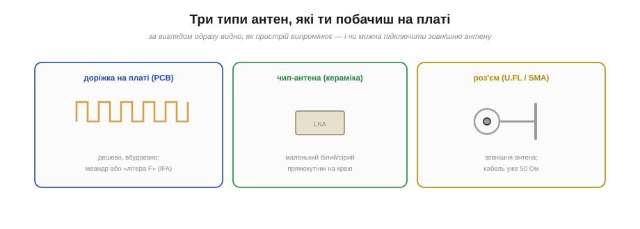
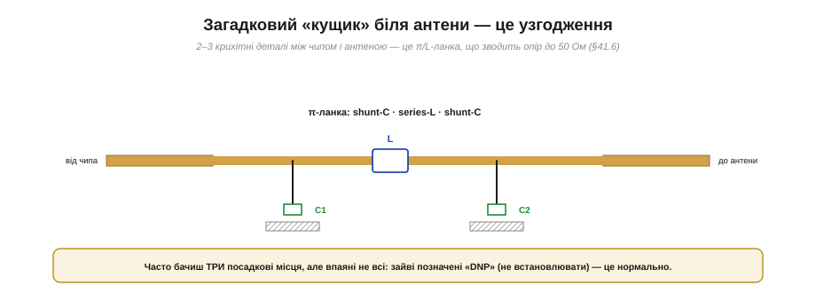
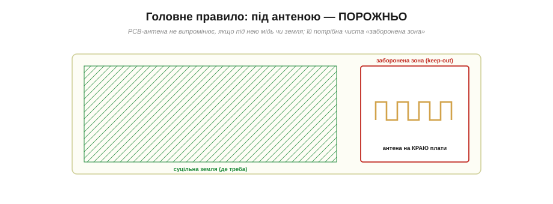

# На що дивитись у ВЧ-частині чужої плати

Уся теорія антен набуває справжньої цінності тоді, коли ти береш до рук **реальну плату** з радіо — модуль ESP32, приймач, RC-апаратуру, давач — і **розумієш**, що там до чого. Радіочастотна частина має впізнаваний «почерк»: ті самі блоки, ті самі деталі, ті самі типові помилки, хоч би хто плату робив. Навчитися читати цей почерк — означає за хвилину сказати, чи спроєктовано радіо грамотно, де антена, чому вона погано працює і чи можна щось виправити. Ця навичка спирається на вміння [читати схеми](root:embedded/reading-schematics).

### ВЧ-тракт: один і той самий ланцюг

Перше, що варто закарбувати: майже **в кожному** радіомодулі ВЧ-сигнал проходить **той самий ланцюг** блоків. Упізнаєш його — упізнаєш будь-яку плату.

*Стандартний ланцюг: **радіочип** (з кварцом поряд) → **узгоджувальна π/L-ланка** → інколи **фільтр/балун** → **50-омна доріжка** → **антена**. Уся фізика радіо, вишикувана в ряд на платі.*

Розклад завжди приблизно однаковий. **Радіочип** (трансивер — ESP32, [nRF24](book:connect/nrf24-radio), CC1101 тощо) із обов'язковим **кварцом** поряд, що задає точну частоту. Далі — [узгоджувальна ланка](book:communications/vswr), маленький кущик деталей. Інколи — **фільтр** (давить гармоніки) або **балун**. Потім — [50-омна доріжка](book:communications/transmission-lines), що веде до **антени**. Знаючи цей ланцюг, ти орієнтуєшся в будь-якому модулі: очима проходиш від чипа до краю плати й «читаєш» кожну ланку. Усі окремі блоки тут лежать разом, як намисто.

### Три типи антен, які ти побачиш

Найперше, що варто впізнати на платі, — **яка там антена**. Варіантів практично три.

***Доріжка на платі** (PCB-антена) — звивистий «меандр» або «літера F» (IFA): дешево й вбудовано. **Чип-антена** — маленький білий/сірий керамічний прямокутник на краю. **Роз'єм** (U.FL або SMA) — для зовнішньої антени; кабель до неї вже 50-омний.*

Розпізнати легко. **PCB-антена** — це характерна **звивиста доріжка** (меандр) або Г-подібна «літера F» (*inverted-F*, IFA) прямо на краю плати; найдешевший варіант, де провідник [згорнуто до резонансної довжини](book:communications/resonance-dipole). **Чип-антена** — крихітний **керамічний** прямокутник (зазвичай білий чи сірий) на краю, схожий на велику деталь; компактна, трохи дорожча. **Роз'єм** — мініатюрний **U.FL** (для тонкого коаксіалу) або більший **SMA** (під накрутну антену) — означає, що пристрій працює із **зовнішньою** антеною, а сам кабель до неї вже [50-омний](book:communications/transmission-lines). Часто на платі є **і** PCB-антена, **і** місце під U.FL — з перемичкою, якою обирають, котру задіяти.

### Загадковий «кущик» біля антени

Між чипом і антеною майже завжди тулиться **кущик** із двох-трьох крихітних деталей. Новачка він спантеличує — а це і є **узгоджувальна ланка**.

*Типова **π-ланка**: shunt-конденсатор → послідовна котушка → shunt-конденсатор. Ці 2–3 деталі «перетворюють» опір антени до 50 Ом, заганяючи КСХ до 1. Часто бачиш три посадкові місця, але впаяні не всі — зайві позначені «DNP» (не встановлювати).*

Це [узгоджувальна ланка](book:communications/vswr): маленька схема з котушок (L) і конденсаторів (C), що математично зводить опір антени до потрібних 50 Ом. Найтиповіша форма — **π-ланка** (shunt-C, series-L, shunt-C). Корисно знати дві речі. По-перше, ці деталі **крихітні** (типорозмір 0402 чи навіть 0201) і їх легко проґавити — але саме від них залежить узгодження. По-друге, виробники часто розводять **три** посадкові місця «про запас», а впаюють лише потрібні; невстановлені позначають **DNP** (*do not populate*). Тож якщо бачиш порожні майданчики в кущику — це не брак, а нормальна гнучкість конструкції.

### Головне правило: під антеною — порожньо

Якщо запам'ятати з цієї теми **лише одне** — хай це буде воно. PCB-антена **не випромінює**, якщо під нею є мідь чи земля.

*Земляний полігон має бути **скрізь, де треба** (опора для мікросмужки), але **під антеною й навколо неї — чиста «заборонена зона»** (keep-out): жодної міді, жодної землі, жодних доріжок. Антену завжди виносять **на край** плати. Земля під PCB-антеною — найчастіша й найгірша помилка.*

Чому так? Земля під антеною **закорочує** її поле й «з'їдає» випромінювання — антена глухне. Тому навколо PCB-антени завжди лишають **заборонену зону** (*keep-out*): прямокутник, де немає **нічого** — ні землі, ні доріжок, ні компонентів. І саму антену завжди виносять **на край** плати, подалі від металу. Це правило №1 ВЧ-розведення, і саме його найчастіше порушують новачки: розливають суцільну землю «для надійності» по всій платі — і вбивають антену. Побачив мідь під меандром антени — майже напевно знайшов причину поганого зв'язку.

### Як ця ж сама частина виглядає на схемі

Той самий ВЧ-тракт читається й на **схемі**: ті самі блоки мають упізнавані символи, і навичка [читання схем](root:embedded/reading-schematics) застосовується тут напряму.

*На схемі шукай: вивід **ANT** (або RF) радіочипа; **кварц** біля чипа; **π-ланку** із символів котушки й двох конденсаторів на землю; мітку **50 Ω** на ВЧ-колі; і символ **антени** (або роз'єм U.FL/SMA) на кінці.*

Читаючи [схему радіомодуля](root:embedded/reading-schematics), веди оком той самий ланцюг. Знайди **радіочип** і його вивід **ANT** чи **RF**; поряд — **кварц** (символ із двох рисок). Від виводу ANT іде ВЧ-коло, часто з міткою **«50 Ω»**, а на ньому — **π-ланка**: послідовна котушка (L) і два конденсатори (C) на землю. Закінчується все символом **антени** (трикутник/«вусики») або **роз'ємом**. Уміючи зіставити схему з платою, ти розумієш ВЧ-вузол повністю: де сигнал, як його узгоджують, куди він іде.

### Червоні прапорці

Корисно мати в голові список **тривожних ознак** — побачив таке, і одразу ясно: радіо тут зроблено абияк.

*Шість найчастіших гріхів: земля під PCB-антеною; довга звивиста доріжка до антени (з вигинами й перехідними); антена впритул до металу чи батареї; відсутність суцільної землі під мікросмужкою; «чужий» кабель замість 50-омного; антена, затиснута в центрі плати між компонентами.*

Перебери їх по пам'яті, коли тримаєш плату. **Земля під антеною** — головний гріх. **Довга, звивиста доріжка** до антени з вигинами й перехідними отворами — кожен злам і vias псує [50-омну лінію](book:communications/transmission-lines). **Антена біля металу чи батареї** — метал розладнує її й глушить. **Немає суцільної землі** під мікросмужкою — лінія передачі без опори не тримає 50 Ом. **«Чужий» кабель** (75-омний від ТБ або просто «дріт») замість 50-омного коаксіалу — гарантоване неузгодження. **Антена в центрі** плати, затиснута компонентами, замість виносу на край. Кожен прапорець — це втрачені децибели або зовсім непрацездатне радіо.

> 🔧 **Навіщо це.** Ця навичка — твій «рентген» для будь-якого радіопристрою, свого чи чужого. Коли модуль погано зв'язується, не кидайся міняти чип — спершу **подивись на антену**: який тип, чи вільно під нею, чи коротка й пряма доріжка, чи на місці узгоджувальний кущик, чи суцільна земля під мікросмужкою. Дев'ять разів із десяти проблема саме тут, а не в «слабкому передавачі». А якщо проєктуєш сам — тримай напохваті чеклист (нижче), винось антену на край, лишай keep-out і веди 50-омну доріжку коротко й прямо. Це найдешевший спосіб не зіпсувати радіо ще до того, як воно ввімкнулося.

### Чеклист огляду за хвилину

Зведімо все це в одну практичну перевірку.

*Вісім пунктів: радіочип і кварц поряд; тип антени (PCB/чип/роз'єм); коротка пряма 50-омна доріжка; узгоджувальна π/L-ланка; порожня заборонена зона під антеною; суцільна земля під мікросмужкою; екран-кришка над ВЧ-вузлом; чисте живлення чипа (ферит + конденсатори).*

Пройдися цими вісьмома пунктами — і ти оглянув ВЧ-частину професійно. Знайди **радіочип і кварц**; визнач **тип антени**; перевір, що **доріжка** до неї коротка, пряма й 50-омна; знайди **узгоджувальну ланку**; переконайся, що під антеною **порожньо** (keep-out); що під мікросмужкою **суцільна земля**; пошукай **екран-кришку** над ВЧ-вузлом (металева коробочка, що захищає від завад); і перевір **чисте живлення** чипа (ферит + конденсатори, бо радіо чутливе до шуму по живленню). Вісім поглядів — і повна картина.

---

Ось і вся «чорна скринька» антени на платі, розкладена повністю: як вона [перетворює струм на хвилю](book:communications/antenna), чому має [резонансну довжину](book:communications/resonance-dipole) λ/4 чи λ/2, як [спрямовує випромінювання](book:communications/antenna-gain), чому критична [поляризація](book:communications/antenna-polarization), як влаштовані [лінії передачі](book:communications/transmission-lines) й звідки взялися 50 Ом, що таке [КСХ](book:communications/vswr) і чому неузгодження шкодить. Зібравши все це разом, ти дивишся на ВЧ-вузол реальної плати вже не як на загадку: видно кожну ланку — чип, кварц, узгодження, лінію, антену — і одразу впадають в очі помилки, через які радіо «не добиває». Це і є практичний рентген, заради якого варто було розбирати фізику радіо до останньої деталі.
