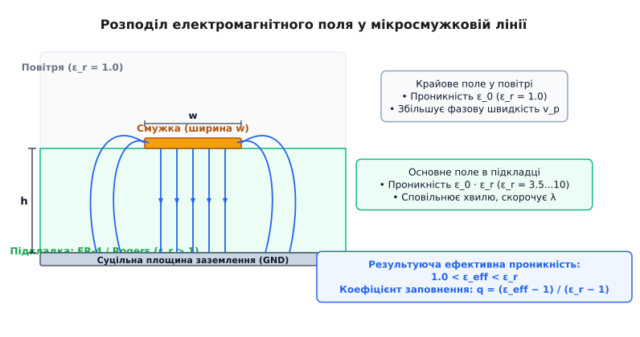
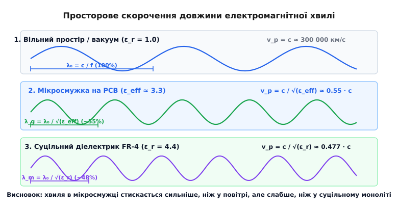
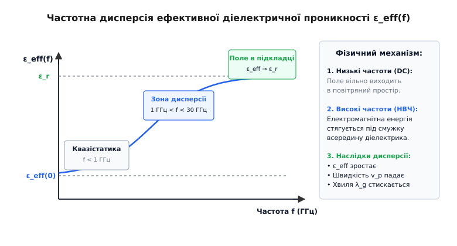
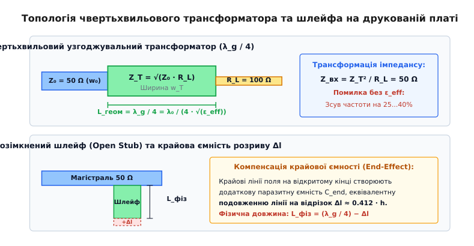

# Ефективна довжина хвилі у діелектрику

<preknowlist>
- [Лінії передачі](topic:communications/transmission-lines) — хвильовий опір Z₀, біжучі та стоячі хвилі, розподілені параметри L і C.
- [Скін-ефект](topic:electronics/skin-effect) — витіснення струму високої частоти на поверхню провідника й поверхневий опір.
- [Коефіцієнт стоячої хвилі (КСХ)](topic:communications/vswr) — відбиття напруги на межі неоднорідностей та критерії узгодження.
- [Швидкість сигналу](topic:physics/signal-speed) — скінченна швидкість поширення електромагнітного поля у фізичних середовищах.
</preknowlist>

Під час розробки вихідного підсилювача потужності на частоту 2.45 ГГц інженер розраховує чвертьхвильовий (`λ/4`) узгоджувальний трансформатор для узгодження вихідного опору транзистора 12.5 Ом зі стандартним 50-омним трактом на склотекстоліті FR-4 (`ε[r] = 4.4`, товщина `h = 1.6 мм`). Якщо визначити чвертьхвильову довжину за швидкістю світла у вакуумі (`λ₀ / 4 = 30.6 мм`), резонансна частота кола виявиться зміщеною до 1.34 ГГц — на робочій частоті трансформатор перетвориться на реактивне навантаження, коефіцієнт стоячої хвилі злетить до 4.0, а 36% потужності передавача відіб'ється назад у кристал транзистора, викликаючи його перегрів і тепловий пробій.

Якщо ж інженер спробує врахувати діелектрик за формулою суцільного моноліту `λ_m = λ₀ / √(ε[r])` (`λ_m / 4 = 14.6 мм`), коло однаково буде розладнане: центральна частота зміститься до 2.82 ГГц (помилка на 370 МГц), а зворотні втрати погіршаться з розрахункових −26 дБ до −4.5 дБ. Помилка виникає через те, що друкована мікросмужкова лінія не є однорідним середовищем: сигнальний провідник лежить на межі діелектричної підкладки та повітряного простору.

Електромагнітне поле поширюється одночасно в двох різних середовищах — частково крізь діелектрик плати, а частково крізь повітря над нею. Реальна швидкість поширення хвилі та її просторовий період визначаються не об'ємною проникністю `ε[r]`, а комбінованою величиною — **ефективною діелектричною проникністю** `ε[eff]`, яка задає **ефективну довжину хвилі** (guided wavelength, `λ[g]`) у мікросмужковій лінії.

## 1. Електромагнітна хвиля у суцільному діелектрику

У порожньому просторі (вакуумі) швидкість поширення електромагнітного збурення визначається фундаментальними константами — електричною сталою `ε₀ ≈ 8.854 · 10⁻¹² Ф/м` та магнітною сталою `μ₀ ≈ 1.257 · 10⁻⁶ Гн/м`:

```
c = 1 / √(ε₀ · μ₀) ≈ 2.997925 · 10⁸ м/с          [швидкість світла у вакуумі]
```

Коли плоска електромагнітна хвиля потрапляє у суцільний, безмежний, однорідний діелектрик із відносною діелектричною проникністю `ε[r]` та відносною магнітною проникністю `μ[r]`, електричне поле хвилі зміщує зв'язані заряди всередині атомів і молекул. Виникає поляризація речовини: наведені атомарні диполі коливаються синхронно з частотою коливань поля `f` і випромінюють вторинні електромагнітні хвилі.

### 1.1. Мікроскопічні механізми поляризації
У твердих діелектриках діють три основні механізми поляризації, кожен із яких має власну частотну межу:
1. **Електронна поляризація:** зміщення негативної електронної хмари відносно позитивного атомного ядра. Має малий час релаксації (`10⁻¹⁵...10⁻¹⁶ с`) і діє в усьому радіо-, мікрохвильовому та оптичному діапазонах.
2. **Іонна (ґраткова) поляризація:** зміщення протилежно заряджених іонів у кристалічній ґратці керамічних наповнювачів (`Al₂O₃`, `TiO₂`). Зберігає пружність аж до інфрачервоного діапазону (`10¹²...10¹³ Гц`).
3. **Орієнтаційна (дипольна) поляризація:** поворот полярних молекул або бічних груп полімерних ланцюгів (наприклад, епоксидних смол у склотекстолітах FR-4) у напрямку змінного поля. Через значну масу та в'язкість полімерних молекул час орієнтації становить `10⁻⁹...10⁻¹⁰ с`. На частотах понад 1–2 ГГц диполі не встигають повертатися вслід за полем, відстають по фазі й викликають сильне розсіювання енергії у вигляді тепла (діелектричну релаксацію).

### 1.2. Фазова швидкість та просторове стиснення хвилі
Інтерференція первинної падаючої хвилі з запізнілим вторинним випромінюванням поляризованих диполів уповільнює результуючий хвильовий фронт. Із хвильового рівняння Гельмгольца для напруженості електричного поля `∇²E + k²E = 0` фазова швидкість поширення `v[p]` у немагнітному діелектрику (`μ[r] = 1.0`) становить:

```
v[p] = 1 / √(ε₀ · ε[r] · μ₀) = c / √(ε[r])        [фазова швидкість у монолітному діелектрику]
```

Оскільки часовий період коливань `T = 1 / f` задається генератором і лишається строго незмінним під час переходу з одного середовища в інше, просторовий період хвилі — **довжина хвилі у середовищі `λ[m]`** — пропорційно зменшується:

```
λ[m] = v[p] · T = v[p] / f = c / (f · √(ε[r])) = λ₀ / √(ε[r]) [скорочення довжини хвилі]
```

Відношення швидкості хвилі в матеріалі до швидкості світла у вакуумі називають **коефіцієнтом укорочення** (Velocity Factor, `VF`):

```
VF = v[p] / c = 1 / √(ε[r])                       [коефіцієнт укорочення для однорідного середовища]
```

У повністю закритих лініях передачі з однорідним заповненням — таких як коаксіальні кабелі або смужкові лінії (Stripline), де центральний провідник зусібіч оточений суцільним діелектриком — це співвідношення виконується з високою точністю. Наприклад, у коаксіальному кабелі з суцільною поліетиленовою ізоляцією (`ε[r] = 2.25`) хвиля поширюється зі швидкістю `v[p] = c / √2.25 = c / 1.5 = 200 000 км/с` (`VF = 0.667`), а довжина хвилі на частоті 100 МГц скорочується з 3.00 метрів у повітрі до 2.00 метрів всередині кабелю.

## 2. Парадокс відкритої межі: природа квазі-ТЕМ хвилі

На відміну від коаксіального кабелю, відкрита мікросмужкова лінія (Microstrip) на друкованій платі влаштована принципово асиметрично: плоский сигнальний провідник шириною `w` і товщиною `t` розміщений на верхньому боці діелектричної пластини товщиною `h`, нижній бік якої вкритий суцільним мідним шаром заземлення (Ground Plane).


*Поперечний переріз мікросмужки: розділення силових ліній електричного поля між діелектричною підкладкою та повітряним напівпростором.*

Якщо припустити, що вздовж мікросмужки поширюється суто поперечна електромагнітна хвиля (ТЕМ-мода, у якої поздовжні складові поля `E[z] = 0` та `H[z] = 0`), виникає фундаментальна суперечність із граничними умовами електродинаміки Максвелла:

1. На межі розділу двох діелектриків тангенціальні (дотичні до межі) складові електричного поля повинні бути неперервними: `E[1t] = E[2t]`.
2. Щоб хвильовий фронт лишався неперервним уздовж лінії, фазова швидкість хвилі над межею (у повітрі) та під межею (у підкладці) зобов'язана бути однаковою.
3. Проте для чистої ТЕМ-хвилі швидкість у повітрі має дорівнювати `c = 1 / √(ε₀μ₀)`, тоді як у підкладці вона становить `c / √(ε[r])`. Два середовища вимагають різних швидкостей для однієї й тієї самої хвилі.

Через неможливість задовольнити граничні умови суто поперечними полями, на межі «діелектрик — повітря» неминуче виникають слабкі поздовжні компоненти поля — як електричного `E[z]`, так і магнітного `H[z]`. 

Результуюча хвиля в мікросмужці перестає бути чистою ТЕМ-хвилею і перетворюється на **квазі-ТЕМ моду** (Quasi-TEM mode). На частотах нижче 10–15 ГГц амплітуда поздовжніх компонентів поля становить менше 1–2% від поперечних складових, тому лінію можна з високою інженерною точністю аналізувати за допомогою квазістатичного наближення.

### 2.1. Розподіл потоку потужності Пойнтінга
Вектор Пойнтінга `S = E × H` показує просторову густину потоку електромагнітної енергії. У мікросмужковій лінії:
- **60–85% енергії** зосереджено безпосередньо у діелектрику під металевою смужкою, де напруженість поля максимальна.
- **15–40% енергії** переноситься через зовнішнє крайове поле (Fringing Field) у повітрі над смужкою та з її боків.
- На гострих бічних ребрах провідника виникає крайова сингулярність густини струму `J_s(x) ∝ 1 / √(1 − (2x/w)²)`, що викликає локальний перегрів металу та додаткові омічні втрати.

## 3. Ефективна діелектрична проникність та коефіцієнт укорочення

Оскільки частина енергії електричного поля замикається через діелектричну пластину (`ε[r] > 1`), а частина виходить назовні у відкрите повітря (`ε[r] = 1.0`), мікросмужкова лінія поводиться так, ніби вона занурена в гіпотетичне однорідне середовище з проміжним значенням проникності — **ефективною діелектричною проникністю** `ε[eff]`:

```
1.0 < ε[eff] < ε[r]
```

Фізично `ε[eff]` можна уявити через **коефіцієнт заповнення** (filling factor) `q`, який показує, яка частка енергії електричного поля зосереджена всередині твердої підкладки:

```
ε[eff] = 1.0 + q · (ε[r] − 1.0)                   [розподіл енергії поля через фактор заповнення q]
```

Значення коефіцієнта `q` залежить від геометрії провідника — відношення ширини смужки `w` до товщини діелектрика `h` (`u = w / h`):
- Для дуже широких мікросмужок (`w ≫ h`, низький хвильовий опір `Z₀ < 25 Ом`) майже все поле затиснуте безпосередньо під провідником всередині діелектрика. Фактор заповнення наближається до одиниці (`q → 1`), а `ε[eff] → ε[r]`.
- Для дуже вузьких мікросмужок (`w ≪ h`, високий хвильовий опір `Z₀ > 100 Ом`) значна частина поля виходить через краї у повітряний простір. Фактор заповнення падає (`q ≈ 0.5...0.6`), а `ε[eff]` опускається ближче до середнього арифметичного `(ε[r] + 1) / 2`.


*Порівняння просторового періоду хвилі у вільному просторі, на мікросмужці та в суцільному об'ємному діелектрику на однаковій частоті.*

Для точного інженерного розрахунку квазістатичної проникності `ε[eff](0)` та хвильового опору `Z₀` використовують апроксимації Гаммерстада та Єнсена, детальний математичний вивід яких наведено у [математичній моделі мікросмужкових ліній](topic:electronics/wavelength-in-medium/math-microstrip-dispersion.md).

Базова напівемпірична формула Шнайдера (M. V. Schneider) дає наочну оцінку для смужок довільної ширини:

```
ε[eff] ≈ ((ε[r] + 1) / 2) + ((ε[r] − 1) / 2) · (1 / √(1 + 12 · (h / w)))
```

Знаючи ефективну проникність `ε[eff]`, обчислюють реальну фазову швидкість сигналу `v[p]`, коефіцієнт укорочення `VF` та ефективну довжину хвилі `λ[g]`:

```
v[p] = c / √(ε[eff])                              [фазова швидкість у мікросмужці]
VF = v[p] / c = 1 / √(ε[eff])                     [коефіцієнт укорочення мікросмужки]
λ[g] = v[p] / f = c / (f · √(ε[eff])) = λ₀ · VF   [довжина хвилі у мікросмужці]
```

Для стандартної 50-омної доріжки на матеріалі FR-4 (`ε[r] = 4.4`, `w/h ≈ 1.9`, `w = 3.0 мм` при `h = 1.6 мм`) ефективна проникність становить `ε[eff] ≈ 3.33`. Відповідно, коефіцієнт укорочення дорівнює `VF = 1 / √3.33 ≈ 0.548`, а швидкість сигналу — `v[p] ≈ 164 300 км/с` (близько 16.4 см за одну наносекунду або погонна затримка `t[pd] = 1 / v[p] ≈ 6.09 нс/м`).

## 4. Порівняння базових планарних топологій друкованих плат

Вибір типу друкованої лінії передачі визначає ступінь однорідності середовища поширення, наявність дисперсії та величину ефективної довжини хвилі:

| Топологія лінії | Мода поширення | Ефективна проникність ε_eff | Дисперсія | Випромінювання | Зручність монтажу компонентів |
| :--- | :--- | :--- | :--- | :--- | :--- |
| **Мікросмужка (Microstrip)** | Квазі-ТЕМ | 1.0 < ε_eff < ε_r | Помірна | Присутнє на вигинах | Ідеальна (поверхневий шар) |
| **Смужкова лінія (Stripline)** | Чиста ТЕМ | ε_eff = ε_r (суцільна) | Відсутня | Нульове (повне екранування) | Потребує глухих перехідних отворів |
| **Копланарний хвилевід (GCPW)** | Квазі-ТЕМ | Нижча за мікросмужку | Мінімальна | Дуже низьке | Висока (потрібні зшивальні отвори) |
| **Заглиблена смужка (Embedded)**| Квазі-ТЕМ | Ближча до ε_r | Помірна | Низьке | Потребує розкриття маски/шарів |

### 4.1. Смужкова лінія (Stripline) як ідеальне ТЕМ-середовище
У смужковій лінії сигнальний провідник розташований у внутрішньому шарі плати й симетрично оточений діелектриком зверху та знизу двома суцільними площинами заземлення. 

Оскільки діелектрик заповнює 100% об'єму поширення поля:
- Ефективна проникність строго дорівнює паспортній проникності підкладки: `ε[eff] = ε[r]`.
- Фазова швидкість строго постійна для всіх частот: `v[p] = c / √(ε[r])`.
- Частотна дисперсія відсутня, а коефіцієнт укорочення `VF = 1 / √(ε[r])`.

Смужкові лінії є найкращим вибором для широкосмугових узгоджувальних кіл та цифрових шин надвисокої швидкості (PCIe 5.0, 112G SerDes), де фазові спотворення неприпустимі.

### 4.2. Копланарний хвилевід із заземленням (GCPW)
У копланарному хвилеводі шар заземлення розміщується не лише під провідником, а й на верхньому шарі з обох боків сигнальної доріжки з фіксованим зазором `s`. 

Значна частина силових ліній замикається горизонтально через бічні повітряні зазори. В результаті:
- Ефективна діелектрична проникність `ε[eff]` у GCPW нижча, ніж у мікросмужки на тій самій підкладці, що збільшує фазову швидкість `v[p]`.
- Електромагнітне поле жорстко локалізоване між доріжкою та бічною землею, що кардинально знижує паразитне випромінювання на частотах понад 20–30 ГГц та усуває міжканальні перехресні завади (Crosstalk).
- Для запобігання збудженню небажаної щілинної моди (Slotline Mode) обидва бічні полігони заземлення з'єднують рядами перехідних отворів із кроком не більше `λ[g] / 8`.

### 4.3. Зв'язані мікросмужки: парна та непарна ефективні проникності
У диференціальних мікросмужкових парах або планарних спрямованих відгалужувачах взаємний зв'язок розщеплює хвилю на парну (Even) та непарну (Odd) моди. 

Для парної моди струми течуть синфазно, і електричне поле спрямоване суто в підкладку (`ε[eff,e] ≈ 3.4`). Для непарної моди струми протифазні, і сильне горизонтальне поле частково замикається через повітря між доріжками (`ε[eff,o] ≈ 2.8`). Через різницю швидкостей `v[p,odd] > v[p,even]` у диференційних сигналах виникає часовий фазовий перекіс (Phase Skew), а спрямованість мікросмужкових відгалужувачів обмежується рівнем `15–20 дБ`.

### 4.4. Заглиблена мікросмужка (Embedded Microstrip)
Коли зверху поверхневої мікросмужки наноситься шар захисного діелектрика або склеювального препрегу (наприклад, у 4-шарових платах), відкрита межа з повітрям перекривається полімером. Це піднімає коефіцієнт заповнення `q` на `10–20%`, наближаючи `ε[eff]` до `ε[r]`. Якщо при розрахунку товщини не врахувати захисний шар препрегу, хвильовий опір виявиться заниженим на `3–5 Ом`, а розрахована довжина `λ[g]` — довшою за реальну.

## 5. Частотна дисперсія ефективної проникності

У низькочастотному діапазоні (до 1 ГГц) ефективна проникність `ε[eff]` залишається практично сталою і визначається суто геометричним співвідношенням `w/h`. Проте зі зростанням частоти до мікрохвильового діапазону (2–30 ГГц) виникає явище **частотної дисперсії**.


*Частотна залежність ефективної проникності ε[eff](f): стягування електромагнітної енергії всередину підкладки на НВЧ.*

Фізичний механізм дисперсії пов'язаний зі зміною структури електромагнітного поля:
- На низьких частотах поперечні хвильові числа малі, і електричні силові лінії вільно розширюються далеко в повітряний простір над платою.
- Із підвищенням частоти довжина хвилі зменшується, а густина змінного струму та енергія магнітного й електричного полів динамічно втягуються в область із вищою оптичною густиною (всередину діелектрика з високим `ε[r]`).
- У граничному випадку нескінченно високої частоти (`f → ∞`) практично 100% енергії хвилі концентрується між смужкою та шаром заземлення, і ефективна проникність асимптотично наближається до повної проникності підкладки: `ε[eff](f) → ε[r]`.

Зростання `ε[eff](f)` із частотою призводить до трьох важливих наслідків:
1. **Зниження фазової швидкості:** що вища частота гармонійної складової сигналу, то повільніше вона поширюється лінією (`v[p](f) = c / √(ε[eff](f))`).
2. **Нелінійне скорочення довжини хвилі:** на високих частотах `λ[g]` зменшується швидше, ніж пропорційно `1/f`.
3. **Дисперсійне розмиття цифрових фронтів:** у швидкісних цифрових шинах (PCIe 5.0/6.0, PAM4 112G) високочастотні гармоніки прямокутного імпульсу відстають у часі від низькочастотних, що викликає міжсимвольну інтерференцію (ISI) та закриття очної діаграми.

Для точного моделювання дисперсії застосовують рівняння Манфреда Кіршнінга та Рольфа Янсена, алгоритмічну реалізацію яких мовами C та C++ подано у [програмному синтезаторі мікросмужкових кіл](topic:electronics/wavelength-in-medium/proj-quarterwave-designer.md).

## 6. Проектування пасивних НВЧ-пристроїв на основі λ[g]

Ефективна довжина хвилі `λ[g]` визначає просторові розміри всіх базових функціональних вузлів планарного радіотракту:

### 6.1. Чвертьхвильові (λ/4) трансформатори імпедансу
Якщо відрізок лінії передачі з хвильовим опором `Z[T]` має електричну довжину `θ = β · L = π / 2` (тобто геометричну довжину `L = λ[g] / 4`), його вхідний імпеданс при підключенні навантаження `R[L]` описується формулою трансформації ліній:

```
Z[in] = Z[T]² / R[L]                              [формула чвертьхвильового інвертора імпедансу]
```

Щоб узгодити вхідну лінію з хвильовим опором `Z₀` (наприклад, 50 Ом) із навантаженням `R[L]` (наприклад, низьким вхідним опором транзистора 12.5 Ом або високоомною антеною 200 Ом), хвильовий опір чвертьхвильової секції обирають як середнє геометричне:

```
Z[T] = √(Z₀ · R[L])                               [хвильовий опір узгоджувального трансформатора]
```


*Топологічне виконання λ/4 трансформатора та розімкненого шлейфа з компенсацією крайової ємності розриву Δl.*

### 6.2. Дільники потужності Вілкінсона (Wilkinson Power Divider)
Дільник Вілкінсона ділить вхідну потужність навпіл між двома ізольованими виходами. Він складається з двох чвертьхвильових гілок із хвильовим опором `Z_b = √2 · Z₀ = 70.71 Ом` та резистора міжканальної ізоляції номіналом `2 · Z₀ = 100.0 Ом`.

Довжина кожної гілки розраховується строго за ефективною проникністю для ширини 70.71 Ом:

```
L_branch = λ[g, 70.7 Ом] / 4 = c / (4 · f · √(ε[eff, 70.7 Ом]))
```

Якщо розрахувати довжину гілок за параметрами 50-омної лінії (`ε[eff, 50 Ом]`), виникає фазова розбіжність, яка погіршує ізоляцію між вихідними каналами з −30 дБ до −14 дБ.

### 6.3. Квадратурні спрямовані відгалужувачі (Branch-Line Coupler)
Квадратурний міст формує на виходах два сигнали рівної амплітуди (−3 дБ) зі зсувом фаз строго 90°. Топологія являє собою замкнене чотирикутне кільце з чотирьох чвертьхвильових відрізків:
- Дві поздовжні секції з хвильовим опором `Z₀ / √2 = 35.35 Ом` і фізичною довжиною `L₁ = λ[g, 35.35 Ом] / 4`.
- Дві поперечні секції з хвильовим опором `Z₀ = 50.00 Ом` і фізичною довжиною `L₂ = λ[g, 50 Ом] / 4`.

Оскільки ширина секції 35.35 Ом майже втричі більша за ширину 50 Ом, їхні ефективні проникності помітно різняться (`ε[eff, 35.35] > ε[eff, 50]`). Довжини секцій `L₁` та `L₂` обов'язково повинні розраховуватися індивідуально.

### 6.4. Ступінчасто-імпедансні фільтри нижніх частот (Hi-Z / Low-Z Filter)
У мікросмужкових фільтрах послідовні котушки індуктивності реалізують тонкими високоомними смужками (`Z_h ≈ 100...120 Ом`), а паралельні конденсатори — широкими низькоомними прямокутниками (`Z_l ≈ 15...25 Ом`).

Фізична довжина кожної секції визначається електричною довжиною та власною ефективною швидкістю поширення:

```
l_L = (L_filter · c) / (Z_h · √(ε[eff, h]))       [довжина індуктивного вузького сегмента]
l_C = (C_filter · c · Z_l) / √(ε[eff, l])         [довжина ємнісного широкого сегмента]
```

## 7. Узгоджувальні шлейфи та крайовий ефект (End-Effect Δl)

У мікросмужкових схемах замість зосереджених індуктивностей та конденсаторів часто застосовують відрізки ліній — **узгоджувальні шлейфи** (Stubs), увімкнені паралельно до магістральної лінії.

Вхідний опір розімкненого на кінці шлейфа довжиною `L` є чисто реактивним (ємнісним або індуктивним залежно від довжини):

```
Z[in, open] = −j · Z₀ · cot(β · L) = −j · Z₀ · cot(2π · L / λ[g]) [опір розімкненого шлейфа]
```

Для створення еквівалента ідеального короткого замикання по високій частоті (наприклад, у ланцюгах подачі напруги живлення зміщення транзисторів — DC Bias Tee) використовують розімкнений чвертьхвильовий шлейф (`L = λ[g] / 4`), оскільки `cot(π / 2) = 0`, що дає нульовий вхідний імпеданс на робочій частоті.

### 7.1. Фізична суть крайового ефекту розриву

На фізичному розімкненому кінці мікросмужки електричний струм змушений зупинитися, проте електричне поле не обривається миттєво. Силові лінії вигинаються назовні через торцеву поверхню мідного провідника та проходять крізь повітря й діелектрик до площини заземлення.

Це опукле крайове поле запасає додаткову електростатичну енергію, що еквівалентно підключенню на кінці лінії малої паразитної крайової ємності `C[end] ≈ 10...40 фФ`.

Для врахування цієї ємності розімкнений кінець геометрично замінюють еквівалентним подовженням лінії на додаткову величину `Δl`. За формулою Гаммерстада відносне подовження становить:

```
Δl / h ≈ 0.412 · ((ε[eff] + 0.3) / (ε[eff] − 0.258)) · ((w/h + 0.264) / (w/h + 0.8))
```

Для типових друкованих ліній величина подовження становить приблизно третину товщини діелектрика: `Δl ≈ (0.3...0.45) · h`.

**Правило корекції топології:** реальна геометрична довжина розімкненого шлейфа `L[phys]` повинна бути вкорочена на величину `Δl`:

```
L[phys] = (λ[g] / 4) − Δl                         [геометрична довжина з урахуванням крайового ефекту]
```

Якщо на підкладці товщиною `h = 0.813 мм` розімкнений шлейф має `Δl = 0.35 мм`, відсутність компенсації зменшить резонансну частоту шлейфа на 4–6%, що перетворить очікуване «віртуальне коротке замикання» на реактивну ємнісну заваду.

### 7.2. Паразитні неоднорідності: сходинки ширини та зламові вигини
Окрім розривів лінії, на розповсюдження хвилі впливають інші геометричні неоднорідності:
1. **Сходинка ширини (Step Discontinuity):** при переході від магістралі 50 Ом до трансформатора 31.6 Ом виникає стрибок ємності, що еквівалентно підключенню конденсатора `C_step ≈ 15...50 фФ`.
2. **Прямокутний злам лінії (90° Corner Bend):** у гострому куті виникає локальний надлишок металізації, який діє як паразитний ємнісний фільтр нижніх частот. Для усунення відбиття кут зрізають (виконують мітралізацію), причому оптимальний відсоток скосу становить `M = 52.0 + 65.0 · exp(-1.35 · w/h) %`.

### 7.3. Одношлейфове узгодження комплексних імпедансів
Для узгодження довільного комплексного імпедансу антени або транзистора `Z_L = R_L + j · X_L` використовують комбінацію прямої лінії передачі довжиною `d` та паралельного шлейфа довжиною `l_stub`:
1. Відрізок лінії `d` трансформує комплексну вхідну провідність до значення, дійсна частина якого строго дорівнює хвильовій провідності тракту: `Re(Y_in) = Y₀ = 1 / Z₀`.
2. Паралельний розімкнений або замкнений шлейф `l_stub` генерує чисто реактивну провідність протилежного знака `Im(Y_stub) = −Im(Y_in)`, повністю нейтралізуючи реактивність і забезпечуючи `КСХ = 1.0` на виході.

## 8. Втрати в діелектрику та температурна стабільність фази

На розповсюдження хвилі в діелектрику впливають не лише дійсні значення проникності, а й комплексні втрати та температурна нестабільність матеріалів.

### 8.1. Тангенс кута діелектричних втрат (tan δ)

Комплексна діелектрична проникність записується як `ε = ε' − j · ε''`, де дійсна частина `ε'` відповідає за накопичення енергії та фазову швидкість, а уявна частина `ε''` описує розсіювання енергії у вигляді тепла через змінну поляризацію диполів.

Відношення уявної частини до дійсної називається **тангенсом кута втрат**:

```
tan δ = ε'' / ε'                                  [коефіцієнт діелектричних втрат]
```

Погонне діелектричне згасання хвилі `α[d]` (у дБ/м) у мікросмужці становить:

```
α[d] ≈ 27.3 · (f / c) · (ε[r] / √(ε[eff])) · ((ε[eff] − 1) / (ε[r] − 1)) · tan δ
```

Для FR-4 з високим `tan δ ≈ 0.02` на частоті 5.8 ГГц діелектричні втрати сягають `15–20 дБ/м` (1.5–2 дБ на кожні 10 см траси). Для спеціалізованих високочастотних ламінатів на основі кераміки та вуглеводнів (Rogers RO4350B, `tan δ = 0.0037`) або тефлону (RT/duroid 5880, `tan δ = 0.0009`) втрати у 5–20 разів нижчі.

Детальний порівняльний аналіз діелектричних матеріалів та їхніх технологічних обмежень подано у [довіднику НВЧ-підкладок](topic:electronics/wavelength-in-medium/comp-rf-substrates.md).

### 8.2. Омічні втрати провідника та вплив шорсткості фольги
Через скін-ефект струм високої частоти тече тонким приповерхневим шаром товщиною `δ = 1 / √(π · f · μ₀ · σ)` (для міді на 5.8 ГГц `δ ≈ 0.86 мкм`). 

Якщо середньоквадратична шорсткість фольги `R_q` співмірна з глибиною скін-шару, шлях протікання струму видовжується вздовж мікрорельєфу міді. Це збільшує коефіцієнт загасання у провіднику `α_c` у 1.5–2 рази за моделлю Гаммерстада-Бекановича та викликає додаткове індуктивне сповільнення хвилі на 2–4%.

### 8.3. Втрати на випромінювання (Radiation Loss)
На відкритих мікросмужкових неоднорідностях частина електромагнітної енергії зривається з плати у вільний простір. Коефіцієнт випромінювання `α_r` різко зростає пропорційно кубу електричної товщини підкладки `(h / λ₀)³`. Щоб утримати втрати на випромінювання нижче 0.1 дБ, товщину плати обирають із запасом `h ≤ 0.02 · λ₀` (для 5.8 ГГц `h ≤ 1.0 мм`, для 24 ГГц `h ≤ 0.25 мм`).

### 8.4. Температурний коефіцієнт проникності (TCDk)

Під час роботи радіоапаратури в діапазоні температур від −40°C до +85°C матеріал підкладки розширюється, а поляризовність молекул змінюється. Швидкість дрейфу проникності описується параметром **TCDk** (Thermal Coefficient of Dielectric Constant, у `ppm/°C`):

```
TCDk = (1 / ε[r]) · (dε[r] / dT) · 10⁶            [температурний коефіцієнт проникності в ppm/°C]
```

У дешевих склотекстолітах FR-4 величина `TCDk` сягає `+300...+400 ppm/°C`. При нагріванні передавача на 50°C проникність зростає на 1.5–2%, що спричиняє температурне зміщення фази в лініях затримки фазованих антенних ґраток (ФАР) та розладнування вузькосмугових фільтрів. У ламінатах серії Rogers RO4000 величина `TCDk` оптимізована до `+40...+50 ppm/°C`, що забезпечує стабільність фази в межах сотих часток градуса.

### 8.5. Вплив паяльної маски та технологічних допусків
Паяльна маска, нанесена поверх сигнальної доріжки, має високу діелектричну проникність (`ε_mask ≈ 3.8...4.2`) і високі втрати (`tan δ ≈ 0.02`). Шар маски товщиною `20...30 мкм` підвищує `ε[eff]` на `1.5...3.0%`, зміщуючи резонансну частоту чвертьхвильових структур униз. Тому на всіх прецизійних НВЧ-елементах створюють вікна повного розкриття маски.

## 9. Експериментальне вимірювання ε[eff] та λ[g] на векторному аналізаторі

Для перевірки відповідності реальних параметрів виготовленої друкованої плати розрахунковим значенням застосовують **метод різниці фаз двох ліній (Two-Line Method)** за допомогою векторного аналізатора кіл (VNA):

1. На тестовому купоні плати виготовляють два відрізки 50-омної мікросмужки різної довжини `L₁` та `L₂` з ідентичними кінцевими SMA-роз'ємами.
2. Вимірюють фази коефіцієнта прямої передачі `arg(S₂₁)` для обох ліній на робочій частоті `f`: `θ₁ = arg(S₂₁, L₁)` та `θ₂ = arg(S₂₁, L₂)`.
3. Різниця фаз `Δθ = |θ₂ − θ₁|` (у радіанах) визначається виключно різницею довжин `ΔL = |L₂ − L₁|`, оскільки паразитні фазові затримки перехідних роз'ємів взаємно віднімаються:
   ```
   Δθ = β · ΔL = (2π · f / c) · √(ε[eff]) · ΔL
   ```
4. Звідси точно визначають дійсну ефективну проникність підкладки та реальну довжину хвилі:
   ```
   ε[eff, виміряна] = (c · Δθ / (2π · f · ΔL))²    [експериментальна ефективна проникність]
   λ[g, виміряна] = 2π · ΔL / Δθ                   [експериментальна довжина хвилі]
   ```
5. **Розгортання фази (Phase Unwrapping):** якщо різниця довжин `ΔL` перевищує половину довжини хвилі `λ[g] / 2`, різниця виміряних фаз перескакує через межу `±180°`. Для усунення неоднозначності вимірювання проводять на двох близьких частотах `f₁` та `f₂`, обчислюючи групову затримку `τ_g = −dθ / dω`.

Цей метод дозволяє виявити навіть 1-відсотковий відхил параметрів матеріалу від паспортних даних до початку серійного монтажу компонентів.

## 10. Покрокові інженерні розрахунки: 2.45 ГГц (FR-4) та 5.80 ГГц (Rogers RO4350B)

### 10.1. Випадок 1: Вихідний каскад 2.45 ГГц на склотекстоліті FR-4
Потрібно трансформувати вихідний опір транзистора `R[L] = 12.5 Ом` до тракту `Z₀ = 50.0 Ом` на підкладці FR-4 (`ε[r] = 4.40`, `h = 1.60 мм`, `t = 35 мкм`).

```
Розрахунок трансформатора 50 Ом -> 12.5 Ом на 2.45 ГГц:

1. Хвильовий опір чвертьхвильової секції Z_T:
   Z_T = √(50.0 · 12.5) = √625.0 = 25.0 Ом

2. Нормована ширина u_T та фізична ширина w_T:
   u_T = w_T / h = 4.95 -> w_T = 4.95 · 1.60 мм = 7.92 мм

3. Статична проникність ε[eff](0) та дисперсійна ε[eff](2.45 ГГц):
   ε[eff](0) = 3.654
   f_n = 2.45 · 0.16 = 0.392 ГГц·см -> P(2.45 ГГц) = 0.0825
   ε[eff](2.45 ГГц) = 4.40 − ((4.40 − 3.654) / (1 + 0.0825)) = 3.711

4. Довжина хвилі та фізичний розмір L_T:
   λ₀ = 299.79 / 2.45 = 122.36 мм
   λ[g] = 122.36 / √3.711 = 122.36 / 1.9264 = 63.52 мм
   L_T = λ[g] / 4 = 63.52 / 4 = 15.88 мм
```

### 10.2. Випадок 2: Вихідний каскад 5.80 ГГц на ламінаті Rogers RO4350B
Потрібно узгодити GaN HEMT транзистор `R[L] = 20.0 Ом` до тракту `Z₀ = 50.0 Ом` на Rogers RO4350B (`ε[r] = 3.66`, `h = 0.508 мм`, `t = 35 мкм`).

```
Розрахунок чвертьхвильового трансформатора 50 Ом -> 20 Ом на 5.80 ГГц:

1. Необхідний хвильовий опір трансформаторної секції Z_T:
   Z_T = √(Z₀ · R[L])
       = √(50.0 · 20.0) = √1000.0
       = 31.623 Ом                                [середнє геометричне опорів]

2. Синтез нормованої ширини u_T = w_T / h для Z_T = 31.623 Ом:
   u_T = 3.968                                    [знайдено чисельною інверсією Гаммерстада]
   w_T = u_T · h = 3.968 · 0.508 мм
       = 2.016 мм                                 [фізична ширина смужки трансформатора]

3. Розрахунок статичної проникності ε[eff](0) для w_T = 2.016 мм:
   ε[eff](0) = 3.012                              [квазістатична проникність широкої смужки]

4. Врахування частотної дисперсії на 5.80 ГГц за моделлю Кіршнінга-Янсена:
   f_n = f · h = 5.8 · 0.0508 = 0.2946 ГГц·см
   P(5.8 ГГц) = 0.0542                            [фактор дисперсії]
   ε[eff](5.8 ГГц) = 3.66 − ((3.66 − 3.012) / (1 + 0.0542))
                   = 3.66 − (0.648 / 1.0542)
                   = 3.045                        [дисперсійна проникність]

5. Розрахунок довжини хвилі та геометричного розміру L_T:
   λ₀ = c / f = 299.792 / 5.80 = 51.688 мм        [довжина хвилі у вакуумі]
   λ[g] = λ₀ / √(ε[eff](5.8 ГГц))
        = 51.688 / √3.045 = 51.688 / 1.7450
        = 29.621 мм                               [довжина хвилі у трансформаторі]
   L_T = λ[g] / 4 = 29.621 / 4
       = 7.405 мм ≈ 7.41 мм                       [фізична довжина чвертьхвильової секції]
```

Порівняння результатів проектування трансформатора на 5.80 ГГц:
- **Розрахунок за вірною моделлю `ε[eff](f)`:** `L = 7.41 мм`, `w = 2.02 мм`. Коефіцієнт відбиття `S₁₁ = −32.4 дБ` на 5.80 ГГц (КСХ = 1.05).
- **Розрахунок за об'ємною проникністю `ε[r] = 3.66`:** `L = 6.76 мм` (помилка 0.65 мм). Центральна частота зміщується на 6.35 ГГц, `S₁₁` на робочій частоті падає до `−11.2 дБ` (КСХ = 1.76), втрачається 7.6% потужності передавача.
- **Розрахунок без урахування діелектрика (`ε = 1`):** `L = 12.92 мм`. Трансформатор повністю втрачає узгоджувальні властивості, перетворюючись на паразитний реактивний опір (`S₁₁ = −2.1 дБ`, КСХ = 8.5).

> 🔧 **Навіщо це в реальному проєктуванні ВЧ-трактів.**
> Поняття ефективної довжини хвилі `λ[g]` та коефіцієнта укорочення `VF` — це фундамент переходу від принципової електричної схеми до реального топологічного креслення плати (Gerber-файлів). Без точного розрахунку `ε[eff]` неможливо створити друковані смугові фільтри, квадратурні мости спрямованих відгалужувачів (Branch-line coupler), суматори потужності Вілкінсона (Wilkinson power divider) чи узгоджувальні шлейфи транзисторів. Завжди з'ясовуйте паспортне значення `ε[r]` конкретного ламінату у виробника плати, враховуйте частотну дисперсію вище 2–3 ГГц і обов'язково віднімайте крайове подовження `Δl` для всіх розімкнених шлейфів.
