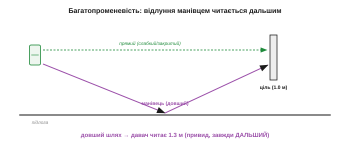
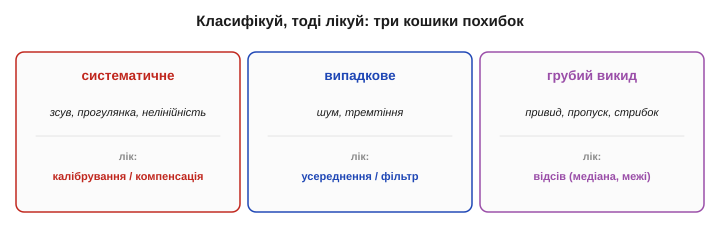
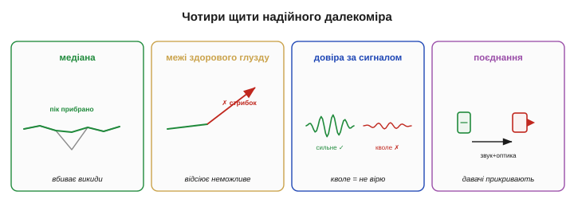
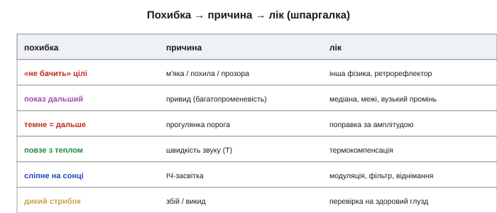

# Похибки вимірювання відстані

Слабкі місця в кожного способу вимірювання відстані свої: десь — м'яка ціль, десь — температура, десь — привид. Зібрати їх докупи й навести лад варто тому, що саме так інженер і думає про давач: не «чи точний він», а «**як саме** він збреше і що з цим робити». Тут — повний [бюджет похибок](book:math/error-budget) далекоміра, складений за єдиною дисципліною: класифікуй похибку (систематична, випадкова, грубий викид), а тоді бери відповідний лік (калібрування, фільтр, відсів). З такою картою показ далекоміра читається не як істина, а як **гіпотеза** з відомою мірою довіри.

### Карта похибок: звідки беруться брехливі числа

Усе різноманіття похибок відстані зводиться до шести родин за **джерелом**. **Ціль** — її [відбивність, колір, м'якість, прозорість](book:electronics/reflection-absorption). **Геометрія** — кут нахилу цілі, ширина променя, межі дальності. **Середовище** — температура повітря для звуку, туман і пил для світла. **Засвітка й завади** — сонце, чужі ультразвукові пінги, електромагнітні наводки. **Багатопроменевість** — відлуння, що прийшло манівцями. **Електроніка** — роздільність годинника, поріг детектування, нелінійність. Перш ніж лагодити, варто впізнати, з якої з шести родин ваша біда.

Користь такої карти не теоретична: **не можна полагодити те, чого не назвав**. Той самий «стрибок показу» може бути привидом (багатопроменевість), пропуском (м'яка ціль), наводкою (засвітка) чи просто шумом — і кожному з цих чотирьох потрібен **інший** лік. Гірше того, похибки люблять **складатися**: тепла кімната зсуває швидкість звуку, темна ціль додає прогулянку порога, а кут підкидає бічний відблиск — і три дрібні системні зсуви разом дають показ, у якому вже годі впізнати причину. Тому досвідчений діагност іде **по родинах**, відсікаючи їх одну за одною, а не хапається за «загальний фільтр».


*Рис. Звідки беруться брехливі відстані. Шість джерел: ціль, геометрія, середовище, засвітка/завади, багатопроменевість, електроніка. Кожне дає свій почерк похибки й вимагає свого ліку — тож діагностику завжди починають із питання «з якої це родини».*

### Ціль і кут: найчастіша причина

Найбільше брехні дає не давач, а **ціль** і **кут**, під яким вона стоїть. [Фізика тут проста](book:electronics/reflection-absorption): м'яке й чорне поглинає, гладке й похиле відбиває вбік, прозоре пропускає. До цього додається підступ **геометрії променя**. Ультразвуковий конус відповідає завжди **найближчою** ціллю — тож маленький предмет збоку, що випадково ближче, **затуляє** стіну за ним, і давач рапортує близьку відстань до дрібнички, наче за нею порожньо. А скошена поверхня відводить промінь убік, і давач або не бачить нічого, або ловить слабкий бічний відблиск, читаючи хибну дистанцію.


*Рис. Пастки геометрії. Ліворуч: дрібний предмет ближче за стіну затуляє її — конус чує найближче, і давач «не бачить» головної перешкоди. Праворуч: похила поверхня відбиває промінь убік, повз приймач, тож стіна стає невидимою або дає хибне число.*

> 🔧 **Навіщо це.** Коли далекомір «бреше», перша підозра — **не давач, а ціль і кут**. Перевірте: чи не м'яка вона, чи не похила, чи нема дрібнички перед головною перешкодою. Дев'ять із десяти «дивних» показів — це фізика цілі, а не несправність; міняти давач, не розібравшись із ціллю, — марно витрачати гроші.

Два особливі випадки геометрії варто знати окремо. **Внутрішній кут** двох стін (чи кут коробки) діє як ретрорефлектор — вертає звук чи світло дуже сильно, тож давач упевнено «бачить» близьку ціль там, де лише порожній кут. І протилежне — **повний пропуск** (*dropout*): м'яка, кутова чи надто далека ціль не дає **жодного** відлуння, і давач повертає «нічого» або максимум діапазону. Найнебезпечніше тут — витлумачити пропуск як «вільно»: для уникання зіткнень «не бачу» мусить означати «обережно», а не «їдь сміливо». Браку відповіді бійтеся більше, ніж хибної відповіді.

### Багатопроменевість: привиди й фантоми

Окрема й підступна родина — **багатопроменевість** (*multipath*). Промінь не зобов'язаний летіти до цілі й назад прямо: він може відбитися від підлоги, стіни чи кута, пройти **довший** манівець — і повернутися пізніше, ніж летів би навпростець. Давач же міряє **час** (чи фазу), тож довший шлях він тлумачить як **більшу** відстань: виникає **привид** — показ, якому в напрямку променя не відповідає жодна реальна ціль. А внутрішній кут (дві стіни під 90°) працює як ретрорефлектор і дає навпаки **сильний** обманний відгук.


*Рис. Привид від багатопроменевості. Прямий шлях до цілі короткий, але промінь відбився від підлоги й вернувся довшим манівцем; давач, міряючи час, вважає цей довший шлях більшою відстанню — і «бачить» ціль там, де її нема.*

**Приклад (чому привид завжди дальший).** Пряма відстань до цілі — 1.0 м (час відповідає 2.0 м шляху туди-й-назад). Та промінь пішов через підлогу, і його шлях туди-й-назад вийшов 2.6 м. Давач порахує:

```
прямий:  d = 2.0 / 2 = 1.0 м
манівець: d = 2.6 / 2 = 1.3 м   ← привид, дальший за справжню ціль
```

Привид **ніколи не буває ближчим** за справжню ціль — манівець завжди довший за пряму. Це й підказка для відсіву: підозріло **дальші** за очікуване, нестабільні покази в захаращеному просторі — найімовірніше, відлуння манівцем.

Розпізнати привид допомагає **сталість**: справжня ціль дає схожий показ із пінга в пінг, а привид часто **скаче** й залежить від найменшого повороту давача, бо манівець крихкий. Найдужче багатопроменевість лютує в тісних, захаращених, відбивних просторах — коридорах, кутках, металевих цехах, — а на відкритому майданчику її майже нема. Тому ті самі ультразвукові давачі, бездоганні в полі, починають «бачити неіснуюче» в кімнаті з твердими стінами; це не несправність, а **геометрія простору**, і боротися з нею треба не заміною давача, а розумом у коді.

> 🔧 **Навіщо це.** У приміщенні з твердими стінами першими підозрюйте **привиди**, а не несправність. Підказки: показ дальший за очікуване, скаче від руху давача, зникає на відкритому місці. Лік — медіана плюс перевірка на здоровий глузд; а в зовсім відбивному просторі — звузити промінь або додати давач іншої фізики. Проти геометрії кімнати один ультразвук безсилий.

### Поріг і слабке відлуння: «прогулянка» нуля

Є й тонша, суто електронна похибка, що нишком чіпляє навіть час польоту. Момент приходу відлуння давач засікає, коли його **обвідна** перетинає **поріг**. Але слабке відлуння (від далекої, темної чи м'якої цілі) наростає **повільніше** за сильне — і перетинає той самий поріг **пізніше**. Тож слабша ціль читається систематично **дальшою**, ніж є, хоч відстань до неї та сама. Це зветься **«прогулянкою» порога** (*timing walk*), і через неї **яскравість** відбитого підмішується у вимір **відстані** — саме там, де час мав би бути геометрично чистим.


*Рис. «Прогулянка» порога. Сильне й слабке відлуння приходять одночасно, але слабке наростає повільніше й перетинає поріг пізніше — давач засікає його як дальше. Так відбивність цілі прокрадається в показ відстані; лікують це компенсацією за амплітудою.*

Лікують це хитрішим детектуванням (за сталою часткою амплітуди, а не за фіксованим порогом) або поправкою на виміряну силу сигналу. Для нас головне — знати, що навіть «геометрично чистий» ToF трохи залежить від того, **як яскраво** ціль відбила: ще одна причина не довіряти сирому числу беззастережно.

Масштаб цієї похибки — від міліметрів до кількох сантиметрів, залежно від того, наскільки кволе відлуння, — і вона **системна**: темна ціль завжди читається трохи дальшою, а світла — точніше. Підступ у тому, що вона **сплітає** дві начебто незалежні величини: помилившись щодо кольору цілі, ви помилитесь і щодо її відстані. Саме тому точні лазерні далекоміри окремо міряють силу відлуння й вносять за нею поправку, перетворюючи прикру залежність на ще один **відомий і скомпенсований** доданок бюджету похибки — бо все систематичне, що ви здатні виміряти, ви здатні й [відняти калібруванням](book:electronics/calibration).

### Середовище й засвітка — коротко

Дві останні родини мають просту природу. **Середовище**: [швидкість звуку пливе з температурою повітря](book:electronics/tof-ultrasonic), а [світло сліпне в тумані, пилу й димі](book:electronics/tof-laser). **Засвітка й завади**: [сонце топить оптичні давачі](book:electronics/reflection-absorption), чужі ультразвукові пінги дають перехресні цілі, а сильні [електромагнітні поля наводять шум](book:electronics/drift-hysteresis-noise) на тонкі сигнали. Усі вони системні або зовнішні, і лік до них той самий: компенсувати відоме, екранувати й модулювати — проти стороннього.

До цих шести родин варто додати сьому, про яку легко забути, — **запізнення**. Будь-який показ відстані стосується **минулого**: давачу потрібен час на пінг і відлуння, фільтру — на згладжування, шині — на передачу. Поки число дійде до керування, апарат уже зрушив, а ціль, може, теж. Для нерухомого виміру це байдуже, а для робота, що мчить, «правдива, але застаріла» відстань не менш небезпечна за хибну: він гальмує перед тим місцем, де перешкода **була**, а не де вона є. Тому в динаміці важить не лише точність числа, а й його **свіжість** — той самий [час відгуку давача](book:electronics/sensor-characteristics), — і повільний, хоч і точний, далекомір здатен підвести саме на швидкості.

### Систематичне, випадкове, грубий викид

Тепер головне — **класифікувати**, бо від класу залежить лік. Усі похибки відстані лягають у три кошики тієї самої [класифікації похибок давача](book:electronics/drift-hysteresis-noise). **Систематичні** (повторювані): температурний зсув швидкості звуку, «прогулянка» порога, нелінійність тріангуляції — їх **калібрують і компенсують**. **Випадкові** (тремтіння): шум приймача, дрібні коливання показу — їх **усереднюють чи фільтрують**. І окремо — **грубі викиди**: привиди, пропуск м'якої цілі, поодинокі дикі стрибки — їх не згладжують, а **відсівають**.


*Рис. Класифікуй, тоді лікуй. Систематичне (зсув, прогулянка, нелінійність) — калібрування й компенсація. Випадкове (шум) — усереднення й фільтр. Грубий викид (привид, пропуск) — відсів. Сплутати клас — лікувати не те: усереднити привид означає лише розмазати брехню.*

> 🔧 **Навіщо це.** Загальний [урок про похибки давача](book:electronics/drift-hysteresis-noise), перенесений на відстань: спершу **назви** клас похибки, тоді бери інструмент. Усереднити показ із привидами — отримати точно виміряну неправду; калібрувати шумний — гнатися за тінню. Найгрубіша помилка — лити всі похибки в один «фільтр» і сподіватися на диво.

Розгляньмо, як це б'є на практиці. Хай далекомір зрідка кидає привид — стрибок на метр раз на двадцять вимірів. Якщо лікувати це **усередненням**, кожен привид підтягне середнє на п'ять сантиметрів убік і **розмаже** брехню на сусідні чесні покази — стало гірше, ніж було. А **медіана** того самого ряду викине привид зовсім, бо одне дике значення серед багатьох не зрушить середини. Той самий потік даних, два інструменти — і протилежний результат: ось чому назвати клас похибки важливіше, ніж шукати «найкращий» фільтр узагалі.

### Скриня ліків: медіана, розумні межі, поєднання давачів, довіра

Звідси випливає набір прийомів, що роблять далекомір надійним. Найкорисніший проти викидів — [**медіанний фільтр**](book:algorithms/median-filter): він викидає поодинокі дикі значення, не розмазуючи їх по сусідах, як зробило б усереднення. Далі — **розумні межі** (перевірка на здоровий глузд): відкидати фізично неможливі стрибки — якщо ціль «перестрибнула» на три метри за десять мілісекунд, це не ціль телепортувалася, а давач збрехав. Третє — **довіра за силою сигналу**: багато давачів повідомляють, наскільки сильним було відлуння; кволий сигнал — низька довіра, і такий показ або ігнорують, або позначають як ненадійний. І нарешті — [**поєднання давачів**](book:algorithms/sensor-fusion): поєднати кілька давачів різної фізики (ультразвук + оптика), щоб сліпе місце одного прикрив інший.


*Рис. Чотири щити надійного далекоміра. Медіана вбиває поодинокі викиди; перевірка на здоровий глузд відсіює неможливі стрибки; оцінка сили сигналу дає довіру до кожного показу; поєднання різних давачів прикриває сліпі плями. Разом вони з ненадійного потоку роблять надійне знання.*

**Приклад (перевірка на здоровий глузд).** Робот, що їде 1 м/с, читає відстань кожні 20 мс. Між двома сусідніми показами ціль фізично не може зсунутися більше, ніж на:

```
Δd_макс = швидкість · крок_часу = 1 м/с · 0.02 с = 0.02 м = 2 см
```

Тож стрибок показу на 50 см за один крок — точно **викид** (привид чи пропуск), а не реальний рух: його сміливо відкидають і беруть попереднє значення. Проста межа, виведена з фізики руху, ловить більшість грубих брехень ще до будь-якого фільтра.

Кожен із чотирьох щитів має тонкощі. У **медіани** добирають довжину вікна: коротке (3–5 відліків) вбиває поодинокі викиди майже без затримки, довше — давить і пачки, але робить давач млявішим. **Перевірку на здоровий глузд** можна підсилити справжньою **моделлю руху**: знаючи, куди й як швидко апарат рухається, передбачаєш очікувану відстань і відкидаєш усе, що від неї надто далеко (це вже сусідить із [фільтром Калмана](book:algorithms/kalman-filter)). А **поєднання давачів** найкраще робити **зважено за довірою** — давати кожному давачу голос пропорційно до сили його сигналу: тоді той, що зараз сліпне, сам стишується, а певніший бере гору. Так чотири прості прийоми складаються в напрочуд стійкий до брехні тракт.

### Зведення: похибка → причина → лік


*Рис. Підсумок в одній таблиці: типова похибка відстані, її фізична причина й чим її бити. Це робоча шпаргалка для діагностики далекоміра в полі.*

Глибша думка під усім цим — та, що лежить в основі всієї роботи з давачами: **одинокий показ далекоміра — це гіпотеза, а не факт**. Він каже «найімовірніше, ціль отам», і ймовірність ця залежить від цілі, кута, середовища й щастя з багатопроменевістю. Перетворити потік таких гіпотез на надійне знання про світ — і є справжня робота сенсорики, а не просто «зчитати число з ніжки».

У строгих системах цю думку доводять до кінця: давачу приписують **модель** — не саме лиш число, а й оцінку, наскільки йому зараз можна вірити (ширшу за невизначеністю, коли сигнал кволий чи геометрія погана). Тоді кожен показ входить у рішення апарата зі своєю **вагою**, і система природно більше слухає того давача, хто зараз бачить ясно, і менше — засліпленого. Це прямий місток до [оцінювання стану](book:algorithms/predict-vs-measure) й [поєднання давачів](book:algorithms/sensor-fusion); тут досить запам'ятати, що зріла робота з далекоміром починається не з довіри до числа, а з чесної оцінки **міри** цієї довіри.

Надійна далекометрія тримається не на ідеальному давачі (його не буває), а на тому, що ви **знаєте його режими відмови** й заздалегідь від них захистились. Відстань — лише одна з величин оточення, яку треба чути апарату: поряд із нею стоять [інші давачі довкілля](book:electronics/environment-sensors) — руху, температури й вологості, газу, — кожен зі своєю фізикою й своїми пастками, але з тією самою дисципліною читання показу як гіпотези.

---
