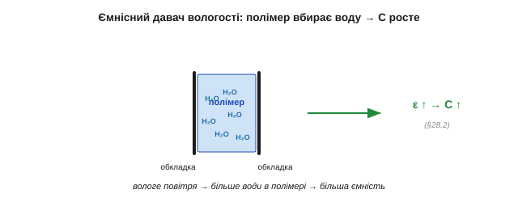

# Інші давачі оточення: рух, температура/вологість, газ

Відстань — найважча, але не єдина величина оточення, яку апарат хоче чути. Часто треба ще знати: чи є поряд **жива істота** (рух), яка **температура** й **вологість**, чи нема в повітрі небезпечного **газу**. Ця стаття — побіжний огляд таких давачів. Мета не в тому, щоб розписати кожен (на це є цілі книжки), а показати головне: усі вони **вкладаються в ту саму рамку**, що й будь-який інший давач. Кожен — перетворювач певного класу, з характеристиками, дрейфом, потребою калібрування й нормування. Той самий [спосіб думати про давач](book:electronics/transducer-classes) дає інструмент, щоб зрозуміти будь-який із них; тут ми лише показуємо цей інструмент у дії на кількох нових прикладах.

Чому варто оглянути їх разом, а не вчити кожен окремо? Бо інакше сенсорика здається нескінченним списком незв'язаних деталей, кожна зі своїм даташитом і своїми примхами. Насправді за цим списком стоїть жменя повторюваних ідей: перетворення певного класу, [передавальна характеристика](book:electronics/sensor-characteristics), неминучий дрейф, потреба калібрування й чистого тракту. Побачивши, як ці самі ідеї проступають у геть різних давачах — теплового руху, вологи, газу, — ви перестаєте боятися незнайомого давача й починаєте впізнавати в ньому **старого знайомого в новому корпусі**.

### Рух без дотику: пасивний інфрачервоний (PIR)

Найпоширеніший давач присутності — **PIR** (*Passive InfraRed*, пасивний інфрачервоний). Кожне тепле тіло **само випромінює** інфрачервоне; PIR це випромінювання **слухає**. Слово «пасивний» тут ключове: на відміну від [активного ІЧ-далекоміра](book:electronics/reflection-absorption), який сам світить і ловить відбиток, PIR нічого не випромінює — лише сприймає чуже тепло.

Серце давача — **піроелектричний** елемент. І ось гарна паралель: піроелектрика — це теплова рідня [п'єзоелектрики](book:electronics/piezo-optical-semiconductor). Як п'єзо дає заряд від **зміни напруження**, так піро дає заряд від **зміни температури**. А отже, він **самогенерувальний** і, що важливіше, **відповідає лише на зміну**: рівний потік тепла він «забуває», як п'єзо забуває сталий натиск. Над елементом ставлять **лінзу Френеля**, що ділить поле зору на багато вузьких **зон**. Коли тепле тіло рухається, воно по черзі вмикає то одну зону, то іншу — елемент то нагрівається, то холоне, і дає змінний сигнал. Нерухоме тіло освітлює зону **рівно** — і сигнал згасає.

Кілька деталей роблять PIR практичним. Усередині не один, а **два** піроелементи, ввімкнені **назустріч**: рівномірна зміна (потеплішало в кімнаті, сонце зайшло за хмару) діє на обидва однаково й **скорочується**, а рух тіла повз них дає різницю — той самий [диференційний хід, що в мості](book:electronics/transducer-classes), лише проти теплового дрейфу. Лінза Френеля задає **візерунок** зон і дальність — звичайно кілька метрів конусом; помінявши лінзу, міняють і форму поля зору. Назовні модуль віддає вже готовий **цифровий** імпульс «є рух» із настроюваними чутливістю й часом утримання, а не сирий заряд, — усю тонку аналогову кухню він ховає всередині, як [«розумний» давач](book:electronics/piezo-optical-semiconductor). І, як усі піроелектричні, він потребує **прогріву** після ввімкнення — десятків секунд, а то й хвилини, — поки власні теплові перехідні процеси не вщухнуть (у цей час можливі хибні спрацювання).


*Рис. Як працює PIR. Тепле тіло випромінює ІЧ; лінза Френеля ділить поле зору на смуги-зони. Рухаючись, тіло перетинає зони, поперемінно нагріваючи піроелемент, — і той дає змінний сигнал. Піроелемент — теплова рідня п'єзо: заряд від зміни температури.*

Звідси найважливіша риса PIR: він бачить **рух** теплого тіла, а не його **присутність**. Людина, що завмерла, для PIR поступово **зникає** — заряд стікає, як у п'єзо, і давач «забуває» нерухоме тепло.


*Рис. PIR — давач зміни. Тіло, що рухається, дає сплески сигналу (перетин зон); тіло, що завмерло, поступово згасає до нуля, бо піроелемент відповідає лише на зміну теплового потоку — точно як п'єзо лише на зміну сили. «Стою нерухомо» = «зник для PIR».*

> 🔧 **Навіщо це.** PIR відповідає на питання «чи **ворухнулося** щось тепле?», а не «чи є тут хтось?». Тому світло від PIR гасне, коли ви сидите тихо, — давач вас «загубив». Для присутності нерухомої людини потрібна інша фізика (наприклад, активний давач). Хибно спрацьовує PIR і від сонця у вікні, гарячої батареї, кота — усього теплого, що рухається чи мерехтить.

Більшість хибних спрацювань PIR прибирається **розташуванням**: не направляти на вікна, батареї, кватирки й шляхи протягів, де ворушиться тепле повітря, не ставити проти прямого сонця. Допомагають козирок проти бічної засвітки, довший **час утримання** (щоб поодинокий сплеск не вважався подією) і вимога **кількох** спрацювань поспіль — та сама [боротьба з викидами](book:electronics/distance-errors), лише для теплового давача.

Коли ж потрібна саме **присутність**, а не рух, PIR доповнюють іншою фізикою: мікрохвильовий давач сам опромінює простір (активний, бачить крізь тонкі перешкоди) — прості доплерівські модулі реагують лише на рух, а сучасні FMCW-радари помічають і завмерлу людину за мікрорухами дихання; ультразвуковий чи оптичний — як уже описані далекоміри; а камера з обробкою — найгнучкіше, але найдорожче. Часто ставлять **пару** (PIR + мікрохвильовий) і вважають людину присутньою, лише коли спрацювали обидва, — менше хибних тривог. Це знов те саме [поєднання давачів різної фізики](book:electronics/distance-errors), що рятує з далекоміром.

### Температура й вологість

Температурні давачі мають знайоме обличчя — термопара, терморезистор, напівпровідниковий IC, кожен зі своїм [класом перетворення](book:electronics/transducer-classes). Як давач **оточення** найчастіше беруть саме інтегральний: дешевий, лінійний, віддає готову цифру.

Дрібниця, але важлива: «температура оточення» й «температура давача» — не одне й те саме. Будь-який давач міряє **власну** температуру й лише сподівається, що вона дорівнює навколишній; а власне тепло сусідніх мікросхем, сонце на корпусі чи теплий потік від плати легко зсувають її на градуси. Тому точний вимір температури повітря — це не «поставив давач», а подбати, щоб він був у **тепловій рівновазі** саме з повітрям: на продуві, подалі від гарячого, з часом на усталення (тут згадується [час відгуку](book:electronics/sensor-characteristics)). Навіть найпростіший на вигляд давач має свою дисципліну розташування.

**Вологість** же часто міряють **ємнісно** — і це знов [ємнісний перетворювач](book:electronics/transducer-classes). Між обкладками крихітного конденсатора кладуть полімер, що **вбирає водяну пару**; вода має велику діелектричну проникність, тож що вологіше, то більша ємність. Міряють так **відносну вологість** (RH) — відсоток від максимально можливого за цієї температури. А оскільки «максимально можливе» залежить від температури, давачі вологості майже завжди йдуть **у парі** з термометром, і чип рахує RH, знаючи обидві величини.


*Рис. Ємнісний давач вологості. Полімер між обкладками вбирає водяну пару; вода (велика ε) піднімає ємність — більша вологість, більша C. Це пряме застосування ємнісного принципу, лише «ручку» ε крутить волога повітря.*

**Приклад (чому вологість міряють разом із температурою).** У повітрі з певною кількістю водяної пари відносна вологість залежить від температури: тепле повітря «вміщає» більше пари, тож та сама абсолютна волога дає нижчу RH у теплі й вищу в холоді.

```
та сама абсолютна волога:
   при 30 °C → RH ≈ 26 %   (тепле вміщає багато — далеко до межі)
   при 10 °C → RH ≈ 90 %   (холодне майже насичене тією ж вологою)
```

Тому показ «вологість 60 %» без температури неповний — і саме тому ці дві величини нерозлучні в одному корпусі. Ємнісний давач ще й **повільний** (парі треба продифундувати в полімер) і помітно **дрейфує**, тож потребує періодичного [калібрування](book:electronics/calibration).

Варто розрізняти три «вологості». **Абсолютна** — скільки води в кубометрі повітря; **відносна** (RH) — відсоток від насичення за цієї температури; **точка роси** — температура, до якої треба охолодити повітря, щоб волога почала конденсуватись. Давач міряє RH, а решту чип рахує, знаючи температуру. Звідси й підступ монтажу: якщо давач вологості сам трохи гріється (від сусідніх мікросхем чи власної електроніки), він **занижує** RH, бо «бачить» тепліше за реальне повітря, — тому його ставлять подалі від джерел тепла й на продув, інакше похибка вбудована в саме розташування, як і в термометра.

### Газові давачі: три різні фізики

Газ — найважче, бо тут ми ловимо **молекули**. Поширені три зовсім різні підходи. **Метал-оксидний** (MOX): тонка плівка оксиду металу, **підігріта** нагрівачем; коли молекули газу осідають на ній, її **опір змінюється** — це підігрітий [хеморезистор](book:electronics/transducer-classes). Дешевий, чутливий, але неселективний, дрейфує й їсть енергію на нагрів. **Електрохімічний**: крихітний паливний елемент, де газ вступає в реакцію й дає **струм**, пропорційний концентрації; селективніший і малоспоживний, та з часом виснажується. **NDIR** (недисперсійний інфрачервоний): потрібний газ **поглинає** свою характерну довжину хвилі ІЧ — просвічуємо пробу інфрачервоним і міряємо [поглинання](book:electronics/reflection-absorption); селективний і стабільний, тому ним міряють, наприклад, CO₂.

Кожна фізика має свою плату. Метал-оксидному потрібен **нагрівач** — і не лише енергія на нього: плівка виходить на робочу чутливість аж після прогріву (від хвилин до годин після тривалого простою), а її «нуль» повільно **повзе** з тижнями, тож баланс час від часу переобнуляють на свіжому повітрі. Виробники навіть радять «**вистарити**» (*burn-in*) такий давач кілька діб перед точними вимірами — рівно як вистарюють давачі [проти раннього дрейфу](book:electronics/drift-hysteresis-noise). Електрохімічний натомість майже не їсть енергії й добре селективний, але має **термін життя**: реагенти виснажуються за роки, і він тихо «вмирає», далі показуючи правдоподібні, але хибні числа. NDIR — найстабільніший і найселективніший (поглинання строго на «своїй» хвилі важко сплутати), та й найдорожчий, бо в ньому ціла мініатюрна оптика. Тому вибір газового давача — завжди торг між **ціною, селективністю, споживанням і довговічністю**, і «найкращого» серед них немає.


*Рис. Три способи відчути газ. MOX — підігрітий оксид змінює опір від адсорбції (резистивний). Електрохімічний — газ дає струм у мініатюрному паливному елементі (самогенерувальний). NDIR — газ поглинає свою смугу ІЧ, і ми міряємо поглинання (оптичний). Різні класи — та сама рамка перетворювача.*

### Підступ газових давачів: вибірковість

Найбільша біда дешевих газових давачів — **вибірковість** (*selectivity*). Метал-оксидний відгукується на **багато** газів одразу, тож не каже, **який саме** перед ним: «давач чадного газу» може так само реагувати на спирт, водень чи пару від готування — це **перехресна чутливість**, через яку трапляються фальшиві тривоги. Додайте сюди довгий **прогрів**, повзучий **нуль** (баланс треба час від часу переобнуляти на чистому повітрі) і вплив температури з вологістю — і стає ясно, чому дешевий газовий давач радше «нюхач», ніж вимірювач.


*Рис. Чому дешевий газовий давач — «нюхач». Метал-оксидний реагує на цілий букет газів подібним зростанням сигналу, тож відрізнити чадний газ від спирту чи диму він не може. Для справжнього «скільки чого» потрібні селективні (електрохімічний, NDIR) і калібрування.*

> 🔧 **Навіщо це.** Дешевий газовий давач чесно каже лише «у повітрі **щось змінилося**», а не «стільки-то ppm газу X». Для сигналізації «щось не так — провітри» цього досить; для виміру конкретного газу беріть селективний тип і калібруйте його по відомій суміші. Сплутати «нюхач» із «газоаналізатором» — небезпечна для безпеки помилка.

Парадоксально, але з неселективності можна зробити **силу**. Якщо взяти **кілька** різних неселективних давачів, кожен по-своєму реагує на ту саму суміш — і за **візерунком** їхніх відгуків розумний алгоритм здатен упізнати, який саме газ (чи запах) перед ним. Це «**електронний ніс**»: жоден давач сам не вибірковий, та гурт із них плюс розпізнавання образів дає те, чого поодинці не вийде. Це та сама ідея — багато грубих давачів плюс [розумне об'єднання](book:algorithms/sensor-fusion-2), — яку використовують і там, де треба оцінити стан системи з кількох недосконалих джерел.

### Усе вкладається в одну рамку

І головний підсумок усього погляду на давачі. Кожен названий тут давач — це **перетворювач певного класу**: піроелектричний (самогенерувальний), ємнісний (вологість), резистивний (MOX), оптично-поглинальний (NDIR), електрохімічний (струмовий). А отже, до кожного застосовні ті самі питання: яка в нього **передавальна характеристика** й [чутливість](book:electronics/sensor-characteristics), як він **дрейфує** й [шумить](book:electronics/drift-hysteresis-noise), як його **[калібрувати](book:electronics/calibration)** і як грамотно **[під'єднати](book:electronics/sensor-input-matching)**.


*Рис. Одна рамка на всіх. Який би незнайомий давач не трапився — рух, волога, газ, тиск, — його розкладають за тими самими питаннями: клас перетворювача → характеристика → дрейф і шум → калібрування → узгодження з входом. Нової теорії на кожен давач не треба.*

Поза цим оглядом лишилося ще чимало давачів оточення, та всі вони лягають у ту саму рамку. **[Барометр](book:electronics/barometric-altimeter)** міряє тиск повітря мікромеханічною мембраною — і ним же оцінюють висоту. **Давач світла** — це фоторезистор чи [фотодіод](book:electronics/piezo-optical-semiconductor). Дощ, дим, наближення руки, нахил, магнітне поле — усе це знов резистивні, ємнісні, оптичні чи напівпровідникові перетворювачі під новою назвою. Жоден не вимагає окремої теорії.

Помітна й спільна тенденція: майже всі ці давачі сьогодні продають **готовими цифровими модулями**, що віддають уже відкаліброване число — градуси, відсотки RH, ppm — однією цифровою лінією. Виробник сховав усередину і чутливий елемент, і підсилювач, і АЦП, і заводське калібрування, — рівно ту [«розумну» інтеграцію](book:electronics/piezo-optical-semiconductor). Це звільняє від аналогової метушні, та не звільняє від **розуміння**: дрейф, час відгуку, перехресні чутливості й хибні спрацювання нікуди не діваються — просто тепер вони сховані за чистим числом, і знати про них треба так само, щоб не повірити йому сліпо.

> 🔧 **Навіщо це.** Зустрівши незнайомий давач, не лякайтеся — **[класифікуйте](book:electronics/transducer-classes)** його, знайдіть його [передавальну характеристику](book:electronics/sensor-characteristics), очікуйте його [дрейф](book:electronics/drift-hysteresis-noise), сплануйте [калібрування](book:electronics/calibration) та [передній край](book:electronics/sensor-input-matching). Уся фізика давачів — це не сотня окремих рецептів, а **одна** рамка, у яку лягає кожен новий давач. Сила цього погляду в тому, що він учить не давачів, а **способу думати** про будь-який із них.

Так абстрактний інструментарій давачів обертається на конкретні прилади: відстань — відлунням і кутом, присутність — рухом тепла, а ще теплоту, вологу й вміст повітря. Кожен — перетворювач із чесними межами, прочитаний за тією самою дисципліною. Та всі вони, від далекоміра до газового нюхача, видають сигнал **зашумлений** і **тремтливий**. Зробити з цього брудного потоку чисте, придатне для рішень число — окреме мистецтво [цифрової фільтрації](book:algorithms/signal-noise).
