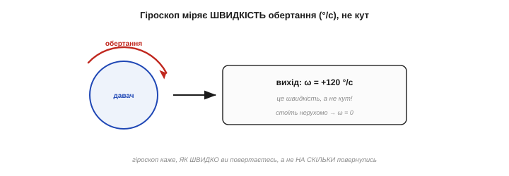
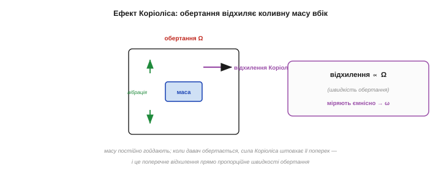
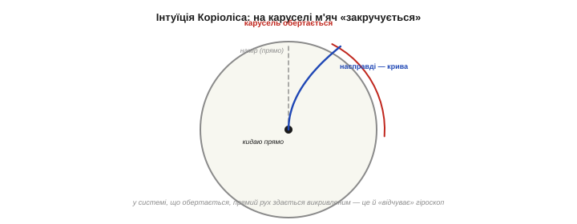
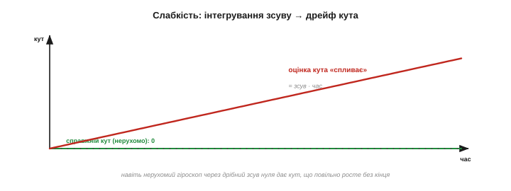
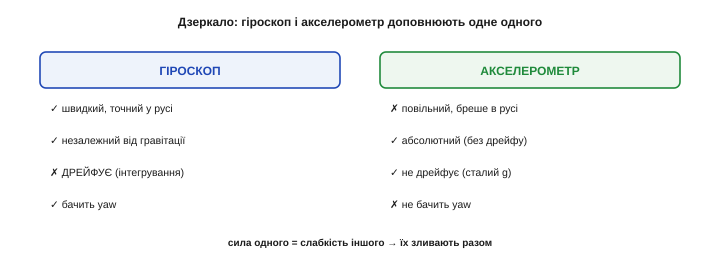

# Гіроскоп: міряти обертання

[Акселерометр](book:electronics/accelerometer) сліпне там, де апарат **обертається** і де треба знати **курс** (yaw). Цю діру закриває **гіроскоп** — давач, що міряє обертання й нечутливий ні до гравітації, ні до лінійного руху. Та в нього своя дивина, дзеркальна до акселерометрової: гіроскоп міряє не **кут**, а **швидкість** його зміни, тож, щоб дістати сам кут, показ доводиться інтегрувати — а це породжує **дрейф**. Саме ця одна риса й робить гіроскоп і акселерометр ідеальною парою, де вади одного гасить інший. Розберімо: що гіроскоп міряє, як він це робить (ефект Коріоліса) і де його межа.

Парадокс гіроскопа дзеркальний до акселерометрового. Акселерометр дає абсолютну величину (нахил), але плутає гравітацію з рухом; гіроскоп дає чисту, незалежну від гравітації величину, але — лише **темп** зміни, а не саму величину. Один знає «де», та зляканий рухом; другий знає «як швидко змінюється», та не знає «де». Кожен сильний рівно там, де другий слабкий, — і вся краса IMU в тому, як їх поєднати.

### Що міряє гіроскоп: швидкість обертання

Найперше й найважливіше: гіроскоп віддає **кутову швидкість** — наскільки **швидко** апарат повертається, у градусах за секунду (°/с), — а **не** кут повороту. Стоїть нерухомо — на виході нуль; крутиться зі швидкістю 120 °/с — на виході 120; зупинився — знову нуль. Сам **кут** гіроскоп не знає; він каже лише «**як швидко** ти зараз обертаєшся».


*Гіроскоп міряє темп, не положення. Поки апарат обертається, давач показує **швидкість** цього обертання (наприклад, +120 °/с); щойно зупинився — нуль, хоча повернувся він уже на якийсь кут. Гіроскоп каже, **як швидко** ви крутитесь, а не **на скільки** повернулись. Щоб дізнатися сам кут, швидкість доводиться накопичити в часі.*

Це принципово інша величина, ніж в акселерометра. Акселерометр дає щось **абсолютне** (вектор гравітації → нахил «тут і зараз»); гіроскоп дає **темп зміни** (швидкість). І саме з цієї різниці випливають усі їхні сили й слабкості.

Слово «гіроскоп» старше за MEMS. Класичний гіроскоп — це важке колесо, що швидко **обертається** й завдяки збереженню моменту імпульсу опирається зміні своєї осі; такі прилади понад століття тримали курс кораблів, літаків і ракет. MEMS-гіроскоп працює зовсім інакше — через Коріоліса на вібрації, без жодного колеса, — але робить те саме: відчуває обертання. Стара назва лишилася, а механізм усередині став крихітним і копійчаним.

До речі, «швидкість, а не кут» — часто навіть **зручніше**, ніж здається. Для стабілізації апарата контуру керування потрібна саме **кутова швидкість**: щоб гасити розгойдування, регулятор протидіє темпу повороту (це [диференційна складова ПІД](root:embedded/derivative-control)). Тож гіроскоп нерідко використовують **прямо**, без інтегрування до кута, — і тоді його дрейф узагалі не страшний, бо ми нічого не накопичуємо. Дрейф кусає лише тоді, коли зі швидкості роблять кут, — а для самого лише гасіння розгойдувань кут і не потрібен, досить миттєвої швидкості.

### Як це робить: ефект Коріоліса

Як крихітна кремнієва машина відчуває обертання? Через **ефект Коріоліса**. Усередині гіроскопа є маса, яку постійно **розгойдують** (змушують вібрувати вздовж однієї осі). Коли давач починає **обертатися**, на цю рухому масу діє додаткова, **бічна** сила — сила Коріоліса, — що штовхає її **поперек** її коливань. І головне: ця бічна сила (а отже, і поперечне відхилення маси) **прямо пропорційна швидкості обертання**. Виміряй це відхилення [ємнісно, як у будь-якій MEMS-структурі](book:electronics/mems) — і знатимеш кутову швидкість.


*Серце MEMS-гіроскопа. Масу постійно гойдають уздовж однієї осі (зелена вібрація). Коли давач обертається (Ω), на рухому масу діє сила Коріоліса, що штовхає її **поперек** коливань (фіолетове відхилення). Це поперечне відхилення прямо пропорційне швидкості обертання — і саме його зчитують ємнісні гребінці, перетворюючи на ω. Той самий вантаж на пружинках, тільки тепер його збуджує обертання, а не прискорення.*

Силу названо на честь французького інженера й математика **Гаспара-Ґюстава де Коріоліса** (*Gaspard-Gustave de Coriolis*, 1792–1843), що 1835 року описав «додаткові сили», які діють на тіла в системі відліку, що **обертається** (саме ім'я силі дали вже пізніші автори). Ту саму силу ви знаєте з географії — це вона закручує циклони й відхиляє вітри на планеті, що крутиться. У гіроскопі її лише зменшили до мікромасштабу: коливна маса замість вітру, кремнієва порожнина замість Землі.

Інженерно гіроскоп складніший за акселерометр. По-перше, масу треба **постійно й точно гойдати** — це окрема система приводу, що їсть енергію (тому гіроскоп зазвичай **ненажерливіший** за акселерометр). По-друге, сигнал Коріоліса **ще менший** за акселерометровий зсув, тож гіроскоп зазвичай і **шумніший**. Усе це — плата за здатність чути обертання: дешево, та не задарма. Звідси й практична порада берегти живлення, вимикаючи гіроскоп, коли динаміка не потрібна.

Форми коливної структури бувають різні — камертонні (дві маси, що гойдаються назустріч), кільцеві, дискові, — та принцип один: щось коливається, а обертання відхиляє це коливання вбік. Деталі важливі інженерам давача; вам же досить пам'ятати картину: **гойдана маса + обертання → бічне відхилення → ω**. Решта — варіації на цю тему, відточені заради меншого шуму й дрейфу.

### Інтуїція Коріоліса: гойдалка-карусель

Щоб відчути Коріоліса нутром, уявіть **карусель**, що обертається. Ви стоїте в центрі й кидаєте м'яч **прямо** товаришеві на краю. Поки м'яч летить, карусель встигає повернутися — і м'яч, що летів «прямо», з вашого погляду **закручується** вбік, ніби його штовхнула невидима сила. Ця уявна сила й є сила Коріоліса: вона з'являється не від чогось реального, а від того, що ви дивитеся з системи, яка **обертається**.


*Звідки береться сила Коріоліса. На нерухомій землі м'яч летить прямо. Та на каруселі, що обертається, той самий прямий політ здається **викривленим** (синя крива) — бо платформа крутиться під ним. Гіроскоп — це «карусель» із коливною масою всередині: коли корпус обертається, рух маси теж «закручується», і за силою цього закручування давач і визначає швидкість обертання.*

Гіроскоп — це, по суті, така сама карусель, лише з коливною масою замість м'яча: коли корпус обертається, коливання маси «закручуються» силою Коріоліса, і за величиною цього закручування давач читає, **як швидко** його обертають.

Той самий ефект керує погодою цілої планети. Земля — велика карусель, тож вітри й океанські течії на ній **закручуються** силою Коріоліса: циклони в північній півкулі крутяться проти годинникової стрілки, у південній — навпаки. А маятник Фуко, що повільно повертає площину гойдання, — це теж Коріоліс, видимий оком. Ваш копійчаний гіроскоп відчуває рівно ту саму силу, тільки від обертання власного корпусу, а не Землі.

### Сила: незалежність від гравітації

Тепер — чому гіроскоп безцінний саме там, де акселерометр безсилий. Він міряє **чисте обертання**, і його абсолютно **не обходять** ні гравітація, ні лінійне прискорення: трясіть його, рухайте, перевертайте — він реагує **лише** на власне обертання. Це пряма протилежність акселерометрові, що плутав гравітацію з рухом.


*Що гіроскоп бачить, а акселерометр — ні. **Незалежний від гравітації**: міряє обертання прямо, не плутаючи його з g чи лінійним рухом. **Бачить yaw**: відчуває поворот навколо вертикалі — ту саму сліпу пляму [акселерометра](book:electronics/accelerometer). **Швидкий**: ловить найрвучкіші повороти без затримки. Там, де акселерометр сліпне (рух, yaw), гіроскоп бачить чудово.*

Звідси дві ключові переваги. По-перше, гіроскоп **точний під час руху** — саме тоді, коли акселерометр бреше; для швидкої, динамічної орієнтації (дрон у польоті, стабілізація камери) він незамінний. По-друге, він **бачить yaw** — поворот навколо вертикалі, якого акселерометр не відчуває зовсім. Гіроскоп — давач для **динаміки** там, де акселерометр — давач для **спокою**.

Як і акселерометр, гіроскоп **триосьовий**: міряє швидкість обертання навколо X, Y і Z окремо — крен, тангаж і рискання (*roll/pitch/yaw rate*). Три числа разом дають повний **вектор кутової швидкості**: куди і як швидко апарат повертається в просторі. Діапазон обирають під задачу (наприклад, ±250 °/с для плавних рухів, ±2000 °/с для рвучких, як у квадрокоптера), а одиниці — градуси за секунду.

Сирий вихід гіроскопа, як і акселерометра, — це відліки АЦП, які за паспортним коефіцієнтом переводять у °/с, і які теж **тремтять** від [шуму](book:electronics/imu-noise-bias-drift), тож потребують фільтрації. Та головна його вада — не миттєвий шум (його згладиш), а саме **повільний дрейф**, проти якого фільтр безсилий: усереднюй скільки завгодно, а сповзання нуля лишиться. Дрейф — окрема біда, що вимагає окремих ліків (поєднання давачів).

### Слабкість: інтегрування й дрейф

Та за все треба платити, і гіроскоп платить **дрейфом**. Адже він дає **швидкість**, а нам зазвичай потрібен **кут**. Щоб із швидкості дістати кут, її **інтегрують** — накопичують у часі:

```
кут(t) = ∫ ω dt  ≈  Σ ω · Δt     (накопичуємо швидкість крок за кроком)
```

І ось де пастка: якщо в показі швидкості є навіть дрібний сталий **зсув нуля** (а він завжди є — давач «думає», що ледь крутиться, хоча нерухомий), то під час інтегрування цей зсув **накопичується без кінця**, і оцінка кута повільно «спливає» геть від правди.


*Дрейф — головна вада гіроскопа. Давач лежить нерухомо, справжній кут — нуль (зелена лінія). Та через крихітний зсув нуля гіроскоп «думає», що ледь обертається, — і інтеграл цього зсуву дає оцінку кута, що неухильно росте (червона): хибний кут = зсув · час. За хвилини нерухомий гіроскоп може «накрутити» десятки градусів неіснуючого повороту. Кут від гіроскопа точний **накоротко**, але довго йому вірити не можна.*

Це **дзеркало** проблеми акселерометра. У того подвійне інтегрування прискорення дає катастрофічний дрейф **положення**; тут одне інтегрування швидкості дає повільніший, але невпинний дрейф **кута**. Гіроскоп чудовий на коротких інтервалах (секунди), та що довше ви на нього покладаєтесь, то далі «спливає» його оцінка.

Наскільки швидко спливає — залежить від **стабільності зсуву** конкретного давача. У дешевих MEMS зсув «гуляє» помітно (звідси дрейф у градуси за хвилини), у дорогих — на порядки менший. Та найпідступніше те, що зсув **повзе з температурою**: щойно давач нагрівся, його «нуль» поїхав, і навіть ретельне калібрування на старті не рятує надовго. Тому з дрейфом не борються поодинці гіроскопом — його неминуче доводиться [**підправляти ззовні**, акселерометром](book:communications/sensor-fusion).

Звідси й практика **прогріву**: точні системи дають гіроскопу кілька хвилин «вийти на режим» (стабілізуватися за температурою), перш ніж довіряти його показу. Для аматорського ж рівня досить пам'ятати, що холодний, щойно ввімкнений гіроскоп дрейфує помітно сильніше, ніж прогрітий, — тож первинне калібрування зсуву варто робити вже теплим.

> 🔧 **Навіщо це.** Запам'ятайте: гіроскоп дає **швидкість**, а не кут. Хочете кут — інтегруйте (`кут += ω·Δt` щокроку), але **очікуйте дрейф**: оцінка точна на секунди, а далі неухильно повзе. Тому ніколи не покладайтеся на «голий» інтегрований гіроскоп для тривалого утримання кута — за хвилини він збреше на десятки градусів. Це не несправність, а сама природа інтегрування зсуву.

### Дзеркало акселерометра

Зіставмо обидва давачі — і побачимо, чому вони створені одне для одного. Їхні сили й слабкості **дзеркальні**:


*Ідеальна пара антиподів. **Гіроскоп**: швидкий і точний у русі, незалежний від гравітації, бачить yaw — але **дрейфує** (інтегрування зсуву). **Акселерометр**: повільний і «бреше» в русі, зате **абсолютний і не дрейфує** (сталий g — вічний орієнтир). Сила одного — точно слабкість іншого. Тому їх **поєднують**: швидкий гіроскоп дає миттєву динаміку, а сталий акселерометр час від часу «підправляє» його дрейф.*

Гіроскоп **точний у русі, але дрейфує** з часом; акселерометр **дрейфу не має, але бреше в русі**. Що як узяти **краще від обох** — швидку, чисту динаміку гіроскопа на коротких інтервалах **і** абсолютну, бездрейфову прив'язку акселерометра на довгих? Саме це й роблять, [**поєднуючи** їх докупи](book:communications/sensor-fusion): гіроскоп веде кут миттєво й гладко, а акселерометр повільно тягне його назад до істинного «низу», не даючи спливти. Два недосконалі давачі дають разом одну надійну оцінку.

Механізм цього поєднання гарний у своїй простоті — в основі його звичайна фільтрація. Швидку, динамічну частину беруть від **гіроскопа** (ніби пропустивши його крізь **високочастотний** фільтр — він добрий накоротко), а повільну, опорну — від **акселерометра** (крізь **низькочастотний** — він добрий надовго). Складені разом, вони покривають усі частоти: гіроскоп тримає кут від миті до секунд, акселерометр — від секунд і далі. Це і є [**комплементарний фільтр**](book:algorithms/complementary-filter).

Результат поєднання вражає простотою наслідку: маючи два **посередні** копійчані давачі, ви отримуєте оцінку орієнтації, гідну приладу в рази дорожчого. Гіроскоп дає **гладкість і швидкість**, акселерометр — **довготривалу правду**; разом — і те, і те. Саме тому жоден серйозний проєкт із орієнтацією не бере один давач: сила тут не в окремому чипі, а в [**поєднанні**](book:communications/sensor-fusion) — у тому, як поєднують їхні показання докупи.

**Приклад (інтегрування й дрейф).** Спершу корисний випадок, тоді шкідливий:

```
гіроскоп дає ω = 30 °/с протягом 2 с:
   кут = ω · t = 30 · 2 = 60°          (інтеграл швидкості — правильний кут)
дрейф від зсуву нуля 1 °/с (давач нерухомий, а «думає», що крутиться):
   хибний кут = 1 °/с · 60 с = 60°     за одну хвилину неіснуючого повороту!
висновок: кут від гіроскопа точний накоротко, але неухильно «спливає» від зсуву
```

Шістдесят градусів брехні за хвилину з мізерного зсуву в 1 °/с — ось чому гіроскоп **сам по собі** не може довго тримати орієнтацію, і чому йому конче потрібен напарник-акселерометр.

> 🔧 **Навіщо це.** Перед роботою **виміряйте й відніміть зсув нуля** гіроскопа: потримайте апарат **нерухомо** кілька секунд, усередніть показ кожної осі — це і є зсув, який далі віднімають від кожного відліку. Простий крок, а він **різко** сповільнює дрейф (бо найбільша частина зсуву — стала й калібрується). Тільки пам'ятайте: зсув ще й **повзе** з температурою, тож повністю його не прибрати — лишок усе одно доведеться [гасити акселерометром](book:communications/sensor-fusion).

> 🔧 **Навіщо це.** Думайте про гіроскоп і акселерометр як про **пару**, а не поодинці. Голий гіроскоп дрейфує, голий акселерометр сліпне в русі — а разом вони дають точну орієнтацію в будь-яких умовах. Тому в проєктах із орієнтацією завжди беріть **обидва** (а ще краще — готовий 6-осьовий IMU) і одразу плануйте їх **поєднати** ([комплементарним фільтром](book:algorithms/complementary-filter) чи [фільтром Калмана](book:algorithms/kalman-filter)), а не покладайтеся на жоден сам по собі.

Отже, гіроскоп — це коливна маса, що силою Коріоліса відчуває обертання й віддає його **швидкість**: звідси його сила (незалежність від гравітації, чутливість до руху й yaw) і його межа (дрейф від інтегрування зсуву). Разом з акселерометром вони покривають **нахил і обертання** в усіх режимах. Лишається третя сліпа пляма обох: **абсолютний курс** — куди апарат повернений відносно сторін світу. Бо ні акселерометр, ні гіроскоп самі цього не скажуть: гравітація однакова на всі азимути (вона лише про «низ»), а гіроскоп лише **рахує зміни** кута від невідомого початку, та ще й дрейфує. Потрібен зовнішній, абсолютний орієнтир **напрямку** — і його дає [**магнітометр**](book:electronics/magnetometer), що відчуває магнітне поле Землі, як стрілка компаса.

---
