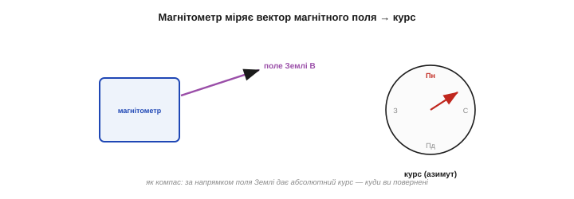

# Магнітометр: відчути сторони світу

Магнітометр закриває в орієнтації окрему сліпу пляму: **абсолютний курс** — куди апарат повернений відносно сторін світу. Робить він це, як компас: відчуває **магнітне поле Землі** й за його напрямком визначає, де північ. Це безцінно — бо дає **бездрейфову** прив'язку yaw, якої ні [акселерометр](book:electronics/accelerometer), ні [гіроскоп](book:electronics/gyroscope) не мають. Та магнітометр — **найхитріший** із трьох давачів IMU: його легко обдурити будь-яким залізом чи магнітом поряд, і без калібрування він майже завжди бреше. Розберімо, що він міряє, як дає курс і чому з ним стільки клопоту.

Налаштуйтеся: магнітометр — давач-парадокс. Він дає найцінніше для орієнтації — **абсолютний** напрямок, незалежний від часу й руху, — і водночас він найненадійніший, бо міряє мізерне поле, яке заглушає будь-яка залізяка. Тому на нього не можна ні махнути рукою (без нього нема курсу), ні сліпо довіряти (без калібрування він бреше). Уся робота з магнітометром — це балансування між його унікальною користю й його примхливістю.

### Що міряє магнітометр: вектор поля

Магнітометр міряє **магнітне поле** — його напрямок і силу, по трьох осях, як вектор. На Землі панує **геомагнітне** поле (те, що крутить стрілку компаса), тож, відчувши його напрямок, давач і визначає курс. Важлива деталь: магнітометр — **не** [MEMS](book:electronics/mems)-механіка; усередині немає вантажа на пружинках. Поле він міряє електрично — найчастіше **[ефектом Холла](book:physics/hall-effect)** (напруга поперек провідника зі струмом у полі) чи **магнітоопором** (опір матеріалу залежить від поля). Його просто оселили в тому самому корпусі IMU поряд із механічними побратимами.

Сам компас — найдавніший із наших давачів орієнтації: магнітну стрілку (намагнічений «магнітний камінь») для навігації застосовували ще тисячу років тому. Електричний же спосіб відчути поле дав **ефект Холла**, відкритий американцем **Едвіном Холлом** (*Edwin Hall*) ще 1879 року: у провіднику зі струмом, поміщеному в магнітне поле, з'являється поперечна напруга, пропорційна полю. Сучасний MEMS-сусід — магнітометр — це, по суті, той самий тисячолітній компас, зведений до кремнієвого чипа.

Варто оцінити вагу цього давача в історії: саме компас уможливив **далеку морську навігацію** — плавання поза видимістю берега й зірок, відкриття континентів, глобальну торгівлю. Тисячу років мореплавці довіряли життя магнітній стрілці. Тепер той самий принцип у кремнієвому чипі веде ваш дрон чи телефон — пряма, неперервна лінія від компаса давніх мореплавців до IMU у вашій руці.

Сила геомагнітного поля — лише десятки мікротесла, у сотні разів слабша за поле звичайного побутового магніту. Звідси й уся вразливість: давач намагається почути слабкий «шепіт» Землі, а будь-який магніт поряд «перекрикує» його. Тримати це в голові корисно: магнітометр — це чутливе вухо, націлене на дуже тихий, але всюдисущий сигнал.


*Рис. Магнітометр як електронний компас. Давач відчуває напрямок магнітного поля Землі по трьох осях. За цим напрямком визначають **курс** (азимут) — куди ви повернені відносно півночі. На відміну від акселерометра (що знає лише «низ») і гіроскопа (що лише рахує зміни), магнітометр дає **абсолютну** прив'язку до сторін світу.*

### Поле Землі: нахилене на північ

Одна тонкість, що псує життя новачкам: поле Землі спрямоване **не** строго на північ уздовж поверхні. Воно ще й **«занурюється» в землю** під кутом (це звуть **нахилом**, *inclination* або *dip*): біля екватора майже горизонтальне, а ближче до полюсів — дедалі крутіше вниз, аж до прямовисного. Для **курсу** потрібна лише **горизонтальна** складова поля — та, що лежить уздовж поверхні й вказує на магнітну північ.

Саме поле породжує розплавлене ядро Землі (геодинамо), і воно **не ідеальне**: магнітні полюси не збігаються з географічними й повільно **блукають** (магнітна північ за останнє століття зсунулася більш ніж на тисячу кілометрів), а сила поля різниться від місця до місця. Тому й курс за компасом — лише наближення до справжнього, що вимагає поправок (схилення) і час від часу — оновлення даних про поле.


*Рис. Поле, що дивиться в землю. Геомагнітне поле — не горизонтальне: воно «занурюється» під кутом нахилу (стрімкіше до полюсів). Для визначення курсу беруть лише його **горизонтальну** складову (зелена), що вказує на магнітну північ; вертикальна (сіра) для курсу зайва. Тому магнітометр сам по собі дає курс правильно лише коли давач **вирівняний** — інакше частина «вертикального» поля затече в горизонтальні осі й збреше.*

### Курс із горизонтальних складових

Сам курс рахують просто — як кут горизонтального поля через арктангенс:

```
магнітний курс:  ψ = atan2(mY, mX)
де mX, mY — горизонтальні складові поля по осях давача
```


*Рис. Звідки береться курс. Дивлячись згори, горизонтальне поле вказує під певним кутом до осей давача — це й є курс, який рахують через `atan2(mY, mX)`. Та два «але»: давач має бути **вирівняний** (бо нахил поля інакше «протече» в осі — потрібна нахил-компенсація з акселерометра), і магнітна північ — **не** справжня (різниця зветься магнітним схиленням і залежить від місця).*

Два важливі застереження. По-перше, формула вірна лише коли давач **горизонтальний**; якщо він нахилений, частина «зануреного» поля затікає в горизонтальні осі й курс пливе — тому на практиці роблять **нахил-компенсацію**, повертаючи вектор поля в горизонт за даними [акселерометра](book:electronics/accelerometer) (наочний приклад, де давачі працюють у зв'язці). По-друге, магнітна північ не збігається зі справжньою (географічною) — їх розділяє **магнітне схилення** (*declination*), що різниться від місця до місця й яке треба додати, щоб дістати справжній курс.

Нахил-компенсація — не дрібниця, а необхідність. Без неї простий нахил давача **сам по собі** змінює показ курсу, навіть якщо ви не поверталися: частина крутого «зануреного» поля затікає в горизонтальні осі й підмішується до курсу. Тому ручний компас завжди тримають **рівно**; а в електронному цю рівність забезпечує [акселерометр](book:electronics/accelerometer), що каже, де «низ», — і за ним поле повертають у горизонт перед обчисленням курсу. Це наочний доказ, що курс надійний лише в **зв'язці** двох давачів.

І ще про схилення: воно не лише різне за місцем, а й **повільно міняється з часом** (бо полюси блукають), тож авіаційні й морські карти періодично оновлюють. Для побутового проєкту це несуттєво, але знати варто: «магнітна північ» — рухома ціль, а не вічна константа.

### Сила: абсолютний курс без дрейфу

Попри весь клопіт, магнітометр дає те, чого більше ніхто в IMU не вміє: **абсолютний курс, що не дрейфує**. Поле Землі — сталий зовнішній орієнтир, тож «де північ» давач знає **завжди**, без накопичення похибки. Це робить його ідеальним напарником [гіроскопа](book:electronics/gyroscope) саме по **yaw**: гіроскоп дає швидкі зміни курсу, але дрейфує, а магнітометр повільно, але **надійно** тягне курс назад до істинної півночі.


*Рис. Трійця, що дає повну орієнтацію. **Акселерометр** → де «низ» (нахил, зі сталого g). **Магнітометр** → де північ (курс, із поля Землі). **Гіроскоп** → швидкі зміни (миттєва кутова швидкість). Кожен дає свій абсолютний чи динамічний орієнтир; разом — повна, надійна орієнтація в просторі. Магнітометр — саме той, хто прив'язує курс до сторін світу.*

Картина орієнтації складається з трьох внесків: акселерометр дає «низ», магнітометр — «північ», гіроскоп — швидку динаміку. Два абсолютні орієнтири (низ і північ) задають орієнтацію без дрейфу, а гіроскоп робить її гладкою й швидкою. Це і є три стовпи орієнтації, які [зливають в одне](book:algorithms/sensor-fusion) спільним фільтром.

Зверніть увагу на красиву **надмірність**: два абсолютні орієнтири — гравітація (вниз) і магнітне поле (на північ) — разом **повністю** задають орієнтацію тіла в просторі, бо це два різні незмінні напрямки. Гіроскоп тут навіть не обов'язковий для самої орієнтації — він лише робить її **швидкою й гладкою** між абсолютними «прив'язками». Систему, що так [зводить три давачі в орієнтацію](book:algorithms/sensor-fusion), звуть **AHRS** (*Attitude and Heading Reference System*).

Звідси й назва **дев'ятиосьовий IMU**: три осі прискорення + три осі обертання + три осі магнітного поля. Дев'ять чисел із одного копійчаного корпусу — рівно стільки, скільки треба, щоб повністю визначити й орієнтацію, і її зміни. Кожна трійка закриває свою грань задачі, а разом вони дають апарату повне «чуття» свого положення в просторі.

Чому саме **двох** абсолютних векторів досить для повної орієнтації? Бо гравітація задає два кути (нахил — крен і тангаж), залишаючи невизначеним лише поворот навколо вертикалі; а магнітне поле, не паралельне гравітації, якраз і закриває цей останній, третій кут — курс. Два різні незмінні напрямки повністю «приколюють» тіло в просторі. Якби в нас був лише один із них, одна вісь обертання так і лишалася б невідомою.

### Біда: будь-яке залізо бреше

А тепер — головна причина, чому магнітометр найважчий із трьох. Поле Землі **дуже слабке**, тож будь-яке **залізо** чи **магніт** поряд легко його перекручує. Динамік зі своїм магнітом, сталевий гвинт, доріжка зі струмом, моторчик, навіть батарея — усе це **спотворює** поле в місці давача, і компас починає брехати.


*Рис. Найвразливіший давач. Слабке поле Землі легко перекручує будь-яке залізо чи магніт поряд. **Hard-iron** спотворення — від постійних магнітів (динаміки, мотори): вони **зсувають** поле, наче додають свій сталий вектор. **Soft-iron** — від феромагнітного заліза (гвинти, корпус): воно **викривлює** форму поля. Плюс струми в дротах. Через усе це сирий магнітометр майже завжди дає хибний курс.*

Спотворення бувають двох видів. **Hard-iron** (від постійних магнітів) **зсуває** поле — додає сталий власний вектор, тож компас постійно «дивиться вбік». **Soft-iron** (від звичайного заліза, що саме намагнічується полем Землі) **викривлює** форму поля по-різному в різних напрямках. Разом вони роблять сирий показ магнітометра практично непридатним без виправлення.

Окремо підступні **рухомі** й **змінні** джерела. Мотори дрона під час польоту створюють поле, що **міняється** зі швидкістю обертання, а струми в силових дротах — зі споживанням; таке спотворення **не сталеве**, тож калібруванням його не прибрати. Тому магнітометр у дроні часто виносять на щоглу **подалі** від моторів і акумулятора. Сталі завади (корпус, гвинти) калібрують; змінні (мотори, струми) — лише уникають рознесенням у просторі.

Корисний самодіагноз: **довжина** вектора поля під час обертання давача має лишатися **сталою** — адже сила поля Землі в одному місці незмінна, хоч би як ви крутили компас. Якщо ж під час обертання довжина «гуляє» — це певна ознака спотворення (hard-iron, soft-iron чи зовнішнє джерело). Та сама перевірка довжиною, що працює для [акселерометра](book:electronics/accelerometer), придатна й тут: стала довжина — поле чисте, мінлива — є завада.

До речі, магнітометру й не треба бути швидким: курс міняється повільно, тож його показ, як і гравітацію акселерометра, можна сильно **фільтрувати** (ФНЧ) проти шуму без шкоди для динаміки. Швидку ж зміну поворотів усе одно дає [гіроскоп](book:electronics/gyroscope). Тож роль магнітометра у злитті — повільний, але **абсолютний** орієнтир курсу: для yaw він те саме, що [акселерометр](book:electronics/accelerometer) для нахилу.

### Калібрування: вісімка

На щастя, спотворення (принаймні від речей, **закріплених разом** із давачем на платі) **сталі** — тож їх можна **відкалібрувати**. Прийом знаменитий: покрутити пристрій **«вісімкою»** на всі боки. Якби поля не спотворювали, кінчик вектора поля під час обертання малював би ідеальну **сферу** з центром у нулі. Спотворення зміщують її центр (hard-iron) і роблять овальною (soft-iron). Зібравши точки під час «вісімки», знаходять цей зсув і викривлення — і далі **виправляють** кожен показ, повертаючи сферу на місце.

Математично це — підгонка **еліпсоїда** під хмару зібраних точок: знайти його центр (це hard-iron зсув, який віднімають) і його розтяг по осях (це soft-iron масштаб, на який ділять), щоб обернути еліпсоїд назад на центровану сферу. Звучить складно, та робиться раз і автоматично; багато сучасних IMU-чипів навіть мають **вбудоване** автокалібрування, що поступово підправляє поле під час звичайної роботи.

Калібрування — не «раз і назавжди». Переставили давач, додали металеву деталь, змінили компоновку — і спотворення стало іншим, тож калібруйте **наново**. Допомагає й те, що магнітне середовище злегка пливе з температурою. Тому надійні системи або перекалібровують періодично, або покладаються на автокалібрування під час роботи.


*Рис. Як калібрують компас. До калібрування точки поля під час обертання лягають у зміщений овал (червоне) — наслідок hard- і soft-iron спотворень. Покрутивши давач «вісімкою» на всі боки, збирають ці точки, знаходять **зсув** (hard-iron) і **масштаб/перекіс** (soft-iron) — і виправляють кожен наступний показ, повертаючи овал у центроване **коло** (зелене). Лише тоді курс стає вірним.*

> 🔧 **Навіщо це.** Магнітометр — **найвразливіший** давач IMU: тримайте його якнайдалі від магнітів, моторів, силових дротів і феромагнітних деталей, а ще краще — рознесіть із ними на платі. Усе металеве, що рухається **відносно** давача (а не закріплене з ним), спотворить курс непередбачувано, і калібрування тут не поможе. Перше питання при «брехливому компасі»: що залізне чи струмове є поряд?

> 🔧 **Навіщо це.** Завжди **калібруйте** магнітометр на місці — «вісімкою» після того, як він **уже встановлений** у корпус (бо корпус, гвинти й сусідні деталі теж спотворюють поле, і калібрувати треба разом із ними). Без калібрування курс легко бреше на десятки градусів. І пам'ятайте: переставили давач чи додали металеву деталь — калібруйте **наново**.

**Приклад (курс зі схиленням).** Давач вирівняний, читаємо горизонтальне поле:

```
горизонтальні складові:  mX = 0.80,  mY = 0.60   (умовні одиниці, після калібрування)
магнітний курс:          ψ = atan2(0.60, 0.80) ≈ 37°  (від магнітної півночі)
магнітне схилення в місці: +6°   (магнітна північ ≠ справжня)
справжній курс:          ≈ 37° + 6° = 43°  від географічної півночі
(і це лише коли давач вирівняний; інакше потрібна нахил-компенсація з акселерометра)
```

Зверніть увагу, скільки умов: калібрування, вирівнювання, схилення — і лише тоді курс правдивий. Магнітометр дає безцінну річ (абсолютний азимут), але вимагає за неї найбільше уваги.

> 🔧 **Навіщо це.** Для **справжнього** курсу не забудьте магнітне схилення вашого регіону (його беруть із карт чи онлайн-моделей поля Землі за координатами). Магнітна й географічна північ можуть розходитися на одиниці-десятки градусів залежно від місця. Якщо вам потрібен лише **відносний** курс (зміна напрямку), схилення можна знехтувати; а для навігації за справжньою північчю — обов'язково врахуйте.

Попри весь цей клопіт — завади, калібрування, схилення, компенсацію нахилу — магнітометр лишається **незамінним**: без нього курс неминуче спливе разом із дрейфом [гіроскопа](book:electronics/gyroscope), і апарат за хвилини «забуде», куди він повернений. Тож з його примхами миряться заради однієї, але критичної здатності — **пам'ятати про північ**, хоч би скільки минуло часу.

Магнітометр доповнює пару акселерометр-гіроскоп третім, останнім орієнтиром — **абсолютною північчю**, — ціною найбільшої вразливості до завад і потреби в калібруванні. За цими трьома давачами IMU стоїть спільна правда: **жоден із них не ідеальний**. [Акселерометр](book:electronics/accelerometer) шумить і плутає рух із гравітацією; [гіроскоп](book:electronics/gyroscope) дрейфує; магнітометр піддається завадам. Тверезо роздивитися їхні [спільні вади](book:electronics/imu-noise-bias-drift) — шум, зсув нуля, дрейф — означає зрозуміти, чому кожен давач сам по собі недостатній. Бо саме з ясного розуміння, що кожен давач уміє, а де неминуче бреше, і виростає головна ідея: [злити їх](book:algorithms/sensor-fusion) так, щоб сильні боки одного гасили вади іншого.

---
