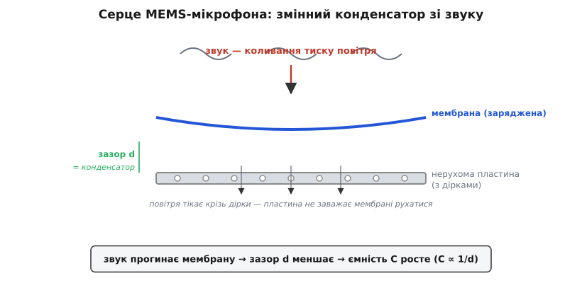
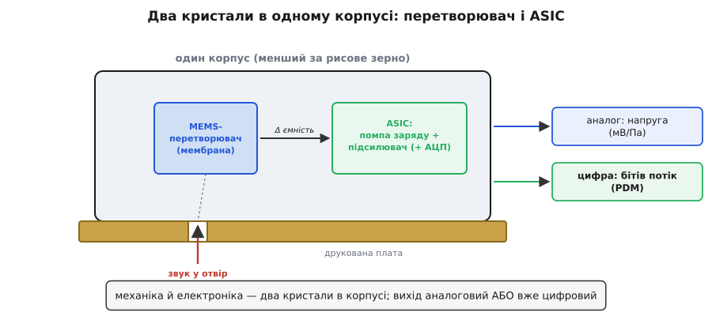
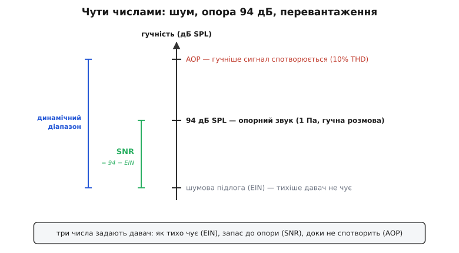

# MEMS-мікрофон: змінний конденсатор, що слухає

<preknowlist>
- [MEMS](book:electronics/mems) — крихітна кремнієва машина (рухома деталь + електроніка на одному чипі), виточена літографією; звідси мала маса, дешевизна й слабкий сигнал.
- [Ємнісне зондування](book:electronics/capacitive-sensing) — як зміну відстані між пластинами перетворюють на зміну ємності, а тоді на електричний сигнал.
- [Децибели](book:electronics/decibels) — логарифмічна міра; чому гучність і шум зручно рахувати в дБ, а не в разах.
</preknowlist>

У кожному сучасному телефоні, навушнику, ноутбуку сидить не один мікрофон, а три, чотири, шість — і всі вони **однакові крихітні кремнієві чипи** розміром із зернятко. Це MEMS-мікрофони. Варто розібрати, **що** ховається в тому чипі й **чому** саме він витіснив звичну чорну «таблетку»-мікрофон зі старих телефонів, бо історія тут не про «нова технологія краща», а про конкретну фізику, яка робить мікрофон придатним для масового вжитку.

Найперше, що треба усвідомити: мікрофон — це **давач тиску**. Звук — це коливання тиску повітря; вухо чи мікрофон ловлять саме ці коливання й перетворюють на щось вимірне. MEMS-мікрофон — окремий член великої [родини давачів тиску](book:electronics/mems-pressure-sensor), тільки заточений під швидкі й слабкі коливання, які ми чуємо як звук. Тож питання «як працює мікрофон» зводиться до простішого: **як перетворити коливання тиску на електричний сигнал** так, щоб це вмістилося в кремнієву порошинку й коштувало копійки.

### Серце: заряджена мембрана над продірявленою пластиною

Уся суть мікрофона — в одному образі. Уявіть **тонку кремнієву плівку** (мембрану), напнуту, як шкіра барабана, а під нею — **нерухому тверду пластину** зовсім близько, за частку міліметра. Звук тисне на мембрану, вона трохи прогинається — то ближче до пластини, то далі. І все. Уся хитрість — як **побачити** цей мікроскопічний прогин електрично.

Побачити його дає **ємність**. Дві близькі провідні поверхні — мембрана й пластина — це **конденсатор**, а його ємність залежить від відстані між обкладками: що ближче обкладки, то більша ємність. Формула проста й точна:

```
C = ε · A / d
```

де `A` — площа обкладок, `ε` — стала середовища (тут повітря), а `d` — зазор між ними. Мембрана прогнулась на кілька нанометрів ближче — `d` зменшився — `C` зросла; хитнулась назад — `C` впала. Отже, **ємність мікрофона повторює форму звукової хвилі**. Коливання тиску стали коливаннями ємності — а її вже вміє читати електроніка.


*Серце MEMS-мікрофона. Тонка заряджена мембрана напнута над нерухомою пластиною за мікроскопічний зазор `d` — разом вони конденсатор. Звук прогинає мембрану, зазор меншає, ємність росте (`C ∝ 1/d`). Пластина навмисне **продірявлена**: інакше защемлене між нею й мембраною повітря пружинило б і не давало мембрані рухатися — дірки випускають повітря, тож пластина «не заважає» слухати.*

Тут криється тонкість, повз яку легко пройти: **навіщо пластину дірявлять**. Якби вона була суцільна, тонкий прошарок повітря між нею й мембраною поводився б як пружина — мембрана тисне на нього, а стиснене повітря відпихає назад. Такий повітряний «матрац» глушив би саме той рух, що ми хочемо виміряти. Дірки в пластині дають повітрю **втекти** назад, коли мембрана насувається, — і мембрана рухається вільно, майже не відчуваючи пластини. Це не дрібниця оздоблення, а умова того, щоб мікрофон узагалі чув: без дірок він був би глухий.

> 🔧 **Навіщо це.** Тримайте в голові, що мікрофон — **механічний** прилад із рухомою мембраною, а не чиста електроніка. Звідси практичне: у нього є акустичний **отвір**, який має бути чистий (пил, клей, лак від складання затуляють звук); є власна **механічна** смуга частот (дуже високі й дуже низькі частоти він передає гірше); і він боїться **різкого перепаду тиску** — гучний ляскіт чи струмінь стисненого повітря під час чищення плати можуть порвати мембрану. Поводьтеся з отвором мікрофона обережно.

### Чому тримають сталим заряд, а не напругу

Ми маємо змінну ємність — але користувачеві потрібна змінна **напруга**, яку можна підсилити й оцифрувати. Як із однієї зробити другу? Тут ховається гарний трюк, і саме він робить сигнал мікрофона чесним.

Заряд, напруга й ємність конденсатора зв'язані простим законом `Q = C · V`. Якби ми тримали сталою **напругу** `V`, то зі зміною `C` мінявся б заряд — але напруга на виході лишалася б тією ж, і корисного сигналу ми б не побачили прямо. Тому роблять навпаки: на мембрану кладуть **фіксований заряд** `Q` і не дають йому стікати (мембрана майже ізольована). Тоді з того самого закону:

```
V = Q / C          (Q тримаємо сталим)
```

Заряд сталий — отже, **напруга обернено пропорційна ємності**. Мембрана насунулась, `C` зросла — напруга `V` впала; хитнулась назад — напруга піднялась. Виходить, напруга на мембрані **прямо повторює** її рух, тобто повторює звук. Ми отримали електричний сигнал зі звуку, нічого не роблячи, крім однієї речі: **утримали заряд сталим**.


*Чому саме заряд тримають сталим. Спеціальна схема (**помпа заряду**) кладе на мембрану фіксований заряд `Q` під високою напругою (близько 10 В) і не дає йому стікати. Далі з `V = Q/C`: коли рух мембрани міняє ємність `C`, напруга `V` слухняно йде за цією зміною — сталий заряд робить напругу дзеркалом руху. Це той самий принцип, що й у [зарядового підсилювача](book:electronics/charge-amplifier).*

Звідки береться той фіксований заряд? У класичному «електретному» мікрофоні його носив назавжди вбудований заряджений матеріал — електрет. У MEMS-мікрофоні заряд щоразу створює маленька схема — **помпа заряду** (*charge pump*): вона з живлення в кілька вольтів накачує на мембрану напругу зміщення в **десять і більше вольтів**. Тому MEMS-мікрофон не буває суто пасивним — усередині завжди працює електроніка, і без живлення він мовчить.

Дуже високий опір потрібен тут не випадково: якби заряд помітно стікав, напруга «попливла» б і низькі частоти пропали. Тому вузол, що читає напругу з мембрани, роблять із **колосальним вхідним опором** — щоб заряд тримався й на найповільніших коливаннях. Це та сама задача, що й в усіх ємнісних давачах: сигнал є зарядом, і головне — не дати йому втекти, поки його не виміряли.

### Два кристали в одному корпусі

Отже, у мікрофоні мусять уживатися дві дуже різні речі: **механіка** (мембрана з пластиною, що ловить звук) і **електроніка** (помпа заряду, підсилювач, часто ще й оцифровувач). У MEMS-мікрофоні це буквально **два окремі кремнієві кристали**, посаджені поряд в один малесенький корпус: перетворювач-механіку роблять за MEMS-технологією, а електроніку — звичайним чипом (**ASIC**, *Application-Specific Integrated Circuit* — мікросхема під конкретну задачу).


*Що всередині корпусу. Ліворуч — **MEMS-перетворювач** (мембрана з пластиною), праворуч — **ASIC** (помпа заряду, підсилювач, за потреби АЦП). Звук заходить крізь малий **акустичний отвір**: у показаному «нижньопортовому» корпусі — знизу, крізь дірочку в друкованій платі під чипом; буває й «верхньопортовий» — отвір у кришці згори. ASIC читає зміну ємності перетворювача й віддає сигнал: **аналоговий** (напруга, мВ/Па) або вже **цифровий** (потік бітів).*

Розташування отвору — не дрібниця монтажу. У **нижньопортового** мікрофона звук заходить крізь маленьку дірку в самій друкованій платі просто під чипом; отже, плату під ним доводиться свердлити, і ту дірку не можна затулити ні маскою, ні клеєм. У **верхньопортового** отвір — угорі, у металевій кришці корпусу, і плата лишається цілою. Вибір визначає всю розводку навколо мікрофона, тож його роблять свідомо, ще проєктуючи плату.

Найважливіший наслідок цієї «двокристальності» — вихід буває **двох видів**. **Аналоговий** мікрофон віддає слабку напругу (одиниці мілівольтів на паскаль тиску), яку ви самі маєте завести в [аналого-цифровий перетворювач](book:electronics/adc). **Цифровий** уже містить оцифровувач усередині ASIC і віддає готовий потік бітів — здебільшого у форматі **PDM** (*Pulse-Density Modulation*, модуляція щільністю імпульсів): однобітний потік, де гучність кодується не рівнем, а **густиною одиниць** серед нулів. Гучніше — щільніше йдуть одиниці; тихіше — рідше. Цей однобіт народжує всередині [сигма-дельта-модулятор](book:electronics/sigma-delta-adc), а процесор потім фільтрує його в звичні багатобітні відліки звуку — [як саме, розібрано у вставці](book:electronics/mems-microphone/proj-pdm-decimation.md).

> 🔧 **Навіщо це.** Обираючи мікрофон, найперше вирішіть **аналоговий чи цифровий**, бо від цього залежить уся схема. Цифровий (PDM) заводиться прямо в контролер парою ліній (такт + дані) без окремого АЦП і не боїться завад на короткій доріжці — тому в тісних платах телефонів беруть саме його. Аналоговий вимагає чистого тракту й свого АЦП, зате дає більше свободи в обробці. Друга типова пастка з PDM: два мікрофони на **спільному** такті мають різнитися **фазою** вибірки (один по фронту, другий по спаду того ж такту), інакше контролер не розрізнить їхні дані на одній лінії.

### Чути числами: чутливість, шум і перевантаження

Щоб мікрофон із красивої ідеї став інженерним компонентом, його треба **зміряти числами**. Три з них вирішують усе, і всі прив'язані до однієї опорної точки.

Ця опора — **94 дБ SPL**, тобто звуковий тиск рівно **1 паскаль** на частоті 1 кГц. Це приблизно рівень гучної розмови під самим носом; його взяли за стандартний «еталонний звук», щоб мікрофони можна було порівнювати. Усі три головні числа міряють відносно нього.

**Чутливість** (*sensitivity*) — наскільки сильний вихід дає мікрофон на цей еталонний звук. В аналогового її вказують у мілівольтах на паскаль (типово одиниці мВ/Па), у цифрового — у **дБFS** (децибелах відносно повної цифрової шкали): скільки не дотягує еталонний звук до найгучнішого, який чип узагалі здатний закодувати. Скажімо, чутливість −26 дБFS означає, що еталонний звук 94 дБ SPL дає вихід на 26 дБ нижчий за максимум, — тобто до перевантаження лишається ще 26 дБ запасу.

**SNR** (*Signal-to-Noise Ratio*, відношення сигнал/шум) — наскільки еталонний звук гучніший за **власний шум** мікрофона. Будь-який мікрофон навіть у цілковитій тиші трохи шумить: тепловий рух повітря коло крихітної мембрани, шум електроніки. SNR каже, на скільки децибел корисний сигнал (94 дБ) підноситься над цією шумовою підлогою. Звідси зручна перевідна величина — **еквівалентний вхідний шум** (EIN, *Equivalent Input Noise*): який тихий звук був би такий самий гучний, як власний шум давача.

```
EIN = 94 дБ SPL − SNR
```

Що вищий SNR, то нижча ця шумова підлога, то тихіші звуки мікрофон іще чує понад власним шипінням.

**AOP** (*Acoustic Overload Point*, точка акустичного перевантаження) — з іншого боку шкали: **найгучніший** звук, який мікрофон передає ще чесно. Гучніше — мембрана впирається в межу ходу, сигнал плющиться, і починаються сильні спотворення. За домовленістю AOP беруть там, де спотворення (THD) сягають 10%.


*Три числа на одній шкалі гучності. Знизу — **шумова підлога** (EIN): тихіше давач уже не чує понад власним шумом. Посередині — **опора 94 дБ SPL** (гучна розмова). Угорі — **AOP**: гучніше сигнал спотворюється. Проміжок від підлоги до опори — це **SNR** (`94 − EIN`), а весь проміжок від підлоги до AOP — **динамічний діапазон**: увесь розмах гучності, що вкладається між «не чую» і «спотворю».*

Ці три числа й вирішують, куди мікрофон годиться. Для тихого диктофона важливий низький шум (високий SNR); для запису концерту чи польоту дрона, де реве вітер, — високий AOP, щоб гучне не плющилось; а їхня різниця, **динамічний діапазон**, каже, наскільки широку картину гучності мікрофон охопить одразу.

**Приклад. Цифровий мікрофон має чутливість −26 дБFS і SNR 64 дБ (за опори 94 дБ SPL). Який його власний шум і найгучніший звук до цифрового обмеження?** Шумову підлогу дає пряма формула, а стелю — запас чутливості до повної шкали:

```c
// три числа з даташита, усе відносно опори 94 дБ SPL
#define REF_SPL      94.0f    // дБ SPL — опорний звук (1 Па @ 1 кГц)
#define SENS_DBFS   -26.0f    // чутливість: 94 дБ SPL дають −26 дБFS
#define SNR_DBA      64.0f    // відношення сигнал/шум

float ein     = REF_SPL - SNR_DBA;          // = 94 − 64 = 30 дБ SPL
float max_spl = REF_SPL + (0.0f - SENS_DBFS); // = 94 + 26 = 120 дБ SPL
float dyn_rng = max_spl - ein;              // = 120 − 30 = 90 дБ
```

Крок за кроком: `94 − 64 = 30` — шум давача дорівнює звуку 30 дБ SPL (тихий шепіт за кілька кроків), тихіше він уже не чує. Далі `94 + 26 = 120` — на 120 дБ SPL (рівень відбійного молотка зблизька) сигнал упреться в цифрову межу. Різниця `120 − 30 = 90` дБ — динамічний діапазон: увесь розмах від ледь чутного до оглушливого, який цей мікрофон охоплює. Отже, три рядки з даташита кажуть про давач усе, що треба, щоб вирішити, чи потягне він вашу задачу.

> 🔧 **Навіщо це.** Найчастіша помилка — гнатися лише за високим SNR. Для дрона чи вуличної камери важливіший **AOP**: якщо він низький, гучний вітер чи гуркіт плющать сигнал у кашу, хоч який гарний SNR у тиші. Дивіться на **обидва** кінці шкали під свою задачу: тихе приміщення — беріть високий SNR (низький EIN); гучне середовище — насамперед високий AOP. І пам'ятайте, що чутливість цифрового давача (у дБFS) прямо каже, скільки запасу лишилось до перевантаження: чим ближча вона до нуля, тим менший запас на гучне.

### Чому MEMS витіснив електрет

Десятиліттями мікрофоном у техніці була **електретна «таблетка»** (*Electret Condenser Microphone*, ECM) — той самий конденсаторний принцип, але з назавжди зарядженим електретним матеріалом замість помпи заряду. Вона й досі дешева й непогано звучить. То чому телефони й ноутбуки майже поголовно перейшли на MEMS? Не через саму звукову якість — тут вирішили три інші речі.

Перша — **витримка нагріву**. Сучасні плати паяють, проганяючи їх крізь піч оплавлення при 250–260 °C. Електрет цього не терпить: тепло здатне «розрядити» електретний матеріал, тож ECM доводилося припаювати **вручну окремо**, після печі. MEMS-мікрофон — звичайний кремнієвий чип, він проходить піч разом з усіма деталями, і його ставить той самий автомат. Для масового виробництва це вирішальна економія.

Друга — **однаковість**. MEMS-мікрофони роблять напівпровідниковою літографією, тож вони виходять напрочуд **однаковими** між собою: розкид чутливості часто в межах ±0.5 дБ, тоді як у електретних — близько ±4 дБ. Ця однаковість відмикає **масиви мікрофонів**: коли кілька давачів слухають разом, а обробка за різницею **часу приходу** звуку визначає напрям і глушить усе інше (**формування променя**, *beamforming*), — тоді давачі мусять бути майже ідентичні, інакше метод розсипається. Саме тому кілька узгоджених MEMS-мікрофонів у смарт-колонці чи навушнику можуть «націлитися» на голос і відкинути шум — на розкиданих електретах так не вийде.

Третя — **цифровий вихід і стійкість до завад**. MEMS легко несе на своєму ASIC оцифровувач, віддаючи готовий цифровий потік. У тісному, повному радіозавад корпусі телефона цифрові біти на короткій доріжці не ловлять наводок так, як слабкий аналоговий сигнал електрета, — тому в мобільній техніці цифровий MEMS-мікрофон витіснив аналоговий електрет майже повністю.

Ці три переваги — а не «краще звучить» — і зробили MEMS стандартом. [Історію цього перевороту](book:electronics/mems-microphone/hist-mems-microphone.md) — від багаторічних спроб надійно робити кремнієві мікрофони до першого масового чипа й приходу в телефони — розібрано окремо; коротко ж: перемогла та технологія, що лягла в **уже наявний** конвеєр мікросхем.

> 🔧 **Навіщо це.** Обираючи між MEMS і електретом для власного пристрою, зважуйте не звук, а **виробництво й задачу**. MEMS беруть, коли треба: пайку в печі разом з усім (без ручного припаювання), масив узгоджених мікрофонів (для напрямленого слуху), цифровий вихід у завадному оточенні або мінімальний розмір. Одинокий недорогий електрет іще виправданий у простому виробі, де паяють вручну й одного мікрофона досить, — але щойно з'являється масив, автоматична пайка чи цифра, вибір падає на MEMS.

Отже, MEMS-мікрофон — це той самий давач тиску, зведений до кремнієвої порошинки: заряджена мембрана над продірявленою пластиною ловить звук зміною ємності, помпа заряду перетворює цю зміну на напругу, а сусідній ASIC її підсилює й часто одразу оцифровує. Проста серцевина, стандартна опора 94 дБ SPL і три числа (чутливість, SNR, AOP) описують його цілком — а те, що він народився на конвеєрі мікросхем, а не окремою індустрією, і зробило його всюдисущим членом великої родини кремнієвих давачів тиску.

---
