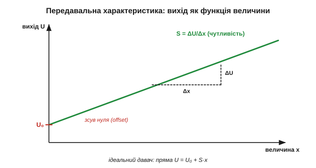
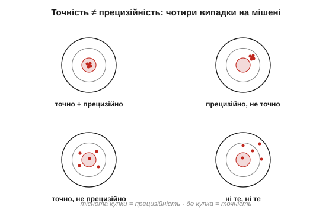
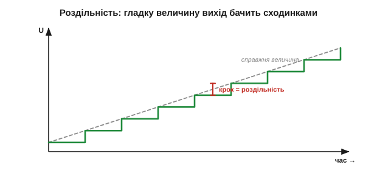

# Характеристики: чутливість, лінійність, діапазон

Давачів існує цілий звіринець — від [різних класів перетворювачів](book:electronics/transducer-classes) до [напівпровідникових і п'єзо](book:electronics/piezo-optical-semiconductor), — та лишається питання, без якого вибрати неможливо: **наскільки давач добрий?** Два терморезистори, два давачі тиску, дві термопари — чим вони відрізняються, окрім ціни? Щоб порівнювати давачі й наперед знати, як вони поведуться, інженери описують кожен **жменею чисел**. Саме ці числа й заповнюють перші сторінки будь-якого даташита. Цей підрозділ — словник тих чисел; опанувавши його, ви читатимете специфікацію давача, як читаєте етикетку.

### Передавальна характеристика: повний портрет давача

Усе про давач ховається в одній кривій — **передавальній характеристиці** (*transfer function / characteristic*): як вихідний сигнал залежить від вимірюваної величини, U = f(x). Це і є той «словник», яким [давач перекладає](book:electronics/what-is-a-sensor) фізичну величину в сигнал, тільки накреслений. Решта характеристик — просто властивості **цієї кривої**: де вона починається, яка крута, чи пряма, де ламається.


*Рис. Передавальна характеристика — серце давача. По горизонталі вимірювана величина x, по вертикалі вихід U. Ідеальний давач — пряма U = U₀ + S·x: її задають два числа — зсув нуля U₀ (де крива починається) і нахил S (як круто росте).*

Ідеальна характеристика — **пряма**:

```
U = U₀ + S · x

U₀ — зсув нуля (вихід при x = 0), offset
S  — чутливість (нахил), sensitivity
```

Два числа, U₀ і S, повністю задають ідеальний давач. Реальний відхиляється від цієї прямої — і всі подальші характеристики міряють саме **як** і **наскільки** він відхиляється.

Одна вимога до характеристики важливіша навіть за лінійність — **монотонність**: щоб кожному значенню величини відповідав свій, окремий вихід. Якщо крива десь повертає назад (одному виходу відповідають дві різні величини), давач у цій точці стає **неоднозначним** — за сигналом уже не відновити, що сталося. Лінійність бажана, а монотонність майже обов'язкова: немонотонний давач не «зіпсований шумом», він принципово не дає прочитати величину однозначно. Тому навіть сильно вигнуту, але монотонну характеристику (як у NTC) спокійно терплять, а от перегин із поверненням — це вже брак.

### Чутливість: яка крута характеристика

**Чутливість** (*sensitivity*, **S**) — це нахил характеристики, приріст виходу на одиницю вхідної величини:

```
S = ΔU / Δx        (напр. мкВ/°C, мВ/кПа, мВ/g)
```

У різних давачів вона ховається під різними іменами: коефіцієнт Зеебека термопари (мкВ/°C), коефіцієнт тензочутливості GF у [тензодавачів](book:electronics/strain-gauges), чутливість давача на [ефекті Холла](book:physics/hall-effect) (мВ/мТл). А насправді це одне поняття — **локальна крутість** передавальної кривої.


*Рис. Чутливість — це нахил. Крутіша характеристика (більша S) дає на ту саму зміну Δx більший сигнал ΔU, тож її легше прочитати на тлі шуму й кроку АЦП. Але велика S «з'їдає» діапазон.*

Більша чутливість — більший сигнал на ту саму зміну, а отже, легше боротися з шумом і кроком АЦП (термопарі з її мікровольтами на градус цього сигналу якраз і бракує). Та задурно нічого не дається: якщо вихід обмежений (скажімо, 0…3.3 В), то крутіша характеристика **швидше впирається в стелю** — велика чутливість звужує діапазон. Це перший із компромісів цього підрозділу.

Ще тонкість: на **кривій** характеристиці чутливість не одна на всіх — вона змінюється від точки до точки, бо нахил різний. Тому в нелінійного давача говорять про **локальну** чутливість у робочій точці: біля одного кінця діапазону він буває дуже чутливим, а біля іншого — майже глухим. NTC, приміром, круто реагує на холоді й мляво на жарі. Коли в даташиті стоїть одне число чутливості, це або середнє по діапазону, або нахил у якійсь типовій точці — і якщо ваша робоча зона скраю шкали, варто перевірити, яка чутливість саме там.

**Приклад (від чутливості до повної шкали).** Давач тиску з чутливістю 20 мВ/кПа і зсувом нуля 0.5 В міряє тиск 0…100 кПа. Який сигнал на виході?

```
U = U₀ + S · x
при   0 кПа:  U = 0.5 + 0.020·0   = 0.50 В
при 100 кПа:  U = 0.5 + 0.020·100 = 2.50 В
```

Вихід пробігає 0.5…2.5 В — рівно під типовий вхід АЦП. Видно й роль обох чисел: зсув 0.5 В підняв «нуль» над землею (щоб не впиратись у 0 В), а чутливість 20 мВ/кПа задала розмах. Підбір цих двох чисел під АЦП — звичайна робота при проєктуванні тракту.

### Діапазон і повна шкала: де давач ще не бреше

**Діапазон** (*range / span*) — проміжок вхідної величини, у якому давач працює: від мінімуму до максимуму. Його ширину звуть **повною шкалою** (*full-scale*, FS). Поза діапазоном характеристика втрачає сенс: нижче — давач «не відчуває», вище — **насичується**, вихід упирається в стелю й перестає рости, хоч величина зростає.


*Рис. Діапазон — це робоче вікно. Усередині нього вихід чесно стежить за величиною; вище верхньої межі характеристика **насичується** (плато), і однаковий вихід відповідає різним великим величинам — давач більше не розрізняє. Міряти можна лише всередині діапазону.*

Звідси практичне правило вибору. Діапазон давача має **накривати** вашу величину з невеликим запасом — але не бути надмірно широким, бо тоді корисний сигнал тулиться в куточку шкали, і роздільність марнується. Давач прискорення на ±2 g і на ±16 g — різні інструменти: перший точніший у спокої, другий не насититься від удару.

Біля країв є й тонші ефекти. Знизу буває **мертва зона** (*deadband*) — невеликий проміжок, де давач ще «спить» і не відповідає (часто біля нуля механічних давачів через тертя чи люфт). Зверху — **зона перевантаження**: давач уже насичений, але ще цілий; а ще далі є межа, за якою його можна й **пошкодити** (тиск, що рве мембрану). Тому в специфікації окремо стоять «робочий діапазон» і «гранично допустимий»: працювати чесно можна лише в першому, а *виживати* давач здатен до другого. Плутати їх дорого — особливо там, де рідкісний сплеск виходить за робоче вікно.

> 🔧 **Навіщо це.** Перша перевірка придатності давача — чи накриває його діапазон вашу величину **в усіх режимах**, включно з рідкісними сплесками. Давач, що насичується на піку, у цей момент бреше найбільше — саме коли інформація найважливіша. Краще трохи ширший діапазон, ніж насичення в критичну мить; але не настільки ширший, щоб увесь робочий сигнал стиснувся в кілька кроків АЦП.

### Лінійність: наскільки крива схожа на пряму

Ідеальна характеристика пряма, реальна — трохи вигнута. **Лінійність** (*linearity*) каже, наскільки сильно крива відхиляється від прямої, а **нелінійність** міряють найбільшим відхиленням від опорної прямої — зазвичай у відсотках повної шкали (% FS).


*Рис. Лінійність. Реальна характеристика (суцільна) відхиляється від опорної прямої (штрих). Нелінійність — це найбільший зазор між ними, віднесений до повної шкали. Опорну пряму проводять або через кінці діапазону, або як найкращу за методом найменших квадратів.*

Чому це настільки важливо? Бо лінійний давач **тривіально оборотний**: якщо U = U₀ + S·x, то x = (U − U₀)/S — одне віднімання й ділення, і величина в руках. Нелінійний давач змушує зберігати цілу криву або таблицю й шукати по ній (та сама обернена задача — від [сигналу назад до величини](book:electronics/what-is-a-sensor)). Лінійність — це насамперед **простота переходу від сигналу назад до величини**. Тому платиновий RTD цінують за лінійність, а NTC терплять за дешевизну, миряючись із кривою.

**Приклад (що означає «±1% FS»).** Давач температури з діапазоном 0…100 °C і нелінійністю ±1% FS. Скільки це в градусах?

```
повна шкала FS = 100 °C
похибка = ±1% · 100 °C = ±1 °C
```

Тобто навіть ідеально відкалібрувавши нуль і нахил, через саму лише кривину ви можете помилятися на цілий градус десь посеред діапазону. Чи прийнятно — залежить від задачі: для кімнатного термостата байдуже, для калориметра — катастрофа.

Три деталі лінійності варто знати наперед. По-перше, опорну пряму проводять по-різному: **через кінці** діапазону (просто, але відхилення посередині виходить більшим) або як **найкращу за [методом найменших квадратів](book:math/least-squares)** (менший максимальний зазор, чесніше число) — тож два даташити з «±1%» можуть мати на увазі різне. По-друге, нелінійність дають у відсотках **повної шкали**, а не поточного показу: ±1% FS на 100 °C — це ±1 °C і біля нуля, і біля сотні, тобто внизу шкали він відносно самого показу величезний. По-третє, кривину сьогодні часто **випрямляють у програмі** — заносять у мікроконтролер таблицю чи поліном і повертають величину точно; тоді нелінійність давача перестає бути вироком і стає просто роботою для коду.

### Точність і прецизійність — це різні речі

Два слова, які в побуті плутають, а в метрології суворо розрізняють. **Точність** (*accuracy*, вірність) — наскільки показ близький до **істинного** значення; промах тут систематичний (зміщення, bias). **Прецизійність** (*precision*, повторюваність) — наскільки **тісно** лежать повторні виміри однієї величини; промах тут випадковий (розкид).


*Рис. Чотири мішені. Точно й прецизійно — купка в центрі. Прецизійно, але неточно — щільна купка, та збоку (систематичний зсув). Точно, але непрецизійно — розкидано навколо центру. Ні те, ні те — розкидано й збоку. Це різні біди з різними ліками.*

Розрізнення не академічне — воно прямо каже, **чим лікувати**. Прецизійний, але неточний давач (щільна купка не там) виправляється [калібруванням](book:electronics/calibration): зміщення відоме й стале, його просто віднімають. Точний, але непрецизійний (розкид навколо правильного) лікується усередненням і [фільтрацією](book:algorithms/moving-average): багато вимірів, і середнє сходиться до істини. Сплутавши ці дві біди, ви лікуватимете не те.

> 🔧 **Навіщо це.** Коли давач «бреше», спершу спитайте: він бреше **однаково** щоразу (зсув — калібруйте) чи **щоразу по-різному** (розкид — усереднюйте)? Відповідь визначає інструмент. А ще не вірте на слово числу «точність»: часто в даташиті за нього видають саме повторюваність, бо систематику виробник пропонує прибрати вам калібруванням.

Корисно тримати в голові й **бюджет похибки** — повну похибку як суму внесків. Систематична частина (зсув нуля, похибка нахилу, нелінійність) додається майже напряму, бо тягне в один бік; випадкова (шум, розкид) — у корені з суми квадратів, бо незалежні дрібниці частково гасять одна одну. Зібравши всі внески, отримують одне число «гірше за все», яке й вирішує придатність давача. У строгій метрології розрізняють ще й слово **правильність** (*trueness*) — це саме брак систематичного зсуву, на відміну від «precision» (розкиду); разом вони й складаються в «accuracy». Жонглювати цими словами не конче, та коли даташити різних виробників розходяться в цифрах, ця термінологія рятує від плутанини.

### Роздільність: найдрібніша помітна зміна

**Роздільність** (*resolution*) — найменша зміна вхідної величини, яку давач і його тракт здатні **розрізнити**. Її задають [крок АЦП](book:electronics/adc), шумовий поріг і власна зернистість давача. У вхідних одиницях роздільність зручно рахувати так:

```
роздільність (в одиницях величини) = крок АЦП (LSB) / чутливість S
```


*Рис. Роздільність. Хоч величина змінюється гладко, оцифрований вихід стрибає сходинками завбільшки в один крок. Менший крок (більша чутливість або тонший АЦП) — дрібніші сходинки й вища роздільність.*

І головна засторога: **роздільність — це не точність**. Давач може показувати число з шістьма знаками (велика роздільність) і водночас **систематично брехати** на десять відсотків (низька точність). Багато цифр на екрані заколисують хибною певністю. Роздільність каже лише, наскільки **дрібні** зміни видно, а не наскільки показ **правдивий** — це різні осі якості, і плутати їх небезпечно.

І ще про роздільність чесно. Те, що АЦП має 12 чи 16 біт, ще не означає, що стільки ж їх **корисні**: молодші біти топить власний шум тракту, тож говорять про **ефективну** (вільну від шуму) роздільність, яка завжди менша за номінальну. Реклама любить велике число біт, а працює — менше. Тому роздільність варто рахувати від реального шуму, а не від паспортних біт: якщо шум дорівнює чотирьом крокам, останні два біти — це просто мерехтіння, і додавати їх у розрахунок самообман. Усереднення кількох вимірів повертає частину втрачених біт, але коштом швидкодії — знову компроміс.

### І ще час: давач не встигає миттєво

Усе вище — **статичні** характеристики: вони описують усталений стан, коли величина вже не змінюється. Та реальний давач має ще й **час відгуку** (*response time*): він не стрибає до нового значення вмить. Терморезистор має теплову масу й «доходить» до нової температури секунди; механічний давач має інерцію. Якщо зчитати повільний давач надто рано, отримаєш не стару й не нову величину, а щось проміжне — і це **не шум, а запізнення**. Важливо запам'ятати: до чутливості й діапазону додається третій вимір — **швидкодія**, і повільний давач не стане швидким від частого опитування.

Грубо час відгуку описують **сталою часу** τ — точнісінько як в RC-колах: за час τ давач долає близько 63% шляху до нового значення, а «майже доходить» аж за 3–5 τ. Той самий терморезистор у повітрі має τ у кілька секунд, а в краплі рідини — частки секунди, бо тепло передається швидше. Звідси правило: щоб устигати за подією, давач мусить бути в кілька разів **швидшим** за неї, інакше він її згладить і занизить піки. І навпаки — надто швидкий давач у спокої лише вірніше відтворює шум. Швидкодію, як і чутливість, добирають **під задачу**, а не «чим більша, тим краща».

> 🔧 **Навіщо це.** Перш ніж вірити швидкому ряду чисел від повільного давача, спитайте про його сталу часу. Якщо подія коротша за кілька τ, давач побачить її лише частково — і жодне частіше опитування цього не виправить, бо обмежує фізика самого давача, а не АЦП. Швидкодія — така сама характеристика вибору, як діапазон, просто згадують про неї зазвичай останньою, коли вже пізно.

### Усе на одній кривій: як читати даташит

Зведімо словник докупи — усі ці числа живуть на одній і тій самій передавальній кривій.


*Рис. Як читати даташит. На одній кривій: зсув нуля U₀ (де починається), чутливість S (нахил), діапазон і повна шкала (ширина вікна), смуга нелінійності (відхилення від прямої), крок роздільності. Саме ці числа виробник і виносить на першу сторінку.*

Разом ці характеристики дають змогу **порівняти** два давачі й **передбачити** загальну похибку ще до купівлі: скласти внески нелінійності, роздільності та зсуву — і сказати, чи вкладається давач у вашу задачу. Це і є інженерне читання специфікації: не «гарний/поганий», а «достатній для цього чи ні».

**Приклад (зведення бюджету похибки).** Давач температури 0…100 °C: нелінійність ±1 °C, роздільність 0.1 °C, залишковий зсув після калібрування ±0.3 °C. Груба «найгірша» оцінка:

```
систематика (складаємо):  1.0 + 0.3        = 1.3 °C
випадкова (≈ корінь):     ≈ 0.1            = 0.1 °C
повна (гірший випадок):   ≈ 1.3 + 0.1      ≈ 1.4 °C
```

Тобто хоч екран показує десяті градуса, чесна похибка — близько ±1.4 °C, і її задає насамперед нелінійність. Видно й куди вкладати зусилля: тонший АЦП тут нічого не дасть (роздільність і так не вузьке місце), а от лінеаризація в програмі — багато. Саме так бюджет похибки перетворює жменю чисел даташита на рішення.

Проте є прикра обставина, яку легко проґавити: усі ці числа тут вважалися **сталими**. Насправді характеристика давача **повзе** — від температури, старіння, напрямку зміни — і до того ж тремтить від шуму. Тобто навіть та крива, на якій усе щойно міряли, не стоїть на місці: її нестабільність — [дрейф, гістерезис і шум](book:electronics/drift-hysteresis-noise) — це окрема, не менш важлива сторона якості давача.

---
