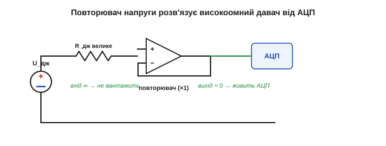
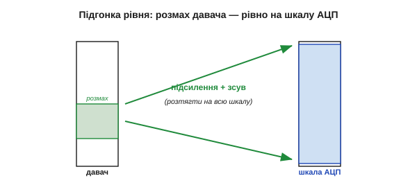
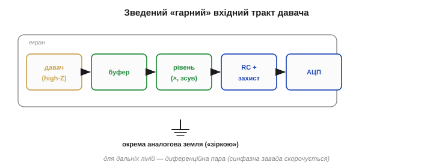

# Узгодження давача з входом

Опис давача — його характеристики, вади, калібрування — мовчки спирається на одне припущення: що сигнал давача **дійшов** до АЦП таким, яким його віддав давач. Це припущення часто хибне. Найперша ланка [вимірювального ланцюга](book:electronics/what-is-a-sensor) — саме з'єднання давача з тим, хто його читає, — здатна спотворити сигнал **ще до** будь-якого калібрування, тихо й системно. Звідси окрема велика тема: як під'єднати давач, щоб вхід його **не зіпсував**. Тут зійдуться [внутрішній опір джерела](book:electronics/internal-resistance), [дільник напруги](book:electronics/voltage-divider), [операційний підсилювач](book:electronics/voltage-follower) і [вибірка АЦП](book:electronics/adc).

### Сам акт під'єднання може зіпсувати сигнал

Наївна картина: з'єднав давач з АЦП — і читай. Реальність підступніша. Давач — **не ідеальне** джерело: у нього є власний **вихідний опір** (це [Тевенінів Rвн](book:electronics/internal-resistance)). А вхід, що читає, має скінченний **вхідний опір**. Щойно ви їх з'єднали, вони утворюють **[дільник напруги](book:electronics/voltage-divider)** — і виміряна напруга виходить **меншою** за справжню напругу джерела:


*Навантаження входом. Давач — це джерело U_дж із власним опором R_дж; вхід має опір R_вх. Разом вони — дільник, тож АЦП бачить не U_дж, а просаджену U_вим = U_дж · R_вх/(R_дж + R_вх). Що менший R_вх відносно R_дж, то більше втрачено.*

**Приклад (як вхід краде половину сигналу).** Давач із вихідним опором 100 кОм під'єднали до входу теж 100 кОм. Скільки дійде?

```
U_вим = U_дж · R_вх / (R_дж + R_вх)
U_вим = U_дж · 100к / (100к + 100к) = U_дж · 0.5
```

**Половина** сигналу зникла — і це не шум, не дрейф, а чистий ефект під'єднання, той самий [«просад під навантаженням»](book:electronics/internal-resistance) реального джерела. Найгірше — він **системний** і непомітний: давач начебто справний, калібрування навіть приховає його в одній точці, але варто змінитися вихідному опору давача — і вся шкала попливе.

Це класична пастка початківця, і підступна вона саме тим, що **з самого показу її не видно**: число виглядає правдоподібним, просто воно занижене. Аналогія груба, але влучна: коли міряєте тиск у шині дешевим манометром, частина повітря стравлюється в сам манометр — і ви читаєте менший тиск, ніж був, причому сам акт вимірювання його й змінив. З електричним сигналом те саме: добрий вимір майже **нічого не повинен брати** в джерела. Усе інше — різні способи виконати цю одну заповідь.

### Правило високого вхідного опору

Звідси проста, але непорушна вимога для сигналів-напруг: **вхідний опір має бути набагато більшим за вихідний опір давача**. Подивімось, що дає «набагато»:

```
R_вх = 10 · R_дж   →  доходить 10/11 ≈ 91 %  (втрата ~9 %)
R_вх = 100 · R_дж  →  доходить 100/101 ≈ 99 % (втрата ~1 %)
```


*Правило високого входу. Ліворуч: R_вх близький до R_дж — сигнал просів удвічі. Праворуч: R_вх у сотні разів більший — джерело майже не навантажене, доходить ~99 %. Для напруги завжди хочемо «дивитися, не торкаючись».*

Особливо небезпечні **високоомні** давачі — [п'єзо, ємнісні, скляний електрод pH, фотодіод](book:electronics/piezo-optical-semiconductor): їхній вихідний опір сягає мегаомів і навіть гігаомів, тож **майже будь-який** вхід їх просаджує. Саме таким давачам потрібен високоомний буфер.

Дзеркальне зауваження: правило «високий вхід» — саме для сигналів-**напруг**. Якщо давач віддає **струм** ([фотодіод, струмова петля](book:electronics/what-is-a-sensor)), усе навпаки: від входу хочуть **низького** опору, щоб струм ішов крізь нього, а не губився, — і такий струм перетворюють на напругу окремим вузлом (трансімпедансним підсилювачем на тому ж ОП). Тож «узгодження» завжди читають під **тип** сигналу. І ще: вхід — це не лише опір, а й невелика **ємність**; для повільних сигналів вона байдужа, а для швидких чи високоомних утворює з R_дж власну RC-затримку — ще одне приховане джерело похибки, яке теж лікує буфер із низьким виходом.

> 🔧 **Навіщо це.** Перше питання до незнайомого давача напруги — **який у нього вихідний опір?** Якщо одиниці кілоом — звичайний вхід АЦП впорається. Якщо сотні кілоом чи мегаоми — пряме під'єднання вкраде сигнал, і ніяке калібрування цього не врятує; такому давачу обов'язково потрібен буфер. Це питання вирішує долю виміру ще до першого відліку.

### Буфер: повторювач напруги

Як «дивитися, не торкаючись»? Класична відповідь — **[повторювач напруги](book:electronics/voltage-follower)** (*voltage follower*), або буфер (англ. *buffer* — прокладка, що пом'якшує поштовх), на операційному підсилювачі. У нього майже **нескінченний вхідний** опір (не навантажує давач) і майже **нульовий вихідний** (легко живить АЦП), а коефіцієнт — рівно одиниця: він просто **копіює** напругу.


*Буфер як розв'язка. Повторювач напруги вмикають між високоомним давачем і АЦП: своїм велетенським входом він майже не торкається джерела, а своїм потужним виходом упевнено заряджає вхід АЦП. Напруга та сама, але опір «знизився» з мегаомів до одиниць ом.*

Це **головний** засіб проти навантаження. Буфер ставить між джерелом і навантаженням «підсилювач струму без підсилення напруги»: давач бачить порожнечу, АЦП — потужне низькоомне джерело. Звідси й назва — буфер розв'язує (ізолює) одне коло від іншого за опором.

Працює він за [«золотими правилами» ОП](book:electronics/voltage-follower): зворотний зв'язок змушує вихід повторювати вхід, тож U_вих = U_вх за майже нульового вхідного струму. Та ідеального задарма не буває: буфер додає **власний** дрейф нуля, трохи шуму й має скінченну смугу — тобто сам стає ще однією ланкою тракту зі своїми [вадами](book:electronics/drift-hysteresis-noise), які теж ідуть у бюджет похибки. А коли треба не просто скопіювати, а **відняти** два високоомні сигнали (як у [вимірювальному мості](book:electronics/transducer-classes)), беруть спеціальний **[інструментальний підсилювач](book:electronics/instrumentation-amp)** — він дає величезний вхідний опір і чисте віднімання синфазної завади заразом.

> 🔧 **Навіщо це.** Повторювач коштує копійки, а рятує цілий вимір. Правило: після **будь-якого** високоомного давача — одиничний буфер, і клопіт із навантаженням зникає. Багато [«розумних» давачів](book:electronics/piezo-optical-semiconductor) тому й містять буфер усередині, що без нього їхній високоомний чутливий елемент не дотягнув би сигнал навіть до сусідньої ніжки.

### Підгонка рівня під АЦП

Не навантажити — лише півсправи. Сигнал ще має **влізти** в [діапазон АЦП із доброю роздільністю](book:electronics/sensor-characteristics). Замалий — підсилити (мікровольти термопари, що тонули в [кроці АЦП](book:electronics/adc-resolution)); завеликий — послабити дільником; зі зсувом не туди — підняти або опустити. Усе це робить той самий операційний підсилювач: задає **нахил (підсилення) і зсув**, перекидаючи діапазон давача рівно на діапазон АЦП.


*Підгонка рівня. Власний розмах давача (вузький чи надто широкий, не з нуля) підсиленням і зсувом «розтягують» рівно на вхідний діапазон АЦП — щоб жоден біт роздільності не пропав і ніщо не вилізло за стелю.*

Це пряме продовження [калібрування](book:electronics/calibration), тільки в **залізі**: калібрування править відліки числом, а тут готують аналоговий сигнал, щоб відліки взагалі були якісними. Добре узгоджений рівень — це коли весь робочий розмах давача займає майже всю шкалу АЦП, не впираючись у краї.

Дві засторо́ги про підсилення. По-перше, підсилювати треба **рано** — якомога ближче до давача: якщо дати слабкому сигналу спершу проїхати дротом і там зловити наводку, а тоді підсилити, ви підсилите сигнал **разом** із наводкою, і відношення сигнал/шум уже не врятувати. По-друге, підсилення **не створює** інформації: розтягнувши мікровольти у вольти, ви робите їх видимими для АЦП, але закладений у самому [давачі шум](book:electronics/drift-hysteresis-noise) розтягнеться рівно так само — підсилення за межею власного шуму джерела лише марнує діапазон. Тому підсилюють **рівно** стільки, щоб корисний розмах ліг на шкалу АЦП, і ні на йоту більше.

### АЦП теж навантажує: заряд конденсатора вибірки

Є ще тонший спосіб зіпсувати вимір, і він стосується **самого** [АЦП](book:electronics/adc). Його вхід — не пасивний опір: усередині сидить **конденсатор вибірки-зберігання**, який щоразу перед перетворенням мусить **зарядитися** до вхідної напруги. Якщо джерело високоомне, цей конденсатор **не встигає** дозарядитись у коротке вікно вибірки — і АЦП оцифровує недозаряджену, занижену напругу.


*Чому АЦП любить низький опір. Перед відліком ключ замикає вхід на конденсатор вибірки C_вб, і той заряджається крізь опір джерела зі [сталою τ = R_дж·C_вб](book:electronics/rc-time-constant). Великий R_дж — повільний заряд — недозаряд за вікно вибірки — занижений відлік.*

Ліки ті самі: **низький вихідний опір** джерела (тобто знову **буфер**), або невеликий конденсатор прямо на ніжці (він підживлює C_вб зарядом), або повільніша вибірка. Саме тому даташити АЦП (зокрема ESP32) прямо вказують максимальний допустимий опір джерела — перевищиш його, і відліки попливуть, хоч давач і тракт ідеальні.

**Приклад (чому опір джерела має бути малим).** Щоб похибка вибірки була меншою за крок, конденсатор має дозарядитися на ~n сталих часу (для 12 біт ≈ 9·τ). Якщо вікно вибірки коротке, єдиний важіль — малий R_дж:

```
τ = R_дж · C_вб        (стала заряду)
велике R_дж → велике τ → недозаряд за фіксоване вікно → похибка
мале   R_дж → малий τ → повний заряд → точний відлік
```

Тобто навіть «правильний» за рівнем сигнал АЦП оцифрує неправильно, якщо джерело надто високоомне. Буфер закриває і цю проблему одним рухом.

Ще гостріше це стає, коли один АЦП по черзі читає **кілька** входів через мультиплексор: конденсатор вибірки приходить на новий канал, ще «пам'ятаючи» заряд від попереднього, і якщо джерело високоомне, лишок чужого заряду домішується до показу — сусідні канали починають «підглядати» один в одного. Знов рятують низький опір джерела (буфер на кожен канал) або маленький конденсатор на ніжці, що швидко перебиває пам'ять вибірки. Тому в багатоканальних вимірах правило низького опору ще суворіше, ніж в одноканальних, — і недбалість тут дає найзагадковіші «плаваючі» покази, де один давач реагує на інший.

### Вхідний фільтр і захист

Корисно, що проста **RC-ланка** на вході працює одразу на три фронти. Як фільтр низьких частот вона **обрізає смугу**, гасячи [високочастотний шум](book:electronics/drift-hysteresis-noise) і завади. Вона ж служить **антиаліасним** фільтром, прибираючи частоти вище половини частоти дискретизації, які інакше «склалися» б у [хибний сигнал](book:communications/nyquist-aliasing). А додавши **послідовний резистор і діоди-обмежувачі**, та сама вхідна ланка ще й **захищає** ніжку від перенапруги й сплесків ([межі входу](book:electronics/pin-drive-limits), [діод-обмежувач](book:electronics/diode-bias)) — щоб несправність давача чи статика не вбили вхід.


*Скромна вхідна ланка з потрійною роллю. RC гасить шум і слугує антиаліасним фільтром перед АЦП; послідовний резистор і діоди-обмежувачі відводять перенапругу на шини живлення, рятуючи ніжку. Дешево — і відразу три користі.*

Тут важлива рівновага: занадто «важка» RC згладить і **корисний** сигнал (знов [компроміс смуга/затримка](book:electronics/drift-hysteresis-noise)), а її резистор додасть до вихідного опору джерела — тож фільтр і буфер проєктують разом, а не нарізно.

Як працює захист, варто бачити чітко: послідовний резистор **обмежує струм**, а діоди-обмежувачі відводять усе, що вилізло вище живлення чи нижче землі, на відповідні шини — отже, на ніжку приходить напруга лише в безпечних межах, навіть якщо ззовні прилетіло кілька зайвих вольтів чи статичний розряд. Без цієї копійчаної ланки перша ж несправність давача або дотик зарядженою рукою ([ESD](book:electronics/esd-damage)) може пробити вхід **назавжди**. Номінали підбирають так, щоб резистор обмежив струм до безпечного, але разом із ємністю входу не зарізав потрібну смугу, — тобто захист, фільтр і швидкодія знов тягнуть ковдру кожен на себе.

### Чистий зв'язок: екран, земля, диференційність

І останнє — як **довести** слабкий сигнал до входу, не зібравши доро́гою всі завади світу. Високоомні низькорівневі сигнали [ловлять наводки, мов антена](book:electronics/drift-hysteresis-noise): гул мережі, цокіт цифри, радіо. Практична гігієна проста й дієва: **короткі** виводи, **екранований** кабель (екран — на землю), тримати аналогову частину **подалі** від цифрової та силової, мати одну тверду **опорну** землю («зіркою»), а в найважчих випадках — **диференційний** зв'язок: вести сигнал як різницю двох проводів, тоді спільна для них завада **сама скорочується** під час віднімання (та сама ідея [придушення синфазного](book:electronics/transducer-classes), що й у вимірювальному мості).

Окремо варто назвати найкласичнішу причину гулу — **петлю по землі**. Якщо «земля» давача й «земля» приладу з'єднані **двома** різними шляхами, між ними тече паразитний струм, і на опорі проводів виникає різниця потенціалів, яка домішується до сигналу як 50-герцовий гул. Тому аналогову землю ведуть **однією точкою** («зіркою»), а не плутаною сіткою, і не змішують її з «брудною» землею силових та цифрових вузлів. Екран кабелю — окрема історія: його зазвичай заземлюють лише **з одного** кінця, щоб він відводив наводку на землю, а не сам перетворився на ту саму петлю, з якою бореться.


*Зведений «гарний» вхідний тракт. Високоомний давач → буфер (розв'язка) → підгонка рівня → вхідна RC з захистом → АЦП; сигнал у екранованому кабелі, аналогова земля окремо, для дальніх ліній — диференційна пара. Кожен елемент закриває одну з описаних бід.*

> 🔧 **Навіщо це.** Найдешевший спосіб прибрати шум — це часто **не** дорожчий давач, а правильне розведення: коротший провід, екран, окрема земля, подалі від перетворювача живлення. Проти чужої наводки навіть [найтихіший давач](book:electronics/drift-hysteresis-noise) безсилий, поки сигнал їде до входу відкритим проводом повз джерело завад.

### Передній край як єдине ціле

Цей непримітний «передній край» тихо вирішує, чи спрацює все, що далі в тракті. Узгодити опори, поставити буфер, підігнати рівень, дати АЦП зарядитись, відфільтрувати, заекранувати — і чесний сигнал давача нарешті доходить до АЦП неспотвореним, а [калібрування](book:electronics/calibration) повертає правдиву величину. Так замикається весь [вимірювальний ланцюг](book:electronics/what-is-a-sensor): від фізичної величини — до надійного числа в мікроконтролері.

Корисно тримати цей передній край як короткий **чек-лист**, що його проганяють для кожного давача: який у нього вихідний опір — і чи треба буфер; чи лягає його розмах на шкалу АЦП — і яке підсилення зі зсувом; чи встигне зарядитися конденсатор вибірки — і чи досить низький опір джерела; яку смугу лишити фільтром — і де поставити захист; як прокласти й заекранувати провід. Лише п'ять питань — та кожне здатне самотужки звести нанівець усю красу давача, його характеристик і калібрування, якщо на нього вчасно не відповісти.

Підсумок простий: добрий вимір майже **нічого не бере** в джерела, повністю використовує шкалу АЦП і доводить сигнал до входу чистим. Високий вхідний опір (а для високоомних давачів — буфер), грамотна підгонка рівня, низький опір джерела під вибірку АЦП, вхідний фільтр із захистом і охайне розведення зі спільною землею — разом вони й роблять із сирого виходу давача величину, якій можна вірити.
