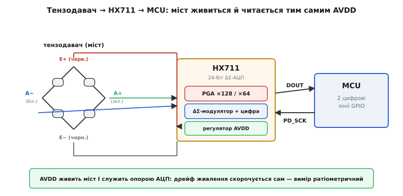
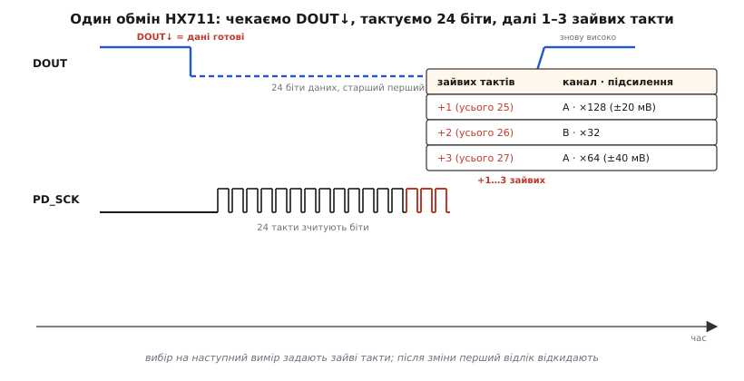

# 📋 HX711: розпіновка, підключення й протокол обміну

[Тензорезистор](topic:electronics/strain-gauges) сам по собі віддає крихітну зміну опору, а зібраний у міст давач — лише мілівольти: на повну робочу деформацію з моста знімається близько 2 мВ при живленні 5 В. Це не той сигнал, який мікроконтролер прочитає прямо: його вхідний АЦП крокує сотнями мікровольтів і просто не побачить різниці між «порожньо» і «вантаж». Між мостом і цифрою потрібні дві ланки — підсилювач, що підніме мілівольти у вольти, і АЦП, що оберне напругу на число. Мікросхема **HX711** дає обидві в одному корпусі, навмисне скроєні саме під міст. Ця довідка — про **інтерфейс** HX711: чому мікросхема саме така, якими чотирма дротами під'єднати до неї тензодавач, якими двома вона говорить із мікроконтролером і за яким протоколом віддає свої 24 біти. Готову функцію зчитування, що втілює цей протокол, і калібрування сирого коду у грами винесено окремо — у [приклад роботи з HX711](topic:electronics/strain-gauges/proj-loadcell-hx711.md).

## Що таке готовий тензодавач

Сам тензорезистор міряє власну деформацію; щоб виміряти **силу**, його клеять на пружне тіло відомої форми, яке під навантаженням деформується пропорційно до сили. Готовий тензодавач — це і є таке тіло разом із наклеєним мостом: брусок алюмінію чи сталі, профрезерований так, щоб під вагою прогинатись у потрібному місці, з чотирма тензорезисторами на зонах найбільшої деформації, з'єднаними в [повний міст Вітстона](topic:electronics/wheatstone-bridge). Назовні виведено рівно чотири дроти — дві лінії живлення моста й дві лінії його диференційного виходу.

Чому саме готовий вузол, а не россип тензорезисторів? Бо в зібраному давачі вже зроблено найважче й найкрихкіше: тензорезистори наклеєні з правильною орієнтацією на правильні зони, плечі підібрані в пару, температурна компенсація закладена самою симетрією повного моста (всі чотири плечі — той самий метал у тому самому кліматі, тож спільний нагрів скорочується в різниці). Виробник ще й нормує давач: на корпусі стоїть **гранична вага** (скажімо, 5 кг) і **чутливість** у мілівольтах на вольт живлення — типово близько 1 мВ/В. Цю пару чисел варто читати буквально:

```text
чутливість 1 мВ/В означає:
  на ГРАНИЧНІЙ вазі міст віддає 1 мВ на кожен вольт живлення

при живленні 5 В і навантаженні на повну межу:
  V_вих = 1 мВ/В × 5 В = 5 мВ

тобто весь робочий діапазон сигналу — від 0 до ≈ 5 мВ
```

П'ять мілівольтів на весь діапазон — ось масштаб, із яким доведеться працювати. Корисний крок ваги ще менший: щоб розрізнити 1 грам із 5 кг, треба побачити одну п'ятитисячну від цих 5 мВ, тобто **одиниці мікровольтів**. Звичайний 10- чи 12-бітний АЦП мікроконтролера тут безсилий. Саме тому під тензодавач ставлять не абиякий, а спеціальний тракт — і HX711 створено рівно для нього.

## Чому саме HX711, а не «будь-який АЦП»

HX711 — це 24-бітний аналого-цифровий перетворювач **дельта-сигма** (англ. *delta-sigma*) з вбудованим малошумним підсилювачем зі змінним коефіцієнтом, на одному кристалі з власним регулятором живлення й генератором тактів. Виробник — тайванська Avia Semiconductor. Усе в цьому переліку підібрано під одну задачу — чесно витягти одиниці мікровольтів з-під сталого фону, — і варто побачити, **чому** саме так.

**Підсилювач стоїть перед АЦП — і це головне.** Якби ми спершу оцифрували 5 мВ, а тоді підсилювали числа, ми б підсилили й шум, і похибку квантування разом із сигналом — нічого б не виграли. Тому в HX711 сигнал моста спершу проходить через **програмований підсилювач** (англ. *programmable gain amplifier*, PGA), а вже підсилений потрапляє в АЦП. Для основного входу (канал A) коефіцієнт — **128 або 64**. При підсиленні 128 повний діапазон входу — лише **±20 мВ**, при 64 — **±40 мВ** (обидва при живленні 5 В). Зіставте з нашими 5 мВ із моста: підсилення 128 якраз накриває цей сигнал, лишаючи запас, — тому це й типовий режим для ваг.

> 🔧 **Навіщо це.** Правило «підсилюй якомога раніше, у самому давачі» — не примха HX711, а загальний закон роботи зі слабкими [параметричними давачами](topic:electronics/what-is-a-sensor): кожна ланка після давача додає свій шум, тож що раніше підняти корисний сигнал над цим шумом, то чистішим він дійде до цифри. Звідси й сам сенс мостового підсилювача на кристалі поряд із входом.

**24 біти — не заради точності, а заради діапазону.** Дельта-сигма-АЦП дає 24 біти не тому, що остання значуща цифра справді корисна (вона тоне в шумі), а тому, що широке поле кодів дозволяє розкласти крихітний корисний сигнал так, щоб його молодші зміни не загубились у кроці квантування. По суті це запас роздільності, який бере на себе крок розрахунку «грами на код», — і тому навіть скромні ваги легко відрізняють грами.

**Дельта-сигма гасить мережеву заваду.** Така архітектура за природою усереднює сигнал на інтервалі перетворення, і HX711 навмисне підібрали цей інтервал так, щоб **придушити наводку 50/60 Гц** від силової мережі — найпоширенішу заваду в будь-якому приміщенні. Сам інтервал задає окремий вивід **RATE** — 10 або 80 вибірок за секунду. Повільніші 10 вибірок дають тихіший результат (довше усереднення — менше шуму), тому для точних статичних ваг беруть саме їх; 80 потрібні, коли вагу треба ловити в русі.

**Власний регулятор робить вимір ратіометричним — і це красиво.** HX711 живить міст не від зовнішнього джерела, а від власного аналогового виводу **AVDD**, і **той самий AVDD служить опорою АЦП**. Наслідок чудовий: якщо живлення трохи попливе, однаково зміняться і сигнал моста (бо міст живиться від AVDD), і опора, з якою АЦП цей сигнал порівнює, — і в частці одне на одне попливання скоротиться. Вимір виходить **ратіометричним** (лат. *ratio* — «відношення»): результат залежить від **відношення** сигналу до опори, а не від абсолютної напруги живлення. Той самий принцип «читай різницю/відношення, а не абсолют», що рятує сам міст від температури, тут удруге рятує весь тракт від дрейфу живлення.


*Місце HX711 у тракті. Зліва — тензодавач як повний міст із чотирма виводами; HX711 живить його зі свого AVDD (червоний шлях) і цим самим AVDD задає опору АЦП — тому дрейф живлення скорочується сам (ратіометричний вимір). Праворуч до мікроконтролера йдуть лише дві цифрові лінії: DOUT (дані) і PD_SCK (такт). Уся аналогова крихкість лишається на коротких дротах ліворуч від мікросхеми.*

## Підключення: чотири дроти моста, два дроти до цифри

Розпіновка з боку моста повторює чотири виводи тензодавача, і кольори дротів у переважної більшості комірок стандартні:

```text
вивід HX711   призначення              типовий колір дроту
  E+          живлення моста (+AVDD)    червоний
  E−          живлення моста (земля)    чорний
  A+          вихід моста, плюс         зелений
  A−          вихід моста, мінус        білий
```

E+ і E− (від *excitation* — «збудження») подають живлення на одну діагональ моста; A+ і A− знімають диференційний сигнал з іншої. Канал A — основний, із підсиленням 128/64; є ще канал B з фіксованим підсиленням 32 (виводи B+/B−) — його беруть під другий давач або не чіпають зовсім. Полярність не критична до незворотності: переплутаєте E+ з E− чи A+ з A− — давач працюватиме, лише знак сигналу обернеться, і це потім підхопить калібрування. Та краще під'єднати за кольором одразу, щоб «порожньо» давало малий код, а навантаження його збільшувало.

З боку мікроконтролера дротів лише два, обидва цифрові: **DOUT** (вихід даних від HX711) і **PD_SCK** (вхід такту й керування від мікроконтролера). Жодного аналогового сигналу між мікросхемою й мікроконтролером уже немає — усе крихке лишилось на коротких дротах моста, а далі біжать стійкі до завад логічні рівні. Живлення мікросхеми — 2.6–5.5 В; для ваг його тримають на 5 В, бо більший AVDD означає більший сигнал моста (ті самі мВ/В × більше вольт). Споживання мізерне: менш як 1.5 мА в роботі й менш як 1 мкА у сні.

## Як прочитати: протокол на двох ногах

Інтерфейс HX711 — не стандартний SPI чи I²C, а власний простий протокол на двох лініях, і його логіка цілком випливає з того, що мікросхема робить.

Усе починається з **готовності даних**. HX711 перетворює безперервно; коли черговий відлік готовий, мікросхема **опускає DOUT у низький рівень**. Поки DOUT високий — даних ще нема, чекаємо. Це елегантно: не потрібен окремий вивід «готово», сама лінія даних у спокої сидить високо й сама ж сигналить спадом, що пора читати.

Прочитавши спад, мікроконтролер **видає такти по PD_SCK** і на кожному такті знімає черговий біт із DOUT. Бітів **24**, старший перший (англ. *MSB first*). Дані — у **доповняльному коді** (англ. *two's complement*): код від 0x800000 (найнегативніший) через нуль до 0x7FFFFF (найпозитивніший), тож знак напруги моста природно лягає у знак числа.

Найхитріше — **зайві такти після 24-х**. Видавши 24 такти й знявши всі біти, мікроконтролер дає ще від одного до трьох тактів, і саме їхня **кількість задає канал і підсилення для наступного перетворення**:

```text
зайвих тактів   усього тактів   що вибрано на НАСТУПНИЙ відлік
     1               25          канал A, підсилення 128  (±20 мВ)
     2               26          канал B, підсилення 32
     3               27          канал A, підсилення 64   (±40 мВ)
```

Перший зайвий (25-й загалом) такт заодно повертає DOUT назад у високий рівень — мовляв, відлік забрано. Якщо весь час читати з тими самими 25 тактами, давач так і лишається на каналі A з підсиленням 128 — звичний режим ваг.


*Протокол читання HX711. Угорі — лінія DOUT: високо (даних нема) → спад (дані готові) → 24 біти знімаються тактами → перший зайвий такт повертає її високо. Унизу — такти PD_SCK: 24 робочі зчитують біти, а 1–3 зайвих (червоні) задають канал і підсилення вже для наступного перетворення. Таблиця показує відповідність: 25 тактів — канал A ×128, 26 — канал B ×32, 27 — канал A ×64.*

Є одна тонкість часу, через яку рветься багато перших прошивок. Зміна каналу чи підсилення (тобто інша кількість зайвих тактів) перемикає вхід PGA, і **перший відлік після такої зміни ще «брудний»** — його треба відкинути. Так само після ввімкнення: HX711 виходить на стабільні відліки не миттєво — близько 400 мс при 10 вибірках/с і близько 50 мс при 80. На практиці: після подачі живлення чи зміни режиму зробіть один холостий зчит і викиньте його.

І ще одне, заради чого PD_SCK названо саме так (*power-down clock*): якщо **затримати PD_SCK у високому рівні довше ніж 60 мкс**, HX711 засинає (споживання падає під 1 мкА). Відпустили в низький — прокидається. Тут є пастка: після сну вибір каналу й підсилення скидається в типовий (канал A, 128), тож після пробудження знову зробіть холостий зчит, щоб відновити потрібний режим і відкинути перший брудний відлік.

Це і є весь інтерфейс: чотири дроти моста в E±/A±, дві цифрові лінії до мікроконтролера, спад DOUT як сигнал готовності, 24 біти старшим уперед і 1–3 зайвих такти на вибір каналу. Робочу функцію зчитування, що втілює цей протокол, і переведення сирого коду у грами калібруванням зібрано в [окремому прикладі роботи з HX711](topic:electronics/strain-gauges/proj-loadcell-hx711.md).
