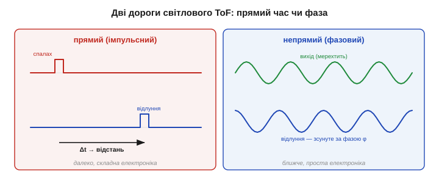
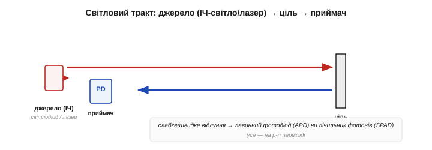
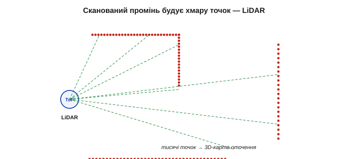

# Час польоту: світло/лазер

Замінімо звук на світло — і принцип той самий, а характер давача змінюється до невпізнання. Світло летить майже в **мільйон разів** швидше за звук, тож світловий далекомір вузький, точний, швидкий і байдужий до вітру й температури повітря. Плата — час польоту стає таким коротким, що зміряти його стає **головною інженерною проблемою**. Саме на цьому принципі стоять лазерні далекоміри й LiDAR, що малюють тривимірні карти для автономних машин. Далі — про те, як приборкати наносекунди й чим за це доводиться платити.

### Та сама формула — мільйон разів швидше

Формула не змінилась, лише швидкість:

```
d = c · t / 2          c ≈ 3 × 10⁸ м/с (швидкість світла)
```

Уся різниця — в **часі**. Подивімось, що це означає на практиці:

```
ціль 1 м:   t = 2·1 / (3×10⁸)     ≈ 6.67 нс
ціль 1 см:  t = 2·0.01 / (3×10⁸)  ≈ 67 пс  (пікосекунд!)
```


*Та сама d = c·t/2, але до цілі за 1 м світло вертається за 6.67 нс, а кожен сантиметр — це лише 67 пікосекунд. Простий таймер тут безсилий: щоб різнити сантиметри, потрібен годинник із пікосекундною роздільністю.*

**Приклад (чому це так важко).** Щоб розрізняти сантиметри світловим ToF, треба міряти час із роздільністю близько 67 пс. Звичайний таймер мікроконтролера цокає десятками наносекунд — у тисячу разів грубіше. Тому світлові далекоміри несуть **спеціальну** надшвидку електроніку (час-цифровий перетворювач), а не звичайний [лічильник-таймер](book:programming/timer-counter) мікроконтролера. Ось чому лазерний далекомір дорожчий за ультразвуковий, хоч формула однакова.

Варто оцінити, наскільки ці пікосекунди малі. За 67 пс світло долає лише два сантиметри, тож електроніка мусить розрізняти події, рознесені в часі тонше, ніж блимне найшвидший транзистор. Роблять це **час-цифровим перетворювачем** (*TDC*) — вузлом, що міряє інтервали з роздільністю в одиниці пікосекунд, користуючись затримками самих логічних вентилів як «лінійкою часу». До слова, сама **скінченність** швидкості світла довго здавалася неймовірною: ще у XVII столітті данець Оле Ремер уперше довів, що світло летить не миттєво, спостерігаючи запізнення затемнень супутників Юпітера. Те, що колись ледве вдалося виміряти астрономічно, тепер ловить дешевий чип у далекомірі.

Але винагорода щедра. Світло летить **вузьким** променем (точний напрямок, гостра роздільність), **далеко**, **швидко** оновлюється — і, на відміну від звуку, його швидкість майже **не залежить** від температури, вітру чи вологості повітря. Той повітряний дрейф, що псував [ультразвуковий далекомір](book:electronics/tof-ultrasonic), світла майже не торкається.

### Дві дороги: прямий час чи фаза

Приборкати наносекунди можна двома різними способами — двома дорогами [безконтактного вимірювання відстані](root:embedded/contactless-distance).

**Прямий (імпульсний) ToF** — як в ультразвуку: шлють дуже короткий **спалах** світла й засікають мить приходу відлуння надшвидким годинником. Це шлях **далеких** далекомірів і LiDAR — він бере сотні метрів, але вимагає найскладнішої пікосекундної електроніки.

**Непрямий (фазовий) ToF** — хитріший обхід: світло не імпульсами, а **неперервно**, з модульованою (мерехтливою) яскравістю на відомій частоті; вертається воно з тим самим мерехтінням, але **зсунутим за фазою** — бо поки літало, мерехтіння «відстало». Цей фазовий зсув і кодує відстань, а зміряти фазу набагато легше, ніж пікосекунди. Тому фазовий спосіб панує в **компактних** далекомірах ближньої й середньої дії.

У кожної дороги — своя плата. Прямий спосіб мусить втиснути багато енергії в коротесенький спалах, щоб з далекої цілі повернулося бодай кілька фотонів; найчутливіші далекоміри тому **рахують поодинокі фотони** й накопичують гістограму їхніх моментів приходу за тисячі спалахів, аж поки справжній пік не випливе з шуму (те саме [усереднення проти шуму](book:electronics/drift-hysteresis-noise), лише над фотонами). Фазовий же спосіб світить **неперервно**, тож витрачає більше середньої потужності й гірше бере дуже далеко, зате його електроніка проста й дешева. Звідси й поділ праці: прямий — для дальніх LiDAR, фазовий — для кишенькових далекомірів.


*Дві дороги світлового ToF. Прямий: короткий спалах і засічка моменту приходу пікосекундним годинником — далеко, але складно. Непрямий: неперервне мерехтливе світло, а відстань читають із фазового зсуву відлуння — простіше, ближче.*

### Фазовий спосіб і пастка неоднозначності

Розгляньмо фазовий спосіб уважніше, бо саме він у дешевих модулях. Світло мерехтить на частоті f; відлуння приходить із фазовим зсувом φ, пропорційним часу польоту, а отже, відстані:

```
d = c · φ / (4 · π · f)
```

Та фаза має підступ: вона «крутиться по колу» й після повного оберту (2π) **починається спочатку**. Тому відстані, що відповідають φ і φ+2π, нерозрізненні — фаза **«заплутується»** (*wrap*), і вимір стає неоднозначним. Найбільша відстань, яку фаза ще читає однозначно, — це коли вона саме добігає 2π:

```
неоднозначна дальність = c / (2 · f)
```


*Відлуння повертається зсунутим за фазою на φ — це й дає відстань. Та коли політ довшає, φ доходить 2π і обнуляється: далі давач не відрізнить «далеко» від «дуже далеко». Однозначно він міряє лише до c/(2f).*

**Приклад (де фаза «заплутується»).** Модуляція на f = 10 МГц. Доки вимір однозначний?

```
неоднозначна дальність = c / (2·f) = 3×10⁸ / (2·10⁷) = 15 м
```

За 15 метрів давач уже не скаже, чи ціль за 16 м, чи за 1 м. Тут видно компроміс: **вища** частота модуляції дає кращу роздільність, але **меншу** однозначну дальність. Тому точні фазові далекоміри міряють одразу на **кількох** частотах — груба низька знімає неоднозначність, тонка висока дає роздільність.

Це той самий прийом, що й годинник зі стрілками: годинна стрілка груба, але однозначна на пів доби, а секундна точна, та сама собою не каже, котра година — лише разом вони дають і діапазон, і точність. Так само багаточастотний фазовий далекомір поєднує «грубу» й «тонку» модуляцію, щоб мати водночас і велику однозначну дальність, і дрібну роздільність; саме тому в його даташиті стоять відразу кілька частот, а не одна.

### Джерело й приймач: світлодіод, лазер, фотодіод

Світло теж буває різне. **Світлодіод** — дешевий, але світить розсіяно й недалеко; **лазерний діод** — дає тонкий зібраний промінь, б'є далеко й точно, та змушує думати про безпеку очей. Майже завжди світло **інфрачервоне**: людині невидиме й менше плутається з ним денне сонце. Ловить відлуння [**фотодіод**](book:electronics/piezo-optical-semiconductor); а коли відлуння кволе й швидке, беруть чутливіші прилади — лавинний фотодіод (із внутрішнім підсиленням) чи навіть лічильник окремих фотонів, що засікає кожен квант світла з пікосекундною точністю.

Дрібниці тут не дрібні. Інфрачервону довжину хвилі часто беруть близько 940 нм не випадково: саме там у сонячному спектрі є **провал** (атмосфера поглинає цю смугу), тож денна засвітка слабша й давачу легше почути власне світло на тлі сонця. Лазерні діоди для далекомірів нерідко роблять **поверхнево-випромінювальними** (VCSEL) — компактними й дешевими у виробництві. А лавинний фотодіод чутливіший за звичайний тому, що один народжений фотоном носій лавиною вибиває в кристалі багато інших — це внутрішнє підсилення прямо в переході, споріднене з лавинним пробоєм [напівпровідникового переходу](book:electronics/piezo-optical-semiconductor).


*Джерело — інфрачервоний світлодіод (дешево, розсіяно) або лазерний діод (вузько, далеко); приймач — фотодіод, а для слабких швидких відлунь — лавинний фотодіод чи лічильник фотонів. Усе на тому самому p-n переході.*

> 🔧 **Навіщо це.** Лазер вимагає поваги: інфрачервоний промінь **невидимий**, тож око не встигає замружитись, а потужний лазерний далекомір здатен пошкодити сітківку. Тому такі прилади мають класи безпеки за потужністю, і навіть «безпечний» клас не варто світити в очі. Невидимість тут не перевага, а додаткова небезпека — на відміну від ультразвуку, який щонайбільше неприємний.

### Вузький промінь — і ціна чутливості до поверхні

За точність світло править свою ціну. Щоб виміряти відстань, до приймача має повернутися **достатньо фотонів**, — а скільки їх повернеться, залежить від **поверхні** цілі. Біла чи дзеркально-зворотна ціль вертає багато світла — далекомір бере її здалека; **чорна** поглинає майже все — дальність падає в рази або вимір зривається зовсім; **дзеркало** під кутом відбиває промінь убік, повз приймач; **прозоре** скло світло просто пропускає. Тому дальність світлового давача завжди вказують **для певної відбивності** (скажімо, 90 % білого), а на темній цілі вона буде значно меншою.

За цим стоїть невблаганна арифметика фотонів. Світло, відбите від звичайної матової поверхні, розсіюється навсібіч, тож до приймача вертається лише крихітна частка, яка ще й спадає приблизно як **1/d²** з відстанню. Подвоїли дистанцію — учетверо менше світла; а темна поверхня з'їла ще й більшу частку того, що мало повернутися. Тому дальність світлового ToF обмежена не годинником, а **бюджетом фотонів**: точно засікти час давач устиг би й до кілометра, та назад просто нічого не прилітає. Дзеркальна (блискуча) ціль поводиться ще підступніше за матову — вона відбиває все в один бік, тож або сліпить приймач прямим відблиском, або не дає нічого зовсім.


*Світле тіло вертає багато фотонів — давач бачить далеко; чорне поглинає — дальність мала; дзеркало під кутом і прозоре скло відлуння до приймача не повертають зовсім. Дальність у даташиті — завжди для заданої відбивності.*

Окремий ворог — **денне світло**. Яскраве сонце саме сипле інфрачервоним, заливаючи приймач сторонніми фотонами, у яких тоне кволе відлуння. Рятують вузький **світлофільтр** (пропускає лише довжину хвилі давача), **модуляція** (приймач упізнає лише власне мерехтливе світло, а рівне сонячне ігнорує) і короткі потужні спалахи. Це пряме застосування [боротьби з шумом і смугою](book:electronics/drift-hysteresis-noise).

> 🔧 **Навіщо це.** Якщо в даташиті лазерного далекоміра написано «до 4 м», читайте дрібний шрифт: 4 м — це до **білої** стіни в **тіні**. Чорна тканина на сонці може дати 0.5 м або «немає цілі». Світловий ToF блискучий на світлих поверхнях у приміщенні й примхливий на темних під сонцем — закладайте це в розрахунок, а не дізнавайтеся в польоті.

### Світло не залежить від повітря — великий виграш

А ось де світло однозначно переважає звук. Швидкість світла в повітрі майже не залежить ні від температури, ні від вологості, ні від вітру (показник заломлення повітря ≈ 1.0003, мало не як у вакуумі). Тому світловий ToF **не потребує** температурної компенсації середовища, яка мучила [ультразвуковий далекомір](book:electronics/tof-ultrasonic): холодний ранок чи спекотний полудень — той самий точний результат. Дрейфує тут лише ціль і заважає лише засвітка; саме повітря на шляху променя — чесне.

Чесне, поки воно **чисте**. Тут варто бути точним: світло незалежне від температури й вологості повітря — так, але не від **завислих частинок**. Туман, дощ, пил, дим **розсіюють** і поглинають світло, тож у негоду світловий далекомір сліпне там, де ультразвук, а надто радар, ще бачать. Сильне марево над гарячим асфальтом ще й трохи **викривлює** промінь. Тож «байдужий до повітря» означає байдужий до його температури й вологості — але не до того, що в повітрі **літає**.

> 🔧 **Навіщо це.** Правило вибору середовища просте: чисте повітря, світла ціль, потрібна точність — світло; пил, туман, дим, темна чи м'яка ціль — звук (а на великій дальності в негоду — радар). Лазерний далекомір, поставлений на запилений склад чи в туман, даватиме провали саме тоді, коли потрібен найбільше. Носій сигналу добирають під найгірші очікувані умови, а не під лабораторні.

### Від точки до карти: сканування й LiDAR

Один світловий далекомір дає **одну** відстань в одному напрямку. Та якщо промінь швидко **повертати** й вимірювати в кожному напрямку, з тисяч точок складається ціла **карта** глибини — хмара точок. Це і є **LiDAR** (*Light Detection And Ranging*) — світловий брат радара.


*Поодинокий ToF-вимір дає одну відстань; обертаючи промінь (дзеркалом, що крутиться, мікродзеркалом MEMS або підсвічуючи всю сцену спалахом), давач набирає тисячі точок і будує тривимірну карту оточення — основу зору автономних машин.*

Сканувати можна по-різному: дзеркалом, що обертається, крихітним мікродзеркалом (MEMS), або зовсім без рухомих частин — освітити всю сцену одним спалахом і зчитати відстань кожним пікселем матриці-приймача. Так далекомір із «однієї цятки» виростає в очі робота, що бачать форму світу, а не лише «щось попереду».

Саме така хмара точок — фундамент сучасної навігації: за нею апарат будує карту, впізнає стіни й двері, об'їжджає перешкоди й визначає власне положення (це зватиметься SLAM — одночасні картографування й локалізація). Сканувальний LiDAR із дзеркалом дає дальню, щільну картину, але має рухому частину, що зношується; **спалаховий** (flash), без рухомих частин, надійніший і дешевший, та бере ближче й грубіше. Вибір між ними — той самий наскрізний компроміс «дальність і щільність проти простоти».

Між поодиноким далекоміром і повним LiDAR є й популярна середина — крихітний **однопроменевий** ToF-модуль завбільшки з ніготь, що віддає одну відстань цифровою лінією. Усю пікосекундну кухню (джерело, лічильник фотонів, годинник, обчислення) виробник заховав у кристал, і назовні виходить готове число в міліметрах — точно та сама ідея [«розумного давача»](book:electronics/piezo-optical-semiconductor). Такий модуль дає мобільному роботові точне «скільки до стіни прямо переді мною» дешево й без рухомих частин, хоч і лише в одному напрямку. У ньому вся світлова ToF-фізика стиснута до готового числа, що влізе на кінчик пальця.

### Звук проти світла: коли що

Зведімо два способи часу польоту — [ультразвуковий](book:electronics/tof-ultrasonic) і світловий — поряд: вони доповнюють одне одного майже в усьому.


*Ультразвук — дешевий, широкий, прощає колір, але повільний, короткий і боїться м'якого та температури повітря. Світло — точне, вузьке, далеке, швидке й байдуже до повітря, але дорожче, чутливе до поверхні й засвітки. Це не суперники, а взаємодоповнення.*

Грубий поділ праці: **ультразвук** — дешево й надійно намацати близьку широку перешкоду будь-якого кольору; **світло** — точно й далеко зміряти відстань до конкретної цілі чи побудувати карту, якщо ціль світла й сонце не б'є в лоб. Серйозний апарат часто несе обидва — і там, де сліпне один, бачить інший.

Корисно тримати в голові й **за чим саме** вони доповнюються. Світло перемагає в **точності, напрямку й дальності** на світлих цілях у чистому повітрі; звук — у **ціні, прощенні кольору й роботі в пилюці** на близьких широких перешкодах. Жоден не покриває всього: чорна тканина невидима для лазера, скло — для світла (зате ультразвук від нього відбивається чудово), туман глушить світло, а м'яке поглинає звук. Тому «бачити надійно» майже завжди означає **поєднати** різні фізики, а не шукати один ідеальний давач. Обидва способи, проте, борються з тією самою бідою — **виміром часу**: і ультразвук, і світло мусять засікти крихітний інтервал між посилкою й відлунням, тільки в світла він на шість порядків коротший. Дістати відстань можна й зовсім інакше — не з часу польоту, а з [геометрії кута](book:electronics/triangulation), де годинник узагалі не потрібен.

---
