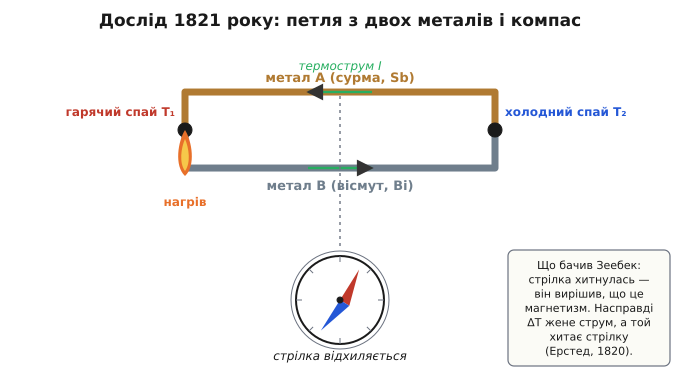
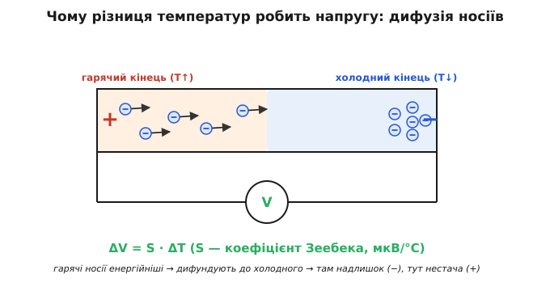
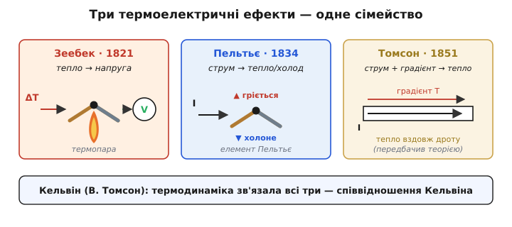
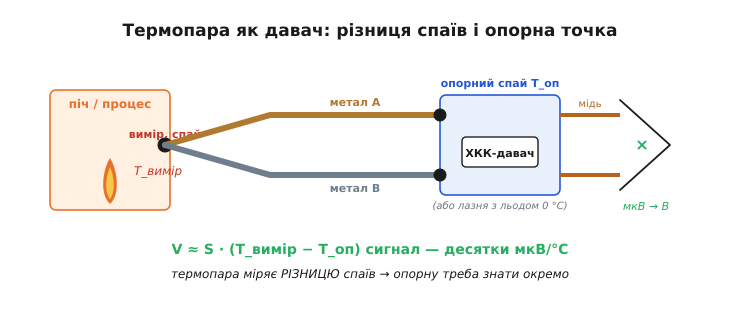

# 📜 Ефект Зеебека й термопара: як тепло само стало напругою

> Ця історія — про найчистіший, майже зухвалий приклад перетворення **фізичної величини на електричний сигнал**: пристрій, який робить напругу **просто з різниці температур**, не потребуючи жодної батареї. За ним стоїть гарна історія впертості й помилки — людина, що відкрила ефект, до кінця життя не вірила, що відкрила саме його. Майже кожне слово, яке ви побачите в даташиті на термопарний підсилювач — *thermocouple*, *cold junction*, тип *K*, мікровольти на градус, — це закам'янілий слід цієї історії.

Уявіть лабораторію 1821 року. Електрику вже вміють робити батареєю Вольти, уже рік як знають, що струм біля компаса хитає стрілку. Але ніхто ще не уявляє, що **звичайне тепло** — від свічки, від долоні — може саме, без хімії й без тертя, народити електричний струм. Зараз це станеться вперше, і людина, яка це побачить, витлумачить усе навпаки.

---

## Естонський лікар, що не хотів бути лікарем: Зеебек

**Томас Йоганн Зеебек** (*Thomas Johann Seebeck*, 1770–1831) народився в Ревелі — теперішньому Таллінні, столиці Естонії — у заможній **балтійсько-німецькій** купецькій родині. Тобто за місцем народження він естонсько-німецький фізик, а за родом і культурою — балтійський німець; «російським» його не роблять ні ці виміри, ні те, що Ревель тоді належав Російській імперії. Грошей у родині вистачало, щоб не думати про заробіток, і це визначило все життя: Зеебек вивчив медицину в Геттінгені, здобув ступінь доктора (1802), але **жодного дня не практикував лікарем**. Натомість занурився у фізику — епохи, коли фізик ще міг бути «натурфілософом»-універсалом, що руками перевіряє все підряд.

Він жив у Єні, в самому серці німецького романтизму, і потрапив у коло **Йоганна Вольфганга Гете**. Так, того самого Гете: поет захоплювався наукою про колір, і Зеебек був одним із його найближчих наукових співрозмовників — ставив досліди зі спектром, вивчав дію світла на хімічні розчини й намагнічення. Це не побічна деталь, а ключ до характеру: Зеебек був експериментатор-спостерігач із сильним нахилом бачити у явищах те, **що вже сидить у голові**. Ця риса й подарувала йому відкриття — і вона ж завадила йому це відкриття правильно зрозуміти.

До 1821 року Зеебек — поважний член Прусської академії наук у Берліні, людина з ім'ям. І саме тоді він натрапляє на дещо, чого світ не бачив.

---

## 1821 рік: стрілка, що хитнулася від тепла

Дослід, який увійшов в історію, був на диво простим. Зеебек узяв два **різні метали** — у класичній демонстрації це вісмут (*bismuth*, Bi) і сурма (*antimony*, Sb) або мідь — і з'єднав їх у **замкнену петлю**, тобто спаяв кінцями так, що утворилося два стики (їх називають **спаями**, англ. *junctions*). Поки обидва спаї мали однакову температуру, нічого не відбувалося. Та щойно Зеебек **нагрів один спай** — приклав полум'я або просто затиснув у пальцях, — поряд із петлею здригнулася магнітна стрілка компаса.


*Замкнена петля з двох різних металів і два спаї. Доки спаї однакові — спокій. Нагрієш один (ΔT між спаями) — у петлі тече струм, і його магнітне поле відхиляє стрілку компаса поряд. Зеебек побачив саме відхилення стрілки, а не «напругу».*

Це був момент відкриття: **різниця температур двох спаїв породжує в колі електричний струм**. Не хімія, не тертя, не машина — саме тепло. Сьогодні ми звемо це **ефектом Зеебека** (*Seebeck effect*), а саму пару металів — **термопарою** (*thermocouple*). Зеебек методично перебрав десятки металів і вишикував їх у **термоелектричний ряд** (*thermoelectric series*): що далі двоє в ряду, то сильніше хитається стрілка. Цей ряд — пряма рідня трибоелектричному ряду, що впорядковує матеріали за [електричним зарядом](topic:physics/electric-charge): обидва кажуть, який матеріал у парі «головніший».

> 🔧 **Навіщо це.** Те, що ви щойно прочитали, — це опис **самого живучого температурного давача в техніці**. Термопара досі вимірює температуру в печах, турбінах, двигунах, паяльних станціях — скрізь, де гарячо. Вона не потребує живлення, витримує тисячі градусів і коштує копійки. Кожен такий давач — це та сама петля Зеебека, лише акуратно оформлена.

---

## Уперта помилка: «термомагнетизм»

А тепер — найцікавіше. Зеебек побачив **відхилення стрілки** й зробив із цього висновок, який видається нам сьогодні дивовижно неправильним: він вирішив, що нагрітий метал **сам по собі намагнічується**. Явище він назвав **термомагнетизмом** (*Thermomagnetismus*) і до кінця життя відмовлявся визнавати, що в петлі тече звичайний електричний струм.

Іронія тут гостра аж до болю. Лише **роком раніше**, 1820-го, данець **Ганс Крістіан Ерстед** (*Hans Christian Ørsted*) зробив одне з найгучніших відкриттів століття: струм у дроті відхиляє магнітну стрілку — з цього виросте весь магнетизм струму, на якому стоїть [котушка індуктивності](topic:electronics/inductor-coil). Тобто наукова Європа вже знала: **хитнулась стрілка — десь тече струм**. Усі ознаки вказували, що тепло жене по петлі Зеебека струм, а вже той струм, за Ерстедом, крутить компас. Але Зеебек уперто тримався за «магнетизм».

Чому? Почасти — характер спостерігача, що бачить очікуване. Почасти — амбіція: Зеебек мріяв про щось грандіозніше за «ще один спосіб зробити струм». Він усерйоз припускав, що термомагнетизм пояснює **магнітне поле самої Землі**: мовляв, різниця температур між гарячим екватором і холодними полюсами намагнічує земну кору. Ідея велична — і хибна, але вона показує масштаб, у якому він мислив.

Виправив його сам **Ерстед**. Саме Ерстед (разом із математиком [Жозефом Фур'є](topic:math/fourier-idea)) правильно витлумачив явище як народження струму теплом і дав йому ім'я, що лишилося назавжди: **термоелектрика** (*thermoelectricity*). Природа явища — електрична; «термомагнетизм» Зеебека був лише магнітним **наслідком** струму.

> 🔧 **Навіщо це.** Ця історія — щеплення проти типової інженерної пастки. Прилад показав відхилення; що ви виміряли насправді — причину чи наслідок? Зеебек переплутав струм (причину) з його магнітним полем (наслідком) — і застряг. Коли давач щось «показує», завжди питайте: яка фізична величина за цим стоїть **насправді**? Половина помилок із сенсорами — це сплутані причина й наслідок.

---

## Чому тепло робить напругу: дифузія носіїв

Зеебек не знав про електрони — їх відкриють лише через 76 років. Ми знаємо, тож можемо чесно відповісти на «чому». У металі є **море вільних електронів**, що безладно сновигають ([дрейф електронів](topic:physics/electron-drift)). Тепер ключове: швидкість цього снування залежить від температури. На **гарячому** кінці провідника електрони енергійніші й рухливіші, на **холодному** — повільніші.


*Мікромеханізм. На гарячому кінці носії заряду енергійніші й частіше «вистрілюють» у бік холодного, ніж назад. Вони дрейфують туди, накопичуються — і холодний кінець стає **−**, а гарячий, збіднілий на електрони, **+**. Виникає напруга ΔV = S·ΔT, де S — коефіцієнт Зеебека.*

Гарячі електрони, як гарячий газ, **дифундують** туди, де холодніше, — і накопичуються на холодному кінці. Той заряджається від'ємно (надлишок електронів, **−**), а гарячий кінець лишається з нестачею електронів, тобто **додатним** (**+**). Цей розподіл заряду створює **напругу** — рівно в тому сенсі «джоуль на кулон», який задає [вольт](topic:physics/volt). Скільки саме напруги припадає на градус різниці — це **коефіцієнт Зеебека** (*Seebeck coefficient*, **S**), власна стала кожного матеріалу, зазвичай одиниці-десятки мікровольтів на градус:

```
ΔV = S · ΔT

S  — коефіцієнт Зеебека (мкВ/°C), властивість матеріалу
ΔT — різниця температур кінців
```

Тепер зрозуміло й те, **чому потрібні два різні метали**. Якби петля була з одного металу, обидві гілки давали б однаковий внесок і повністю гасили б одна одну — сумарної напруги нуль. Два різні метали мають **різні S**, тож їхні внески не гасяться, і в колі лишається різниця:

```
V_петлі = (S_A − S_B) · ΔT
```

Ось чому термопара — завжди **пара**. Не «гарячий метал робить струм», як гадав Зеебек, а **два метали з різною «тепловою чутливістю», ввімкнені назустріч**.

> 🔧 **Навіщо це.** Звідси випливає річ, що рятує в практиці: термопара **сама себе живить**. Вона не потребує опорного струму чи напруги, як резистивний давач, — вона **сама є джерелом** ЕРС, доки є різниця температур. Це робить її пасивним, автономним і невбивним давачем. Розплата — крихітний сигнал у мікровольтах, який доводиться дбайливо підсилювати.

---

## Зворотний бік медалі: Пельтьє охолоджує струмом (1834)

Якщо різниця температур жене струм — чи не можна навпаки, **струмом створити різницю температур**? Природа сказала «так», і виявив це **Жан-Шарль Атаназ Пельтьє** (*Jean-Charles Athanase Peltier*, 1785–1845) — за фахом… годинникар. Розбагатівши, він покинув ремесло близько тридцяти й присвятив себе науці. У **1834 році** Пельтьє пропустив струм крізь спай вісмуту й сурми й помітив, що спай **то нагрівається, то охолоджується** — залежно від напрямку струму.

Сам Пельтьє, як і Зеебек, спершу не зрозумів, що бачить: думав, що це якесь порушення закону Джоуля (тепло I²R, [джоулів нагрів](topic:physics/joule-heating)). Усе розставив по місцях **Гайнріх Ленц** (*Heinrich Lenz*, той самий, чиє правило ви знаєте з індукції) — теж балтійський німець, родом із Дерпта (нині Тарту), що працював в Академії наук у Петербурзі, — ефектним дослідом 1838 року: він посадив **краплю води** на спай і **струмом заморозив її на лід**, а потім, перемкнувши напрямок струму, — **розтопив**. Так стало очевидно: спай можна за бажанням і гріти, і холодити, керуючи лише напрямком струму. Це — **ефект Пельтьє** (*Peltier effect*).


*Одне сімейство ефектів. **Зеебек** (1821): тепло → напруга. **Пельтьє** (1834): струм → нагрів/охолодження спаю. **Томсон** (1851): струм уздовж градієнта температури виділяє або поглинає тепло. Кельвін показав термодинамікою, що всі три пов'язані.*

> 🔧 **Навіщо це.** Ефект Пельтьє — це не музейна цікавинка: на ньому працюють **термоелектричні охолоджувачі** (елементи Пельтьє) — ті самі пластинки, що холодять процесори, портативні холодильники, стабілізують температуру лазерів і матриць камер. Перевернути давач і зробити з нього виконавчий пристрій — класичний інженерний хід, і тут він буквальний: та сама пара металів то міряє температуру, то нею керує.

---

## Кельвін зводить кінці: термодинаміка трьох ефектів (1851)

Доти Зеебек і Пельтьє виглядали як два окремі курйози. Об'єднав їх у струнку теорію **Вільям Томсон** (*William Thomson*) — майбутній **лорд Кельвін**, на честь якого названо абсолютну шкалу температур. У **1851 році** він застосував до термоелектрики молоду тоді термодинаміку й довів, що ефекти Зеебека й Пельтьє — **не випадкові сусіди, а дві сторони одного явища**, жорстко пов'язані співвідношеннями (їх нині звуть **співвідношеннями Кельвіна**, *Kelvin relations*).

Понад те, теорія **передбачила третій ефект**, якого ще ніхто не шукав: якщо вздовж одного-єдиного провідника є градієнт температури й по ньому тече струм, провідник **додатково** поглинає або виділяє тепло — окремо від звичайного джоулевого нагріву. Томсон знайшов цей ефект і експериментально; тепер його так і звуть — **ефект Томсона** (*Thomson effect*). Це був тріумф методу: спершу математика на папері сказала «має бути третій ефект», а потім дослід його підтвердив.

> 🔧 **Навіщо це.** Урок Кельвіна — про **єдність**. Коли кілька начебто різних явищ описуються спорідненими формулами, майже напевно за ними одна причина. У сенсориці це економить голову: засвоївши один термоелектричний коефіцієнт, ви автоматично розумієте і його «дзеркало». Те саме повторюватиметься з резистивними, ємнісними, п'єзо-давачами — пряме й обернене перетворення майже завжди ходять парою.

---

## Від лабораторної цікавинки до робочого приладу: термопара

Понад півстоліття ефект Зеебека лишався радше демонстрацією. Щоб стати **вимірювальним приладом**, термопарі бракувало двох речей: відтворюваності й розуміння, що ж вона міряє.

Перший крок зробив француз **Анрі Ле Шательє** (*Henri Le Chatelier*) у **1886 році**, створивши термопару **платина / платина-родій**. Благородні метали не окислюються й не «пливуть» від нагріву, тож така пара давала **повторюваний** результат і витримувала температури печей — її одразу вхопила металургія. Саме з Ле Шательє термопара перетворилася з фокуса на еталонний інструмент (це нинішній тип **S** із таблиці нижче).

Друге — усвідомлення головного. Термопара міряє **не температуру, а РІЗНИЦЮ температур двох спаїв**. Той спай, що в гарячому місці, звуть **вимірювальним** (*measuring / hot junction*); другий, за відомої температури, — **опорним**, або **холодним** (*reference / cold junction*). Без відомої опорної точки сигнал не означає нічого: ті самі мікровольти можуть бути «300° проти 0°» або «320° проти 20°».


*Практична термопара. Вимірювальний спай — у процесі; два дроти ведуть до опорного спаю з відомою температурою. Сигнал — десятки мкВ/°C, тож його підсилюють. Стандартні типи позначають літерами (K, J, T, S…) — за парою сплавів.*

Історично опорний спай тримали в **танучому льоді** (0 °C) — звідси класичні «термопарні таблиці» завжди прив'язані до нуля. Сьогодні лід замінила **холодноспайова компенсація** (*cold-junction compensation, CJC*): поряд із клемами ставлять окремий простий давач температури, мікроконтролер зчитує температуру клем і **додає поправку** в розрахунок. Виросли з цього й кілька строгих правил (їх звуть «законами термопар») — про однорідний провідник, про проміжні метали (можна вставляти треті метали в коло, якщо їхні кінці однакові за температурою) і про додавання різниць температур. Усе це — щоб коректно перейти від сирих мікровольтів до градусів.

Стандартні пари метал-метал отримали **літерні позначення**, які ви й зустрінете в довідниках:

```
тип   метали (сплави)          S, мкВ/°C   діапазон, °C
K     хромель / алюмель         ≈ 41        −200 … +1260   ← найпоширеніший
J     залізо / константан       ≈ 51        0 … +760
T     мідь / константан         ≈ 41        −200 … +370
S     платина / платина-родій   ≈ 7         0 … +1600      ← еталонний, Ле Шательє
```

> 🔧 **Навіщо це.** Коли в проєкті бачите «термопара типу **K**» — це не марка деталі, а **рецепт пари сплавів** (хромель-алюмель) із відомою кривою мікровольтів. Тип одразу каже й діапазон, і чутливість. А слова *cold junction* у даташиті термопарного підсилювача — це пряма спадщина льодяної лазні Ле Шательє: чип просто робить електронно те, що колись робили відром із льодом.

---

## Що з цієї історії лишилось у вашому даташиті

Зеебек шукав магнетизм Землі, а знайшов температурний давач, яким людство користується вже два століття. Підсумуймо сліди, що ведуть звідси прямо в сенсорику:

- **Сама ідея давача.** Термопара — найчистіший приклад того, [що таке давач](topic:electronics/what-is-a-sensor): фізична величина (температура) перетворюється на електричний сигнал (напругу), та ще й **без зовнішнього живлення**. Це архетип «самогенерувального» перетворювача.
- **Малий сигнал — велика тема.** Десятки мікровольтів на градус — це причина, чому навколо давачів стільки уваги підсиленню, опорній напрузі й боротьбі з шумом: термопара першою показує, що «зчитати давач» — це окрема інженерна задача.
- **Різниця, а не абсолют.** Термопара міряє різницю спаїв — і це загальний мотив сенсорики: дуже часто давач чесно віддає лише **різницю** чи **зміну**, а «нуль» доводиться знати окремо (звідси [калібрування](topic:electronics/calibration) й опорні точки).
- **Слова.** *Thermocouple*, *Seebeck coefficient*, *cold junction*, типи *K/J/T/S* — лексика, що дослівно виросла з цієї історії й чекає на вас у кожному довіднику.

І головний урок — людський. Відкриття можна зробити, **не зрозумівши його**: Зеебек тримав у руках електричний струм із тепла й називав це магнетизмом. Природу явища дала не лабораторія, а правильне **питання** про причину. Саме з таких питань і починається фізика давачів.
