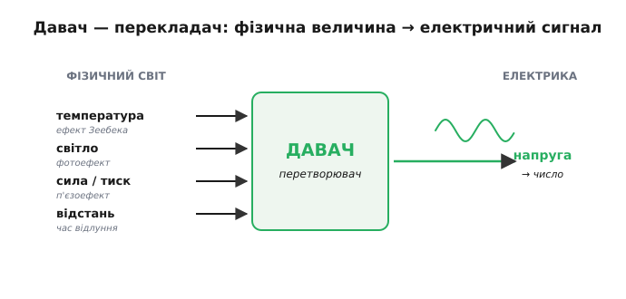
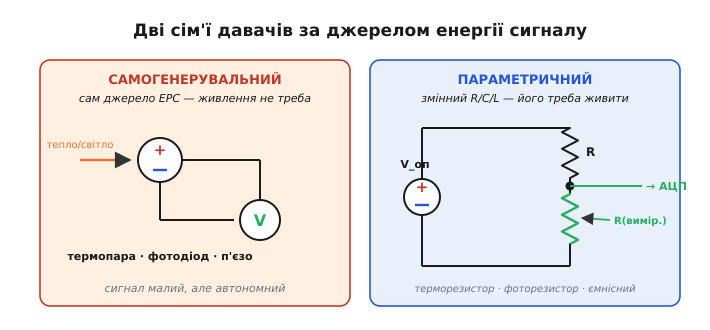
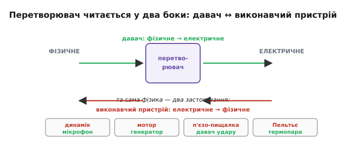
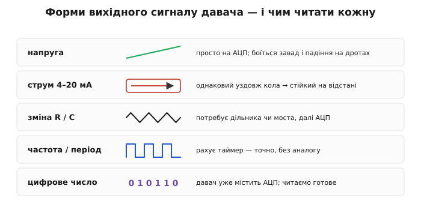

# Що таке давач: фізична величина → електричний сигнал

Електроніка вміє керувати електрикою: рухати заряд, підсилювати сигнал, рахувати такти. Та щойно ми хочемо, щоб пристрій **реагував на реальний світ** — на те, що стало гаряче, темно чи близько, — постає прірва. Мікроконтролер не знає, що таке «гаряче». Він знає лише число, яке віддав [АЦП](book:electronics/adc). Хтось мусить **перекласти** «гаряче» на «напругу». Цей перекладач і є давач, і вся тема — про те, як влаштований цей переклад і чому він ніколи не буває ідеальним.

І тут ховається підступ. Керувати електрикою легко у світі, де все під контролем: відомі напруги, чисті логічні рівні, передбачувані такти. Реальний світ натомість **брудний** — він не видає рівних чисел, він дає слабкі, зашумлені, спотворені натяки. Тому вимір — це окрема інженерна дисципліна, а не «припаяв давач — готово»: ту саму температуру можна відчути десятком способів, і кожен має свою ціну за точність, діапазон, швидкодію й живлення. Завдання — обрати спосіб і чесно оцінити, чому показанню можна (а чому не можна) вірити.

### Давач — це перекладач між двома світами

**Давач** (*sensor*), або ширше **перетворювач** (*transducer*), — це пристрій, що перетворює одну фізичну величину на іншу; коли «інша» — це зручний для нас **електричний сигнал**, перетворювач працює давачем. Величину, яку ми хочемо виміряти, називають **вимірюваною величиною** (*measurand*). У термопари вимірювана величина — температура, а сигнал — напруга в мікровольтах; зв'язок між ними задає коефіцієнт Зеебека (µВ/°C).

Світ «говорить» багатьма мовами — градуси, паскалі, люкси, ньютони, метри, — а мікроконтролер розуміє лише одну: **вольти** (а після АЦП — число). Давач — це двомовний словник між ними.


*Давач як перекладач: на вході — фізична величина зі свого «світу» (тепло, світло, сила, відстань), на виході — електричний сигнал, який уже вміє читати решта схеми. Кожному типу величини відповідає свій фізичний ефект перетворення.*

Найважливіше, що давач визначається **не зовнішнім виглядом, а своїм перетворенням** — тим, як вхідна величина відображається у вихідний сигнал. Для термопари це «41 мкВ на кожен градус». Знати давач — означає знати цю відповідність (її ще називають [передавальною характеристикою](book:electronics/sensor-characteristics)).

Слова навколо давача варто розрізняти, бо в даташитах вони стоять поряд. **Перетворювач** (*transducer*) — найширше поняття: будь-що, що переводить енергію з одного виду в інший. **Давач** (*sensor*) — перетворювач, націлений саме на **вимір** (фізичне → електричне). **Детектор** (*detector*) зазвичай дає лише «є/нема» — спрацював поріг, а не число (кінцевий вимикач, давач полум'я). А коли той самий пристрій вмикають навпаки — електричним сигналом діяти на світ, — його звуть **виконавчим пристроєм**.

Глибша рамка, яка наводить лад, — **енергетичні домени** (*energy domains*). Природа «розраховується» кількома видами енергії: тепловою, механічною, оптичною, хімічною, магнітною — й електричною. Давач — це обмінник, що переводить будь-яку з цих «валют» в **електричну**, бо саме з нею вміє працювати решта системи. Тому кожній парі доменів відповідає свій набір фізичних ефектів: тепло → електрика (Зеебек), світло → електрика (фотоефект), механіка → електрика (п'єзо- й тензоефект). Упізнавши домен вхідної величини, майже завжди можна вгадати, який ефект ляже в основу давача, — і навпаки.

### Вимірювальний ланцюг: від величини до числа

Сирий сигнал давача майже ніколи не годиться для АЦП напряму: він буває **надто малий** (мікровольти термопари), **зашумлений** або взагалі **не у формі напруги** (зміна опору, ємності). Тому між вимірюваною величиною й осмисленим числом стоїть **ланцюг**:


*Повний вимірювальний ланцюг. Кожна ланка — це окремий інструмент: [підсилювач](book:electronics/ideal-opamp) піднімає мікровольти, RC-фільтр гамує шум, [АЦП](book:electronics/adc) робить із напруги число.*

Краса в тому, що тут сходиться вся аналогова електроніка. Чутливий елемент дає крихітний сигнал — його **підсилює** [операційний підсилювач](book:electronics/ideal-opamp). Сигнал тремтить від завад — його згладжує **фільтр** на [конденсаторі](book:electronics/capacitor). Аналогову напругу в число перетворює [**АЦП**](book:electronics/adc). Давач — це не одна деталь, а весь цей тракт.

> 🔧 **Навіщо це.** Тримати ланцюг у голові — означає знати, **де лагодити**. Сигнал заслабкий, тоне в кроці АЦП — проблема в підсиленні. Число «скаче» — проблема в шумі й фільтрі. Число стабільне, але «бреше» — проблема в [калібруванні](book:electronics/calibration). Кожна біда живе у своїй ланці.

**Приклад (чому без підсилювача термопару не прочитати).** Візьмімо термопару типу K (≈ 41 мкВ/°C) і захочемо розрізняти 0.1 °C. Подивімось, що «бачить» типовий 12-бітний АЦП мікроконтролера з діапазоном 3.3 В:

```
крок АЦП (LSB) = 3.3 В / 4096 ≈ 0.806 мВ = 806 мкВ
сигнал на 0.1 °C = 41 мкВ/°C × 0.1 °C = 4.1 мкВ

4.1 мкВ  ≪  806 мкВ   → 0.1 °C тоне далеко в одному кроці АЦП (≈ у 200 разів менший)
```

Щоб 0.1 °C стало хоча б одним кроком АЦП, сигнал треба підсилити приблизно в **200 разів** (806 / 4.1 ≈ 197). Ось чому між термопарою й АЦП **завжди** стоїть підсилювач: без ланки нормування давач просто невидимий для мікроконтролера.

### Давач міряє не саму величину, а її електронний слід

Тонкість, яку легко проґавити: давач майже ніколи не міряє вимірювану величину **прямо**. Він міряє якийсь її **електричний наслідок** — напругу від різниці температур, опір, що змінився з нагрівом, ємність, що зросла від вологи. Терморезистор «не знає» жодних градусів — він лише має опір, який ми зчитуємо; температуру ми **домислюємо** з відомого зв'язку «опір ↔ градуси». Тобто давач робить **прямий** хід (величина → сигнал), а програма мусить зробити **обернений** (сигнал → величина), застосувавши передавальну характеристику задом наперед.

Це і є прихована половина роботи з давачем — **обернена задача** (*inverse problem*). Сам давач віддає лише число; перетворити його назад у градуси, метри чи ньютони — обов'язок коду, через формулу або довідкову таблицю. І якщо характеристика **нелінійна** (а вона зазвичай така — опір NTC круто падає з нагрівом), оберненням буде не множення на сталу, а ціла крива. Тому «зчитати давач» і «дізнатися величину» — два різні кроки, і другий нерідко складніший за перший. Саме на ньому тримається [калібрування](book:electronics/calibration): воно якраз і будує той зворотний шлях від сирого числа до правдивої величини.

### Дві сім'ї давачів: хто живиться сам, а кого треба «питати»

Давачі діляться на дві великі сім'ї за тим, **звідки береться електрична енергія сигналу**.

**Самогенерувальні** (*self-generating*) давачі роблять сигнал **із самої вимірюваної енергії** — вони і є джерелом ЕРС або струму. Термопара (ефект Зеебека), [фотодіод](book:electronics/led-photodiode), п'єзоелемент. Їм **не потрібне зовнішнє живлення**: тепло, світло чи натиск самі «виштовхують» заряд. Плата за це — сигнал зазвичай **дуже малий** і заданий фізикою (на самому давачі його не «накрутиш»).

**Параметричні** (*modulating*), або ті, **що потребують живлення**: вимірювана величина змінює якусь **пасивну властивість** — [опір](book:physics/resistance) R, [ємність](book:electronics/capacitor) C чи [індуктивність](book:electronics/inductor-coil) L. Сам по собі змінений опір «не світиться» — щоб його **прочитати**, давач треба живити відомим струмом чи напругою. Терморезистор (R залежить від T), фоторезистор, ємнісний давач, тензодавач. Плата — потрібне **стабільне опорне** живлення, а струм через елемент ще й трохи його гріє.


*Дві сім'ї. Ліворуч: самогенерувальний давач сам є джерелом — вольтметр читає його ЕРС напряму. Праворуч: параметричний давач — це змінний R (чи C, L); його вмикають у дільник і **живлять** опорною напругою, щоб зміна опору стала зміною напруги.*

(Застереження про слова: у літературі ці сім'ї часто звуть «активними» й «пасивними» — але плутано, бо різні автори вкладають у ці слова протилежний зміст. Надійніший поділ — саме за тим, **чи давач сам генерує сигнал, чи потребує живлення**.)

> 🔧 **Навіщо це.** Ця приналежність визначає весь вхідний тракт. Самогенерувальний давач працює без живлення, але дає мікровольти — готуйте малошумний підсилювач. Параметричний треба забезпечити **стабільним опорним** джерелом, інакше «попливе» не давач, а ваше живлення. Перше питання до незнайомого давача: він сам джерело — чи його треба живити?

З параметричним давачем є гарний трюк, що прямо випливає з дільника. Його вихід — це **частка** опорів, R_давача / (R_верх + R_давача), помножена на опорну напругу. Якщо тією самою опорною напругою живити **і дільник, і [АЦП](book:electronics/adc)**, то будь-яке хитання живлення скорочується: чисельник і знаменник пливуть разом, і число на виході від нього не залежить. Такий **раціометричний** (*ratiometric*) вимір робить параметричний давач напрочуд стійким — вимога «дуже стабільне живлення» пом'якшується, щойно опорне джерело спільне для давача й АЦП.

**Приклад (як дільник перетворює ΔR на ΔV).** Терморезистор типу NTC має 10 кОм при 25 °C; поставимо його нижнім плечем дільника з фіксованим 10 кОм і живленням 3.3 В:

```
V_вих = V_оп · R_давача / (R_верх + R_давача)

при 25 °C  (R = 10 кОм):  V_вих = 3.3 · 10 / (10 + 10) = 1.65 В
нагрів до ≈ 50 °C, опір NTC падає до ≈ 4 кОм:
                          V_вих = 3.3 · 4  / (10 + 4)  ≈ 0.94 В
```

Зміна температури на 25 °C зсунула вихід майже на **0.7 В** — велику, зручну для АЦП напругу. Так параметричний давач, який «сам нічого не випромінює», стає повноцінним джерелом сигналу — коштом одного резистора й живлення. Для порівняння: у термопари ті самі градуси дають близько мілівольта, тут — сім десятих вольта. Це і є практична різниця двох сімей.

### Давач і виконавчий пристрій — дві сторони однієї монети

Більшість фізичних ефектів перетворення **оборотні** — як ефект Пельтьє виявляється «дзеркалом» Зеебека. Та сама фізика працює в обидва боки:


*Перетворювач читається у два боки. «Фізичне → електричне» — це **давач**; «електричне → фізичне» — **виконавчий пристрій** (*actuator*). Динамік і мікрофон, мотор і генератор, п'єзо-пищалка й давач удару, Пельтьє і термопара — це пари «однієї монети».*

**Виконавчий пристрій** (*actuator*) — дзеркало давача: він перетворює електричний сигнал назад на фізичну дію. Динамік і мікрофон — обидва це котушка в полі магніту, лише ввімкнена «туди» чи «назад». Мотор і генератор — те саме. Тому той самий п'єзоелемент може і пищати, і відчувати постук.

> 🔧 **Навіщо це.** Звідси — економія мислення: зрозумівши один ефект, ви безкоштовно отримуєте і його обернення. А ще це підказує трюки: один п'єзоелемент можна змусити то випромінювати, то слухати — на цьому тримається [вимір відстані відлунням](root:embedded/contactless-distance).

Оборотність, утім, не означає, що той самий екземпляр однаково добрий в обидва боки. Динамік, увімкнений мікрофоном, чує кепсько, а мікрофон у ролі гучномовця ледь пищить: фізика обернення дозволяє, але конструкцію завжди оптимізують під **один** напрям — велика мембрана краще **віддає** звук, легка краще його **ловить**. Тому, зустрівши «давач і виконавчий пристрій на тому самому ефекті», тримайте в голові: спорідненість тут **фізична, а не взаємозамінність деталей**. Обрати готовий перетворювач саме під свій бік перетворення — теж частина інженерного рішення, а не дрібниця.

### Який вигляд має вихідний сигнал

Нарешті — у якій **формі** давач віддає результат. Форм кілька, і кожна диктує свій вхідний тракт:


*П'ять типових форм виходу. Напруга — найпростіша, та слабшає від завад і падіння на дротах. Струмова петля (4–20 мА) стійка на відстані (струм однаковий уздовж кола). Зміна R/C потребує схеми зчитування. Частота легко рахується таймером. «Цифра» — давач уже містить АЦП.*

- **Напруга** (*voltage*) — найзвичніша; прямо на АЦП. Але напруга «просідає» на опорі дротів і ловить наводки — погано для довгих ліній.
- **Струм** (*current loop*, класика — 4–20 мА): значення несе [**струм**](book:physics/electric-current), а він однаковий уздовж усієї петлі, тож не боїться падіння на дротах — добре на десятки метрів.
- **Зміна опору/ємності** — типова для параметричних давачів; сама собою це ще не напруга, її треба «проявити» дільником чи мостом і вже тоді подати на АЦП.
- **Частота/період** (*frequency*): величину кодує частота імпульсів. Мікроконтролер ловить її [**таймером**](book:programming/timer-counter) — точно й без аналогових тонкощів.
- **Уже оцифрований сигнал**: давач містить власний [АЦП](book:electronics/adc) і віддає **готове число** цифровою лінією; мікроконтролеру лишається його прочитати (як саме — окрема тема про шини).

> 🔧 **Навіщо це.** Форма виходу визначає «передню» схему. Напруга → одразу АЦП. Частота → захоплення таймером. Опір → дільник чи міст, потім АЦП. Підібрати тракт під форму сигналу — пряма робота розробника, і помилка тут (наприклад, повісити високоомний давач прямо на АЦП) псує вимір ще до того, як число народилося.

### Кожна ланка щось спотворює

І головна, чесна думка про будь-який вимір. На **кожній** ланці ланцюга щось губиться або викривлюється: чутливий елемент нелінійний і «пливе» з часом, додає власний шум; підсилювач вносить зсув; АЦП **квантує** — округлює до кроку. Тому «число» — це **ніколи не сама величина**, а лише її оцінка.


*Той самий ланцюг, але з позначеними джерелами похибок. [Чутливість і лінійність](book:electronics/sensor-characteristics); [дрейф, гістерезис і шум](book:electronics/drift-hysteresis-noise); повернення від сирого сигналу до величини — [калібрування](book:electronics/calibration); [боротьба із шумом цифрою](book:algorithms/signal-noise).*

Це і є справжня суть фізики давачів: давач не дає вам **істину** — він дає **підказку**, яку треба грамотно витлумачити. Читати цю підказку чесно — означає знати, [які бувають перетворювачі](book:electronics/transducer-classes) й на чому вони стоять, як описати [їхню якість числами](book:electronics/sensor-characteristics) і як від сирого сигналу [повернутися до справжньої величини](book:electronics/calibration).

Звідси й починається мова вимірів: вимірювана величина, ланцюг перетворення, дві сім'ї давачів, форми сигналу й неминучі похибки. На цьому фундаменті давачі вже можна розкладати за **фізичним принципом**, на якому вони працюють, — резистивні, ємнісні, індуктивні та інші.

---
