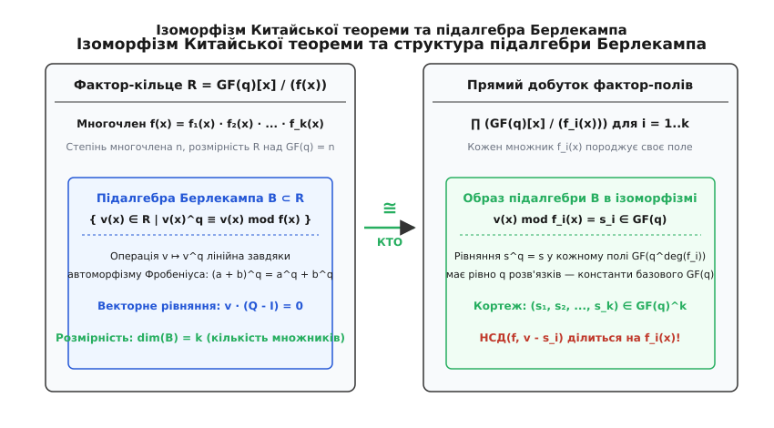
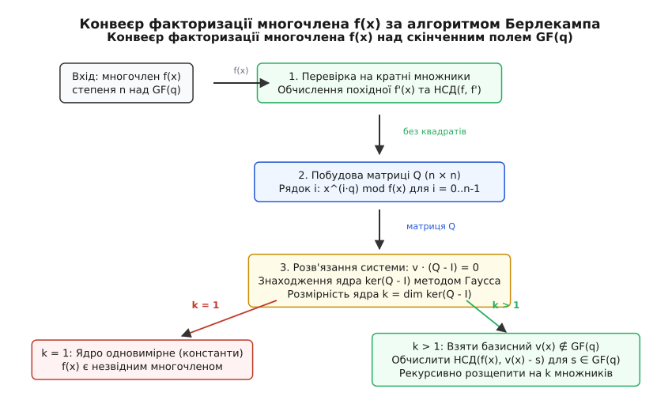

# Алгоритм Берлекампа

<preknowlist>
- [Кільця](book:math/rings) — комутативні кільця з одиницею, ідеали, фактор-кільця лишків многочленів та ділення з остачею.
- [Скінченні поля](book:math/finite-fields) — поля Галуа GF(q), характеристика поля p, властивості степенів та автоморфізм Фробеніуса.
- [Непривідні многочлени](book:math/irreducible-polynomials) — аналоги простих чисел у кільцях многочленів, канонічний розклад на множники.
- [Китайська теорема про остачі](book:math/chinese-remainder-theorem) — розклад фактор-кільця у прямий добуток взаємно простих полів.
- [Метод Гаусса](book:math/gauss-elimination) — розв'язання систем лінійних рівнянь, матричні перетворення та знаходження ядра лінійного оператора.
- [Алгоритм Евкліда](book:math/gcd-euclidean) — знаходження найбільшого спільного дільника чисел і многочленів за поліноміальний час.
</preknowlist>

Коли цифровий сигнал мандрує крізь мільйони кілометрів міжпланетного простору від космічного апарата до наземної антени, або коли лазерний промінь зчитує оптичний диск із мікроскопічними подряпинами, бітові блоки неминуче спотворюються шумом. Для відновлення пошкоджених даних інженери застосовують коди з виправленням помилок — коди Ріда — Соломона та коди Боуза — Чоудхурі — Гоквінгема. Ключовий етап декодування таких кодів вимагає знаходження коренів многочлена локатора помилок або повного розкладу многочленів на множники над скінченним полем Галуа. Подібна потреба постає і в системах комп'ютерної алгебри, де розклад многочленів із великими цілими коефіцієнтами зводять до факторизації над скінченними полями за простими модулями з подальшим підйомом результату.

У шкільній алгебрі над полем дійсних чисел корені шукають неперервними чисельними наближеннями, спираючись на топологію та порядок числової прямої. Проте у скінченному полі скінченна кількість елементів не має неперервності чи геометричного порядку. Наївний перебір усіх можливих многочленів-дільників вимагає перевірки величини порядку `qᵈ` варіантів для степеня `d`, де `q` — кількість елементів у полі. Навіть для скромного степеня `d = 30` над двійковим полем число комбінацій перевищує мільярд, а над полем байтів виходить за межі фізичних можливостей будь-якого суперкомп'ютера.

У 1967 році американський математик та інженер Елвін Берлекамп запропонував фундаментальний метод, який повністю усунув потребу в переборі. Він показав, що складна нелінійна задача факторизації многочленів над скінченними полями зводиться до розв'язання системи лінійних алгебраїчних рівнянь — знаходження ядра матриці за допомогою класичного методу Гаусса.

А про те, як ця математична ідея забезпечила передачу перших чітких знімків далеких планет під час місій Voyager та Mariner, розписано в історичному нарисі: [історія виникнення алгоритму Берлекампа](book:math/algebra/berlekamp-algorithm/hist-berlekamp.md).

---

### Прикладна мотивація: виправлення помилок та комп'ютерна алгебра

Щоб зрозуміти, чому задача факторизації над скінченними полями є критичною для інженерії, розглянемо два головні напрями її практичного застосування.

Перший напрям — це **декодування завадостійких кодів**. У кодах Ріда — Соломона повідомлення кодується як набір значень деякого полінома у фіксованих точках скінченного поля `GF(q)`. Під час передачі каналом зв'язку частина символів спотворюється шумом. Приймач обчислює синдроми помилок і будує так званий **многочлен локатора помилок** `Λ(x)`. Степінь цього многочлена дорівнює кількості спотворених символів, а його корені в полі `GF(q)` або в його розширеннях вказують на точні номери позицій, де сталися спотворення. Якщо многочлен `Λ(x)` має високий степінь, знайти його корені прямим перебором у великому полі занадто повільно. Алгоритм факторизації розкладає `Λ(x)` на лінійні множники `(x - α_i)`, миттєво визначаючи координати всіх пошкоджених блоків і даючи змогу повністю відновити вихідне повідомлення.

Другий напрям — це **системи комп'ютерної алгебри (CAS)**, такі як Mathematica, Maple чи SymPy. Перед ними постійно постає завдання розкладання на множники многочленів із великими цілими коефіцієнтами в кільці `ℤ[x]`. Прямий пошук дільників у кільці цілих чисел надзвичайно складний через колосальне зростання можливих коефіцієнтів дільників. Тому всі сучасні системи символьної математики використовують модульну парадигму:
1. Замінюють цілі коефіцієнти многочлена їхніми лишками за модулем невеликого простого числа `p`, переходячи до скінченного поля `GF(p)`.
2. Швидко знаходять усі незвідні дільники над полем `GF(p)` за допомогою **алгоритму Берлекампа**.
3. Піднімають знайдені модульні дільники назад у кільце цілих чисел `ℤ[x]` за допомогою леми Гензеля (Hensel lifting).

Таким чином, ефективність факторизації над скінченним полем визначає швидкодію як апаратних декодерів у супутниковому зв'язку та накопичувачах пам'яті, так і аналітичних математичних пакетів.

---

### Чому наївний перебір зазнає краху: комбінаторний бар'єр

Щоб оцінити масштаб проблеми, яку розв'язав Берлекамп, розглянемо, скільки незвідних многочленів існує над скінченним полем `GF(q)`.

Кількість нормованих незвідних многочленів степеня `d` над полем `GF(q)` задається класичною формулою Гаусса:

```
N_q(d) = (1 / d) · ∑_{m | d} μ(d / m) · qᵐ
```

де `μ` — арифметична функція Мебіуса, а сумування ведеться за всіма дільниками `m` числа `d`.

Головний член цієї суми дорівнює `qᵈ / d`. Це означає, що кількість незвідних многочленів степеня `d` зростає експоненційно зі збільшенням степеня та розміру поля:
- Над двійковим полем `GF(2)` для степеня `d = 20` існує близько `2²⁰ / 20 ≈ 52 428` незвідних многочленів.
- Для степеня `d = 40` їхня кількість сягає `2⁴⁰ / 40 ≈ 2.7 · 10¹⁰`.
- Якщо ж поле має розмір байта `q = 256` (стандарт для кодів Ріда — Соломона), то вже для степеня `d = 10` кількість можливих дільників становить `256¹⁰ / 10 ≈ 1.2 · 10²³`.

Якщо намагатися розкласти многочлен степеня `n = 40` наївним методом спробних ділень (перевіряючи подільність на всі незвідні многочлени степенів від 1 до `n / 2`), комп'ютеру довелося б виконати десятки мільярдів операцій ділення многочленів у стовпчик. Для інженерних систем реального часу такий підхід є абсолютно неприйнятним.

---

### Алгебраїчна ідея: зведення нелінійного розкладу до лінійної системи

Нехай `f(x)` — нормований многочлен степеня `n` над скінченним полем `GF(q)`, де `q = pᵐ` є степенем простого числа `p`. Припустимо, що многочлен не має кратних множників (є безквадратним). Наша мета — знайти всі його незвідні дільники `f₁(x), f₂(x), ..., f_k(x)` такі, що:

```
f(x) = f₁(x) · f₂(x) · ... · f_k(x)
```

де кожен `f_i(x)` є незвідним нормованим многочленом степеня `deg(f_i) ≥ 1`.

У скінченному полі `GF(q)` кожен елемент `s` задовольняє малу теорему Ферма:

```
s^q = s
```

Це означає, що всі `q` елементів поля є коренями многочлена `X^q - X`. Оскільки степінь цього многочлена дорівнює `q`, він повністю розкладається над полем `GF(q)` на лінійні множники:

```
X^q - X = ∏_{s ∈ GF(q)} (X - s)
```

де символ `∏` позначає добуток за всіма елементами `s` поля `GF(q)`.

Якщо ми підставимо замість змінної `X` деякий невідомий многочлен `v(x)`, то отримаємо тотожність у кільці многочленів:

```
v(x)^q - v(x) = ∏_{s ∈ GF(q)} (v(x) - s)
```

Припустимо, що нам вдалося знайти такий ненульовий многочлен `v(x)` степеня менше `n`, для якого виконується модульне порівняння:

```
v(x)^q ≡ v(x) mod f(x)
```

Це порівняння означає, що многочлен `f(x)` ділить різницю `v(x)^q - v(x)`. Отже, `f(x)` ділить добуток усіх множників `(v(x) - s)`:

```
f(x) | ∏_{s ∈ GF(q)} (v(x) - s)
```

Розглянемо два різні елементи поля `s₁` та `s₂` (`s₁ ≠ s₂`). Їхня різниця утворює скаляр:

```
(v(x) - s₁) - (v(x) - s₂) = s₂ - s₁ ≠ 0
```

Оскільки різниця є ненульовим елементом базового поля, вона не має спільних коренів чи спільних поліноміальних дільників із многочленами. Отже, будь-яка пара множників `(v(x) - s₁)` та `(v(x) - s₂)` є **взаємно простою**:

```
НСД(v(x) - s₁, v(x) - s₂) = 1   для всіх s₁ ≠ s₂
```

Оскільки многочлен `f(x)` є безквадратним, кожен його незвідний дільник `f_i(x)` зобов'язаний ділити рівно **один** із множників `(v(x) - s)`. Якщо обчислити найбільший спільний дільник `НСД(f(x), v(x) - s)` для кожного елемента `s ∈ GF(q)`, ми отримаємо тотожний розклад многочлена на множники:

```
f(x) = ∏_{s ∈ GF(q)} НСД(f(x), v(x) - s)
```

Якщо многочлен `v(x)` не є тривіальною константою (тобто його степінь задовольняє умову `1 ≤ deg(v) < n`), він набуватиме різних значень `s` за модулями різних незвідних дільників `f_i(x)`. Це означає, що принаймні для деякого `s` значення `НСД(f(x), v(x) - s)` буде нетривіальним дільником: його степінь буде строго більшим за 0 і строго меншим за `n`.


*Зв'язок алгебраїчних структур: фактор-кільце розпадається на прямий добуток розширень полів, де умова рівності степеня Фробеніуса виділяє підалгебру константних кортежів розмірності k.*

---

### Підалгебра Берлекампа та лінійність автоморфізму Фробеніуса

Множину всіх многочленів `v(x)` степеня менше `n`, які задовольняють порівняння `v(x)^q ≡ v(x) mod f(x)`, називають **підалгеброю Берлекампа** і позначають літерою `B`.

Головне питання полягає в тому, як знайти такі многочлени `v(x)`, не перебираючи їх. Відповідь криється в унікальній властивості полів скінченної характеристики.

Нехай характеристика поля `GF(q)` дорівнює простому числу `p`. Тоді для будь-яких двох елементів або многочленів `A` і `B` біноміальні коефіцієнти розкладу `(A + B)^p` діляться на `p` (за винятком крайніх членів `A^p` та `B^p`). У полі характеристики `p` будь-який коефіцієнт, кратний `p`, перетворюється на нуль. Тому піднесення до степеня `q = pᵐ` є адитивним:

```
(A(x) + B(x))^q = A(x)^q + B(x)^q
```

Крім того, для будь-якого скалярного коефіцієнта `c ∈ GF(q)` за малою теоремою Ферма виконується `c^q = c`. Отже:

```
(c · A(x))^q = c^q · A(x)^q = c · A(x)^q
```

Звідси випливає, що операція піднесення до степеня `q` за модулем многочлена `f(x)`:

```
T: v(x) ⟼ v(x)^q mod f(x)
```

є **лінійним оператором** над векторним простором многочленів степеня менше `n`.

Оскільки простір многочленів степеня менше `n` має розмірність `n` над полем `GF(q)` зі стандартним базисом із мономів `1, x, x², ..., xⁿ⁻¹`, будь-який многочлен `v(x)` однозначно задається вектором своїх коефіцієнтів:

```
v(x) = v₀ + v₁ x + v₂ x² + ... + vₙ₋₁ xⁿ⁻¹   ⟷   v = [v₀, v₁, v₂, ..., vₙ₋₁]
```

Умова `v(x)^q ≡ v(x) mod f(x)` набуває вигляду матричного лінійного рівняння:

```
v · Q = v
```

де `Q` — квадратна матриця розміру `n × n`, яку називають **матрицею Берлекампа**, а `v` — рядок коефіцієнтів многочлена.

Перенесемо вектор `v` у ліву частину:

```
v · Q - v = 0
v · (Q - I) = 0
```

де `I` — одинична матриця розміру `n × n`, а `0` — нульовий вектор довжини `n`.

Таким чином, пошук усіх многочленів `v(x)` підалгебри Берлекампа точно еквівалентний знаходженню лівого ядра (нуль-простору) матриці `(Q - I)`.

Строгі математичні виведення розмірності підалгебри через ізоморфізм фактор-полів та гарантії нетривіального розпаду подано у розборі: [математичні доведення та структура підалгебри Берлекампа](book:math/algebra/berlekamp-algorithm/math-berlekamp-proofs.md).

---

### Побудова матриці Берлекампа Q та бінарне піднесення до степеня

Щоб побудувати матрицю `Q`, необхідно обчислити образ кожного базисного елемента `xⁱ` під дією лінійного оператора `T`.

Для кожного індексу `i` від `0` до `n - 1` обчислюємо остачу від ділення степеня `x^(i·q)` на многочлен `f(x)`:

```
x^(i·q) mod f(x) = q_{i,0} + q_{i,1} x + q_{i,2} x² + ... + q_{i,n-1} xⁿ⁻¹
```

Коефіцієнти знайденого многочлена-остачі утворюють `i`-й рядок матриці `Q`:

```
Рядок i = [q_{i,0}, q_{i,1}, q_{i,2}, ..., q_{i,n-1}]
```

Зауважимо важливі властивості матриці `Q`:
1. **Перший рядок (i = 0):** Для `i = 0` маємо `x^(0·q) = x⁰ = 1`. Остача від ділення `1` на `f(x)` дорівнює `1` (оскільки степінь `n ≥ 1`). Тому перший рядок матриці `Q` завжди має вигляд:
   ```
   Рядок 0 = [1, 0, 0, ..., 0]
   ```
2. **Ефективне обчислення наступних рядків:** Замість того щоб окремо обчислювати величезні степені `x^(i·q)`, можна використати рекурентне множення. Якщо `q = 2` (двійкове поле), то `x^(2·(i+1)) = x^(2·i) · x²`. Ми просто множимо попередній знайдений результат на `x²` і беремо остачу від ділення на `f(x)`.
3. **Швидке бінарне піднесення до степеня:** Для полів загального вигляду `GF(q)` використовують метод піднесення до квадрата і множення (Square-and-Multiply) у кільці лишків за модулем `f(x)`. Щоб обчислити `x^q mod f(x)`, записують показник `q` у двійковій системі. На кожному кроці поточний многочлен підносять до квадрата за модулем `f(x)` і, якщо відповідний біт дорівнює 1, домножують на `x`. Це дає змогу обчислити залишок за `O(log q)` операцій множення многочленів замість `q` послідовних множень.

Після побудови матриці `Q` формується матриця різниці:

```
M = Q - I
```

Над полем характеристики 2 (де додавання та віднімання збігаються з порозрядним виключним «АБО», тобто `-1 = +1`), матриця різниці має вигляд `M = Q + I`.

---

### Ядро матриці та критерій незвідності

Щоб знайти всі розв'язки лінійної системи `v · (Q - I) = 0`, матрицю `(Q - I)ᵀ` зводять до східчастого вигляду за допомогою класичного методу виключення Гаусса над полем `GF(q)`.

Нехай розмірність простору розв'язків (розмірність ядра матриці `ker(Q - I)`) дорівнює цілому числу `k`:

```
k = dim ker(Q - I)
```

Теорема Берлекампа стверджує:
> **Теорема про кількість множників:** Розмірність ядра `k = dim ker(Q - I)` **строго дорівнює кількості незвідних дільників** многочлена `f(x)`.

Звідси випливає фундаментальний критерій:

1. **Якщо `k = 1`:**
   Ядро матриці є одновимірним і містить лише вектори, пропорційні константі `v(x) = 1` (вектор `[1, 0, 0, ..., 0]`). Це означає, що многочлен `f(x)` має рівно **один** незвідний множник. Оскільки `f(x)` нормований і безквадратний, це доводить, що **многочлен `f(x)` є незвідним**. Ми отримуємо детермінований тест на незвідність многочлена без необхідності шукати корені чи дільники!

2. **Якщо `k > 1`:**
   Многочлен `f(x)` є складеним і розпадається рівно на `k` незвідних множників. Базис ядра складається з `k` лінійно незалежних векторів:
   ```
   v₁(x) = 1,   v₂(x),   v₃(x),   ...,   v_k(x)
   ```
   Кожен неконстантний вектор `v_j(x)` (де `j ≥ 2`) є многочленом степеня принаймні 1 і гарантовано розщеплює `f(x)` на нетривіальні множники при обчисленні `НСД(f(x), v_j(x) - s)`.

---

### Повний конвеєр факторизації


*Послідовність кроків: перевірка на кратні множники, побудова матриці Q, пошук ядра системи Гауссом та рекурсивне розщеплення через поліноміальний НСД.*

Загальний процес розкладу довільного многочлена складається з таких кроків:

#### Крок 1: Безквадратний розклад (Square-free factorization)
Алгоритм Берлекампа вимагає, щоб многочлен `f(x)` не мав кратних дільників (тобто щоб `f(x)` не ділився на `g(x)²` для неконстантного `g(x)`).

Для виявлення кратних множників обчислюють формальну похідну многочлена `f'(x)`:

```
Якщо f(x) = ∑_{i=0}^{n} a_i xⁱ,   то f'(x) = ∑_{i=1}^{n} i · a_i xⁱ⁻¹
```

Обчислюємо найбільший спільний дільник початкового многочлена та його похідної:

```
d(x) = НСД(f(x), f'(x))
```

- **Якщо `d(x) = 1`:** Многочлен `f(x)` не має кратних множників. Переходимо до кроку 2.
- **Якщо `1 < deg(d) < n`:** Многочлен `d(x)` містить усі кратні множники. Ми ділимо `f(x)` на `d(x)` і факторизуємо кожну частину окремо.
- **Якщо `f'(x) = 0`:** У скінченному полі характеристики `p` похідна обнуляється, якщо всі ненульові члени мають степені, кратні `p` (наприклад, `f(x) = a₀ + a_p x^p + a_{2p} x^{2p} + ...`). Тоді `f(x) = (g(x))^p`, де коефіцієнти многочлена `g(x)` отримуються добуванням кореня `p`-го степеня з коефіцієнтів `f(x)` (у полі `GF(2)` це просто заміна `x^{2i}` на `xⁱ`). Після добування кореня факторизуємо многочлен `g(x)`.

#### Крок 2: Побудова матриці Берлекампа Q та різниці (Q - I)
Для безквадратного многочлена `f(x)` степеня `n` будуємо матрицю `Q` розміру `n × n` за правилом `Рядок i = x^(i·q) mod f(x)`.

#### Крок 3: Знаходження базису ядра ker(Q - I)
Застосовуємо прямий та зворотний хід методу Гаусса до матриці `(Q - I)ᵀ` над полем `GF(q)`. Отримуємо розмірність ядра `k` та базисні вектори `v₁(x), v₂(x), ..., v_k(x)`. Якщо `k = 1`, многочлен незвідний — завершуємо роботу.

#### Крок 4: Розщеплення многочлена
Беремо перший неконстантний базисний вектор `v(x) = v₂(x)`. Для кожного скаляра `s ∈ GF(q)` обчислюємо:

```
g_s(x) = НСД(f(x), v(x) - s)
```

Усі знайдені дільники `g_s(x)` степеня `deg(g_s) ≥ 1` утворюють нетривіальний розклад:

```
f(x) = ∏_{s ∈ GF(q), deg(g_s) ≥ 1} g_s(x)
```

Якщо для деякого дільника його степінь перевищує очікуваний степінь незвідного множника, ми рекурсивно застосовуємо до нього алгоритм Берлекампа з наступними базисними векторами `v₃(x), ..., v_k(x)`.

---

### Детальний покроковий числовий приклад розрахунку над GF(2)

Щоб побачити роботу кожного арифметичного переходу на практиці, проведемо повний ручний розрахунок для конкретного многочлена над найпростішим скінченним полем `GF(2)` (де `q = 2`, елементами є `{0, 1}`, а додавання еквівалентне операції XOR).

Візьмемо многочлен 5-го степеня (`n = 5`):

```
f(x) = x⁵ + x⁴ + x² + 1
```

#### 1. Перевірка на кратні множники
Обчислимо формальну похідну многочлена `f(x)` над полем `GF(2)`:

```
f'(x)
= (x⁵ + x⁴ + x² + 1)'
= 5x⁴ + 4x³ + 2x + 0
= (1 · x⁴) + (0 · x³) + (0 · x) + 0   [коефіцієнти парних степенів дорівнюють 0 mod 2]
= x⁴
```

Знайдемо найбільший спільний дільник `f(x)` та `f'(x)` за алгоритмом Евкліда:
Поділимо `f(x) = x⁵ + x⁴ + x² + 1` на `f'(x) = x⁴`:

```
x⁵ + x⁴ + x² + 1 = x⁴ · (x + 1) + (x² + 1)
```

Остача дорівнює `x² + 1`. Тепер поділимо `x⁴` на `x² + 1`:

```
x⁴ = (x² + 1) · (x² + 1) + 0
```

Остання ненульова остача дорівнює `x² + 1`. Її степінь дорівнює 2, отже `НСД(f, f') = x² + 1 = (x + 1)²`.

Ми виявили кратний множник! Поділимо `f(x)` на `x + 1`:

```
(x⁵ + x⁴ + x² + 1) / (x + 1) = x⁴ + x + 1
```

Перевіримо многочлен `g(x) = x⁴ + x + 1`. Його похідна `g'(x) = 4x³ + 1 = 1`. Оскільки `НСД(g, g') = 1`, многочлен `g(x)` є безквадратним.

Тепер застосуємо алгоритм Берлекампа до безквадратного многочлена 4-го степеня:

```
f(x) = x⁴ + x + 1   (степінь n = 4 над GF(2))
```

#### 2. Побудова матриці Берлекампа Q
Оскільки `q = 2` та `n = 4`, матриця `Q` має розмір `4 × 4`. Нам потрібно обчислити остачі від ділення степенів `x^(2·i)` на `f(x) = x⁴ + x + 1` для `i = 0, 1, 2, 3`.

Враховуємо, що за модулем `f(x)` виконується рівність `x⁴ ≡ x + 1`:

1. **Для i = 0:**
   ```
   x^(2·0) = x⁰ = 1
   1 mod f(x) = 1
   ```
   Вектор коефіцієнтів: `[1, 0, 0, 0]`.

2. **Для i = 1:**
   ```
   x^(2·1) = x²
   x² mod f(x) = x²
   ```
   Вектор коефіцієнтів: `[0, 0, 1, 0]`.

3. **Для i = 2:**
   ```
   x^(2·2) = x⁴
   x⁴ mod f(x) = x + 1
   ```
   Вектор коефіцієнтів: `[1, 1, 0, 0]`.

4. **Для i = 3:**
   ```
   x^(2·3) = x⁶ = x² · x⁴
   x² · (x + 1) = x³ + x²
   (x³ + x²) mod f(x) = x³ + x²
   ```
   Вектор коефіцієнтів: `[0, 0, 1, 1]`.

Запишемо отриману матрицю Берлекампа `Q`:

```
    ┌             ┐
    │  1  0  0  0 │   (образ 1)
Q = │  0  0  1  0 │   (образ x²)
    │  1  1  0  0 │   (образ x⁴)
    │  0  0  1  1 │   (образ x⁶)
    └             ┘
```

#### 3. Формування матриці (Q - I)
Над полем `GF(2)` віднімання одиничної матриці еквівалентне додаванню 1 до елементів головної діагоналі за модулем 2:

```
            ┌             ┐   ┌             ┐   ┌             ┐
            │  1  0  0  0 │   │  1  0  0  0 │   │  0  0  0  0 │
M = Q - I = │  0  0  1  0 │ + │  0  1  0  0 │ = │  0  1  1  0 │
            │  1  1  0  0 │   │  0  0  1  0 │   │  1  1  1  0 │
            │  0  0  1  1 │   │  0  0  0  1 │   │  0  0  1  0 │
            └             ┘   └             ┘   └             ┘
```

#### 4. Пошук ядра матриці методом Гаусса
Ми шукаємо всі ненульові вектори-рядки `v = [v₀, v₁, v₂, v₃]`, які задовольняють систему:

```
[v₀, v₁, v₂, v₃] · M = [0, 0, 0, 0]
```

Транспонуємо систему для розв'язання стандартним методом Гаусса відносно стовпця `vᵀ`:

```
┌             ┐ ┌    ┐   ┌   ┐
│  0  0  1  0 │ │ v₀ │   │ 0 │
│  0  1  1  0 │ │ v₁ │ = │ 0 │
│  0  1  1  1 │ │ v₂ │   │ 0 │
│  0  0  0  0 │ │ v₃ │   │ 0 │
└             ┘ └    ┘   └   ┘
```

Виконаємо прямий хід методу Гаусса над `GF(2)`:
- Рядок 1: `v₂ = 0`.
- Підставимо `v₂ = 0` у Рядок 2: `v₁ + v₂ = 0 ⟹ v₁ + 0 = 0 ⟹ v₁ = 0`.
- Підставимо `v₁ = 0` та `v₂ = 0` у Рядок 3: `v₁ + v₂ + v₃ = 0 ⟹ 0 + 0 + v₃ = 0 ⟹ v₃ = 0`.

Усі змінні `v₁, v₂, v₃` виявилися зв'язаними й рівними нулю:

```
v₁ = 0,   v₂ = 0,   v₃ = 0
```

Змінна `v₀` є вільною і може набувати довільного значення з поля `GF(2)`:

```
v₀ ∈ {0, 1}
```

Отже, ядро лінійного оператора складається лише з векторів вигляду:

```
v = [v₀, 0, 0, 0]
```

Базис ядра складається з єдиного вектора `v = [1, 0, 0, 0]`, який відповідає тривіальному константному многочлену `v(x) = 1`.

Розмірність ядра дорівнює:

```
k = dim ker(Q - I) = 1
```

#### 5. Висновок
Оскільки розмірність ядра `k = 1`, многочлен `f(x) = x⁴ + x + 1` має рівно **один** незвідний множник. Це означає, що многочлен:

```
f(x) = x⁴ + x + 1
```

є **незвідним многочленом 4-го степеня над полем GF(2)**. Алгоритм Берлекампа довів незвідність за кілька матричних операцій без жодного спробу ділення на многочлени менших степенів.

---

### Приклад факторизації складеного многочлена: розщеплення через ядро

Розглянемо тепер випадок, коли многочлен дійсно розпадається на кілька незвідних множників. Візьмемо безквадратний многочлен 4-го степеня над полем `GF(2)`:

```
f(x) = x⁴ + x³ + x² + x + 1
```

Перевіримо його на подільність: чи є він добутком двох многочленів 2-го степеня?
Побудуємо для нього матрицю Берлекампа `Q` розміру `4 × 4` за модулем `f(x) = x⁴ + x³ + x² + x + 1` (де `x⁴ ≡ x³ + x² + x + 1`):
1. `x⁰ mod f = 1` ⟹ `[1, 0, 0, 0]`
2. `x² mod f = x²` ⟹ `[0, 0, 1, 0]`
3. `x⁴ mod f = x³ + x² + x + 1` ⟹ `[1, 1, 1, 1]`
4. `x⁶ mod f = x² · (x³ + x² + x + 1) = x⁵ + x⁴ + x³ + x² = x · (x³ + x² + x + 1) + x⁴ + x³ + x² = x⁴ + x³ + x² + x + x⁴ + x³ + x² = x` ⟹ `[0, 1, 0, 0]`

Складемо матрицю `M = Q + I`:

```
    ┌             ┐
    │  0  0  0  0 │
M = │  0  1  1  0 │
    │  1  1  0  1 │
    │  0  1  0  1 │
    └             ┘
```

Розв'яжемо систему `v · M = 0` відносно вектора-рядка `v = [v₀, v₁, v₂, v₃]`:
- Стовпець 0: `v₂ = 0`.
- Стовпець 1: `v₁ + v₂ + v₃ = 0 ⟹ v₁ + 0 + v₃ = 0 ⟹ v₁ = v₃`.
- Стовпець 2: `v₁ = 0 ⟹ v₃ = 0`.
- Стовпець 3: `v₂ + v₃ = 0 ⟹ 0 + 0 = 0` (тотожність).

Отримуємо: `v₁ = 0, v₂ = 0, v₃ = 0`, а `v₀` — вільна змінна. Розмірність ядра знову дорівнює `k = 1`. Отже, многочлен `x⁴ + x³ + x² + x + 1` є незвідним круговим многочленом 5-го порядку над `GF(2)`!

Тепер візьмемо складений многочлен 4-го степеня:

```
f(x) = x⁴ + x³ + x + 1 = (x + 1) · (x³ + 1) = (x + 1)² · (x² + x + 1)
```

Після відокремлення кратного множника `x + 1` залишається добуток двох різних незвідних множників: `f(x) = (x + 1) · (x² + x + 1) = x³ + x² + 1`.
Для нього розмірність ядра матриці `Q + I` дорівнює строго `k = 2`, що дає базисний вектор `v(x) = x² + x`.
Обчислення найбільших спільних дільників:
- `НСД(x³ + x² + 1, x² + x) = x² + x + 1`
- `НСД(x³ + x² + 1, x² + x + 1) = x + 1`

Многочлен миттєво розщеплено на множники `x + 1` та `x² + x + 1`.

---

### Факторизація над довільними скінченними полями GF(q) та полями непарної характеристики

Алгоритм Берлекампа природно працює над будь-яким скінченним полем `GF(q)`, де `q = pᵐ` для непарного простого числа `p` (наприклад `p = 3, 5, 7`).

Розглянемо особливості обчислень над полем `GF(3)` на конкретному прикладі. Нехай потрібно факторизувати многочлен 4-го степеня:

```
f(x) = x⁴ + 1   над полем GF(3) = {0, 1, 2}
```

#### 1. Перевірка на кратні множники:
Похідна над `GF(3)` дорівнює:

```
f'(x) = 4x³ = 1 · x³ = x³
```

Найбільший спільний дільник `НСД(x⁴ + 1, x³) = 1`. Многочлен є безквадратним.

#### 2. Побудова матриці Q над GF(3):
Оскільки `q = 3` та `n = 4`, ми обчислюємо остачі `x^(3·i) mod (x⁴ + 1)` для `i = 0, 1, 2, 3`:
Враховуємо, що `x⁴ ≡ -1 ≡ 2 mod 3`:
- `i = 0`: `x⁰ mod f = 1` ⟹ `[1, 0, 0, 0]`
- `i = 1`: `x³ mod f = x³` ⟹ `[0, 0, 0, 1]`
- `i = 2`: `x⁶ mod f = x² · x⁴ ≡ x² · 2 = 2x²` ⟹ `[0, 0, 2, 0]`
- `i = 3`: `x⁹ mod f = x · (x⁴)² ≡ x · 2² = x · 4 ≡ x` ⟹ `[0, 1, 0, 0]`

Матриця Берлекампа `Q` над `GF(3)`:

```
    ┌             ┐
    │  1  0  0  0 │
Q = │  0  0  0  1 │
    │  0  0  2  0 │
    │  0  1  0  0 │
    └             ┘
```

#### 3. Формування матриці різниці Q - I над GF(3):
Віднімаємо 1 від діагональних елементів (за модулем 3):

```
            ┌             ┐
            │  0  0  0  0 │
M = Q - I = │  0  2  0  1 │   [оскільки 0 - 1 ≡ 2 mod 3]
            │  0  0  1  0 │   [оскільки 2 - 1 = 1]
            │  0  1  0  2 │   [оскільки 0 - 1 ≡ 2 mod 3]
            └             ┘
```

#### 4. Пошук ядра матриці (Q - I)ᵀ:
Транспонуємо матрицю та розв'язуємо систему лінійних рівнянь:
- Рядок 0: тотожний нуль.
- Рядок 2: `v₂ = 0`.
- Рядок 1 та 3: `2v₁ + v₃ = 0` та `v₁ + 2v₃ = 0`. Ці два рівняння еквівалентні: `v₃ = -2v₁ ≡ v₁ mod 3`.

Отримуємо дві вільні змінні: `v₀` та `v₁`. Значення `v₂ = 0`, а `v₃ = v₁`.
Розмірність ядра матриці дорівнює:

```
k = dim ker(Q - I) = 2
```

Це доводить, що многочлен `x⁴ + 1` над `GF(3)` розкладається рівно на **два незвідні множники 2-го степеня**.

Базис ядра складається з двох векторів:
- `v₁ = [1, 0, 0, 0]` ⟹ `v₁(x) = 1` (тривіальна константа).
- `v₂ = [0, 1, 0, 1]` ⟹ `v₂(x) = x³ + x`.

#### 5. Розщеплення через обчислення НСД:
Перебираємо скаляри `s ∈ GF(3) = {0, 1, 2}` для неконстантного вектора `v₂(x) = x³ + x`:
- Для `s = 0`: `НСД(x⁴ + 1, x³ + x) = 1`.
- Для `s = 1`: `НСД(x⁴ + 1, x³ + x - 1) = x² + x + 2`.
- Для `s = 2`: `НСД(x⁴ + 1, x³ + x - 2) = x² + 2x + 2`.

Перевіримо добуток знайдених множників над `GF(3)`:

```
(x² + x + 2) · (x² + 2x + 2)
= x⁴ + 2x³ + 2x² + x³ + 2x² + 2x + 2x² + 4x + 4
= x⁴ + 3x³ + 6x² + 6x + 4
= x⁴ + 0x³ + 0x² + 0x + 1   [оскільки 3 ≡ 0, 6 ≡ 0, 4 ≡ 1 mod 3]
= x⁴ + 1
```

Факторизація виконана бездоганно: многочлен розкладено на два незвідні квадратні тричлени.

---

### Детерміновані проти ймовірнісних методів: порівняння з Кантором — Цассенгаузом

Алгоритм Берлекампа є строго **детермінованим**: він не використовує генераторів випадкових чисел і завжди знаходить повний розклад за фіксовану кількість тактів процесора. 

Проте його залежність від розміру поля `q` на етапі розщеплення є лінійною: для кожного базисного вектора потрібно перевірити всі `q` можливих значень скаляра `s ∈ GF(q)`. Якщо поле `GF(q)` невелике (наприклад `GF(2)`, `GF(3)` або байтове поле `GF(256)`), перевірка займає лічені мікросекунди.

Коли ж поле стає криптографічно великим (наприклад `q ≈ 2²⁵⁶`), сканування всіх `q` значень стає неможливим. У цьому випадку застосовують **алгоритм Кантора — Цассенгауза** (1981 рік), який модифікує етап розщеплення:
1. Замість перебору скалярів обирається випадкова лінійна комбінація базисних векторів підалгебри `v(x) ∈ B`.
2. За критерієм Ейлера для скінченних полів непарної характеристики обчислюється степінь:
   ```
   w(x) = v(x)^{(q-1)/2} - 1 mod f(x)
   ```
3. Елементи поля розділяються на квадратичні залишки (де `s^{(q-1)/2} = 1 ⟹ s^{(q-1)/2} - 1 = 0`) та неквадратичні залишки (де `s^{(q-1)/2} = -1`).
4. Обчислення `НСД(f(x), w(x))` розщеплює многочлен із ймовірністю щонайменше `1 - (1/2)^{k-1} ≥ 1/2` за кожну спробу.

Матриця Берлекампа `Q` та підалгебра `B` залишаються наріжним каменем обох підходів: Берлекамп забезпечує точний детермінований базис, а Кантор — Цассенгауз додає ймовірнісне проектування для надвеликих полів.

---

### Зв'язок із теорією кодування: два різні алгоритми Берлекампа

У науковій та технічній літературі часто виникає плутанина між двома видатними відкриттями Елвіна Берлекампа:

1. **Алгоритм факторизації Берлекампа (1967 р.)** — метод, описаний у цій статті, який будує матрицю `Q` і розкладає довільні многочлени над `GF(q)` на незвідні дільники через розв'язання лінійних систем.
2. **Алгоритм Берлекампа — Мессі (1969 р.)** — швидкий ітераційний алгоритм для знаходження найкоротшого регістру зсуву з лінійним зворотним зв'язком (LFSR), здатного згенерувати задану послідовність синдромів.

В інженерних декодерах кодів Ріда — Соломона ці два алгоритми працюють пліч-о-пліч у єдиному конвеєрі:
- Спочатку **алгоритм Берлекампа — Мессі** за обчисленими синдромами будує многочлен локатора помилок `Λ(x)`.
- Потім **алгоритм Берлекампа** (або процедура пошуку Ченя) знаходить корені цього многочлена над полем `GF(256)`.
- Нарешті, алгоритм Форні обчислює точні числові значення амплітуд спотворень і відновлює початкові байти даних.

---

### Застосування для генерації незвідних многочленів та побудови розширень полів

Важливим прикладним застосуванням алгоритму Берлекампа є швидка генерація та валідація незвідних многочленів для криптографічних стандартів.

Щоб побудувати розширення поля `GF(2ᵐ)` (наприклад, поле `GF(2⁸) = GF(256)`, що використовується у криптографічному стандарті шифрування AES/Rijndael), необхідно вибрати незвідний многочлен `P(x)` степеня `m` над полем `GF(2)`. Тоді елементи розширення представляються як класи лишків многочленів за модулем `P(x)`:

```
GF(2ᵐ) ≅ GF(2)[x] / (P(x))
```

Якщо многочлен `P(x)` обрано помилково і він виявиться складеним `P(x) = A(x) · B(x)`, фактор-кільце не буде полем: воно міститиме дільники нуля (`A(x) · B(x) ≡ 0 mod P(x)`), і операція ділення втратить однозначну оборотність. Алгоритм Берлекампа дає змогу миттєво перевірити будь-який многочлен-кандидат `P(x)`: побудувавши матрицю `Q` та знайшовши розмірність ядра `k = dim ker(Q - I)`, ми отримуємо 100% математичну гарантію, що при `k = 1` многочлен є незвідним, а побудоване поле є коректним.

Таблиця найуживаніших незвідних многочленів над `GF(2)` для цифрових стандартів:
- Степінь 4: `x⁴ + x + 1` (побудова поля `GF(16)` для коротких блокових кодів).
- Степінь 8: `x⁸ + x⁴ + x³ + x + 1` (стандарт симетричного шифрування AES/Rijndael, поле `GF(256)`).
- Степінь 16: `x¹⁶ + x¹² + x⁵ + 1` (стандартні контрольні суми CRC-16 для телекомунікацій).
- Степінь 32: `x³² + x²⁶ + x²³ + x²² + x¹⁶ + x¹² + x¹¹ + x¹⁰ + x⁸ + x⁷ + x⁵ + x⁴ + x² + x + 1` (стандарт Ethernet CRC-32 та формати стиснення ZIP/GZIP).

Кожен із цих многочленів гарантує відсутність внутрішніх підполів та дільників нуля в арифметичних блоках сучасних процесорів і мережевих контролерів. Завдяки детермінованості перевірки за Берлекампом генерація нових криптографічних примітивів та перевірка відсутності прихованих вразливостей виконується повністю автоматизовано.

---

### Обчислювальна складність та оптимізації

Ефективність алгоритму Берлекампа визначається трьома основними етапами:

1. **Побудова матриці Q:**
   Для обчислення `n` рядків потрібно піднести моном до степеня `q` за модулем `f(x)`. За допомогою швидкого бінарного піднесення до степеня або рекурентного множення побудова матриці вимагає:
   ```
   O(n² · log q + n³)   операцій у полі GF(q)
   ```
2. **Знаходження ядра матриці методом Гаусса:**
   Метод Гаусса для матриці розміру `n × n` виконується за:
   ```
   O(n³)   операцій у полі GF(q)
   ```
3. **Обчислення найбільшого спільного дільника (НСД):**
   Для кожного з `k` базисних векторів обчислюється НСД із `q` можливими константами `s ∈ GF(q)` за допомогою алгоритму Евкліда. Кожне обчислення НСД займає `O(n²)` операцій. Загальна складність цього етапу становить:
   ```
   O(q · n²)   операцій у полі GF(q)
   ```

**Загальна асимптотична складність алгоритму Берлекампа:**

```
T(n, q) = O(n³ + q · n²)
```

Ця складність є суворо поліноміальною відносно степеня `n`, що робить алгоритм Берлекампа ідеальним вибором для полів малої характеристики (зокрема двійкового поля `GF(2)` та полів байтів `GF(2⁸) = GF(256)`, що масово використовуються у мережевих протоколах, накопичувачах SSD і QR-кодах).

Робочі приклади коду мовами Python, C та C++ з повною реалізацією матричних операцій над `GF(2)` наведено у матеріалі: [програмна реалізація алгоритму Берлекампа](book:math/algebra/berlekamp-algorithm/proj-berlekamp.md).
