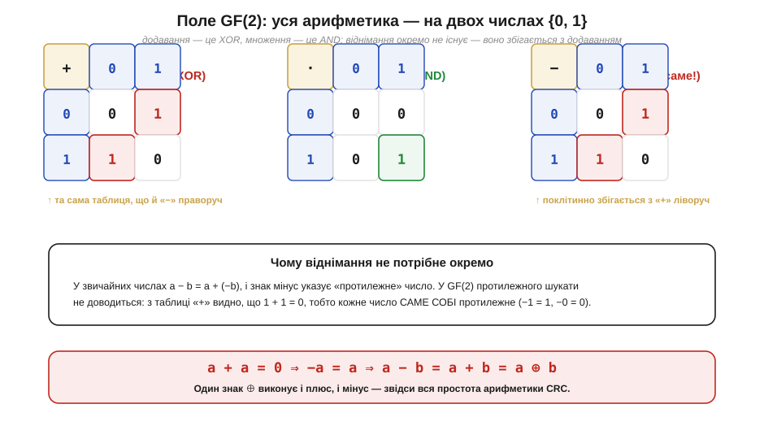
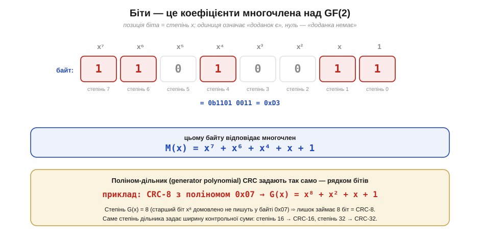
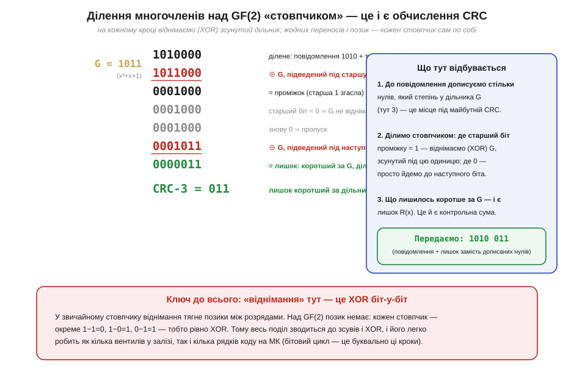
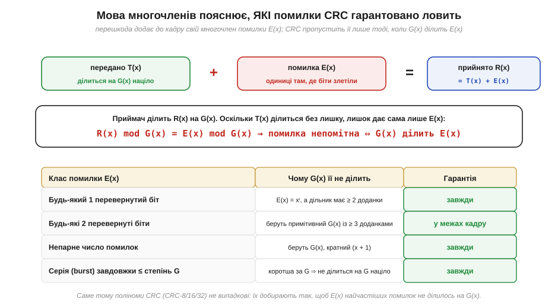

# 🧮 Математика CRC: многочлени над GF(2), де XOR — і плюс, і мінус

Механіку [CRC](book:communications/crc) часто описують суто бітово: зсуваємо біти, де старший — одиниця, робимо XOR із поліномом, а те, що лишилось, і є контрольна сума. Працює — але лишається питання, чому це взагалі **ділення** і звідки в ньому беруться «многочлени», якщо насправді ми просто крутимо XOR над бітами. Тут під той бітовий цикл підведено точну математику. Виявиться, що CRC — це звичайнісіньке ділення з остачею, тільки в арифметиці, де є лише два числа, 0 і 1, а XOR водночас грає роль і додавання, і віднімання. За словами «лишок від ділення на поліном» стоїть тоді теорема, а не образ.

### Означення: поле GF(2) — арифметика на двох числах

Почнімо з того, на чому тримається все інше, — з найменшого можливого набору чисел. **Поле Галуа з двох елементів** (*Galois field*, GF(2)) — це множина {0, 1} із двома діями: додаванням і множенням, заданими так, щоб результат теж лишався в {0, 1}. Назва вшановує Евариста Галуа (*Évariste Galois*) — французького математика, який заклав теорію скінченних полів іще у 1830-х; самі ж поля з простої кількості елементів нерідко звуть і полями Галуа, і просто скінченними полями.

Таблиці обох дій крихітні — лише чотири рядки на кожну, — і саме в них захована вся подальша простота.

*Рис. Уся арифметика поля GF(2) — на двох числах. Ліворуч: додавання (0+0=0, 0+1=1, 1+1=0) поклітинно збігається з логічним [XOR](book:electronics/xor-comparison). Посередині: множення — це **AND** (одиниця лише там, де обидва множники — одиниці). Праворуч найголовніше для CRC: таблиця **віднімання** поклітинно збігається з таблицею додавання. Причина — внизу: оскільки 1+1=0, кожне число саме собі протилежне (−1=1, −0=0), тому віднімати окремо нема потреби — мінус і плюс виконує той самий знак ⊕.*

Два спостереження з цієї картинки й роблять CRC таким зручним. Перше: додавання у GF(2) — це біт-у-біт XOR, а отже, додавання цілих **рядків** бітів — це порозрядний XOR двох слів, без жодних переносів між розрядами. Друге, і саме воно тут ключове: у GF(2) **віднімання дорівнює додаванню**. У звичайних числах a − b = a + (−b), і мінус указує на «протилежне» число; тут шукати протилежне не доводиться, бо a + a = 0 для будь-якого a, тобто −a = a. Один знак ⊕ робить обидві дії.

### Інтуїція: біти — це коефіцієнти многочлена

Зведімо тепер місток від окремих бітів до «многочленів», на яких тримається CRC. Ідея проста до краси: будь-який рядок бітів можна прочитати як **многочлен над GF(2)** (*polynomial over GF(2)*), де кожен біт — це коефіцієнт при відповідному степені x. Молодший біт стоїть при x⁰, наступний — при x¹, і так далі; одиниця означає «цей доданок присутній», нуль — «доданка немає».

*Рис. Той самий байт у двох мовах. Запис 1101 0011 (це 0xD3) читається як многочлен M(x) = x⁷ + x⁶ + x⁴ + x + 1 — лишилися тільки ті доданки, де біт дорівнює одиниці. Так само рядком бітів задають і **поліном-дільник** CRC: показаний приклад — стандартний CRC-8 з поліномом 0x07, тобто G(x) = x⁸ + x² + x + 1. Степінь дільника й визначає ширину контрольної суми: степінь 8 → CRC-8, степінь 16 → CRC-16, степінь 32 → CRC-32.*

Навіщо взагалі переходити від чисел до многочленів? Бо в цій мові додавання й множення поводяться інакше, ніж у звичайній двійковій арифметиці. Коли ми додаємо два многочлени над GF(2), коефіцієнти при кожному степені складаються **незалежно**, кожен за своєю таблицею «+» (тобто XOR), і жоден розряд не «переливається» в сусідній переносом. Саме ця відсутність переносів і відрізняє арифметику CRC від звичайного додавання стовпчиком; вона ж — причина, чому многочлен виявляється правильною моделлю, а просте число — ні.

### Формальний апарат: CRC — це ділення многочленів з остачею

Маючи многочлени, ми можемо їх **ділити стовпчиком** — точно як числа в школі, але з відніманням за правилами GF(2) (тобто XOR). Це і є обчислення CRC, назване своїм математичним ім'ям: до повідомлення M(x) дописують стільки нулів, який степінь у дільника G(x), а тоді ділять отримане на G(x) і беруть **остачу** R(x).

*Рис. Ділення 1010 на G = 1011 (тобто x³+x+1, степінь 3 ⇒ CRC-3). До повідомлення 1010 дописали три нулі під майбутній лишок. Далі — звичайний стовпчик: де старший біт поточного залишку дорівнює одиниці, віднімаємо (XOR) зсунутий під неї дільник; де нуль — просто переходимо до наступного біта. Що лишилося коротшим за дільник — і є остача R = 011: це й є CRC-3. Передають кадр 1010 011 — повідомлення з лишком замість дописаних нулів.*

Тепер видно, **чому** це працює рівно так. Ми ділимо не саме M(x), а M(x)·x³ — повідомлення зі зсувом на степінь дільника, що й дає дописані нулі. Поділивши, отримуємо M(x)·x³ = Q(x)·G(x) + R(x), де Q(x) — частка, а R(x) — остача, степінь якої менший за степінь G(x). Перенесемо R(x) ліворуч: над GF(2) «−» і «+» — те саме, тож M(x)·x³ + R(x) = Q(x)·G(x). Ліворуч — рівно той кадр, що ми передаємо: повідомлення зі зсувом, у молодші розряди якого вписано лишок замість нулів. А права частина кратна G(x). Отже, переданий кадр **точно ділиться на G(x) без остачі** — за побудовою. У цьому й весь сенс: приймач ділить отриманий кадр на той самий G(x), і якщо остача не нульова — кадр пошкоджено.

Чи здатна ця перевірка щось **пропустити** — і, головне, що саме? Тут мова многочленів дає несподівано точну відповідь.

*Рис. Перешкода в каналі додає до переданого T(x) свій «многочлен помилки» E(x) — з одиницями там, де біти злетіли. Приймач бачить R(x) = T(x) + E(x). Оскільки T(x) ділиться на G(x) націло, остача залежить лише від E(x): помилка лишиться непоміченою тоді й тільки тоді, коли G(x) ділить E(x). Тому поліноми CRC добирають не навмання — так, щоб дільник не ділив E(x) найчастіших помилок: поодиноких бітів, пар, непарних серій і коротких пакетів (burst).*

### Що з цього випливає

Уся бітова «механіка» [CRC](book:communications/crc) тепер видна наскрізь. Зсуви й XOR бітового циклу — це і є ділення многочленів стовпчиком над GF(2); «дописати нулі» — це домножити на x у степені дільника; «взяти, що лишилось» — це остача R(x). А головна зручність — що XOR водночас і додає, і віднімає, — пояснює, чому весь CRC зводиться до зсувів і XOR і так дешево лягає і в кілька логічних вентилів у залізі, і в кілька рядків коду на мікроконтролері.

Ця ж мова многочленів пояснює і місце CRC серед сусідніх способів контролю. [Біт парності](book:communications/parity-bit) — це найпростіший окремий випадок: ділення на G(x) = x + 1, остача якого і є парність усіх бітів. Прості й [Флетчерові контрольні суми](book:communications/checksums) теж зводять дані до короткого «відбитку», але роблять це додаванням у звичайній арифметиці; CRC сильніший саме тому, що ділення на ретельно дібраний многочлен має гарантії, яких проста сума не дає. А відсутність переносів у GF(2) — це різкий контраст до [арифметики за модулем 2ⁿ](book:math/twos-complement), де перенос, навпаки, переливається з розряду в розряд: контрольна сума живе у світі без переносів, а звичайне додавання чисел — у світі з ними.

> 🔧 **Навіщо це.** Винесіть одну думку: **CRC — це остача від ділення многочленів над GF(2), де XOR грає і плюс, і мінус**. Звідси практичне чуття. По-перше, ширину контрольної суми задає степінь полінома: x⁸+… дає CRC-8, x¹⁶+… — CRC-16 — тож, обираючи поліном, ви обираєте і скільки біт займе результат. По-друге, поліноми в даташитах (CAN, Ethernet, SD) не випадкові: їх дібрано так, щоб дільник не ділив многочлен найчастіших помилок, — тому брати «свій красивіший» поліном не варто, дібрані перевірені роками. По-третє, якщо ваш CRC «не сходиться» з еталонним, причина майже завжди не в математиці ділення, а в домовленостях навколо неї — у який бік ідуть біти, з якого значення стартувати, чи інвертувати результат. Самé ж серце — зсув-і-XOR — це буквально те саме ділення стовпчиком над GF(2).

> ⚙️ Як саме покласти це ділення в код — бітовим циклом, а потім швидшою табличною версією, і як обирати конкретний поліном (CRC-8/16/32), — показано в [⚙️-вставці §3.9.4a «CRC у коді»](book:communications/crc/proj-crc-implementation.md).
