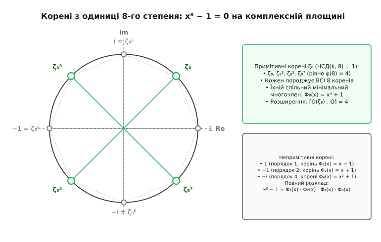
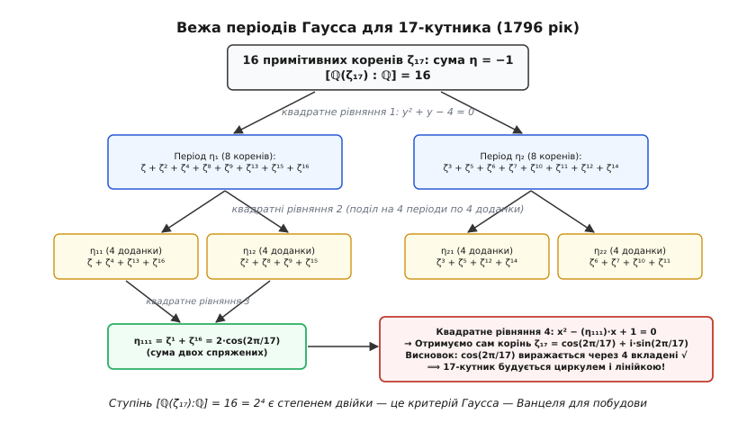
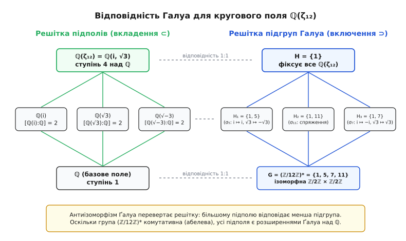
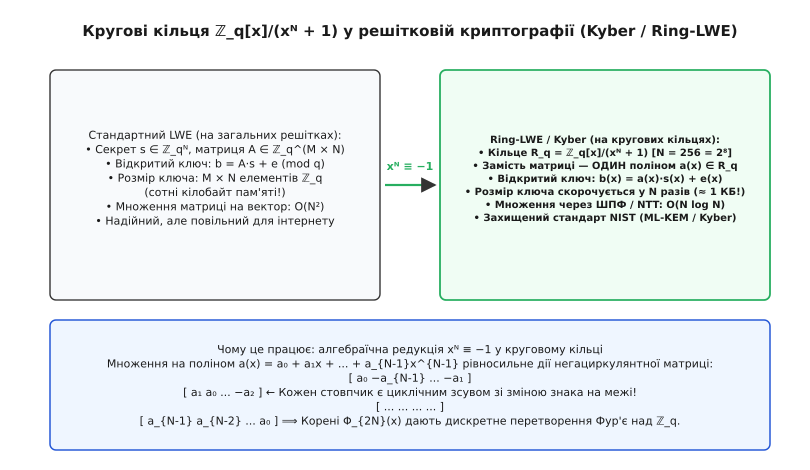

# Кругові поля: алгебра ділення кола

<preknowlist>
- [Кільця](topic:math/rings) — аксіоми кільця, дільники нуля, оборотні елементи та ідеали: кругові цілі числа утворюють комутативне кільце з одиницею.
- [Група Ґалуа](topic:math/galois-group) — автоморфізми полів, підполя фіксованих елементів і відповідність Ґалуа: кругові поля є головним зразком абелевих розширень.
- [Гауссові цілі числа](topic:math/gaussian-integers) — комплексні цілі числа ℤ[i]: це найпростіший приклад кругового кільця при n = 4.
- [Поліноми](topic:math/polynomials) — незвідність многочленів, ділення з остачею та корені в полі розкладу: кругові многочлени є мінімальними многочленами коренів з одиниці.
- [Модульна арифметика](topic:math/modular-arithmetic) — лишки за модулем n та мультиплікативна група (ℤ/nℤ)*: саме вона задає групу Ґалуа кругового поля.
</preknowlist>

Коли античні землеміри ділили коло на три, чотири або п'ять рівних частин за допомогою звичайного шнура й прямих кілків, вони несвідомо розв'язували рівняння, яке через два тисячоліття переверне всю алгебру та теорію чисел. Геометричний поділ кола на `n` однакових дуг рівносильний знаходженню вершин правильного многокутника на комплексній площині, тобто розв'язанню рівняння `xⁿ − 1 = 0`. Корені цього рівняння рівномірно засівають одиничне коло, а числовий простір, утворений додаванням і множенням цих коренів із раціональними дробами, називають **круговим полем** (англ. *cyclotomic field*, від грецьких слів *kýklos* — коло та *tomē* — розрізання).

Кругові поля стали мостом між трьома епохами математики. У 1796 році юний Карл Фрідріх Ґаусс за допомогою симетрій кругового поля сімнадцятого степеня вперше за дві тисячі років довів можливість побудови правильного 17-кутника циркулем і лінійкою. У середині XIX століття Ернст Куммер, намагаючись розкласти суму `xᵖ + yᵖ` у Великій теоремі Ферма над круговими числами, зіткнувся з крахом однозначної факторизації та винайшов «ідеальні числа», заклавши фундамент сучасної алгебри. А в XXI столітті на алгебрі кругових многочленів побудовано нові постквантові криптографічні стандарти (зокрема алгоритм шифрування CRYSTALS-Kyber), що захищають світовий інтернет від майбутніх квантових комп'ютерів.

### Корені з одиниці на комплексній площині

Уся конструкція виростає з одного алгебраїчного рівняння степеня `n`:

```
xⁿ − 1 = 0
```

У полі дійсних чисел це рівняння бідне: якщо `n` непарне, воно має лише один корінь `x = 1`; якщо `n` парне — два корені `x = 1` та `x = −1`. Але в полі комплексних чисел `ℂ` за основною теоремою алгебри многочлен `xⁿ − 1` має рівно `n` коренів.

Позначимо основу натурального логарифма як `e`, уявну одиницю як `i` (де `i² = −1`), а відношення довжини кола до діаметра як `π`. Тоді за формулою Ейлера корені `n`-го степеня з одиниці записуються у вигляді:

```
ζ[n, k] = e^(2·π·i·k / n) = cos(2·π·k / n) + i·sin(2·π·k / n)      [k = 0, 1, ..., n−1]
```

Усі ці `n` чисел лежать на одиничному колі `|z| = 1` і ділять його на `n` абсолютно однакових секторів із центральним кутом `2·π / n`.

За операцією множення множина цих `n` коренів утворює скінченну циклічну групу порядку `n`. Помножити корінь `ζ[n, k]` на `ζ[n, m]` означає просто додати їхні кути на колі:

```
ζ[n, k] · ζ[n, m] = e^(2·π·i·k / n) · e^(2·π·i·m / n)
                  = e^(2·π·i·(k + m) / n)
                  = ζ[n, (k + m) mod n]
```

Одиницею групи є число `ζ[n, 0] = e⁰ = 1`, а оберненим до `ζ[n, k]` є його комплексне спряження `ζ[n, n−k] = 1 / ζ[n, k]`.


*Корені 8-го степеня з одиниці на одиничному колі. Зелені точки — примітивні корені ζ₈, ζ₈³, ζ₈⁵, ζ₈⁷ (НСД(k, 8) = 1), чиї послідовні степені обходять усі вісім вершин. Сірі точки — непримітивні корені 1, −1, ±i, що «застрягають» у менших підгрупах порядків 1, 2 та 4.*

### Примітивні корені та функція Ейлера

Не всі `n` коренів є рівноправними генераторами. Деякі корені при піднесенні до степеня обходять усі `n` точок кола, а інші передчасно замикаються в менші правильні многокутники.

Число `ζ` називають **примітивним коренем** `n`-го степеня з одиниці (англ. *primitive root of unity*), якщо найменшим натуральним показником `m`, для якого `ζᵐ = 1`, є саме число `m = n`. Тобто примітивний корінь має точний порядок `n` у мультиплікативній групі `ℂ*`.

Корінь `ζ[n, k] = e^(2·π·i·k / n)` є примітивним тоді й тільки тоді, коли дріб `k / n` неможливо скоротити, тобто найбільший спільний дільник `НСД(k, n) = 1`.

Кількість примітивних коренів `n`-го степеня в точності дорівнює значенню **функції Ейлера** `φ(n)` (кількості натуральних чисел від 1 до `n`, взаємно простих із `n`).

Погляньмо на конкретні числові приклади:
- **Для n = 4:** корені `{1, i, −1, −i}`. Числа `k ∈ {1, 3}` взаємно прості з 4, тому примітивними є `i` та `−i`. Їхня кількість `φ(4) = 2`. Число `−1` не є примітивним коренем 4-го степеня, бо `(−1)² = 1` (його порядок дорівнює 2).
- **Для n = 6:** корені `e^(2·π·i·k / 6)`. Взаємно прості з 6 індекси — `{1, 5}`. Примітивні корені: `e^(i·π/3) = 1/2 + i·√3/2` та `e^(i·5π/3) = 1/2 − i·√3/2`. Їхня кількість `φ(6) = 2`. Решта коренів мають менші порядки: 1 (порядок 1), −1 (порядок 2), `e^(2πi/3)` та `e^(4πi/3)` (порядок 3).
- **Для n = 8:** примітивні корені `{ζ₈, ζ₈³, ζ₈⁵, ζ₈⁷}`. Їхня кількість `φ(8) = 4`. Наприклад, `ζ₈ = (√2 + i·√2) / 2`.
- **Для простого числа p:** кожен ненульовий степінь `k ∈ {1, 2, ..., p−1}` взаємно простий із `p`, тому всі `p − 1` коренів, крім самої одиниці, є примітивними: `φ(p) = p − 1`.

Якщо зафіксувати один базовий примітивний корінь `ζₙ = e^(2·π·i / n)`, то всі інші примітивні корені отримують як його степені `ζₙᵃ`, де `НСД(a, n) = 1`.

### Кругові многочлени: відділення примітивного від зайвого

Оскільки кожен із `n` коренів рівняння `xⁿ − 1 = 0` має деякий власний порядок `d`, де `d` обов'язково є дільником числа `n` (`d | n`), природно згрупувати корені за їхнім точним порядком.

**Круговим многочленом** (англ. *cyclotomic polynomial*) порядку `n` називають унітарний многочлен, коренями якого є всі примітивні корені `n`-го степеня з одиниці і тільки вони:

```
Φₙ(x) = ∏ (x − ζ[n, k])      [добуток за всіма 1 ≤ k ≤ n, де НСД(k, n) = 1]
```

Ступінь многочлена `Φₙ(x)` дорівнює `φ(n)`.

Оскільки кожен корінь `xⁿ − 1 = 0` належить рівно одному круговому многочлену `Φ[d](x)` для відповідного дільника `d | n`, многочлен `xⁿ − 1` розкладається в добуток:

```
xⁿ − 1 = ∏ Φ[d](x)      [добуток за всіма дільниками d | n]
```

Це дає універсальний алгоритм побудови `Φₙ(x)` послідовним діленням:

```
Φₙ(x) = (xⁿ − 1) / ∏ Φ[d](x)      [добуток у знаменнику за всіма власними d | n, d < n]
```

Обчислімо перші кругові многочлени крок за кроком:
- `Φ₁(x) = x − 1` (єдиний корінь `x = 1`, порядок 1).
- `Φ₂(x) = (x² − 1) / Φ₁(x) = (x² − 1) / (x − 1) = x + 1` (корінь `x = −1`, порядок 2).
- `Φ₃(x) = (x³ − 1) / Φ₁(x) = (x³ − 1) / (x − 1) = x² + x + 1`.
- `Φ₄(x) = (x⁴ − 1) / (Φ₁(x) · Φ₂(x)) = (x⁴ − 1) / (x² − 1) = x² + 1` (корені `±i`, порядок 4).
- `Φ₅(x) = x⁴ + x³ + x² + x + 1`.
- `Φ₆(x) = (x⁶ − 1) / (Φ₁ · Φ₂ · Φ₃) = (x⁶ − 1) / ((x³ − 1)·(x + 1)) = x² − x + 1`.
- `Φ₈(x) = (x⁸ − 1) / (x⁴ − 1) = x⁴ + 1`.
- `Φ₁₂(x) = (x¹² − 1) / ((x⁶ − 1) · (x² + 1)) = (x⁶ + 1) / (x² + 1) = x⁴ − x² + 1`.

Усі коефіцієнти кругових многочленів виявляються строго **цілими числами** (`Φₙ(x) ∈ ℤ[x]`), а сам многочлен `Φₙ(x)` є **незвідним над полем раціональних чисел `ℚ`**. Це означає, що `Φₙ(x)` не можна розкласти на добуток простіших многочленів із раціональними коефіцієнтами. Повне аналітичне доведення незвідності через критерій Ейзенштейна та редукцію за простим модулем винесено в окремий розділ: [круглі многочлени, незвідність і теорему Кронекера — Вебера](topic:math/cyclotomic-fields/math-cyclotomic-polynomials.md).

### Означення кругового поля та степінь розширення

Тепер ми готові збудувати головний об'єкт нашого розгляду. Візьмімо поле раціональних чисел `ℚ` (звичайні дроби) і додамо до нього один примітивний корінь `n`-го степеня з одиниці `ζₙ = e^(2·π·i / n)`.

**Круговим полем** порядку `n` називають найменше числове поле, що містить усі раціональні числа та примітивний корінь `ζₙ`. Його позначають:

```
K = ℚ(ζₙ)
```

Оскільки всі інші корені `n`-го степеня є степенями одного примітивного кореня (`ζₙ², ζₙ³, ...`), приєднання одного `ζₙ` автоматично втягує в поле **всі `n` коренів** рівняння `xⁿ − 1 = 0`. Тобто `ℚ(ζₙ)` є полем розкладу многочлена `xⁿ − 1` над `ℚ`.

Степінь розширення поля `[ℚ(ζₙ) : ℚ]` (розмірність `ℚ(ζₙ)` як векторного простору над `ℚ`) дорівнює ступеню мінімального многочлена елемента `ζₙ`. Оскільки круговий многочлен `Φₙ(x)` незвідний над `ℚ`, він і є цим мінімальним многочленом:

```
[ℚ(ζₙ) : ℚ] = deg(Φₙ) = φ(n)
```

Будь-яке число з кругового поля `ℚ(ζₙ)` однозначно записується як многочлен від `ζₙ` ступеня менше ніж `φ(n)` із раціональними коефіцієнтами:

```
α = c₀ + c₁·ζₙ + c₂·ζₙ² + ... + c[φ(n)−1]·ζₙ^(φ(n)−1)      [де кожне c[j] ∈ ℚ]
```

Базисом векторного простору `ℚ(ζₙ)` над `ℚ` є набір степенів:

```
{ 1, ζₙ, ζₙ², ..., ζₙ^(φ(n)−1) }
```

### Гаусс і правильний 17-кутник: прорив 1796 року

Чому степінь розширення `[ℚ(ζₙ) : ℚ] = φ(n)` настільки важливий на практиці? Відповідь дає геометрія лінійки й циркуля.

Побудова геометричного відрізка за допомогою циркуля та лінійки дозволяє виконувати лише лінійні операції (перетин двох прямих) та добування квадратного кореня (перетин прямої з колом або двох кіл). Кожне добування квадратного кореня подвоює степінь числового поля. Отже, числове значення координати вершини `n`-кутника `cos(2·π / n)` можна побудувати циркулем і лінійкою тоді й тільки тоді, коли ступінь відповідного числового розширення над `ℚ` є **чистим степенем двійки**:

```
[ℚ(ζₙ) : ℚ] = φ(n) = 2ᵐ
```

Якщо число `n = p` є простим, умова `φ(p) = p − 1 = 2ᵐ` вимагає, щоб `p = 2ᵐ + 1`. Нескладне алгебраїчне міркування показує, що число `2ᵐ + 1` може бути простим лише тоді, коли показник `m` сам є степенем двійки `m = 2ᵏ`. Такі числа називають **простими числами Ферма**:

```
F[k] = 2^(2^k) + 1
```

Першими простими числами Ферма є `F₀ = 3`, `F₁ = 5`, `F₂ = 17`, `F₃ = 257`, `F₄ = 65537`.

**Теорема Ґаусса — Ванцеля:**
Правильний `n`-кутник можна побудувати циркулем і лінійкою тоді й тільки тоді, коли `n` є добутком степеня двійки та довільної кількості **попарно різних простих чисел Ферма**:

```
n = 2ᵏ · p₁ · p₂ · ... · p_m      [де кожне p_i — різне просте Ферма]
```

Звідси випливає, що правильні многокутники для `n = 3, 4, 5, 6, 8, 10, 12, 15, 16, 17, 257, 65537` будуються циркулем і лінійкою, тоді як побудова 7-кутника (`φ(7) = 6`), 9-кутника (`φ(9) = 6`), 11-кутника (`φ(11) = 10`) або 13-кутника (`φ(13) = 12`) геометрично неможлива.

Для правильного 17-кутника число `n = 17` є простим числом Ферма `F₂`, тому:

```
φ(17) = 17 − 1 = 16 = 2⁴
```


*Вежа періодів Гаусса для 17-кутника (1796 рік). Шістнадцять коренів ζ₁₇ розбиваються на 2 періоди по 8 коренів (перше квадратне рівняння), потім на 4 періоди по 4 корені (друге рівняння), 8 періодів по 2 корені (третє рівняння), що дає значення cos(2π/17) через чотири вкладені квадратні корені.*

Ґаусс показав, що 16 коренів кругового многочлена `Φ₁₇(x) = x¹⁶ + x¹⁵ + ... + 1` можна розбити на дві групи по 8 коренів — так звані періоди `η₁` та `η₂`. Їхня сума дорівнює `−1`, а добуток дорівнює `−4`. За теоремою Вієта вони задовольняють квадратне рівняння `y² + y − 4 = 0`, звідки:

```
η₁, η₂ = (−1 ± √17) / 2
```

Подальше розбиття періодів крок за кроком звело рівняння 16-го степеня до ланцюжка з чотирьох послідовних квадратних рівнянь. Це дозволило Ґауссу вперше в історії виписати точну формулу для косинуса кута `2·π / 17`, що містить лише чотири вкладені квадратні корені й доводить побудовність сімнадцятикутника:

```
cos(2·π / 17) = −1/16 + (1/16)·√17 + (1/16)·√(34 − 2·√17)
                + (1/8)·√(17 + 3·√17 − √(34 − 2·√17) − 2·√(34 + 2·√17))
```

Повна історія цього відкриття, прості числа Ферма та драматична спроба доведення теореми Ферма Ламе й Коші розібрані окремо: [історію відкриття Гаусса та ідеальні числа Куммера](topic:math/cyclotomic-fields/hist-gauss-heptadecagon.md).

### Кільце цілих кругових чисел та крах однозначного розкладу

Так само як звичайні раціональні числа `ℚ` містять усередині кільце цілих чисел `ℤ`, кожне кругове поле `ℚ(ζₙ)` містить своє **кільце цілих алгебраїчних чисел**, яке позначають `ℤ[ζₙ]`.

Елементи `ℤ[ζₙ]` — це числа, які є коренями унітарних многочленів із цілими коефіцієнтами. Ріхард Дедекінд довів фундаментальну теорему: степеневий базис `{1, ζₙ, ζₙ², ..., ζₙ^(φ(n)−1)}` є **цілісним базисом** (англ. *integral basis*) поля `ℚ(ζₙ)`. Це означає, що кожне ціле алгебраїчне число з `ℚ(ζₙ)` є лінійною комбінацією степенів `ζₙ` виключно з цілими коефіцієнтами:

```
ℤ[ζₙ] = { a₀ + a₁·ζₙ + a₂·ζₙ² + ... + a[φ(n)−1]·ζₙ^(φ(n)−1)  |  a[j] ∈ ℤ }
```

Знайомі нам числові кільця є окремими випадками кругових кілець:
- При `n = 4`: `ζ₄ = i`, кільце `ℤ[i]` — це [гауссові цілі числа](topic:math/gaussian-integers) `a + b·i`.
- При `n = 3` або `n = 6`: кільце цілих чисел Ейзенштейна `a + b·ω` (де `ω = e^(2πi/3)`).

В обох цих кільцях діє аналог алгоритму Евкліда і справджується **основна теорема арифметики**: кожне число однозначно розкладається на прості множники (з точністю до порядку та множення на оборотні одиниці `±1, ±i`).

У 1847 році Габріель Ламе спробував довести Велику теорему Ферма `xᵖ + yᵖ = zᵖ`, розклавши ліву частину в круговому кільці `ℤ[ζₚ]`:

```
xᵖ + yᵖ = (x + y)·(x + ζ·y)·(x + ζ²·y)· ... ·(x + ζ^(p−1)·y) = zᵖ
```

Ламе припустив, що оскільки добуток взаємно простих множників дорівнює `p`-му степеню `zᵖ`, кожен окремий множник `(x + ζᵏ·y)` сам зобов'язаний бути `p`-м степенем деякого кругового числа.

Проте Ернст Куммер показав, що це міркування є хибним. **Для простих чисел `p ≥ 23` однозначність розкладу на прості числа в кільці `ℤ[ζₚ]` зазнає краху!**

У кільці `ℤ[ζ₂₃]` існують цілі числа, які розкладаються на незвідні множники різними, несумісними між собою способами. Щоб урятувати арифметику, Куммер винайшов теорію ідеальних чисел, яка згодом перетворилася на сучасну теорію **ідеалів** Дедекінда. Замість чисел почали розкладати ідеали:

> У кільці `ℤ[ζₙ]` кожен ненульовий ідеал однозначно розкладається в добуток простих ідеалів:
> `I = 𝔭₁ · 𝔭₂ · ... · 𝔭[k]`

Мірою відхилення кільця `ℤ[ζₚ]` від однозначної факторизації чисел стало **число класів ідеалів** `h[p]`. Якщо `h[p] = 1`, факторизація чисел однозначна; якщо `h[p] > 1` — неоднозначна. Для `p = 23` число класів дорівнює `h₂₃ = 3`.

Куммер назвав просте число `p` **регулярним**, якщо `p` не ділить число класів `h[p]`, і зумів довести Велику теорему Ферма для всіх регулярних простих чисел, перевіривши їх через чисельники чисел Бернуллі `B₂, B₄, ..., B[p−3]`. Першим нерегулярним простим числом виявилося `p = 37`, оскільки 37 ділить чисельник числа Бернуллі `B₃₂`.

### Норма, слід, дискримінант та одиниці кругового кільця

Для аналізу елементів кругового поля `K = ℚ(ζₙ)` використовують дві базові алгебраїчні функції: **слід** (англ. *trace*) та **норму** (англ. *norm*).

Нехай `σ₁`, `σ₂`, ..., `σ[d]` — усі `d = φ(n)` автоморфізмів групи Ґалуа `Gal(K/ℚ)`. Тоді для будь-якого елемента `α ∈ K`:

```
Tr[K/ℚ](α) = ∑[j=1..d] σ[j](α)      [слід — сума всіх спряжених]
N[K/ℚ](α)  = ∏[j=1..d] σ[j](α)      [норма — добуток усіх спряжених]
```

Для будь-якого елемента `α ∈ K` його слід і норма є звичайними **раціональними числами** (`Tr(α) ∈ ℚ`, `N(α) ∈ ℚ`). Якщо ж `α ∈ ℤ[ζₙ]` є круговим цілим числом, то його слід і норма є **звичайними цілими числами** (`Tr(α) ∈ ℤ`, `N(α) ∈ ℤ`).

Обчислімо норму та слід для базового примітивного кореня `ζₙ`:
1. **Слід примітивного кореня:**
   Якщо `n = p` — просте число, то спряженими є всі корені `ζ, ζ², ..., ζ^(p−1)`. Їхня сума дорівнює коефіцієнту при `x^(p−2)` кругового многочлена `Φₚ(x)` із протилежним знаком:
```
Tr[ℚ(ζₚ)/ℚ](ζₚ) = ζ + ζ² + ... + ζ^(p−1) = −1
```
2. **Норма примітивного кореня:**
   Добуток усіх спряжених дорівнює вільному члену кругового многочлена `Φₙ(x)`:
```
N[ℚ(ζₙ)/ℚ](ζₙ) = 1      [для n > 1]
```
3. **Норма різниці (1 − ζₙ):**
   Підставмо `x = 1` у формулу кругового многочлена `Φₙ(x) = ∏ (x − ζₙᵃ)`:
```
N[ℚ(ζₙ)/ℚ](1 − ζₙ) = ∏[НСД(a,n)=1] (1 − ζₙᵃ) = Φₙ(1)
```
   Значення `Φₙ(1)` має чудову властивість:
   - Якщо `n = p` є простим числом: `Φₚ(1) = 1^(p−1) + 1^(p−2) + ... + 1 = p`.
     Отже, `N(1 − ζₚ) = p`. Це означає, що число `1 − ζₚ` є дільником простого числа `p`.
   - Якщо `n = pᵏ` є степенем простого числа: `Φ[pᵏ](1) = Φₚ(1) = p`. Отже, `N(1 − ζ[pᵏ]) = p`.
   - Якщо `n` має **принаймні два різних простих дільники** (наприклад, `n = 6, 10, 12`): `Φₙ(1) = 1`.
     Отже, `N(1 − ζₙ) = 1`. Це означає, що число `1 − ζₙ` є **оборотним елементом (одиницею)** кільця `ℤ[ζₙ]`!

**Дискримінант кругового поля:**
Дискримінант поля `ℚ(ζₚ)` для простого числа `p` обчислюється за формулою:

```
Δ(ℚ(ζₚ) / ℚ) = (−1)^((p − 1) / 2) · p^(p − 2)
```

Наприклад:
- Для `p = 3`: `Δ(ℚ(ζ₃)) = −3¹ = −3`.
- Для `p = 5`: `Δ(ℚ(ζ₅)) = 5³ = 125`.
- Для `p = 7`: `Δ(ℚ(ζ₇)) = −7⁵ = −16807`.

Оскільки єдиним простим дільником дискримінанта є саме число `p`, за теоремою Дедекінда лише просте число `p` розгалужується в полі `ℚ(ζₚ)`.

**Кругові одиниці та теорема Діріхле:**
За теоремою Діріхле про структуру групи одиниць, ранг мультиплікативної групи одиниць `ℤ[ζₙ]*` дорівнює `r = φ(n) / 2 − 1`. Числа вигляду `(1 − ζₙᵃ) / (1 − ζₙ)` для `НСД(a, n) = 1` називають **круговими одиницями** (англ. *cyclotomic units*). Вони породжують підгрупу скінченного індексу в повній групі одиниць, і цей індекс у точності дорівнює числу класів ідеалів максимального дійсного підполя `h⁺`.

### Геометрія чисел і решітки ідеалів

Алгебраїчні структури кругових полів мають природну геометричну інтерпретацію через так зване **канонічне занурення Мінковського** (англ. *Minkowski embedding*).

Оскільки кругове поле `K = ℚ(ζₙ)` степеня `d = φ(n)` має `d / 2` пар комплексно спряжених занурень у поле `ℂ`, кожен елемент `α ∈ K` можна відобразити у дійсний евклідів простір `ℝᵈ`:

```
σ(α) = ( Re(σ₁(α)), Im(σ₁(α)), ..., Re(σ[d/2](α)), Im(σ[d/2](α)) ) ∈ ℝᵈ
```

При такому відображенні кільце цілих кругових чисел `ℤ[ζₙ]` перетворюється на дискретну **геометричну решітку** (англ. *lattice*) повної розмірності `d = φ(n)` у просторі `ℝᵈ`.

Ба більше, кожен ідеал `I ⊆ ℤ[ζₙ]` стає підрешіткою простору `ℝᵈ`, яка має унікальну геометричну симетрію: вона інваріантна відносно оператора множення на `ζₙ`. У базисі степенів множення на `ζₙ` діє як циклічний зсув координат із можливим зміненням знака. Такі об'єкти в сучасній математиці називають **ідеальними решітками** (англ. *ideal lattices*).

Саме геометричні властивості ідеальних решіток — довжина найкоротшого вектора та детермінант решітки — визначають стійкість постквантових криптографічних алгоритмів до атак редукції базису (алгоритмів LLL та BKZ).

### Група Ґалуа кругового поля

Симетрія кругового поля `ℚ(ζₙ)` має винятково гармонійну будову. Будь-який автоморфізм поля `σ: ℚ(ζₙ) → ℚ(ζₙ)` (перетворення, що зберігає додавання й множення та не змінює раціональні числа) повністю визначається образом генератора `ζₙ`.

Оскільки `ζₙ` є коренем незвідного многочлена `Φₙ(x)`, його образ `σ(ζₙ)` зобов'язаний бути іншим коренем того самого многочлена, тобто іншим примітивним коренем `ζₙᵃ`, де `НСД(a, n) = 1`.

Отже, для кожного лишку `a ∈ (ℤ/nℤ)*` існує єдиний автоморфізм `σ[a]`, який діє за правилом:

```
σ[a](ζₙ) = ζₙᵃ
```

Складення двох автоморфізмів відповідає множенню лишків:

```
(σ[a] ∘ σ[b])(ζₙ) = σ[a](ζₙᵇ) = (ζₙᵇ)ᵃ = ζₙ^(a·b) = σ[a·b mod n](ζₙ)
```

Це означає, що **група Ґалуа кругового поля ізоморфна мультиплікативній групі кільця лишків**:

```
Gal(ℚ(ζₙ) / ℚ) ≅ (ℤ/nℤ)*
```

Оскільки множення лишків у `(ℤ/nℤ)*` переставне (`a·b = b·a`), група Ґалуа є **комутативною (абелевою)**.

**Приклад дії автоморфізмів для n = 5:**
Група `(ℤ/5ℤ)* = {1, 2, 3, 4}` є циклічною групою порядку 4, породженою числом 2:
```
σ₂: ζ ↦ ζ²
σ₂² = σ₄: ζ ↦ ζ⁴ = ζ⁻¹      [комплексне спряження!]
σ₂³ = σ₃: ζ ↦ ζ³
σ₂⁴ = σ₁ = id: ζ ↦ ζ
```

Автоморфізм `σ₄(ζ) = ζ⁴ = ζ⁻¹` діє як звичайне комплексне спряження чисел: `z = x + i·y ↦ x − i·y`.

Підполе елементів, нерухомих відносно комплексного спряження, називають **максимальним дійсним підполем** (англ. *maximal real subfield*):

```
ℚ(ζₙ)⁺ = ℚ(ζₙ + ζₙ⁻¹) = ℚ( 2·cos(2·π / n) )
```

Ступінь максимального дійсного підполя дорівнює рівно половині степеня повного кругового поля:

```
[ ℚ(ζₙ)⁺ : ℚ ] = φ(n) / 2
```

Це поле породжується дійсними тригонометричними значеннями `cos(2·π·k / n)` і містить виключно дійсні алгебраїчні числа.


*Відповідність Ґалуа для кругового поля ℚ(ζ₁₂). Ліворуч — решітка проміжних числових полів ℚ(i), ℚ(√3), ℚ(√−3). Праворуч — решітка відповідних підгруп групи Ґалуа (ℤ/12ℤ)* = {1, 5, 7, 11}. Більшому полю відповідає менша підгрупа автоморфізмів, що його фіксують.*

### Факторизація простих ідеалів у круговому кільці

Одне з найважливіших питань алгебраїчної теорії чисел — як звичайне раціональне просте число `q ∈ ℤ` розкладається на прості ідеали в круговому кільці `ℤ[ζₙ]`.

Теорема Дедекінда — Куммера стверджує, що поведінка ідеалу `(q)` повністю визначається мультиплікативним порядком числа `q` в групі лишків `(ℤ/nℤ)*`.

Нехай `q` не ділить `n` (`q ∤ n`), а `f` — порядок числа `q` за модулем `n` (найменше натуральне `f`, для якого `qᶠ ≡ 1 mod n`). Тоді в `ℤ[ζₙ]`:

```
(q) = 𝔮₁ · 𝔮₂ · ... · 𝔮[g]
де g = φ(n) / f,  а кожен простий ідеал 𝔮[j] має норму N(𝔮[j]) = qᶠ
```

Тут проявляються три фундаментальні типи поведінки простих чисел:
1. **Повний розпад (Complete Splitting):**
   Якщо `q ≡ 1 (mod n)`, то порядок `f = 1`. Тоді `g = φ(n)`.
   Просте число `q` розпадається на `φ(n)` різних простих ідеалів першого степеня:
   `(q) = 𝔮₁ · 𝔮₂ · ... · 𝔮[φ(n)]`.
   Наприклад, у полі `ℚ(ζ₅)` (`φ(5) = 4`) просте число `11 ≡ 1 mod 5` розпадається на 4 прості ідеали: `(11) = 𝔮₁ · 𝔮₂ · 𝔮₃ · 𝔮₄`.

2. **Інертність (Inertia):**
   Якщо порядок `f = φ(n)` (число `q` є первісним коренем за модулем `n`), то `g = 1`.
   Ідеал `(q)` залишається простим ідеалом у `ℤ[ζₙ]`.
   Наприклад, у полі `ℚ(ζ₅)` число 2 має порядок 4 за модулем 5 (`2⁴ = 16 ≡ 1 mod 5`). Тому ідеал `(2)` є простим у `ℤ[ζ₅]`.

3. **Розгалуження (Ramification):**
   Якщо просте число `p` ділить `n` (`p | n`), воно розгалужується.
   Зокрема, у полі `ℚ(ζₚ)` просте число `p` розкладається як:
   `(p) = (1 − ζₚ)^(p−1)`.
   Ідеал `(p)` стає `(p − 1)`-м степенем єдиного простого ідеалу `𝔭 = (1 − ζₚ)`.

**Числовий приклад розкладу в кільці ℤ[ζ₈]:**
У полі `ℚ(ζ₈)` круговий многочлен дорівнює `Φ₈(x) = x⁴ + 1`, ступінь `φ(8) = 4`.
- Для `q = 2`: `(2) = (1 − ζ₈)⁴` (повне розгалуження).
- Для `q = 17 ≡ 1 mod 8`: `f = 1, g = 4`, число 17 повністю розпадається на 4 прості ідеали степеня 1.
- Для `q = 3 ≡ 3 mod 8`: оскільки `3² = 9 ≡ 1 mod 8`, порядок `f = 2`, кількість ідеалів `g = 4 / 2 = 2`. Многочлен `x⁴ + 1 ≡ (x² + x + 2)·(x² + 2x + 2) mod 3`, тому `(3) = 𝔮₁ · 𝔮₂`.
- Для `q = 5 ≡ 5 mod 8`: порядок `f = 2, g = 2`, `(5) = 𝔮₁' · 𝔮₂'`.
- Для `q = 7 ≡ 7 mod 8`: порядок `f = 2, g = 2`, `(7) = 𝔮₁'' · 𝔮₂''`.

Ця теорема пов'язує факторизацію многочленів над скінченними полями `𝔽_q` з розкладом ідеалів у числових полях і є наріжним каменем сучасної арифметичної геометрії.

### Проміжні поля та суми Ґаусса

За основною теоремою теорії Ґалуа кожній підгрупі `H ⊆ (ℤ/nℤ)*` відповідає проміжне підполе фіксованих елементів `K = ℚ(ζₙ)ᴴ`.

Особливе місце посідають квадратичні підполя (розширення степеня 2 над `ℚ`). Якщо `p` — непарне просте число, група `(ℤ/pℤ)*` є циклічною групою парного порядку `p − 1`. Вона містить рівно одну підгрупу квадратичних лишків індексу 2. Їй відповідає єдине квадратичне поле `ℚ(√p*) ⊂ ℚ(ζₚ)`.

Твірним елементом цього квадратичного поля є **сума Ґаусса**:

```
g = ∑[k=1..p−1] (k / p) · ζ[p]ᵏ      [де (k / p) — символ Лежандра: +1 для квадратичних лишків, −1 для нелишків]
```

Пряме піднесення до квадрата дає фундаментальну формулу Ґаусса:

```
g² = (−1)^((p − 1) / 2) · p = p*
```

де `p* = p`, якщо `p ≡ 1 (mod 4)`, і `p* = −p`, якщо `p ≡ 3 (mod 4)`.

Звідси випливає, що будь-який квадратний корінь `√d` із раціонального числа міститься в деякому круговому полі!
- `√5 ∈ ℚ(ζ₅)` (оскільки `5 ≡ 1 mod 4`).
- `√−3 = i·√3 ∈ ℚ(ζ₃)` (оскільки `3 ≡ 3 mod 4`).
- `i = √−1 = ζ₄ ∈ ℚ(ζ₄)`.
- `√2 ∈ ℚ(ζ₈)` (оскільки `ζ₈ + ζ₈⁷ = 2·cos(π/4) = √2`).

### Закони взаємності вищих степенів Куммера

Узагальнюючи квадратичний закон взаємності Ґаусса, Ернст Куммер використав кругові поля `ℚ(ζₚ)` для побудови **законів взаємності степеня `p`**.

Для простого ідеалу `𝔭 ⊂ ℤ[ζₚ]` символ степеневого лишку `(α / 𝔭)[p]` визначається як єдиний корінь з одиниці `ζₚᵏ`, що задовольняє порівняння:

```
α^((N(𝔭) − 1) / p) ≡ (α / 𝔭)[p]  (mod 𝔭)
```

Закон взаємності Куммера встановлює симетрію між `(α / 𝔭)[p]` та `(β / 𝔮)[p]` і став фундаментом для створення теорії полів класів (англ. *class field theory*) Давида Гільберта, Тейдзі Такаґі та Еміля Артіна у першій половині XX століття.

### Дзета-функція Дедекінда та L-функції Діріхле

Аналітичні властивості кругового поля `K = ℚ(ζₙ)` кодуються його дзета-функцією Дедекінда `ζ_K(s)`. Дивовижне відкриття Петера Густава Лежена Діріхле полягає в тому, що для кругового поля дзета-функція розпадається на добуток L-функцій Діріхле за всіма `φ(n)` характерами групи лишків `(ℤ/nℤ)*`:

```
ζ[ℚ(ζₙ)](s) = ∏[χ mod n] L(s, χ) = ζ(s) · ∏[χ ≠ χ₀] L(s, χ)
```

де `ζ(s)` — класична дзета-функція Рімана, а `χ₀` — головний характер.

Обчислення лишку функції `ζ_K(s)` у точці `s = 1` дає **аналітичну формулу числа класів**:

```
lim[s → 1] (s − 1)·ζ_K(s) = ( 2^r₁ · (2·π)^r₂ · h · R ) / ( w · √|Δ| )
```

де `h` — число класів ідеалів, `R` — регулятор поля (об'єм ґратки логарифмів одиниць), `w` — кількість коренів з одиниці в полі, `Δ` — дискримінант, а `r₁, r₂` — кількість дійсних і комплексних занурень поля.

Ця формула пов'язує чисту алгебру (групу класів ідеалів та одиниці кільця) з аналітичними значеннями нескінченних рядів `L(1, χ)`.

### Теорема Кронекера — Вебера

Узагальненням цього спостереження стала одна з найвеличніших теорем в історії алгебри, сформульована Леопольдом Кронекером у 1853 році та доведена Генріхом Вебером у 1886 році.

**Теорема Кронекера — Вебера:**
Кожне скінченне абелеве розширення поля раціональних чисел `K / ℚ` (тобто будь-яке числове поле `K`, чия група Ґалуа `Gal(K/ℚ)` є комутативною) є підполем деякого кругового поля:

```
K ⊆ ℚ(ζₙ)      [для деякого натурального n]
```

Найменше таке число `n` називають **провідником** (англ. *conductor*) поля `K`.

Це дивовижний результат: хоча числових полів над `ℚ` існує нескінченна кількість із найрізноманітнішими структурами, **усі без винятку комутативні числові поля сховані всередині кіл**. Будь-яке алгебраїчне число, чиї спряжені утворюють комутативну групу симетрій, є звичайною сумою коренів з одиниці `ζₙ` з раціональними коефіцієнтами.

### Сучасність: решіткова криптографія та кругові кільця

У XXI столітті кругові поля здійснили несподіваний стрибок із чистої математики в серце комп'ютерної безпеки.

Створення квантових комп'ютерів загрожує зламати криптосистеми RSA та еліптичних кривих. Єдиною стійкою альтернативою стала криптографія на евклідових решітках (Learning With Errors, LWE). Проте стандартний LWE вимагає множення велетенських випадкових матриць `A ∈ ℤ_q^(M × N)`, що призводить до гігантських ключів розміром у сотні кілобайтів.

Вихід знайшли у використанні **кругових поліноміальних кілець**:

```
R_q = ℤ_q[x] / (Φ[2N](x)) = ℤ_q[x] / (xᴺ + 1)
```

де `N = 256 = 2⁸`, а `q = 3329` — просте число (параметри міжнародного стандарту шифрування CRYSTALS-Kyber / ML-KEM).


*Кругові кільця ℤ_q[x] / (xᴺ + 1) у решітковій криптографії Kyber. Ліворуч — стандартний LWE з великими матрицями та ключами в сотні кілобайтів. Праворуч — Ring-LWE на круговому многочлені: один поліном замінює матрицю N×N, скорочуючи розмір ключів у 256 разів та прискорюючи множення через NTT до O(N log N).*

Правило заміни `xᴺ ≡ −1` забезпечує так звану **негациклічну згортку** коефіцієнтів. Завдяки тому, що корені многочлена `x²⁵⁶ + 1` лежать у скінченному полі `ℤ₃₃₂₉`, множення двох поліномів виконується через теоретико-числове перетворення Фур'є (NTT) за час `O(N log N)` замість `O(N²)`.

**Схема шифрування Ring-LWE на практиці:**
1. **Генерація ключів:** обирають випадковий секретний поліном `s(x)` із малими коефіцієнтами (шум) та випадковий поліном помилки `e(x)`. Відкритий ключ формується як пара `(a(x), b(x))`, де `b(x) = a(x) · s(x) + e(x) mod (xᴺ + 1, q)`.
2. **Шифрування повідомлення:** щоб зашифрувати вектор бітів `m`, відправник генерує випадкові малі поліноми `r(x), e₁(x), e₂(x)` і обчислює шифротекст із двох поліномів `(u(x), v(x))`:
```
u(x) = a(x) · r(x) + e₁(x)
v(x) = b(x) · r(x) + e₂(x) + m(x) · ⌊q/2⌉
```
3. **Розшифрування:** отримувач обчислює різницю за допомогою свого таємного ключа `s(x)`:
```
v(x) − s(x) · u(x) = (a·s·r + e·r + e₂ + m·⌊q/2⌉) − s·(a·r + e₁)
                   = m(x) · ⌊q/2⌉ + (e·r + e₂ − s·e₁)
```
Оскільки добутки малих шумів `(e·r + e₂ − s·e₁)` є значно меншими за поріг `q/4`, округлення кожного коефіцієнта до найближчого значення `0` або `⌊q/2⌉` бездоганно відновлює вихідні біти повідомлення `m(x)`.

**Модульне масштабування (Module-LWE):**
Щоб гнучко змінювати рівень криптографічної стійкості без зміни структури кругового кільця `R_q`, стандарти NIST використовують вектори та матриці над `R_q`:
- У Kyber-512 (рівень безпеки NIST 1) секретом є вектор із 2 поліномів над `R_q` (матриця `2 × 2`).
- У Kyber-768 (рівень безпеки NIST 3) — вектор із 3 поліномів (матриця `3 × 3`).
- У Kyber-1024 (рівень безпеки NIST 5) — вектор із 4 поліномів (матриця `4 × 4`).

Це дозволяє використовувати один і той самий апаратний прискорювач кругової арифметики `x²⁵⁶ + 1` для всіх рівнів захисту без переписування базових математичних бібліотек.

Повний алгоритмічний розбір негациклічної згортки, метеликів NTT Кулі — Тьюкі та робочий код на C і C++ наведено у практичному розділі: [практичну реалізацію арифметики кругових кілець на C та C++](topic:math/cyclotomic-fields/proj-cyclotomic-arithmetic.md).

Кругові поля, народжені з античної задачі поділу кола циркулем, залишаються універсальною мовою математики — від класифікації числових полів Кронекера до квантово-безпечного захисту глобальних цифрових комунікацій.
