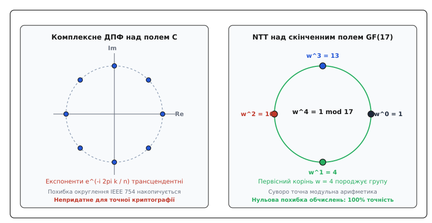
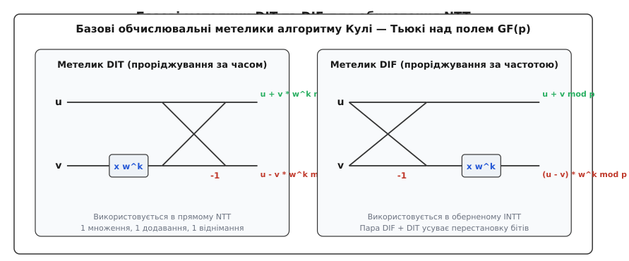
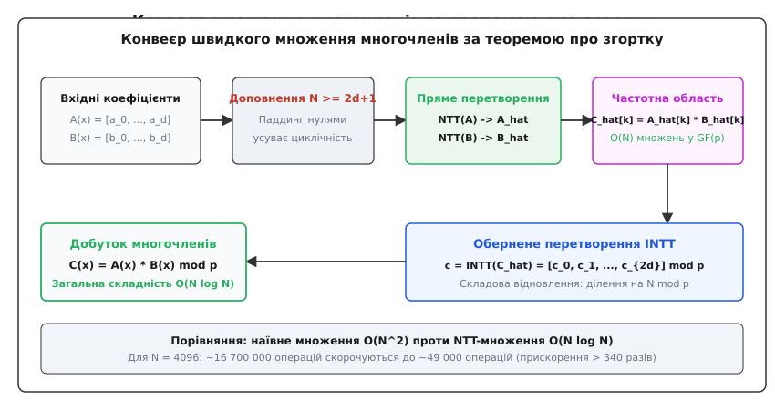
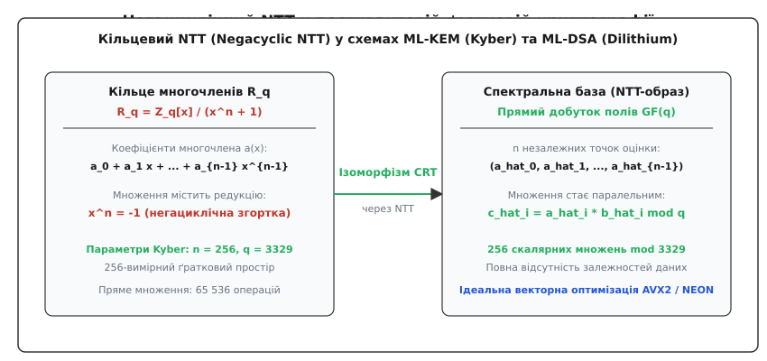

# Дискретне перетворення Фур'є над скінченними полями

<preknowlist>
- [Модульна арифметика](book:math/modular-arithmetic) — додавання, множення та обчислення оберненого елемента за модулем простого числа p.
- [Поліноми](book:math/polynomials) — операції над многочленами, множення за коефіцієнтами та оцінка значень у точках.
- [Дискретне перетворення Фур'є](book:math/dft) — розклад сигналу за комплексними експонентами та спектральний аналіз.
- [Первісні корені](book:math/primitive-root) — генератори мультиплікативної групи лишків та порядки елементів.
</preknowlist>

У сучасних криптографічних протоколах квантової епохи (міжнародні стандарти NIST ML-KEM та ML-DSA), системах повністю гомоморфного шифрування (CKKS, BGV, BFV) та децентралізованих доказах із нульовим розголошенням (ZK-SNARKs) базовою обчислювальною операцією є множення многочленів велетенських степенів — від кількох сотень до сотень тисяч і мільйонів коефіцієнтів. Якщо перемножувати два многочлени степеня `N - 1` класичним «шкільним» методом, перемножуючи кожен коефіцієнт першого на кожен коефіцієнт другого, алгоритм вимагає `N²` операцій. Для многочлена степеня `N = 4096` це понад 16.7 мільйонів операцій множення на кожен криптографічний крок, що робить системи захисту непридатними для роботи в реальному часі.

Класичне швидке перетворення Фур'є (FFT) над полем комплексних чисел `ℂ` вирішує задачу множення за квазілінійний час `O(N log N)`, перетворюючи коефіцієнти у значення на одиничному колі. Проте перенесення комплексного FFT у точну цілочисельну математику зазнає повного краху. Комплексні експоненти `e^(-i 2π k / n)` складаються з ірраціональних і трансцендентних тригонометричних значень `cos(2π k / n)` та `sin(2π k / n)`. Комп'ютерний процесор округлює їх до 53 бітів мантиси стандарту IEEE 754. Під час проходження `log₂ N` каскадів метеликів похибки округлення накопичуються. Коли в кінці обчислень дійсні дробові числа округлюються назад до цілих значень за модулем, накопичена похибка `10⁻¹²` призводить до спотворення навіть одного молодшого біта. У криптографії та модулярній арифметиці спотворення єдиного біта робить розшифрування повідомлення неможливим, а математичний доказ — недійсним.

Розв'язання цієї проблеми полягає у переході від комплексного неперервного аналізу до строгої модульної алгебри — **дискретного перетворення Фур'є над скінченними полями Галуа**, яке у світовій науковій літературі отримало назву **числове перетворення Фур'є** (Number Theoretic Transform, або **NTT**).

---

### Алгебраїчний стрибок: що насправді змушує працювати перетворення Фур'є

Щоб перенести перетворення Фур'є з поля комплексних чисел `ℂ` у скінченне поле `GF(p)`, необхідно зрозуміти його глибоку алгебраїчну природу. У класичному аналізі перетворення сприймають через геометрію коливань, частот і тригонометричних функцій на комплексному одиничному колі. Проте для математики ці фізичні образи є лише оболонкою.


*Зліва: комплексне ДПФ над полем ℂ опирається на неперервні тригонометричні експоненти, які неминуче накопичують похибку машинної арифметики з рухомою комою IEEE 754. Справа: числове перетворення Фур'є (NTT) над скінченним полем GF(17) використовує первісний корінь ω = 4, забезпечуючи суворо точну модульну арифметику з нульовою похибкою.*

Перетворення Фур'є працює завдяки чотирьом суто алгебраїчним властивостям носія:

1. **Існування первісного кореня з одиниці:** У множині чисел має існувати елемент `ω` порядку `n`, такий що його `n`-й степінь дорівнює одиниці (`ωⁿ = 1`), але жоден менший додатний степінь `ωᵏ` (де `0 < k < n`) одиниці не дорівнює.
2. **Оборотність розміру вибірки:** Кількість точок `n` повинна бути оборотною в цьому полі, тобто повинен існувати мультиплікативний обернений елемент `n⁻¹` (що еквівалентно умові взаємної простоти `gcd(n, p) = 1`).
3. **Ортогональність геометричної прогресії:** Сума степенів елемента `ωᵏ` за повним періодом повинна дорівнювати `n`, якщо показник `k` кратний `n`, і строго дорівнювати нулю в усіх інших випадках:
   ```
   ∑_{j=0}^{n-1} (ωᵏ)ʲ = { n,  якщо k ≡ 0 (mod n)
                          { 0,  якщо k ≢ 0 (mod n)
   ```
4. **Індексна редукція:** Степені елемента `ω` циклічно повторюються з періодом `n`: `ω^(k + n) = ω^k`.

Якщо скінченне поле `GF(p)` або кільце лишків `ℤ/mℤ` містить такий елемент `ω`, то перетворення Фур'є над цим полем будується з абсолютною математичною точністю. В ньому немає тригонометрії, немає наближень і немає дійсних чисел: кожен проміжний і фінальний результат є точним цілим числом у полі лишків.

#### Геометрична інтуїція ортогональності як інтерференції
Властивість ортогональності в скінченному полі є точним дискретним аналогом хвильової інтерференції:
- Коли ми аналізуємо гармоніку з частотою, що збігається з базисною (`k ≡ 0 mod n`), усі вектори степенів `(ω⁰)ʲ = 1` спрямовані в одну й ту саму точку поля. Відбувається **конструктивне підсилення**: сума `n` одиниць дає число `n`.
- Коли частоти не збігаються (`k ≢ 0 mod n`), елементи `(ω^k)ʲ` рівномірно розподіляються по вершинах правильного `n`-кутника на дискретному колі залишків. Відбувається **повна деструктивна інтерференція**: усі компоненти ідеально взаємно скорочуються, даючи в сумі строгий нуль.

Наприклад, у полі `GF(17)` для кореня `ω = 13` степеня `n = 4` при `k = 1` сума степенів дорівнює:
```
1 + 13 + 16 + 4 = 34 = 2 · 17 ≡ 0 (mod 17)
```
Чотири числа скінченного поля взаємно скомпенсували одне одного до строгого нуля.

Детальніше про те, як відмова від комплексних гармонік відкрила шлях до сучасних криптографічних структур, викладено у статті про [історію переходу від комплексного аналізу до теоретико-числових перетворень](book:math/dft-over-finite-fields/hist-ntt-origins.md).

---

### Два базиси многочлена: коефіцієнти проти значень у точках

Щоб усвідомити, чому перетворення Фур'є забезпечує фундаментальний виграш у швидкості, розглянемо два еквівалентні способи представлення довільного багаточлена `a(x)` степеня, меншого за `n`:

1. **Коефіцієнтне представлення (Coefficient Form):** Многочлен задається списком своїх коефіцієнтів `(a₀, a₁, ..., aₙ₋₁)`. 
   У цьому базисі операція додавання двох многочленів є лінійною і виконується за `O(n)` операцій (попарне додавання коефіцієнтів). Проте операція множення є згорткою: кожен коефіцієнт добутку `c_k = ∑ a_i · b_(k-i)` вимагає сумування попарних добутків, що призводить до квадратичної складності `O(n²)`.

2. **Точкове представлення (Point-Value Form):** За основною теоремою алгебри многочлен степеня менше `n` однозначно визначається своїми значеннями в будь-яких `n` різних точках `(x₀, a(x₀)), (x₁, a(x₁)), ..., (xₙ₋₁, a(xₙ₋₁))`.
   У точковому базисі множення двох многочленів стає тривіальним: якщо `C(x) = A(x) · B(x)`, то в кожній фіксованій точці `x_k` значення добутку дорівнює простому добутку чисел `C(x_k) = A(x_k) · B(x_k)`. Це вимагає лише **`n` незалежних скалярних множень**, тобто складність множення становить строго `O(n)`.

Проте виникає бар'єр обчислювальної складності: як швидко переходити між коефіцієнтним та точковим представленнями?
- Якщо обрати довільні `n` точок (наприклад, `1, 2, 3, ..., n`), обчислення значень многочлена за схемою Горнера вимагає `n` операцій на кожну точку, що в сумі дає `n · n = O(n²)`.
- Зворотний перехід за формулою інтерполяції Лагранжа також вимагає `O(n²)` операцій.

Геніальність перетворення Фур'є полягає у виборі точок обчислення. Якщо як точки `x_k` обрати не випадкові числа, а **степені первісного кореня з одиниці `ω^k`**, то завдяки алгебраїчним симетріям подвоєння та протилежного знака (`ω^(k + n/2) = -ω^k`) обчислення значень многочлена в усіх `n` точках одночасно виконується всього за `O(n log n)` операцій через деревоподібне об'єднання метеликів.

---

### Еволюція алгоритмів множення: від Карацуби до NTT

Розвиток швидкого множення в комп'ютерній алгебрі пройшов три визначні етапи, кожен із яких зменшував показник степеня складності:

1. **Алгоритм Карацуби (1960 рік):** Анатолій Карацуба помітив, що для многочленів степеня 1 `A(x) = a₁ x + a₀` та `B(x) = b₁ x + b₀` їхній добуток `C(x) = a₁ b₁ x² + (a₁ b₀ + a₀ b₁) x + a₀ b₀` можна обчислити лише за 3 множення замість 4, представивши середній коефіцієнт як `(a₀ + a₁) · (b₀ + b₁) - a₀ b₀ - a₁ b₁`. Це дало рекурентність `T(n) = 3 T(n/2)`, що відповідає складності `O(n^(log₂ 3)) ≈ O(n^{1.585})`.
2. **Алгоритм Тоома — Кука (Toom-Cook 3-way, 1963 рік):** Андрій Тоом узагальнив ідею Карацуби, розбиваючи многочлен на 3 блоки і обчислюючи його значення у 5 фіксованих точках `(0, 1, -1, 2, ∞)`. Рекурентність `T(n) = 5 T(n/3)` зменшила складність до `O(n^(log₃ 5)) ≈ O(n^{1.465})`.
3. **Числове перетворення Фур'є (NTT, 1971 рік):** Джон Поллад досяг теоретичної межі розбиття: замість оцінки у 3 чи 5 точках многочлен розбивається на `n = 2ᵏ` точок на циклічній групі коренів з одиниці. Складність досягає строгого квазілінійного оптимуму `O(n log n)`.

У 1971 році Арнольд Шьонхаге та Фолькер Штрассен застосували NTT за модулем чисел Ферма для створення першого надшвидкого алгоритму множення великих цілих чисел зі складністю `O(N log N log log N)`, а у 2019 році Девід Гарві та Йоріс ван дер Хувен довели існування алгоритму з асимптотикою строго `O(N log N)`.

---

### Означення числового перетворення Фур'є (NTT)

Нехай `GF(p)` — скінченне поле лишків за простим модулем `p`, і нехай у цьому полі існує первісний корінь з одиниці степеня `n`, який ми позначимо грецькою літерою `ω` (омега).

Нехай задано послідовність із `n` елементів поля `a = (a₀, a₁, a₂, ..., aₙ₋₁)`, яку можна розглядати як вектор коефіцієнтів многочлена:

```
a(x) = a₀ + a₁ x + a₂ x² + ... + aₙ₋₁ xⁿ⁻¹
```

> **Пряме числове перетворення Фур'є (Forward NTT)** перетворює вектор коефіцієнтів `a` у спектральний вектор значень `A = (A₀, A₁, A₂, ..., Aₙ₋₁)` за формулою:
> ```
> A_k = (∑_{j=0}^{n-1} a_j · ω^(j · k)) mod p,   для всіх k ∈ {0, 1, ..., n-1}
> ```

З алгебраїчної точки зору спектральний коефіцієнт `A_k` — це точне значення полінома `a(x)` в точці `x = ω^k`, тобто `A_k = a(ω^k) mod p`. Пряме NTT обчислює значення многочлена одночасно в усіх `n` степенях первісного кореня.

> **Обернене числове перетворення Фур'є (Inverse NTT / INTT)** відновлює початковий вектор коефіцієнтів `a` за його спектральними значеннями `A` за формулою:
> ```
> a_j = (n⁻¹ · ∑_{k=0}^{n-1} A_k · ω^(-j · k)) mod p,   для всіх j ∈ {0, 1, ..., n-1}
> ```
> де `n⁻¹` — мультиплікативний обернений елемент до числа `n` у полі `GF(p)` (тобто `(n · n⁻¹) mod p = 1`), а `ω⁻¹ = ωⁿ⁻¹ mod p` — обернений корінь з одиниці.

#### Доведення коректності оберненого перетворення
Доведемо, що застосування формули INTT до результату прямого перетворення `A` повертає точний вихідний коефіцієнт `a_r`:

Підставимо вираз для `A_k` у формулу оберненого перетворення для індексу `r`:
```
a'_r
= n⁻¹ · ∑_{k=0}^{n-1} (∑_{j=0}^{n-1} a_j · ω^(j · k)) · ω^(-r · k)   [підстановка прямого NTT]
= n⁻¹ · ∑_{j=0}^{n-1} a_j · (∑_{k=0}^{n-1} ω^(k · (j - r)))          [перестановка порядку сумування та зведення степенів]
```
Розглянемо внутрішню суму `S = ∑_{k=0}^{n-1} (ω^(j - r))^k`:
- Якщо `j = r`, то `j - r = 0`, степінь `ω⁰ = 1`, і сума дорівнює `∑_{k=0}^{n-1} 1 = n`.
- Якщо `j ≠ r`, то оскільки `0 ≤ j, r < n`, різниця `-(n - 1) ≤ j - r ≤ n - 1` не ділиться на `n`. За теоремою про ортогональність сума геометричної прогресії дорівнює `0`.

Підставимо значення суми:
```
a'_r
= n⁻¹ · (a_r · n + ∑_{j ≠ r} a_j · 0)   [виділення ненульового члена при j = r]
= n⁻¹ · (a_r · n)                       [множення на нуль решти доданків]
= (n⁻¹ · n) · a_r                       [асоціативність множення в полі]
= 1 · a_r                               [оскільки n⁻¹ · n ≡ 1 mod p]
= a_r                                   [тотожне відновлення]
```
Рівність є абсолютно строгою: початковий вектор коефіцієнтів відновлюється зі 100% точністю без жодних похибок.

---

### Алгебраїчні умови існування: які поля та розміри підходять

Не в кожному скінченному полі `GF(p)` можна виконати перетворення Фур'є довільної довжини `n`. 

Мультиплікативна група поля `GF(p)*` складається з `p - 1` елементів і є строго циклічною. За теоремою Лагранжа порядок будь-якого елемента ділить порядок групи. Звідси випливає фундаментальна умова існування `n`-точкового NTT:

```
n | (p - 1)   ⟺   (p - 1) mod n = 0
```

Якщо нам потрібне швидке перетворення за алгоритмом Кулі — Тьюкі з основою 2 (Radix-2), довжина перетворення має бути степенем двійки: `n = 2ᵏ`. Це означає, що просте число `p` повинно мати спеціальну структуру:

```
p ≡ 1 (mod 2ᵏ)   ⟺   p = c · 2ᵏ + 1
```

Такі прості числа називаються **NTT-дружніми простими числами** (NTT-friendly primes) або числами Прота.

#### Приклади криптографічних модулів у промислових стандартах:
- **Постквантовий захист CRYSTALS-Kyber (ML-KEM):** модуль `p = 3329 = 13 · 256 + 1 = 13 · 2⁸ + 1`. Число `3329 - 1 = 3328` ділиться на `256`, що дозволяє виконувати 256-точковий NTT для векторів ґратки. Первісним коренем генератора поля є `g = 17`, а первісним коренем степеня 256 є `ω = 17^(3328 / 256) = 17¹³ ≡ 383 (mod 3329)`.
- **Цифровий підпис CRYSTALS-Dilithium (ML-DSA):** модуль `p = 8380417 = 2²³ - 2¹³ + 1 = 2046 · 2¹² + 1`. Він підтримує перетворення довжиною до `n = 2²³ = 8 388 608`.
- **Докази з нульовим розголошенням Plonky2 (Polygon zkEVM):** модуль Голділокс (Goldilocks field) `p = 2⁶⁴ - 2³² + 1 = 2³² · (2³² - 1) + 1`. Цей модуль підтримує перетворення довжиною до `n = 2³²`, а редукція за ним виконується за кілька тактів за допомогою апаратних бітових зсувів.
- **Докази з нульовим розголошенням RISC Zero:** модуль BabyBear `p = 15 · 2²⁷ + 1 = 2013265921`. Число вміщується в 31 біт, що дозволяє виконувати додавання двох елементів без переповнення стандартного 32-бітового регістра.

#### Практичний приклад конструювання NTT-поля
Розглянемо, як на практиці конструюється первісний корінь для простого числа `p = 97 = 3 · 32 + 1 = 3 · 2⁵ + 1`:
1. Максимальна довжина перетворення степеня двійки дорівнює `n = 32`.
2. Порядок групи `p - 1 = 96 = 2⁵ · 3`. Простими дільниками є `2` та `3`.
3. Перевіримо кандидат у генератори `g = 5`:
   - `5^(96 / 2) = 5⁴⁸ ≡ -1 ≡ 96 ≢ 1 (mod 97)`;
   - `5^(96 / 3) = 5³² ≡ 35 ≢ 1 (mod 97)`.
   Оскільки жоден степінь не дорівнює 1, число `g = 5` є генератором поля `GF(97)`.
4. Для побудови 8-точкового NTT (`n = 8`) обчислюємо первісний корінь степеня 8:
   ```
   ω = 5^(96 / 8) mod 97 = 5¹² mod 97 = (5⁴)³ mod 97 = 625³ mod 97 = 43³ mod 97 = 64
   ```
   Перевіримо порядок елемента `ω = 64`: `64⁴ = 4096² ≡ 22² = 484 ≡ 96 ≡ -1 (mod 97)`, отже `64⁸ ≡ 1 (mod 97)`. Число `64` є точним первісним коренем степеня 8 у полі `GF(97)`.

#### Порівняльна таблиця алгебраїчних структур перетворення Фур'є

| Тип перетворення | Базове поле / кільце | Первісний корінь з одиниці | Характер точності | Тип згортки | Головне застосування |
| :--- | :--- | :--- | :--- | :--- | :--- |
| **Комплексне ДПФ** | `ℂ` (комплексні числа) | `e^(-i 2π / n)` | Наближена (IEEE 754) | Циклічна в `ℂ[x]/(xⁿ - 1)` | Обробка аудіо, радіолокація |
| **Числове NTT** | `GF(p)` (скінченне поле) | `g^((p-1)/n) mod p` | **Суворо точна (0 похибки)** | Циклічна в `GF(p)[x]/(xⁿ - 1)` | Множення многочленів, SNARKs |
| **Негациклічний NTT** | `GF(p)[x]/(xⁿ + 1)` | `ψ` (де `ψ² = ω`) | **Суворо точна** | Негациклічна в `R_q` | Ґраткова криптографія (Kyber) |
| **Перетворення Ферма** | `ℤ / (2^(2^t) + 1)ℤ` | `2` або `√2` | **Суворо точна (без множень)** | Циклічна в кільці Ферма | Множення довгих чисел |

Якщо в обраному простому полі `GF(p)` довжина `n` не ділить `p - 1`, перетворення будується в **полі розширення Галуа `GF(pᵐ)`**, де умова набуває вигляду `n | (pᵐ - 1)`.

Повні алгебраїчні доведення леми про скорочення степенів, розклад циклотомічних класів та ізоморфізм фактор-кілець розглянуто в теоретичній вставці про [первісні корені та алгебраїчні умови існування NTT](book:math/dft-over-finite-fields/math-ntt-foundations.md).

---

### Повний числовий приклад: обчислення прямого та оберненого NTT

Щоб наочно побачити роботу формул без прихованих абстракцій, виконаємо повний числовий розрахунок для невеликих параметрів.

**Вхідні параметри:**
- Просте поле: `GF(17)`, тобто `p = 17`.
- Порядок мультиплікативної групи: `p - 1 = 16`.
- Довжина перетворення: `n = 4` (оскільки 4 ділить 16).
- Знаходження первісного кореня: генератором групи `GF(17)*` є число `g = 3`. 
  Обчислимо первісний корінь степеня `n = 4`:
  ```
  ω = g^((p - 1) / n) mod p = 3^(16 / 4) mod 17 = 3⁴ mod 17 = 81 mod 17 = 13
  ```
  Перевіримо степені `ω = 13` у полі `GF(17)`:
  - `ω⁰ = 1`
  - `ω¹ = 13`
  - `ω² = 13² = 169 = 9 · 17 + 16 ≡ 16 ≡ -1 (mod 17)`
  - `ω³ = 13³ = 13 · 16 = 208 = 12 · 17 + 4 ≡ 4 (mod 17)`
  - `ω⁴ = 13⁴ = 16² = 256 = 15 · 17 + 1 ≡ 1 (mod 17)`
  Порядок елемента `13` дорівнює строго 4.

- Вхідний вектор коефіцієнтів полінома: `a = (3, 1, 4, 2)`, що відповідає многочлену `a(x) = 3 + 1x + 4x² + 2x³`.

#### Пряме перетворення: обчислення спектральних компонентів
Обчислимо кожен елемент спектра `A_k = ∑_{j=0}^{3} a_j · (ω^k)ʲ mod 17`:

1. **Компонент `k = 0` (постійна складова):** `ω⁰ = 1`:
   ```
   A₀ = (3·1⁰ + 1·1¹ + 4·1² + 2·1³) mod 17   [підстановка коефіцієнтів і степенів ω⁰ = 1]
      = (3·1 + 1·1 + 4·1 + 2·1) mod 17        [обчислення степенів одиниці]
      = (3 + 1 + 4 + 2) mod 17                [скалярне множення]
      = 10 mod 17 = 10                        [редукція за модулем 17]
   ```

2. **Компонент `k = 1`:** поворотний крок `ω¹ = 13`, степені `(1, 13, 16, 4)`:
   ```
   A₁ = (3·13⁰ + 1·13¹ + 4·13² + 2·13³) mod 17   [підстановка коефіцієнтів і степенів ω¹ = 13]
      = (3·1 + 1·13 + 4·16 + 2·4) mod 17          [обчислення степенів 13]
      = (3 + 13 + 64 + 8) mod 17                  [скалярне множення]
      = 88 mod 17 = 3                             [оскільки 88 = 5 · 17 + 3]
   ```

3. **Компонент `k = 2`:** поворотний крок `ω² = 16`, степені `(1, 16, 1, 16)`:
   ```
   A₂ = (3·16⁰ + 1·16¹ + 4·16² + 2·16³) mod 17   [підстановка коефіцієнтів і степенів ω² = 16]
      = (3·1 + 1·16 + 4·1 + 2·16) mod 17          [обчислення періодичних степенів 16]
      = (3 + 16 + 4 + 32) mod 17                  [скалярне множення]
      = 55 mod 17 = 4                             [оскільки 55 = 3 · 17 + 4]
   ```

4. **Компонент `k = 3`:** поворотний крок `ω³ = 4`, степені `(1, 4, 16, 13)`:
   ```
   A₃ = (3·4⁰ + 1·4¹ + 4·4² + 2·4³) mod 17   [підстановка коефіцієнтів і степенів ω³ = 4]
      = (3·1 + 1·4 + 4·16 + 2·13) mod 17      [обчислення степенів 4]
      = (3 + 4 + 64 + 26) mod 17              [скалярне множення]
      = 97 mod 17 = 12                        [оскільки 97 = 5 · 17 + 12]
   ```

Отримано спектральний образ: **`A = (10, 3, 4, 12)`**.

#### Обернене перетворення: покрокове відновлення сигналу
Для відновлення обчислимо константи:
- Обернене число точок: `n⁻¹ = 4⁻¹ mod 17 = 13`, оскільки `4 · 13 = 52 = 3 · 17 + 1 ≡ 1 (mod 17)`.
- Обернений первісний корінь: `ω⁻¹ = 13⁻¹ mod 17 = 4`, оскільки `13 · 4 = 52 ≡ 1 (mod 17)`.
- Степені `ω⁻¹ = 4`: `4⁰ = 1`, `4¹ = 4`, `4² = 16`, `4³ = 13`.

Застосуємо формулу INTT `a_j = 13 · (∑_{k=0}^{3} A_k · (4^j)ᵏ) mod 17`:

1. **Відновлення `a₀`:**
   ```
   сума = (10·1 + 3·1 + 4·1 + 12·1) = 29 ≡ 12 (mod 17)
   a₀   = (13 · 12) mod 17 = 156 mod 17 = 3   [оскільки 156 = 9 · 17 + 3]
   ```
2. **Відновлення `a₁`:**
   ```
   сума = (10·1 + 3·4 + 4·16 + 12·13) = (10 + 12 + 64 + 156) = 242 ≡ 4 (mod 17)
   a₁   = (13 · 4) mod 17 = 52 mod 17 = 1     [оскільки 52 = 3 · 17 + 1]
   ```
3. **Відновлення `a₂`:**
   ```
   сума = (10·1 + 3·16 + 4·1 + 12·16) = (10 + 48 + 4 + 192) = 254 ≡ 16 (mod 17)
   a₂   = (13 · 16) mod 17 = 208 mod 17 = 4   [оскільки 208 = 12 · 17 + 4]
   ```
4. **Відновлення `a₃`:**
   ```
   сума = (10·1 + 3·13 + 4·16 + 12·4) = (10 + 39 + 64 + 48) = 161 ≡ 8 (mod 17)
   a₃   = (13 · 8) mod 17 = 104 mod 17 = 2    [оскільки 104 = 6 · 17 + 2]
   ```

Отримано відновлений вектор: **`a = (3, 1, 4, 2)`**. Результат повністю збігається з вихідним без жодної втрати точності.

---

### Повний числовий приклад: множення многочленів через NTT

Розглянемо практичну задачу множення двох многочленів першого степеня в полі `GF(17)`:
```
A(x) = 2 + 3x,    B(x) = 1 + 4x
```
Звичайний алгебраїчний добуток поліномів:
```
C(x) = A(x) · B(x) = (2 + 3x) · (1 + 4x) = 2 + 8x + 3x + 12x² = 2 + 11x + 12x²
```
Степінь добутку дорівнює `d_C = 1 + 1 = 2`. Кількість ненульових коефіцієнтів дорівнює 3.

#### Крок 1. Доповнення нулями (Zero-Padding) до степеня двійки `n = 4`
Формуємо 4-елементні вектори коефіцієнтів:
```
a = (2, 3, 0, 0),    b = (1, 4, 0, 0)
```

#### Крок 2. Прямий NTT від вектора `a`
Використовуємо первісний корінь `ω = 13` у полі `GF(17)`:
- `A₀ = (2·1 + 3·1) mod 17 = 5`
- `A₁ = (2·1 + 3·13) mod 17 = (2 + 39) mod 17 = 41 mod 17 = 7`
- `A₂ = (2·1 + 3·16) mod 17 = (2 + 48) mod 17 = 50 mod 17 = 16`
- `A₃ = (2·1 + 3·4) mod 17 = (2 + 12) mod 17 = 14`
Отримано спектр: `A_hat = (5, 7, 16, 14)`.

#### Крок 3. Прямий NTT від вектора `b`
- `B₀ = (1·1 + 4·1) mod 17 = 5`
- `B₁ = (1·1 + 4·13) mod 17 = (1 + 52) mod 17 = 53 mod 17 = 2`
- `B₂ = (1·1 + 4·16) mod 17 = (1 + 64) mod 17 = 65 mod 17 = 14`
- `B₃ = (1·1 + 4·4) mod 17 = (1 + 16) mod 17 = 17 mod 17 = 0`
Отримано спектр: `B_hat = (5, 2, 14, 0)`.

#### Крок 4. Поточкове спектральне множення `C_hat[k] = A_hat[k] · B_hat[k] mod 17`
- `C₀ = (5 · 5) mod 17 = 25 mod 17 = 8`
- `C₁ = (7 · 2) mod 17 = 14 mod 17 = 14`
- `C₂ = (16 · 14) mod 17 = ((-1) · (-3)) mod 17 = 3`
- `C₃ = (14 · 0) mod 17 = 0`
Отримано спектральний добуток: `C_hat = (8, 14, 3, 0)`.

#### Крок 5. Обернений INTT від `C_hat`
Множимо на `n⁻¹ = 13` зі степенями `ω⁻¹ = 4`: `(1, 4, 16, 13)`:
- `c₀ = 13 · (8·1 + 14·1 + 3·1 + 0·1) mod 17 = 13 · 25 mod 17 = 13 · 8 mod 17 = 104 mod 17 = 2`
- `c₁ = 13 · (8·1 + 14·4 + 3·16 + 0·13) mod 17 = 13 · (8 + 56 + 48) mod 17 = 13 · 112 mod 17 = 13 · 10 mod 17 = 130 mod 17 = 11`
- `c₂ = 13 · (8·1 + 14·16 + 3·1 + 0·16) mod 17 = 13 · (8 + 224 + 3) mod 17 = 13 · 235 mod 17 = 13 · 14 mod 17 = 182 mod 17 = 12`
- `c₃ = 13 · (8·1 + 14·13 + 3·16 + 0·4) mod 17 = 13 · (8 + 182 + 48) mod 17 = 13 · 238 mod 17 = 13 · 0 mod 17 = 0`

Отримано результуючий вектор коефіцієнтів: **`c = (2, 11, 12, 0)`**, що відповідає многочлену:
```
C(x) = 2 + 11x + 12x²
```
Многочлен повністю збігається з прямим алгебраїчним розкриттям дужок.

---

### Швидкий алгоритм: адаптація метеликів Кулі — Тьюкі

Пряме обчислення NTT за означенням вимагає `n²` модульних множень. Проте завдяки алгебраїчним властивостям коренів з одиниці деревоподібний алгоритм Кулі — Тьюкі зменшує кількість операцій до `(n / 2) log₂ n`.


*Зліва: метелик DIT (проріджування за часом), у якому множення на поворотний коефіцієнт виконується перед додаванням. Справа: метелик DIF (проріджування за частотою), у якому множення виконується після віднімання. Поєднання DIF на прямому проході та DIT на оберненому усуває необхідність перестановки бітів.*

Алгоритм базується на розбитті задачі розміру `n` на дві незалежні підзадачі розміру `n / 2`:

#### 1. Метелик DIT (Decimation-in-Time, проріджування за часом)
Вхідний поліном `a(x)` розбивається на парні коефіцієнти `a_even(y)` та непарні `a_odd(y)`:
```
a(x) = a_even(x²) + x · a_odd(x²)
```
Тоді для кожної пари спектральних точок `k` та `k + n/2` обчислення виконуються через один спільний **метелик DIT**:
```
A_k         = (E_k + ω^k · O_k) mod p
A_(k + n/2) = (E_k - ω^k · O_k) mod p
```
де `E_k` та `O_k` — спектральні значення парної та непарної частин половинного розміру. 

#### 2. Метелик DIF (Decimation-in-Frequency, проріджування за частотою)
У підході Джентльмена — Сенде вектор розбивається на першу та другу половини. Формули метелика DIF мають вигляд:
```
u = a[j],    v = a[j + n/2]
a[j]         = (u + v) mod p
a[j + n/2]   = ((u - v) · ω^k) mod p
```

В інженерних реалізаціях застосовують бездоганну комбінацію: прямий NTT виконується через метелик DIF (приймає природний порядок, віддає інверсно-бітовий), а обернений INTT — через метелик DIT (приймає інверсно-бітовий, повертає природний). Завдяки цьому **дорога перестановка бітів у пам'яті повністю зникає з алгоритму**.

Загальна кількість арифметичних операцій для `n`-точкового перетворення складає рівно `(n / 2) log₂ n` операцій модульного множення на поворотні коефіцієнти та `n log₂ n` операцій модульного додавання і віднімання. Для `n = 4096` замість 16.7 мільйонів операцій алгоритм виконує лише `24576` множень у скінченному полі — прискорення становить понад 680 разів.

Крім того, при використанні метеликів вищого порядку (наприклад, **Radix-4 метеликів**, де задача розбивається не на 2, а на 4 підмасиви) кількість важких операцій множення на поворотні коефіцієнти зменшується ще на 25%, оскільки множення на тривіальні корені четвертого степеня `(1, ω^(n/4) = i, -1, -i)` зводиться до тривіальних операцій перестановки та зміни знака без використання апаратного помножувача.

---

### Множення многочленів та теорема про згортку

Головне призначення NTT у комп'ютерній алгебрі — обчислення добутку двох многочленів `C(x) = A(x) · B(x) mod p`.


*Повний обчислювальний конвеєр: доповнення вхідних многочленів нулями до розміру N >= 2d + 1, пряме числове перетворення NTT, лінійне поточкове множення спектральних коефіцієнтів у полі GF(p) та обернене перетворення INTT для отримання точного добутку за O(N log N) операцій.*

#### Теорема про згортку
Якщо `C(x) = A(x) · B(x) mod (xⁿ - 1)` — циклічна згортка коефіцієнтів, то її спектральний образ NTT дорівнює поелементному добутку образів многочленів-множників:

```
NTT(a ⊛ b) = NTT(a) ⊙ NTT(b)
```

де `(NTT(a) ⊙ NTT(b))_k = (A_k · B_k) mod p`.

#### Лінійна згортка та доповнення нулями (Zero-Padding)
Звичайне алгебраїчне множення многочленів степеня `d_A` та `d_B` дає многочлен степеня `d_C = d_A + d_B`, що містить `d_A + d_B + 1` коефіцієнтів. 

Оскільки NTT за модулем `(xⁿ - 1)` обчислює циклічну згортку (де старші коефіцієнти зі степенями `≥ n` згортаються й додаються до молодших через тотожність `xⁿ ≡ 1`), розмір перетворення `n` обирають більшим за сумарний степінь:

```
n ≥ d_A + d_B + 1
```

Якщо не виконати доповнення нулями, виникає ефект **циклічного накладання (Aliasing)**. Наприклад, якщо перемножити многочлени `A(x) = 2 + 3x` та `B(x) = 1 + 4x` без паддингу при `n = 2`, отримаємо:
```
(2 + 3x) · (1 + 4x) = 2 + 11x + 12x²
```
При редукції за модулем `x² - 1` коефіцієнт `12x²` перетворюється на `12 · 1 = 12`, і результат стає `(2 + 12) + 11x = 14 + 11x mod (x² - 1)`. Вільний член виявився спотвореним через циклічне загортання. Доповнення нулями до `n = 4` гарантує, що всі степені залишаються строго меншими за `n`, і лінійна згортка повністю збігається з циклічною.

#### Негациклічне перетворення (Twisted NTT) у ґратковій криптографії
У постквантовій криптографії (Kyber, Dilithium) многочлени множаться не за модулем `xⁿ - 1`, а за модулем **`xⁿ + 1`** у кільці `R_q = GF(q)[x] / (xⁿ + 1)`.


*Негациклічне перетворення перетворює операцію множення поліномів у кільці R_q = Z_q[x]/(xⁿ + 1) на паралельне поточкове множення n скалярів у полі GF(q) за рахунок ізоморфізму Китайської теореми про залишки та зважування коефіцієнтів степенями кореня ψ.*

Для множення за модулем `xⁿ + 1` подвоєння довжини масиву нулями не потрібне. Застосовують **зважене негациклічне перетворення (Twisted NTT)**:
1. Знаходять корінь `ψ` степеня `2n`, для якого `ψ² = ω` та `ψⁿ ≡ -1 (mod p)`.
2. Коефіцієнти вхідних многочленів зважують степенями: `a'_j = a_j · ψʲ mod p`.
3. Виконують стандартний `n`-точковий NTT, перемножують спектри й виконують INTT.
4. Знімають зважування: `c_j = c'_j · ψ⁻ʲ mod p`.

Отриманий результат є строгим добутком у поліноміальному кільці `R_q`. Завдяки цьому розмір перетворення в криптографії залишається компактним (`n = 256`), забезпечуючи максимальну швидкість шифрування.

---

### Парадигма зберігання в частотній області та матричні операції

У криптографічних застосунках на алгебраїчних ґратках (наприклад, у схемі інкапсуляції ключів ML-KEM) множення многочленів організоване у вигляді множення матриці поліномів `A` розміру `k × k` на вектор поліномів `s` розміру `k × 1`:

```
b = A · s + e
```

де кожен елемент матриці `A_{i,j}(x)` та векторів `s_j(x)` є многочленом степеня `255` у кільці `R_q = GF(3329)[x] / (x²⁵⁶ + 1)`.

Наївне виконання матрично-векторного множення в часовій області вимагало б `k²` операцій множення многочленів. Якщо кожне множення виконувати за схемою «NTT ⟶ поточкове множення ⟶ INTT», для рангу ґратки `k = 4` (рівень безпеки Kyber-1024) знадобилося б:
- `4 · 4 = 16` прямих перетворень для елементів матриці `A`;
- `4` прямих перетворення для вектора `s`;
- `16` поточкових множень у спектральному базисі;
- `16` обернених перетворень INTT для кожного добутку;
- Разом: **36 повних викликів NTT/INTT**.

Натомість застосовується **парадигма обчислень у спектральному домені (NTT-Domain)**:
1. Елементи публічної матриці `A` генеруються з короткого випадкового сіда (seed) за допомогою криптографічної геш-функції SHAKE-128 **одразу в спектральному базисі NTT**. Вони взагалі не потребують прямого перетворення.
2. Вектор секрету `s` перетворюється в NTT лише **один раз** (4 прямих перетворення).
3. Усі `16` поліноміальних множень виконуються як поточкові векторні множення у спектральній області, після чого коефіцієнти попарно додаються прямо в спектрі:
   ```
   B_hat_i = ∑_{j=1}^{k} (A_hat_{i,j} ⊙ s_hat_j) mod q
   ```
4. Обернене перетворення INTT викликається **рівно один раз для кожного з `k` компонентів результуючого вектора** (4 обернених перетворення).

У результаті кількість викликів перетворення скорочується з **36 до 8** (прискорення у **4.5 раза**). Це демонструє, що перетворення Фур'є над скінченними полями є не просто разовим алгоритмом множення, а повноцінним альтернативним базисом для представлення криптографічних даних.

---

### Практичне втілення: редукція Монтгомері та SIMD-прискорення

Найбільшою перешкодою для досягнення пікової швидкодії NTT є апаратне ділення за модулем `%`. На процесорах x86_64 інструкція `div` виконується за 30–90 тактів.

У високопродуктивних криптографічних бібліотеках ділення повністю замінюють **арифметикою Монтгомері**:
- Числа зберігаються у формі Монтгомері `x_mont = (x · 2³²) mod p`.
- Множення `mont_mul(a, b)` виконується виключно за допомогою цілочисельних множень, порозрядних операцій `AND` та бітових зсувів управо `>> 32` без жодного ділення.
- Усі поворотні коефіцієнти в таблиці попередньо конвертуються у форму Монтгомері `ω_mont^k = (ω^k · 2³²) mod p`. Під час виконання метелика функція `mont_mul(diff, ω_mont^k)` обчислює `(diff · ω_mont^k · 2⁻³²) mod p = (diff · ω^k) mod p`, що автоматично повертає результат у потрібному числовому просторі без жодних додаткових перетворень.
- Додатково застосовують **ліниву редукцію Гарві**: проміжні значення у метеликах не приводяться до `[0, p)` на кожному кроці, а залишаються в діапазоні `[0, 2p)`, що усуває половину операцій віднімання модуля.

Крім того, у криптографії критично важливим є **захист від атак сторонніми каналами за часом виконання (Constant-Time execution)**. Умовні розгалуження `if (x >= p)` повністю замінюються арифметичними бітовими масками:

:::tabs
```c
/* Безрозгалужене умовне віднімання модуля: constant-time */
static inline uint32_t csub_p(uint32_t x, uint32_t p) {
    int32_t diff = (int32_t)(x - p);
    int32_t mask = diff >> 31;
    return x - (p & ~mask);
}
```
```cpp
// Безрозгалужене умовне віднімання модуля в C++20
constexpr uint32_t csub_p(uint32_t x, uint32_t p) noexcept {
    const auto diff = static_cast<int32_t>(x - p);
    const auto mask = diff >> 31;
    return x - (p & ~mask);
}
```
:::

На сучасних мікропроцесорах із підтримкою векторних розширень **AVX2** та **ARM NEON** обчислення метеликів паралелізується: 256-бітовий регістр обробляє одночасно **8 коефіцієнтів** многочлена за один машинний такт.

Повний вихідний код оптимізованого множника многочленів мовами C та C++, структура векторних метеликів AVX2 та заміри продуктивності детально розібрані в практичній вставці про [високопродуктивну реалізацію множника многочленів із редукцією Монтгомері та SIMD](book:math/dft-over-finite-fields/proj-fast-ntt-multiplier.md).

---

### Де це працює в сучасних технологіях

Сьогодні числове перетворення Фур'є над скінченними полями є критично важливою технологією світової цифрової інфраструктури:

1. **Постквантова криптографія (Post-Quantum Cryptography):** 
   У 2024 році NIST опублікував фінальні стандарти FIPS 203 (ML-KEM / Kyber) та FIPS 204 (ML-DSA / Dilithium). Вони лягли в основу захисту нового покоління протоколів TLS 1.3 у браузерах Google Chrome, Cloudflare та операційних системах Apple/Linux. Швидкість їхньої роботи повністю забезпечується 256-точковим NTT над полем `GF(3329)`.
2. **Повністю гомоморфне шифрування (Fully Homomorphic Encryption, FHE):**
   Схеми CKKS та BGV дозволяють хмарним серверам навчати нейронні мережі та аналізувати конфіденційні медичні бази даних без їх розшифрування. Розмір многочленів у FHE сягає `N = 65536`, і NTT є єдиним способом виконати їх множення за прийнятний час.
3. **Системи доведення з нульовим розголошенням (ZK-SNARKs / zk-STARKs):**
   У децентралізованих мережах (Ethereum zk-Rollups, Mina Protocol, Filecoin) масштабування досягається за рахунок поліноміальних зобов'язань (KZG, FRI). Мільйони рядків коду програм компілюються в многочлени степеня до `2²⁴`, а їх оцінка на домені коренів із одиниці здійснюється через NTT.
4. **Теорія завадостійкого кодування (Error-Correcting Codes):**
   Коди Ріда — Соломона, які захищають дані на SSD-накопичувачах, супутникових каналах зв'язку DVB-S2 та QR-кодах, використовують алгоритми швидкого спектрального декодування синдромів помилок за допомогою NTT над двійковими розширеннями Галуа `GF(2ᵐ)`.

---

### Висновки: алгебраїчна єдність Фур'є-аналізу

Числове перетворення Фур'є над скінченними полями демонструє глибинну єдність математики. Те, що понад два століття вважалося інструментом виключно неперервної фізики, хвиль і диференціальних рівнянь, виявилося універсальним алгебраїчним законом теорії представлень циклічних груп. 

Замінивши комплексне поле `ℂ` на дискретне скінченне поле `GF(p)`, математика отримала бездоганний обчислювальний механізм: суворо точний, вільний від похибок машинної арифметики та оптимізований під кремнієву архітектуру сучасних процесорів.
