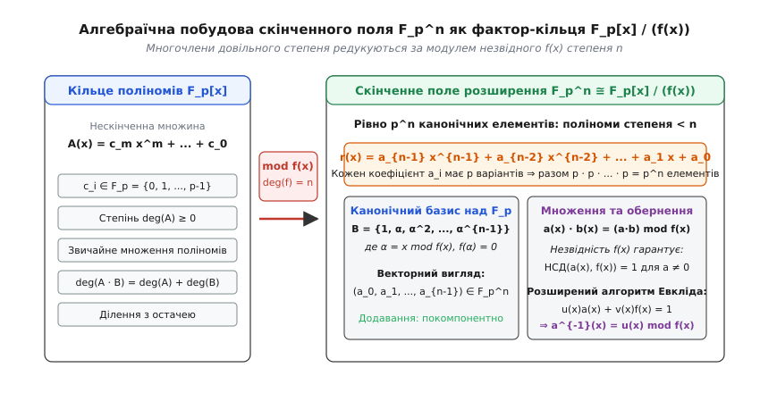
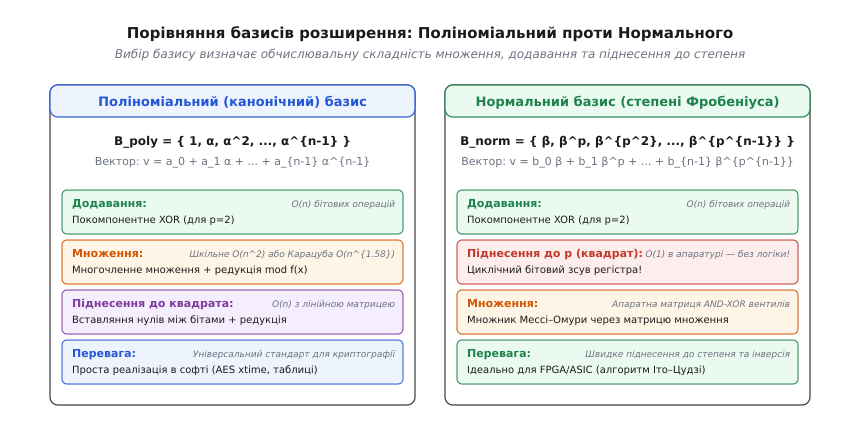
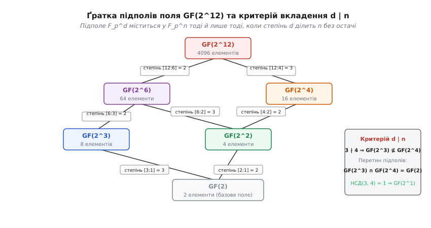
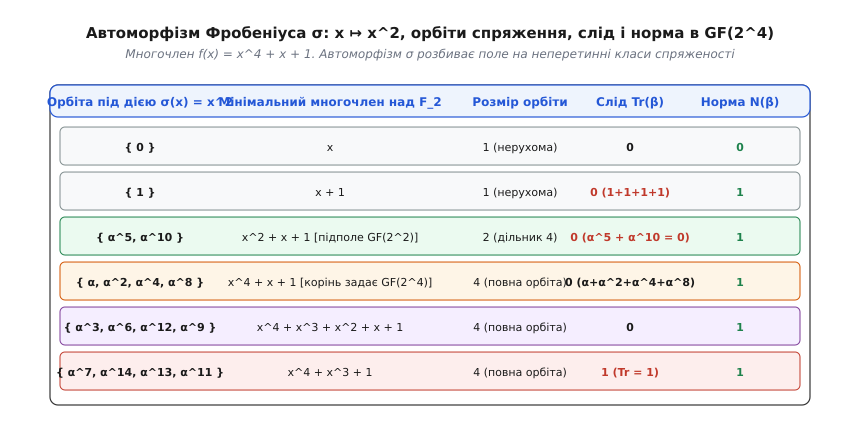

# Розширення скінченних полів

<preknowlist>
* [Модульна арифметика](topic:math/modular-arithmetic)
* [Векторні простори та базиси](topic:math/vector-space)
* [Многочлени та їх подільність](topic:math/polynomials)
* [Непривідні многочлени](topic:math/irreducible-polynomials)
* [Автоморфізм Фробеніуса](topic:math/frobenius-automorphism)
* [Група Ґалуа](topic:math/galois-group)
</preknowlist>

Комп'ютер оперує фіксованими блоками бітів — байтами з 256 можливими станами (`2^8`), 16-бітними словами (`2^{16}`) чи 32-бітними регістрами (`2^{32}`). Якщо спробувати побудувати на множині з 256 чисел повноцінну алгебраїчну систему за допомогою звичайної модульної арифметики `ℤ/256ℤ`, ділення виявляється неможливим: число 2 ділить 256, тому добуток двох парних чисел може дати нуль за модулем 256 (`2 · 128 = 256 ≡ 0 mod 256`). У кільці `ℤ/256ℤ` існують дільники нуля, а отже, жодне парне число не має мультиплікативного оберненого. 

Якщо ж для забезпечення оборотності взяти просте число 257 і побудувати просте поле залишків `F_{257} = ℤ/257ℤ`, елементи перестають вміщатися у 8 бітів: число 256 потребує дев'ятого біта, що руйнує природну байтову архітектуру пам'яті та процесорних регістрів.

Розв'язанням цієї фундаментальної суперечності між двійковою структурою даних та вимогами алгебри є **розширення скінченних полів** (англ. *finite field extensions*, або поля Ґалуа, лат. *campus*, нім. *Körper*, на честь Евариста Ґалуа, фр. *Évariste Galois*). Алгебра розширень дозволяє побудувати строго замкнене поле, яке містить рівно `2^n` (або загалом `p^n` для будь-якого простого `p`) елементів, де кожен ненульовий елемент має мультиплікативний обернений, а додавання та множення підпорядковуються всім аксіомам поля без жодних переповнень і прогалин.

Історичний шлях від перших здогадок Евариста Ґалуа та неопублікованих рукописів Карла Гаусса до сучасної класифікації Еліакіма Мура викладено у вставці [📜 Від уявних коренів Галуа до полів класифікації Мура](topic:math/finite-field-extensions/hist-galois-finite-fields.md).

---

## 1. Алгебраїчна конструкція: фактор-кільце многочленів

Щоб побудувати поле з `p^n` елементів, де `p` — просте число (характеристика поля), а `n ≥ 1` — натуральний степінь розширення, звичайної арифметики цілих чисел недостатньо. Замість чисел базовим будівельним матеріалом стають многочлени (поліноми, від грец. *polys* — численний, *nomos* — частка).

Розглянемо кільце многочленів `F_p[x]`, коефіцієнти яких належать базовому простому полю `F_p = ℤ/pℤ`:

```
A(x) = c_m x^m + c_{m-1} x^{m-1} + ... + c_1 x + c_0,   де c_i ∈ {0, 1, ..., p - 1}
```

У кільці `F_p[x]` визначено операції додавання та множення многочленів, причому коефіцієнти при однакових степенях змінної додаються і множаться за модулем `p`. Кільце `F_p[x]` є нескінченним, оскільки степінь `m` може бути як завгодно великим.

Для переходу до скінченної структури обирається фіксований **незвідний многочлен** (лат. *irreducibilis*) `f(x) ∈ F_p[x]` степеня `n`. Незвідність означає, що `f(x)` неможливо розкласти у добуток двох многочленів менших степенів над полем `F_p` — у кільці поліномів він відіграє таку саму неподільну роль, як просте число в кільці цілих чисел.

Многочлен `f(x)` породжує головний ідеал `(f(x))`. Два многочлени `A(x)` та `B(x)` вважаються конгруентними (конгруентність, від лат. *congruens* — відповідний) за модулем `f(x)`, якщо їхня різниця ділиться на `f(x)` без остачі:

```
A(x) ≡ B(x) (mod f(x)) ⇔ f(x) | (A(x) - B(x))
```

Фактор-кільце (від лат. *quotiens* — скільки разів) `F_p[x] / (f(x))` складається з усіх класів еквівалентності многочленів за цим відношенням.


*Побудова поля F_{p^n} як фактор-кільця поліномів F_p[x] за модулем незвідного f(x) степеня n*

Завдяки алгоритму ділення многочленів з остачею будь-який многочлен `A(x) ∈ F_p[x]` можна однозначно подати у вигляді:

```
A(x) = Q(x) · f(x) + r(x)
```

де степінь остачі `deg(r) < deg(f) = n` (або `r(x) = 0`). Тому кожен клас еквівалентності містить рівно одного канонічного представника — многочлен степеня, строго меншого за `n`:

```
r(x) = a_{n-1} x^{n-1} + a_{n-2} x^{n-2} + ... + a_1 x + a_0,   де a_i ∈ F_p
```

Оскільки кожен із `n` коефіцієнтів `a_i` обирається незалежно з множини `F_p` розміру `p`, загальна кількість таких канонічних поліномів дорівнює:

```
|F_p[x] / (f(x))| = p · p · ... · p = p^n
```

### Чому незвідність гарантує оборотність

Фактор-кільце `F_p[x] / (f(x))` є полем тоді й лише тоді, коли многочлен `f(x)` є незвідним.

Якщо многочлен `f(x)` незвідний, то для будь-якого ненульового елемента `a(x)` степеня `< n` найбільший спільний дільник `НСД(a(x), f(x)) = 1`. За розширеним алгоритмом Евкліда для поліномів над полем існують такі многочлени `u(x)` та `v(x)`, що виконується лінійна тотожність Безу:

```
u(x) · a(x) + v(x) · f(x) = 1
```

Взявши обидві частини за модулем `f(x)`, отримуємо:

```
u(x) · a(x) ≡ 1 (mod f(x))
```

Многочлен `u(x) mod f(x)` є шуканим мультиплікативним оберненим елементом `a^{-1}(x)`. Оскільки кожен ненульовий елемент має обернений, фактор-кільце є комутативним тілом, тобто полем. Строге математичне доведення цього твердження наведено у вставці [🧮 Алгебраїчна теорія розширень](topic:math/finite-field-extensions/math-galois-trace-norm.md).

---

## 2. Підрахунок незвідних многочленів: формула Гаусса

Природно виникає питання: чи завжди для будь-якої характеристики `p` і будь-якого степеня `n` існує хоча б один незвідний многочлен степеня `n`, і скільки їх усього існує?

Відповідь дає формула Карла Фрідріха Гаусса, яка пов'язує кількість унітарних (монічних, зі старшим коефіцієнтом 1) незвідних многочленів `N_p(n)` з функцією Мьобіуса `μ(d)`:

```
N_p(n) = (1/n) · ∑_{d | n} μ(n/d) · p^d
```

Функція Мьобіуса `μ(k)` дорівнює `1`, якщо `k = 1`; `0`, якщо `k` ділиться на квадрат будь-якого простого числа; та `(-1)^r`, якщо `k` є добутком `r` різних простих чисел.

### Приклад підрахунку для p = 2 та n = 4

Знайдемо кількість незвідних многочленів 4-го степеня над полем `F_2`. Дільниками числа 4 є `{1, 2, 4}`:

```
N_2(4)
= (1/4) · [ μ(4/1) · 2^1 + μ(4/2) · 2^2 + μ(4/4) · 2^4 ]
= (1/4) · [ μ(4) · 2 + μ(2) · 4 + μ(1) · 16 ]             [підстановка значень дільників]
= (1/4) · [ 0 · 2 + (-1) · 4 + 1 · 16 ]                   [значення функції Мьобіуса: μ(4)=0, μ(2)=-1, μ(1)=1]
= (1/4) · [ -4 + 16 ]                                     [арифметика]
= (1/4) · 12
= 3                                                       [рівно три незвідні многочлени]
```

Ці три унітарні незвідні многочлени 4-го степеня над `F_2`:
1. `f_1(x) = x^4 + x + 1` (первісний, генерує мультиплікативну групу порядку 15);
2. `f_2(x) = x^4 + x^3 + 1` (первісний, дуальний до першого);
3. `f_3(x) = x^4 + x^3 + x^2 + x + 1` (незвідний, але не первісний: його корені мають порядок 5, оскільки він ділить `x^5 - 1`).

Будь-який із цих трьох многочленів можна взяти для побудови поля `GF(2^4)`, і всі три отримані поля будуть ізоморфними між собою.

---

## 3. Векторна структура та базиси розширення

Скінченне поле розширення `K = F_{p^n}` містить базове просте поле `F_p` як своє підполе (коефіцієнти нульового степеня `a_0 ∈ F_p`). Тому поле `K` можна розглядати як векторний простір над полем скалярів `F_p`.

Вимір цього векторного простору, який позначається через `[K : F_p]`, дорівнює степеню незвідного многочлена `n`. Додавання елементів поля повністю збігається з покомпонентним додаванням векторів, а множення на елемент із `F_p` — зі скалярним множенням.

Будь-який елемент `α ∈ F_{p^n}` однозначно задається набором координат `(c_0, c_1, ..., c_{n-1})` відносно обраного базису (від грец. *basis* — основа, підніжжя). В інженерній практиці застосовують два принципово різні типи базисів: поліноміальний та нормальний.


*Порівняння поліноміального та нормального базисів: циклічний зсув у нормальному базисі реалізує піднесення до степеня p*

### Поліноміальний (канонічний) базис

Якщо `α` є коренем незвідного многочлена `f(x)` (тобто `f(α) = 0`), то степені цього кореня утворюють канонічний поліноміальний базис:

```
B_{poly} = { 1, α, α^2, α^3, ..., α^{n-1} }
```

Будь-який елемент поля записується як:

```
v = c_0 · 1 + c_1 · α + c_2 · α^2 + ... + c_{n-1} · α^{n-1}
```

**Особливості поліноміального базису:**
1. **Додавання:** для характеристики `p = 2` додавання векторів координат зводиться до побітового XOR, що виконується за одну процесорну операцію.
2. **Множення:** обчислюється як звичайне множення поліномів зі зсувом і подальшою редукцією за модулем `f(x)`. У софті воно реалізується алгоритмом `xtime` або за допомогою таблиць експонент і логарифмів.
3. **Застосування:** є стандартом де-факто для програмних реалізацій криптографічних алгоритмів (AES, коди Ріда — Соломона, хеш-функція GHASH в режимі шифрування AES-GCM).

### Нормальний базис

Нормальний базис утворюється степенями Фробеніуса одного спеціально підібраного нормального елемента `β ∈ F_{p^n}`:

```
B_{norm} = { β, β^p, β^{p^2}, β^{p^3}, ..., β^{p^{n-1}} }
```

Теорема про нормальний базис стверджує, що такий елемент `β` існує для будь-якого розширення скінченного поля.

**Головна перевага нормального базису в апаратурі:**  
Піднесення елемента `v = ∑_{i=0}^{n-1} b_i β^{p^i}` до степеня `p` (у характеристиці 2 — звичайне піднесення до квадрата) перетворюється на циклічний зсув бітів вектора коефіцієнтів:

```
v^p
= (∑_{i=0}^{n-1} b_i β^{p^i})^p                                   [лінійність Фробеніуса]
= ∑_{i=0}^{n-1} b_i (β^{p^i})^p                                   [оскільки b_i^p = b_i для b_i ∈ F_p]
= ∑_{i=0}^{n-1} b_i β^{p^{i+1}}                                   [властивість степеня]
= b_{n-1} β + b_0 β^p + b_1 β^{p^2} + ... + b_{n-2} β^{p^{n-1}}   [оскільки β^{p^n} = β]
```

В апаратних мікросхемах (FPGA та ASIC) циклічний зсув не потребує логічних вентилів — він реалізується простим перехресним з'єднанням дротів між регістрами, виконуючись за 0 тактів логічної затримки. 

### Оптимальні нормальні базиси (ONB)

Множення в нормальному базисі вимагає обчислення координат добутку через спеціальну бінарну матрицю множення `M` розміру `n × n`:

```
c_k = a · M^{(k)} · b^T
```

Складність апаратного помножувача визначається кількістю одиниць у матриці `M`. За класифікацією Муліна, Онушевича, Ванстоуна та Вільсона (Mullin–Onyszchuk–Vanstone–Wilson, 1989), нормальний базис називається **оптимальним normal basis (ONB)**, якщо кількість ненульових елементів у матриці досягає теоретичного мінімуму:
- **ONB Type I:** рівно `2n - 1` одиниць у матриці (існує, наприклад, для `GF(2^m)`, коли `m + 1` є простим числом, а 2 є первісним коренем по модулю `m + 1`);
- **ONB Type II:** рівно `2n - 1` або `2n` одиниць у матриці.

Такі базиси стандартизовані в криптографічних специфікаціях IEEE 1363 та NIST FIPS 186 для апаратного прискорення еліптичної криптографії (ECDSA) на двійкових кривих (наприклад, B-233, K-283, B-409).

### Дуальні базиси та матриця Грама сліду

Два базиси `A = {α_0, α_1, ..., α_{n-1}}` та `B = {β_0, β_1, ..., β_{n-1}}` називаються **дуальними** (або взаємними), якщо їхні елементи задовольняють умову ортогональності за слідовою формою:

```
Tr_{F_{p^n}/F_p}(α_i · β_j) = δ_{ij} = { 1, якщо i = j; 0, якщо i ≠ j }
```

Якщо вектор розкладено за базисом `A`: `v = ∑ c_i α_i`, то коефіцієнти `c_i` обчислюються без розв'язування систем лінійних рівнянь, суто через операцію сліду з елементами дуального базису:

```
c_i = Tr(v · β_i)
```

Базис `A` називається **самодуальним** (self-dual), якщо він збігається зі своїм дуальним базисом: `Tr(α_i · α_j) = δ_{ij}`.

#### Побудова дуального базису для GF(2^4)

Побудуємо дуальний базис для канонічного поліноміального базису `{1, α, α^2, α^3}` у полі `GF(2^4) = F_2[x] / (x^4 + x + 1)`. Обчислимо значення сліду для степенів `α^k` від `0` до `6`:
- `Tr(1) = 1 + 1 + 1 + 1 = 0`;
- `Tr(α) = α + α^2 + α^4 + α^8 = 0`;
- `Tr(α^2) = Tr(α) = 0`;
- `Tr(α^3) = α^3 + α^6 + α^{12} + α^9 = 1`;
- `Tr(α^4) = Tr(α + 1) = Tr(α) + Tr(1) = 0 + 0 = 0`;
- `Tr(α^5) = 0`;
- `Tr(α^6) = 1`;
- `Tr(α^7) = α^7 + α^{14} + α^{13} + α^{11} = 1`.

Матриця Грама `G_{ij} = Tr(α^i · α^j)` розміру `4 × 4` над полем `F_2` набуває вигляду:

```
G = [ 0  0  0  1 ]
    [ 0  0  1  0 ]
    [ 0  1  0  0 ]
    [ 1  0  0  1 ]
```

Розв'язуючи систему `G · β_j = e_j`, отримуємо елементи дуального базису:

```
β_0 = α^3 + 1,   β_1 = α^2,   β_2 = α,   β_3 = 1
```

Дуальні базиси широко застосовуються при проектуванні бітових серіалізаторів даних для криптографічних сопроцесорів.

---

## 4. Мультиплікативна група та поле розкладу

Множина всіх ненульових елементів поля `F_{p^n}` утворює групу відносно множення, яка позначається як `(F_{p^n})^*` або `F_{p^n}^×`.

Порядок цієї групи дорівнює `p^n - 1`. Фундаментальна теорема стверджує: **мультиплікативна група будь-якого скінченного поля є циклічною**.

Це означає, що існує принаймні один елемент `g ∈ F_{p^n}` (який називається **первісним елементом**, або генератором), послідовні степені якого генерують усі ненульові елементи поля:

```
(F_{p^n})^* = { g^0 = 1, g^1, g^2, ..., g^{p^n - 2} },   причому g^{p^n - 1} = 1
```

Кількість первісних елементів у полі `F_{p^n}` дорівнює значенню функції Ейлера `φ(p^n - 1)`.

За теоремою Лагранжа для скінченних груп порядок будь-якого елемента ділить порядок групи. Тому для кожного ненульового `α ∈ (F_{p^n})^*`:

```
α^{p^n - 1} = 1
```

Помноживши цю рівність на `α`, отримуємо тотожність, яка виконується для **всіх** елементів поля `F_{p^n}`, включно з нулем:

```
α^{p^n} = α ⇔ α^{p^n} - α = 0
```

Звідси випливає важливий наслідок: **поле `F_{p^n}` є полем розкладу многочлена `X^{p^n} - X` над базовим полем `F_p`**. Многочлен `X^{p^n} - X` повністю розкладається в полі `F_{p^n}` на лінійні множники:

```
X^{p^n} - X = ∏_{α ∈ F_{p^n}} (X - α)
```

Оскільки поле розкладу многочлена визначене однозначно з точністю до ізоморфізму, звідси випливає теорема єдиності: для будь-якого простого `p` та натурального `n` існує **єдине** (з точністю до ізоморфізму) скінченне поле з `p^n` елементами. Вибір різних незвідних многочленів `f_1(x)` та `f_2(x)` одного степеня `n` змінює лише конкретне представлення елементів у пам'яті комп'ютера, але алгебраїчна структура полів `F_p[x]/(f_1(x))` та `F_p[x]/(f_2(x))` є абсолютно тотожною.

---

## 5. Ієрархія та ґратка підполів: критерій подільності d | n

Поле розширення `F_{p^n}` може містити менші скінченні поля як свої підполя. Питання про те, які саме підполя існують всередині `F_{p^n}`, повністю розв'язується критерієм подільності степенів.

**Критерій підполя:** Поле `F_{p^d}` є підполем поля `F_{p^n}` тоді й лише тоді, коли степінь `d` ділить `n` без остачі (`d | n`).


*Ґратка підполів GF(2^{12}): відношення подільності степенів визначає порядок вкладення*

### Механізм вкладення

Елементи підполя `F_{p^d}` — це саме ті елементи великого поля `F_{p^n}`, які задовольняють рівняння `x^{p^d} = x`.

Якщо `d | n`, то число `(p^d - 1)` ділить число `(p^n - 1)` без остачі. Звідси поліном `(X^{p^d} - X)` ділить поліном `(X^{p^n} - X)`. Отже, всі корені рівняння `x^{p^d} - x = 0` автоматично є коренями рівняння `x^{p^n} - x = 0`, що й забезпечує вкладення множин:

```
F_{p^d} = { α ∈ F_{p^n} : α^{p^d} = α } ⊆ F_{p^n}
```

Якщо ж `d` не ділить `n`, перетин двох полів `F_{p^d}` та `F_{p^k}` всередині спільного розширення утворює поле, степінь якого дорівнює найбільшому спільному дільнику `НСД(d, k)`:

```
F_{p^d} ∩ F_{p^k} = F_{p^{НСД(d, k)}}
```

Наприклад, у полі `GF(2^{12})` підполями є `GF(2^1)`, `GF(2^2)`, `GF(2^3)`, `GF(2^4)`, `GF(2^6)` та саме `GF(2^{12})`. Підполя `GF(2^3)` та `GF(2^4)` перетинаються лише за базовим полем `GF(2)`, оскільки `НСД(3, 4) = 1`.

---

## 6. Баштові розширення (Tower Fields) та апаратна оптимізація

Розширення поля можна будувати не одним кроком над базовим полем `F_p`, а послідовністю дрібних квадратичних або кубічних розширень. Така конструкція називається **вежею полів** або **баштовим розширенням** (англ. *tower field*):

```
F_2 ⊂ F_{2^2} ⊂ F_{(2^2)^2} = F_{2^4} ⊂ F_{(2^4)^2} = F_{2^8}
```

### Принцип побудови вежі для GF(2^8)

Замість прямого представлення 8-бітного елемента як полінома степеня 7 над `F_2`, елемент подається як лінійний двочлен над проміжним полем:

1. **Крок 1:** Будуємо `GF(2^2) = F_2[w] / (w^2 + w + 1)`.
2. **Крок 2:** Будуємо `GF(2^4) = GF(2^2)[y] / (y^2 + y + ν)`, де `ν = {10}_2 = w ∈ GF(2^2)`.
3. **Крок 3:** Будуємо `GF(2^8) = GF(2^4)[z] / (z^2 + z + μ)`, де `μ = {1100}_2 = w^2 y ∈ GF(2^4)`.

Тоді будь-який елемент `A ∈ GF(2^8)` записується як пара 4-бітних ніблів `A = a_1 z + a_0`, де `a_1, a_0 ∈ GF(2^4)`.

### Обернення за схемою Кенрайта (Canright)

Мультиплікативне обернення елемента `A = a_1 z + a_0` у вежі полів зводиться до обчислення матричного визначника:

```
A^{-1} = (a_1 z + a_0)^{-1} = d^{-1} · (a_1 z + (a_0 + a_1))
```

де `d = a_0^2 + a_0 a_1 + a_1^2 μ ∈ GF(2^4)` є квадратичною нормою елемента.

Завдяки цьому інверсія 8-бітного значення в апаратурі зводиться до:
- однієї інверсії в 4-бітному полі `GF(2^4)`;
- трьох множень у 4-бітному полі `GF(2^4)`;
- кількох побітових операцій XOR.

Архітектура Дейвіда Кенрайта (David Canright, 2005) дозволяє реалізувати блок замін AES S-Box усього на 110–130 еквівалентних вентилях без використання енергозатратних таблиць пам'яті (ROM), що є стандартом для смарт-карток та RFID-чипів.

---

## 7. Автоморфізм Фробеніуса та група Ґалуа

У полі характеристики `p` діє фундаментальне алгебраїчне відображення — **автоморфізм Фробеніуса** (на честь Фердинанда Георга Фробеніуса, нім. *Ferdinand Georg Frobenius*):

```
σ : F_{p^n} → F_{p^n},   σ(x) = x^p
```

Завдяки властивості біноміальних коефіцієнтів у характеристиці `p` (відомій в алгебрі як «мрія першокурсника», оскільки всі проміжні біноміальні коефіцієнти `C(p, k)` для `1 ≤ k ≤ p - 1` кратні `p` і перетворюються на нуль), відображення `σ` зберігає операції поля:

```
σ(a + b) = (a + b)^p = a^p + b^p = σ(a) + σ(b)
σ(a · b) = (a · b)^p = a^p · b^p = σ(a) · σ(b)
```

Оскільки `σ` є взаємно однозначним гомоморфізмом поля в себе, це повноцінний автоморфізм.

Для будь-якого елемента базового простого поля `c ∈ F_p` за малою теоремою Ферма `σ(c) = c^p = c`. Отже, автоморфізм Фробеніуса фіксує базове поле поточково.

Група Ґалуа розширення `Gal(F_{p^n} / F_p)` складається з усіх автоморфізмів поля `F_{p^n}`, які залишають нерухомими всі елементи базового поля `F_p`.

**Теорема про групу Ґалуа:** Група `Gal(F_{p^n} / F_p)` є циклічною групою порядку `n`, яка породжується автоморфізмом Фробеніуса `σ`:

```
Gal(F_{p^n} / F_p) = ⟨σ⟩ = { id, σ, σ^2, σ^3, ..., σ^{n-1} } ≅ ℤ_n
```

де `σ^k(x) = x^{p^k}`.

### Орбіти спряженості під дією Фробеніуса

Для будь-якого елемента `α ∈ F_{p^n}` набір його образів під дією степенів Фробеніуса:

```
{ α, α^p, α^{p^2}, ..., α^{p^{d-1}} }
```

називається **орбітою спряженості** елемента `α` (а самі елементи — спряженими елементами, від лат. *conjugatus* — з'єднаний). Розмір орбіти `d` завжди є дільником степеня розширення `n` (`d | n`).


*Орбіти спряжених елементів під дією автоморфізму Фробеніуса в GF(2^4), обчислення сліду і норми*

Мінімальний многочлен елемента `α` над базовим полем `F_p` повністю відновлюється через його орбіту спряженості:

```
m_α(X) = (X - α)(X - α^p)(X - α^{p^2}) ... (X - α^{p^{d-1}})
```

Всі коефіцієнти цього многочлена належать базовому полю `F_p`, оскільки застосування Фробеніуса лише циклічно переставляє лінійні множники місцями, залишаючи весь поліном незмінним.

#### Класи спряженості в GF(2^4)

У полі `GF(2^4) = F_2[x] / (x^4 + x + 1)` 16 елементів розбиваються на 6 неперетинних орбіт:
1. `{ 0 }` (розмір 1) — мінімальний многочлен `x`, `Tr = 0`, `Norm = 0`;
2. `{ 1 }` (розмір 1) — мінімальний многочлен `x + 1`, `Tr = 1 + 1 + 1 + 1 = 0`, `Norm = 1`;
3. `{ α^5, α^{10} }` (розмір 2) — мінімальний многочлен `(X - α^5)(X - α^{10}) = X^2 + X + 1` (підполе `GF(2^2)`), `Tr = 0`, `Norm = 1`;
4. `{ α, α^2, α^4, α^8 }` (розмір 4) — мінімальний многочлен `x^4 + x + 1`, `Tr = 0`, `Norm = 1`;
5. `{ α^3, α^6, α^{12}, α^9 }` (розмір 4) — мінімальний многочлен `x^4 + x^3 + x^2 + x + 1`, `Tr = 1`, `Norm = 1`;
6. `{ α^7, α^{14}, α^{13}, α^{11} }` (розмір 4) — мінімальний многочлен `x^4 + x^3 + 1`, `Tr = 1`, `Norm = 1`.

---

## 8. Слід (Trace) та Норма (Norm) елементів

Слід і норма — це канонічні відображення, які проєктують елементи великого поля розширення `F_{p^n}` у базове просте поле `F_p` або в проміжне підполе.

Для елемента `α ∈ F_{p^n}` його **абсолютний слід** (англ. *trace*, від лат. *tractus* або нім. *Spur*) визначається як сума всіх його спряжених елементів під дією групи Ґалуа:

```
Tr_{F_{p^n}/F_p}(α) = ∑_{i=0}^{n-1} σ^i(α) = α + α^p + α^{p^2} + ... + α^{p^{n-1}}
```

**Абсолютна норма** (англ. *norm*, від лат. *norma* — мірило, косинець) визначається як добуток усіх спряжених елементів:

```
N_{F_{p^n}/F_p}(α) = ∏_{i=0}^{n-1} σ^i(α) = α · α^p · α^{p^2} · ... · α^{p^{n-1}} = α^{(p^n - 1)/(p - 1)}
```

### Основні властивості сліду та норми

1. **Належність базовому полю:** Для будь-якого `α ∈ F_{p^n}` виконується `Tr(α) ∈ F_p` та `N(α) ∈ F_p`.  
   *Доказ:* `(Tr(α))^p = (α + α^p + ... + α^{p^{n-1}})^p = α^p + α^{p^2} + ... + α^{p^n} = Tr(α)` (оскільки `α^{p^n} = α`). Оскільки значення не змінюється під дією Фробеніуса, воно належить `F_p`.
2. **Лінійність сліду:** Слід є лінійною формою на векторному просторі `F_{p^n}`:
   ```
   Tr(c_1 α + c_2 β) = c_1 Tr(α) + c_2 Tr(β),   ∀ c_1, c_2 ∈ F_p,  α, β ∈ F_{p^n}
   ```
3. **Мультиплікативність норми:**
   ```
   N(α · β) = N(α) · N(β)
   ```
4. **Транзитивність у вежах підполів:** Якщо маємо ланцюг розширень `F_p ⊆ F_{p^d} ⊆ F_{p^n}` (де `d | n`), то слід і норма обчислюються покроково:
   ```
   Tr_{F_{p^n}/F_p}(α) = Tr_{F_{p^d}/F_p}( Tr_{F_{p^n}/F_{p^d}}(α) )
   N_{F_{p^n}/F_p}(α)  = N_{F_{p^d}/F_p}( N_{F_{p^n}/F_{p^d}}(α) )
   ```
5. **Невироджена білінійна форма:** Відображення `⟨α, β⟩ = Tr(α · β)` задає симетричний скалярний добуток на векторному просторі `F_{p^n}` над `F_p`. Для кожного базису `{α_0, ..., α_{n-1}}` існує єдиний **дуальний базис** `{β_0, ..., β_{n-1}}`, такий що `Tr(α_i · β_j) = δ_{ij}` (символ Кронекера).

### Розв'язування квадратних рівнянь у характеристиці 2 за допомогою сліду

У полі характеристики `p = 2` звичайна формула дискримінанта квадратного рівняння `ax^2 + bx + c = 0` не працює, оскільки ділення на `2a` неможливе. Після заміни змінних будь-яке незвідне квадратне рівняння зводиться до канонічного вигляду:

```
y^2 + y = c,   де c ∈ GF(2^n)
```

Застосувавши слід до обох частин рівняння, отримуємо:

```
Tr(y^2 + y) = Tr(y^2) + Tr(y) = Tr(y) + Tr(y) = 0
```

Отже, необхідною і достатньою умовою розв'язності квадратного рівняння `y^2 + y = c` у полі `GF(2^n)` є рівність:

```
Tr(c) = 0
```

Якщо `Tr(c) = 0`, розв'язок знаходиться конструктивно через функцію **напівсліду** (англ. *half-trace*):

```
y = H(c) = ∑_{i=0}^{(n-1)/2} c^{2^{2i}}   (для непарного n)
```

Другим коренем рівняння є `y + 1`.

---

## 9. Повний числовий приклад розширення: поле GF(2^4)

Побудуємо поле з `2^4 = 16` елементів за допомогою незвідного многочлена:

```
f(x) = x^4 + x + 1 ∈ F_2[x]
```

Нехай `α` — корінь многочлена `f(x)`, тобто `α^4 + α + 1 = 0`, звідки маємо базове співвідношення редукції:

```
α^4 = α + 1
```

Кожен елемент поля однозначно подається як поліном степеня `≤ 3`: `c_3 α^3 + c_2 α^2 + c_1 α + c_0` або 4-бітний вектор `(c_3, c_2, c_1, c_0)`.

### Таблиця степенів первісного елемента

Оскільки `16 - 1 = 15`, корінь `α` є первісним елементом поля:

| Степінь `α^k` | Поліноміальний вигляд | Бітовий вектор | Шістнадцятковий код |
| :--- | :--- | :--- | :--- |
| `0` | `0` | `0000` | `0x0` |
| `α^0 = 1` | `1` | `0001` | `0x1` |
| `α^1` | `α` | `0010` | `0x2` |
| `α^2` | `α^2` | `0100` | `0x4` |
| `α^3` | `α^3` | `1000` | `0x8` |
| `α^4` | `α + 1` | `0011` | `0x3` |
| `α^5` | `α^2 + α` | `0110` | `0x6` |
| `α^6` | `α^3 + α^2` | `1100` | `0xC` |
| `α^7` | `α^3 + α + 1` | `1011` | `0xB` |
| `α^8` | `α^2 + 1` | `0101` | `0x5` |
| `α^9` | `α^3 + α` | `1010` | `0xA` |
| `α^{10}` | `α^2 + α + 1` | `0111` | `0x7` |
| `α^{11}` | `α^3 + α^2 + α` | `1110` | `0xE` |
| `α^{12}` | `α^3 + α^2 + α + 1` | `1111` | `0xF` |
| `α^{13}` | `α^3 + α^2 + 1` | `1101` | `0xD` |
| `α^{14}` | `α^3 + 1` | `1001` | `0x9` |
| `α^{15} = 1` | `1` | `0001` | `0x1` |

### Приклад арифметичних операцій у GF(2^4)

**1. Додавання:**  
Додамо елементи `A = α^7 = α^3 + α + 1` (`1011_2`) та `B = α^{10} = α^2 + α + 1` (`0111_2`):

```
A + B
= (α^3 + α + 1) + (α^2 + α + 1)     [підстановка доданків]
= α^3 + α^2 + (1 + 1)α + (1 + 1)    [зведення подібних у характеристиці 2]
= α^3 + α^2 + 0·α + 0              [1 + 1 = 0 в F_2]
= α^3 + α^2                        [вектор 1100_2 = α^6]
```

**2. Множення:**  
Помножимо `A = α^7` на `B = α^{10}`:
- *Через степені:* `α^7 · α^{10} = α^{17} = α^{17 mod 15} = α^2` (`0100_2`).
- *Через многочлени:*
```
(α^3 + α + 1) · (α^2 + α + 1)
= α^5 + α^4 + α^3 + α^3 + α^2 + α + α^2 + α + 1   [почленне множення поліномів]
= α^5 + α^4 + 1                                   [зведення подібних: 1+1=0 в F_2]
= α · α^4 + α^4 + 1                               [виділення старшого степеня α^4]
= α · (α + 1) + (α + 1) + 1                       [підстановка α^4 = α + 1]
= α^2 + α + α + 1 + 1                             [розкриття дужок]
= α^2                                             [спрощення: α+α=0 та 1+1=0 в F_2]
```

**3. Знаходження оберненого елемента через розширений алгоритм Евкліда:**  
Знайдемо обернений до `A(x) = x^3 + x + 1` (`α^7`) за модулем `f(x) = x^4 + x + 1`:

```
Крок 1: ділимо f(x) на A(x)
x^4 + x + 1 = x · (x^3 + x + 1) + (x^2 + 1)
Залишок r_1(x) = x^2 + 1

Крок 2: ділимо A(x) на r_1(x)
x^3 + x + 1 = x · (x^2 + 1) + 1
Залишок r_2(x) = 1 (НСД знайдено)

Крок 3: зворотний хід Безу
1 = (x^3 + x + 1) - x · (x^2 + 1)
1 = A(x) + x · (f(x) + x · A(x))       [підстановка r_1(x) = f(x) + x·A(x)]
1 = A(x) · (x^2 + 1) + x · f(x)
```

Взявши за модулем `f(x)`, маємо:

```
(x^3 + x + 1)^{-1} ≡ x^2 + 1 (mod x^4 + x + 1)
```

Перевірка за таблицею: `(α^7)^{-1} = α^{15 - 7} = α^8 = α^2 + 1`. Результати повністю збігаються.

---

## 10. Промисловий стандарт: поле GF(2^8) у шифрі AES

У міжнародному криптографічному стандарті симетричного шифрування AES (Advanced Encryption Standard / Rijndael) базовим простором даних є поле `GF(2^8)`, побудоване за незвідним многочленом восьмого степеня:

```
f(x) = x^8 + x^4 + x^3 + x + 1   [шістнадцятковий код 0x11B]
```

Кожен байт шифрованого тексту розглядається як елемент поля `GF(2^8)`.

### Покроковий розрахунок множення байтів у GF(2^8)

Помножимо байти `A = 0x57` (`x^6 + x^4 + x^2 + x + 1`) та `B = 0x83` (`x^7 + x + 1`) у полі `GF(2^8)`:

```
A(x) · B(x)
= (x^6 + x^4 + x^2 + x + 1) · (x^7 + x + 1)                                                         [підстановка множників]
= (x^{13} + x^{11} + x^9 + x^8 + x^7) + (x^7 + x^5 + x^3 + x^2 + x) + (x^6 + x^4 + x^2 + x + 1)     [розкриття дужок]
= x^{13} + x^{11} + x^9 + x^8 + x^6 + x^5 + x^4 + x^3 + 1                                           [скорочення x^7+x^7=0 та x^2+x^2=0]
```

Тепер редукуємо отриманий многочлен 13-го степеня за модулем `f(x) = x^8 + x^4 + x^3 + x + 1` (користуючись співвідношенням `x^8 ≡ x^4 + x^3 + x + 1`):
- `x^8 = x^4 + x^3 + x + 1`;
- `x^9 = x · x^8 = x^5 + x^4 + x^2 + x`;
- `x^{11} = x^2 · x^9 = x^7 + x^6 + x^4 + x^3`;
- `x^{13} = x^2 · x^{11} = x^9 + x^8 + x^6 + x^5 = (x^5 + x^4 + x^2 + x) + (x^4 + x^3 + x + 1) + x^6 + x^5 = x^6 + x^3 + x^2 + 1`.

Підставляємо редуковані степені:

```
A(x) · B(x) mod f(x)
= (x^6 + x^3 + x^2 + 1) + (x^7 + x^6 + x^4 + x^3) + (x^5 + x^4 + x^2 + x) + (x^4 + x^3 + x + 1) + x^6 + x^5 + x^4 + x^3 + 1   [підстановка редукованих степенів]
= x^7 + x^6 + 1                                                                                                                 [зведення подібних у характеристиці 2]
```

У шістнадцятковому записі `x^7 + x^6 + 1` відповідає бітам `11000001_2 = 0xC1`. Отже, `0x57 · 0x83 = 0xC1`.

### Архітектура нелінійної заміни S-Box

Головним джерелом стійкості шифру AES проти лінійного та диференціального криптоаналізу є таблиця замін S-Box (*Substitution Box*). Вона будується як алгебраїчна композиція двох операцій:

1. **Мультиплікативне обернення в полі `GF(2^8)`:**
   ```
   a ↦ a^{-1} = a^{254}   (для a = 0 приймається 0^{-1} = 0)
   ```
   Ця операція має максимальну алгебраїчну нелінійність і захищає шифр від аналітичних атак.
2. **Афінне перетворення над векторним простором `F_2^8`:**
   Множення вектора бітів на фіксовану бінарну матрицю розміру `8 × 8` з наступним додаванням фіксованої константи `0x63`. Це перетворення руйнує прості алгебраїчні структури поля (як-от фіксовані точки інверсії) і запобігає атакам на основі гомоморфізмів.

Програмну реалізацію арифметики `GF(2^8)` мовами C та C++ з оптимізацією алгоритмів `xtime`, логарифмічних таблиць та алгоритму Евкліда наведено у вставці [⚙️ Реалізація арифметики полів Галуа GF(2^8) та GF(2^4)](topic:math/finite-field-extensions/proj-gf28-arithmetic.md).

---

## 11. Застосування в кодах виправлення помилок та криптографії

Скінченні поля є математичним фундаментом сучасних систем зберігання та передачі інформації.

### Коди Ріда — Соломона (Reed — Solomon Codes)

Коди Ріда — Соломона працюють з блоками даних як з елементами скінченного поля `GF(2^m)`. Повідомлення з `k` символів поля `(m_0, m_1, ..., m_{k-1})` задає інформаційний многочлен:

```
M(x) = m_{k-1} x^{k-1} + ... + m_1 x + m_0 ∈ GF(2^m)[x]
```

Кодове слово довжини `n` формується обчисленням значень `M(α_j)` у `n` фіксованих точках поля `GF(2^m)`.

Код Ріда — Соломона є максимально досяжним за відстанню кодом (MDS-кодом): його кодова відстань `d = n - k + 1`. Це дозволяє гарантовано виправляти до `t = ⌊(n - k)/2⌋` спотворених байтів у будь-якому місці кодового блоку. Декодування за алгоритмами Берлекампа — Мессі та Евкліда спирається суто на розв'язання поліноміальних рівнянь синдромів над полем `GF(2^m)`.

### Еліптичні криві над двійковими розширеннями GF(2^m)

Криптографія на еліптичних кривих (ECC) використовує групу точок кривої над розширенням поля `GF(2^m)`. Канонічне рівняння кривої має вигляд:

```
y^2 + x · y = x^3 + a · x^2 + b,   де a, b ∈ GF(2^m),  b ≠ 0
```

Точки кривої разом із нескінченно віддаленою точкою `O` утворюють абелеву групу, де додавання точок реалізується раціональними функціями координат над полем `GF(2^m)`.

Особливий клас становлять **криві Кобліца** (Koblitz curves), де коефіцієнти `a ∈ {0, 1}` та `b = 1` належать базовому полю `F_2`. Для таких кривих автоморфізм Фробеніуса `τ(x, y) = (x^2, y^2)` діє безпосередньо на точки кривої та задовольняє характеристичне рівняння `τ^2 - μ τ + 2 = 0` (де `μ = (-1)^{1-a}`). Це дозволяє замінити дороге скалярне множення `k · P` обчисленням `τ`-адичного розкладу, прискорюючи цифрові підписи ECDSA в апаратурі в 3–5 разів.

---

## 12. Обчислювальна складність та інженерні пастки

Під час практичної роботи з розширеннями скінченних полів в інженерних системах слід враховувати кілька важливих особливостей.

### Пастка еквівалентних подань

Поля `F_p[x] / (f_1(x))` та `F_p[x] / (f_2(x))`, побудовані за двома різними незвідними многочленами однакового степеня `n`, є ізоморфними, але їхні числові представлення не сумісні безпосередньо. Якщо відправник зашифрував повідомлення в полі за поліномом `x^8 + x^4 + x^3 + x + 1`, а отримувач використовує `x^8 + x^7 + x^6 + x + 1`, бітові оператори дадуть спотворений результат. Для обміну даними між різними системами необхідно застосовувати матрицю переходу між базисами ізоморфізму.

### Незвідні проти первісних многочленів

Не кожен незвідний многочлен є **первісним** (англ. *primitive polynomial*). Корінь незвідного многочлена `f(x)` гарантовано породжує поле `F_{p^n}`, але порядок цього кореня в мультиплікативній групі може бути меншим за `p^n - 1` (дільником числа `p^n - 1`). Якщо алгоритм (наприклад, генератор псевдовипадкових послідовностей на регістрах зсуву LFSR або генератор таблиці логарифмів) вимагає повного циклу довжини `p^n - 1`, многочлен `f(x)` зобов'язаний бути первісним.

### Порівняння обчислювальної складності операцій

| Операція | Поліноміальний базис | Нормальний базис | Баштове поле (Tower) | Табличний метод (для GF(2^8)) |
| :--- | :--- | :--- | :--- | :--- |
| **Додавання / віднімання** | `O(n)` (XOR слів) | `O(n)` (XOR слів) | `O(n)` (XOR) | `O(1)` (1 інструкція XOR) |
| **Множення** | `O(n^2)` або Карацуба `O(n^{1.58})` | `O(n)` в апаратурі (множник Мессі–Омури) | `O(n^{1.58})` багаторівневе | `O(1)` (3 звернення до пам'яті) |
| **Піднесення до квадрата (σ)** | `O(n)` (вставляння нулів + матриця) | `O(1)` (циклічний бітовий зсув) | `O(n)` лінійна логіка | `O(1)` (таблиця або алгоритм) |
| **Мультиплікативне обернення** | `O(n^2)` (алгоритм Евкліда) | `O(n log n)` (Іто — Цудзі через зсуви) | `O(n)` через визначник | `O(1)` (таблиця S-Box) |

Правильний вибір характеристик поля, базису та алгоритмів редукції є ключовим інженерним компромісом між швидкістю виконання, захистом від атак за сторонніми каналами та площею апаратних кристалів у сучасних цифрових системах.
