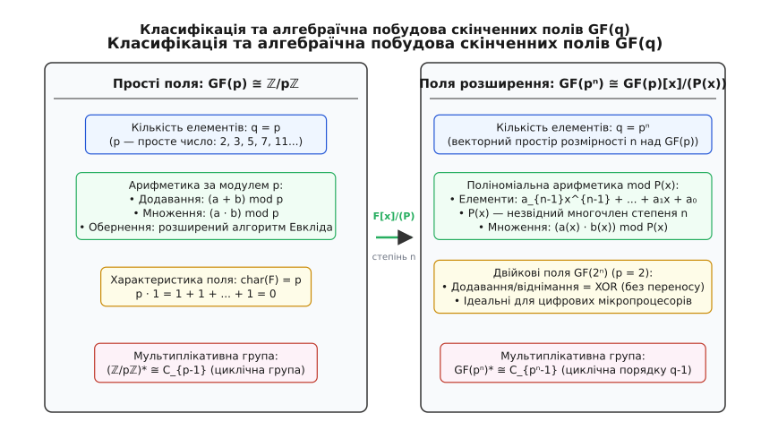
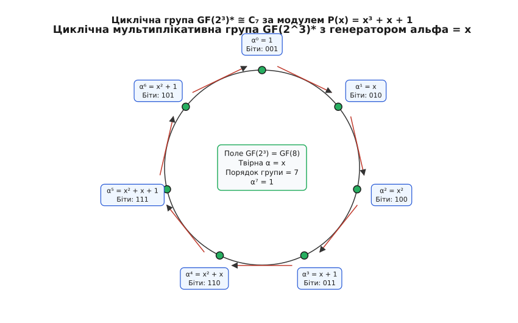
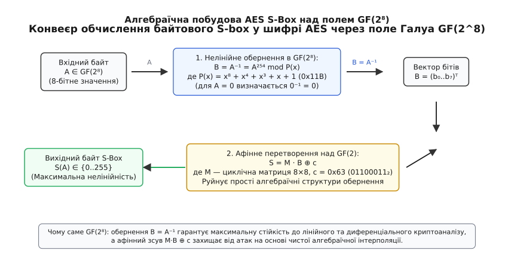
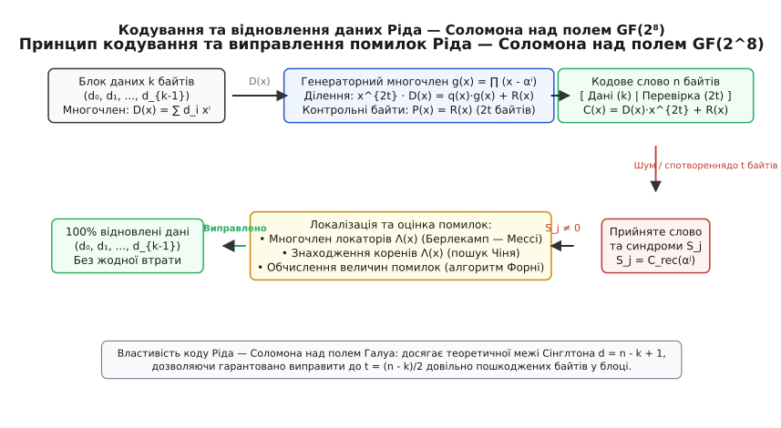

# Скінченні поля

<preknowlist>
- [Модульна арифметика](topic:math/modular-arithmetic) — додавання, множення та лишки за простим модулем p.
- [Теорія груп](topic:math/group-theory) — групи, циклічні підгрупи, генератори та порядок елемента.
- [Поліноми](topic:math/polynomials) — операції над многочленами, ділення з остачею та розклад на множники.
- [Непривідні многочлени](topic:math/irreducible-polynomials) — аналоги простих чисел у кільцях многочленів.
- [Мала теорема Ферма](topic:math/fermat-little-theorem) — степені елементів та обчислення мультиплікативного обернення.
- [Розділення секрету Шаміра](topic:math/shamir-secret-sharing) — інтерполяція многочленів та порогові схеми.
</preknowlist>

Комп'ютерні процесори оперують фіксованими блоками бітів: 8-бітними байтами (діапазон значень від 0 до 255), 32-бітними або 64-бітними машинними словами. Якщо застосувати до байтів звичайну цілочисельну арифметику за модулем 256 (`ℤ/256ℤ`), операції додавання та множення залишаються замкненими всередині байта, але операція ділення зазнає повного краху. Будь-яке парне число в кільці `ℤ/256ℤ` є дільником нуля: наприклад, `2 · 128 = 256 ≡ 0 (mod 256)`. Рівно половина всіх можливих значень байта (усі 128 парних чисел) принципово не мають мультиплікативного оберненого елемента. У такій числовій системі неможливо розв'язувати системи лінійних рівнянь, обертати матриці чи гарантувати взаємно однозначне нелінійне перемішування інформації в криптографічних алгоритмах.

Перехід до неперервних дійсних чисел з рухомою комою `ℝ` формально повертає операцію ділення, проте комп'ютерний стандарт IEEE 754 неминуче накопичує похибки заокруглення у молодших розрядах мантиси. Навіть мікроскопічна машинна похибка `10⁻¹⁶` робить неможливими симетричний криптографічний захист, розрахунок контрольних сум та відновлення пошкоджених пакетів у каналах зв'язку, де спотворення єдиного біта робить повідомлення нечитабельним. Якщо ж обрати найближче просте число `p = 257` і працювати у класичному полі лишків `ℤ/257ℤ`, ділення стає бездоганним, але число 256 вимагає 9 бітів пам'яті, що руйнує природну байтову структуру пам'яті комп'ютера та створює невикористані «дірки» в адресних просторах.

Розв'язання цієї фундаментальної проблеми дає математична структура — **скінченне поле** (або **поле Ґалуа**, позначається `GF(q)` чи `𝔽_q`). Це замкнена алгебраїчна система зі скінченною кількістю елементів `q`, у якій коректно визначені всі чотири арифметичні дії — додавання, віднімання, множення та ділення на будь-який ненульовий елемент — без жодних похибок і без виходу за межі строго заданої двійкової розрядності.

---

### Класифікація та алгебраїчна побудова полів Ґалуа

Полем (лат. *campus*, нім. *Körper* — суцільне тіло) в абстрактній алгебрі називається множина `𝔽`, на якій задано дві бінарні операції — додавання `+` та множення `·`, що задовольняють такі аксіоми:
1. **Абелева група за додаванням:** додавання є комутативним (`a + b = b + a`), асоціативним (`(a + b) + c = a + (b + c)`), містить нейтральний нульовий елемент `0` (`a + 0 = a`), і для кожного елемента `a` існує протилежний елемент `-a` (`a + (-a) = 0`).
2. **Абелева група ненульових елементів за множенням:** множення є комутативним (`a · b = b · a`), асоціативним (`(a · b) · c = a · (b · c)`), містить нейтральну одиницю `1 ≠ 0` (`a · 1 = a`), і для кожного ненульового елемента `a ≠ 0` існує обернений елемент `a⁻¹` (`a · a⁻¹ = 1`).
3. **Дистрибутивність:** операція множення узгоджена з додаванням розподільним законом: `a · (b + c) = a · b + a · c`.

Якщо множина `𝔽` містить скінченну кількість елементів `q = |𝔽|`, вона називається **скінченним полем**. Число `q` називається **порядком** (або розміром) поля.

#### Характеристика поля
Якщо багаторазово додавати одиницю поля саму до себе `1 + 1 + 1 + ...`, у скінченній множині значення суми неминуче почнуть циклічно повторюватися. Найменша кількість доданків `p > 0`, за якої сума стає рівною нулю:
```
p · 1 = 1 + 1 + ... + 1 (p разів) = 0
```
називається **характеристикою поля** (грец. *charaktēr* — ознака, клеймо) і позначається `char(𝔽) = p`.

Характеристика будь-якого скінченного поля завжди є **простим числом**. Якби число `p` було складеним `p = a · b` (де `1 < a, b < p`), то з рівності `(a · 1) · (b · 1) = (a · b) · 1 = p · 1 = 0` випливало б, що добуток двох ненульових елементів поля дорівнює нулю. Це прямо суперечить аксіомі поля про відсутність дільників нуля.

#### Векторна природа та степеневий порядок q = pⁿ
Кожне скінченне поле `𝔽` характеристики `p` містить всередині себе мінімальне підполе, утворене послідовними сумами одиниці: `{0, 1, 2·1, 3·1, ..., (p-1)·1}`. Це підполе є ізоморфним кільцю лишків `ℤ/pℤ` і називається **простим підполем** `𝔽_p`.

Усе поле `𝔽` можна розглядати як лінійний векторний простір над своїм простим підполем `𝔽_p`. Операція додавання векторів — це внутрішнє додавання елементів у полі `𝔽`, а множення вектора на скаляр — це множення довільного елемента з `𝔽` на елемент із простого підполя `𝔽_p`.

Якщо розмірність цього векторного простору над `𝔽_p` дорівнює цілому числу `n = dim_{𝔽_p}(𝔽) ≥ 1`, то кожен елемент поля однозначно записується як лінійна комбінація `n` базисних векторів `{e₁, e₂, ..., eₙ}`:
```
v = c₁ · e₁ + c₂ · e₂ + ... + cₙ · eₙ,   де кожен коефіцієнт c_i ∈ 𝔽_p
```
Оскільки кожен із `n` коефіцієнтів `c_i` можна незалежно обрати серед `p` можливих значень простого поля `𝔽_p`, загальна кількість різних елементів у полі `𝔽` строго дорівнює добутку `p · p · ... · p = pⁿ`.

Звідси випливає фундаментальна теорема класифікації скінченних полів:
> **Теорема класифікації:** 
> 1. Скінченне поле порядку `q` існує тоді й тільки тоді, коли `q` є степенем простого числа:
>    ```
>    q = pⁿ,   де p — просте число, n — натуральне число (n ≥ 1)
>    ```
> 2. Для будь-якого простого `p` і будь-якого натурального `n ≥ 1` існує скінченне поле порядку `pⁿ`.
> 3. Будь-які два скінченні поля з однаковою кількістю елементів `pⁿ` є ізоморфними між собою (мають однакову алгебраїчну структуру).


*Класифікація скінченних полів GF(q): прості поля GF(p) будуються за арифметикою лишків за простим модулем p, а поля розширення GF(pⁿ) формуються як фактор-кільця многочленів за незвідним поліномом P(x) степеня n.*

Таким чином, у природі існують поля з `2, 3, 4 = 2², 5, 7, 8 = 2³, 9 = 3², 16 = 2⁴, 256 = 2⁸` елементів, але принципово не існує полів із `6 = 2·3`, `10 = 2·5` чи `250` елементів.

#### Підполя скінченного поля та вежі полів (Tower Fields)
Не кожне поле меншого розміру може бути підполем більшого поля. Структура вкладення підполів підпорядковується суворому арифметичному правилу:
> **Критерій вкладення підполів:** Скінченне поле `𝔽_{pᵐ}` є підполем поля `𝔽_{pⁿ}` тоді й тільки тоді, коли показник степеня `m` є дільником числа `n` (`m | n`).

Наприклад, поле `GF(2⁶) = GF(64)` містить як підполя `GF(2)` (оскільки 1 ділить 6), `GF(2²) = GF(4)` (оскільки 2 ділить 6) та `GF(2³) = GF(8)` (оскільки 3 ділить 6), але воно принципово не містить підполя `GF(16) = GF(2⁴)`, тому що 4 не ділить 6.

В апаратній інженерії та мікроелектроніці ця властивість використовується для побудови **веж полів** (Tower Fields):
Замість прямої реалізації поля `GF(2⁸)` через незвідний многочлен 8-го степеня, його представляють як квадратичне розширення над полем `GF(2⁴)`:
```
GF(2⁸) ≅ GF((2⁴)²) ≅ GF(((2²)²)²)
```
Кожне складне множення у 8-бітному полі розбивається на кілька простих 2-бітних і 4-бітних операцій. У кремнієвих процесорах банківських смарт-карт це дозволяє зменшити площу апаратного блоку AES S-Box у 4–5 разів і скоротити енергоспоживання до мікроватів.

#### Слід та норма елементів поля
Для дослідження зв'язку між полем розширення `𝔽_{pⁿ}` та його простим підполем `𝔽_p` застосовують два фундаментальні відображення:

1. **Абсолютний слід (Trace):** Сума всіх спряжених елементів відносно автоморфізму Фробеніуса:
   ```
   Tr(a) = a + aᵖ + a^(p²) + a^(p³) + ... + a^(pⁿ⁻¹)
   ```
   Слід проєктує будь-який елемент поля розширення `𝔽_{pⁿ}` у базове просте поле `𝔽_p`. Слід є лінійним оператором: `Tr(a + b) = Tr(a) + Tr(b)` та `Tr(c · a) = c · Tr(a)` для будь-якого `c ∈ 𝔽_p`.
   У двійкових полях `GF(2ⁿ)` слід набуває значень лише `0` або `1`. Він визначає розв'язність квадратних рівнянь: неповне квадратне рівняння `x² + x + c = 0` має розв'язки в полі `GF(2ⁿ)` тоді й тільки тоді, коли `Tr(c) = 0`.

2. **Абсолютна норма (Norm):** Добуток усіх спряжених елементів:
   ```
   N(a) = a · aᵖ · a^(p²) · ... · a^(pⁿ⁻¹) = a^((pⁿ - 1) / (p - 1))
   ```
   Норма є мультиплікативним гомоморфізмом у просте поле: `N(a · b) = N(a) · N(b)` та `N(a) = 0` тоді й тільки тоді, коли `a = 0`.

Ознайомитися з історією відкриття цієї структури можна у статті про [історичний розвиток від досліджень Еваріста Ґалуа до цифрової криптографії](topic:math/finite-fields/hist-galois-fields.md), а зі строгим доведенням класифікації та єдиності полів Ґалуа — у матеріалі про [математичні основи та теореми класифікації скінченних полів](topic:math/finite-fields/math-finite-field-proofs.md).

---

### Мультиплікативна група та її циклічна структура

Якщо з поля `𝔽_q` вилучити нульовий елемент, решта `q - 1` елементів утворюють замкнену алгебраїчну групу за операцією множення. Ця група позначається `𝔽_q^\times` або `GF(q)*` і називається **мультиплікативною групою поля**.

Головною властивістю мультиплікативної групи скінченного поля є її циклічність:
> **Теорема про циклічність:** Мультиплікативна група будь-якого скінченного поля є строго циклічною групою:
> ```
> 𝔽_q^\times ≅ C_{q-1}
> ```
> Це означає, що в полі завжди існує щонайменше один елемент `α` (званий **примітивним елементом** або **генератором** поля), послідовні степені якого генерують усі ненульові елементи:
> ```
> 𝔽_q^\times = { α⁰, α¹, α², α³, ..., α^(q-2) },   де α^(q-1) = α⁰ = 1
> ```

Термін «примітивний» (лат. *primitivus* — перший, первинний) підкреслює, що цей елемент є першоджерелом для побудови всього поля через просте множення.


*Циклічна структура мультиплікативної групи GF(2³)* ≅ C₇: послідовне множення на примітивний елемент α = x породжує всі 7 ненульових елементів поля за модулем незвідного многочлена P(x) = x³ + x + 1.*

#### Чому мультиплікативна група завжди циклічна
Причина циклічності полягає в фундаментальній властивості алгебраїчних полів: над будь-яким полем многочлен степеня `d` може мати не більше ніж `d` різних коренів.

Якби група `𝔽_q^\times` не була циклічною, вона за основною теоремою про скінченні абелеві групи розпадалася б на прямий добуток кількох циклічних підгруп, містячи в собі підгрупу виду `C_d × C_d` для деякого `d > 1`. Усі `d²` елементів цієї підгрупи задовольняли б рівняння:
```
xᵈ = 1 ⟺ xᵈ - 1 = 0
```
Але многочлен `xᵈ - 1` степеня `d` над полем не може мати `d²` різних коренів (оскільки при `d ≥ 2` виконується `d² > d`). Ця суперечність доводить, що мультиплікативна група не може розгалужуватися і обов'язково є одновимірною циклічною структурою.

Кількість генераторів у полі `𝔽_q` строго дорівнює значенню функції Ейлера `φ(q - 1)`:
- Для простого поля `GF(7)` маємо `q - 1 = 6`, отже існує `φ(6) = 6 · (1 - 1/2) · (1 - 1/3) = 2` примітивні елементи (ними є числа 3 та 5).
- Для двійкового поля `GF(8) = GF(2³)` маємо `q - 1 = 7`, тому кількість примітивних елементів дорівнює `φ(7) = 6` (усі ненульові елементи, крім 1, є генераторами).
- Для байтового поля `GF(256) = GF(2⁸)` маємо `q - 1 = 255 = 3 · 5 · 17`, тому кількість генераторів становить `φ(255) = 255 · (2/3) · (4/5) · (16/17) = 128`.

---

### Представлення та арифметика полів розширення

Скінченні поля існують у двох якісно різних формах:
1. **Прості поля `GF(p)` (при показнику розширення `n = 1`):** Елементи представляються звичайними цілими числами `{0, 1, 2, ..., p-1}`. Додавання та множення виконуються як класичні операції над цілими числами з подальшим взяттям остачі від ділення на просте число `p`.
2. **Поля розширення `GF(pⁿ)` (при показнику розширення `n > 1`):** Елементи вже не можна представляти простими числами від `0` до `pⁿ - 1` зі звичайною арифметикою за модулем `pⁿ`, оскільки числове кільце `ℤ/pⁿℤ` містить дільники нуля (наприклад, `p · pⁿ⁻¹ = pⁿ ≡ 0`).

#### Поліноміальний базис і фактор-кільця
Для побудови поля розширення `GF(pⁿ)` використовують фактор-кільце многочленів `𝔽_p[x] / (P(x))`, де `P(x)` — **незвідний многочлен** (лат. *irreducibilis* — неподільний) степеня `n` з коефіцієнтами з простого поля `𝔽_p`. Незвідний многочлен є аналогом простого числа у світі поліномів: він не розкладається на добуток двох многочленів менших степенів.

Кожен елемент поля розширення однозначно представляється многочленом степеня, строго меншого за `n`:
```
a(x) = a_{n-1} x^{n-1} + a_{n-2} x^{n-2} + ... + a₁ x + a₀,   де a_i ∈ {0, 1, ..., p-1}
```

У цифровій інженерії вирішальну роль відіграють **двійкові поля** `GF(2ⁿ)` (характеристики `p = 2`). У цих полях коефіцієнти `a_i` набувають лише значень `0` або `1`. Тому кожен елемент поля ідеально зіставляється з бітовим рядком або цілим машинним числом:
```
a(x) = a₇ x⁷ + a₆ x⁶ + a₅ x⁵ + a₄ x⁴ + a₃ x³ + a₂ x² + a₁ x + a₀ ⟷ (a₇ a₆ a₅ a₄ a₃ a₂ a₁ a₀)₂
```

#### Додавання та віднімання в двійкових полях
Додавання двох елементів `a(x)` та `b(x)` у полі `GF(2ⁿ)` є попарним додаванням коефіцієнтів при однакових степенях `x` за модулем 2:
```
c_i = (a_i + b_i) mod 2
```
В обчислювальній техніці додавання двох бітів за модулем 2 тотожне операції побітового виключного АБО (`XOR`, позначається `⊕`):
```
c = a ⊕ b
```
Оскільки в полі характеристики 2 виконується рівність `1 + 1 = 0` (звідки `1 = -1`), операція віднімання повністю тотожна операції додавання:
```
a - b = a + b = a ⊕ b
```
Додавання в двійкових полях виконується без переносу між розрядами (carry-less addition), тому процесор виконує його миттєво за один машинний такт для будь-якої розрядності.

#### Множення многочленів за незвідним модулем
Множення двох елементів `a(x)` та `b(x)` у полі розширення виконується у два послідовні етапи:
1. **Алгебраїчне множення многочленів:** Обчислюється формальний добуток `d(x) = a(x) · b(x)`. Степінь многочлена `d(x)` може досягати `2n - 2`.
2. **Модульна редукція за P(x):** Отриманий многочлен `d(x)` ділиться з остачею на фіксований незвідний многочлен `P(x)`:
   ```
   c(x) = (a(x) · b(x)) mod P(x)
   ```
Остача `c(x)` гарантовано має степінь, менший за `n`, і є єдиним шуканим елементом поля.

Чому незвідність многочлена `P(x)` гарантує відсутність дільників нуля? Якщо `P(x)` незвідний, то для будь-якого ненульового многочлена `a(x)` степеня `< n` їхній найбільший спільний дільник дорівнює одиниці: `НСД(a(x), P(x)) = 1`. За тотожністю Безу для многочленів існують такі поліноми `u(x)` та `v(x)`, що:
```
a(x) · u(x) + P(x) · v(x) = 1
```
Взявши це рівняння за модулем `P(x)`, отримуємо `a(x) · u(x) ≡ 1 mod P(x)`. Многочлен `u(x) mod P(x)` є точним мультиплікативним оберненим елементом до `a(x)`. Якби многочлен `P(x)` розкладався на множники `P(x) = A(x) · B(x)`, то добуток двох ненульових елементів `A(x) · B(x) ≡ 0 mod P(x)` дав би нуль, перетворюючи систему на кільце з дільниками нуля, де ділення стає неможливим.

#### Незвідні та примітивні многочлени
При виборі полінома `P(x)` для побудови поля розширення важливо розрізняти два поняття:
- **Незвідний многочлен (Irreducible Polynomial):** Поліном, який не розкладається на добуток многочленів менших степенів над базовим полем. Він гарантує, що фактор-кільце `𝔽_p[x] / (P(x))` є коректним полем `GF(pⁿ)`. Проте сам елемент `x` у цьому полі не обов'язково є генератором усієї мультиплікативної групи — його порядок може бути меншим дільником числа `pⁿ - 1`.
- **Примітивний многочлен (Primitive Polynomial):** Це незвідний многочлен, корінь якого `α = x` має максимальний порядок `pⁿ - 1`, тобто є примітивним елементом (генератором) поля.

Наприклад, над полем `GF(2)` для степеня `n = 4` многочлен `P₁(x) = x⁴ + x³ + x² + x + 1` є незвідним, але не є примітивним: у полі `GF(16)` елемент `x` має порядок 5 (`x⁵ = 1`), породжуючи лише малу підгрупу з 5 елементів замість 15. Натомість многочлен `P₂(x) = x⁴ + x + 1` є примітивним, оскільки послідовні степені `x` генерують усі 15 ненульових елементів поля.

Примітивні многочлени є математичною основою лінійних регістрів зсуву зі зворотним зв'язком (**LFSR**). Регістр зсуву довжини `n`, налаштований за примітивним многочленом, генерує псевдовипадкову послідовність бітів максимально можливого періоду `2ⁿ - 1` (так звану **M-послідовність**), яка використовується в супутниковій навігації GPS/Galileo, мобільних стандартах CDMA та генераторах потокових шифрів.

Загальна кількість незвідних многочленів степеня `n` над полем `GF(p)` задається точною формулою Ґаусса через функцію Мебіуса `μ(d)`:
```
I_p(n) = (1 / n) · ∑_{d | n} μ(d) · p^(n / d)
```
Для двійкових многочленів 8-го степеня над `GF(2)` існує рівно 30 різних незвідних многочленів, з яких 16 є примітивними. Розробники стандарту AES обрали многочлен `P(x) = x⁸ + x⁴ + x³ + x + 1` (0x11B), який є незвідним, але не примітивним (корінь `x` має порядок 51), оскільки для симетричного шифрування критерієм вибору була мінімальна кількість апаратних логічних вентилів для обчислення `xtime`.

---

### Базиси представлення елементів у комп'ютерній пам'яті

В інженерній практиці для представлення елементів полів розширення `GF(pⁿ)` використовують три основні типи базисів:

1. **Поліноміальний (стандартний) базис:** Базис має вигляд `{1, x, x², ..., xⁿ⁻¹}`. Елементи записуються як звичайні масиви коефіцієнтів. Додавання виконується операцією XOR, а множення реалізується через побітові зсуви та маски редукції (`xtime`). Це найзручніший базис для програмної реалізації на універсальних мікропроцесорах загального призначення (x86, ARM, RISC-V).

2. **Нормальний базис (Normal Basis):** Базис формується послідовними степенями автоморфізму Фробеніуса одного спеціально підібраного нормального елемента `β`:
   ```
   { β, βᵖ, β^(p²), β^(p³), ..., β^(pⁿ⁻¹) }
   ```
   У двійковому полі `GF(2ⁿ)` автоморфізм Фробеніуса відповідає операції піднесення до квадрата: `(a + b)² = a² + b²`. 
   У нормальному базисі піднесення будь-якого елемента до квадрата є **простим циклічним зсувом бітів** у регістрі процесора:
   ```
   (b₀, b₁, b₂, ..., bₙ₋₁)² = (bₙ₋₁, b₀, b₁, ..., bₙ₋₂)
   ```
   Піднесення до квадрата в нормальному базисі вимагає 0 тактів обчислень на спеціалізованих мікросхемах ASIC та FPGA (реалізується простим перехресним перемиканням провідників на кремнії). Тому нормальні базиси масово використовуються в апаратних криптопроцесорах для прискорення обчислень на еліптичних кривих.

3. **Дуальний базис (Dual Basis):** Пара базисів `{α_i}` та `{β_j}`, для яких виконується умова ортогональності за слідом поля: `Tr(α_i · β_j) = δ_{ij}` (де `δ` — символ Кронекера). Дуальні базиси дозволяють будувати надкомпактні кремнієві помножувачі з мінімальною кількістю логічних вентилів.

---

### Логарифмічне представлення та логарифми Цеха

Окрім поліноміального базису, будь-який ненульовий елемент поля `GF(q)` можна однозначно представити показником степеня примітивного елемента `α`:
```
a = αⁱ,   де i ∈ {0, 1, ..., q-2}
```
Показник `i` називається **дискретним логарифмом** елемента `a` за основою `α` і позначається `i = log_α(a)`.

#### Множення та ділення за індексами
У логарифмічному базисі операції множення, ділення та піднесення до степеня стають тривіальними діями модульної цілочисельної арифметики:
- **Множення:** Додавання показників за модулем `q - 1`:
  ```
  a · b = αⁱ · αʲ = α^((i + j) mod (q - 1))
  ```
- **Ділення:** Віднімання показників за модулем `q - 1`:
  ```
  a / b = αⁱ / αʲ = α^((i - j + (q - 1)) mod (q - 1))
  ```
- **Обернення:** Доповнення показника до `q - 1`:
  ```
  a⁻¹ = α^(-i) = α^((q - 1 - i) mod (q - 1))
  ```

#### Додавання через логарифми Цеха (Zech Logarithms)
Головною складністю логарифмічного базису є додавання. Щоб знайти степінь суми двох елементів `αⁱ + αʲ` (припустимо `j ≥ i`), винесемо `αⁱ` за дужки:
```
αⁱ + αʲ = αⁱ · (1 + α^(j - i))
```
Німецький астроном і математик Юліус Август Крістоф Цех (Julius August Christoph Zech) запропонував попередньо розрахувати одномірну таблицю функції:
```
Z(k) = log_α (1 + α^k)
```
Тоді додавання двох ненульових елементів зводиться до одного віднімання, одного звернення до таблиці Цеха та одного додавання індексів:
```
αⁱ + αʲ = α^(i + Z(j - i))
```

Таблиця порівняння двох підходів до обчислень у скінченних полях:

| Критерій | Поліноміальний базис | Логарифмічний базис (Цеха) |
| :--- | :--- | :--- |
| **Додавання `a + b`** | 1 такт процесора (операція `XOR`) | 3 операції + звернення до таблиці |
| **Множення `a · b`** | Зсуви, маски `xtime` або алгоритм Карацуби | 1 додавання індексів `mod (q - 1)` |
| **Ділення `a / b`** | Повільний алгоритм Евкліда | 1 віднімання індексів `mod (q - 1)` |
| **Витрати пам'яті** | Не потребує таблиць (0 байтів) | Дві таблиці розміром `q` (Exp та Log) |
| **Стійкість до атак** | Постійний час виконання (Constant-time) | Вразливий до таймінг-атак на кеш-пам'ять |

Детальні інструкції з написання коду на C, C++ та Python розміщено у статті про [програмну реалізацію арифметики в полях GF(2⁸) та GF(2³)](topic:math/finite-fields/proj-galois-field-arithmetic.md).

---

### Числові приклади покрокових розрахунків

#### Приклад 1: Просте поле GF(7)
Розглянемо поле `GF(7) ≅ ℤ/7ℤ`, елементами якого є числові лишки `{0, 1, 2, 3, 4, 5, 6}`.

1. **Пошук примітивного елемента:**
   - Перевіримо число `2`:
     ```
     2¹ = 2,  2² = 4,  2³ = 8 ≡ 1 (mod 7)
     ```
     Порядок числа 2 дорівнює 3. Воно генерує лише підгрупу `{1, 2, 4}`, отже, не є примітивним.
   - Перевіримо число `3`:
     ```
     3¹ = 3
     3² = 9 ≡ 2 (mod 7)
     3³ = 3 · 2 = 6 ≡ 6 (mod 7)
     3⁴ = 3 · 6 = 18 ≡ 4 (mod 7)
     3⁵ = 3 · 4 = 12 ≡ 5 (mod 7)
     3⁶ = 3 · 5 = 15 ≡ 1 (mod 7)
     ```
     Степені числа 3 вичерпують усі 6 ненульових елементів поля. Число `α = 3` є генератором `GF(7)`.

2. **Ділення чисел у GF(7):**
   Обчислимо частку `4 / 5` у полі `GF(7)`:
   - Знайдемо обернений елемент `5⁻¹`:
     ```
     5 · x ≡ 1 (mod 7)
     5 · 3 = 15 ≡ 1 (mod 7) ⟹ 5⁻¹ = 3
     ```
   - Обчислимо добуток:
     ```
     4 / 5 = 4 · 5⁻¹ = 4 · 3 = 12 ≡ 5 (mod 7)
     ```
   - Перевірка: `5 · 5 = 25 = 3 · 7 + 4 ≡ 4 (mod 7)`. Розрахунок абсолютно точний.

---

#### Приклад 2: Двійкове поле розширення GF(2³) = GF(8)
Побудуємо поле `GF(8)` над простим полем `GF(2)` за допомогою незвідного многочлена 3-го степеня:
```
P(x) = x³ + x + 1
```

1. **Елементи поля:**
   Поле містить `2³ = 8` елементів, які записуються як многочлени `a₂ x² + a₁ x + a₀` або 3-бітні двійкові вектори `(a₂ a₁ a₀)`:
   - `0 = (000)₂`
   - `1 = (001)₂`
   - `x = (010)₂`
   - `x + 1 = (011)₂`
   - `x² = (100)₂`
   - `x² + 1 = (101)₂`
   - `x² + x = (110)₂`
   - `x² + x + 1 = (111)₂`

2. **Генерація степенів примітивного елемента `α = x`:**
   Оскільки `P(x) ≡ 0`, у полі діє тотожність редукції: `x³ ≡ x + 1`.
   ```
   α⁰ = 1                     = (001)₂
   α¹ = x                     = (010)₂
   α² = x²                    = (100)₂
   α³ = x³ = x + 1            = (011)₂
   α⁴ = x · α³ = x² + x       = (110)₂
   α⁵ = x · α⁴ = x³ + x² = (x + 1) + x² = x² + x + 1 = (111)₂
   α⁶ = x · α⁵ = x³ + x² + x = (x + 1) + x² + x = x² + 1 = (101)₂
   α⁷ = x · α⁶ = x³ + x = (x + 1) + x = 2x + 1 = 1 = α⁰
   ```

3. **Множення у полі GF(8):**
   Помножимо елемент `a = x² + 1` (код `101₂ = 5`) на `b = x + 1` (код `011₂ = 3`):
   - **Спосіб 1: Поліноміальне множення з редукцією:**
     ```
     (x² + 1) · (x + 1)
     = x³ + x² + x + 1           [розкриття дужок: дистрибутивність]
     = (x + 1) + x² + x + 1      [підстановка редукції x³ = x + 1]
     = x² + 2x + 2               [зведення подібних членів]
     = x² + 0x + 0               [коефіцієнти mod 2: 2 ≡ 0 mod 2]
     = x²                        [код (100)₂ = 4]
     ```
   - **Спосіб 2: Логарифмічне множення:**
     За таблицею степенів маємо `x² + 1 = α⁶` та `x + 1 = α³`:
     ```
     a · b = α⁶ · α³ = α^(6 + 3) = α⁹ = α^(9 mod 7) = α² = x²
     ```
   Обидва методи дали однаковий результат `x²` (`100₂`).

4. **Обернення елемента у GF(8):**
   Знайдемо обернений елемент до `a = x + 1 = α³`:
   ```
   a⁻¹ = (α³)⁻¹ = α^(7 - 3) = α⁴ = x² + x   [код (110)₂ = 6]
   ```
   Перевіримо результат прямим множенням:
   ```
   (x + 1) · (x² + x)
   = x³ + x² + x² + x        [розкриття дужок: дистрибутивність]
   = x³ + 2x² + x            [зведення подібних: x² + x² = 2x²]
   = (x + 1) + 0 + x         [редукція x³ = x + 1 та 2x² = 0 mod 2]
   = 2x + 1                  [зведення доданків: x + x = 2x]
   = 1                       [коефіцієнти mod 2: 2x = 0 mod 2]
   ```
   Елемент `x² + x` є точним мультиплікативним оберненням до `x + 1`.

---

### Застосування у криптографії та цифрових кодах

Скінченні поля є практичним ядром сучасної цифрової інженерії, забезпечуючи математичний фундамент трьох глобальних технологій:

#### 1. Симетричне шифрування: AES S-Box
У міжнародному стандарті симетричного блочного шифрування **AES (Rijndael)** обробка даних виконується над байтами, які розглядаються як елементи поля `GF(2⁸)` за незвідним многочленом:
```
P(x) = x⁸ + x⁴ + x³ + x + 1   (шістнадцятковий код: 0x11B)
```

Головний нелінійний блок шифру — таблиця підстановки **S-Box (SubBytes)** — будується у два етапи:
1. Кожен ненульовий вхідний байт `A ∈ GF(2⁸)` замінюється на свій мультиплікативний обернений елемент `B = A⁻¹ = A²⁵⁴` у полі `GF(2⁸)` (для нульового байта визначається `0⁻¹ = 0`).
2. До отриманого вектора бітів застосовується фіксоване афінне перетворення над `GF(2)` з додаванням константи `0x63`:
   ```
   s_i = b_i ⊕ b_((i+4) mod 8) ⊕ b_((i+5) mod 8) ⊕ b_((i+6) mod 8) ⊕ b_((i+7) mod 8) ⊕ c_i
   ```
   де `c = 0x63 = (01100011)₂`.


*Конвеєр перетворення AES S-Box: комбінація мультиплікативного обернення у полі GF(2⁸) та афінного перетворення над GF(2) забезпечує максимальну стійкість до лінійного та диференціального криптоаналізу.*

Чому розробники AES Йоан Дамен та Вінсент Реймен обрали саме таку конструкцію?
- Мультиплікативне обернення `x ↦ x⁻¹` у полі `GF(2⁸)` має **найвищу можливу диференціальну нелінійність** (максимальна ймовірність диференціального переходу дорівнює всього `2⁻⁶ = 4/256`) та найкращу лінійну стійкість (кореляція не перевищує `2⁻³`).
- Проте чисте обернення має просту алгебраїчну формулу `x · y = 1`, що дозволило б атакувати шифр методами інтерполяції або розв'язанням алгебраїчних систем через базиси Грьобнера.
- Додавання афінного перетворення над простим полем `GF(2)` руйнує просту структуру над `GF(2⁸)`: функція перетворюється на поліном над `GF(2⁸)` максимального степеня 254 з 255 ненульовими коефіцієнтами, унеможливлюючи будь-які алгебраїчні атаки. Константа `0x63` гарантує відсутність нерухомих точок (`S(0x00) = 0x63 ≠ 0x00`) та відсутність інваріантних точок (`S(x) ≠ x`, `S(x) ≠ x̄`).

---

#### 2. Асиметрична криптографія: Діффі — Геллман та еліптичні криві
Безпека протоколів розподілу ключів та цифрових підписів спирається на обчислювальну складність **задачі дискретного логарифмування (DLP)** у скінченних полях:
- **Класичний протокол Діффі — Геллмана:** Використовує мультиплікативну групу простого поля `GF(p)*` розміром 2048–4096 бітів. Знаючи генератор `g` та відкритий ключ `A = gᵃ mod p`, зловмисник не може знайти секретний ключ `a` за поліноміальний час.
- **Криптографія на еліптичних кривих (ECC):** Точки кривої `y² = x³ + a x + b` розглядаються над простим полем `GF(p)` (наприклад, крива `secp256k1` у протоколі Bitcoin) або над двійковим полем `GF(2ᵐ)`. Кількість точок на еліптичній кривій над полем `𝔽_p` обмежується **теоремою Хассе**:
  ```
  p + 1 - 2√p ≤ #E(𝔽_p) ≤ p + 1 + 2√p
  ```
  Це дозволяє зменшити розмір криптографічного ключа до 256 бітів при збереженні рівня безпеки 3072-бітного класичного RSA. Проте вибір поля та кривої вимагає ретельної математичної верифікації: якщо порядок групи точок кривої збігається з характеристикою поля `#E(𝔽_p) = p` (так звані аномальні криві), задача дискретного логарифмування ламається за поліноміальний час за допомогою p-адичної атаки Смарта — Семаєва. Якщо ж крива є надсингулярною (степінь вкладення `k` малий), редукція Менезеса — Окамото — Ванстоуна (MOV-атака) переносить задачу з еліптичної кривої у мультиплікативну групу поля розширення `𝔽_{p^k}`, зводячи складність до звичайного суб'експоненційного решета числового поля.

Чому порядок групи має фундаментальне значення для безпеки? Якщо порядок групи `q - 1` розкладається на добуток лише малих простих множників `q - 1 = p₁^{e₁} · p₂^{e₂} · ... · p_k^{e_k}`, алгоритм Поліга — Геллмана розв'язує задачу дискретного логарифмування за поліноміальний час `O(∑ e_i (log N + √p_i))` замість експоненційного `O(√q)`. Тому в криптографії застосовують так звані **безпечні прості числа** Софі Жермен, де `p = 2r + 1` (число `r` також є великим простим числом), що гарантує максимальну криптографічну стійкість.

---

#### 3. Коди виправлення помилок: коди Ріда — Соломона
Коди **Ріда — Соломона (Reed-Solomon Codes)** розглядають блок із `k` інформаційних байтів як коефіцієнти многочлена `D(x)` над полем `GF(2⁸)`.


*Кодування Ріда — Соломона над полем GF(2⁸): додавання 2t контрольних символів за генераторним многочленом g(x) дозволяє гарантовано локалізувати та відновити до t спотворених байтів у кодовому слові.*

Повний конвеєр обробки даних у кодах Ріда — Соломона складається з чотирьох кроків:
1. **Кодування:** Генераторний многочлен коду будується через послідовні степені примітивного елемента поля `α`:
   ```
   g(x) = (x - α) · (x - α²) · ... · (x - α^(2t))
   ```
   Блок даних `D(x)` множиться на `x^(2t)` і ділиться на `g(x)`. Отримана остача `R(x)` розміром `2t` байтів додається до даних, утворюючи кодове слово довжини `n = k + 2t`.
2. **Обчислення синдромів:** На приймальній стороні прийняте кодове слово `C_rec(x)` обчислюється у точках `x = αʲ` для `j = 1, 2, ..., 2t`:
   ```
   S_j = C_rec(αʲ)
   ```
   Якщо всі `2t` синдромів дорівнюють нулю `S_j = 0`, дані прийнято без жодної помилки.
3. **Локалізація помилок (алгоритм Берлекампа — Мессі):** Якщо хоча б один синдром ненульовий, алгоритм Берлекампа — Мессі за `O(t²)` операцій у полі Ґалуа знаходить многочлен локаторів помилок `Λ(x) = ∏ (1 - X_i x)`. Корені цього многочлена знаходять швидким перебором за схемою Чіня (Chien Search).
4. **Обчислення значень помилок (алгоритм Форні):** За допомогою формальної похідної `Λ'(x)` та многочлена оцінки помилок `Ω(x)` алгоритм Форні обчислює точні числові значення байтів спотворення, які віднімаються від прийнятого сигналу через XOR.

Коди Ріда — Соломона належать до класу **MDS-кодів** (Maximum Distance Separable) — вони досягають абсолютної теоретичної межі Сінглтона `d = n - k + 1`. Матриці кодування таких систем будуються як матриці Вандермонда або Коші над полем `GF(2⁸)`, для яких будь-яка квадратна підматриця розміру `k × k` є невиродженою. Це гарантує, що для відновлення початкового повідомлення достатньо отримати будь-які `k` непошкоджених символів із загальної кількості `n`.

Коди Ріда — Соломона є основою захисту даних у:
- Оптичних накопичувачах CD/DVD/Blu-ray (виправлення фізичних подряпин на поверхні диска);
- Двовимірних штрих-кодах QR-Code та DataMatrix (зчитування при пошкодженні до 30% площі коду);
- Дискових сховищах надійності RAID-6 (відновлення даних при одночасному виході з ладу двох жорстких дисків);
- Далекому космічному зв'язку NASA та ESA (передача телеметрії крізь космічні радіозавади).

---

> 🔧 **Навіщо це в реальній розробці.**
> Розуміння скінченних полів критично важливе для розробників системного та криптографічного ПЗ. При реалізації алгоритмів на полях `GF(2⁸)` не можна використовувати прямі табличні звернення `log/exp` у чутливому коді, оскільки час доступу до ліній кеш-пам'яті L1 процесора залежить від значення секретного ключа (атака Bernstein Cache-Timing). Безпечний код завжди пишуть у постійночасовому стилі (constant-time) з використанням операцій `xtime`, бітових масок або прямих апаратних інструкцій процесора `PCLMULQDQ` (Intel AES-NI) та `PMULL` (ARM NEON), які виконують безпереносне множення многочленів над `GF(2)` на рівні кремнієвих транзисторів.
