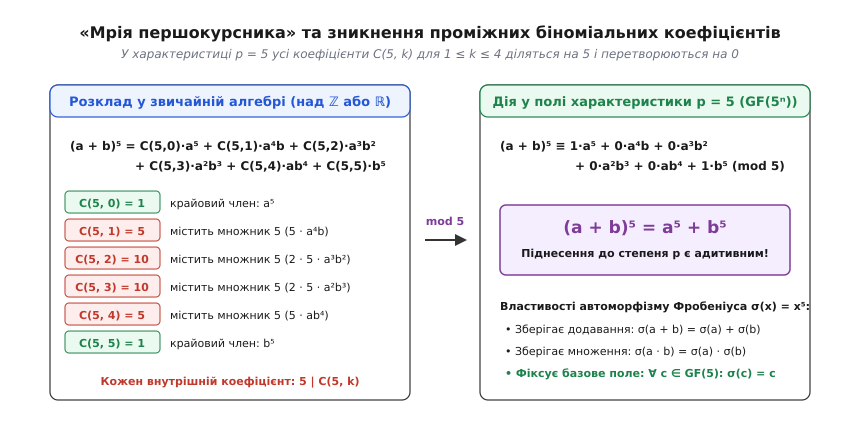
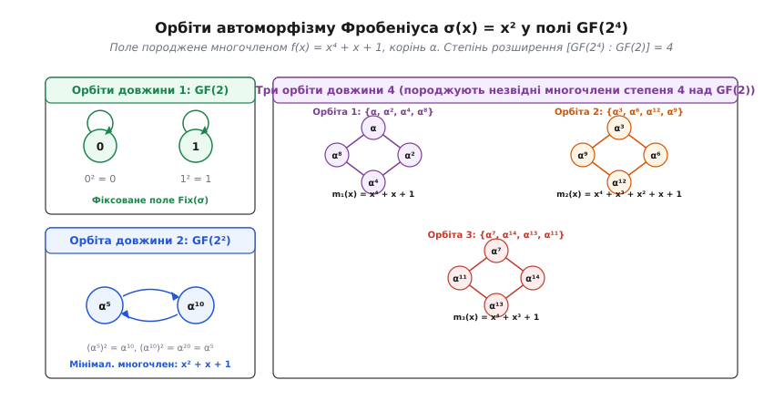
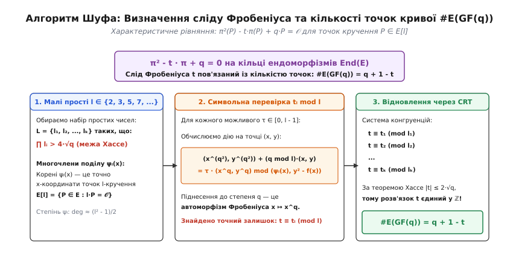
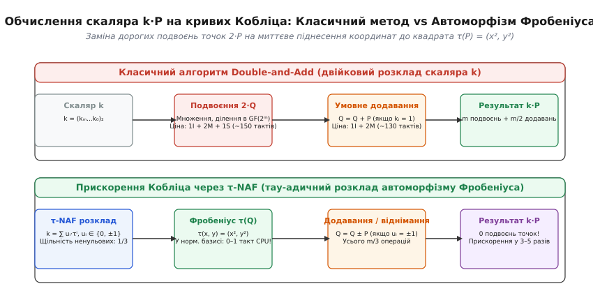

# Автоморфізм Фробеніуса: міст між лінійною алгеброю, теорією Галуа та криптографією

<preknowlist>
- [Кільця](topic:math/rings) — комутативні кільця, поля, характеристика кільця та фактор-структури.
- [Скінченні поля](topic:math/finite-fields) — поля Галуа GF(pⁿ), порядок поля, примітивні елементи та незвідні многочлени.
- [Група Ґалуа](topic:math/galois-group) — автоморфізми полів, що зберігають базове підполе, фіксовані поля та відповідність Галуа.
- [Еліптичні криві](topic:math/elliptic-curves) — груповий закон додавання точок, рівняння Вейєрштрасса та криптографія на еліптичних кривих.
</preknowlist>

Коли криптографічний сервер підписує цифровий сертифікат безпеки або автентифікує транзакцію в мережі за протоколом ECDSA, головним обчислювальним тягарем стає операція скалярного множення точки на еліптичній кривій: обчислення суми `Q = k · P`, де `k` — 256-бітний секретний скаляр, а `P` — базова точка кривої. Класичний двійковий алгоритм вимагає для кожного біта скаляра виконати операцію подвоєння точки `[2]Q`, яка в координатах поля коштує від п'яти до десяти важких операцій множення та ділення. Для 256-бітного ключа це означає понад дві тисячі операцій над довгими числами на кожен окремий підпис.

Аналогічний обчислювальний глухий кут виникає і при створенні самої криптосистеми: щоб переконатися, що еліптична крива є криптографічно стійкою проти атак Поліга — Геллмана, інженерам необхідно точно знати кількість її раціональних точок `#E(GF(q))`. Проте прямий перебір точок у полі розміром `q ≈ 2²⁵⁶` вимагав би часу, що перевищує вік Всесвіту.

В основі подолання обох цих фундаментальних бар'єрів лежить одне з найдивовижніших відкриттів вищої алгебри. У звичайній шкільній арифметиці над дійсними чи раціональними числами операція піднесення до степеня є жорстко нелінійною: сума чисел у степені ніколи не дорівнює сумі їхніх степенів, адже `(a + b)² = a² + 2ab + b² ≠ a² + b²`. Проте у скінченних полях простої характеристики `p` операція піднесення до степеня `p` раптово втрачає нелінійність і перетворюється на точний гомоморфізм, що зберігає і множення, і додавання: `(a + b)^p = a^p + b^p`.

Ця симетрія, що отримала назву **автоморфізм Фробеніуса**, виступає головним генератором групи симетрій Галуа для скінченних розширень полів, дозволяє підраховувати точки на кривих за поліноміальний час через алгоритм Шуфа та замінює тисячі операцій подвоєння точок у криптографії на миттєві апаратні бітові зсуви.

### 1. Першопричина лінійності: «мрія першокурсника» та біноміальні коефіцієнти

Щоб зрозуміти, чому у скінченній арифметиці нелінійне піднесення до степеня перетворюється на лінійне відображення, звернемося до формули бінома Ньютона для суми двох елементів `a` і `b` у комутативному кільці. Піднесення двочлена `(a + b)` до натурального степеня `p` розгортається у суму `p + 1` окремих доданків:

```
(a + b)^p = C(p, 0)·a^p + C(p, 1)·a^(p - 1)·b + C(p, 2)·a^(p - 2)·b² + … + C(p, p - 1)·a·b^(p - 1) + C(p, p)·b^p
```

де біноміальний коефіцієнт `C(p, k)` визначається через факторіали чисел:

```
C(p, k) = p! / (k! · (p - k)!)
```

У звичайній арифметиці цілі числа `C(p, k)` швидко зростають зі збільшенням `p`, створюючи проміжні перехресні члени. Проте коли показник степеня `p` є **простим числом**, внутрішня структура біноміальних коефіцієнтів набуває фундаментальної арифметичної властивості:

```
k! · (p - k)! · C(p, k) = p · (p - 1)!
```

Оскільки просте число `p` ділить праву частину рівності, воно має ділити і ліву частину. Дослідимо множники лівої частини для будь-якого проміжного індексу `k`, що лежить у межах від `1` до `p - 1`:

1. Факторіал `k! = 1 · 2 · 3 · … · k` є добутком натуральних чисел, кожне з яких строго менше за просте число `p`. Оскільки просте число не має дільників, крім одиниці та самого себе, воно взаємно просте з кожним із цих множників. Отже, число `p` не може ділити `k!`.
2. Факторіал `(p - k)! = 1 · 2 · 3 · … · (p - k)` також складається виключно з чисел, строго менших за `p`, тому `p` не ділить `(p - k)!`.

Оскільки `p` є простим числом і не ділить жоден із факторіалів у знаменнику, воно зобов'язане націло ділити сам біноміальний коефіцієнт `C(p, k)`. Тобто для всіх проміжних індексів `1 ≤ k ≤ p - 1` існує ціле число `M_k` таке, що:

```
C(p, k) = p · M_k ≡ 0 (mod p)
```


*«Мрія першокурсника»: біноміальний розклад (a + b)ᵖ за модулем p. Усі проміжні біноміальні коефіцієнти C(p, k) діляться на p і перетворюються на нуль у полі характеристики p, перетворюючи піднесення до степеня p на лінійний гомоморфізм.*

Якщо алгебраїчна система має характеристику `p` (тобто додавання будь-якого елемента самого до себе `p` разів дає нуль: `p · 1 = 0`), то всі проміжні доданки в біноміальному розкладі повністю обнуляються:

```
(a + b)^p
= C(p, 0)·a^p + (∑ₖ₌₁ᵖ⁻¹ C(p, k)·a^(p - k)·b^k) + C(p, p)·b^p   [біноміальний розклад]
= 1·a^p + (∑ₖ₌₁ᵖ⁻¹ (p · M_k)·a^(p - k)·b^k) + 1·b^p            [подільність C(p, k) на p]
= a^p + (∑ₖ₌₁ᵖ⁻¹ M_k·a^(p - k)·b^k · (p · 1)) + b^p            [винесення множника p]
= a^p + 0 + b^p                                                [оскільки p · 1 = 0 у характеристиці p]
= a^p + b^p
```

Ця властивість у математичному фольклорі жартівливо називається **«мрією першокурсника»** (англ. *Freshman's dream*), оскільки початківці в алгебрі часто помилково записують `(a + b)ⁿ = aⁿ + bⁿ`. Проте в комутативних кільцях і полях простої характеристики `p` це твердження є не помилкою, а строгою математичною теоремою.

Важливо зазначити, де саме ця симетрія порушується. Якщо кільце є **некомутативним** (наприклад, кільце матриць над `GF(p)` або універсальна обгортна алгебра алгебри Лі), формула бінома Ньютона не застосовується у класичному вигляді через нерівність `a·b ≠ b·a`. У таких структурах розклад `(a + b)^p` породжує нелінійні комутаторні доданки (формула Якобсона для обмежених алгебр Лі): `(a + b)^p = a^p + b^p + ∑ s_i(a, b)`, де `s_i(a, b)` складаються з вкладених дужок Лі `[a, b] = a·b - b·a`. Лише комутативність кільця гарантує точне перетворення степеня на лінійний гомоморфізм.

Цей алгебраїчний механізм названо на честь німецького математика Фердинанда Георга Фробеніуса (нім. *Ferdinand Georg Frobenius*, 1849–1917). Термін *автоморфізм* походить від грецьких слів *αὐτός* («сам») та *μορφή* («форма, будова»), позначаючи взаємно однозначне відображення алгебраїчної структури на саму себе, яке повністю зберігає всі операції. Детально про історичний шлях цієї ідеї від теорії алгебраїчних рівнянь XIX століття до гіпотез Вейля розказано в окремому нарисі: [історією відкриття та роллю автоморфізму Фробеніуса у формулюванні гіпотез Вейля](topic:math/frobenius-automorphism/hist-frobenius-origins.md).

### 2. Алгебраїчна анатомія: від ендоморфізму кільця до групи Галуа

Нехай `F` — довільне комутативне кільце простої характеристики `p`. Відображення `σ: F → F`, задане правилом:

```
σ(x) = x^p
```

називається **ендоморфізмом** Фробеніуса кільця `F`. Перевіримо виконання аксіом гомоморфізму кілець для довільних елементів `x, y ∈ F`:

1. Збереження додавання (адитивність): завдяки доведеній вище лемі про подільність біноміальних коефіцієнтів маємо `σ(x + y) = (x + y)^p = x^p + y^p = σ(x) + σ(y)`.
2. Збереження множення (мультиплікативність): за комутативністю множення маємо `σ(x · y) = (x · y)^p = x^p · y^p = σ(x) · σ(y)`.
3. Збереження нейтрального елемента: `σ(1) = 1^p = 1`.

Якщо кільце `F` є полем (тобто кожен ненульовий елемент має обернений), то гомоморфізм `σ` автоматично є строго ін'єктивним. Дійсно, якщо `σ(x) = 0`, то `x^p = 0`, а у полі добуток елементів дорівнює нулю тоді й лише тоді, коли хоча б один із множників є нулем, звідки `x = 0`. Отже, ядро відображення тривіальне: `Ker(σ) = {0}`.

Якщо поле `F` є **скінченним полем** `GF(q)` (де `q = pⁿ`), то будь-яке ін'єктивне відображення скінченної множини в себе є бієктивним. Бієктивний ендоморфізм є автоморфізмом, тому для будь-якого скінченного поля відображення Фробеніуса є повноцінним **автоморфізмом**.

Розглянемо дію ітерацій автоморфізму Фробеніуса:

```
σ¹(x) = x^p
σ²(x) = σ(σ(x)) = (x^p)^p = x^(p²)
σ³(x) = x^(p³)
…
σᵏ(x) = x^(pᵏ)
```

З'ясуємо, які саме елементи поля залишаються нерухомими під дією `σ`. Рівність `σ(x) = x` рівносильна рівнянню:

```
x^p - x = 0
```

За малою теоремою Ферма будь-яке ціле число `a` за простим модулем `p` задовольняє рівність `a^p ≡ a (mod p)`. Тобто всі `p` елементів простого підполя `GF(p) = ℤ/pℤ` є коренями цього рівняння. Оскільки многочлен степеня `p` над полем не може мати більше ніж `p` коренів, множина нерухомих точок автоморфізму `σ` точно збігається з базовим простим полем:

```
Fix(σ) = {x ∈ GF(pⁿ) : σ(x) = x} = GF(p)
```

Розглянемо тепер розширення скінченних полів `E = GF(pⁿ)` над базовим полем `K = GF(p)`. Степінь цього розширення як векторного простору дорівнює `[E : K] = n`. Мультиплікативна група поля `E* = GF(pⁿ) \ {0}` має порядок `pⁿ - 1`, тому кожен ненульовий елемент задовольняє `x^(pⁿ - 1) = 1`, звідки `x^(pⁿ) = x`. Враховуючи `0^(pⁿ) = 0`, маємо:

```
σⁿ(x) = x^(pⁿ) = x   для всіх x ∈ GF(pⁿ)
```

Це означає, що `n`-та ітерація автоморфізму Фробеніуса є тотожним відображенням: `σⁿ = id`. При цьому жодна менша степінь `σᵏ` при `1 ≤ k < n` не може бути тотожним відображенням, оскільки рівняння `x^(pᵏ) - x = 0` має лише `pᵏ < pⁿ` коренів і не може занулятися на всьому полі `GF(pⁿ)`.

Звідси випливає фундаментальна теорема теорії Галуа для скінченних полів: група Галуа `Gal(GF(pⁿ)/GF(p))` є **циклічною групою порядку n**, і вона цілком породжується єдиним елементом — автоморфізмом Фробеніуса:

```
Gal(GF(pⁿ)/GF(p)) = ⟨σ⟩ = {id, σ, σ², σ³, …, σⁿ⁻¹} ≅ ℤ/nℤ
```

Більш глибокий аналіз алгебраїчних властивостей степенів Фробеніуса, слідів, норм, модулів Тейта та критерію Хассе наведено у спеціальній математичній розвідці: [математичними властивостями відображення Фробеніуса, теоремою Хассе та слідом оператора](topic:math/frobenius-automorphism/math-frobenius-properties.md).

### 3. Структура підполів, циклотомічні косети та відповідність Галуа

Циклічна природа групи Галуа `Gal(GF(pⁿ)/GF(p))` забезпечує виняткову простоту та наочність фундаментальної відповідності Галуа.

За класичною теоремою теорії Галуа існує взаємно однозначна відповідність між підгрупами групи Галуа та проміжними підполями розширення. Оскільки будь-яка підгрупа циклічної групи порядку `n` є циклічною і визначається дільником `d` числа `n` (`d | n`), кожна підгрупа має вигляд:

```
H_d = ⟨σᵈ⟩ = {id, σᵈ, σ²ᵈ, …, σ^((n/d - 1)·d)}
```

Порядок цієї підгрупи дорівнює `n / d`, а її індекс у повній групі Галуа дорівнює `d`.

Поле нерухомих точок підгрупи `H_d` складається з усіх елементів `x ∈ GF(pⁿ)`, які задовольняють рівняння `σᵈ(x) = x^(pᵈ) = x`:

```
Fix(H_d) = {x ∈ GF(pⁿ) : x^(pᵈ) = x} = GF(pᵈ)
```

Таким чином, скінченне поле `GF(pⁿ)` містить рівно одне проміжне підполе `GF(pᵈ)` для кожного дільника `d` числа `n`. Жодних інших підполів не існує. Ґратка підполів скінченного поля повністю повторює ґратку дільників числа `n`. Наприклад, поле `GF(2¹²)` містить проміжні підполя `GF(2)`, `GF(2²)`, `GF(2³)`, `GF(2⁴)`, `GF(2⁶)` та саме `GF(2¹²)`.

Зв'язок елементів поля з незвідними многочленами над `GF(p)` визначається за допомогою **циклотомічних косетів** (англ. *cyclotomic cosets*). Циклотомічний косет `C_s` за модулем `pⁿ - 1`, що містить індекс `s`, визначається як орбіта числа `s` при множенні на `p`:

```
C_s = {s, s·p, s·p², …, s·p^(d - 1)} (mod pⁿ - 1)
```

де `d` — найменше натуральне число, для якого `s · pᵈ ≡ s (mod pⁿ - 1)`. Кожен косет `C_s` задає корені незвідного многочлена `m_s(x)` над `GF(p)`:

```
m_s(x) = ∏_{j ∈ C_s} (x - αʲ)
```

де `α` — примітивний елемент поля `GF(pⁿ)`.

Для розширення `GF(3⁴) = GF(81)` над `GF(3)` модуль дорівнює `3⁴ - 1 = 80`. Циклотомічний косет числа `s = 1` при множенні на `p = 3` утворює множину:
`C₁ = {1, 3, 9, 27} (mod 80)`. Коріннями незвідного многочлена степеня 4 є `α, α³, α⁹, α²⁷`.
Циклотомічний косет числа `s = 2`:
`C₂ = {2, 6, 18, 54} (mod 80)`.
А циклотомічний косет числа `s = 20`:
`C₂₀ = {20, 60} (mod 80)` має довжину лише 2, оскільки `20 · 3² = 180 ≡ 20 (mod 80)`. Він відповідає незвідному многочлену степеня 2 над `GF(3)`, корені якого лежать у квадратичному підполі `GF(3²) = GF(9)`.

Аналогічно, для поля `GF(2⁶) = GF(64)` дільники степеня розширення 6 дорівнюють `1, 2, 3, 6`. Відповідна ґратка містить підполя `GF(2)`, квадратичне підполе `GF(2²) = GF(4)` та кубічне підполе `GF(2³) = GF(8)`. Їхній перетин `GF(4) ∩ GF(8) = GF(2)` є базовим простим полем, а їхній композит `GF(4) · GF(8) = GF(64)` дає все вихідне поле. Ця гармонійна ієрархія забезпечується тим, що автоморфізм Фробеніуса другого степеня `σ²` фіксує `GF(4)`, третього степеня `σ³` фіксує `GF(8)`, а шостого степеня `σ⁶ = id` фіксує всі елементи.

### 4. Конкретний розбір: орбіти Фробеніуса у полі GF(2⁴)

Щоб побачити дію автоморфізму Фробеніуса на конкретних числах, побудуємо поле Галуа `GF(2⁴) = GF(16)`. Це поле є векторним простором розмірності 4 над двійковим полем `GF(2) = {0, 1}` і містить `2⁴ = 16` елементів.

Для побудови поля оберемо незвідний многочлен четвертого степеня над `GF(2)`:

```
f(x) = x⁴ + x + 1
```

Позначимо корінь цього многочлена через `α` (грецька літера «альфа»), тобто `α⁴ + α + 1 = 0`, звідки у двійковій арифметиці (де `-1 = 1`) маємо базове правило редукції: `α⁴ = α + 1`.

Усі 15 ненульових елементів поля утворюються як послідовні степені примітивного елемента `α`:

```
α⁰ = 1
α¹ = α
α² = α²
α³ = α³
α⁴ = α + 1
α⁵ = α · α⁴ = α · (α + 1) = α² + α
α⁶ = α³ + α²
α⁷ = α⁴ + α³ = α³ + α + 1
α⁸ = α⁴ + α² + α = α² + 1
α⁹ = α³ + α
α¹⁰ = α⁴ + α² = α² + α + 1
α¹¹ = α³ + α² + α
α¹² = α⁴ + α³ + α² = α³ + α² + α + 1
α¹³ = α⁴ + α³ + α² + α = α³ + α² + 1
α¹⁴ = α⁴ + α³ + 1 = α³ + 1
α¹⁵ = α⁴ + α = (α + 1) + α = 1 = α⁰
```

Оскільки характеристика поля `p = 2`, автоморфізм Фробеніуса полягає у піднесенні елементів до квадрата: `σ(z) = z²`.

Застосуємо автоморфізм `σ` до всіх елементів поля і згрупуємо їх у неперетинні множини — **орбіти Фробеніуса** (цикли Галуа):

1. **Орбіти довжини 1** (фіксовані елементи підполя `GF(2)`):
   - `{0}`: `0² = 0`
   - `{1}`: `1² = 1`
2. **Орбіта довжини 2** (елементи квадратичного підполя `GF(2²) = {0, 1, α⁵, α¹⁰}`):
   - `{α⁵, α¹⁰}`: `(α⁵)² = α¹⁰`, а `(α¹⁰)² = α²⁰ = α¹⁵ · α⁵ = 1 · α⁵ = α⁵`.
   Ця пара елементів задовольняє незвідний над `GF(2)` многочлен степеня 2:
   ```
   (x - α⁵) · (x - α¹⁰) = x² - (α⁵ + α¹⁰)·x + α¹⁵ = x² + x + 1
   ```
3. **Орбіти довжини 4** (елементи, які не належать жодному строгому підполю):
   - Перша орбіта: `{α, α², α⁴, α⁸}`. Її елементи циклічно переходять один в одного: `α ↦ α² ↦ α⁴ ↦ α⁸ ↦ α¹⁶ = α`. Добуток коренів дає наш початковий многочлен:
   ```
   (x - α)(x - α²)(x - α⁴)(x - α⁸) = x⁴ + x + 1
   ```
   - Друга орбіта: `{α³, α⁶, α¹², α⁹}`. Цикл: `α³ ↦ α⁶ ↦ α¹² ↦ α²⁴ = α⁹ ↦ α¹⁸ = α³`. Добуток коренів утворює незвідний многочлен:
   ```
   (x - α³)(x - α⁶)(x - α¹²)(x - α⁹) = x⁴ + x³ + x² + x + 1
   ```
   - Третя орбіта: `{α⁷, α¹⁴, α¹³, α¹¹}`. Цикл: `α⁷ ↦ α¹⁴ ↦ α²⁸ = α¹³ ↦ α²⁶ = α¹¹ ↦ α²² = α⁷`. Добуток коренів дає третій незвідний многочлен:
   ```
   (x - α⁷)(x - α¹⁴)(x - α¹³)(x - α¹¹) = x⁴ + x³ + 1
   ```


*Розбиття елементів поля GF(2⁴) на незвідні орбіти під дією автоморфізму Фробеніуса σ(x) = x². Орбіти визначають структуру підполів GF(2), GF(2²) та корені незвідних многочленів над GF(2).*

Кожна орбіта Фробеніуса довжини `d` взаємно однозначно відповідає незвідному многочлену степеня `d` над базовим полем. Таким чином, автоморфізм Фробеніуса діє як природний класифікатор усієї поліноміальної структури скінченного поля.

### 5. Абсолютний, арифметичний та геометричний Фробеніус

При переході від скінченних полів до алгебраїчної геометрії та числових полів виникає потреба розрізняти три споріднені, але концептуально різні прояви відображення Фробеніуса:

1. **Абсолютний автоморфізм Фробеніуса**: відображення `x ↦ x^p` над алгебраїчним замиканням `F_p^alg` простого поля `GF(p)`. Цей автоморфізм діє на всіх елементах одночасно і є універсальним інваріантом характеристики `p`.
2. **Арифметичний Фробеніус**: для фіксованого скінченного поля `GF(q)` (де `q = pʳ`) це автоморфізм `Frob_q: x ↦ x^q`. Він діє на координати точок та функції алгебраїчних многовидів.
3. **Геометричний Фробеніус**: відображення, обернене до арифметичного Фробеніуса в групі Галуа: `Frob_q^(geom) = (Frob_q)⁻¹`. В етальних когомологіях та теорії схем Гротендіка саме геометричний Фробеніус відповідає геометричному морфізму просторів, забезпечуючи правильні знаки та функторіальність у формулах слідів Лефшеца.

У глобальній теорії чисел (алгебраїчній теорії числових полів) елемент Фробеніуса виступає головним мікроскопом для дослідження простих ідеалів. Якщо `L/K` — розширення числових полів Галуа степеня `n = [L : K]`, а `𝔭₀` — простий ідеал кільця цілих чисел `𝒪_K`, то в кільці `𝒪_L` ідеал розкладається у добуток простих ідеалів:

```
𝔭₀ · 𝒪_L = (𝔭₁ · 𝔭₂ · … · 𝔭_g)ᵉ
```

де `e` — індекс розгалуження, `g` — кількість простих ідеалів над `𝔭₀`, а `f = [𝒪_L/𝔭 : 𝒪_K/𝔭₀]` — степінь залишку поля лишків. При цьому виконується фундаментальна формула розмірності: `e · f · g = n`.

Для будь-якого нерозгалуженого простого ідеалу `𝔭` (`e = 1`) група розкладу `D_𝔭 = {σ ∈ Gal(L/K) : σ(𝔭) = 𝔭}` ізоморфна циклічній групі Галуа полів лишків `Gal((𝒪_L/𝔭) / (𝒪_K/𝔭₀))`. Канонічний породжуючий елемент цієї групи називається **елементом Фробеніуса** (або підстановкою Фробеніуса) `Frob_𝔭 ∈ Gal(L/K)`:

```
Frob_𝔭(x) ≡ x^(N(𝔭₀)) (mod 𝔭)    для всіх цілих x ∈ 𝒪_L
```

За теоремою щільності Чеботарьова ці елементи Фробеніуса розподілені абсолютно рівномірно по класах спряженості групи Галуа, що пов'язує розклад простих чисел з глобальними симетріями числових полів.

### 6. Ендоморфізм Фробеніуса на еліптичних кривих

Перенесемо дію автоморфізму Фробеніуса з окремих чисел на геометричні об'єкти — точки еліптичної кривої. Нехай `E` — еліптична крива, задана над скінченним полем `GF(q)` рівнянням Вейєрштрасса:

```
y² = x³ + A·x + B,     де коефіцієнти A, B ∈ GF(q)
```

Ендоморфізм Фробеніуса на кривій `E` (позначається грецькою літерою `π`, «пі») визначається як покомпонентне піднесення координат афінної точки до степеня `q`:

```
π(x, y) = (x^q, y^q),      π(𝒪) = 𝒪
```

де `𝒪` — нескінченно віддалена нейтральна точка кривої.

Оскільки коефіцієнти кривої належать полю `GF(q)`, для них виконується `A^q = A` та `B^q = B`. Піднесемо все рівняння кривої до степеня `q`:

```
(y²)^q = (x³ + A·x + B)^q
(y^q)² = (x^q)³ + A^q · x^q + B^q         [застосування властивостей Фробеніуса]
(y^q)² = (x^q)³ + A · (x^q) + B
```

Отриманий вираз показує, що нова точка `(x^q, y^q)` у точності задовольняє рівняння тієї самої кривої `E`. Більше того, оскільки формули додавання точок на кривій складаються виключно з раціональних операцій (додавання, віднімання, множення та ділення координат), а відображення Фробеніуса зберігає всі ці операції, воно є ендоморфізмом абелевої групи точок кривої:

```
π(P + Q) = π(P) + π(Q)   для будь-яких точок P, Q ∈ E
```

Точка `P = (x, y)` має координати з базового поля `GF(q)` тоді й лише тоді, коли `x^q = x` та `y^q = y`, тобто коли вона залишається нерухомою під дією Фробеніуса: `π(P) = P`. Це означає, що шукана група раціональних точок кривої `E(GF(q))` є в точності ядром різницевого оператора:

```
E(GF(q)) = Ker(π - id)
```

де `id` — тотожний ендоморфізм (`id(P) = P`).

На кільці ендоморфізмів `End(E)` оператор Фробеніуса `π` задовольняє фундаментальне квадратичне **характеристичне рівняння**:

```
π² - t · π + q = 0
```

де число `t ∈ ℤ` називається **слідом Фробеніуса** (англ. *trace of Frobenius*), а `q` позначає оператор множення точки на скаляр `q` (`[q]P = P + P + … + P`).

Слід Фробеніуса пов'язаний із кількістю точок кривої над базовим полем простою тотожністю:

```
#E(GF(q)) = q + 1 - t
```

За знаменитою **теоремою Хассе** (Нільс Гельмут Хассе, 1934), слід Фробеніуса завжди обмежений величиною:

```
|t| ≤ 2 · √q
```

звідки кількість точок кривої обов'язково потрапляє в інтервал Хассе: `[q + 1 - 2√q,  q + 1 + 2√q]`.

Алгебраїчний степінь відображення Фробеніуса дорівнює `deg(π) = q`. На відміну від звичайних ізогеній, відображення Фробеніуса є чисто несепарабельним морфізмом степеня `q`: його диференціал `d(π) = 0` тотожно дорівнює нулю. Дуальна ізогенія `π̂`, навпаки, є чисто сепарабельним морфізмом того самого степеня `q`, а їхня композиція дає класичний оператор множення на скаляр `π · π̂ = [q]`.

У сучасній постквантовій криптографії на базі ізогеній суперсингулярних кривих (протоколи CSIDH та SQISign) ендоморфізм Фробеніуса відіграє вирішальну роль у виділенні підпросторів для побудови відкритих ключів. Для суперсингулярних кривих над `GF(p)` ендоморфізм `π` діє на точках `l`-кручення `E[l]` з двома власними значеннями `+1` та `-1`. Власні підпростори ядра `Ker(π - id) = E[l](GF(p))` та `Ker(π + id)` визначають горизонтальні та радіальні ізогенії, переходи вздовж яких формують односпрямовані квантово-стійкі маршрути в графах ізогеній.

### 7. Практичний прорив: алгоритм Шуфа та підрахунок точок

До 1985 року криптографія на еліптичних кривих не могла розвиватися повноцінно, оскільки не існувало ефективного способу обчислити кількість точок `#E(GF(q))` для великих полів `q ≈ 2²⁵⁶`. Наївний підрахунок або алгоритми типу «Baby-step Giant-step» мають експоненціальну складність `O(q^(1/4))`, що для 256-бітних чисел вимагає близько `2⁶⁴` операцій і є фізично нездійсненним.

У 1985 році нідерландський математик Рене Шуф (нід. *René Schoof*) запропонував революційний алгоритм поліноміальної складності `O(log⁸ q)`, заснований на застосуванні характеристичного рівняння автоморфізму Фробеніуса до точок скінченного порядку.


*Схема алгоритму Шуфа: обчислення дії характеристичного многочлену Фробеніуса на точках скінченного кручення E[l] та відновлення точного сліду t через Китайську теорему про остачі.*

Ідея алгоритму Шуфа полягає в наступному:

1. Замість того щоб шукати слід `t` одразу, ми обчислюємо залишки `t_l = t mod l` для невеликих простих чисел `l ∈ {2, 3, 5, 7, 11, 13, …}`.
2. Для фіксованого малого простого числа `l` розглядається підгрупа точок `l`-кручення:
   ```
   E[l] = {P ∈ E : l · P = 𝒪}
   ```
   Координати точок `l`-кручення є коренями спеціального многочлена поділу `ψ_l(x)` степеня `(l² - 1) / 2`. Многочлени поділу обчислюються за рекурсивними формулами:
   ```
   ψ₁ = 1,    ψ₂ = 2y,    ψ₃ = 3x⁴ + 6Ax² + 12Bx - A²
   ψ₄ = 4y(x⁶ + 5Ax⁴ + 20Bx³ - 5A²x² - 4ABx - 8B² - A³)
   ```
3. Для точок з `E[l]` характеристичне рівняння Фробеніуса спрощується за модулем `l`:
   ```
   π²(P) + (q mod l) · P = (t mod l) · π(P)
   ```
   Підставляючи координати точки `(x, y)` та обчислюючи вирази як символьні многочлени за модулем `ψ_l(x)` та за модулем рівняння кривої `y² - f(x)`, ми перебираємо можливі значення `τ ∈ {0, 1, 2, …, l - 1}` і знаходимо єдине значення `t_l`, для якого виконується рівність:
   ```
   (x^(q²), y^(q²)) + (q mod l) · (x, y) ≡ τ · (x^q, y^q)   (mod ψ_l(x))
   ```
4. Піднесення змінної `x` до степеня `q` та `q²` виконується за алгоритмом швидкого бінарного піднесення до степеня у кільці многочленів `GF(q)[x] / (ψ_l(x))`, що вимагає лише поліноміальної кількості операцій від `log q`.
5. Якщо `НСД(x^(q²) - x, ψ_l(x)) ≠ 1`, ендоморфізм Фробеніуса має власну точку над `GF(q)` серед точок `l`-кручення. У цьому випадку власне значення `k ∈ {1, …, l - 1}` задовольняє `π(P) = k·P`, і слід визначається безпосередньо як `t_l ≡ k + q/k (mod l)`.
6. Набравши достатню кількість простих чисел `l_1, l_2, …, l_k`, добуток яких перевищує довжину інтервалу Хассе `∏ l_i > 4√q`, ми однозначно відновлюємо точне значення сліду `t` у множині цілих чисел за допомогою **Китайської теореми про остачі**.
7. Точна кількість точок кривої обчислюється як `#E(GF(q)) = q + 1 - t`.

Подальші вдосконалення Ноама Елкіса та Олівера Аткіна (алгоритм SEA) дозволили замінити важкі многочлени поділу `ψ_l(x)` степеня `O(l²)` факторизованими модульними многочленами степеня `O(l)` для так званих простих чисел Елкіса. Це знизило загальну асимптотичну складність підрахунку точок з `O(log⁸ q)` до практичних `O(log⁴ q)`.

### 8. Криві Кобліца: безподвоєне скалярне множення через τ-NAF

Другим тріумфом автоморфізму Фробеніуса у прикладній інженерії стало прискорення скалярного множення точок на двійкових кривих. У 1991 році Ніл Кобліц запропонував використовувати спеціальні еліптичні криві над полями `GF(2ᵐ)`, визначені над простим полем `GF(2)`:

```
y² + x·y = x³ + a·x² + 1,     де a ∈ {0, 1}
```

Такі криві називаються **кривими Кобліца** (або аномальними двійковими кривими). Оскільки коефіцієнти кривої є числами `0` або `1`, відображення Фробеніуса:

```
τ(x, y) = (x², y²)
```

переводить будь-яку точку кривої в іншу точку цієї самої кривої. Характеристичне рівняння оператора `τ` на кривих Кобліца має вигляд:

```
τ² - μ·τ + 2 = 0,     де μ = (-1)^(1 - a) ∈ {-1, 1}
```

Звідси отримуємо алгебраїчний вираз для числа 2:

```
2 = μ·τ - τ² = τ · (μ - τ)
```

Це рівняння відкриває можливість замінити операцію подвоєння точки `[2]P = P + P` дією оператора Фробеніуса! Замість складного геометричного подвоєння в полі координати точки просто підносяться до квадрата: `(x, y) ↦ (x², y²)`.


*Порівняння конвеєра класичного алгоритму Double-and-Add та методу Кобліца на основі τ-NAF розкладу. Застосування автоморфізму Фробеніуса повністю усуває необхідність у ресурсомістких операціях подвоєння точок кривої.*

У нормальному базисі поля `GF(2ᵐ)` кожен елемент подається як бітовий вектор, а піднесення до квадрата є **циклічним зсувом бітів у регістрі процесора**, який виконується апаратно за один машинний такт або взагалі безкоштовно через перекомутацію провідників у схемі (wiring permutation).

Скаляр `k` розкладається за комплексною основою `τ` у так звану несусідню форму (τ-NAF, *τ-adic Non-Adjacent Form*):

```
k = ∑ᵢ₌₀ˡ⁻¹ uᵢ · τⁱ,     де uᵢ ∈ {-1, 0, 1}  та  uᵢ · uᵢ₊₁ = 0
```

Обчислення `k · P` зводиться до швидкого циклу:

```
Q = 𝒪
Для кожного розряду uᵢ від старшого до молодшого:
    Q = τ(Q)                 [піднесення координат до квадрата: (x², y²)]
    Якщо uᵢ == 1:
        Q = Q + P            [додавання базової точки]
    Якщо uᵢ == -1:
        Q = Q - P            [віднімання базової точки: Q + (x, x + y)]
```

У цьому алгоритмі **повністю відсутні операції подвоєння точок**. Кількість додавань завдяки несусідній формі скорочується до `m / 3`, що забезпечує прискорення обчислень у 3–5 разів порівняно зі звичайними кривими над простими полями. Повний вихідний код реалізації тау-адичного розкладу та апаратного прискорювача наведено у практичній вставці: [практичною реалізацією тау-адичного розкладу для прискорення обчислень на кривих Кобліца](topic:math/frobenius-automorphism/proj-frobenius-acceleration.md).

Стандартизовані параметри промислових кривих Кобліца згідно зі специфікаціями NIST FIPS 186-4 та SECG:
- `sect163k1`: степінь `m = 163`, незвідний многочлен `x¹⁶³ + x⁷ + x⁶ + x³ + 1`, параметр `a = 1`, кофактор `h = 2`.
- `sect233k1`: степінь `m = 233`, незвідний многочлен `x²³³ + x⁷⁴ + 1`, параметр `a = 0`, кофактор `h = 4`.
- `sect283k1`: степінь `m = 283`, незвідний многочлен `x²⁸³ + x¹² + x⁷ + x⁵ + 1`, параметр `a = 0`, кофактор `h = 4`.
- `sect409k1`: степінь `m = 409`, незвідний многочлен `x⁴⁰⁹ + x⁸⁷ + 1`, параметр `a = 0`, кофактор `h = 4`.
- `sect571k1`: степінь `m = 571`, незвідний многочлен `x⁵⁷¹ + x¹⁰ + x⁵ + x² + 1`, параметр `a = 0`, кофактор `h = 4`.

### 9. Перевірка простоти чисел: алгоритм AKS

Ще одним визначним застосуванням автоморфізму Фробеніуса є перший у світі детермінований поліноміальний алгоритм перевірки чисел на простоту, розроблений у 2002 році індійськими вченими Маніндрою Агравалом, Нераджем Каялом та Нітіном Саксеною (алгоритм AKS).

В основі тесту AKS лежить узагальнення властивості Фробеніуса на кільця многочленів: ціле число `n ≥ 2` є простим тоді й лише тоді, коли для будь-якого взаємно простого з `n` цілого числа `a` у кільці многочленів `ℤ/nℤ[x]` виконується тотожність:

```
(x + a)ⁿ ≡ xⁿ + a (mod n)
```

Дійсно:
- Якщо `n` — просте число, то за «мрією першокурсника» `(x + a)ⁿ ≡ xⁿ + aⁿ (mod n)`, а за малою теоремою Ферма `aⁿ ≡ a (mod n)`.
- Якщо `n` — складене число, що має простий дільник `p`, такий що `pᵏ || n`, то біноміальний коефіцієнт `C(n, p)` не ділиться на `n`, і коефіцієнт при `xⁿ⁻ᵖ` не обнуляється за модулем `n`.

Оскільки пряма перевірка многочлена степеня `n` вимагала б експоненціального часу, автори алгоритму запропонували звузити перевірку до фактор-кільця за модулем `xʳ - 1` для спеціально підібраного простого числа `r ≈ O(log⁵ n)`. Вибирається найменше `r`, для якого мультиплікативний порядок числа `n` за модулем `r` перевищує `(log₂ n)²`:

```
(x + a)ⁿ ≡ xⁿ + a (mod xʳ - 1, n)
```

Якщо це порівняння успішно виконується для всіх цілих значень `a` у діапазоні `1 ≤ a ≤ ⌊2 · √(ϕ(r)) · log₂ n⌋`, число `n` гарантовано є простим без жодних ймовірнісних припущень.

На відміну від широко застосовуваного ймовірнісного тесту Міллера — Рабіна, який залишає мізерну ймовірність помилки `2⁻⁸⁰` при розпізнаванні складених псевдопростих чисел, алгоритм AKS надає абсолютний математичний доказ простоти. Це має принципове значення для верифікації криптографічних констант, систем доведення теорем (наприклад, Coq та Lean) та створення систем із доведеною коректністю (proof-carrying code). Часова складність тесту AKS становить `O(log⁶ n)`, що стало історичним доказом того, що задача розпізнавання простоти чисел належить до класу складності `P`.

### 10. Синтез: чому Фробеніус — універсальний ключ сучасної алгебри

Автоморфізм Фробеніуса — це унікальний приклад математичного поняття, яке одночасно є найпростішою обчислювальною дією та найглибшим концептуальним мостом теоретичної науки.

Він починається з елементарної арифметичної рівності `(a + b)^p = a^p + b^p`, яку можна перевірити вручну на папері для малих чисел. Проте ця проста рівність:

1. Породжує всю групу симетрій Галуа для скінченних розширень полів, визначаючи розклад многочленів на множники та структуру незвідних циклів.
2. Визначає глобальну геометрію алгебраїчних кривих та многовидів, пов'язуючи топологічні інваріанти простору зі слідами оператора Фробеніуса у формулах Вейля, етальних когомологіях Гротендіка та програмі Ленглендса.
3. Лежить в основі детермінованих поліноміальних алгоритмів перевірки чисел на простоту (алгоритм AKS).
4. Забезпечує роботу сучасних криптографічних протоколів, перетворюючи ресурсомісткі геометричні операції на блискавичні бітові маніпуляції в мікропроцесорах та визначаючи власні підпростори для квантово-стійких ізогеній.

Розуміння автоморфізму Фробеніуса перетворює абстрактну алгебру характеристик `p` із набору формальних правил на єдину, наочну та практично потужну систему знань, що з'єднує чисту теорію чисел із сучасною криптографічною інженерією.
