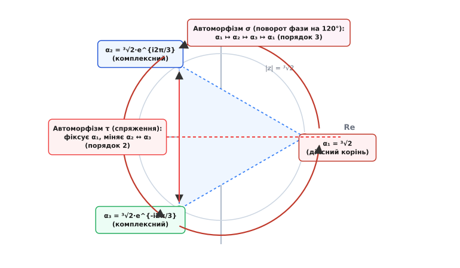
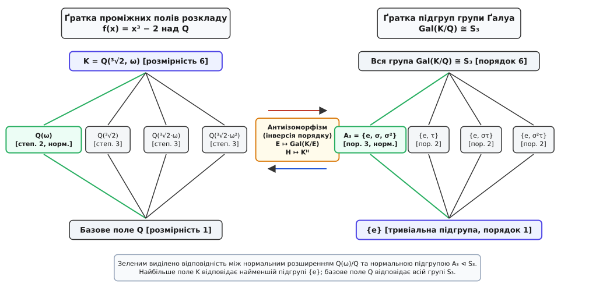
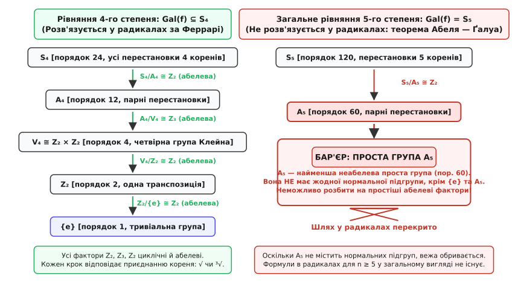

# Група Ґалуа

<preknowlist>
- [Поля та їхні розширення](topic:math/field) — означення числового поля, операції ділення та поняття підполя.
- [Групи, підгрупи й теорема Лагранжа](topic:math/group-theory) — аксіоми групи, порядки елементів та розбиття на суміжні класи.
- [Многочлени та їхні корені](topic:math/polynomials) — корінь многочлена, подільність та розклад на множники.
- [Незвідні многочлени](topic:math/irreducible-polynomials) — многочлени, які неможливо розкласти на добуток менших степенів над заданим полем.
</preknowlist>

Уявіть, що перед вами стоїть задача знайти точні значення коренів рівняння п'ятого степеня, наприклад `x⁵ − 4x + 2 = 0`. Для квадратного рівняння ви ще зі школи знаєте формулу через дискримінант і квадратний корінь. Для кубічного рівняння італійські математики XVI століття Тарталья й Кардано вивели формулу з кубічними та квадратними коренями. Для четвертого степеня Людовіко Феррарі знайшов ще довшу, але цілком робочу формулу. Здавалося б, для п'ятого степеня формула має бути просто ще трохи довшою. Проте впродовж трьохсот років найвидатніші математики світу зазнавали поразки за поразкою.

Причина виявилася приголомшливою: такої формули взагалі не існує в природі. І справа не в тому, що людство не додумалося до достатньо хитрої комбінації коренів. Справа в тому, що самі корені многочлена пов'язані між собою невидимою системою симетрій. Якщо ця система симетрій має правильну форму, корені можна виразити через звичайні радикали. Якщо ж симетрія влаштована занадто жорстко, вихід у радикали блокується на рівні фундаментальних законів алгебри.

Цю систему симетрій називають **групою Ґалуа** (фр. *groupe de Galois*, на честь Евариста Ґалуа, який відкрив її у 1830–1832 роках). Вона стала тим містком, який назавжди об'єднав теорію чисел, геометрію та абстрактну алгебру.

### Що таке нерозрізненість коренів

Візьмемо найпростіший нетривіальний приклад: рівняння `x² − 2 = 0`. Його коренями є два числа: `+√2` та `−√2`.

З погляду раціональних чисел `Q` (звичайних дробів) обидва ці числа абсолютно однакові: жодне з них не є раціональним, обидва при піднесенні до квадрата дають рівно 2. Якщо ми візьмемо будь-яке алгебраїчне співвідношення з раціональними коефіцієнтами, яке виконується для `+√2`, і скрізь замінимо `+√2` на `−√2`, рівність залишиться абсолютно правильною. Наприклад:

```
(√2)² − 2 = 0       =>   (−√2)² − 2 = 0       [обидва корені задовольняють рівняння]
(√2)³ − 2·(√2) = 0  =>   (−√2)³ − 2·(−√2) = 0 [будь-яке раціональне відношення зберігається]
```

Ця взаємна заміна `√2 ↦ −√2` є симетрією числового поля `Q(√2)` (поля чисел вигляду `a + b·√2`, де `a, b ∈ Q`). Вона зберігає операції додавання й множення:

```
(a + b·√2) + (c + d·√2) = (a + c) + (b + d)·√2
(a + b·√2) · (c + d·√2) = (a·c + 2·b·d) + (a·d + b·c)·√2
```

Якщо ми замінимо знак перед `√2` в обох частинах цих рівностей, структура операцій не порушиться. Відображення, яке зберігає додавання, множення і залишає раціональні числа нерухомими, називають **автоморфізмом поля**.

Для поля `Q(√2)` існують рівно два таких автоморфізми:
1. Тотожний автоморфізм `e`: нічого не змінює (`√2 ↦ √2`).
2. Автоморфізм спряження `σ`: міняє знак ірраціональності (`√2 ↦ −√2`).

Разом вони утворюють групу з двох елементів `{e, σ}`, у якій `σ · σ = e`. Ця група ізоморфна циклічній групі `Z₂`. Вона і є групою Ґалуа розширення `Q(√2)` над полем `Q`.

### Автоморфізми та розширення полів

Сформулюємо загальне поняття строго та повільно, крок за кроком називаючи кожен символ.

Нехай задано базове числове поле, яке ми позначимо буквою `F` (від англійського *field* — поле; зазвичай це поле раціональних чисел `Q`). Нехай `K` — більше поле, яке містить у собі поле `F` як підмножину. Ми говоримо, що задано **розширення поля**, і записуємо це як `K / F` (читається «K над F»).

Поле `K` можна розглядати як векторний простір над базовим полем `F`. Розмірність цього векторного простору називають **степенем розширення** і позначають символом `[K : F]`.

Для вежі розширень `F ⊆ E ⊆ K` діє фундаментальна теорема про добуток степенів:

```
[K : F] = [K : E] · [E : F]      [закон збереження розмірності векторного простору]
```

Ця формула грає роль закону збереження розмірності: якщо загальний степінь розширення `[K : F] = 6`, то будь-яке проміжне поле `E` може мати степінь над `F` лише 1, 2, 3 або 6 (дільники числа 6). Жодного проміжного підполя степеня 4 або 5 існувати не може.

**Автоморфізмом розширення `K / F`** називають взаємно однозначне відображення `σ: K → K`, яке задовольняє три обов'язкові умови:
1. Зберігає додавання: для будь-яких двох елементів `x` та `y` з поля `K` виконується `σ(x + y) = σ(x) + σ(y)`.
2. Зберігає множення: для будь-яких двох елементів `x` та `y` з поля `K` виконується `σ(x · y) = σ(x) · σ(y)`.
3. Фіксує базове поле: для будь-якого раціонального числа `c` з поля `F` виконується `σ(c) = c`.

Множина всіх таких автоморфізмів утворює групу щодо операції композиції (послідовного виконання відображень). Цю групу позначають `Aut(K/F)`.

Чому автоморфізми важливі для рівнянь? Нехай многочлен `f(x) = aₙ·xⁿ + ... + a₁·x + a₀` має коефіцієнти `aᵢ` з базового поля `F`, і нехай `α` — корінь цього многочлена в полі `K`, тобто `f(α) = 0`. Застосуємо автоморфізм `σ` до обох частин рівності:

```
f(α) = 0                                       [за умовою: α є коренем f(x)]
σ(f(α)) = σ(0)                                 [застосували автоморфізм σ]
σ(aₙ·αⁿ + ... + a₁·α + a₀) = 0                 [розписали многочлен]
σ(aₙ)·σ(α)ⁿ + ... + σ(a₁)·σ(α) + σ(a₀) = 0     [автоморфізм зберігає додавання, множення і степені]
aₙ·(σ(α))ⁿ + ... + a₁·(σ(α)) + a₀ = 0         [коефіцієнти aᵢ належать F, тому σ(aᵢ) = aᵢ]
f(σ(α)) = 0                                    [за означенням многочлена f]
```

Ми отримали залізний закон: **автоморфізм поля зобов'язаний переводити будь-який корінь многочлена в інший корінь того самого многочлена**.

Автоморфізм не може створити нове число, якого не було серед коренів: він може лише **переставити корені місцями**. Тому групу автоморфізмів завжди можна розглядати як групу перестановок коренів многочлена.

### Поле розкладу та розширення Ґалуа

Щоб вивчити всі симетрії многочлена `f(x)`, одного кореня замало: нам потрібне поле, яке містить **усі** його корені.

Поле `K` називають **полем розкладу** многочлена `f(x)` над базовим полем `F`, якщо воно утворюється приєднанням до `F` усіх коренів многочлена `{α₁, α₂, ..., αₙ}`:

```
K = F(α₁, α₂, ..., αₙ)      [найменше поле, що містить F і всі корені f(x)]
```

Розширення `K / F` називають **розширенням Ґалуа** (або нормальним і сепарабельним розширенням), якщо виконуються дві умови:
1. **Нормальність**: кожен незвідний многочлен з коефіцієнтами з `F`, який має хоча б один корінь у `K`, повністю розпадається на лінійні множники в полі `K`. Тобто поле розкладу містить усі спряжені корені без винятку.
2. **Сепарабельність**: многочлен не має кратних коренів. Для числових полів над `Q` ця умова виконується завжди автоматично.

Для розширень Ґалуа кількість елементів групи автоморфізмів `|Aut(K/F)|` завжди в точності дорівнює степеню розширення `[K : F]`. У цьому випадку групу автоморфізмів називають **групою Ґалуа розширення** і позначають `Gal(K/F)` або `Gal(f/F)`.

### Приклад 1: Біквадратичне розширення Q(√2, √3) над Q

Перш ніж переходити до складніших кубічних симетрій, розглянемо поле, утворене приєднанням двох незалежних квадратних коренів: `K = Q(√2, √3)`.

Кожен елемент цього поля можна однозначно записати як лінійну комбінацію чотирьох базисних елементів:

```
x = c₀ + c₁·√2 + c₂·√3 + c₃·√6,   де cᵢ ∈ Q
```

Степінь розширення `[K : Q] = 4`. За правилом розширень Ґалуа група `Gal(K/Q)` містить рівно 4 автоморфізми. Кожен автоморфізм однозначно визначається тим, куди він переводить `√2` та `√3`:
- `σ₁ = e`: `√2 ↦ √2`, `√3 ↦ √3` (тотожне відображення).
- `σ₂`: `√2 ↦ −√2`, `√3 ↦ √3` (змінює знак при `√2`).
- `σ₃`: `√2 ↦ √2`, `√3 ↦ −√3` (змінює знак при `√3`).
- `σ₄ = σ₂ · σ₃`: `√2 ↦ −√2`, `√3 ↦ −√3` (змінює знаки при обох коренях, але зберігає їхній добуток `√6`).

Кожен нетотожний автоморфізм при повторному застосуванні повертає початкові значення: `σ₂² = σ₃² = σ₄² = e`. Це означає, що група Ґалуа є прямою сумою двох циклічних груп і ізоморфна **четвірній групі Клейна**:

```
Gal(Q(√2, √3) / Q) ≅ Z₂ × Z₂ ≅ V₄
```

Знайдемо фіксовані поля для кожної з трьох нетривіальних підгруп порядку 2:
1. Підгрупа `{e, σ₂}` фіксує всі числа, що не містять `√2` — її фіксованим полем є `Q(√3)`.
2. Підгрупа `{e, σ₃}` фіксує всі числа, що не містять `√3` — її фіксованим полем є `Q(√2)`.
3. Підгрупа `{e, σ₄}` фіксує вирази, де знаки міняються одночасно: оскільки `σ₄(√6) = σ₄(√2)·σ₄(√3) = (−√2)·(−√3) = √6`, її фіксованим полем є `Q(√6)`.

Це поле має так званий **примітивний елемент**: якщо розглянути суму `α = √2 + √3`, то послідовні степені `α, α², α³, α⁴` породжують мінімальний многочлен `x⁴ − 10x² + 1 = 0`. Отже, все розширення `Q(√2, √3)` можна отримати приєднанням одного-єдиного числа `√2 + √3`.

### Приклад 2: Неабелева симетрія поля розкладу x³ − 2 над Q

Розглянемо тепер класичний кубічний многочлен `f(x) = x³ − 2 = 0` над полем раціональних чисел `Q`.

Знайдемо всі три його корені на комплексній площині. Позначимо через `³√2` єдиний додатний дійсний корінь. Два інші корені є комплексними й утворюються множенням дійсного кореня на комплексні кубічні корені з одиниці `ω = e^{i 2π/3} = −1/2 + i·√3/2` та `ω² = e^{−i 2π/3} = −1/2 − i·√3/2`:

```
α₁ = ³√2                      [дійсний корінь]
α₂ = ³√2 · ω = ³√2 · (−1/2 + i·√3/2)   [перший комплексний корінь]
α₃ = ³√2 · ω² = ³√2 · (−1/2 − i·√3/2)  [другий комплексний корінь]
```


*Три корені многочлена x³ − 2 утворюють рівносторонній трикутник на колі радіуса ³√2 у комплексній площині. Автоморфізм σ здійснює циклічний поворот фази на 120° (α₁ ↦ α₂ ↦ α₃ ↦ α₁), а автоморфізм τ діє як комплексна спряженість, відбиваючи площину відносно дійсної осі Re та міняючи місцями α₂ ↔ α₃.*

Поле розкладу `K` утворюється приєднанням дійсного кореня `³√2` та первісного кореня з одиниці `ω` (який еквівалентний приєднанню `i·√3`):

```
K = Q(³√2, ω) = Q(³√2, i·√3)      [поле розкладу x³ − 2 над Q]
```

Обчислимо степінь цього розширення за правилом вежі:
1. Приєднання `³√2` до `Q`: многочлен `x³ − 2` незвідний над `Q` за критерієм Ейзенштейна для простого числа `p = 2`. Тому `[Q(³√2) : Q] = 3`.
2. Приєднання `ω` до `Q(³√2)`: число `ω` задовольняє квадратичне рівняння `x² + x + 1 = 0`, яке не має дійсних коренів. Оскільки поле `Q(³√2)` суто дійсне, цей многочлен незвідний над `Q(³√2)`. Тому `[K : Q(³√2)] = 2`.
3. За правилом добутку степенів векторних просторів:

```
[K : Q] = [K : Q(³√2)] · [Q(³√2) : Q] = 2 · 3 = 6
```

Степінь розширення дорівнює 6, отже, група Ґалуа `Gal(K/Q)` містить рівно 6 автоморфізмів.

Опишемо ці 6 автоморфізмів через їхню дію на два генератори поля — `³√2` та `ω`:
1. **Поворот `σ` (порядок 3):**
   `σ(³√2) = ³√2 · ω`, `σ(ω) = ω`.
   Цей автоморфізм діє на корені як циклічна перестановка: `α₁ ↦ α₂ ↦ α₃ ↦ α₁` (порядок 3, бо `σ³ = e`).
2. **Відбиття `τ` (комплексне спряження, порядок 2):**
   `τ(³√2) = ³√2`, `τ(ω) = ω²`.
   Цей автоморфізм залишає дійсний корінь `α₁` на місці та міняє місцями два комплексні корені: `α₂ ↔ α₃` (порядок 2, бо `τ² = e`).

Легко перевірити співвідношення між ними:

```
τ · σ · τ = σ⁻¹ = σ²      [комутаційне співвідношення групи діедра]
```

Це в точності співвідношення симетричної групи `S₃` (яка одночасно є групою симетрій правильного трикутника `D₃`). Група Ґалуа многочлена `x³ − 2` над `Q` ізоморфна повній симетричній групі перестановок трьох елементів:

```
Gal(Q(³√2, ω) / Q) ≅ S₃      [група симетрій коренів кубічного многочлена]
```

### Двоїстість Ґалуа: місток між підполями та підгрупами

Головне відкриття Ґалуа полягає у встановленні дзеркальної відповідності між підполями поля розкладу та підгрупами групи Ґалуа.

Нехай `H` — довільна підгрупа групи `Gal(K/F)`. Розглянемо множину всіх елементів поля `K`, які залишаються абсолютно нерухомими під дією кожного автоморфізму з підгрупи `H`. Цю множину позначають `Kᴴ` і називають **фіксованим полем підгрупи H**:

```
Kᴴ = { x ∈ K | ∀ σ ∈ H: σ(x) = x }      [означення фіксованого поля]
```

Множина `Kᴴ` завжди є повноцінним числовим підполем між `F` та `K`.


*Двоїстість Ґалуа для многочлена x³ − 2 над Q. Ліворуч показано ґратку проміжних числових полів, праворуч — ґратку підгруп групи S₃. Порядок включення інвертується: найбільшому полю K відповідає найменша підгрупа {e}, а базовому полю Q відповідає вся група S₃. Зеленим кольором виділено нормальне квадратичне розширення Q(ω)/Q та відповідну нормальну підгрупу A₃ ⊲ S₃.*

Теорема Лаґранжа про підгрупи стверджує, що порядок будь-якої підгрупи `H` ділить порядок усієї групи `G`: `|G| = |H| · [G : H]`. У теорії Ґалуа це алгебраїчне співвідношення дзеркально повторює геометричне правило добутку степенів векторних просторів:

```
[K : F] = [K : Kᴴ] · [Kᴴ : F]   де   [K : Kᴴ] = |H|,  [Kᴴ : F] = [G : H]
```

Погляньмо на цю відповідність для нашого многочлена `x³ − 2`:

1. **Підгрупа порядку 3:** `A₃ = {e, σ, σ²}`.
   Автоморфізм `σ` змінює `³√2`, але зберігає `ω`. Тому фіксованим полем для `A₃` є квадратичне поле `Q(ω) = Q(i·√3)`. Степінь цього поля над `Q` дорівнює `6 / 3 = 2`.
   Оскільки `A₃` є **нормальною підгрупою** в `S₃` (ліві суміжні класи збігаються з правими), розширення `Q(ω) / Q` є нормальним розширенням Ґалуа.

2. **Три підгрупи порядку 2:**
   - `H₁ = {e, τ}` фіксує дійсний корінь `³√2`. Її фіксоване поле — `Q(³√2)`.
   - `H₂ = {e, σ·τ}` фіксує другий корінь `³√2 · ω`. Її фіксоване поле — `Q(³√2 · ω)`.
   - `H₃ = {e, σ²·τ}` фіксує третій корінь `³√2 · ω²`. Її фіксоване поле — `Q(³√2 · ω²)`.
   Кожне з цих трьох кубічних полів має степінь `6 / 2 = 3` над `Q`. Оскільки підгрупи `H₁, H₂, H₃` **не є нормальними** в `S₃`, жодне з цих трьох полів не є нормальним розширенням над `Q` (дійсне поле `Q(³√2)` містить лише один корінь `x³ − 2`, а два інші комплексні корені випадають за його межі).

3. **Крайні випадки:**
   - Вся група `S₃` фіксує лише базове поле `Q`.
   - Тривіальна підгрупа `{e}` фіксує все поле `K = Q(³√2, ω)`.

Цей дивовижний паралелізм називають **Головною теоремою теорії Ґалуа**. Прочитати [детальне доведення головної теореми теорії Ґалуа](topic:math/galois-group/math-fundamental-galois-theorem.md) з лемою Дедекінда про лінійну незалежність автоморфізмів та теоремою Артіна можна в окремому математичному виведенні.

### Циклотомічні поля та правильний 17-кутник Ґаусса

Особливе місце в теорії Ґалуа посідають **поля поділу кола (циклотомічні поля)**, які утворюються приєднанням первісних коренів степеня `n` з одиниці: `ζₙ = e^{i 2π / n}`.

Многочлен `xⁿ − 1` має корені `ζₙᵏ` для `k = 0, 1, ..., n − 1`. Його незвідні над `Q` множники називають **круговими многочленами** (або многочленами поділу кола) `Φₙ(x)`.
Якщо `p` — просте число, то:

```
Φₚ(x) = xᵖ⁻¹ + xᵖ⁻² + ... + x + 1      [круговий многочлен для простого числа p]
```

Степінь розширення `[Q(ζₚ) : Q] = p − 1`. Будь-який автоморфізм `σ` зобов'язаний переводити первісний корінь `ζₚ` в інший первісний корінь `ζₚᵃ`, де `a ∈ {1, 2, ..., p − 1}`. Операція композиції автоморфізмів у точності відповідає множенню за модулем `p`. Тому група Ґалуа циклотомічного поля ізоморфна мультиплікативній групі залишків:

```
Gal(Q(ζₚ) / Q) ≅ (Z/pZ)ˣ ≅ Zₚ₋₁      [циклічна група порядку p - 1]
```

1796 року дев'ятнадцятирічний Карл Фрідріх Ґаусс зробив відкриття, яке вразило математичний світ: він довів можливість побудови **правильного 17-кутника** циркулем і лінійкою.

Секрет криється в будові групи Ґалуа! Число 17 є простим, тому група Ґалуа `Gal(Q(ζ₁₇) / Q)` є циклічною групою порядку `17 − 1 = 16`. А число 16 є степенем двійки: `16 = 2⁴`.
Циклічну групу `Z₁₆` можна розбити на вежу нормальних підгруп, де кожен крок має індекс 2:

```
Z₁₆ ⊳ Z₈ ⊳ Z₄ ⊳ Z₂ ⊳ {e}      [вежа підгруп індексу 2]
```

За Головною теоремою Ґалуа цьому ланцюжку підгруп відповідає вежа квадратичних розширень полів степеня 2:

```
Q = K₀ ⊂ K₁ ⊂ K₂ ⊂ K₃ ⊂ K₄ = Q(ζ₁₇),   де [Kᵢ₊₁ : Kᵢ] = 2
```

Оскільки кожен крок є квадратним рівнянням, косинус кута `cos(2π/17)` можна виразити виключно через вкладені квадратні корені, що робить геометричну побудову 17-кутника циркулем і лінійкою абсолютно можливою! Загальне правило Ґаусса — Ванцеля стверджує: правильний `n`-кутник будується циркулем і лінійкою тоді й тільки тоді, коли `n = 2ᵏ · p₁ · p₂ · ... · pₘ`, де `pᵢ` — різні прості числа Ферма вигляду `2^{2ᵐ} + 1` (відомі лише 3, 5, 17, 257, 65537).

### Чому загальне рівняння 5-го степеня не розв'язується в радикалах

Тепер ми маємо всі інструменти, щоб відповісти на головне запитання, яке три століття хвилювало математиків: чому квадратні, кубічні та рівняння 4-го степеня розв'язуються за формулами з коренями, а рівняння 5-го степеня — ні?

Що таке приєднання кореня степеня `n` мовою груп?
Якщо поле вже містить корені з одиниці, приєднання радикала `ⁿ√a` розширює поле, додаючи циклічну групу симетрій `Zₙ`.
Отже, розв'язати рівняння в радикалах означає побудувати ланцюжок приєднань коренів:

```
Q = K₀ ⊂ K₁ ⊂ K₂ ⊂ ... ⊂ Kₘ      [радикальна вежа розширень полів]
```

За Головною теоремою Ґалуа цьому ланцюжку полів відповідає спадний ланцюжок підгруп групи Ґалуа:

```
G = G₀ ⊳ G₁ ⊳ G₂ ⊳ ... ⊳ Gₘ = {e}      [нормальний ряд підгруп]
```

у якому кожна фактор-група `Gᵢ / Gᵢ₊₁` зобов'язана бути простою **абелевою (циклічною)** групою `Zₚ`.

Групу, яку можна розкласти на такий ланцюжок циклічних факторів, називають **розв'язною групою** (фр. *groupe résoluble*).


*Порівняння структури розв'язності. Ліворуч: симетрична група S₄ рівняння 4-го степеня розкладається у вежу нормальних підгруп із простими абелевими факторами Z₂, Z₃, Z₂, Z₂, що дозволяє виразити корені через радикали за методом Феррарі. Праворуч: симетрична група S₅ рівняння 5-го степеня містить знакозмінну підгрупу A₅ порядку 60, яка є простою неабелевою групою без жодних нормальних підгруп; вежа обривається, що унеможливлює існування загальної формули в радикалах.*

Погляньмо на симетричні групи різних степенів:
- Для степеня 2: `S₂ ≅ Z₂` — циклічна й абелева. Квадратне рівняння розв'язується через звичайний квадратний корінь.
- Для степеня 3: ряд `S₃ ⊳ A₃ ⊳ {e}` має фактори `S₃ / A₃ ≅ Z₂` та `A₃ ≅ Z₃`. Усі фактори циклічні, тому `S₃` розв'язна (формула Кардано послідовно витягає `√Δ`, а потім кубічний корінь).
- Для степеня 4: ряд `S₄ ⊳ A₄ ⊳ V₄ ⊳ Z₂ ⊳ {e}`, де `V₄ ≅ Z₂ × Z₂` — четвірна група Клейна. Фактори дорівнюють `Z₂, Z₃, Z₂, Z₂` — усі циклічні, тому `S₄` розв'язна (метод Феррарі зводить задачу до кубічної резольвенти).

Але при переході до степеня `n = 5` ми вдаряємося в нездоланний бар'єр. Група `S₅` має порядок `5! = 120`. Її єдина нетривіальна нормальна підгрупа — це знакозмінна група `A₅` (парні перестановки 5 елементів) порядку 60.

Знакозмінна група `A₅` є **найменшою неабелевою простою групою**: вона не має жодної власної нормальної підгрупи, крім `{e}` та самої `A₅`. Її неможливо розкласти на менші циклічні цеглинки!

Ланцюжок підгруп для `S₅` обривається на першому ж кроці: `S₅ ⊳ A₅ ⊳ {e}`. Фактор `S₅ / A₅ ≅ Z₂` є абелевим, але наступний фактор `A₅ / {e} ≅ A₅` є простою неабелевою групою порядку 60. Група `S₅` **не є розв'язною**.

### Конкретний нерозв'язний приклад: x⁵ − 4x + 2 = 0

Щоб переконатися, що це не просто абстрактна теорія, дослідимо конкретний цілочисловий многочлен `f(x) = x⁵ − 4x + 2`.

1. **Незвідність:** За критерієм Ейзенштейна для простого числа `p = 2`:
   - Число 2 ділить коефіцієнти при `x⁴, x³, x², x¹` та вільний член 2.
   - Число 2 не ділить старший коефіцієнт 1.
   - Число `2² = 4` не ділить вільний член 2.
   Отже, многочлен `f(x)` незвідний над полем `Q`. За теоремою Ґалуа це означає, що його група Ґалуа діє **транзитивно** на 5 коренях, а порядок групи `|Gal(f/Q)|` ділиться на 5 (містить 5-цикл `σ`).

2. **Підрахунок дійсних коренів:** Обчислимо похідну `f'(x) = 5x⁴ − 4`. Вона обнуляється у двох дійсних точках `x = ± ⁴√(4/5) ≈ ± 0.945`.
   - При `x → −∞`: `f(x) → −∞`.
   - У точці локального максимуму `x ≈ −0.945`: `f(−0.945) ≈ 4.42 > 0`. За теоремою Больцано — Коші на проміжку `(−∞, −0.945)` існує один дійсний корінь.
   - У точці локального мінімуму `x ≈ +0.945`: `f(+0.945) ≈ −0.42 < 0`. На проміжку `(−0.945, +0.945)` існує другий дійсний корінь.
   - При `x → +∞`: `f(x) → +∞`. На проміжку `(+0.945, +∞)` існує третій дійсний корінь.

Многочлен має рівно 3 дійсні корені та рівно 2 комплексні спряжені корені.

3. **Комплексне спряження:** Автоморфізм комплексної спряженості `τ` залишає всі 3 дійсні корені нерухомими, а 2 комплексні корені міняє місцями. Мовою перестановок `τ` є **транспозицією** двох елементів `(α₄ α₅)`.

4. **Генерація всієї групи:** Відома теорема теорії груп стверджує: **будь-яка транспозиція та будь-який простий цикл довжини p разом породжують усю симетричну групу Sₚ**.
   Оскільки група `Gal(f/Q)` містить 5-цикл `σ` та транспозицію `τ`, вона збігається з усією повною групою перестановок:

```
Gal(x⁵ − 4x + 2 / Q) ≅ S₅      [група Ґалуа є повною симетричною групою]
```

Оскільки група `S₅` не є розв'язною, корені многочлена `x⁵ − 4x + 2 = 0` принципово неможливо виразити через коефіцієнти за допомогою будь-якої скінченної комбінації знаків додавання, віднімання, множення, ділення та витягання коренів довільних степенів.

Дізнатися більше про [драматичну історію відкриття та дуелі Ґалуа](topic:math/galois-group/hist-galois-duel.md) можна в історичному нарисі про фатальну ніч травневого ранку 1832 року.

### Геометричні заборони античності: лінійка й циркуль

Теорія Ґалуа дала тріумфальну й остаточну відповідь на три знамениті геометричні задачі давньогрецької математики, які залишалися нерозв'язаними понад дві тисячі років:
1. **Подвоєння куба** (побудувати ребро куба, об'єм якого вдвічі більший за заданий).
2. **Трисекція кута** (розділити довільний кут на три рівні частини за допомогою лише циркуля та лінійки без поділок).
3. **Квадратура круга** (побудувати квадрат, площа якого дорівнює площі заданого круга).

Мовою розширень полів кожна побудова циркулем і лінійкою — це знаходження точки перетину двох прямих, прямої й кола або двох кіл. Алгебраїчно перетин прямих дає лінійні рівняння, а перетин з колом — квадратні рівняння. Отже, будь-яка точка, яку можна побудувати циркулем і лінійкою за скінченну кількість кроків, має координати, що лежать у вежі **квадратичних розширень** над полем `Q`:

```
Q = K₀ ⊂ K₁ ⊂ K₂ ⊂ ... ⊂ Kₘ,   де [Kᵢ₊₁ : Kᵢ] = 2
```

За правилом добутку степенів векторних просторів загальний степінь побудованого поля над `Q` зобов'язаний бути степенем двійки:

```
[Kₘ : Q] = 2ᵐ      [закон збереження степеня для побудов циркулем і лінійкою]
```

Тепер погляньмо на античні задачі крізь призму цього закону:
- **Подвоєння куба:** Нехай початковий куб має ребро довжини 1 і об'єм 1. Подвоєний куб повинен мати об'єм 2, тобто довжина його ребра `x` задовольняє рівняння `x³ − 2 = 0`. Число `³√2` породжує розширення `Q(³√2)` степеня 3 над `Q`. Оскільки число 3 не є степенем двійки (`3 ≠ 2ᵐ`), подвоїти куб циркулем і лінійкою **неможливо**.
- **Трисекція кута:** Візьмемо кут 60°. Якби його можна було поділити на три частини (до кута 20°), ми могли б побудувати число `u = cos(20°)`. За тригонометричною формулою потрійного кута:

```
cos(60°) = 4·cos³(20°) − 3·cos(20°)
1/2 = 4·u³ − 3·u
8·u³ − 6·u − 1 = 0      [кубічне рівняння трисекції кута 60°]
```

Зробивши заміну `y = 2u`, маємо `y³ − 3y − 1 = 0`. Цей многочлен не має раціональних коренів і є незвідним над `Q`. Степінь розширення `[Q(cos 20°) : Q] = 3`. Оскільки 3 не ділить `2ᵐ`, трисекція кута 60° циркулем і лінійкою **неможлива**.
- **Квадратура круга:** Вимагає побудови відрізка довжини `√π`. 1882 року Фердинанд фон Ліндеман довів, що число `π` є трансцендентним (не є коренем жодного многочлена з раціональними коефіцієнтами). Тому степінь `[Q(π) : Q] = ∞`, що остаточно ховає надію на квадратуру круга.

### Обернена проблема Ґалуа та диференціальні рівняння

З розвитком алгебри виникло зворотне фундаментальне запитання: якщо кожному многочлену відповідає певна скінченна група, то чи правильне зворотне? Чи можна для **будь-якої наперед заданої скінченної групи G** знайти такий многочлен над `Q`, щоб його групою Ґалуа була саме `G`?

Цю проблему називають **оберненою проблемою теорії Ґалуа** (*Inverse Galois Problem*), і вона досі залишається однією з найбільших відкритих загадок математики:
- Для всіх **абелевих груп** теорема Кронекера — Вебера (1853) дає ствердну відповідь: будь-яке абелеве розширення `Q` лежить усередині деякого циклотомічного поля `Q(ζₙ)`.
- Для всіх **розв'язних груп** видатний алгебраїст Ігор Шафаревич 1954 року повністю розв'язав задачу, побудувавши загальну теорію розв'язних розширень.
- Для симетричних та знакозмінних груп `Sₙ` і `Aₙ` Давид Гільберт 1892 року довів їхню реалізовність за допомогою своєї знаменитої теореми про незвідність.
- Проте для довільних неабелевих простих груп (включно з гігантською групою Монстр порядку `~8 · 10⁵³`) загальна реалізовність над `Q` залишається недоведеною.

Ще одним дивовижним продовженням ідей Ґалуа стала **диференціальна теорія Ґалуа (теорія Пікара — Вессіо)**. Вона відповідає на запитання: чому такі звичні інтеграли, як функція помилок `∫ e^{-x²} dx`, інтегральний синус `∫ (sin x)/x dx` чи `∫ e^{eˣ} dx`, неможливо виразити через елементарні функції?

У диференціальній алгебрі замість числових полів розглядаються поля функцій, оснащені операцією диференціювання, а група Ґалуа перетворюється на неперервну алгебраїчну групу Лі симетрій лінійного диференціального рівняння. Неінтегровність у елементарних функціях виникає тоді й тільки тоді, коли диференціальна група Ґалуа містить нерозв'язну компоненту одиниці!

### Сучасні відлуння: від криптографії до квантової фізики

Ідеї Ґалуа не залишилися абстрактним пам'ятником математики XIX століття. Сьогодні вони лежать в основі найсучасніших інженерних і фізичних технологій:

**1. Криптографія та скінченні поля (поля Ґалуа):**
Кожен сучасний комп'ютер і смартфон щосекунди виконує мільйони операцій у скінченних полях, які в комп'ютерних науках називають **полями Ґалуа** `GF(pⁿ)`.
- У міжнародному стандарті симетричного шифрування **AES (Rijndael)** таблиця нелінійних замін (S-box) будується на операції взяття оберненого елемента в полі Ґалуа `GF(2⁸) = GF(256)`.
- Група Ґалуа скінченного розширення `GF(pⁿ) / GF(p)` є циклічною групою порядку `n`, породженою єдиним автоморфізмом — **відображенням Фробеніуса** `x ↦ xᵖ`. Завдяки цьому автоморфізму здійснюється швидке піднесення до степеня в еліптичній криптографії (ECDSA, Curve25519) та обчислення контрольних сум CRC і кодів Ріда — Соломона, які виправляють помилки під час читання QR-кодів і передачі даних із космічних апаратів.

**2. Квантова фізика та виродження рівнів енергії:**
У квантовій механіці симетрії гамільтоніана системи (оператора енергії `Ĥ`) утворюють групу. За теоремою Вігнера про представлення груп симетрій, якщо група симетрій неабелева, рівні енергії квантової системи є **виродженими** (кілька різних квантових станів мають однакову енергію). Розщеплення енергетичних рівнів в атомах під дією зовнішнього магнітного поля (ефект Зеемана) або електричного поля (ефект Штарка) точно відповідає звуженню групи Ґалуа при розширенні поля спостережуваних фізичних величин.

**3. Програма Ленґлендса та Велика теорема Ферма:**
У сучасній теоретичній фізиці та теорії чисел центральне місце посідає **абсолютна група Ґалуа** `Gal(Q̄ / Q)` — група симетрій усіх алгебраїчних чисел над раціональними. 1994 року Ендрю Вайлс довів Велику теорему Ферма, встановивши глибокий зв'язок між представленнями груп Ґалуа еліптичних кривих та модульними формами.

Ознайомитися з програмним алгоритмом обчислення резольвент Лаґранжа та дискримінантів можна у проекті про [обчислення груп Ґалуа многочленів на C та C++](topic:math/galois-group/proj-galois-computation.md).

Теорія Ґалуа назавжди змінила науковий світогляд людства: вона довела, що істинна природа речей криється не в числових значеннях, а в архітектурі симетрій, які ними керують.
