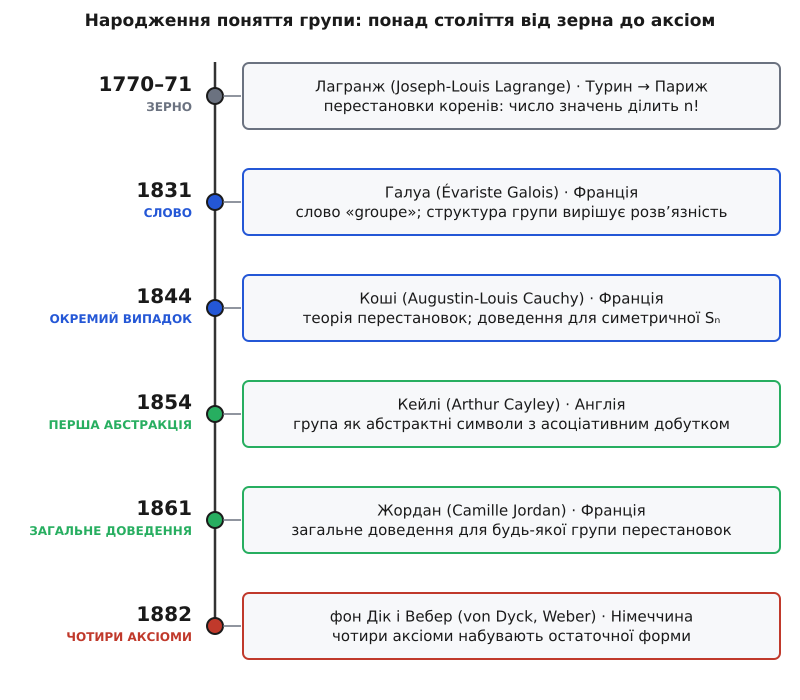

# 📜 Хто справді довів теорему Лагранжа: сто років народження групи

Теорема Лагранжа носить імʼя людини, яка ніколи її не сформулювала, не довела в тому вигляді, у якому ми її знаємо, і навіть не мала слова «група». Це не помилка й не несправедливість — це слід довгої історії, у якій туманна здогадка про рівняння понад століття перетворювалася на точну абстракцію, проходячи через руки італійця, норвежця, кількох французів, англійця й німців. Розплутати цю історію варто хоча б тому, що вона показує, як узагалі народжуються математичні поняття: не спалахом в одній голові, а повільним відшаровуванням ідеї від прикладів, у яких вона вперше майнула.

### Справжня задача XVIII століття: чому не піддається пʼятий степінь

Уся ця історія почалася не з абстрактних груп, а з дуже конкретного розчарування. Квадратне рівняння вміли розвʼязувати ще у Вавилоні; для кубічного й для рівняння четвертого степеня формули через корені (радикали) знайшли італійські алгебристи XVI століття — Тарталья, Кардано, Феррарі. Далі стіна: рівняння пʼятого степеня не піддавалося нікому, хоч скільки хитрих підстановок пробували. Два з половиною століття математики вважали, що формула ось-ось знайдеться.

Жозеф-Луї Лагранж (*Joseph-Louis Lagrange*, 1736–1813) поставив глибше запитання. Народжений у Турині як Джузеппе Лодовіко Лагранджа (*Giuseppe Lodovico Lagrangia*), італієць за народженням і французького роду за корінням, він замолоду підписувався то на італійський, то на французький лад — і врешті став окрасою Паризької академії. Замість наосліп шукати формулу для пʼятого степеня, Лагранж запитав: *а чому взагалі спрацьовують готові формули для степенів 2, 3, 4?* Що в них влаштовано так, що корені вдається виразити, — і чи не зламається саме це для пʼятого?

### Лагранж, 1770: перестановки коренів і перше «ділить»

Відповідь Лагранж виклав у праці «Réflexions sur la résolution algébrique des équations» («Роздуми про алгебраїчне розвʼязання рівнянь», 1770–1771). Її ключовий хід — уперше в історії поглянути на корені рівняння не як на конкретні числа, а як на абстрактні величини, які можна **переставляти** місцями. Візьмімо якийсь вираз, складений з коренів, і подивімося, що з ним стається, коли корені міняють ролями всіма можливими способами. Різних способів переставити n предметів — [рівно n!](topic:math/permutations) (для трьох це 6, для пʼяти — вже 120). Лагранж помітив разючу річ: **скільки різних значень набуває вираз під усіма n! перестановками — це число завжди ділить n!**.

Ось цей факт у його рідній оселі — на кубічному рівнянні, де все видно на пальцях.

**Кубічне рівняння x³ + px + q = 0; корені r₁, r₂, r₃; ω — первісний кубічний корінь з одиниці (ω³ = 1, 1 + ω + ω² = 0)**

```
Резольвента Лагранжа:   t = r₁ + ω·r₂ + ω²·r₃

Проженемо корені через усі 6 перестановок і глянемо на t³:
   e,   (1 2 3),  (1 3 2)    — парні    → t³ дорівнює значенню A
  (2 3), (1 3),  (1 2)       — непарні  → t³ дорівнює значенню B

Різних значень — рівно 2, і 2 ділить 6.
```

Ці два значення A і B — корені деякого **квадратного** рівняння, коефіцієнти якого симетричні щодо r₁, r₂, r₃, а тому виражаються через p та q. Розвʼязавши цей квадрат і взявши кубічний корінь, дістаємо стару формулу Кардано. Ось де ховалася розгадка: кубічне рівняння розвʼязне саме тому, що його резольвента набуває лише 2 значень замість 6, а 6/2 = 3 — це і є той кубічний корінь, який усе «розкручує». Для пʼятого степеня такого щасливого падіння числа значень не трапляється — і саме звідси через пів століття виросте доведення, що загальну квінтику радикалами не взяти.

Придивіться до тієї таблиці ще раз. Шість перестановок розпалися на дві групки по три: парні дали одне значення, непарні — інше. Це рівно те розбиття, яке сьогодні звуть підгрупою та її суміжним класом, а рівність «2 ділить 6» — теорема Лагранжа в зародку. Але сам Лагранж не бачив тут жодного з цих слів. Він не складав перестановки одну з одною, не мав ні множини з операцією, ні поняття «підгрупа», ні тим паче «група». Він довів арифметичний факт про те, скільки значень може мати формула, — і на цьому спинився.

> 🔧 **Навіщо розрізняти.** Тут проходить межа, яку в історії математики раз у раз затирають. Одне — **побачити ідею** в частковому випадку (Лагранж: число значень ділить n!). Інше — **дати їй імʼя й предмет** (це зробить Галуа). Третє — **довести загально**, для будь-якого випадку (це зроблять Коші й Жордан). Четверте — **виокремити чисті аксіоми**, відірвані від будь-яких прикладів (це зроблять Кейлі, фон Дік, Вебер). Приписати всю теорему одній людині — означає стерти три з цих чотирьох кроків.

Та сама здогадка тим часом незалежно проросла й на зовсім іншому ґрунті. Карл Фрідріх Гаусс (*Carl Friedrich Gauss*) у «Disquisitiones Arithmeticae» (1801) фактично довів той самий «ділить» для [лишків за простим модулем](topic:math/modular-arithmetic) — для того, що ми тепер звемо мультиплікативною групою (Z/pZ)\*, — теж без жодного слова «група». Один кістяк, а виступив одразу у двох далеких галузях: у теорії рівнянь і в теорії чисел. Це вже було виразним натяком, що кістяк вартий вивчення сам по собі.

### Руффіні й Абель: перестановки на службі неможливого

Першим, хто спробував обернути Лагранжеву ідею проти квінтики, був італієць Паоло Руффіні (*Paolo Ruffini*, 1765–1822). У праці 1799 року він, оперуючи наборами перестановок (він звав їх *permutazione*), доводив, що загальне рівняння пʼятого степеня радикалами не розвʼязується. Доведення було громіздке, з прогалиною, і сучасники його майже не помітили. Строге й прийняте доведення дав норвежець Нільс Генрік Абель (*Niels Henrik Abel*, 1802–1829) у 1824 році — те саме, на честь якого комутативні групи звуть абелевими. Обидва просунули перестановки далеко вперед, але жоден ще не відступив від рівнянь: перестановки лишалися інструментом для конкретної задачі, а не окремим предметом.

### Галуа: слово «група» і думка, що структура вирішує все

Крок від інструмента до предмета зробив Еварист Галуа (*Évariste Galois*, 1811–1832) — француз, чиє коротке життя обірвала дуель у двадцять років. Саме він близько 1831 року вперше усвідомив головне: розвʼязність рівняння радикалами залежить не від самих коренів, а від **структури набору їхніх перестановок** — від того, як ці перестановки складаються між собою. Цей набір Галуа й назвав словом **groupe**. Він же вирізнив особливі підгрупи, «зсув яких зліва збігається зі зсувом справа», — те, що ми звемо нормальними підгрупами, і що виявилося точним критерієм розвʼязності.

Тут доречно розвіяти живучу легенду. Її переказують так: усю свою математику Галуа нашкрябав у гарячковому листі напередодні смертельної дуелі. Насправді більшу частину ідей він виклав раніше, у мемуарах, поданих до Академії (і відхилених та загублених рецензентами); тієї останньої ночі він радше правив і дописував супровідні пояснення. Драма справжня, але переказ її роздуто. Гірше інше: рукописи Галуа пролежали в шухляді ще чотирнадцять років, поки Жозеф Ліувілль (*Joseph Liouville*) не розібрав їх і не опублікував у 1846 році. Слово «група» народилося близько 1831-го, а світ побачив його аж під середину століття — і навіть тоді як назву для набору перестановок, ще не як абстрактну структуру з аксіомами.

### Коші: перестановки стають самостійною наукою

Поки Галуа встиг лише кинути іскру, Оґюстен-Луї Коші (*Augustin-Louis Cauchy*, 1789–1857) методично будував теорію перестановок як окрему дисципліну. Перша його стаття про це вийшла ще 1815 року, а велика праця — «Exercices dʼanalyse et de physique mathématique» — у 1844-му. Коші ввів звичну нам циклічну нотацію, поняття «системи спряжених підстановок» і, що важливо для нашої історії, довів Лагранжеве «ділить» для **симетричної групи Sₙ** — для всіх перестановок n предметів разом. Це був крок від часткового спостереження (значення однієї формули) до твердження про цілий структурований набір. Перестановки нарешті стали предметом, який вивчають заради нього самого, а не заради рівнянь.

### Кейлі: група без прикладів

Найсміливіший крок зробив англієць Артур Кейлі (*Arthur Cayley*, 1821–1895). У праці 1854 року з промовистою назвою «On the theory of groups, as depending on the symbolic equation θⁿ = 1» («Про теорію груп, що спираються на символічне рівняння θⁿ = 1») він уперше означив групу **абстрактно** — як набір символів із асоціативною операцією, замкнений щодо неї, — байдуже, що ці символи означають: перестановки, числа, повороти чи взагалі нічого конкретного. Кістяк нарешті відділився від тіла. Кейлі помітив і те, що таблиця такої операції є латинським квадратом, і — уже в пізніших працях — довів, що будь-яка скінченна група вкладається в якусь Sₙ, тобто абстракція нічого не втрачає порівняно з перестановками.

Кейлі випередив час років на двадцять: його абстрактне означення майже не помітили, бо для нього ще не назбиралося прикладів, які вимагали б такої загальності. До теми він повернувся аж 1878 року, коли ґрунт уже дозрів.

### Жордан: перше загальне доведення

Загальне доведення Лагранжевого факту — уже не для однієї формули й не тільки для Sₙ, а для **будь-якої** групи перестановок — дав француз Каміль Жордан (*Camille Jordan*, 1838–1922) у мемуарі «Mémoire sur le nombre des valeurs des fonctions» (1861). А його «Traité des substitutions et des équations algébriques» (1870) став першою книгою, що звела докупи спадок Галуа й теорію перестановок у струнку будівлю. Отже те, що ми називаємо теоремою Лагранжа, у своїй загальній (для груп перестановок) формі — це радше теорема Жордана, доведена майже через девʼяносто років після Лагранжевого зерна, спираючись дорогою на часткові випадки Гаусса й Коші.

### Дік і Вебер: чотири аксіоми набувають остаточної форми

Лишався останній крок — записати саме ті чотири аксіоми (замкненість, асоціативність, нейтральний елемент, обернений), якими групу означають сьогодні, вже без жодної згадки про перестановки. Тут імен теж кілька, і жодне не «винахідник». Німець Вальтер фон Дік (*Walther von Dyck*, 1856–1934) у працях 1882–1883 років подав групи через твірні й співвідношення — цілком абстрактно. Його співвітчизник Гайнріх Вебер (*Heinrich Weber*, 1842–1913) того ж 1882 року дав аксіоми для скінченних груп (асоціативність, замкненість і скорочення), а в «Lehrbuch der Algebra» (1893–1895) зауважив, що для нескінченних груп скорочення вже не досить — обернений елемент доводиться постулювати окремо. Саме звідси й викристалізувався звичний повний набір аксіом. Означення групи — не чийсь винахід, а осад, що випав наприкінці столітнього процесу; приписати його одному прізвищу було б черговим міфом.

### Чому ж таки «Лагранж»


*Ідея повільно відшаровувалася від прикладів: спершу зерно в теорії рівнянь, потім слово, далі окремі й загальні доведення — і аж наприкінці чисті аксіоми. Кольором позначено рівень абстракції кожного кроку: від конкретного спостереження (сіре) до остаточної абстрактної форми.*

Тепер парадокс із першого абзацу розвʼязується сам собою. Імʼя Лагранжа на теоремі — це не свідчення авторства, а історична вивіска, що вказує на **зерно**: саме Лагранж перший побачив, що структура (скільки значень набуває формула) жорстко обмежує число (ділить n!). Теорему в її сучасній загальності виростили інші — Галуа дав слово й головну думку, Коші й Жордан довели загально, Кейлі, фон Дік і Вебер відлили чисті аксіоми. Назва «теорема Лагранжа» стискає ціле століття в одне прізвище: зручно для розмови, але історично — з великою втратою.

І ще одне впадає в око, коли розкласти цю історію в ряд. Поняття групи не має ні єдиного автора, ні єдиної батьківщини: воно збиралося з праці італійців (Лагранж, Руффіні), норвежця (Абель), французів (Галуа, Коші, Жордан, Ліувілль), англійця (Кейлі) й німців (Гаусс, фон Дік, Вебер) — понад сто років, від 1770-го до 1890-х. Кожен додав рівно один поверх: ідею, слово, часткове доведення, загальне доведення, аксіоми. У цьому й головний урок історії групи: найпотужніші абстрактні поняття не винаходять готовими — їх повільно **відкопують** з-під конкретних задач, і чотири скупі аксіоми, з яких сьогодні починають, стоять у цій історії не на початку, а в самому кінці.
