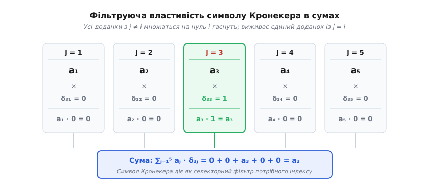
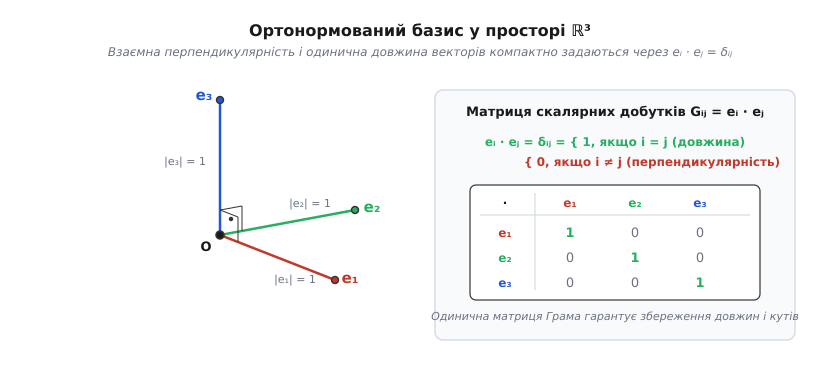
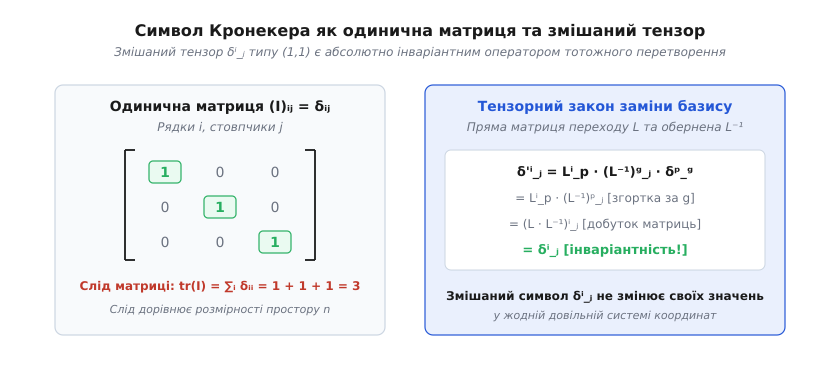
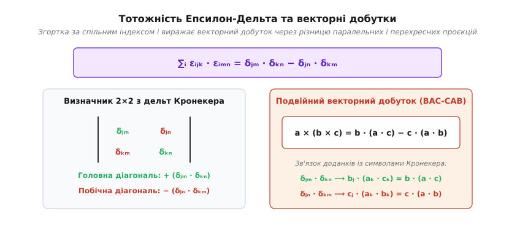

# Символ Кронекера: дискретний фільтр, одиничний оператор та мова тензорних індексів

<preknowlist>
- [Скалярний добуток](book:math/dot-product) — геометричний та алгебраїчний зміст множення векторів, ортогональність та проєкції.
- [Векторний простір](book:math/vector-space) — лінійна незалежність, координати векторів та структура базису.
- [Зміна базису](book:math/change-of-basis) — матриці переходу між системами координат і перетворення компонентів.
- [Визначник матриці](book:math/matrix-determinant) — кососиметричні форми, орієнтація простору та обчислення визначників.
</preknowlist>

Коли інженер розраховує напруження в корпусі літака, програміст моделює фізику взаємодії твердих тіл у тривимірному ігровому рушії, а фізик аналізує квантові стани електронів, у розрахунках постійно постає однакова рутинна потреба: перевірити, чи збігаються два напрямки, дві осі або два індекси у масиві даних. Якщо осі однакові — треба зберегти величину або взяти одиничний множник; якщо осі різні — результат має зникнути, перетворившись на нуль.

Якщо записувати таку логіку через розгалуження умов `if (i == j)` безпосередньо всередині алгебраїчних формул, математичний апарат миттєво втрачає свою силу. Формули розпадаються на громіздкі переліки окремих підпунктів, стає неможливо виконувати аналітичне диференціювання за координатами, міняти порядок підсумовування у подвійних рядах чи компактно записувати просторові закони збереження механіки.

Математичний вихід із цього глухого кута полягає у перетворенні логічної перевірки на елементарний числовий множник. Замість мовного розгалуження вводиться функція двох дискретних індексів, яка дорівнює одиниці при повному збігу індексів і нулю в усіх інших випадках. Цей фундаментальний інструмент отримав назву **символ Кронекера** (на честь видатного німецького математика Леопольда Кронекера, *Leopold Kronecker*). Він виступає дискретним селектором у сумах, задає координатний вигляд одиничного оператора, формулює критерій ортонормованості базисів і слугує універсальним містком між геометрією, тензорним аналізом та квантовою фізикою.

### Означення та базова арифметика збігу

Символ Кронекера традиційно позначають малою літерою грецького алфавіту дельта `δ` (грец. *delta*) з двома цілочисловими індексами `i` та `j`, які розташовують як нижні індекси, як верхні індекси або у змішаній формі:

```
δ_ij = 1,   якщо i = j   [індекси повністю збігаються]
δ_ij = 0,   якщо i ≠ j   [індекси мають різні значення]
```

Індекси `i` та `j` пробігають довільну спільну дискретну множину цілих чисел. У тривимірному просторі це зазвичай множина координатних напрямків `{1, 2, 3}` (або `{x, y, z}`), а в задачах лінійної алгебри розмірності `n` — індекси від `1` до `n`.

Оскільки рівність двох цілих чисел є симетричним бінарним відношенням (твердження `i = j` абсолютно тотожне твердженню `j = i`), символ Кронекера володіє строгою симетрією щодо взаємної перестановки своїх індексів:

```
δ_ij = δ_ji
```

Простежимо роботу символу на прямих числових прикладах для простору трьох вимірів:

```
δ_11 = 1   [індекси однакові: 1 = 1]
δ_12 = 0   [індекси відрізняються: 1 ≠ 2]
δ_13 = 0   [індекси відрізняються: 1 ≠ 3]
δ_22 = 1   [індекси однакові: 2 = 2]
δ_23 = 0   [індекси відрізняються: 2 ≠ 3]
δ_33 = 1   [індекси однакові: 3 = 3]
```

Якщо записати всі дев'ять можливих комбінацій `δ_ij` для тривимірного простору у вигляді квадратної таблиці, де номер рядка відповідає значенню першого індексу `i`, а номер стовпчика — значенню другого індексу `j`, утворюється квадратна матриця:

```
[ δ_11  δ_12  δ_13 ]   [ 1  0  0 ]
[ δ_21  δ_22  δ_23 ] = [ 0  1  0 ]
[ δ_31  δ_32  δ_33 ]   [ 0  0  1 ]
```

Головну діагональ цієї таблиці утворюють ті клітинки, де номер рядка строго дорівнює номеру стовпчика (`i = j`). Тому на головній діагоналі стоять виключно одиниці. Усі позадіагональні клітинки відповідають ситуаціям, коли номер рядка відрізняється від номера стовпчика (`i ≠ j`), тому всі позадіагональні значення заповнені нулями. Таким чином, символ Кронекера в матричному представленні є точним поелементним виразом **одиничної матриці**.

### Фільтруюча властивість суми: механізм згортки індексів

Головне алгебраїчне призначення символу Кронекера розкривається тоді, коли він зустрічається всередині знака підсумовування `∑` поруч із довільними компонентами вектора, матриці чи числової послідовності `a_j`. Розглянемо суму добутків компонентів `a_j` на символ `δ_ij`, де підсумовування ведеться за індексом `j` від `1` до `n`:

```
S_i = ∑_{j=1}^n a_j · δ_ij
```

Розгорнемо цю суму крок за кроком для випадку, коли вільний індекс `i` зафіксовано на значенні `3`, а довжина послідовності становить `n = 5`:

```
∑_{j=1}^5 a_j · δ_3j
= a_1 · δ_31 + a_2 · δ_32 + a_3 · δ_33 + a_4 · δ_34 + a_5 · δ_35   [явний розпис суми доданок за доданком]
= a_1 · 0    + a_2 · 0    + a_3 · 1    + a_4 · 0    + a_5 · 0      [підстановка конкретних значень δ_3j]
= 0          + 0          + a_3        + 0          + 0            [множення на нулі усуває сторонні члени]
= a_3                                                              [підсумковий результат суми]
```


*Символ Кронекера обнуляє всі члени суми з індексами, що не збігаються з еталонним, залишаючи рівно один доданок.*

Усі члени суми, крім одного, помножилися на нуль і безслідно зникли. Єдиний член, для якого індекс підсумовування `j` збігся з фіксованим індексом `i = 3`, помножився на одиницю і зберігся без змін. Цю дію називають **фільтруючою**, або **просіювальною властивістю** (англ. *sifting property*): символ Кронекера працює як ідеальне сито або цифровий демультиплексор, який пропускає крізь себе рівно той елемент масиву, чий порядковий номер відповідає заданому селектору:

```
∑_j a_j · δ_ij = a_i   [згортка за індексом j: j замінюється на i]
```

Абсолютно симетрично діє фільтрація при підсумовуванні за першим індексом:

```
∑_i a_i · δ_ij = a_j   [згортка за індексом i: i замінюється на j]
```

У виразах із багатьма вкладеними сумами символ Кронекера діє як потужний спрощувач, що дозволяє миттєво скорочувати кількість знаків підсумовування без обчислення проміжних громіздких сум. Розглянемо подвійну суму, де елементи двовимірного масиву `A_jk` множаться на два незалежні символи Кронекера `δ_ij` та `δ_kl`:

```
∑_j ∑_k A_jk · δ_ij · δ_kl
= ∑_j ( ∑_k A_jk · δ_kl ) · δ_ij   [дистрибутивність: групування внутрішньої суми за k]
= ∑_j A_jl · δ_ij                  [фільтрація за індексом k: індекс k перетворюється на l]
= A_il                             [фільтрація за індексом j: індекс j перетворюється на i]
```

Два вкладені цикли підсумовування усунулися повністю за два алгебраїчні кроки. В індексних позначеннях присутність символу Кронекера означає автоматичну операцію **перейменування німого індексу підсумовування на вільний зовнішній індекс**.

### Ортонормовані базиси у геометрії, 3D-графіці та механіці

Основою будь-яких геометричних розрахунків у евклідовому просторі є базис — набір лінійно незалежних векторів, за якими розкладається будь-який просторовий напрямок. У тривимірному просторі найпростішим і найзручнішим є ортонормований базис із трьох взаємно перпендикулярних одиничних векторів `e_1`, `e_2`, `e_3` (у класичній механіці їх часто позначають одиничними ортами `i`, `j`, `k`).

Для такого базису мають одночасно виконуватися дві фундаментальні вимоги:

1. **Взаємна ортогональність (перпендикулярність):** кут між будь-якими двома різними осями становить рівно 90 градусів, тому їхній [скалярний добуток](book:math/dot-product) строго дорівнює нулю: `e_i · e_j = 0` для будь-яких `i ≠ j`.
2. **Одинична нормованість:** довжина кожного базисного вектора дорівнює одиниці: `|e_i| = 1`, тобто скалярний квадрат вектора дорівнює одиниці: `e_i · e_i = |e_i|² = 1`.


*Скалярні добутки векторів ортонормованого базису збігаються зі значеннями символу Кронекера, формуючи одиничну матрицю Грама.*

Символ Кронекера дозволяє об'єднати обидві геометричні умови в єдину елегантну рівність:

```
e_i · e_j = δ_ij
```

Цей компактний вираз стверджує: матриця Грама ортонормованого базису (матриця, складена з попарних скалярних добутків усіх базисних векторів) є точною одиничною матрицею.

Побачимо, як завдяки цій властивості виводиться класична формула скалярного добутку двох довільних тривимірних векторів `u` та `v`. Розкладемо обидва вектори за базисними ортами: `u = ∑_i u_i e_i` та `v = ∑_j v_j e_j`. Обчислимо їхній скалярний добуток, послідовно застосовуючи лінійність:

```
u · v
= ( ∑_i u_i e_i ) · ( ∑_j v_j e_j )       [підстановка базисних розкладів векторів u та v]
= ∑_i ∑_j u_i v_j (e_i · e_j)            [винесення числових координат за знак скалярного добутку]
= ∑_i ∑_j u_i v_j · δ_ij                 [підстановка умови ортонормованості e_i · e_j = δ_ij]
= ∑_i u_i v_i                            [фільтрація суми за індексом j: індекс j замінюється на i]
= u_1 v_1 + u_2 v_2 + u_3 v_3            [розгортання підсумкової суми трьох координатних добутків]
```

Виведення демонструє фундаментальний факт: звична формула скалярного добутку як попарної суми добутків координат справедлива **виключно в ортонормованому базисі**. Всі перехресні доданки виду `u_1 v_2 (e_1 · e_2)` зникають саме тому, що їхнім числовим коефіцієнтом є нульове значення символу Кронекера `δ_12 = 0`.

У комп'ютерній графіці, анімації та системах навігації орієнтація об'єкта у просторі описується матрицею повороту `R` розміром `3 × 3`. Стовпчики цієї матриці представляють напрямки нових осей координат після обертання тіла. Оскільки обертання не деформує кути між осями й не змінює масштабів, нова система координат залишається ортонормованою. У матричній формі це записується як рівність добутку матриці на її транспоновану одиничній матриці:

```
R · Rᵀ = I   ⟺   ∑_k R_ik · R_jk = δ_ij
```

В індексній формі це означає: скалярний добуток `i`-го рядка матриці обертання на `j`-й рядок строго дорівнює `δ_ij` (одиниця для однакових рядків, нуль для різних).

У класичній теоретичній механіці символ Кронекера лежить в основі математичного опису обертання твердого тіла навколо довільної осі через **тензор інерції** `I_ij`. Цей тензор встановлює зв'язок між вектором кутової швидкості `ω` та вектором моменту імпульсу `L = I · ω`. Для довільної системи матеріальних точок із масами `m_a` та просторовими радіус-векторами `r_a = (x_a, y_a, z_a)` компоненти тензора інерції визначаються формулою:

```
I_ij = ∑_a m_a · ( |r_a|² · δ_ij - (r_a)_i · (r_a)_j )
```

Розглянемо, як символ Кронекера автоматично розділяє цей вираз на діагональні осьові моменти інерції та позадіагональні відцентрові моменти. Обчислимо діагональний компонент `I_11` (момент інерції відносно осі X, де `i = 1` та `j = 1`):

```
I_11
= ∑_a m_a · ( |r_a|² · δ_11 - x_a · x_a )                  [підстановка i=1, j=1]
= ∑_a m_a · ( (x_a² + y_a² + z_a²) · 1 - x_a² )            [врахування δ_11 = 1 та розклад квадрата радіуса]
= ∑_a m_a · ( x_a² + y_a² + z_a² - x_a² )                  [розкриття дужок]
= ∑_a m_a · ( y_a² + z_a² )                                [скорочення квадрата координати x_a]
```

Символ `δ_11 = 1` зберіг квадрат повної відстані до початку координат, від якого віднявся квадрат `x_a²`, залишивши точну величину `y_a² + z_a²` — квадрат перпендикулярної відстані від точки до осі обертання X.

Тепер обчислимо позадіагональний елемент `I_12` (відцентровий момент інерції між осями X та Y, де `i = 1`, `j = 2`):

```
I_12
= ∑_a m_a · ( |r_a|² · δ_12 - x_a · y_a )   [підстановка i=1, j=2]
= ∑_a m_a · ( |r_a|² · 0 - x_a · y_a )      [врахування δ_12 = 0]
= - ∑_a m_a · x_a · y_a                     [підсумковий відцентровий момент]
```

Тут значення `δ_12 = 0` повністю знищило перший доданок із квадратом відстані, залишивши чистий перехресний добуток координат. Завдяки символу Кронекера всі дев'ять компонентів фізичного тензора записуються однією формулою без жодного текстового розгалуження.

### Одиничний оператор, проєкції та розклад одиниці

У лінійній алгебрі символ Кронекера представляє координатну форму **одиничного оператора** (тотожного перетворення простору `id`), який діє на будь-який вектор `v` і залишає його незмінним: `id(v) = v`.

Помножимо довільну прямокутну матрицю `A` розміру `m × n` на одиничну матрицю `I` розміру `n × n` за класичним правилом множення матриць:

```
(A · I)_ik = ∑_{j=1}^n A_ij · (I)_jk = ∑_{j=1}^n A_ij · δ_jk = A_ik
```

Множення матриці на символ Кронекера за спільним індексом `j` завдяки просіюванню миттєво повертає вихідний елемент `A_ik`, підтверджуючи нейтральність одиничного оператора при множенні.

Важливою характеристикою квадратних матриць є їхній **слід** (англ. *trace*, нім. *Spur*, позначається `tr(A)`), який дорівнює сумі діагональних елементів. Використовуючи символ Кронекера, слід довільної матриці можна записати через подвійну суму всіх її елементів:

```
tr(A) = ∑_i A_ii = ∑_i ∑_j A_ij · δ_ij
```

Обчислимо тепер слід самого символу Кронекера для векторного простору розмірності `n`:

```
tr(δ)
= ∑_{i=1}^n δ_ii
= δ_11 + δ_22 + ... + δ_nn   [розгортання суми за індексом i]
= 1 + 1 + ... + 1            [підстановка значень δ_ii = 1]
= n                          [підсумок: кількість вимірів простору]
```

Слід символу Кронекера строго дорівнює **розмірності простору** `n`. Ця проста рівність має глибокий інваріантний зміст: незалежно від того, як ми повернемо систему координат у тривимірному просторі, сума діагональних елементів одиничного тензора завжди дорівнюватиме `3`.

З геометричної точки зору символ Кронекера тісно пов'язаний із концепцією **розкладу одиниці** (англ. *resolution of identity*). Якщо ми візьмемо одиничний вектор `u` (`|u| = 1`), то оператор проєкції довільного вектора на цей напрямок задається зовнішнім добутком `P_u = u ⊗ u`, або в індексній формі `(P_u)_ij = u_i · u_j`. Якщо ж ми підсумуємо проєкційні оператори за всіма векторами ортонормованого базису `e_1, ..., e_n`, ми отримаємо повний одиничний оператор:

```
∑_{k=1}^n (e_k)_i · (e_k)_j = δ_ij
```

Ця формула стверджує: сума одновимірних проєкцій на всі ортогональні координатні осі повністю відновлює весь простір без утрати жодної компоненти.

### Тензорний статус: змішаний тензор `δ^i_j` та абсолютна інваріантність

У тензорному численні та сучасній диференціальній геометрії положення індексів вказує на характер перетворення величин при заміні системи координат:

- **Верхній індекс** (контраваріантний, лат. *contra* — проти, *varians* — змінний) належить компонентам звичайних геометричних векторів `v^i` (наприклад, вектор швидкості чи положення точки). Якщо базисні вектори збільшити у 2 рази, координати вектора зменшуються у 2 рази, компенсуючи зміну масштабу.
- **Нижній індекс** (коваріантний, лат. *co* — разом) належить компонентам ковекторів (лінійних функціоналів або 1-форм) `ω_j` (наприклад, вектор просторового градієнта `∂f/∂x^j`). Їхні координати перетворюються прямо пропорційно до зміни базису.

Символ Кронекера набуває істинного тензорного змісту, коли один його індекс записують угорі, а другий — унизу: `δ^i_j`. Такий об'єкт є **змішаним тензором рангу (1,1)** — лінійним відображенням, що перетворює вектор у вектор, або бере пару з вектора й ковектора і повертає інваріантне число.


*Змішаний тензор δ^i_j зберігає свій числовий вигляд за будь-яких нелінійних і криволінійних замін координат.*

Дослідимо, як змінюються числові значення компонентів змішаного символу Кронекера при переході до нової довільної системи координат за допомогою матриці переходу `L` (пряме перетворення `x'^i = L^i_p x^p`, обернене перетворення `x^p = (L⁻¹)^p_j x'^j`). Загальний закон перетворення компонентів тензора типу (1,1) має вигляд:

```
δ'^i_j
= L^i_p · (L⁻¹)^q_j · δ^p_q      [загальний закон перетворення для одного верхнього та одного нижнього індексу]
= L^i_p · ( (L⁻¹)^q_j · δ^p_q )  [асоціативність множення компонентів]
= L^i_p · (L⁻¹)^p_j              [фільтрація суми за індексом q: індекс q замінюється на p]
= (L · L⁻¹)^i_j                  [згортка матричного добутку прямої матриці L на обернену L⁻¹]
= (I)^i_j                        [добуток прямої та оберненої матриць дає одиничну матрицю]
= δ^i_j                          [повернення до стандартного символу Кронекера]
```

У результаті перетворення матриці переходу `L` та `L⁻¹` повністю нейтралізували одна одну. Числові компоненти змішаного символу Кронекера у новій системі координат виявилися **абсолютно ідентичними** його значенням у старій системі координат: діагональні елементи залишилися одиницями, а позадіагональні — нулями.

Тензори, які не змінюють своїх числових значень при будь-яких лінійних або криволінійних перетвореннях координат, називають **абсолютно інваріантними**, або **ізотропними**. Змішаний символ Кронекера `δ^i_j` — фундаментальний приклад такого тензора.

Проте тут необхідне строге застереження. Символ із двома нижніми індексами `δ_ij` або двома верхніми `δ^ij` **не є** інваріантним тензором у довільних криволінійних координатах (наприклад, у циліндричній чи сферичній системі відліку). У загальному просторі геометрію та довжини визначає **метричний тензор** `g_ij` (який формує квадрат елемента довжини `ds² = g_ij dx^i dx^j`). Символ Кронекера виступає результатом згортки прямого коваріантного метричного тензора `g_ik` з оберненим контраваріантним метричним тензором `g^kj`:

```
g_ik · g^kj = δ^j_i
```

Ця рівність показує, що операція опускання та наступного піднімання індексу за допомогою метрики еквівалентна дії змішаного символу Кронекера.

Більше того, у рімановій геометрії та загальній теорії відносності коваріантна похідна змішаного символу Кронекера тотожно дорівнює нулю у будь-якому просторі з довільною кривизною:

```
∇_k δ^i_j = ∂_k δ^i_j + Γ^i_{km} δ^m_j - Γ^m_{kj} δ^i_m = 0 + Γ^i_{kj} - Γ^i_{kj} = 0
```

Символ Кронекера є коваріантно сталим об'єктом, що відображає незмінність одиничного оператора у кожній точці викривленого простору-часу.

### Кронекерів добуток матриць та складені квантові простори

Ім'я Леопольда Кронекера носить ще одна фундаментальна алгебраїчна операція — **кронекерів добуток матриць** (позначається символом прямого добутку `⊗`, також відомий як тензорний або матричний прямий добуток).

Якщо `A` — матриця розміру `m × n`, а `B` — матриця розміру `p × q`, то їхнім добутком Кронекера `A ⊗ B` є блочна матриця великого розміру `(m · p) × (n · q)`, у якій кожен числовий елемент матриці `A` множиться на всю матрицю `B` як окремий блок:

```
A ⊗ B = [
    [ A_11 · B   A_12 · B   ...   A_1n · B ]
    [ A_21 · B   A_22 · B   ...   A_2n · B ]
    [   ...        ...      ...     ...    ]
    [ A_m1 · B   A_m2 · B   ...   A_mn · B ]
]
```

В індексних позначеннях елементи тензорного добутку двох матриць визначаються за парою складених індексів `(i, k)` та `(j, l)`:

```
(A ⊗ B)_{(i, k), (j, l)} = A_ij · B_kl
```

Зв'язок між символом Кронекера та кронекерівським добутком матриць виявляється у структурі одиничних операторів для складних складених систем. Якщо ми візьмемо одиничну матрицю простору `I_n` розміру `n × n` та одиничну матрицю простору `I_m` розміру `m × m`, їхній кронекерів добуток утворює одиничну матрицю об'єднаного простору розміру `(n · m) × (n · m)`:

```
(I_n ⊗ I_m)_{(i, k), (j, l)} = δ_ij · δ_kl
```

Добуток двох незалежних символів Кронекера `δ_ij · δ_kl` дорівнює одиниці тоді і тільки тоді, коли водночас збігаються обидва індекси першої підсистеми (`i = j`) і обидва індекси другої підсистеми (`k = l`).

У квантовій інформатиці та квантових обчисленнях стан квантового регістра з кількох кубітів описується тензорним добутком гільбертових просторів `H = H_1 ⊗ H_2 ⊗ ... ⊗ H_N`. Коли фізична дія (наприклад, квантовий логічний гейт Паулі `X`) застосовується лише до першого кубіта, а решта системи залишається недоторканою, повний унітарний оператор записується як `U = X ⊗ I_2 ⊗ ... ⊗ I_2`. При обчисленні часткового сліду (англ. *partial trace*) за підсистемою оточення фільтруюча властивість суми за діагональними індексами `∑_k δ_kk = 2` автоматично згортає розмірність пасивних кубітів.

### Дискретні сигнали, згортка та імпульсна характеристика

У цифровій обробці сигналів (ЦОС) та теорії дискретних динамічних систем символ Кронекера виступає як базовий елементарний сигнал — **одиничний дискретний імпульс** (або дельта-послідовність):

```
δ[n] = 1,   якщо n = 0
δ[n] = 0,   якщо n ≠ 0
```

Будь-який довільний цифровий сигнал `x[n]` (наприклад, звукова доріжка або послідовність вимірювань датчика) можна розкласти у зважену суму зсунутих одиничних імпульсів за допомогою фільтруючої властивості:

```
x[n] = ∑_{k=-∞}^{+∞} x[k] · δ[n - k]
```

Цей розклад є основою аналізу лінійних стаціонарних систем (LTI-фільтрів). Якщо на вхід фільтра подати одиничний імпульс `δ[n]`, сигнал на виході називають **імпульсною характеристикою** фільтра `h[n]`. Тоді завдяки лінійності вихідний сигнал `y[n]` на довільний вхідний сигнал `x[n]` обчислюється через дискретну згортку:

```
y[n] = ∑_{k=-∞}^{+∞} x[k] · h[n - k]
```

Якщо на вхід подати сам одиничний імпульс `x[k] = δ[k]`, фільтруюча властивість суми миттєво дає:

```
y[n] = ∑_{k=-∞}^{+∞} δ[k] · h[n - k] = h[n - 0] = h[n]
```

Символ Кронекера в теорії сигналів є калібрувальним еталоном, який повністю визначає поведінку будь-якого цифрового фільтра у часовій та частотній областях.

### Інтерполяція Лагранжа та дельта-властивість вузлів

В обчислювальній математиці та чисельному аналізі символ Кронекера формулює головну вимогу до базисних функцій інтерполяції.

При розв'язанні задачі [інтерполяції Лагранжа](book:math/lagrange-interpolation) шукають такий алгебраїчний многочлен `P(x)` степеня `n`, який у заданих фіксованих вузлах `x_0, x_1, ..., x_n` набуває наперед заданих числових значень `y_0, y_1, ..., y_n`.

Щоб розв'язати цю задачу аналітично, будують спеціальний набір базисних многочленів Лагранжа `L_i(x)`. Кожен такий многочлен конструюється так, щоб задовольняти точкову **дельта-властивість Кронекера** на множині вузлів:

```
L_i(x_j) = δ_ij
```

У «власному» вузлі `x_i` базисний многочлен набуває значення `1`, а в усіх інших «чужих» вузлах `x_j` (`j ≠ i`) він перетворюється на `0`:

```
L_i(x) = ∏_{k ≠ i} ( (x - x_k) / (x_i - x_k) )
```

Коли базисні многочлени побудовані, повний інтерполяційний многочлен записується у вигляді простої лінійної комбінації:

```
P(x) = ∑_{i=0}^n y_i · L_i(x)
```

Перевіримо значення многочлена `P(x)` у довільному фіксованому вузлі `x_j`:

```
P(x_j) = ∑_{i=0}^n y_i · L_i(x_j) = ∑_{i=0}^n y_i · δ_ij = y_j
```

Фільтруюча властивість символу Кронекера автоматично відсікає всі зайві доданки й залишає рівно задане значення `y_j`, доводячи точність інтерполяції у кожному вузлі безпосередньо за конструкцією.

### Дискретний світ і неперервний континуум: дельта-функція Дірака

Символ Кронекера панує у світі дискретних номерів координат, дискретних масивів і скінченновимірних векторних просторів. Проте в теорії коливань, хвильовій оптиці, електродинаміці та обробці аналогових сигналів фізичні процеси розгортаються неперервно у часі `t` або просторі `x`.

Прямим неперервним аналогом символу Кронекера у континуумі є **дельта-функція Дірака** (позначається `δ(t - t₀)`, на честь британського фізика-теоретика Поля Дірака, *Paul Dirac*). Зіставимо ці дві споріднені математичні структури:

| Характеристика | Дискретний символ Кронекера | Неперервна дельта-функція Дірака |
| :--- | :--- | :--- |
| **Простір змінних** | Дискретні індекси `i, j ∈ ℤ` | Неперервний аргумент `t, t₀ ∈ ℝ` |
| **Локалізація значення** | `δ_ij = 1` при `i=j`, `0` при `i≠j` | `δ(t-t₀) = ∞` при `t=t₀`, `0` при `t≠t₀` |
| **Операція збирання** | Дискретна сума `∑_{j}` | Визначений інтеграл `∫ dt` |
| **Умова нормування** | `∑_j δ_ij = 1` | `∫_{-∞}^{+∞} δ(t - t₀) dt = 1` |
| **Фільтруюча властивість** | `∑_j a_j · δ_ij = a_i` | `∫_{-∞}^{+∞} f(t) · δ(t - t₀) dt = f(t₀)` |

Щоб наочно простежити перехід від дискретної дельти до неперервної, розіб'ємо неперервну просторову вісь на дискретну ґратку з маленьким кроком `Δx`. Координати вузлів мають вигляд `x_i = i · Δx` та `x_j = j · Δx`. Визначимо дискретну функцію просторової густини:

```
δ_{Δx}(x_i - x_j) = δ_ij / Δx
```

Перевіримо інтегральну суму Рімана для цієї величини по всій сітці:

```
∑_j δ_{Δx}(x_i - x_j) · Δx
= ∑_j ( δ_ij / Δx ) · Δx   [підстановка означення функції густини]
= ∑_j δ_ij                 [скорочення кроку ґратки Δx]
= 1                        [сума символів Кронекера дає одиницю]
```

Коли крок розбиття сітки прямує до нуля (`Δx → 0`), висота стовпчика `δ_ij / Δx` у вузлі `i = j` зростає до нескінченності, а ширина стискається до нуля при збереженні одиничної повної площі. Таким чином, дельта-функція Дірака є прямим граничним продовженням символу Кронекера при переході від дискретного масиву до неперервного середовища.

У квантовій механіці цей зв'язок проявляється у нормуванні хвильових функцій: дискретний спектр енергетичних рівнів (наприклад, зв'язані стани електрона в атомі водню) нормується на символ Кронекера `⟨ψ_n | ψ_m⟩ = δ_nm`, а неперервний спектр вільного руху — на дельта-функцію Дірака `⟨ψ_p | ψ_p'⟩ = δ(p - p')`.

У рядах Фур'є та гармонічному аналізі ортогональність тригонометричних функцій на інтервалі довжиною `2π` формує символ Кронекера у спектральній області:

```
(1 / π) · ∫_{-π}^{π} cos(n x) · cos(m x) dx = δ_nm   (для n, m ≥ 1)
```

Інтеграл від неперервних коливань вищих гармонік перетворюється на дискретну дельту Кронекера, що дозволяє виділяти амплітуду кожної окремої частоти з довільного складного сигналу.

### Варіаційне числення, дужки Пуассона та квантові комутатори

У класичній аналітичній механіці та диференціальному численні багатьох змінних символ Кронекера з'являється як результат взяття частинної похідної від однієї незалежної координати за іншою незалежною координатою:

```
∂x_i / ∂x_j = δ_ij
```

Якщо ми диференціюємо змінну саму за собою (`i = j`), швидкість зміни дорівнює одиниці `∂x_1 / ∂x_1 = 1`. Якщо ж диференціювання ведеться за іншою незалежною віссю (`i ≠ j`), координата `x_i` не залежить від `x_j`, тому похідна тотожно дорівнює нулю `∂x_1 / ∂x_2 = 0`.

Ця тотожність лежить в основі канонічних рівнянь Гамільтона для узагальнених координат `q_i` та спряжених імпульсів `p_j`. Фундаментальні **дужки Пуассона** для канонічних змінних записуються через символ Кронекера:

```
{ q_i, q_j } = 0,   { p_i, p_j } = 0,   { q_i, p_j } = δ_ij
```

У квантовій механіці принцип канонічного квантування Поля Дірака замінює класичні дужки Пуассона на комутатори операторів `[A, B] = A · B - B · A`. Канонічне комутаційне співвідношення Гейзенберга між оператором координати `X_i` та оператором імпульсу `P_j` має вигляд:

```
[ X_i, P_j ] = i · ℏ · δ_ij · I
```

де `ℏ` — зведена стала Планка, `i` — уявна одиниця, а `I` — одиничний оператор. Символ Кронекера `δ_ij` чітко показує: оператори координати та імпульсу комутують між собою для різних просторових осей (`i ≠ j`, `δ_ij = 0`), що дозволяє одночасно точно вимірювати, наприклад, координату `X` та імпульс `P_y`. Проте для однієї й тієї самої осі (`i = j`, `δ_ij = 1`) оператори не комутують, що породжує фундаментальне співвідношення невизначеностей Гейзенберга `Δx · Δp_x ≥ ℏ / 2`.

### Символ Леві-Чивіти та фундаментальна тотожність Епсилон-Дельта

У тривимірному векторному просторі векторний добуток двох векторів `a × b` формує новий вектор, орієнтація якого підпорядкована правилу правої руки. Для зручного запису векторного добутку в індексній формі поруч із символом Кронекера застосовують **символ Леві-Чивіти** (позначається `ε_ijk`, на честь італійського математика Тулліо Леві-Чивіти, *Tullio Levi-Civita*).

Це повністю антисиметричний псевдотензор третього рангу, визначений за правилом парності перестановок індексів `{1, 2, 3}`:

```
ε_ijk = +1,   якщо (i, j, k) є парною перестановкою (1,2,3), (2,3,1), (3,1,2)
ε_ijk = -1,   якщо (i, j, k) є непарною перестановкою (1,3,2), (2,1,3), (3,2,1)
ε_ijk =  0,   якщо хоча б два індекси збігаються (наприклад, ε_112 = 0, ε_323 = 0)
```

Компоненти векторного добутку `c = a × b` записуються через символ Леві-Чивіти як `c_i = ∑_j ∑_k ε_ijk a_j b_k`.

Між символом Леві-Чивіти та символом Кронекера існує фундаментальне алгебраїчне співвідношення — **тотожність Епсилон-Дельта** (згортка двох символів Леві-Чивіти за першим спільним індексом `i`):

```
∑_{i=1}^3 ε_ijk · ε_imn = δ_jm · δ_kn - δ_jn · δ_km
```


*Згортка двох символів Леві-Чивіти розпадається на різницю попарних добутків символів Кронекера за схемою визначника 2×2.*

Ця формула має ясну структуру визначника матриці `2 × 2`: перший позитивний доданок `δ_jm · δ_kn` перемножує перші вільні індекси між собою (`j` з `m`) і другі між собою (`k` з `n`); другий від'ємний доданок `δ_jn · δ_km` зв'язує індекси перехресно (`j` з `n`, `k` з `m`).

Застосуємо цю тотожність для покрокового аналітичного виведення відомого правила **подвійного векторного добутку** `a × (b × c)` (правило «BAC-CAB»):

```
( a × (b × c) )_i
= ∑_j ∑_k ε_ijk · a_j · (b × c)_k                      [означення зовнішнього векторного добутку через символ Леві-Чивіти]
= ∑_j ∑_k ε_ijk · a_j · ( ∑_m ∑_n ε_kmn · b_m · c_n )  [підстановка внутрішнього векторного добутку b × c]
= ∑_j ∑_k ∑_m ∑_n ε_ijk · ε_kmn · a_j · b_m · c_n      [об'єднання всіх сум в один вираз]
= ∑_j ∑_m ∑_n ( ∑_k ε_kij · ε_kmn ) · a_j · b_m · c_n  [циклічна перестановка індексів ε_ijk = ε_kij]
= ∑_j ∑_m ∑_n ( δ_jm · δ_in - δ_jn · δ_im ) a_j b_m c_n [застосування тотожності Епсилон-Дельта]
= ∑_j ∑_m ∑_n δ_jm δ_in a_j b_m c_n - ∑_j ∑_m ∑_n δ_jn δ_im a_j b_m c_n [розподіл суми на два доданки]
= ( ∑_j a_j b_j ) · c_i - ( ∑_j a_j c_j ) · b_i        [фільтрація: у першій сумі m=j, n=i; у другій n=j, m=i]
= (a · b) · c_i - (a · c) · b_i                        [згортка сум у класичні скалярні добутки векторів]
= b_i · (a · c) - c_i · (a · b)                        [перестановка для класичного вигляду BAC-CAB]
```

Виведення, яке у геометричній формі вимагало б малювання просторових векторних пірамід і складних тригонометричних проєкцій, в індексній формі завдяки символу Кронекера перетворилося на прозору перестановку символів.

У диференціальному векторному аналізі подібна згортка розкладає ротор від ротора векторного поля в рівняннях електродинаміки Максвелла:

```
rot(rot A) = grad(div A) - ΔA   ⟺   ∑_j ∂_j (∂_i A_j) - ∑_j ∂_j² A_i
```

Повний математичний розбір згорток за двома і трьома індексами та узагальнення на `n`-вимірні простори [подано в окремому матеріалі](book:math/kronecker-delta/math-epsilon-delta-identities.md).

### Механіка суцільних середовищ та пружність

У теорії пружності та гідродинаміці символ Кронекера відіграє визначальну роль при розділенні загального напруження в матеріалі на всебічний гідростатичний тиск та зсувні напруження.

Стан напруженого середовища у кожній точці описується симетричним **тензором напружень Коші** `σ_ij` (де `i, j ∈ {1, 2, 3}`). Будь-який такий тензор можна однозначно розкласти на кульову (сферичну) частину та девіатор напружень `s_ij`:

```
σ_ij = - p · δ_ij + s_ij
```

Тут скалярна величина `p = - (1/3) · tr(σ) = - (1/3) · ∑_k σ_kk` представляє середній гідростатичний тиск, який намагається стиснути або розширити елементарний об'єм матеріалу без зміни його форми. Множник `δ_ij` гарантує, що гідростатичний тиск діє строго перпендикулярно до граней виділеного кубика матеріалу (лише на головній діагоналі при `i = j`) і не створює жодних дотичних зсувних зусиль при `i ≠ j`.

Девіаторна частина `s_ij = σ_ij + p · δ_ij` описує чистий зсув і формозміну без зміни об'єму; її слід завдяки властивості `tr(δ) = 3` тотожно дорівнює нулю:

```
tr(s) = ∑_i s_ii = ∑_i ( σ_ii - (1/3) · ( ∑_k σ_kk ) · δ_ii ) = ∑_i σ_ii - (1/3) · ( ∑_k σ_kk ) · 3 = 0
```

Узагальнений закон Гука для лінійного ізотропного пружного тіла через коефіцієнти Ламе `λ` та `μ` також записується за допомогою символу Кронекера:

```
σ_ij = λ · ( ∑_k ε_kk ) · δ_ij + 2μ · ε_ij
```

де `ε_ij` — тензор деформацій, а доданок із символом Кронекера відповідає за об'ємне розширення матеріалу під дією всебічного тиску.

### Багатоіндексні узагальнення та комбінаторика

Коли в комбінаторних або багатовимірних задачах необхідно порівнювати не одну пару індексів, а одночасно набір із `k` індексів, застосовують **узагальнений символ Кронекера** вищого порядку `δ^{i_1 i_2 ... i_k}_{j_1 j_2 ... j_k}`. Він визначається як визначник квадратної матриці розміру `k × k`, складеної з простих символів Кронекера:

```
δ^{i_1 i_2 ... i_k}_{j_1 j_2 ... j_k} = det [
    [ δ^{i_1}_{j_1}  δ^{i_1}_{j_2}  ...  δ^{i_1}_{j_k} ]
    [ δ^{i_2}_{j_1}  δ^{i_2}_{j_2}  ...  δ^{i_2}_{j_k} ]
    [      ...             ...      ...        ...      ]
    [ δ^{i_k}_{j_1}  δ^{i_k}_{j_2}  ...  δ^{i_k}_{j_k} ]
]
```

Для пари індексів другого порядку (`k = 2`) розкриття визначника `2 × 2` дає формулу:

```
δ^{i_1 i_2}_{j_1 j_2} = δ^{i_1}_{j_1} · δ^{i_2}_{j_2} - δ^{i_1}_{j_2} · δ^{i_2}_{j_1}
```

Узагальнений символ Кронекера набуває значень:
- `+1`, якщо нижній набір індексів `(j_1, ..., j_k)` є парною перестановкою верхнього набору `(i_1, ..., i_k)`;
- `-1`, якщо перестановка непарна;
- `0`, якщо хоча б один індекс у наборі повторюється, або нижній набір містить числа, яких немає у верхньому наборі.

За допомогою узагальненого символу Кронекера [визначник довільної матриці](book:math/matrix-determinant) `A` розміру `n × n` записується у вигляді компактної згортки:

```
det(A) = (1 / n!) · ∑ δ^{i_1 i_2 ... i_n}_{j_1 j_2 ... j_n} · A^{j_1}_{i_1} · A^{j_2}_{i_2} · ... · A^{j_n}_{i_n}
```

У квантовій теорії багатьох тіл цей апарат забезпечує точний запис антисиметричних ферміонних хвильових функцій (детермінантів Слейтера), що лежать в основі електронної структури атомів, молекул і твердих тіл.

### Історичний розвиток та програмна реалізація

Символ Кронекера виник у другій половині XIX століття у працях берлінської математичної школи, коли розвиток теорії інваріантів та матричного числення зажадав компактного запису координатних перетворень. Про те, як Леопольд Кронекер розробляв свою програму дискретизації математики, як його філософські погляди вплинули на розвиток алгебри та як символ Кронекера увійшов у праці Ейнштейна, [описано в історичному нарисі](book:math/kronecker-delta/hist-kronecker.md).

В інженерній практиці та розробці високопродуктивного коду символ Кронекера знаходить пряме втілення в оптимізації розріджених матриць, векторизованих фільтрах без розгалужень та обчисленнях на етапі компіляції (`constexpr`). Практичні приклади реалізації тензорних операцій мовами C та C++ з використанням сучасних компіляторних можливостей [наведено у практичній вставці](book:math/kronecker-delta/proj-kronecker-indexing.md).

Символ Кронекера перетворює дискретне умовне порівняння на повноцінний алгебраїчний об'єкт. Завдяки простій структурі `1` при збігу та `0` при відмінності він усуває логічні розгалуження з аналітичних виразів, перетворюючи багатовимірну геометрію, матричну алгебру та теоретичну фізику на струнку та механічно перевірювану послідовність лінійних операцій.
