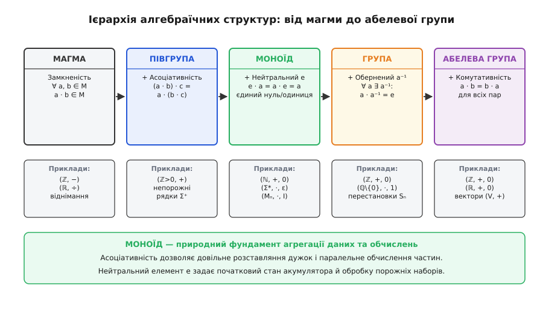
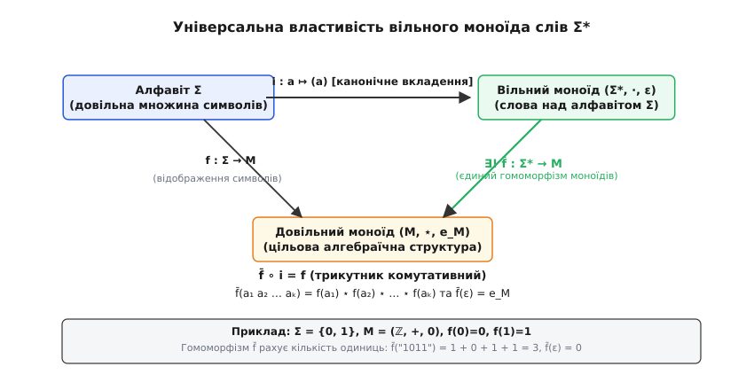
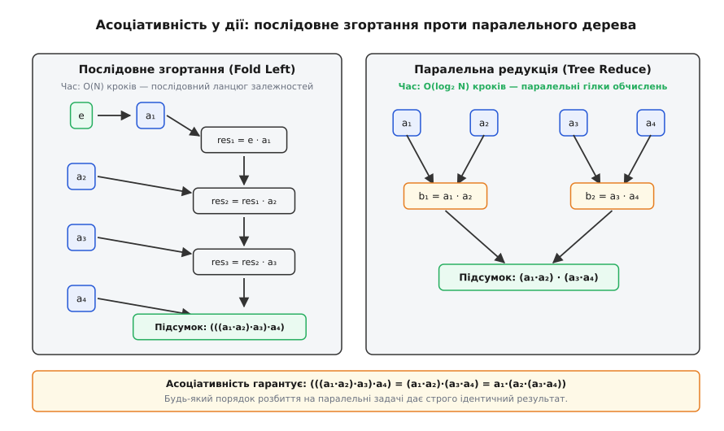
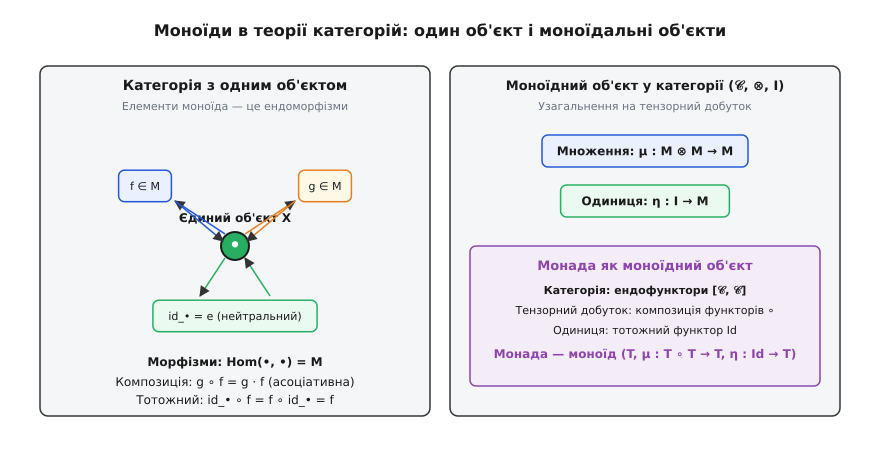

# Моноїд

<preknowlist>
- [Множини й функції](topic:math/set-theory) — базові поняття теорії множин, прямий добуток множин, бінарні операції як відображення M × M → M та взаємно однозначні функції.
- [Відношення еквівалентності](topic:math/equivalence-relation) — розбиття множини на класи еквівалентності та побудова фактор-множин.
- [Теорія груп](topic:math/group-theory) — алгебраїчні поняття замкненості, асоціативності, нейтрального елемента та оборотних симетрій.
</preknowlist>

Уявіть розподілену систему збору журналів подій або фінансових транзакцій: щомиті сотні серверів генерують мільйони записів. Щоб порахувати загальну суму платежів, знайти максимальну затримку відповіді або склеїти текстові фрагменти звіту, ми не можемо звозити всі терабайти даних на один процесор і підсумовувати їх по черзі зліва направо — це зайняло б години. Замість цього ми ріжемо потік даних на довільні шматки, роздаємо їх десяткам паралельних ядер або кластерних вузлів, обчислюємо проміжні підсумки окремо для кожного фрагмента, а потім склеюємо результати між собою.

Щоб таке паралельне обчислення гарантовано дало той самий правильний результат за будь-якого розбиття на шматки, операція злиття мусить володіти фундаментальною властивістю: порядок розставляння дужок у виразі не повинен змінювати результат. Злиття блоку A з блоком B, а потім результату з блоком C має давати рівно те саме, що й злиття A з результатом злиття B і C. Якщо ця властивість — асоціативність — порушується хоча б на один біт, різні конфігурації паралельних потоків повертатимуть різні підсумки, і результат залежатиме від випадкових затримок у мережі.

Водночас у реальних потоках даних постійно виникають порожні інтервали, пропущені пакети або неініціалізовані акумулятори потоків. Щоб конвеєр міг однорідно обробляти будь-який вузол без спеціальних умовних розгалужень `if (empty)`, потрібен особливий «нейтральний» елемент — такий, що його злиття з будь-яким реальним результатом залишає цей результат незмінним. Додавання нуля до числа, взяття максимуму з мінус нескінченністю або склеювання порожнього рядка з текстом — це не випадкові трюки, а прояви однієї абстрактної алгебраїчної структури. Таку множину з асоціативною операцією та нейтральним елементом математики називають **моноїдом**.

### Що робить множину з операцією моноїдом

Сформулюємо точні математичні вимоги, які перетворюють довільну множину з правилом комбінування на моноїд. Їх рівно три, і кожна відповідає за конкретну поведінку системи.

Нехай задано множину `M` та бінарну операцію `·` (яку залежно від контексту називають множенням, додаванням, конкатенацією або композицією). Формально бінарна операція (лат. *binarius* — подвійний) — це функція `· : M × M → M`, яка будь-якій упорядкованій парі елементів `(a, b)` зіставляє єдиний елемент `a · b`.

Структура `(M, ·, e)` називається **моноїдом** (грец. *monos* — один, одиничний + *eidos* — вигляд, форма; термін увів колектив Ніколя Бурбакі у 1940-х роках), якщо вона задовольняє три аксіоми:

1. **Замкненість (тотальність):**
   Для будь-яких двох елементів `a, b ∈ M` результат їхньої комбінації `a · b` також обов'язково належить тій самій множині `M`. Операція ніколи не виводить нас за межі системи: додавання двох цілих невід'ємних чисел завжди дає ціле невід'ємне число, конкатенація двох рядків тексту дає рядок тексту, перемноження двох квадратних матриць розміру `n × n` дає квадратну матрицю того самого розміру.

2. **Асоціативність (сполучний закон):**
   Для будь-яких трьох елементів `a, b, c ∈ M` виконується рівність:
   ```
   (a · b) · c = a · (b · c)
   ```
   Асоціативність (лат. *associare* — з'єднувати) означає, що при послідовному застосуванні операції до трьох і більше елементів результат залежить виключно від порядку слідування самих елементів, але абсолютно не залежить від того, які сусідні пари ми обчислюємо першими. Саме асоціативність позбавляє нас необхідності писати нескінченні дужки й дозволяє однозначно записувати вирази вигляду `a · b · c · d`.

3. **Наявність нейтрального елемента (одиниці):**
   У множині `M` існує такий виділений елемент `e ∈ M`, що для будь-якого елемента `a ∈ M` виконується подвійна рівність:
   ```
   e · a = a · e = a
   ```
   Елемент `e` називають **нейтральним** (або **одиничним**) елементом моноїда. Він виступає нейтралізатором операції: зліва чи справа ми його застосовуємо, він не змінює значення аргументу. В адитивних системах його традиційно позначають як `0`, у мультиплікативних — як `1`, у теорії рядків — як порожній рядок `ε`, а в теорії функцій — як тотожне перетворення `id`.

Якщо операція моноїда додатково задовольняє умову `a · b = b · a` для всіх пар `a, b ∈ M`, такий моноїд називають **комутативним** (лат. *commutare* — міняти місцями), або **абелевим** — на честь норвезького математика Нільса Генріка Абеля.

#### Доведення єдиності нейтрального елемента

В аксіомах моноїда постулюється лише існування принаймні одного нейтрального елемента. Проте виявляється, що в будь-якому моноїді двох різних нейтральних елементів існувати не може в принципі.

**Теорема.** *Нейтральний елемент моноїда єдиний.*

*Доведення.*
Припустимо супротивне: нехай у моноїді `M` існують два нейтральні елементи, `e₁` та `e₂`.
Обчислимо добуток `e₁ · e₂` двома різними способами:

```
e₁
= e₁ · e₂      [оскільки e₂ є нейтральним елементом, e₁ · e₂ = e₁]
= e₂          [оскільки e₁ є нейтральним елементом, e₁ · e₂ = e₂]
```

Звідси негайно випливає, що `e₁ = e₂`. Будь-які два нейтральні елементи зобов'язані збігатися.

---

### Сходинки алгебраїчних структур: від магми до групи

Щоб побачити місце моноїда на карті абстрактної алгебри, корисно простежити, як поступове додавання вимог змінює вигляд структури.


*Кожен крок додає рівно одну аксіому. Магма вимагає лише замкненості; півгрупа додає асоціативність; моноїд додає нейтральний елемент; група додає існування оберненого елемента для кожного члена множини; абелева група додає комутативність.*

1. **Магма (групоїд):** Лише замкненість `a · b ∈ M`. Операція може бути неасоціативною і не мати нейтрального елемента (наприклад, віднімання цілих чисел `(ℤ, −)`, де `(8 − 3) − 2 = 3`, але `8 − (3 − 2) = 7`).
2. **Півгрупа (напівгрупа):** Замкненість + асоціативність `(a · b) · c = a · (b · c)`. Приклад: строго додатні цілі числа з додаванням `(ℤ>0, +)` або непорожні текстові рядки з конкатенацією. Тут немає нуля чи порожнього рядка.
3. **Моноїд:** Півгрупа + нейтральний елемент `e`. Додається початкова точка відліку: натуральні числа з нулем `(ℕ, +, 0)` або всі рядки включно з порожнім `(Σ*, ·, ε)`.
4. **Група:** Моноїд + існування оберненого елемента `a⁻¹` для кожного `a ∈ M`, такого що `a · a⁻¹ = a⁻¹ · a = e`. Приклад: цілі числа з додаванням `(ℤ, +, 0)` (оберненим до `n` є `−n`) або група перестановок `Sₙ`.

#### Чому моноїд — це не завжди група: незворотність у природі

Різниця між моноїдом і групою полягає рівно в одній вимозі — **оборотності дій**. У групі будь-який рух, поворот чи перетворення можна гарантовано відкотити назад. Але наш реальний світ, як і комп'ютерні алгоритми, переповнений процесами, які є принципово **незворотними**:

- **Конкатенація тексту:** Якщо ми взяли рядок `"hello"` і приписали до нього `"world"`, отримавши `"helloworld"`, ми не можемо «помножити» результат на якийсь магічний рядок-антиречовину, щоб повернутися до `"hello"`. Усі непорожні рядки лише збільшують довжину, тому обернених слів не існує.
- **Множення на нуль:** У моноїді цілих чисел за множенням `(ℤ, ·, 1)` нейтральним елементом є `1`. Проте для числа `0` немає числа `x`, для якого `0 · x = 1`. Множення на нуль знищує інформацію про вихідне число назавжди.
- **Взяття максимуму чи мінімуму:** Операція `max(a, b)` є асоціативною і має нейтральний елемент `−∞`. Але якщо `max(10, 3) = 10`, ми не можемо з числа `10` відновити, що другим числом була саме трійка.
- **Скінченні автомати та обчислення:** Програма переходить зі стану в стан, часто забуваючи попередні проміжні регістри.

Саме тому теорія моноїдів є значно ширшою та багатшою за теорію груп: вона описує як оборотні процеси (групи є окремим випадком моноїдів), так і незворотні односторонні перетворення, накопичення інформації та агрегацію потоків даних. Детальний історичний огляд того, як математики переходили від оборотних симетрій Галуа до незворотних систем Бурбакі та Ейленберга, [винесено в окремий нарис](topic:math/monoid/hist-monoid-origins.md).

---

### Галерея моноїдів: від чисел і логіки до матриць і функцій

Різноманітність моноїдів вражає: вони природно з'являються практично в кожному розділі математики та програмування.

#### 1. Числові моноїди

- **Адитивний моноїд натуральних чисел `(ℕ, +, 0)`:**
  Множина `{0, 1, 2, 3, …}` із традиційним додаванням. Нейтральний елемент — `0`. Це моноїд, але не група: єдиним елементом, що має обернений, є сам нуль (`0 + 0 = 0`). Для числа `5` протилежного елемента `−5` усередині `ℕ` немає.
- **Мультиплікативний моноїд цілих чисел `(ℤ, ·, 1)`:**
  Множина цілих чисел із множенням. Нейтральний елемент — `1`. Оборотними елементами тут є лише `1` та `−1` (оскільки `1 · 1 = 1` та `(−1) · (−1) = 1`). Усі інші числа обернених усередині `ℤ` не мають.
- **Мультиплікативні моноїди раціональних `(ℚ, ·, 1)` та дійсних `(ℝ, ·, 1)` чисел:**
  Майже всі елементи мають обернені (`x` має обернений `1/x`), окрім єдиного елемента — нуля `0`. Саме через наявність нуля ці структури є моноїдами, а не групами.
- **Тропічні моноїди та тропічні напівкільця:**
  - **Min-плюс моноїд:** Множина `ℝ ∪ {+∞}` з операцією `min` та нейтральним елементом `+∞`. Справді: `min(a, +∞) = min(+∞, a) = a`.
  - **Max-плюс моноїд:** Множина `ℝ ∪ {−∞}` з операцією `max` та нейтральним елементом `−∞`: `max(a, −∞) = max(−∞, a) = a`.
  Ці моноїди мають унікальну властивість — **ідемпотентність** (лат. *idem* — той самий + *potens* — здатний): `min(a, a) = a`. Якщо об'єднати адитивний моноїд `(ℝ ∪ {+∞}, min, +∞)` з мультиплікативним моноїдом `(ℝ ∪ {+∞}, +, 0)`, виникає **тропічне напівкільце**. Матричне множення над цим напівкільцем дозволяє обчислювати найкоротші шляхи між усіма парами вершин графа як звичайне піднесення матриці суміжності до степеня (алгоритм Флойда — Воршелла).
- **Моноїди подільності та основна теорема арифметики:**
  - `(ℕ, gcd, 0)`: операція найбільшого спільного дільника з нейтральним елементом `0`, оскільки `gcd(a, 0) = a`.
  - `(ℕ, lcm, 1)`: операція найменшого спільного кратного з нейтральним елементом `1`, оскільки `lcm(a, 1) = a`.
  Основна теорема арифметики встановлює дивовижний факт: мультиплікативний моноїд додатних цілих чисел `(ℤ_{≥1}, ·, 1)` канонічно ізоморфний прямому добутку нескінченної кількості адитивних моноїдів натуральних чисел `(ℕ, +, 0)` за всіма простими числами: `n = 2^{k₂} · 3^{k₃} · 5^{k₅} … ⟷ (k₂, k₃, k₅, …)`. Множення чисел перетворюється на звичайне покомпонентне додавання векторів степенів.

#### 2. Булеві та теоретико-множинні моноїди

- **Моноїд кон'юнкції (All / AND) `({0, 1}, ∧, 1)`:**
  Логічне «І». Нейтральний елемент — істина `1` (True), оскільки `a ∧ 1 = 1 ∧ a = a`.
- **Моноїд диз'юнкції (Any / OR) `({0, 1}, ∨, 0)`:**
  Логічне «АБО». Нейтральний елемент — хиба `0` (False), оскільки `a ∨ 0 = 0 ∨ a = a`.
- **Моноїди підмножин:**
  Для будь-якої фіксованої множини `X` її булеан `𝒫(X)` (множина всіх підмножин) утворює два моноїди:
  - З операцією об'єднання: `(𝒫(X), ∪, ∅)` — нейтральним елементом є порожня множина `∅`.
  - З операцією перетину: `(𝒫(X), ∩, X)` — нейтральним елементом є вся множина `X`.

#### 3. Матричний моноїд `(Mₙ(R), ·, Iₙ)`

Розглянемо множину всіх квадратних матриць розміру `n × n` з дійсними елементами та операцією матричного множення.
- **Замкненість:** Добуток двох матриць `n × n` є матрицею `n × n`.
- **Асоціативність:** Множення матриць завжди асоціативне: `(A · B) · C = A · (B · C)`.
- **Нейтральний елемент:** Одинична матриця `Iₙ` (з одиницями на головній діагоналі та нулями в решті позицій), для якої `A · Iₙ = Iₙ · A = A`.

При `n ≥ 2` матричний моноїд **некомутативний**: загалом `A · B ≠ B · A`. Крім того, матриці з нульовим визначником (`det(A) = 0`, вироджені матриці) не мають обернених, тому `Mₙ(R)` є саме моноїдом, а не групою. Оборотні матриці утворюють усередині нього групу — повну лінійну групу `GLₙ(R)`.

Геометрично необоротна матриця відповідає проектуванню простору на підпростір меншої вимірності (наприклад, стисканню тривимірного простору на площину). Після такого сплющення повернути початкову тривимірну інформацію назад неможливо. Моноїд матриць математично фіксує цю незворотність геометричних перетворень.

#### 4. Моноїд ендоморфізмів та теорема Келі

Нехай `X` — довільна множина. **Ендоморфізмом** (грец. *endon* — всередині + *morphe* — форма) множини `X` називають будь-яку функцію `f: X → X`, яка відображає множину в саму себе.

Множина всіх таких функцій `End(X)` разом з операцією функціональної композиції `(g ∘ f)(x) = g(f(x))` та тотожною функцією `id_X(x) = x` утворює моноїд:
- Композиція функцій асоціативна за своєю природою: `((h ∘ g) ∘ f)(x) = h(g(f(x))) = (h ∘ (g ∘ f))(x)`.
- Тотожна функція нічого не змінює: `f ∘ id_X = id_X ∘ f = f`.

Цей приклад має фундаментальне значення через класичну теорему Кейлі.

**Теорема Келі для моноїдів.** *Будь-який моноїд `M` ізоморфний деякому підмоноїду моноїда ендоморфізмів `End(M)`.*

*Ідея доведення:* Кожному елементу `a ∈ M` зіставимо функцію лівого множення (зсуву) `L_a: M → M`, визначену формулою `L_a(x) = a · x`. Композиція таких зсувів точно відповідає множенню в моноїді: `(L_a ∘ L_b)(x) = a · (b · x) = (a · b) · x = L_{a·b}(x)`. А нейтральному елементу `e` відповідає тотожна функція `L_e(x) = e · x = x = id_M(x)`.

Розгляньмо конкретний числовий приклад: моноїд із трьох елементів `M = {e, a, b}`, де `e` — одиниця, а елементи `a` та `b` задовольняють таблицю множення `a · a = a`, `b · b = b`, `a · b = b`, `b · a = a`.
Тоді відповідні ендоморфізми на множині `{e, a, b}` діють так:
- `L_e`: тотожне відображення `e ↦ e, a ↦ a, b ↦ b`.
- `L_a`: відображення `e ↦ a, a ↦ a, b ↦ b`.
- `L_b`: відображення `e ↦ b, a ↦ a, b ↦ b`.
Композиція цих функцій у точності повторює таблицю множення вихідного моноїда. Це доводить, що будь-який абстрактний моноїд можна подати як конкретну систему операцій над деяким простором станів.

---

### Підмоноїди, гомоморфізми та фактор-моноїди

Як і в будь-якій розвиненій алгебраїчній теорії, вивчення внутрішньої будови моноїдів спирається на три фундаментальні концепції: підструктури, відображення, що зберігають операції, та факторизацію за еквівалентностями.

#### Підмоноїди

Нехай `(M, ·, e_M)` — моноїд. Підмножина `S ⊆ M` називається **підмоноїдом** моноїда `M`, якщо:
1. Вона замкнена щодо операції: для будь-яких `a, b ∈ S` добуток `a · b ∈ S`.
2. Вона **містить нейтральний елемент вихідного моноїда**: `e_M ∈ S`.

> ⚠️ **Тонка відмінність від теорії півгруп:** Підмножина `S` може бути півгрупою зі своїм власним локальним нейтральним елементом `e_S ≠ e_M`, але вона **не** є підмоноїдом моноїда `M`, якщо її одиниця не збігається з одиницею `M`. Наприклад, у моноїді матриць `M₂(ℝ)` розглянемо матрицю `E = [[1, 0], [0, 0]]`. Множина `S = { [[x, 0], [0, 0]] | x ∈ ℝ }` замкнена щодо множення і має нейтральний елемент `E`. Проте одиницею всього `M₂(ℝ)` є матриця `I₂ = [[1, 0], [0, 1]] ≠ E`. Тому `S` є моноїдом сам по собі, але **не є підмоноїдом** `M₂(ℝ)`.

#### Гомоморфізми моноїдів

Нехай `(M, ·, e_M)` та `(N, ⋆, e_N)` — два моноїди. Відображення `φ: M → N` називається **гомоморфізмом моноїдів** (грец. *homos* — однаковий + *morphe* — форма), якщо воно зберігає і операцію, і нейтральний елемент:

1. Для всіх `a, b ∈ M`:
   ```
   φ(a · b) = φ(a) ⋆ φ(b)
   ```
2. Для нейтрального елемента:
   ```
   φ(e_M) = e_N
   ```

У теорії груп збереження нейтрального елемента `φ(e) = e` випливало автоматично зі збереження групової операції завдяки наявності обернених елементів (`φ(e) = φ(e · e) = φ(e) · φ(e) ⟹ e = φ(e)` скороченням). У моноїдах закону скорочення загалом немає, тому збереження нейтрального елемента є **обов'язковою окремою вимогою** означення!

**Приклади гомоморфізмів:**
- **Довжина рядка:** Відображення `len: (Σ*, ·, ε) → (ℕ, +, 0)`, яке кожному слову зіставляє його довжину. Збереження операції: `len(u · v) = len(u) + len(v)`. Збереження нейтрального: `len(ε) = 0`.
- **Визначник матриці:** Відображення `det: (Mₙ(ℝ), ·, Iₙ) → (ℝ, ·, 1)`. Збереження операції: `det(A · B) = det(A) · det(B)`. Збереження нейтрального: `det(Iₙ) = 1`.
- **Показникова функція:** Відображення `exp: (ℝ, +, 0) → (ℝ>0, ·, 1)`, де `exp(x) = eˣ`. Збереження операції: `e^{a+b} = eᵃ · eᵇ`. Збереження нейтрального: `e⁰ = 1`.

#### Конгруенції та фактор-моноїди

Щоб «склеїти» елементи моноїда й побудувати менший моноїд (фактор-моноїд), звичайного відношення еквівалентності замало. Відношення еквівалентності `∼` на множині `M` називається **конгруенцією** (лат. *congruentia* — узгодженість), якщо воно узгоджене з операцією моноїда:

```
Якщо a ∼ a' та b ∼ b', то (a · b) ∼ (a' · b')
```

Якщо `∼` є конгруенцією, то на множині класів еквівалентності `M / ∼` можна коректно визначити операцію над класами:
```
[a] · [b] = [a · b]
```
Ця операція перетворює `M / ∼` на повноцінний моноїд з нейтральним елементом `[e]`.

Конгруенції мають вирішальне значення в комп'ютерній лінгвістиці та теорії парсерів. Для будь-якої формальної мови `L ⊆ Σ*` визначається **синтаксична конгруенція Майгілла — Нероуда**: два слова `u` та `v` вважаються еквівалентними (`u ∼_L v`), якщо для будь-яких контекстних слів `x` та `y` слова `xuy` та `xvy` одночасно або належать мові `L`, або не належать їй.

Фактор-моноїд `Σ* / ∼_L` називають **синтаксичним моноїдом** мови `L`. Мова `L` розпізнається скінченним автоматом тоді й лише тоді, коли її синтаксичний моноїд є скінченним. Наприклад, якщо мова `L` складається з усіх слів парної довжини над алфавітом `{0, 1}`, конгруенція Майгілла — Нероуда розбиває всі слова на два класи: `[ε]` (слова парної довжини) та `[0]` (слова непарної довжини). Отриманий синтаксичний моноїд складається з двох елементів і ізоморфний групі `(ℤ₂, +)`.

---

### Вільний моноїд та його універсальна властивість

Найважливішим серед усіх моноїдів є **вільний моноїд** слів над алфавітом.

Нехай `Σ` — довільна множина (алфавіт). Складемо всі можливі скінченні послідовності (слова) із символів `Σ`, додавши до них порожнє слово `ε`. Цю множину позначають `Σ*` (зірочка Кліні).

Операцією є звичайна **конкатенація рядків**: до кінця першого слова приписується друге слово. Нейтральним елементом є порожнє слово `ε` довжини 0. Очевидно, що конкатенація асоціативна, а `w · ε = ε · w = w`.


*Комутативний трикутник універсальної властивості: для будь-якого відображення символів f у довільний цільовий моноїд M існує єдиний гомоморфізм f̄, що продовжує f на всі скінченні слова.*

Чому цей моноїд називають **вільним**? Тому що в ньому немає жодних додаткових зв'язків між елементами, крім тих, що строго вимагаються аксіомами моноїда (асоціативності та нейтральності `ε`). Слово `"ab"` ніколи не дорівнює `"ba"`, а `"aaa"` ніколи не згорнеться в `"a"`.

Вільний моноїд характеризується фундаментальною **універсальною властивістю**:

**Теорема (Універсальна властивість вільного моноїда).**
*Нехай `i: Σ → Σ*` — канонічне вкладення, що кожному символу `a ∈ Σ` зіставляє одноелементне слово `(a)`. Тоді для будь-якого моноїда `(M, ⋆, e_M)` і будь-якого відображення множин `f: Σ → M` існує **єдиний** гомоморфізм моноїдів `f̄: Σ* → M` такий, що `f̄ ∘ i = f`.*

Формула цього єдиного гомоморфізму проста: порожнє слово відображається в нейтральний елемент `f̄(ε) = e_M`, а слово `w = a₁ a₂ … aₖ` відображається в добуток образів своїх символів:

```
f̄(a₁ a₂ … aₖ) = f(a₁) ⋆ f(a₂) ⋆ … ⋆ f(aₖ)
```

Строге покрокове доведення цієї теореми за індукцією та виведення того, що будь-який абстрактний моноїд є фактор-моноїдом деякого вільного моноїда, [детально розібрано в окремому математичному доведенні](topic:math/monoid/math-free-monoid-universal.md).

---

### Паралельні обчислення та MapReduce завдяки асоціативності

Саме моноїди стали фундаментом інженерії великих даних (Big Data) та високоефективних паралельних обчислень. Причина криється в геометричній природі асоціативності.


*Зліва — послідовне згортання за час O(N), де кожен крок залежить від попереднього. Справа — бінарне дерево редукції за час O(log₂ N), де обчислення виконуються паралельно на незалежних ядрах.*

Якщо ми обчислюємо вираз із `N` елементів, послідовний алгоритм виконує згортання зліва направо:
```
(((a₁ · a₂) · a₃) · … · aₙ)
```
Це займає `N − 1` послідовних кроків, і жоден процесор не може почати свій крок раніше, ніж завершиться попередній.

Але якщо операція `·` є моноїдною (асоціативною), вираз можна згрупувати як завгодно, зокрема у збалансоване бінарне дерево:
```
((a₁ · a₂) · (a₃ · a₄)) · ((a₅ · a₆) · (a₇ · a₈))
```
На першому кроці ми паралельно обчислюємо `b₁ = a₁ · a₂`, `b₂ = a₃ · a₄`, `b₃ = a₅ · a₆`, `b₄ = a₇ · a₈` на чотирьох різних ядрах. На другому кроці — паралельно `c₁ = b₁ · b₂` та `c₂ = b₃ · b₄`. На третьому кроці отримуємо фінальний результат `c₁ · c₂`.

Глибина обчислювального графа скорочується з лінійної `O(N)` до логарифмічної `O(log₂ N)`. Для мільярда елементів (`N = 10⁹`) замість одного мільярда послідовних операцій ми робимо лише близько `30` паралельних кроків!

#### Парадигма MapReduce / FoldMap

Узагальнена схема паралельної агрегації складається з двох кроків:
1. **Map (відображення):** Функція `f: X → M` перетворює вхідні сирі дані довільного типу `X` в елементи деякого моноїда `M`.
2. **Reduce (згортання):** Паралельне дерево згортає елементи `M` за допомогою моноїдної операції `·`, використовуючи `e` як базове значення для порожніх гілок.

Наприклад, щоб одночасно порахувати кількість елементів, суму, мінімум, максимум і дисперсію масиву вимірювань, створюють комбінований моноїд статистичних метрик. Повну реалізацію такого паралельного алгоритму мовами C, C++ та Python з аналізом пасток плаваючої коми IEEE 754 [показано у практичному проекті](topic:math/monoid/proj-parallel-fold.md).

> 🔧 **Навіщо це.** Без асоціативності моноїда неможливо побудувати жоден масштабований розподілений рушій — від Google MapReduce та Apache Spark до GPU-шейдерів редукції в CUDA та багатопотокового `std::reduce` у стандартній бібліотеці C++. Нейтральний елемент моноїда дозволяє алгоритмам безпечно ініціалізувати робочі акумулятори потоків та обробляти порожні частини масиву без додаткових перевірок і блокувань.

---

### Моноїди в теорії категорій: від одного об'єкта до монад

Теорія категорій, яку часто називають «математикою математики», розкриває внутрішню сутність моноїдів із двох взаємодоповнювальних боків: через мінімалістичні категорії та через моноїдальні об'єкти.


*Зліва — моноїд як категорія з єдиним об'єктом •, де елементи є стрілками-петлями. Справа — моноїдний об'єкт у моноїдальній категорії, окремим випадком якого є монада.*

#### Моноїд як категорія з одним об'єктом

Категорія `𝒞` складається з об'єктів та морфізмів (стрілок) між ними. Морфізми можна послідовно застосовувати (композиція `∘`), причому композиція обов'язково асоціативна, а кожен об'єкт `X` має тотожний морфізм `id_X`.

Розглянемо найпростішу можливу категорію, що має **рівно один об'єкт** `•`.
- Усі морфізми цієї категорії починаються в `•` і закінчуються в `•`, тобто належать множині `Hom(•, •)`.
- Будь-які дві стрілки `f, g ∈ Hom(•, •)` можна скомпонувати, отримавши знову стрілку `g ∘ f ∈ Hom(•, •)`. Замкненість виконується автоматично.
- Композиція морфізмів асоціативна за аксіомами теорії категорій.
- Тотожний морфізм `id_•` виступає нейтральним елементом: `f ∘ id_• = id_• ∘ f = f`.

Таким чином, **моноїд — це просто категорія з одним об'єктом**. А категорія з багатьма об'єктами — це не що інше, як типізоване узагальнення моноїда («моноїд із багатьма об'єктами»), де композиція дозволена лише тоді, коли ціль першої стрілки збігається з джерелом другої.

#### Моноїдальні категорії та моноїдні об'єкти

Якщо піти шляхом узагальнення вгору, можна розглянути категорію `(𝒞, ⊗, I)`, у якій самі об'єкти можна «перемножувати» за допомогою біфунктора тензорного добутку `⊗`, а `I` є виділеним одиничним об'єктом. Таку категорію називають **моноїдальною**.

**Моноїдним об'єктом** у моноїдальній категорії називають об'єкт `M ∈ 𝒞` разом із двома морфізмами:
- Множення: `μ : M ⊗ M → M`
- Одиниця: `η : I → M`

Ці морфізми повинні задовольняти комутативні діаграми асоціативності та унітарності. Ця абстрактна конструкція миттєво породжує знайомі структури в різних галузях математики:
- У категорії множин `(Set, ×, {*})` моноїдний об'єкт — це звичайний класичний **моноїд**.
- У категорії абелевих груп `(Ab, ⊗_ℤ, ℤ)` моноїдний об'єкт — це **асоціативне кільце з одиницею**.
- У категорії векторних просторів `(Vect_K, ⊗_K, K)` моноїдний об'єкт — це **асоціативна алгебра над полем `K`**.
- У категорії топологічних просторів `(Top, ×, {*})` моноїдний об'єкт — це **топологічний моноїд** (де множення є неперервним відображенням).

#### Монада як моноїд у категорії ендофункторів

Якщо як моноїдальну категорію взяти категорію ендофункторів `[𝒞, 𝒞]` (функторів із категорії `𝒞` в саму себе), де операцією тензорного добутку виступає звичайна функторна композиція `∘`, а одиничним об'єктом — тотожний функтор `Id_𝒞`, то моноїдний об'єкт у такій системі набуває вигляду:

```
Ендофунктор:   T : 𝒞 → 𝒞
Злиття (join): μ : T ∘ T → T
Одиниця (pure): η : Id → T
```

Це і є точне означення **монади** в теорії категорій та мовах функціонального програмування. Операція `η` піднімає чисте значення в контекст обчислення (наприклад, у `Option`, `List` або `Future`), а операція `μ` розгортає подвійний вкладений контекст `Option<Option<T>>` у простий `Option<T>`.

---

### Підсумок

Моноїд — це точка рівноваги між простотою та виразною силою в математиці. Відкинувши вимогу існування оберненого елемента, яка була обов'язковою для груп, моноїд зберіг дві найважливіші властивості композиції: **асоціативність** (що дозволяє довільне паралельне перегрупування дій) та **нейтральний елемент** (що задає однозначний початок відліку та універсальний нульовий стан).

Завдяки цьому моноїд став універсальною мовою опису незворотних процесів: від склеювання рядків у теорії автоматів та паралельних редукцій у розподілених обчисленнях до моноїдальних об'єктів і монад у сучасній комп'ютерній науці.
