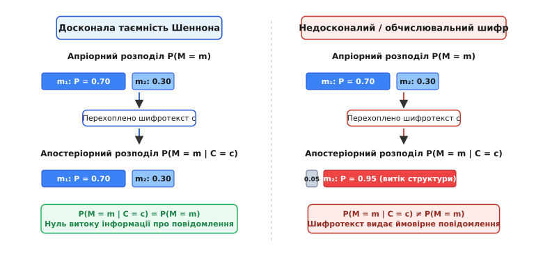
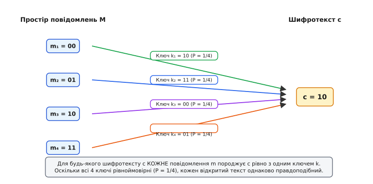
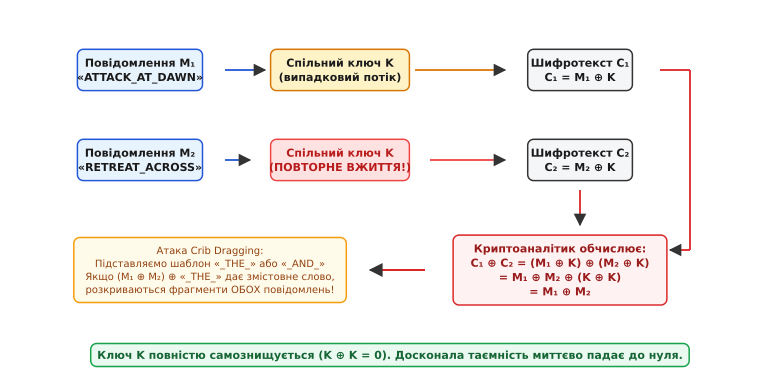

# Досконала таємність Шеннона: чи існує незламний шифр

<preknowlist>
- [Умовна ймовірність](book:math/conditional-probability) — формула Байєса, спільний розподіл та статистична незалежність випадкових величин.
- [Теорія груп](book:math/group-theory) — абелеві групи, операція XOR у полі GF(2) та властивості симетричної різниці.
- [Модульна арифметика](book:math/modular-arithmetic) — додавання та віднімання за модулем, лишкові класи та конгруенції.
- [Розділення секрету Шаміра](book:math/shamir-secret-sharing) — приклад інформаційно-теоретичної стійкості на основі поліноміальної інтерполяції.
- [Ентропія](book:algorithms/entropy) — шеннонівська міра інформації та невизначеності й середній обсяг випадковості у бітах.
</preknowlist>

Уявіть ситуацію: супротивник перехопив зашифроване повідомлення, але на відміну від звичайних умов він володіє необмеженими ресурсами. У його розпорядженні є квантовий суперкомп'ютер нескінченної потужності, здатний перебрати мільярди трильйонів ключів за нуль секунд, а також необмежений запас часу. Більшість алгоритмів, які захищають сучасний цифровий світ — RSA, еліптичні криві, симетричний стандарт AES із 256-бітними ключами, — перед таким супротивником миттєво капітулюють. Їхня безпека є **обчислювальною** (*computational security*): вона тримається лише на тому, що повний перебір варіантів триває довше за час існування Всесвіту. Але щойно обчислювальна межа зникає, такий шифр розпадається.

Виникає фундаментальне математичне питання: чи існує в природі шифр, який принципово неможливо зламати навіть нескінченною обчислювальною потужністю? Чи це суто наукова фантастика, і будь-яка зашифрована структура за необмеженого перебору неминуче видасть свій зміст?

Відповідь дав американський математик та інженер Клод Шеннон (*Claude Elwood Shannon*) у 1949 році. Він довів, що такий шифр не просто існує, а має точну математичну конструкцію, названу **досконалою таємністю** (англ. *perfect secrecy*). Водночас Шеннон довів і зворотний бік цієї сили: незламність вимагає абсолютної плати в ресурсах ентропії, яку неможливо обійти жодними алгоритмічними хитрощами. А те, як ця концепція народжувалася у військових лабораторіях Першої та Другої світових воєн від механічних телетайпів Вернама до надсекретного зв'язку Черчилля і Рузвельта, детально висвітлює [історія створення шифру Вернама, проекту SIGSALY та розсекречення праць Шеннона](book:math/perfect-secrecy/hist-vernam-shannon.md).

### 1. Механіка одноразового блокнота: чому повний перебір нічого не дає

Почнімо з базової конструкції, яка втілює ідею абсолютної таємності на практиці. Цей алгоритм відомий як **одноразовий блокнот** (англ. *One-Time Pad*, OTP) або **шифр Вернама**.

Нехай відправник хоче передати повідомлення, записане послідовністю двійкових розрядів (бітів). Позначимо відкрите повідомлення малою літерою `m`. Нехай воно складається з `N` бітів: `m = (m₁, m₂, …, m_N)`, де кожен біт `m_i` дорівнює 0 або 1.

Для захисту цього повідомлення відправник генерує секретний ключ, який позначимо малою літерою `k`. Ключ також є рядком з `N` бітів: `k = (k₁, k₂, …, k_N)`. Головна вимога: кожен біт ключа `k_i` обирається абсолютно випадково й незалежно від усіх інших бітів, приймаючи значення 0 з ймовірністю 0.5 та значення 1 з ймовірністю 0.5.

Шифрування виконується порозрядним додаванням за модулем 2, тобто логічною операцією `XOR` (виключне «АБО», що позначається символом `⊕`):

```
c = Enc(k, m) = m ⊕ k
```

Для кожного `i`-го розряду обчислюється: `c_i = m_i ⊕ k_i`. Одержувач, знаючи той самий секретний ключ `k`, відновлює початкове повідомлення повторним застосуванням тієї самої операції:

```
Dec(k, c)
= c ⊕ k               [підстановка виразу для шифротексту]
= (m ⊕ k) ⊕ k         [асоціативність операції XOR]
= m ⊕ (k ⊕ k)         [властивість k ⊕ k = 0]
= m ⊕ 0               [додавання нуля не змінює біт]
= m                   [отримано вихідне відкрите повідомлення]
```

З алгебраїчної точки зору множина всіх бітових рядків довжини `N` разом із дією `⊕` утворює скінченну [абелеву групу](book:math/group-theory) `(ℤ₂^N, ⊕)`. У цій групі нейтральним елементом є нульовий рядок `00...0`, а кожен елемент сам собі є оберненим: `k ⊕ k = 0`. Додавання фіксованого випадкового ключа `k` задає взаємно однозначне відображення (бієкцію та зсув) усього векторного простору повідомлень на себе.

Чому ж перехоплювач із нескінченною обчислювальною потужністю не може розкрити повідомлення `m`, маючи перед очима шифротекст `c`?

Здавалося б, супротивник може запустити паралельний перебір усіх можливих `2^N` ключів. Проте придивімося, що саме видасть цей перебір.

Нехай перехоплено 4-символьне зашифроване слово `c`. Супротивник бере всі можливі ключі довжини 4 символи і розшифровує `c` кожним із них:
- При підстановці ключа `k₁` отримуємо слово `«АТАК»`;
- При підстановці ключа `k₂` отримуємо слово `«МИРН»`;
- При підстановці ключа `k₃` отримуємо слово `«ХЛІБ»`;
- При підстановці ключа `k₄` отримуємо слово `«ВОДА»`.

Перебір не відсіює жодного варіанта. Для **кожного** осмисленого тексту довжини `N` знайдеться рівно один ключ, який перетворює шифротекст `c` саме на цей текст. Оскільки всі ключі генерувалися абсолютно випадково і мають однакову ймовірність `1 / 2^N`, перехоплений шифротекст однаково сумісний з абсолютно будь-яким повідомленням у світі.

Перебір шифротексту One-Time Pad не наближає криптоаналітика до розгадки, а навпаки — повертає повну бібліотеку всіх можливих текстів заданої довжини. Криптоаналітик опиняється перед тією ж невизначеністю, що й людина, яка взагалі не бачила жодного шифротексту.

### 2. Числовий приклад: 3-бітний світ

Розглянемо крихітний навчальний простір із 3-бітних повідомлень. Нехай маємо алфавіт із 8 можливих повідомлень: `M = {000, 001, 010, 011, 100, 101, 110, 111}`.

Припустимо, відправник шифрує повідомлення `m = 110` ключем `k = 011`. Шифротекст дорівнює:

```
c = 110 ⊕ 011 = 101
```

Супротивник перехоплює бітовий рядок `c = 101` і намагається з'ясувати, яке з 8 повідомлень було передане. Він перебирає всі 8 можливих ключів:

```
Dec(000, 101) = 101 ⊕ 000 = 101   (кандидат m = 101)
Dec(001, 101) = 101 ⊕ 001 = 100   (кандидат m = 100)
Dec(010, 101) = 101 ⊕ 010 = 111   (кандидат m = 111)
Dec(011, 101) = 101 ⊕ 011 = 110   (кандидат m = 110, істинний текст)
Dec(100, 101) = 101 ⊕ 100 = 001   (кандидат m = 001)
Dec(101, 101) = 101 ⊕ 101 = 000   (кандидат m = 000)
Dec(110, 101) = 101 ⊕ 110 = 011   (кандидат m = 011)
Dec(111, 101) = 101 ⊕ 111 = 010   (кандидат m = 010)
```

Кожен із 8 можливих відкритих текстів з'явився у списку розшифрувань рівно один раз. Оскільки кожен із 8 ключів обирався з однаковою ймовірністю `1/8`, будь-яке з 8 повідомлень могло породити спостережуваний шифротекст `101` з однаковою правдоподібністю `1/8`. Жоден біт повідомлення не витік у канал зв'язку.

### 3. Алгебраїчний погляд: лінійний простір над GF(2) та афінні зсуви

Щоб глибше зрозуміти, чому операція `XOR` діє так ідеально, перекладемо бітові рядки мовою лінійної алгебри.

Кожен біт `0` та `1` можна розглядати як елемент скінченного поля Галуа з двох елементів `GF(2)` (або `𝔽₂`), де додавання збігається з логічним `XOR`, а множення — з логічним `AND`. Рядок із `N` бітів є елементом `N`-вимірного векторного простору `V = 𝔽₂^N` над полем `𝔽₂`.

У цьому векторному просторі шифрування за допомогою ключа `k ∈ 𝔽₂^N` є **афінним перетворенням зсуву** (трансляцією на вектор `k`):

```
T_k : 𝔽₂^N → 𝔽₂^N,    T_k(m) = m + k
```

Оскільки додавання векторів у `𝔽₂^N` є зворотною дією саме до себе (`T_k(T_k(m)) = m + k + k = m`), кожне відображення `T_k` є автоморфізмом афінного простору та взаємно однозначною перестановкою на множині `2^N` векторів.

Коли вектор ключа `k` обирається з рівномірним розподілом ймовірностей на всьому просторі `𝔽₂^N`, перетворення `T_K` перетворюється на випадковий зсув. Якщо зафіксувати будь-який вектор відкритого тексту `m`, образ `c = m + K` набуває строго рівномірного розподілу на `𝔽₂^N`: для будь-якого вектора `c ∈ 𝔽₂^N` ймовірність `P(T_K(m) = c) = P(K = c - m) = 1 / 2^N`.

Випадковий зсув у векторному просторі повністю стирає геометрію та розташування початкового вектора `m`, розмазуючи його ймовірнісну масу абсолютно рівномірно по всьому простору `𝔽₂^N`.

### 4. Історичні шифри заміни: чому Цезар та Віженер зазнали краху

Щоб оцінити революційність відкриття Шеннона, погляньмо на класичні шифри минулих епох мовою теорії просторів.

Найдавніший відомий шифр заміни — **шифр Цезаря** — замінює кожну літеру відкритого тексту на літеру, зсунуту в алфавіті на фіксовану кількість позицій `k`. Якщо алфавіт містить 26 літер (латиниця), то простір ключів складається лише з 26 можливих значень: `K = {0, 1, 2, ..., 25}`.

Припустимо, відправник шифрує 10-літерне слово. Кількість можливих 10-літерних повідомлень становить `|M| = 26¹⁰ ≈ 1.41 × 10¹⁴`. Проте кількість ключів дорівнює лише `|K| = 26`.

Коли супротивник перехоплює 10-літерний шифротекст Цезаря і запускає повний перебір усіх 26 ключів, він отримує рівно 26 кандидатів. З цих 26 варіантів 25 будуть абсолютно безглуздими наборами приголосних (наприклад, `«XGZQWPKJLF»`), і лише один утворить граматично правильне слово (наприклад, `«DISPATCHED»`). Малий розмір простору ключів `|K| ≪ |M|` призводить до того, що шифротекст містить колосальний витік інформації: `26¹⁰ - 26` повідомлень відсіюються миттєво з апостеріорною ймовірністю 0.

Більш витончена спроба — **шифр Віженера** (*Vigenère cipher*), створений у XVI столітті. Він використовує ключове слово довжини `d` (наприклад, `d = 5`), циклічно повторюючи його над текстом. Розмір простору ключів для слова довжини 5 становить `|K| = 26⁵ ≈ 1.18 × 10⁷`. Якщо довжина повідомлення становить 1000 літер, розмір простору повідомлень дорівнює `|M| = 26¹⁰⁰⁰`. Співвідношення між просторами становить:

```
|K| / |M| = 26⁵ / 26¹⁰⁰⁰ = 26⁻⁹⁹⁵ ≈ 0
```

Через періодичність повторення короткого ключа кожна `d`-та позиція тексту шифрується тим самим зсувом. У XIX столітті майор прусської армії Фрідріх Касіскі (*Friedrich Kasiski*) та американський криптограф Вільям Фрідман (*William Frederick Friedman*) розробили методи аналізу відстаней між повторюваними блоками та індексу збігів (*index of coincidence*). Вони довели, що періодичний шифр Віженера є просто набором паралельних шифрів Цезаря, які легко розкриваються частотним аналізом.

Лише коли довжина ключа `d` стає рівною довжині повідомлення `N`, а сам ключ обирається абсолютно випадково без жодного періоду, шифр Віженера перетворюється на незламний One-Time Pad.

### 5. Ймовірнісна модель: що означає «не дізнатися нічого»

Шеннон формалізував процес передачі секретної інформації мовою теорії ймовірностей.

Введемо всі необхідні математичні об'єкти:

1. **Простір повідомлень** позначимо великою літерою `M`. Це множина всіх можливих відкритих текстів, які відправник міг би сформулювати.
2. **Простір ключів** позначимо великою літерою `K`. Це множина всіх можливих секретних ключів.
3. **Простір шифротекстів** позначимо великою літерою `C`. Це множина всіх можливих криптограм, які можуть з'явитися в каналі зв'язку.

Випадковий вибір відкритого повідомлення описується випадковою величиною `M`. Розподіл ймовірностей `P(M = m)` називають **апріорним розподілом** (лат. *a priori* — «до досвіду»). Цей розподіл відображає знання супротивника про контекст і мову до перехоплення повідомлення: наприклад, повідомлення `«АТАКА»` може мати апріорну ймовірність `0.70`, а повідомлення `«ВІДСТУП»` — `0.30`.

Випадковий вибір ключа описується випадковою величиною `K` з розподілом `P(K = k)`. Ключ генерується незалежно від повідомлення:

```
P(M = m, K = k) = P(M = m) · P(K = k)
```

Після того як відправник зашифрував `m` ключем `k` і передав у відкритий ефір криптограму `c`, супротивник бачить подію `C = c`. Ймовірність того, що відправленим повідомленням було саме `m`, тепер змінюється і стає **апостеріорною ймовірністю** (лат. *a posteriori* — «після досвіду»), яка позначається `P(M = m | C = c)`.

Означення Шеннона формулюється з повною математичною строгістю:

> **Означення (Досконала таємність за Шенноном):** Криптосистема `(Enc, Dec)` володіє **досконалою таємністю**, якщо для будь-якого повідомлення `m ∈ M` та для будь-якого шифротексту `c ∈ C`, для якого `P(C = c) > 0`, апостеріорна ймовірність точно дорівнює апріорній ймовірності:
>
> `P(M = m | C = c) = P(M = m)`

Це рівняння означає: знання шифротексту `c` не додає спостерігачеві ані найменшої частки нової інформації про відкритий текст. Розподіл ймовірностей після перехоплення залишається точно таким самим, яким він був до нього.


*Зміна ймовірностей при перехопленні шифротексту. Ліворуч: у досконало таємному шифрі Шеннона апостеріорний розподіл після отримання c тотожно збігається з апріорним. Праворуч: у звичайному або зламаному шифрі спостереження c різко спотворює ймовірності, виділяючи найбільш правдоподібний текст.*

### 6. Розрахунок нерівномірного розподілу: байєсівська перевірка

Перевіримо досконалу таємність для випадку, коли повідомлення мають суттєво нерівні апріорні ймовірності.

Нехай військове командування передає одне з двох повідомлень:
- `m₁ = 0` («ВІДБИТИ АТАКУ») з апріорною ймовірністю `P(M = 0) = 0.70`;
- `m₂ = 1` («РОЗПОЧАТИ ВІДСТУП») з апріорною ймовірністю `P(M = 1) = 0.30`.

Шифрування виконується одноразовим бітом ключа `k ∈ {0, 1}`, де `P(K = 0) = 0.50` та `P(K = 1) = 0.50`.

Обчислимо повну ймовірність появи шифротексту `c = 0` за формулою повної ймовірності:

```
P(C = 0)
= P(M = 0, K = 0) + P(M = 1, K = 1)   [шифротекст 0 виникає при 0⊕0 або 1⊕1]
= P(M = 0) · P(K = 0) + P(M = 1) · P(K = 1) [незалежність вибору ключа]
= 0.70 · 0.50 + 0.30 · 0.50           [підстановка числових значень]
= 0.35 + 0.15                         [обчислення добутків]
= 0.50                                [підсумкова ймовірність шифротексту 0]
```

Тепер обчислимо апостеріорну ймовірність того, що передавалося повідомлення `m₁ = 0`, якщо перехоплено шифротекст `c = 0`:

```
P(M = 0 | C = 0)
= P(M = 0, C = 0) / P(C = 0)          [означення умовної ймовірності]
= (P(M = 0) · P(K = 0)) / P(C = 0)    [оскільки при M=0 шифротекст C=0 потребує K=0]
= (0.70 · 0.50) / 0.50                [підстановка ймовірностей]
= 0.35 / 0.50                         [ділення]
= 0.70                                [отримали початкову ймовірність]
```

Апостеріорна ймовірність `P(M = 0 | C = 0)` дорівнює точно `0.70`, що збігається з початковою апріорною ймовірністю `P(M = 0) = 0.70`. Перехоплювач знав до перехоплення, що з імовірністю 70% буде наказ `m₁`, і після отримання шифротексту `c = 0` він знає рівно ті самі 70%. Криптограма не дала йому жодного біта корисної інформації.

### 7. Еквівалентність критеріїв: погляд з боку шифротексту

Умова `P(M = m | C = c) = P(M = m)` описує результат з погляду того, що дізнається супротивник. Проте для математичного аналізу та побудови шифрів набагато зручніше подивитися на ту саму рівність з іншого боку: як повинен поводитися сам шифротекст?

Застосуємо [формулу Байєса](book:math/conditional-probability) до умовної ймовірності:

```
P(M = m | C = c)
= (P(C = c | M = m) · P(M = m)) / P(C = c)   [формула Байєса]
```

Підставимо у ліву частину вимогу досконалої таємниці `P(M = m | C = c) = P(M = m)`:

```
P(M = m)
= (P(C = c | M = m) · P(M = m)) / P(C = c)   [підстановка умови досконалої таємниці]
```

Оскільки ми розглядаємо повідомлення, які в принципі можуть бути відправлені (тобто `P(M = m) > 0`), скоротимо обидві частини на `P(M = m)`:

```
1 = P(C = c | M = m) / P(C = c)              [скорочення на спільний множник]
```

Помноживши обидві частини на `P(C = c)`, отримуємо фундаментальну еквівалентну форму:

```
P(C = c | M = m) = P(C = c)                  [множення на знаменник P(C = c)]
```

Ця проста тотожність розкриває внутрішній механізм незламності: **розподіл ймовірностей появи будь-якого шифротексту `c` повинен бути абсолютно однаковим незалежно від того, яке саме відкрите повідомлення `m` шифрується**.

Якщо для повідомлення `m₁ = «ТАК»` шифротекст `c = «1011»` генерується з ймовірністю `0.25`, то і для повідомлення `m₂ = «НІ»` той самий шифротекст `c = «1011»` зобов'язаний генеруватися з тією ж самою ймовірністю `0.25`. Жодне повідомлення не має права залишати в шифротексті навіть слабкого статистичного сліду.

### 8. Модульні шифри над довільними абетками

Принцип одноразового блокнота не обмежений двійковими бітами та операцією `XOR`. Його можна побудувати над будь-яким скінченним алфавітом із `q` символів за допомогою [модульної арифметики](book:math/modular-arithmetic).

Нехай символи відкритого тексту кодуються числами від `0` до `q - 1` у кільці лишків `ℤ_q`. Ключ `k` генерується як рівномірно розподілене випадкове число від `0` до `q - 1`: `P(K = k) = 1 / q`.

Шифрування полягає у додаванні за модулем `q`:

```
c = (m + k) mod q
```

Дешифрування виконується відніманням того самого ключа за модулем `q`:

```
m = (c - k) mod q
```

Оскільки додавання за модулем `q` утворює циклічну групу `(ℤ_q, +)`, для будь-якої фіксованої пари повідомлення `m` та шифротексту `c` існує рівно один ключ `k = (c - m) mod q`, який переводить `m` у `c`.

Ймовірність появи шифротексту `c` при шифруванні `m` дорівнює ймовірності вибору саме цього ключа:

```
P(C = c | M = m) = P(K = (c - m) mod q) = 1 / q
```

Оскільки ця ймовірність дорівнює `1/q` для всіх повідомлень `m`, шифр додавання за модулем `q` є абсолютно досконало таємним. Саме так працювали історичні шифри з випадковими десятковими блокнотами у дипломатичному листуванні.

### 9. Неминуча ціна: теорема Шеннона про розмір простору ключів

Чи можна побудувати досконало таємний шифр, у якому короткий 128-бітний ключ використовується для шифрування гігабайтного повідомлення?

Інтуїція програміста підказує спробувати: взяти 128 біт випадкового ключа, пропустити їх через надскладну функцію розширення, згенерувати псевдовипадковий потік на 1 гігабайт і додати його через `XOR` до тексту. Проте Клод Шеннон довів, що такий підхід принципово не здатен забезпечити досконалу таємність.

**Теорема Шеннона про розмір простору ключів:**
> Якщо криптосистема `(Enc, Dec)` забезпечує досконалу таємність для довільного простору повідомлень `M`, то кількість можливих секретних ключів `|K|` не може бути меншою за кількість можливих повідомлень `|M|`:
>
> `|K| ≥ |M|`

Доведемо цю нерівність дедуктивно методом від супротивного.

Нехай існує шифр із досконалою таємністю, у якому кількість ключів строго менша за кількість повідомлень: `|K| < |M|`.

Візьмемо довільний можливий шифротекст `c ∈ C`. Спробуємо розшифрувати цей `c` усіма ключами з множини `K`. Множина всіх відкритих текстів, які можна отримати таким способом, дорівнює `S_c = { Dec(k, c) | k ∈ K }`.

Оскільки кожен ключ `k` розшифровує `c` рівно в один відкритий текст, розмір множини отриманих текстів `|S_c|` не може перевищувати кількості ключів:

```
|S_c| ≤ |K|
```

Але за нашим припущенням `|K| < |M|`. Звідси:

```
|S_c| < |M|
```

Це означає, що у просторі повідомлень обов'язково знайдеться хоча б одне повідомлення `m* ∈ M`, яке **не потрапило** до множини `S_c` (`m* ∉ S_c`).

Що це означає для ймовірностей?
1. Оскільки `m* ∉ S_c`, не існує жодного ключа `k ∈ K`, який міг би дешифрувати `c` у `m*`.
2. Отже, не існує жодного ключа, який міг би зашифрувати `m*` у шифротекст `c`.
3. Це означає, що умовна ймовірність отримати шифротекст `c` при відправленні повідомлення `m*` дорівнює нулю: `P(C = c | M = m*) = 0`.
4. За формулою Байєса апостеріорна ймовірність також стає нульовою:
   ```
   P(M = m* | C = c) = (0 · P(M = m*)) / P(C = c) = 0
   ```

Але ж апріорна ймовірність цього повідомлення була додатною: `P(M = m*) > 0`!

Ми отримали: `P(M = m* | C = c) = 0 ≠ P(M = m*)`.

Це пряме протиріччя з означенням досконалої таємниці. Побачивши шифротекст `c`, супротивник одразу на 100% дізнається, що повідомленням точно **не було** `m*`. Відбувся витік інформації!

Отже, наше припущення було хибним. Досконала таємність неможлива, якщо ключів менше, ніж повідомлень. Для збереження повної таємниці неминуче виконується:

```
|K| ≥ |M|
```

Якщо відкрите повідомлення має довжину `N` бітів (що дає `|M| = 2^N` можливих повідомлень), то простір ключів зобов'язаний містити щонайменше `2^N` ключів. Це означає, що **довжина секретного ключа повинна бути не меншою за довжину самого повідомлення**.


*Відображення просторів у досконало таємному шифрі. Для будь-якого фіксованого шифротексту кожне відкрите повідомлення з'єднується з ним рівно одним унікальним ключем. Рівноймовірність вибору ключів робить кожне повідомлення однаково правдоподібним.*

Повні математичні формулювання для випадку `|K| = |M| = |C|`, алгебраїчні зв'язки з комбінаторними латинськими квадратами та покрокове виведення кожного переходу розібрано в окремому матеріалі: [строгі математичні доведення теорем Шеннона, латинських квадратів та ентропійних нерівностей](book:math/perfect-secrecy/math-shannon-entropy-proof.md).

### 10. Ентропійний погляд: закон збереження невизначеності

Шеннон пов'язав криптографічну таємність зі створеним ним поняттям **ентропії** (англ. *entropy*). [Ентропія](book:algorithms/entropy) випадкової величини `H(X)` вимірює кількість невизначеності або середній обсяг інформації, виражений у бітах:

```
H(X) = - ∑ P(x) · log₂ P(x)    [сума по всіх можливих значеннях x]
```

Якщо повідомлення `M` є рівноймовірним вибором з `2^N` варіантів, його ентропія досягає максимального значення: `H(M) = N` бітів.

Взаємна інформація `I(M; C)` між повідомленням і шифротекстом показує, скільки бітів інформації про повідомлення видає перехоплена криптограма:

```
I(M; C) = H(M) - H(M | C)
```

де `H(M | C)` — це **умовна ентропія** (невизначеність відкритого тексту, яка залишається після спостереження шифротексту `c`).

Мовою теорії інформації досконала таємність Шеннона формулюється як рівність взаємної інформації нулю:

```
I(M; C) = 0  ⟺  H(M | C) = H(M)
```

Це означає, що перехоплення криптограми не знижує невизначеність відкритого тексту ні на частку біта. З цього критерію Шеннон вивів фундаментальну **ентропійну нерівність**:

```
H(K) ≥ H(M)
```

Ця нерівність є інформаційним аналогом першого закону термодинаміки: **неможливо приховати інформацію, не витративши еквівалентну кількість ентропії**. Щоб повністю захистити 1 мегабайт інформації повідомлення, криптосистема зобов'язана згенерувати та витратити щонайменше 1 мегабайт справжньої випадкової ентропії ключа.

### 11. Катастрофа повторного використання ключа (Two-Time Pad)

Чому блокнот називають **одноразовим** (*One-Time*)? Що станеться, якщо з метою економії використати той самий випадковий ключ `k` для шифрування двох різних повідомлень `m₁` та `m₂`?

Подивимося на математику цієї операції. Нехай відправник сформував два шифротексти:

```
c₁ = m₁ ⊕ k
c₂ = m₂ ⊕ k
```

Супротивник перехоплює обидва шифротексти `c₁` та `c₂`. Не знаючи секретного ключа `k`, він просто застосовує операцію `XOR` до самих шифротекстів:

```
c₁ ⊕ c₂
= (m₁ ⊕ k) ⊕ (m₂ ⊕ k)   [підстановка виразів шифрування]
= m₁ ⊕ m₂ ⊕ (k ⊕ k)     [комутативність та асоціативність XOR]
= m₁ ⊕ m₂ ⊕ 0           [оскільки для будь-якого біта k ⊕ k = 0]
= m₁ ⊕ m₂               [додавання нуля не змінює вираз]
```

Сталася криптографічна катастрофа: **секретний ключ `k` повністю самознищився**.


*Знищення таємності при повторному використанні ключа. Додавання двох шифротекстів c₁ ⊕ c₂ повністю вилучає ключ k, залишаючи відкриту різницю текстів m₁ ⊕ m₂, яка розкривається через аналіз мовної надлишковості.*

У розпорядженні криптоаналітика залишається пряма різниця двох відкритих текстів `m₁ ⊕ m₂`. Хоча це ще не відкритий текст, людська мова має колосальну надлишковість, що дозволяє миттєво відновити обидва тексти:

1. **Пробіли в кодуванні ASCII:** символ пробілу має код `0x20` (у бітах `0010 0000`), а літери латинського алфавіту мають 5-й біт, встановлений у 1 (для малих літер) або 0 (для великих). Коли літера складається через `XOR` із пробілом, результат змінює регістр літери. Якщо байт `(m₁ ⊕ m₂)[i]` дорівнює коду літери, криптоаналітик точно знає: в одному з повідомлень на цій позиції стояв пробіл, а в іншому — відповідна літера!
2. **Атака сковзання здогадок (Crib Dragging):** аналітик бере типове слово (наприклад, `« THE »` або `«НАКАЗ»`) і перевіряє значення `(m₁ ⊕ m₂) ⊕ « THE »` на кожній позиції. Якщо на цій позиції в одному повідомленні дійсно стояло це слово, результат покаже осмислений відкритий текст другого повідомлення.

Якщо ж один ключ випадково використано не двічі, а 5 чи 10 разів (ситуація *Many-Time Pad*), криптоаналіз перетворюється на просте статистичне голосування: позиції пробілів у відкритих текстах визначаються з імовірністю понад 99% за більшістю входжень літерних масок.

Як тільки відновлено фрагменти `m₁` та `m₂`, секретний ключ на цих позиціях обчислюється тривіально: `k = c₁ ⊕ m₁`. А знаючи ключ, розкривають усі інші повідомлення, зашифровані на ньому.

Повну програмну реалізацію генератора ентропії, шифратора One-Time Pad та автоматизований скрипт атаки *Crib Dragging* мовами Python та C++ наведено у практичній вставці: [практичну програмну реалізацію одноразового блокнота та атаку Crib Dragging](book:math/perfect-secrecy/proj-one-time-pad.md).

### 12. Спектр досконалої таємності: розділення секрету Шаміра

One-Time Pad — найвідоміший, але не єдиний приклад криптосистеми з досконалою таємністю. Принцип інформаційно-теоретичної стійкості лежить в основі цілого класу сучасних протоколів, найяскравішим з яких є **схема розділення секрету Шаміра** (*Shamir's Secret Sharing Scheme*), створена Аді Шаміром у 1979 році.

Задача полягає у тому, щоб розділити головний секрет `S` (наприклад, майстер-пароль запуску системи) між `n` учасниками так, щоб будь-які `k` учасників могли гарантовано відновити секрет, але будь-які `k - 1` учасників не мали про нього **абсолютно ніякої інформації**.

Шамір реалізував це через поліноми над скінченним полем `GF(p)`:
1. Секрет `S` поміщається у вільний член полінома степеня `k - 1`: `f(x) = S + a₁·x + a₂·x² + ... + a_{k-1}·x^{k-1} mod p`.
2. Коефіцієнти `a₁, a₂, ..., a_{k-1}` обираються абсолютно випадково й незалежно з поля `GF(p)`.
3. Кожному `i`-му учаснику видається точка на поліномі: частка `(x_i, y_i = f(x_i))`.

Якщо змовляються будь-які `k - 1` учасників, вони мають `k - 1` точку. Проте через `k - 1` точку на площині можна провести рівно `p` різних поліномів степеня `k - 1` — по одному для кожного можливого значення вільного члена `S ∈ {0, 1, ..., p - 1}`!

Оскільки випадкові коефіцієнти обиралися рівномірно, кожен із цих `p` поліномів є абсолютно рівноймовірним. Апостеріорна ймовірність секрету для групи з `k - 1` учасників дорівнює:

```
P(S = s | (x₁, y₁), ..., (x_{k-1}, y_{k-1})) = P(S = s) = 1 / p
```

Схема Шаміра володіє досконалою таємністю за Шенноном: перехоплення `k - 1` часток дає супротивнику рівно 0 бітів інформації про секрет `S`. Детальний алгебраїчний апарат поліноміальної інтерполяції викладено у статті про [розділення секрету Шаміра](book:math/shamir-secret-sharing).

### 13. Практичні межі та сучасна криптографія

Якщо одноразовий блокнот забезпечує абсолютну безпеку, чому протоколи HTTPS, банківські системи та мобільний зв'язок не використовують його повсюдно?

Причина криється в теоремі Шеннона `|K| ≥ |M|`, яка породжує нездоланні інженерні бар'єри:

1. **Логістичний парадокс передачі ключів:** щоб передати терабайт зашифрованого відео чи файлів, відправник повинен спочатку передати отримувачу терабайт випадкового ключа захищеним каналом. Але якщо у сторін уже є надійний фізичний канал для передачі терабайта ключа, їм не потрібне шифрування — вони можуть передати саме відео тим самим каналом!
2. **Проблема синхронізації та генерації ентропії:** сучасні датацентри передають петабайти трафіку щосекунди. Фізичні генератори ентропії не здатні видавати справжній тепловий шум із такою швидкістю.
3. **Відсутність захисту від підміни (цілісності):** One-Time Pad захищає від читання, але не захищає від модифікації. Якщо зловмисник інвертує 10-й біт шифротексту `c`, при розшифруванні точно так само інвертується 10-й біт відкритого тексту `m`. Для повноцінного захисту потрібні додаткові коди автентифікації повідомлень.

Сучасним ренесансом ідеї одноразового блокнота є **квантовий розподіл ключів** (англ. *Quantum Key Distribution*, QKD, протокол BB84). Квантова фізика дозволяє двом сторонам генерувати спільний абсолютно випадковий секретний ключ через оптичне волокно, де будь-яка спроба перехоплення фізично руйнує квантові стани фотонів і виявляється сторонами. Отриманий у такий спосіб квантовий ключ потім використовується саме як одноразовий блокнот Шеннона для шифрування стратегічних даних із гарантією абсолютної інформаційно-теоретичної таємниці.

Для решти повсякденних задач сучасна криптографія пішла шляхом **обчислювальної та семантичної стійкості** (*semantic security*, IND-CPA): ми погоджуємося на компроміс, використовуючи короткі ключі (наприклад, 256 бітів для AES або 3072 біти для RSA) та псевдовипадкові генератори, спираючись на припущення про обчислювальну складність математичних задач (факторизація чисел, дискретний логарифм).

> 🔧 **Навіщо це.** Теорія досконалої таємності Шеннона дає нам абсолютний компас у світі криптографії:
> 1. **Незламний шифр існує** — це One-Time Pad із повністю випадковим одноразовим ключем довжини не меншої за саме повідомлення.
> 2. **Короткий незламний ключ неможливий** — жоден алгоритм у світі не здатен забезпечити абсолютну таємність, якщо розмір ключа менший за розмір повідомлення (`|K| < |M|` або `H(K) < H(M)`). Будь-який такий шифр є компромісом, захищеним лише обмеженістю обчислювальних ресурсів зломщика.
> 3. **Повторне використання ключа фатальне** — у будь-якій потоковій криптосистемі повторення ключа або ініціалізаційного вектора (IV/nonce) повністю знищує таємність через рівність `c₁ ⊕ c₂ = m₁ ⊕ m₂`.
