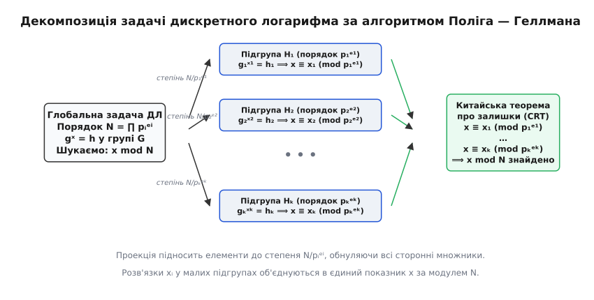
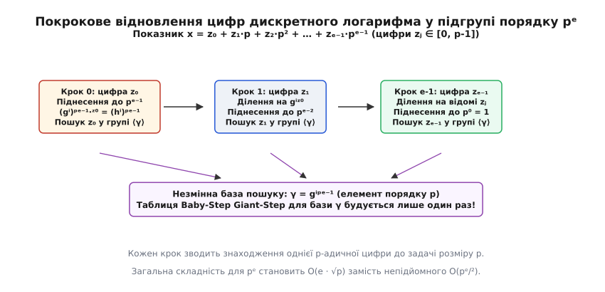
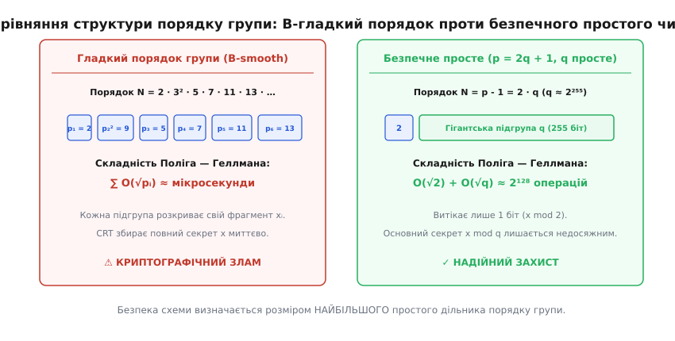

# Алгоритм Поліга — Геллмана

<preknowlist>
- [Групи, підгрупи й теорема Лагранжа](book:math/group-theory) — що таке порядок групи, порядок елемента та подільність порядку підгрупи за теоремою Лагранжа.
- [Проблема дискретного логарифма](book:math/discrete-logarithm) — формулювання задачі обчислення показника степеня за відомою основою та результатом.
- [Китайська теорема про залишки](book:math/chinese-remainder-theorem) — як однозначно відновити ціле число за його залишками від ділення на попарно взаємно прості модулі.
- [Прості числа Софі Жермен і безпечні прості](book:math/germain-primes) — структура простих чисел вигляду p = 2q + 1 для захисту від декомпозиції порядку групи.
</preknowlist>

Уявіть ситуацію: інженер налаштовує криптографічний протокол обміну ключами Діффі — Геллмана для захисту банківських транзакцій. Для генерації ключів він обирає гігантський 2048-бітний простий модуль `p` — число із понад 600 десяткових цифр. Інженер переконаний у непорушності захисту, адже повний перебір простору з `2²⁰⁴⁸` можливих значень вимагав би більше енергії та часу, ніж існує в усьому спостережуваному Всесвіті. Проте сторонній спостерігач, перехопивши відкритий ключ сесії, запускає спеціальну програму на звичайному портативному ноутбуці й знаходить приватний ключ менш ніж за 5 мілісекунд.

Причина цієї катастрофи криється не в обчислювальній потужності атакуючого і не в помилці реалізації шифру, а у прихованій анатомії алгебраїчної структури. Складність задачі дискретного логарифмування визначається не розміром самого простого модуля `p`, а тим, як розкладається на прості множники **порядок мультиплікативної групи** `N = p - 1`. Якщо число `N` розпадається на добуток дрібних простих множників, уся захисна стіна миттєво розпадається на купу дрібних незалежних фрагментів.

Алгоритм Поліга — Геллмана — це фундаментальний метод обчислювальної алгебри, який реалізує принцип «розділяй і володарюй» для груп складеного порядку. Він перетворює монолітну й гадано нерозв'язну задачу на серію крихітних підзадач, розв'язує кожну з них окремо, а потім зшиває отримані уламки в точну відповідь за допомогою Китайської теореми про залишки. Розуміння цього механізму є ключем до проектування безпечних криптографічних протоколів, від цифрових підписів DSA до сучасних еліптичних кривих.

---

### Анатомія протоколу Діффі — Геллмана та ілюзія безпеки

Щоб чітко побачити корінь проблеми, пригадаймо, як саме працює класичний протокол узгодження ключів Діффі — Геллмана у скінченному полі:

1. **Загальнодоступні параметри:** Сторони заздалегідь домовляються про спільний великий простий модуль `p` та твірний елемент (базу піднесення до степеня) `g` у мультиплікативній групі залишків `Z_p^*`.
2. **Генерація приватних ключів:**
   - Аліса генерує таємне випадкове число `a` (мала латинська літера «а») в діапазоні від `1` до `p - 2`.
   - Боб генерує таємне випадкове число `b` (мала латинська літера «бе») в тому самому діапазоні.
3. **Обмін відкритими ключами:**
   - Аліса обчислює свій відкритий ключ `A = gᵃ mod p` і надсилає його Бобу відкритим незахищеним каналом зв'язку.
   - Боб обчислює свій відкритий ключ `B = gᵇ mod p` і надсилає його Алісі.
4. **Обчислення спільного сесійного секрету:**
   - Аліса бере отриманий від Боба елемент `B` і підносить його до свого таємного степеня `a`: `S = Bᵃ mod p = (gᵇ)ᵃ mod p = g^{ab} mod p`.
   - Боб бере отриманий від Аліси елемент `A` і підносить його до свого таємного степеня `b`: `S = Aᵇ mod p = (gᵃ)ᵇ mod p = g^{ab} mod p`.

Обидві сторони отримали одне й те саме таємне значення `S = g^{ab} mod p`, яке стає основою для симетричного шифрування сесії (наприклад, алгоритмом AES).

Зловмисник, який пасивно прослуховує мережевий трафік, бачить загальні параметри `p` та `g`, а також відкриті ключі `A` і `B`. Щоб прочитати зашифрований трафік, зловмиснику необхідно знайти хоча б один із таємних показників `a` або `b`. Тобто розв'язати рівняння:

```
gᵃ ≡ A (mod p)
```

Ця задача є класичним формулюванням проблеми дискретного логарифма (Discrete Logarithm Problem, DLP).

Наївна інтуїція підказує: якщо модуль `p` містить понад 2000 бітів, то простір пошуку складається з `p ≈ 2²⁰⁰⁰` варіантів. Прямий перебір такої кількості чисел неможливий. Проте математична структура групи `Z_p^*` володіє внутрішнім розшаруванням на підгрупи, яке повністю руйнує це наївне припущення, якщо порядок групи не був обраний зі спеціальними застереженнями.

---

### Декомпозиція алгебраїчного простору: суть проблеми

Сформулюємо задачу в загальному абстрактному вигляді та назвемо кожен математичний об'єкт словами при його першій появі.

Нехай задано скінченну циклічну групу `G` з операцією множення. Загальна кількість елементів у цій групі називається її **порядком** і позначається великою латинською літерою `N`. Нехай елемент `g` (мала латинська літера «же») є твірним елементом (генератором) групи `G`, тобто послідовні степені елемента `g`, а саме `g⁰, g¹, g², …, gᴺ⁻¹`, вичерпують усі `N` елементів групи.

Нехай у групі задано деякий цільовий елемент `h` (мала латинська літера «аш»). Задача полягає в тому, щоб знайти невідомий цілочисловий показник степеня `x` (мала латинська літера «ікс») у діапазоні від `0` до `N - 1`, який задовольняє рівність:

```
gˣ = h    у групі G
```

За основною теоремою арифметики будь-яке натуральне число `N > 1` однозначно розкладається на добуток степенів простих чисел. Запишемо канонічний розклад порядку групи `N`:

```
N = p₁ᵉ¹ · p₂ᵉ² · … · pₖᵉᵏ
```

У цьому розкладі:
- `k` (мала латинська літера «ка») — кількість різних простих дільників;
- кожне число `pᵢ` (мала літера «пе» з нижнім індексом `i`) — окреме просте число, причому всі `pᵢ` попарно різні: `p₁ < p₂ < … < pₖ`;
- кожне число `eᵢ` (мала літера «е» з нижнім індексом `i`) — натуральний показник степеня, `eᵢ ≥ 1`.

Згідно з фундаментальною теоремою про будову скінченних абелевих груп, будь-яка скінченна циклічна група `G` порядку `N` ізоморфна прямому добутку своїх примарних циклічних підгруп (силовських підгруп):

```
G ≅ H₁ × H₂ × … × Hₖ
```

де кожна підгрупа `Hᵢ` має порядок `|Hᵢ| = pᵢᵉⁱ`.

У кільці залишків за показником степеня цей ізоморфізм відповідає розщепленню кільця лишків `Z_N` на прямий добуток кілець лишків за примарними модулями:

```
Z_N ≅ Z_{p₁ᵉ¹} × Z_{p₂ᵉ²} × … × Z_{pₖᵉᵏ}
```

Це означає, що будь-який елемент `x ∈ Z_N` однозначно й повністю визначається кортежем своїх залишків `(x₁, x₂, …, xₖ)`, де:

```
x₁ = x mod p₁ᵉ¹
x₂ = x mod p₂ᵉ²
…
xₖ = x mod pₖᵉᵏ
```

Якщо розв'язувати задачу `gˣ = h` безпосередньо у вихідній великій групі `G`, найкращі загальні алгоритми (наприклад, алгоритм «крок немовляти — крок велетня» або ро-метод Поларда) вимагають часу порядку `O(√N)` групових операцій. Для числа `N ≈ 2²⁵⁶` корінь квадратний становить `2¹²⁸` операцій — це практично нездоланний бар'єр для класичних обчислювачів.

Ідея Поліга і Геллмана полягає в тому, щоб знайти шуканий показник `x` не одразу за модулем `N`, а знайти його залишки за кожним примарним модулем `pᵢᵉⁱ` окремо. Оскільки всі модулі `pᵢᵉⁱ` є степенями різних простих чисел, вони попарно взаємно прості. Знаючи всі залишки `xᵢ`, єдине вихідне значення `x mod N` можна відновити за частки секунди за допомогою Китайської теореми про залишки.

---

### Механізм проекції: як виділити окрему підгрупу

Щоб знайти залишок `xᵢ = x mod pᵢᵉⁱ`, необхідно ізолювати підгрупу порядку `pᵢᵉⁱ`, примусивши групу «забути» про існування всіх інших простих множників.

Позначимо розмір поточної цільової підгрупи як `Mᵢ = pᵢᵉⁱ`. Визначимо доповнювальний дільник (кофактор) `dᵢ` (мала латинська літера «де» з індексом `i`) як частку від ділення повного порядку `N` на `Mᵢ`:

```
dᵢ = N / (pᵢᵉⁱ) = N / Mᵢ
```

Число `dᵢ` містить у собі добуток усіх інших простих множників порядку `N`, крім обраного множника `pᵢᵉⁱ`.

Тепер піднесемо обидві частини вихідного рівняння `gˣ = h` до степеня `dᵢ`:

```
(gˣ)^dᵢ = h^dᵢ
```

Застосуємо властивість піднесення степеня до степеня й перегрупуємо вираз:

```
(g^dᵢ)ˣ = h^dᵢ
```

Введемо нові позначення для спроектованих елементів:
- `gᵢ = g^dᵢ` — спроектований генератор;
- `hᵢ = h^dᵢ` — спроектований цільовий елемент.

Дослідимо мультиплікативний порядок елемента `gᵢ`. За теоремою Лагранжа для будь-якого елемента групи `g` виконується рівність `gᴺ = e` (де `e` — нейтральний елемент групи, тобто одиниця).

Обчислимо результат піднесення `gᵢ` до степеня `pᵢᵉⁱ`:

```
(gᵢ)^(pᵢᵉⁱ)
= (g^dᵢ)^(pᵢᵉⁱ)              [підстановка визначення gᵢ = g^dᵢ]
= g^(dᵢ · pᵢᵉⁱ)              [властивість степенів: множення показників]
= g^( (N / pᵢᵉⁱ) · pᵢᵉⁱ )    [підстановка визначення dᵢ = N / pᵢᵉⁱ]
= g^N                        [скорочення однакових множників]
= 1                          [оскільки порядок генератора g дорівнює N]
```

Оскільки `g` був твірним елементом порядку `N`, жоден менший додатний степінь не перетворює `g` на одиницю. Отже, мультиплікативний порядок елемента `gᵢ` дорівнює **точно `pᵢᵉⁱ`**.

Елемент `gᵢ` породжує власну циклічну підгрупу `Hᵢ = ⟨gᵢ⟩`, що складається рівно з `pᵢᵉⁱ` елементів.


*Схема редукції: вихідна задача у великій групі G проектується піднесенням до степеня N/pᵢᵉⁱ на систему малих підгруп Hᵢ, де дискретний логарифм xᵢ обчислюється незалежно. Знайдені залишки збираються через CRT у глобальний показник x.*

Оскільки генератор `gᵢ` має порядок `pᵢᵉⁱ`, значення виразу `(gᵢ)ˣ` залежить виключно від залишку показника `x` від ділення на `pᵢᵉⁱ`. Якщо записати `x = q · pᵢᵉⁱ + xᵢ` (де `q` — неповна частка, а `xᵢ` — залишок у межах від `0` до `pᵢᵉⁱ - 1`), то:

```
(gᵢ)ˣ
= (gᵢ)^(q · pᵢᵉⁱ + xᵢ)           [запис x через частку і залишок]
= ((gᵢ)^(pᵢᵉⁱ))^q · (gᵢ)^xᵢ      [розподіл степенів]
= (1)^q · (gᵢ)^xᵢ                [оскільки порядок gᵢ дорівнює pᵢᵉⁱ]
= (gᵢ)^xᵢ                        [множення на одиницю]
```

Таким чином, ми отримали редуковане рівняння дискретного логарифма всередині маленької підгрупи `Hᵢ`:

```
gᵢ^xᵢ = hᵢ    у підгрупі Hᵢ порядку pᵢᵉⁱ
```

Тепер наша мета — знайти невідомий залишок `xᵢ ∈ {0, 1, …, pᵢᵉⁱ - 1}`.

---

### Розв'язання всередині підгрупи: техніка порозрядного ліфтингу

Якщо показник степеня простого числа дорівнює одиниці (`eᵢ = 1`), то підгрупа `Hᵢ` має простий порядок `pᵢ`. У цьому разі рівняння `gᵢ^xᵢ = hᵢ` розв'язується безпосередньо стандартним алгоритмом «крок немовляти — крок велетня» (Baby-step Giant-step) за час `O(√pᵢ)` операцій.

Але що робити, коли показник `eᵢ > 1` (наприклад, `pᵢ = 2`, а `eᵢ = 64`)? Пряме застосування алгоритму BSGS для групи розміру `pᵢᵉⁱ` вимагало б `O(√(pᵢᵉⁱ)) = O(pᵢ^{eᵢ/2})` операцій, що для `2⁶⁴` дає непідйомні `2³²` кроків.

Стівен Поліг і Мартін Геллман запропонували елегантний метод **порозрядного визначення (ліфтингу)**, який знаходить значення `xᵢ` за час `O(eᵢ · √pᵢ)` замість експоненційного `O(pᵢ^{eᵢ/2})`.

Запишемо невідомий залишок `xᵢ` у позиційній системі числення за основою `pᵢ` (у вигляді `p`-адичного полінома):

```
xᵢ = z₀ + z₁·pᵢ + z₂·pᵢ² + … + z_{eᵢ-1}·pᵢ^{eᵢ-1}
```

У цьому записі кожна невідома цифра `zⱼ` (де індекс `j` змінюється від `0` до `eᵢ - 1`) є цілим числом у діапазоні від `0` до `pᵢ - 1`.

#### Крок 1: Знаходження наймолодшої цифри z₀

Визначимо базовий елемент простого порядку `γ` (грецька літера гамма):

```
γ = gᵢ^(pᵢ^{eᵢ - 1})
```

Оскільки `gᵢ` має порядок `pᵢᵉⁱ`, елемент `γ` має порядок рівно `pᵢ`, оскільки `γ^{pᵢ} = gᵢ^{pᵢᵉⁱ} = 1`.

Піднесемо спроектоване рівняння `gᵢ^xᵢ = hᵢ` до степеня `pᵢ^{eᵢ - 1}`:

```
(gᵢ^xᵢ)^(pᵢ^{eᵢ - 1}) = hᵢ^(pᵢ^{eᵢ - 1})
```

Підставимо у ліву частину розклад `xᵢ = z₀ + z₁·pᵢ + z₂·pᵢ² + … + z_{eᵢ-1}·pᵢ^{eᵢ-1}`:

```
(gᵢ^xᵢ)^(pᵢ^{eᵢ - 1})
= gᵢ^( (z₀ + z₁·pᵢ + z₂·pᵢ² + …) · pᵢ^{eᵢ - 1} )               [розкриття показника]
= gᵢ^( z₀·pᵢ^{eᵢ - 1} + z₁·pᵢᵉⁱ + z₂·pᵢ^{eᵢ+1} + … )           [множення на pᵢ^{eᵢ - 1}]
= gᵢ^( z₀·pᵢ^{eᵢ - 1} ) · (gᵢ^{pᵢᵉⁱ})^(z₁ + z₂·pᵢ + …)         [виділення доданків, кратних pᵢᵉⁱ]
= (gᵢ^(pᵢ^{eᵢ - 1}))^z₀ · (1)^(z₁ + z₂·pᵢ + …)                 [оскільки gᵢ^{pᵢᵉⁱ} = 1]
= γ^z₀                                                         [за визначенням γ]
```

Усі старші розряди `z₁, z₂, …` помножилися на `pᵢ` і перетворилися на степені, кратні порядку групи `pᵢᵉⁱ`, тому вони повністю зникли.

Ми отримали просте рівняння для знаходження однієї невідомої цифри `z₀`:

```
γ^z₀ = hᵢ^(pᵢ^{eᵢ - 1})
```

Оскільки `z₀ ∈ {0, 1, …, pᵢ - 1}`, а основа `γ` має порядок `pᵢ`, це звичайний дискретний логарифм у підгрупі простого порядку `pᵢ`. Він розв'язується за `O(√pᵢ)` операцій.

#### Крок 2: Індуктивний перехід для довільної цифри zⱼ

Припустимо, що перші `j` цифр, а саме `z₀, z₁, …, zⱼ₋₁`, уже успішно знайдені.

Позначимо накопичений відомий префікс показника як:

```
x_{(j)} = z₀ + z₁·pᵢ + … + zⱼ₋₁·pᵢʲ⁻¹
```

Тоді повний показник `xᵢ` можна подати як суму відомої та невідомої частин:

```
xᵢ = x_{(j)} + pᵢʲ · (zⱼ + zⱼ₊₁·pᵢ + … + z_{eᵢ-1}·pᵢ^{eᵢ-1-j})
```

Вилучимо вплив уже відомої частини, домноживши `hᵢ` на обернений елемент `gᵢ^(-x_{(j)})`:

```
h_{(j)} = hᵢ · (gᵢ)^{-x_{(j)}} = gᵢ^(xᵢ - x_{(j)})
```

Тепер піднесемо модифікований елемент `h_{(j)}` до ізолюючого степеня `pᵢ^{eᵢ - 1 - j}`:

```
(h_{(j)})^(pᵢ^{eᵢ - 1 - j})
= ( gᵢ^( pᵢʲ · (zⱼ + zⱼ₊₁·pᵢ + …) ) )^(pᵢ^{eᵢ - 1 - j})        [підстановка xᵢ - x_{(j)}]
= gᵢ^( pᵢʲ · pᵢ^{eᵢ - 1 - j} · (zⱼ + zⱼ₊₁·pᵢ + …) )           [множення показників]
= gᵢ^( pᵢ^{eᵢ - 1} · (zⱼ + zⱼ₊₁·pᵢ + …) )                      [спрощення: pᵢʲ · pᵢ^{eᵢ-1-j} = pᵢ^{eᵢ-1}]
= gᵢ^( zⱼ·pᵢ^{eᵢ - 1} ) · (gᵢ^{pᵢᵉⁱ})^(zⱼ₊₁ + …)               [відокремлення старших членів]
= γ^zⱼ                                                         [оскільки gᵢ^{pᵢᵉⁱ} = 1 та γ = gᵢ^{pᵢ^{eᵢ-1}}]
```

Отримано загальну рекурентну формулу для визначення розряду `zⱼ`:

```
γ^zⱼ = ( hᵢ · gᵢ^(-(z₀ + z₁·pᵢ + … + zⱼ₋₁·pᵢʲ⁻¹)) )^(pᵢ^{eᵢ - 1 - j})
```


*Порозрядний ліфтинг: на кожному кроці j відомий префікс віднімається з показника, а піднесення до степеня pᵢ^{eᵢ-1-j} ізолює цифру zⱼ відносно незмінного генератора γ.*

Зверніть увагу на ключову обставину: **основа `γ` залишається незмінною для всіх `eᵢ` розрядів**. Це означає, що таблицю пошуку для алгоритму Baby-step Giant-step потрібно побудувати лише один раз, після чого всі `eᵢ` розрядів обчислюються практично миттєво.

Повний алгебраїчний розбір коректності та крайових випадків ліфтингу наведено у вставці [🧮 Повний алгебраїчний розбір розширення по степенях простого дільника](book:math/pohlig-hellman-algorithm/math-pohlig-hellman-prime-power.md).

---

### Збирання розв'язку: Китайська теорема про залишки

Після того як для кожного простого множника `pᵢᵉⁱ` знайдено відповідний залишок `xᵢ`, ми отримуємо класичну систему модульних порівнянь:

```
x ≡ x₁ (mod p₁ᵉ¹)
x ≡ x₂ (mod p₂ᵉ²)
…
x ≡ xₖ (mod pₖᵉᵏ)
```

Оскільки всі числа `Mᵢ = pᵢᵉⁱ` є степенями різних простих чисел, їхні найбільші спільні дільники для будь-якої пари індексів `i ≠ j` дорівнюють одиниці: `НСД(Mᵢ, Mⱼ) = 1`.

За [Китайською теоремою про залишки](book:math/chinese-remainder-theorem) ця система має єдиний розв'язок за модулем повного порядку `N = M₁ · M₂ · … · Mₖ`.

Явна конструкція Гаусса для знаходження розв'язку `x` будується за три кроки:

1. Для кожного індексу `i` від `1` до `k` обчислюємо добуток усіх інших модулів:
   ```
   Nᵢ = N / Mᵢ
   ```
2. Знаходимо мультиплікативний обернений елемент `yᵢ` до числа `Nᵢ` за модулем `Mᵢ` за допомогою розширеного алгоритму Евкліда:
   ```
   Nᵢ · yᵢ ≡ 1 (mod Mᵢ)
   ```
3. Обчислюємо шукане число `x` за явною сумою:
   ```
   x = ( ∑_{i=1}^k xᵢ · Nᵢ · yᵢ ) mod N
   ```

Перевіримо, чому ця формула дає точний результат для будь-якого фіксованого модуля `Mⱼ`. Для кожного доданка з `i ≠ j` число `Nᵢ` ділиться націло на `Mⱼ`, тому такий доданок дорівнює нулю за модулем `Mⱼ`. Єдиний ненульовий доданок при `i = j` дає:

```
x mod Mⱼ
= (xⱼ · Nⱼ · yⱼ) mod Mⱼ      [усі доданки з i ≠ j кратні Mⱼ]
= xⱼ · (Nⱼ · yⱼ mod Mⱼ)      [винесення множника]
= xⱼ · 1                     [оскільки Nⱼ · yⱼ ≡ 1 mod Mⱼ]
= xⱼ                         [отримано вихідний залишок]
```

Це доводить, що отримане число `x` точно задовольняє всі порівняння системи й є шуканим дискретним логарифмом.

---

### Наскрізний числовий розрахунок від початку до кінця

Розберемо повний приклад з реальними числами, розрахувавши кожен крок вручну.

Візьмемо мультиплікативну групу за простим модулем `p_{mod} = 31`. Порядок цієї групи дорівнює `N = p_{mod} - 1 = 30`.

Канонічний розклад порядку групи на прості множники:

```
30 = 2¹ · 3¹ · 5¹
```

Маємо три прості дільники: `p₁ = 2` (з показником `e₁ = 1`), `p₂ = 3` (з `e₂ = 1`), `p₃ = 5` (з `e₃ = 1`).

Нехай твірний елемент групи `g = 3`, а цільовий елемент `h = 13`. Наше завдання — знайти такий показник `x ∈ {0, 1, …, 29}`, що:

```
3ˣ ≡ 13 (mod 31)
```

#### Крок 1: Обчислення залишку x₁ за модулем 2

Для дільника `p₁ = 2` обчислюємо кофактор:

```
d₁ = 30 / 2 = 15
```

Спроектуємо основу `g` та цільове значення `h` у підгрупу порядку 2 піднесенням до степеня 15 за модулем 31:

```
g₁
= 3¹⁵ mod 31                 [визначення спроектованого генератора]
= (3³)⁵ mod 31               [групування показника 15 = 3 · 5]
= (27)⁵ mod 31               [обчислення 3³ = 27]
= (-4)⁵ mod 31               [заміна 27 ≡ -4 mod 31]
= -1024 mod 31               [піднесення (-4)⁵ = -1024]
= -33 · 31 - 1               [виділення цілої частини від ділення]
= -1                         [залишок за модулем 31]
= 30                         [канонічний залишок 30 ≡ -1 mod 31]
```

Отже, `g₁ = 30`.

Тепер спроектуємо цільовий елемент `h = 13`:

```
h₁
= 13¹⁵ mod 31                                                [визначення спроектованої цілі]
= (13⁸ · 13⁴ · 13² · 13¹) mod 31                             [розклад показника 15 у двійкову суму 8+4+2+1]
= (7 · 10 · 14 · 13) mod 31                                  [підстановка квадратів 13²≡14, 13⁴≡10, 13⁸≡7]
= (70 · 182) mod 31                                          [попарне множення множників]
= (8 · 27) mod 31                                            [редукція залишків 70≡8 та 182≡27 mod 31]
= (8 · (-4)) mod 31                                          [заміна 27 ≡ -4 mod 31]
= -32 mod 31                                                 [множення 8 · (-4) = -32]
= 30                                                         [оскільки -32 = -2·31 + 30 ≡ 30 mod 31]
```

Отримуємо рівняння у підгрупі порядку 2:

```
30^{x₁} ≡ 30 (mod 31)
```

Оскільки `30⁰ = 1`, а `30¹ = 30`, знаходимо:

```
x₁ = 1 mod 2
```

#### Крок 2: Обчислення залишку x₂ за модулем 3

Для дільника `p₂ = 3` обчислюємо кофактор:

```
d₂ = 30 / 3 = 10
```

Спроектуємо основу `g = 3`:

```
g₂
= 3¹⁰ mod 31                 [визначення спроектованого генератора g₂]
= (3⁵)² mod 31               [подання показника 10 = 5 · 2]
= (243)² mod 31              [обчислення степеня 3⁵ = 243]
= (-5)² mod 31               [оскільки 243 = 7 · 31 + 26 ≡ -5 mod 31]
= 25                         [піднесення (-5)² = 25 mod 31]
```

Спроектуємо цільовий елемент `h = 13`:

```
h₂
= 13¹⁰ mod 31                [визначення спроектованої цілі h₂]
= (13⁸ · 13²) mod 31         [розклад показника 10 = 8 + 2]
= (7 · 14) mod 31            [підстановка обчислених степенів 13⁸≡7 та 13²≡14]
= 98 mod 31                  [множення 7 · 14 = 98]
= 5                          [оскільки 98 = 3 · 31 + 5 ≡ 5 mod 31]
```

Отримуємо рівняння у підгрупі порядку 3:

```
25^{x₂} ≡ 5 (mod 31)
```

Перевіримо можливі значення `x₂ ∈ {0, 1, 2}`:
- `25⁰ = 1`
- `25¹ = 25`
- `25² = 625 = 20 · 31 + 5 ≡ 5 (mod 31)`

Знаходимо залишок:

```
x₂ = 2 mod 3
```

#### Крок 3: Обчислення залишку x₃ за модулем 5

Для дільника `p₃ = 5` обчислюємо кофактор:

```
d₃ = 30 / 5 = 6
```

Спроектуємо основу `g = 3`:

```
g₃
= 3⁶ mod 31                  [визначення спроектованого генератора g₃]
= (3³)² mod 31               [подання показника 6 = 3 · 2]
= (-4)² mod 31               [оскільки 3³ = 27 ≡ -4 mod 31]
= 16                         [піднесення (-4)² = 16 mod 31]
```

Спроектуємо цільовий елемент `h = 13`:

```
h₃
= 13⁶ mod 31                 [визначення спроектованої цілі h₃]
= (13⁴ · 13²) mod 31         [подання показника 6 = 4 + 2]
= (10 · 14) mod 31           [підстановка степенів 13⁴≡10 та 13²≡14]
= 140 mod 31                 [множення 10 · 14 = 140]
= 16                         [оскільки 140 = 4 · 31 + 16 ≡ 16 mod 31]
```

Отримуємо рівняння у підгрупі порядку 5:

```
16^{x₃} ≡ 16 (mod 31)
```

Очевидно, що:

```
x₃ = 1 mod 5
```

#### Крок 4: Відновлення відповіді за Китайською теоремою про залишки

Маємо систему порівнянь:

```
x ≡ 1 (mod 2)
x ≡ 2 (mod 3)
x ≡ 1 (mod 5)
```

Розв'яжемо систему послідовно:
1. З перших двох порівнянь `x ≡ 1 (mod 2)` та `x ≡ 2 (mod 3)`:
   - Числа, що дають залишок 2 за модулем 3: `2, 5, 8, 11, …`
   - Перевіряємо непарність (за модулем 2): число `5` непарне (`5 ≡ 1 mod 2`).
   - Отже, `x ≡ 5 (mod 6)`.
2. Тепер об'єднуємо `x ≡ 5 (mod 6)` та `x ≡ 1 (mod 5)`:
   - Перебираємо числа, що дають 5 за модулем 6 у межах до 30: `5, 11, 17, 23, 29`.
   - Перевіряємо їхні залишки від ділення на 5:
     - `5 mod 5 = 0`
     - `11 mod 5 = 1`  ← Збіг!

Отримуємо остаточний результат:

```
x = 11
```

#### Крок 5: Пряма перевірка

Перевіримо правильність знайденого значення `x = 11`, піднісши основу `3` до степеня `11` за модулем 31:

```
3¹¹ mod 31
= (3⁶ · 3⁵) mod 31           [розклад показника 11 = 6 + 5]
= (16 · (-5)) mod 31         [підстановка 3⁶≡16 та 3⁵≡-5 mod 31]
= -80 mod 31                 [множення 16 · (-5) = -80]
= -3 · 31 + 13               [виділення цілого кратного 31]
= 13                         [канонічний залишок mod 31]
```

Результат `13` точно збігається з вихідним цільовим значенням `h`.

Практичну реалізацію всього конвеєра обчислень мовами Python та C++ наведено у вставці [⚙️ Практична реалізація алгоритму Поліга — Геллмана на мовах Python та C++](book:math/pohlig-hellman-algorithm/proj-pohlig-hellman.md).

---

### Обчислювальна складність: чому Поліг — Геллман ламає наївні системи

Підсумуємо загальні витрати обчислювальних ресурсів для довільної групи порядку `N = ∏_{i=1}^k pᵢᵉⁱ`.

Для кожного простого множника `pᵢᵉⁱ` алгоритм виконує:
1. **Проекцію елементів:** обчислення степенів `g^{N/pᵢᵉⁱ}` та `h^{N/pᵢᵉⁱ}`, що вимагає `O(log N)` операцій множення в групі.
2. **Побудову генератора γ та таблиці BSGS:** піднесення до степеня `pᵢ^{eᵢ-1}` та створення хеш-таблиці розміру `O(√pᵢ)` за `O(√pᵢ)` операцій.
3. **Визначення `eᵢ` розрядів:** `eᵢ` кроків піднесення до степеня та пошуку за готовою таблицею за час `O(eᵢ · (log N + √pᵢ))`.
4. **Збирання за CRT:** розширений алгоритм Евкліда для `k` модулів, що займає `O(k · log² N)` бітових операцій.

Загальна часова складність алгоритму Поліга — Геллмана становить:

```
T_{PH} = O( ∑_{i=1}^k eᵢ · (log N + √pᵢ) )
```

Порівняймо це зі складністю загальних методів у групі порядку `N`, яка дорівнює `T_{generic} = O(√N)`.

У теорії чисел ціле число `N` називають **`B`-гладким (B-smooth)**, якщо всі його прості дільники не перевищують деякої межі `B` (тобто `pᵢ ≤ B` для всіх `i`).

Розглянемо практичний приклад: нехай порядок групи має розмір 256 бітів (`N ≈ 2²⁵⁶`).
- Якщо порядок `N` є великим простим числом, складність розв'язання становить `O(√N) ≈ 2¹²⁸` операцій. Щоб виконати стільки операцій, усім суперкомп'ютерам людства знадобилися б мільйони років.
- Якщо ж порядок `N` виявився `2²⁰`-гладким (тобто всі `pᵢ ≤ 2²⁰ ≈ 10⁶`), то корінь із найбільшого дільника становить `√pᵢ ≤ 2¹⁰ = 1024` операції! Уся сума складностей для 256 розрядів складе приблизно `256 · 1024 ≈ 2.6 · 10⁵` операцій. Цей розрахунок виконується процесором за 2 мілісекунди.

Це означає, що гладкість порядку групи повністю знищує криптографічну стійкість.

---

### Теорема Нечаєва — Шупа: оптимальність Поліга — Геллмана

Чи можна придумати ще швидший загальний алгоритм дискретного логарифмування, який працював би швидше за `O(√p_{max})`?

Відповідь на це фундаментальне теоретичне питання дали російський математик Віктор Нечаєв (1994 рік) та американський вчений Віктор Шуп (1997 рік). Вони досліджували **модель загальної групи (Generic Group Model, GGM)** — абстрактне середовище, у якому алгоритм взаємодіє з елементами групи виключно через оракул (чорну скриньку), що вміє множити два елементи та порівнювати їх на рівність, не розкриваючи внутрішнього бітового представлення.

**Теорема Нечаєва — Шупа.** *Будь-який детермінований або ймовірнісний алгоритм, який розв'язує задачу дискретного логарифма у довільній скінченній циклічній групі порядку `N = ∏ pᵢᵉⁱ` у моделі загальної групи, повинен виконати щонайменше `Ω(√p_{max})` групових операцій, де `p_{max} = max(pᵢ)` — найбільший простий дільник порядку `N`.*

Ця теорема має колосальне значення для всієї криптографії:
1. Вона доводить, що **алгоритм Поліга — Геллмана є асимптотично оптимальним** методом редукції: жоден чорноскриньковий алгоритм не може обійти бар'єр найбільшого простого дільника `p_{max}`.
2. Вона встановлює точну нижню межу криптографічної стійкості: безпека системи у загальній групі строго обмежена величиною `√p_{max}`.

Єдиним способом обійти межу Нечаєва — Шупа є відмова від моделі чорної скриньки та використання спеціальної алгебраїчної структури конкретного поля — як це робить метод решета числового поля (Number Field Sieve, NFS) та обчислення індексів (Index Calculus) для полів `F_p^*`. Проте для груп точок еліптичних кривих загального вигляду метод обчислення індексів непридатний, і стійкість еліптичної криптографії (ECC) повністю спирається на бар'єр Нечаєва — Шупа та стійкість до Поліга — Геллмана.

---

### Частковий злам та комбіновані криптоаналітичні атаки

Що відбувається, якщо порядок групи `N` не є повністю гладким, але містить як дрібні прості множники, так і один або два великі множники? Наприклад:

```
N = 2⁴ · 3³ · 5² · q
```

де `q` — велике просте число (наприклад, 160 або 200 бітів), для якого пряме обчислення `O(√q)` є відчутно ресурсомістким, але не безнадійним.

У такій ситуації криптоаналітик застосовує **частковий алгоритм Поліга — Геллмана (Partial Pohlig-Hellman)**:
1. За допомогою стандартного механізму проекції та ліфтингу обчислюються залишки невідомого ключа за всіма малими модулями:
   `x mod 16`, `x mod 27`, `x mod 25`.
2. За допомогою Китайської теореми про залишки ці часткові відповіді об'єднуються у єдиний залишок за складеним модулем `M_{smooth} = 16 · 27 · 25 = 10800`:
   `x ≡ x_{smooth} (mod 10800)`.
3. Це означає, що невідомий показник `x` можна записати у формі `x = x_{smooth} + 10800 · y`, де `y` — нова невідома величина, яка задовольняє обмеження `0 ≤ y < N / 10800`.
4. Підставивши цей вираз у вихідне рівняння, отримуємо:
   `g^{x_{smooth} + 10800 · y} = h  ⟹  (g^{10800})^y = h · g^{-x_{smooth}}`.
5. Пошуковий простір для нового невідомого `y` зменшився рівно в `10800` разів порівняно з вихідним простором `N`!

Таке звуження простору пошуку дозволяє застосувати алгоритм Полларда «для спійманих кенгуру» (Pollard's lambda algorithm for interval discrete logs) на значно меншому інтервалі, скорочуючи загальний час зламу в `√(M_{smooth})` разів.

---

### Атака затискання в малу підгрупу (Small Subgroup Confinement Attack)

Окремим небезпечним класом атак, породжених структурою Поліга — Геллмана, є активна атака затискання в підгрупу малого порядку.

Нехай Аліса та Боб виконують обмін ключами Діффі — Геллмана. Припустимо, що протокол використовує групу `Z_p^*`, порядок якої `p - 1` містить невеликий простий дільник `d` (наприклад, `d = 3` або `d = 7`). Нехай приватний довгостроковий ключ Аліси дорівнює `a`.

Зловмисник (Єва), діючи як активний посередник (Man-in-the-Middle), підміняє відкритий ключ Боба на спеціально підібраний елемент малого порядку:

```
B' = g^{(p-1)/d} mod p
```

Мультиплікативний порядок елемента `B'` дорівнює точно `d`.

Коли Аліса отримує підроблений ключ `B'`, вона обчислює спільний секрет:

```
S_{Alice} = (B')ᵃ mod p = (g^{(p-1)/d})ᵃ mod p = (B')^{a mod d} mod p
```

Оскільки порядок `B'` дорівнює `d`, значення `S_{Alice}` може набувати лише **`d` можливих значень**!

Далі Аліса використовує ключ `S_{Alice}` для шифрування першого повідомлення сесії (наприклад, надсилає повідомлення `Ciphertext = Encrypt(S_{Alice}, "OK")` з контрольною сумою чи MAC-тегом).

Єва перехоплює цей шифротекст і послідовно пробує розшифрувати його кожним із `d` можливих ключів:
- Пробує ключ для гіпотези `a mod d = 0`;
- Пробує ключ для гіпотези `a mod d = 1`;
- …
- Пробує ключ для гіпотези `a mod d = d - 1`.

Один із цих `d` ключів успішно пройде перевірку автентичності. Єва дізнається точне значення `a mod d`, витративши всього `d` спроб розшифрування!

Повторивши цю атаку для кількох різних малих дільників `d₁, d₂, …, d_m` (надсилаючи Алісі різні елементи `B'_i`), Єва збере достатню кількість залишків `a mod d_i` і за допомогою Китайської теореми про залишки повністю відновить весь приватний ключ Аліси `a`.

Саме ця вразливість спричинила реальні злами в ранніх версіях протоколів IPsec (IKE) та ряді реалізацій TLS, де не перевірялася валідність отриманих відкритих ключів.

---

### Криптографічний захист: Безпечні прості числа та підгрупи Шнорра

Відкриття алгоритму Поліга — Геллмана та атак затискання в підгрупу змусило криптографів радикально змінити правила вибору параметрів для всіх криптосистем на основі дискретного логарифма.


*Порівняння структур порядку: зліва гладкий порядок легко розпадається на незалежні прості підзадачі, які ламаються за мікросекунди; справа безпечне просте число формує монолітну підгрупу порядку q, де задача зберігає повну експоненційну складність 2¹²⁸.*

Сьогодні в інженерній практиці застосовують два головні підходи для нейтралізації атаки Поліга — Геллмана:

#### 1. Безпечні прості числа (Safe Primes)

Для класичного протоколу Діффі — Геллмана у мультиплікативних групах простий модуль `p` обирають у спеціальній формі:

```
p = 2q + 1
```

де `q` — також просте число (яке називається [простим числом Софі Жермен](book:math/germain-primes)).

У такій системі порядок мультиплікативної групи `Z_p^*` дорівнює:

```
N = p - 1 = 2 · q
```

Число `N` має лише два прості дільники: двійку `2` та гігантське просте число `q` (розміром, наприклад, 2047 бітів).

Що може зробити алгоритм Поліга — Геллмана проти такої групи?
- Для дільника `2` він миттєво знайде `x mod 2` (тобто парність невідомого ключа `x`), витративши 1 операцію. Це розкриває рівно 1 біт секрету.
- Але для знаходження `x mod q` алгоритм змушений розв'язувати дискретний логарифм у підгрупі порядку `q`, що вимагає `O(√q) ≈ 2¹⁰²⁴` операцій.

Таким чином, уся решта секретного ключа лишається абсолютно недосяжною для атакуючого.

#### 2. Підгрупи простого порядку та еліптичні криві (ECC)

Сучасні криптографічні стандарти (DSA, Ed25519, ECDSA, NIST P-256) повністю відмовилися від роботи в групах складеного порядку. Замість цього протоколи явно фіксують **підгрупу великого простого порядку `q`**.

На еліптичних кривих порядок групи точок `#E(F_p)` проектують таким чином, щоб він дорівнював:

```
#E(F_p) = h · q
```

де:
- `q` — велике просте число (наприклад, `2²⁵² + …` для Curve25519);
- `h` (мала латинська літера «аш») — малий числовий множник, так званий **кофактор** (зазвичай `h = 1`, `2`, `4` або `8`).

Щоб зловмисник не міг використати малий кофактор `h` для атаки затискання в підгрупу, протокол застосовує обов'язкові захисні заходи:
- **Перевірка валідності відкритого ключа (Public Key Validation):** перевірка того, що отримана точка належить кривій і не перетворюється на нейтральний елемент при піднесенні до степеня `q`: `q · P == O`.
- **Множення на кофактор (Cofactor Diffie-Hellman):** сторони обчислюють спільний секрет як `S = (h · a) · B`, що автоматично проектує результат у велику безпечну підгрупу порядку `q`, обнуляючи будь-які шкідливі компоненти малих порядків.

Історію того, як алгоритм Поліга — Геллмана зруйнував перші наївні реалізації протоколу Діффі — Геллмана та привів до створення сучасних стандартів IETF, докладно описано у вставці [📜 Історія відкриття алгоритму Поліга — Геллмана](book:math/pohlig-hellman-algorithm/hist-pohlig-hellman.md).

---

### Підсумковий висновок

Алгоритм Поліга — Геллмана демонструє фундаментальний принцип обчислювальної математики: **стійкість криптосистеми визначається не загальним розміром простору станів, а розміром найбільшого нерозкладного простого блоку в його структурі**.

Якщо порядок групи розпадається на добуток дрібних простих множників, складна нелінійна задача піднесення до степеня декомпозується на паралельні незалежні проекції, кожна з яких розв'язується за мізерний час, а Китайська теорема про залишки миттєво об'єднує їх у повний розв'язок. Саме тому в криптографічній інженерії вибір групи завжди починається з ретельної перевірки простоти її порядку.
